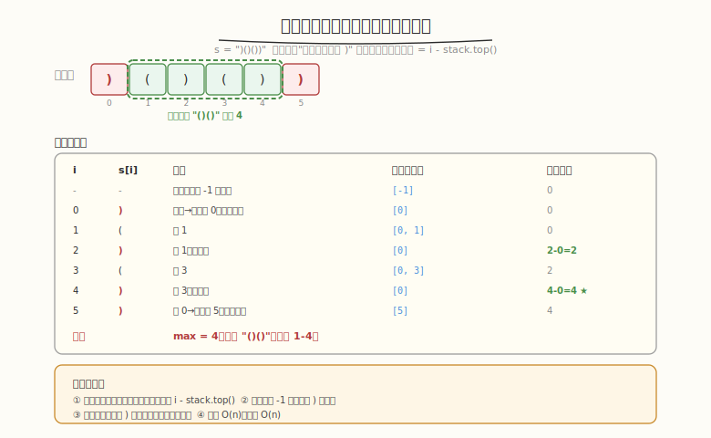
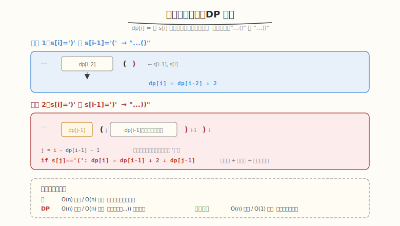

# 最长有效括号

- **题目名称**：最长有效括号
- **链接**：[32. 最长有效括号](https://leetcode.cn/problems/longest-valid-parentheses/)
- **难度**：困难
- **标签**：栈、动态规划、字符串

## 1. 题目概述

给定一个只包含 `(` 和 `)` 的字符串 `s`，找出**最长的有效（正确闭合）括号子串的长度**。

**示例 1**：

```text
输入：s = "(()"
输出：2
解释：最长有效括号子串是 "()"
```

**示例 2**：

```text
输入：s = ")()())"
输出：4
解释：最长有效括号子串是 "()()"，从下标 1 到 4
```

**示例 3**：

```text
输入：s = ""
输出：0
```

**约束条件**：

- `0 <= s.length <= 3 * 10^4`
- `s[i]` 为 `'('` 或 `')'`

> ⚠️ **子串**（连续），不是子序列（可不连续）。这是本题与"最长有效括号子序列"的关键区别。

---

## 2. 解题思路

### 2.1 暴力思路（枚举所有子串）

枚举所有子串 `O(n²)`，逐个检查是否有效 `O(n)`，总 `O(n³)`。`n=30000` 完全不可行。

### 2.2 核心解法一：栈



**关键思路**：栈中存**下标**（不是字符），用"未被匹配的下标"作为有效子串的分隔点。

**算法**：

1. 栈底始终保留一个"最后一个未被匹配的 `)` 的下标"作为基准
2. 遇到 `(` → 压入其下标
3. 遇到 `)` → 弹出栈顶（匹配一个 `(`）
   - 若弹出后栈空 → 当前 `)` 未被匹配，压入其下标作为新基准
   - 若弹出后栈非空 → 当前有效长度 = `i - stack.top()`

**为什么栈底要预放 -1？** 用 `-1` 表示"有效子串从下标 0 开始"的基准。第一个 `)` 如果匹配成功，长度 = `i - (-1) = i + 1`。

### 2.3 核心解法二：动态规划



**定义**：`dp[i]` = 以 `s[i]` 结尾的最长有效括号子串长度。

**转移**：

```text
情况 1：s[i] == ')' 且 s[i-1] == '('   → "...()"
    dp[i] = dp[i-2] + 2
    （i-2 之前的有效段 + 当前 "()" 对）

情况 2：s[i] == ')' 且 s[i-1] == ')'   → "...))"
    若 s[i - dp[i-1] - 1] == '('：
        dp[i] = dp[i-1] + 2 + dp[i - dp[i-1] - 2]
        （内部有效段 + 外层 "()" 对 + 外层之前的有效段）
    否则：
        dp[i] = 0
```

**答案**：`max(dp[i])`。

### 2.4 核心解法三：双向扫描（O(1) 空间）

从左到右扫一遍，再从右到左扫一遍，用 `left`/`right` 计数器：

- `left == right` → 记录有效长度 `2 × right`
- `right > left`（左→右）或 `left > right`（右→左）→ 重置计数

**为什么需要双向？** 单向扫描无法处理 `((()` 这种 `left` 始终 `> right` 的情况，反向扫一遍即可覆盖。

### 2.5 示例演算（栈解法）

`s = ")()())"`：

| 步骤 | i | s[i] | 操作 | 栈（下标） | 有效长度 |
|------|---|------|------|-----------|---------|
| 0 | - | - | 初始化 | [-1] | 0 |
| 1 | 0 | `)` | 弹栈→空，压 0 | [0] | 0 |
| 2 | 1 | `(` | 压 1 | [0,1] | 0 |
| 3 | 2 | `)` | 弹 1，栈非空 | [0] | 2-0=2 |
| 4 | 3 | `(` | 压 3 | [0,3] | 2 |
| 5 | 4 | `)` | 弹 3，栈非空 | [0] | 4-0=4 |
| 6 | 5 | `)` | 弹 0→空，压 5 | [5] | 4 |

最大有效长度 = **4** ✓（对应子串 `()()`，下标 1-4）

---

## 3. 参考代码

### C++

```cpp
// 方法一：栈（存下标）
class Solution {
public:
    int longestValidParentheses(string s) {
        stack<int> st;
        st.push(-1);  // 基准
        int maxLen = 0;
        for (int i = 0; i < s.size(); i++) {
            if (s[i] == '(') {
                st.push(i);
            } else {
                st.pop();
                if (st.empty()) {
                    st.push(i);  // 未匹配的 ')' 作为新基准
                } else {
                    maxLen = max(maxLen, i - st.top());
                }
            }
        }
        return maxLen;
    }
};

// 方法二：动态规划
class Solution {
public:
    int longestValidParentheses(string s) {
        int n = s.size();
        if (n < 2) return 0;
        vector<int> dp(n, 0);
        int maxLen = 0;
        for (int i = 1; i < n; i++) {
            if (s[i] == ')') {
                if (s[i-1] == '(') {
                    // "...()"
                    dp[i] = (i >= 2 ? dp[i-2] : 0) + 2;
                } else if (dp[i-1] > 0) {
                    // "...))"
                    int j = i - dp[i-1] - 1;
                    if (j >= 0 && s[j] == '(') {
                        dp[i] = dp[i-1] + 2 + (j >= 1 ? dp[j-1] : 0);
                    }
                }
                maxLen = max(maxLen, dp[i]);
            }
        }
        return maxLen;
    }
};

// 方法三：双向扫描 O(1) 空间
class Solution {
public:
    int longestValidParentheses(string s) {
        int left = 0, right = 0, maxLen = 0;
        // 左→右
        for (char c : s) {
            if (c == '(') left++;
            else right++;
            if (left == right) maxLen = max(maxLen, 2 * right);
            else if (right > left) left = right = 0;
        }
        left = right = 0;
        // 右→左
        for (int i = s.size() - 1; i >= 0; i--) {
            if (s[i] == '(') left++;
            else right++;
            if (left == right) maxLen = max(maxLen, 2 * left);
            else if (left > right) left = right = 0;
        }
        return maxLen;
    }
};
```

### Python

```python
# 方法一：栈
def longestValidParentheses(s: str) -> int:
    stack = [-1]
    max_len = 0
    for i, c in enumerate(s):
        if c == '(':
            stack.append(i)
        else:
            stack.pop()
            if not stack:
                stack.append(i)
            else:
                max_len = max(max_len, i - stack[-1])
    return max_len

# 方法二：动态规划
def longestValidParentheses_dp(s: str) -> int:
    n = len(s)
    if n < 2:
        return 0
    dp = [0] * n
    max_len = 0
    for i in range(1, n):
        if s[i] == ')':
            if s[i-1] == '(':
                dp[i] = (dp[i-2] if i >= 2 else 0) + 2
            elif dp[i-1] > 0:
                j = i - dp[i-1] - 1
                if j >= 0 and s[j] == '(':
                    dp[i] = dp[i-1] + 2 + (dp[j-1] if j >= 1 else 0)
            max_len = max(max_len, dp[i])
    return max_len
```

---

## 4. 复杂度分析

| 方法 | 时间 | 空间 | 特点 |
|------|------|------|------|
| **栈** | `O(n)` | `O(n)` | 直观，存下标是关键技巧 |
| **DP** | `O(n)` | `O(n)` | 状态转移清晰，但 `...))` 情况推导复杂 |
| **双向扫描** | `O(n)` | `O(1)` | 最优空间，需双向处理边界情况 |

> 💡 **面试推荐**：先讲栈解法（直观易实现），再提 DP（展示思维深度），最后说双向扫描 O(1) 空间（展示优化意识）。

---

## 5. 扩展：与 AI Infra 的关联

括号匹配的本质是**状态追踪**——用栈维护"未闭合的状态"，遇到匹配时消解。这与推理系统中的状态管理同构：

1. **请求状态机**：vLLM 的 `WAITING → RUNNING → FINISHED` 状态流转，就像括号的 `(` 压栈 → `)` 弹栈。Scheduler 每轮检查哪些请求"闭合"（完成生成），哪些仍在"打开"（运行中）。
2. **KV Cache 生命周期**：请求开始时分配 KV Cache block（压栈），结束时释放（弹栈）。PagedAttention 的 block table 维护"哪些 block 还在使用"，本质是括号匹配的变体。
3. **嵌套结构处理**：Transformer 的多层注意力计算、speculative decoding 的 draft-verify 嵌套，都需要栈式管理"进入-退出"的层次关系。

---

## 6. 面试要点

1. **栈解法为什么存下标而不是存字符？**

   - 存字符只能判断"是否匹配"，无法计算"有效长度"
   - 存下标后，`i - stack.top()` 直接给出当前有效子串长度
   - 栈底保留"最后一个未匹配的 `)` 的下标"作为基准分隔点

2. **DP 解法中 `...))` 情况的 `j = i - dp[i-1] - 1` 怎么推导？**

   - `dp[i-1]` 是以 `s[i-1]` 结尾的有效长度，意味着 `s[i-dp[i-1]]` 到 `s[i-1]` 都是有效的
   - 要让 `s[i]=')'` 闭合，需要 `s[i-dp[i-1]-1]` 是 `'('`（跳过内部有效段后找到外层 `(`）
   - `j` 就是这个外层 `(` 的下标，匹配后还要加上 `j` 之前的有效段 `dp[j-1]`

3. **双向扫描为什么需要扫两遍？**

   - 左→右扫描在 `left > right` 时不重置（如 `(((`），无法记录有效段
   - 右→左扫描在 `left > right` 时重置，恰好覆盖左→右漏掉的情况
   - 两遍扫描的并集覆盖所有情况，`O(1)` 空间

4. **栈解法中栈空时为什么要压入当前 `)` 的下标？**

   - 这个 `)` 无法被匹配（栈中没有对应的 `(`）
   - 它作为一个"分隔点"——之后的有效子串不能跨越它
   - 压入它作为新基准，后续 `i - stack.top()` 才能正确计算长度

5. **本题求的是子串还是子序列？有什么区别？**

   - **子串**（连续）：`()()` 是 `"()()"` 的子串，长度 4
   - **子序列**（可不连续）：`"(()"` 的最长有效括号子序列是 `"()"`，长度 2；但子串也是 `"()"` 长度 2
   - 区别在于 `")(("` ：子串答案 0，子序列答案 2（取第 1、2 个 `(` 配对？不，子序列也要顺序匹配）。实际"最长有效括号子序列"是另一道题，解法完全不同（贪心计数）

---

## 7. 同类练习题
- [20. 有效括号](https://leetcode.cn/problems/valid-parentheses/)：栈基础
- [22. 括号生成](https://leetcode.cn/problems/generate-parentheses/)：回溯
- [678. 有效的括号字符串](https://leetcode.cn/problems/valid-parenthesis-string/)：贪心/DP
