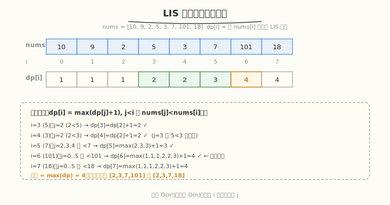
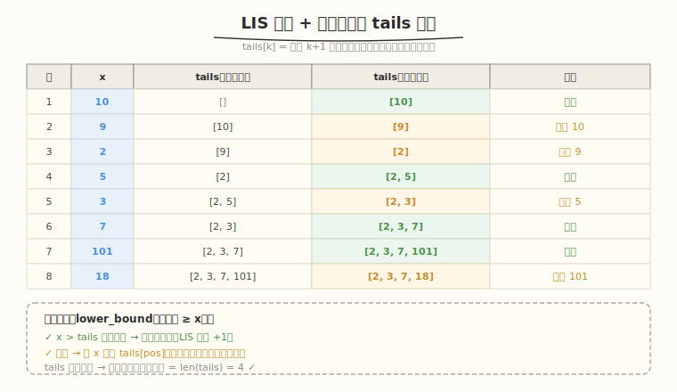

# 最长递增子序列

- **题目名称**：最长递增子序列
- **链接**：[300. 最长递增子序列](https://leetcode.cn/problems/longest-increasing-subsequence/)
- **难度**：中等
- **标签**：动态规划、二分查找、贪心

## 1. 题目概述

给定整数数组 `nums`，找到其中**最长严格递增子序列**的长度。子序列不要求连续，但要求保持原顺序。

**示例 1**：

```text
输入：nums = [10,9,2,5,3,7,101,18]
输出：4
解释：最长递增子序列是 [2,3,7,101] 或 [2,3,7,18]，长度为 4。
```

**示例 2**：

```text
输入：nums = [0,1,0,3,2,3]
输出：4
解释：[0,1,2,3]，长度为 4。
```

**示例 3**：

```text
输入：nums = [7,7,7,7,7,7,7]
输出：1
解释：严格递增，相同值不算，最长长度为 1。
```

**约束条件**：

- `1 <= nums.length <= 2500`
- `-10^4 <= nums[i] <= 10^4`

> ⚠️ **严格递增**：`nums[i] < nums[j]`（不是 `<=`），相同元素不能出现在同一子序列中。

---

## 2. 解题思路

### 2.1 暴力思路（枚举所有子序列）

枚举所有子序列（共 `2^n` 个），逐个检查是否递增。`O(2^n)`，`n=2500` 时完全不可行。

### 2.2 核心观察一：动态规划 O(n²)



**定义**：`dp[i]` = 以 `nums[i]` 结尾的最长递增子序列长度。

**转移**：

```text
dp[i] = max(dp[j] + 1)  对所有 j < i 且 nums[j] < nums[i]
dp[i] = 1               若没有满足条件的 j（自身长度为 1）
```

**答案**：`max(dp[i])`（不一定是最后一个元素结尾）。

**关键直觉**：要算"以 `i` 结尾的最长"，就往前找一个比它小的 `j`，把 `i` 接在 `j` 后面。所有合法的 `j` 里取最长的 `dp[j]`，加 1 即可。

### 2.3 核心观察二：贪心 + 二分 O(n log n)



**动机**：DP 是 `O(n²)`，能否更快？观察一个事实——

> 长度相同的递增子序列，**末尾元素越小**，后面能接上的概率越大。

**维护数组** `tails`：`tails[k]` = 长度为 `k+1` 的所有递增子序列中，**最小的末尾元素**。

**性质**：`tails` 数组**严格递增**（可用反证法证明）。

**算法**：遍历 `nums`，对每个 `x`：

1. 在 `tails` 中二分找**第一个 >= x** 的位置 `pos`（`lower_bound`）
2. 若 `x` 比 `tails` 所有元素都大 → 追加到末尾（LIS 长度 +1）
3. 否则 → 用 `x` 替换 `tails[pos]`（保持最小末尾）

**答案**：`tails` 的长度。

> ⚠️ `tails` 的长度是正确的 LIS 长度，但 `tails` 本身**不一定是合法的子序列**（替换会破坏顺序）。若要还原具体子序列，需额外记录前驱。

### 2.4 示例演算（贪心 + 二分）

`nums = [10,9,2,5,3,7,101,18]`：

| 步骤 | x | tails（变化前） | 操作 | tails（变化后） |
|------|---|----------------|------|----------------|
| 1 | 10 | [] | 追加 | [10] |
| 2 | 9 | [10] | 替换 10 | [9] |
| 3 | 2 | [9] | 替换 9 | [2] |
| 4 | 5 | [2] | 追加 | [2,5] |
| 5 | 3 | [2,5] | 替换 5 | [2,3] |
| 6 | 7 | [2,3] | 追加 | [2,3,7] |
| 7 | 101 | [2,3,7] | 追加 | [2,3,7,101] |
| 8 | 18 | [2,3,7,101] | 替换 101 | [2,3,7,18] |

最终 `tails = [2,3,7,18]`，长度 4 ✓。

---

## 3. 参考代码

### C++

```cpp
// 方法一：动态规划 O(n²)
class Solution {
public:
    int lengthOfLIS(vector<int>& nums) {
        int n = nums.size();
        vector<int> dp(n, 1);
        int ans = 1;
        for (int i = 1; i < n; i++) {
            for (int j = 0; j < i; j++) {
                if (nums[j] < nums[i]) {
                    dp[i] = max(dp[i], dp[j] + 1);
                }
            }
            ans = max(ans, dp[i]);
        }
        return ans;
    }
};

// 方法二：贪心 + 二分 O(n log n)
class Solution {
public:
    int lengthOfLIS(vector<int>& nums) {
        vector<int> tails;
        for (int x : nums) {
            auto it = lower_bound(tails.begin(), tails.end(), x);
            if (it == tails.end()) {
                tails.push_back(x);
            } else {
                *it = x;
            }
        }
        return tails.size();
    }
};
```

### Python

```python
# 方法一：动态规划 O(n²)
def lengthOfLIS_dp(nums):
    n = len(nums)
    dp = [1] * n
    for i in range(1, n):
        for j in range(i):
            if nums[j] < nums[i]:
                dp[i] = max(dp[i], dp[j] + 1)
    return max(dp)

# 方法二：贪心 + 二分 O(n log n)
import bisect

def lengthOfLIS(nums):
    tails = []
    for x in nums:
        pos = bisect.bisect_left(tails, x)  # 第一个 >= x 的位置
        if pos == len(tails):
            tails.append(x)
        else:
            tails[pos] = x
    return len(tails)
```

---

## 4. 复杂度分析

| 维度 | DP O(n²) | 贪心+二分 O(n log n) |
|------|----------|---------------------|
| **时间** | `O(n²)` | `O(n log n)` |
| **空间** | `O(n)`（dp 数组） | `O(n)`（tails 数组） |
| **能否还原子序列** | ✓ 记前驱即可 | ✗ 只得长度，需额外记录 |
| **适用场景** | `n <= 2500`，需还原序列 | `n` 较大，只要长度 |

> 💡 **二分为什么用** `lower_bound`**（第一个 >= x）而非** `upper_bound`：因为要求**严格递增**，相同元素不能并存。若允许非严格递增（`<=`），则用 `upper_bound`（第一个 > x）。

---

## 5. 扩展：输出具体的最长递增子序列

DP 法加一个 `prev` 数组记录转移来源，回溯即可：

```python
def lengthOfLIS_with_sequence(nums):
    n = len(nums)
    dp = [1] * n
    prev = [-1] * n
    for i in range(1, n):
        for j in range(i):
            if nums[j] < nums[i] and dp[j] + 1 > dp[i]:
                dp[i] = dp[j] + 1
                prev[i] = j
    # 找最大 dp 值的位置
    idx = dp.index(max(dp))
    # 回溯
    seq = []
    while idx != -1:
        seq.append(nums[idx])
        idx = prev[idx]
    return seq[::-1]  # 反转
```

---

## 6. 面试要点

1. **为什么 tails 数组一定递增？**

   - 反证：若 `tails[k] >= tails[k+1]`，说明存在长度为 `k+2` 的子序列末尾 `<= tails[k+1] <= tails[k]`，那么去掉最后一个元素得到长度 `k+1` 且末尾 `< tails[k+1] <= tails[k]`，与 `tails[k]` 是长度 `k+1` 最小末尾矛盾。

2. **严格递增 vs 非严格递增，二分怎么改？**

   - 严格递增（`<`）：用 `lower_bound`（第一个 `>= x`），相同元素会替换自己，不增长长度。
   - 非严格递增（`<=`）：用 `upper_bound`（第一个 `> x`），相同元素可追加。

3. **DP 法和贪心法的本质区别？**

   - DP：枚举所有合法前驱，保证 `dp[i]` 是以 `i` 结尾的精确最优。
   - 贪心：只维护"每个长度的最小末尾"，丢弃次优状态，用二分加速，得到长度但不保留具体序列。

4. **能否用** `O(n log n)` **还原具体子序列？**

   - 可以。对每个 `x` 记录它被放入 `tails` 时的长度 `k` 和当时的"前一个长度 `k-1` 的元素"，通过额外数组链式回溯。实现较复杂，面试中能说出思路即可。

5. **与 AI Infra 的关联？**

   - LIS 的"维护最小末尾以最大化未来可能性"和推理系统调度的"维护最小 TBT 以最大化吞吐"同构——都是**贪心地保留对未来最优的状态**。DP → 贪心的优化思路（`O(n²)` → `O(n log n)`）也呼应 kernel 优化中"减少冗余计算"的思想。

---

## 7. 同类练习题
- [354. 俄罗斯套娃信封问题](https://leetcode.cn/problems/russian-doll-envelopes/)：排序 + LIS
- [673. 最长递增子序列的个数](https://leetcode.cn/problems/number-of-longest-increasing-subsequence/)：LIS + 计数
- [300. 最长递增子序列](https://leetcode.cn/problems/longest-increasing-subsequence/)：LIS 模板
