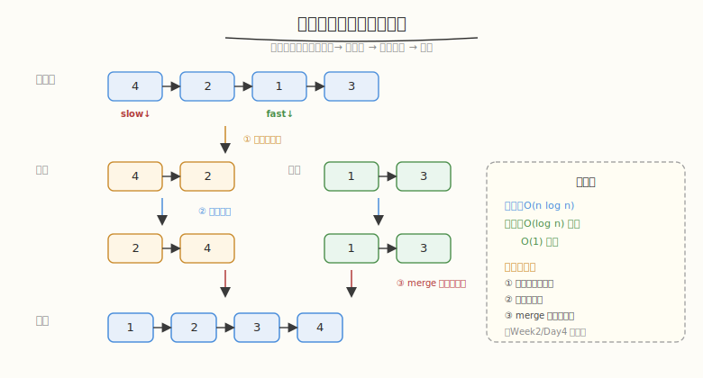
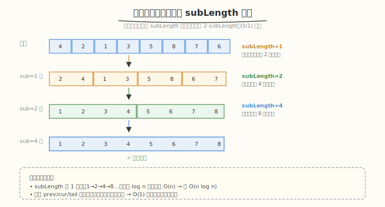

# 排序链表

- **题目名称**：排序链表
- **链接**：[148. 排序链表](https://leetcode.cn/problems/sort-list/)
- **难度**：中等
- **标签**：链表、归并排序、分治、双指针

## 1. 题目概述

给定链表的头节点 `head`，将其按**升序**排列并返回。要求时间 `O(n log n)`、空间 `O(1)`（递归栈空间不计入 / 或要求迭代）。

**示例 1**：

```text
输入：head = [4,2,1,3]
输出：[1,2,3,4]
```

**示例 2**：

```text
输入：head = [-1,5,3,4,0]
输出：[-1,0,3,4,5]
```

**示例 3**：

```text
输入：head = []
输出：[]
```

**约束条件**：

- 链表中节点数目在范围 `[0, 5 * 10^4]` 内
- `-10^5 <= Node.val <= 10^5`

> ⚠️ **进阶要求**：`O(n log n)` 时间 + `O(1)` 空间。这排除了冒泡/插入（`O(n²)`），也排除了递归归并（`O(log n)` 栈空间）——迭代归并排序是标准答案。

---

## 2. 解题思路

### 2.1 暴力思路（转数组排序）

把链表值复制到数组，用 `sort()` 排序，再重建链表。`O(n log n)` 时间、`O(n)` 空间。**不满足进阶的 `O(1)` 空间**，但面试中可作为"先说暴力再优化"的起点。

### 2.2 核心观察：归并排序（分治）



链表排序的天花板是**归并排序**，因为：

1. 归并排序**不需要随机访问**（不像快排要 `partition` 交换），链表天然适合顺序切分
2. 合并两个有序链表是 `O(1)` 空间（只改指针，不需要数组拷贝）—— Week2/Day4 已练过
3. 时间 `O(n log n)`，空间 `O(1)`（迭代版）

**分治三步**：

```text
1. 找中点：快慢双指针，slow 走 1 步、fast 走 2 步，slow 停在中点
2. 切两半：从中点断开成 left / right 两条链
3. 递归排序两半 + 合并（merge two sorted lists）
```

### 2.3 迭代归并（满足 O(1) 空间）



递归归并用 `O(log n)` 栈空间。要 `O(1)` 空间，改用**自底向上迭代**：

```text
subLength = 1
while subLength < n:
    对链表每 subLength 个节点切一段，两两合并成 2·subLength 的有序段
    subLength *= 2
```

每轮把所有长度 `subLength` 的相邻两段合并为 `2·subLength`，共 `log n` 轮，每轮 `O(n)`。

### 2.4 示例演算（递归归并）

`head = [4,2,1,3]`：

| 步骤 | 操作 | 结果 |
|------|------|------|
| 1 | 找中点切半 | `[4,2]` 和 `[1,3]` |
| 2 | 递归排左 `[4,2]` | 切 `[4]` `[2]` → merge `[2,4]` |
| 3 | 递归排右 `[1,3]` | 切 `[1]` `[3]` → merge `[1,3]` |
| 4 | merge `[2,4]` 和 `[1,3]` | `[1,2,3,4]` ✓ |

---

## 3. 参考代码

### C++

```cpp
// 方法一：递归归并（O(n log n) 时间，O(log n) 栈空间）
class Solution {
    ListNode* merge(ListNode* a, ListNode* b) {
        ListNode dummy(0);
        ListNode* tail = &dummy;
        while (a && b) {
            if (a->val <= b->val) { tail->next = a; a = a->next; }
            else                  { tail->next = b; b = b->next; }
            tail = tail->next;
        }
        tail->next = a ? a : b;
        return dummy.next;
    }
public:
    ListNode* sortList(ListNode* head) {
        if (!head || !head->next) return head;
        // 快慢双指针找中点
        ListNode *slow = head, *fast = head->next;
        while (fast && fast->next) {
            slow = slow->next;
            fast = fast->next->next;
        }
        ListNode* mid = slow->next;
        slow->next = nullptr;          // 断开
        ListNode* left = sortList(head);
        ListNode* right = sortList(mid);
        return merge(left, right);
    }
};

// 方法二：迭代归并（O(n log n) 时间，O(1) 空间，满足进阶）
class Solution {
    ListNode* merge(ListNode* a, ListNode* b, ListNode* tail) {
        while (a && b) {
            if (a->val <= b->val) { tail->next = a; a = a->next; }
            else                  { tail->next = b; b = b->next; }
            tail = tail->next;
        }
        tail->next = a ? a : b;
        while (tail->next) tail = tail->next;
        return tail;
    }
public:
    ListNode* sortList(ListNode* head) {
        if (!head || !head->next) return head;
        int n = 0;
        for (ListNode* p = head; p; p = p->next) n++;
        ListNode dummy(0); dummy.next = head;
        for (int sub = 1; sub < n; sub *= 2) {
            ListNode* prev = &dummy;
            ListNode* cur = dummy.next;
            while (cur) {
                ListNode* a = cur;
                // 切出长度 sub 的 a
                ListNode* b = a;
                for (int i = 1; i < sub && b && b->next; i++) b = b->next;
                if (!b || !b->next) { prev->next = a; break; }
                ListNode* bHead = b->next;
                b->next = nullptr;
                // 切出长度 sub 的 b
                ListNode* tail = bHead;
                for (int i = 1; i < sub && tail && tail->next; i++) tail = tail->next;
                cur = tail ? tail->next : nullptr;
                if (tail) tail->next = nullptr;
                // 合并 a, b
                ListNode* last = merge(a, bHead, prev);
                last->next = cur;
                prev = last;
            }
        }
        return dummy.next;
    }
};
```

### Python

```python
# 方法一：递归归并
class Solution:
    def sortList(self, head):
        if not head or not head.next:
            return head
        # 快慢双指针找中点
        slow, fast = head, head.next
        while fast and fast.next:
            slow = slow.next
            fast = fast.next.next
        mid = slow.next
        slow.next = None  # 断开
        left = self.sortList(head)
        right = self.sortList(mid)
        return self.merge(left, right)

    def merge(self, a, b):
        dummy = ListNode(0)
        tail = dummy
        while a and b:
            if a.val <= b.val:
                tail.next, a = a, a.next
            else:
                tail.next, b = b, b.next
            tail = tail.next
        tail.next = a if a else b
        return dummy.next
```

---

## 4. 复杂度分析

| 维度 | 递归归并 | 迭代归并 |
|------|----------|----------|
| **时间** | `O(n log n)` | `O(n log n)` |
| **空间** | `O(log n)`（递归栈） | `O(1)`（仅指针） |
| **是否满足进阶** | ✗（栈空间） | ✓ |
| **实现难度** | 简单直观 | 边界处理多 |
| **适用场景** | 面试先写、易讲解 | 追问"O(1) 空间"时给出 |

> 💡 **找中点用快慢指针**：`slow` 走 1 步、`fast` 走 2 步，`fast` 到尾时 `slow` 在中点。注意初始化 `fast = head->next`（而非 `head`），保证偶数长度时中点偏左，避免无限递归。

---

## 5. 扩展：为什么链表用归并而非快排

| 维度 | 归并排序 | 快速排序 |
|------|----------|----------|
| 随机访问 | 不需要 ✓ | 需要 partition 交换 ✗ |
| 空间 | `O(1)`（改指针） | `O(log n)` 栈 |
| 稳定性 | 稳定 ✓ | 不稳定 |
| 链表适配 | 天然适合 | 不适合（无法高效 partition） |

数组排序快排常用（缓存友好、in-place），但**链表排序归并更优**——这是面试常考的对比点。

---

## 6. 面试要点

1. **为什么链表排序选归并不选快排？**

   - 快排的 partition 需要随机访问交换元素，链表随机访问是 `O(n)`，无法高效 partition
   - 归并排序只需顺序遍历 + 合并，合并两个有序链表是 `O(1)` 空间（改指针）
   - 归并稳定，链表排序天然适合

2. **快慢指针找中点，为什么 `fast` 初始化为 `head->next`？**

   - 若 `fast = head`，偶数长度链表 `slow` 会停在中点偏右，导致左半长度 = 右半长度 + 1，递归深度不均
   - `fast = head->next` 使 `slow` 停在中点偏左，左右两半尽量均衡，避免无限递归（2 个节点时左 1 右 1）

3. **迭代归并如何做到 O(1) 空间？**

   - 自底向上：`subLength` 从 1 倍增到 n，每轮把相邻两段长度 `subLength` 的链表合并
   - 只用 `prev/cur/tail` 等指针变量，无递归栈、无额外数组
   - 共 `log n` 轮，每轮 `O(n)`，总 `O(n log n)`

4. **合并两个有序链表的核心套路？**

   - dummy 哑节点 + tail 尾指针；比较 a/b 头节点，小的接到 tail 后，前进
   - 一条耗尽后，另一条整条接上（`tail->next = a ? a : b`）
   - 这正是 Week2/Day4「合并两个有序链表」的模板，排序链表是它的上层应用

5. **与 AI Infra 的关联？**

   - 归并排序的"分治 + 合并"与推理系统的"请求分批 + 调度合并"同构：Scheduler 把多个请求分成 batch（分治），forward 后合并输出（merge）。"自底向上迭代"也呼应系统优化中"用迭代代替递归以省栈空间"的思想（如 CUDA kernel 用循环替代递归归约）。
