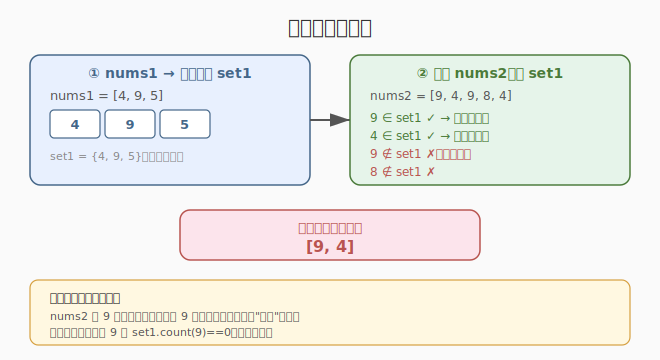
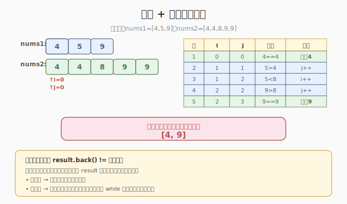
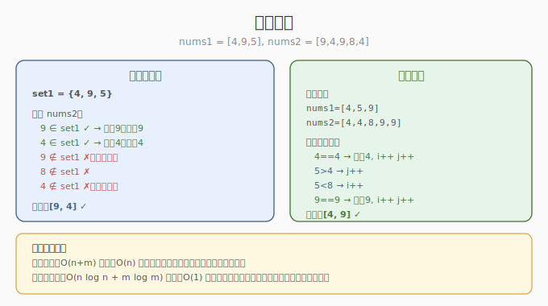

# 两个数组的交集

- **题目名称**：两个数组的交集
- **链接**：[349. 两个数组的交集](https://leetcode.cn/problems/intersection-of-two-arrays/)
- **难度**：简单
- **标签**：数组、哈希表、双指针、二分查找

## 1. 题目概述

给定两个数组 `nums1` 和 `nums2`，返回它们的**交集**。输出结果中的每个元素一定是**唯一**的，不考虑输出顺序。

**示例 1**：

```text
输入：nums1 = [1,2,2,1], nums2 = [2,2]
输出：[2]
```

**示例 2**：

```text
输入：nums1 = [4,9,5], nums2 = [9,4,9,8,4]
输出：[9,4]
解释：[4,9] 也是可通过的
```

**约束条件**：

- `1 <= nums1.length, nums2.length <= 1000`
- `0 <= nums1[i], nums2[i] <= 1000`

> ⚠️ **交集去重**：即使某元素在两个数组中各出现多次，结果中只出现一次。这是与 [350. 两个数组的交集 II](https://leetcode.cn/problems/intersection-of-two-arrays-ii/)（允许重复）的关键区别。

---

## 2. 解题思路

### 2.1 暴力思路（双重循环 + 去重）

对 `nums1` 的每个元素，遍历 `nums2` 检查是否存在，存在则加入结果集（用 set 去重）。时间 `O(n × m)`，空间 `O(min(n,m))`。`n=m=1000` 时 `10^6`，可过但不优雅。

### 2.2 核心解法一：哈希集合



**思路**：将 `nums1` 存入哈希集合，再遍历 `nums2` 检查每个元素是否在集合中。

**算法**：

1. `set1 = set(nums1)` — `O(n)` 去重
2. 遍历 `nums2`，若 `x in set1` 则加入结果并从 `set1` 移除（避免重复加入）
3. 返回结果列表

> 💡 **从 set1 移除已匹配元素**是关键：`nums2 = [9,4,9,8,4]` 中 9 出现两次，不移除则 9 会被加入两次。

### 2.3 核心解法二：排序 + 双指针



**思路**：两个数组排序后，用双指针同步扫描，遇到相同元素则加入结果（跳过重复）。

**算法**：

1. 排序 `nums1` 和 `nums2`
2. `i = 0, j = 0`，双指针扫描：
   - `nums1[i] == nums2[j]`：若与上一个加入的元素不同，则加入结果；`i++, j++`
   - `nums1[i] < nums2[j]`：`i++`
   - `nums1[i] > nums2[j]`：`j++`
3. 返回结果

> 💡 排序后相同元素相邻，"与上一个加入的元素不同"即可去重，无需额外 set。

### 2.4 示例演算

`nums1 = [4,9,5]`, `nums2 = [9,4,9,8,4]`：



**哈希集合法**：
- `set1 = {4, 9, 5}`
- 遍历 `nums2`：9 ✓ → 加入，移除；4 ✓ → 加入，移除；9 ✗（已移除）；8 ✗；4 ✗
- 结果：`[9, 4]` ✓

**双指针法**（排序后 `nums1=[4,5,9]`, `nums2=[4,4,8,9,9]`）：
- i=0,j=0：4==4 → 加入 4，i=1,j=1
- i=1,j=1：5>4 → j=2
- i=1,j=2：5<8 → i=2
- i=2,j=2：9>8 → j=3
- i=2,j=3：9==9 → 加入 9，i=3,j=4
- i=3 越界 → 结束
- 结果：`[4, 9]` ✓

---

## 3. 参考代码

### C++

```cpp
// 方法一：哈希集合
class Solution {
public:
    vector<int> intersection(vector<int>& nums1, vector<int>& nums2) {
        unordered_set<int> set1(nums1.begin(), nums1.end());
        vector<int> result;
        for (int x : nums2) {
            if (set1.count(x)) {
                result.push_back(x);
                set1.erase(x);  // 移除，避免重复加入
            }
        }
        return result;
    }
};

// 方法二：排序 + 双指针
class Solution {
public:
    vector<int> intersection(vector<int>& nums1, vector<int>& nums2) {
        sort(nums1.begin(), nums1.end());
        sort(nums2.begin(), nums2.end());
        vector<int> result;
        int i = 0, j = 0;
        while (i < nums1.size() && j < nums2.size()) {
            if (nums1[i] == nums2[j]) {
                if (result.empty() || result.back() != nums1[i])
                    result.push_back(nums1[i]);
                i++; j++;
            } else if (nums1[i] < nums2[j]) {
                i++;
            } else {
                j++;
            }
        }
        return result;
    }
};
```

### Python

```python
# 方法一：哈希集合
def intersection(nums1: list[int], nums2: list[int]) -> list[int]:
    set1 = set(nums1)
    result = []
    for x in nums2:
        if x in set1:
            result.append(x)
            set1.remove(x)
    return result

# 方法二：排序 + 双指针
def intersection_sorted(nums1: list[int], nums2: list[int]) -> list[int]:
    nums1.sort()
    nums2.sort()
    result = []
    i = j = 0
    while i < len(nums1) and j < len(nums2):
        if nums1[i] == nums2[j]:
            if not result or result[-1] != nums1[i]:
                result.append(nums1[i])
            i += 1
            j += 1
        elif nums1[i] < nums2[j]:
            i += 1
        else:
            j += 1
    return result
```

---

## 4. 复杂度分析

| 方法 | 时间 | 空间 | 特点 |
|------|------|------|------|
| **哈希集合** | `O(n + m)` | `O(n)` | 最快，一次遍历；需额外 set 空间 |
| **排序 + 双指针** | `O(n log n + m log m)` | `O(1)` 额外 | 排序占大头；无额外空间（不计排序） |

> 💡 `n=1000` 时两种方法都轻松通过。若数组已排序，双指针法 `O(n+m)` 优于哈希法。若数组很大且内存有限，双指针更友好。

---

## 5. 扩展：与 350 题的区别

[350. 两个数组的交集 II](https://leetcode.cn/problems/intersection-of-two-arrays-ii/) 允许结果中出现重复元素（取两个数组中各元素出现次数的最小值）：

- **349（去重）**：用 set 或"跳过重复"实现唯一性
- **350（不去重）**：用哈希计数（`Counter`）或双指针不跳过重复

```python
# 350 题哈希计数法
from collections import Counter
def intersect_350(nums1, nums2):
    cnt = Counter(nums1)
    result = []
    for x in nums2:
        if cnt[x] > 0:
            result.append(x)
            cnt[x] -= 1
    return result
```

---

## 6. 面试要点

1. **哈希集合法为什么要移除已匹配元素？**

   - `nums2` 中可能有重复元素（如 `[9,4,9,8,4]` 中 9 出现两次）
   - 不移除则 9 会被加入结果两次，违反"唯一"要求
   - 移除后第二次遇到 9 时 `set1.count(9) == 0`，自动跳过

2. **双指针法如何去重？**

   - 排序后相同元素相邻
   - 加入结果前检查 `result.back() != nums1[i]`，确保不加入重复
   - 也可用 `while` 跳过连续相同元素，效果相同

3. **什么情况下用双指针更优？**

   - 数组**已排序**时，双指针 `O(n+m)` 优于哈希 `O(n+m)` 且无额外空间
   - 内存受限（数组很大）时，双指针空间 `O(1)` 更友好
   - 需要结果有序时，双指针天然有序

4. **如果 nums2 很大且存放在磁盘上怎么办？**

   - 哈希法：将小的 `nums1` 存入内存 set，分块读取 `nums2` 逐块匹配
   - 双指针法：需两个数组都排序，磁盘排序代价大
   - 因此 **哈希法 + 外存分块读取** 是更实用的方案

5. **349 和 350 的核心区别是什么？**

   - 349：交集去重（每个元素至多出现一次）→ set 或跳过重复
   - 350：交集不去重（取最小出现次数）→ Counter 计数或不跳过重复
   - 面试中常追问"如何从 349 改为 350"，核心是去重逻辑的调整
