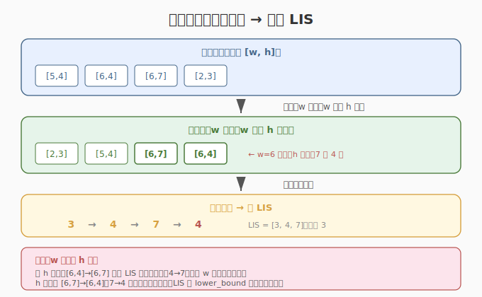
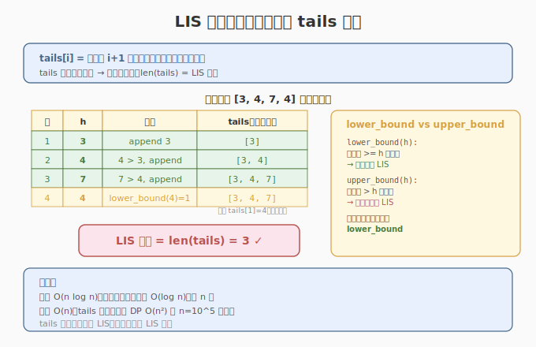
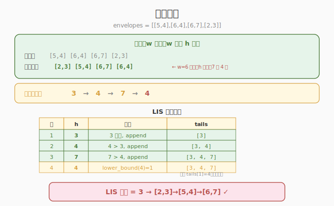

# 俄罗斯套娃信封问题

- **题目名称**：俄罗斯套娃信封问题
- **链接**：[354. 俄罗斯套娃信封问题](https://leetcode.cn/problems/russian-doll-envelopes/)
- **难度**：困难
- **标签**：动态规划、二分查找、排序、LIS

## 1. 题目概述

给定二维整数数组 `envelopes`，`envelopes[i] = [wi, hi]` 表示信封的宽度和高度。当一个信封的宽和高**都大于**另一个信封时，可以套入。求**最多**能嵌套多少个信封（不允许旋转）。

**示例 1**：

```text
输入：envelopes = [[5,4],[6,4],[6,7],[2,3]]
输出：3
解释：[2,3] => [5,4] => [6,7]，共 3 个。
```

**示例 2**：

```text
输入：envelopes = [[1,1],[1,1],[1,1]]
输出：1
解释：宽高相同无法嵌套，只能取 1 个。
```

**约束条件**：

- `1 <= envelopes.length <= 10^5`
- `1 <= wi, hi <= 10^5`

> ⚠️ **嵌套条件**：严格大于（`w1 < w2 且 h1 < h2`），不是 `<=`。相同宽高不能嵌套。

---

## 2. 解题思路

### 2.1 暴力思路（一维 LIS 的朴素推广）

对信封全排列，找最长的严格递增子序列。`O(n!)`，完全不可行。

降维思考：若**宽度已排序**，问题变为在高度序列上找**最长递增子序列（LIS）**。但宽度相同的信封不能嵌套，需特殊处理。

### 2.2 核心观察：排序降维 + 二分 LIS



**关键洞察**：将二维嵌套问题降为一维 LIS 问题。

**排序策略**：
1. **宽度 `w` 升序**：保证后出现的信封宽度 >= 前面，宽度方向天然满足嵌套条件
2. **宽度相同时，高度 `h` 降序**：相同宽度的信封不能嵌套，高度降序后它们在 LIS 中不会同时被选中（因为降序不构成递增）

> 💡 **为什么高度降序？** 若宽度相同、高度升序，如 `[6,4]` 和 `[6,7]`，LIS 会把 4→7 算作递增，误判为可嵌套。高度降序后 `[6,7],[6,4]`，7→4 不递增，正确排除。

**排序后**：在高度序列上求 **LIS（最长严格递增子序列）** 即可。

### 2.3 LIS 的二分解法



**算法**（`O(n log n)`）：

维护一个数组 `tails`，`tails[i]` = 长度为 `i+1` 的所有递增子序列的**最小末尾值**。

遍历高度 `h`：
1. 在 `tails` 中二分找**第一个 >= h** 的位置 `pos`（`lower_bound`）
2. 若 `pos` 存在：`tails[pos] = h`（替换，保持更小的末尾值）
3. 若 `pos` 不存在（h 比所有都大）：`tails.append(h)`（扩展子序列长度）

答案 = `len(tails)`。

> 💡 `tails` 始终**单调递增**，可用二分查找。`lower_bound` 保证严格递增（相同值不扩展）。

### 2.4 示例演算

`envelopes = [[5,4],[6,4],[6,7],[2,3]]`：



**排序**（w 升序，w 相同 h 降序）：
- `[2,3], [5,4], [6,7], [6,4]`（`[6,7]` 在 `[6,4]` 前，因 w=6 相同 h 降序）

高度序列：`[3, 4, 7, 4]`

**LIS 二分过程**：

| 步骤 | h | tails | 操作 |
|------|---|-------|------|
| 1 | 3 | [3] | 3 比所有大，append |
| 2 | 4 | [3, 4] | 4 > 3，append |
| 3 | 7 | [3, 4, 7] | 7 > 4，append |
| 4 | 4 | [3, 4, 7] | lower_bound(4)=pos 1，替换 tails[1]=4（无变化） |

`len(tails) = 3` ✓

对应嵌套链：`[2,3] → [5,4] → [6,7]`（h=3→4→7）

---

## 3. 参考代码

### C++

```cpp
class Solution {
public:
    int maxEnvelopes(vector<vector<int>>& envelopes) {
        // 排序：w 升序，w 相同则 h 降序
        sort(envelopes.begin(), envelopes.end(), [](auto& a, auto& b) {
            if (a[0] != b[0]) return a[0] < b[0];
            return a[1] > b[1];
        });

        // 在高度序列上求 LIS（二分）
        vector<int> tails;
        for (auto& e : envelopes) {
            int h = e[1];
            auto it = lower_bound(tails.begin(), tails.end(), h);
            if (it == tails.end()) {
                tails.push_back(h);
            } else {
                *it = h;
            }
        }
        return tails.size();
    }
};
```

### Python

```python
from bisect import bisect_left

class Solution:
    def maxEnvelopes(self, envelopes: list[list[int]]) -> int:
        # 排序：w 升序，w 相同则 h 降序
        envelopes.sort(key=lambda x: (x[0], -x[1]))

        # 在高度序列上求 LIS（二分）
        tails = []
        for _, h in envelopes:
            pos = bisect_left(tails, h)
            if pos == len(tails):
                tails.append(h)
            else:
                tails[pos] = h
        return len(tails)
```

---

## 4. 复杂度分析

| 维度 | 复杂度 | 说明 |
|------|--------|------|
| **时间** | `O(n log n)` | 排序 `O(n log n)` + LIS 二分 `O(n log n)` |
| **空间** | `O(n)` | `tails` 数组 |

> 💡 `n=10^5`，`O(n log n)` 轻松通过。朴素 DP（`O(n²)`）会超时。

---

## 5. 扩展：与一维 LIS 的关系

本题是一维 LIS（[300. 最长递增子序列](https://leetcode.cn/problems/longest-increasing-subsequence/)）的**二维推广**。核心转化：

| 一维 LIS | 二维俄罗斯套娃 |
|----------|---------------|
| 在数组上找最长递增子序列 | 在 `(w, h)` 对上找最长嵌套链 |
| 直接在数组上二分 | 先排序降维，再对高度做 LIS |
| `lower_bound` 保证严格递增 | w 升序 + h 降序保证相同 w 不嵌套 |

**推广到三维**（如箱体嵌套 `[w, h, d]`）：按 w 排序，在 (h, d) 上求二维 LIS，但二维 LIS 是 `O(n²)` 或更复杂，无简单 `O(n log n)` 解法。

---

## 6. 面试要点

1. **为什么宽度相同时高度要降序？**

   - 宽度相同不能嵌套。若高度升序，LIS 会把同宽信封的高度算作递增，误判可嵌套。
   - 降序后，同宽信封的高度不构成递增序列，LIS 不会同时选中它们。
   - 例：`[6,4]` 和 `[6,7]`，升序 `[4,7]` 会被 LIS 误算（len+1），降序 `[7,4]` 不会。

2. **LIS 的 `lower_bound` 和 `upper_bound` 有什么区别？**

   - `lower_bound(h)`：找第一个 `>= h` 的位置。用于**严格递增**（相同值不扩展长度）。
   - `upper_bound(h)`：找第一个 `> h` 的位置。用于**非严格递增**（允许相同值扩展）。
   - 本题要求严格嵌套（`w1 < w2 且 h1 < h2`），用 `lower_bound`。

3. **`tails` 数组的含义是什么？**

   - `tails[i]` = 长度为 `i+1` 的所有递增子序列中，最小的末尾值。
   - 维护 `tails` 单调递增，保证二分可用。
   - `tails` 不一定是实际的 LIS，但长度等于 LIS 长度。

4. **朴素 DP 为什么超时？**

   - `dp[i]` = 以 `envelopes[i]` 结尾的最长嵌套链长度，`dp[i] = max(dp[j]+1)` for all `j < i` 且可嵌套。
   - `O(n²)`，`n=10^5` 时 `10^10`，超时。
   - 二分 LIS 优化到 `O(n log n)`。

5. **如果允许旋转信封（交换 w 和 h）怎么办？**

   - 每个信封有两种形态 `(w, h)` 和 `(h, w)`，取 `min(w,h)` 为宽、`max(w,h)` 为高（使宽尽可能小，更多嵌套机会）。
   - 排序后仍做 LIS，但需注意相同 `(min, max)` 的信封不能重复使用。

---

## 7. 同类练习题

- [300. 最长递增子序列](https://leetcode.cn/problems/longest-increasing-subsequence/)：一维 LIS 模板题，本题的基础
- [1671. 得到山形数组的最少删除次数](https://leetcode.cn/problems/minimum-number-of-removals-to-make-mountain-array/)：双向 LIS，先升后降的山形序列
- [1626. 无矛盾的最佳球队](https://leetcode.cn/problems/best-team-with-no-conflicts/)：排序 + LIS，年龄和分数的二维约束
- [1964. 找出到每个位置为止最长的障碍路线](https://leetcode.cn/problems/find-the-longest-obstacle-course-at-each-position/)：非严格递增 LIS（upper_bound），与本题严格递增（lower_bound）对比
- [1691. 堆叠长方体的最大高度](https://leetcode.cn/problems/maximum-height-by-stacking-cuboids/)：三维嵌套推广，允许旋转，排序后 DP
