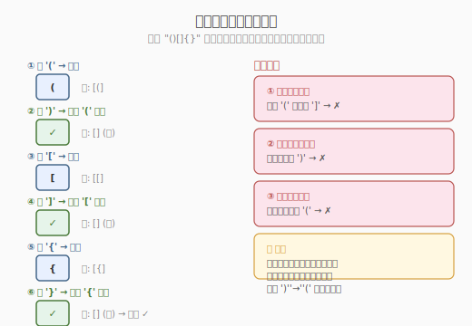

# 有效括号

- **题目名称**：有效括号
- **链接**：[20. 有效的括号](https://leetcode.cn/problems/valid-parentheses/)
- **难度**：简单
- **标签**：栈、字符串

## 1. 题目概述

给定一个只包含 `(`、`)`、`{`、`}`、`[`、`]` 的字符串 `s`，判断字符串是否有效。有效字符串需满足：

1. 左括号必须用相同类型的右括号闭合。
2. 左括号必须以正确的顺序闭合。
3. 每个右括号都有一个对应的相同类型的左括号。

**示例 1**

```text
输入：s = "()"
输出：true
```

**示例 2**

```text
输入：s = "()[]{}"
输出：true
```

**示例 3**

```text
输入：s = "(]"
输出：false
```

**示例 4**

```text
输入：s = "([])"
输出：true
```

**约束条件**：

- `1 <= s.length <= 10^4`
- `s` 仅由括号字符组成

## 2. 解题思路

### 2.1 暴力思路

反复扫描字符串，每次找到一对相邻的匹配括号 `()`、`{}`、`[]` 就删除，直到无法删除。若最终字符串为空则有效。每次扫描 `O(n)`，最多 `n/2` 轮，总计 `O(n²)`，效率低且实现复杂。

### 2.2 核心观察：栈匹配



括号匹配的本质是**后进先出（LIFO）**：最后打开的括号必须最先关闭。这正是栈的天然语义。

**核心策略**：
- 遇到**左括号**：入栈（记录"待匹配"）
- 遇到**右括号**：检查栈顶是否为对应的左括号，是则弹出，否则非法

### 2.3 算法流程

```
1. 初始化空栈
2. 逐字符扫描 s：
   a. 若是左括号 ( [ { → 入栈
   b. 若是右括号 ) ] }：
      - 栈空 → 非法（无左括号可匹配）
      - 栈顶不匹配 → 非法（类型不一致）
      - 栈顶匹配 → 弹出
3. 扫描结束：栈空 → 有效；栈非空 → 非法（有未闭合的左括号）
```

### 2.4 示例演算

以 `s = "()[]{}"` 为例：

| 步骤 | 字符 | 操作 | 栈状态 |
|------|------|------|--------|
| ① | `(` | 入栈 | `[(]` |
| ② | `)` | 匹配 `(`，弹出 | `[]` (空) |
| ③ | `[` | 入栈 | `[[]` |
| ④ | `]` | 匹配 `[`，弹出 | `[]` (空) |
| ⑤ | `{` | 入栈 | `[{]` |
| ⑥ | `}` | 匹配 `{`，弹出 | `[]` (空) |

扫描结束，栈为空 → **有效** ✓

以 `s = "([)]"` 为例：

| 步骤 | 字符 | 操作 | 栈状态 |
|------|------|------|--------|
| ① | `(` | 入栈 | `[(]` |
| ② | `[` | 入栈 | `[(, []` |
| ③ | `)` | 栈顶是 `[` ≠ `(` → **非法** ✗ | — |

## 3. 参考代码

### C++

```cpp
class Solution {
public:
    bool isValid(string s) {
        stack<char> st;
        unordered_map<char, char> pairs = {
            {')', '('}, {']', '['}, {'}', '{'}
        };
        for (char c : s) {
            if (pairs.count(c)) {
                // 右括号：检查栈顶
                if (st.empty() || st.top() != pairs[c])
                    return false;
                st.pop();
            } else {
                // 左括号：入栈
                st.push(c);
            }
        }
        return st.empty();
    }
};
```

### Python

```python
class Solution:
    def isValid(self, s: str) -> bool:
        stack = []
        pairs = {')': '(', ']': '[', '}': '{'}
        for c in s:
            if c in pairs:  # 右括号
                if not stack or stack[-1] != pairs[c]:
                    return False
                stack.pop()
            else:           # 左括号
                stack.append(c)
        return not stack
```

## 4. 复杂度分析

| 维度 | 复杂度 | 说明 |
|------|--------|------|
| **时间** | `O(n)` | 逐字符扫描一次，每个字符最多入栈/出栈一次 |
| **空间** | `O(n)` | 最坏情况全为左括号，栈存 n 个元素 |

## 5. 扩展：不使用栈的原地解法

如果允许修改字符串，可以用**双指针**模拟栈：`top` 指针指向"栈顶"位置，左括号写入 `s[top]`，右括号时检查 `s[top-1]` 并 `top--`。空间 `O(1)`，但会破坏输入且可读性差，面试中不推荐。

## 6. 面试要点

**Q1：为什么用栈而不是队列？**
> 括号匹配是 LIFO 语义——最后打开的括号最先关闭。队列的 FIFO 语义不匹配。

**Q2：如何处理多种括号嵌套？**
> 用哈希表 `{')': '(', ']': '[', '}': '{'}` 建立右→左映射，遇到右括号时查表匹配栈顶，避免冗长的 if-else。

**Q3：三种非法情况分别是什么？**
> ①右括号与栈顶左括号类型不匹配；②栈空时遇到右括号；③扫描结束后栈非空（有未闭合的左括号）。

**Q4：能否用递归替代栈？**
> 可以，递归调用栈天然就是 LIFO。但递归深度 = 嵌套深度，最坏 `O(n)`，可能栈溢出，且空间开销更大。迭代+显式栈更安全。

**Q5：如果字符串含非括号字符怎么办？**
> 跳过非括号字符即可。或者预处理过滤。本题约束保证只有括号字符，无需处理。

## 7. 同类练习题

- [22. 括号生成](https://leetcode.cn/problems/generate-parentheses/)：回溯生成所有合法括号组合，需理解"合法"的定义
- [32. 最长有效括号](https://leetcode.cn/problems/longest-valid-parentheses/)：在匹配基础上求最长合法子串，栈或 DP
- [1249. 移除无效的括号](https://leetcode.cn/problems/minimum-remove-to-make-valid-parentheses/)：栈匹配 + 标记删除，让字符串变合法
- [2116. 判断一个括号字符串是否有效](https://leetcode.cn/problems/check-if-a-parentheses-string-can-be-valid/)：带锁定位置的括号匹配变体
