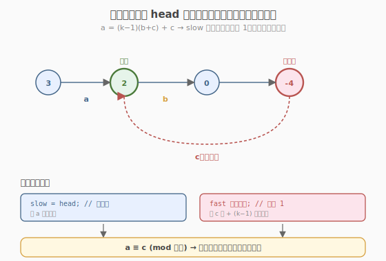
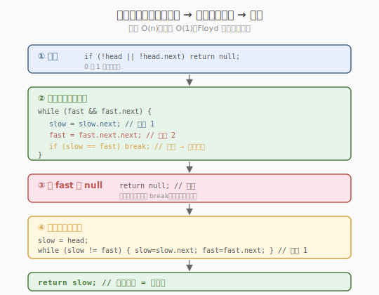
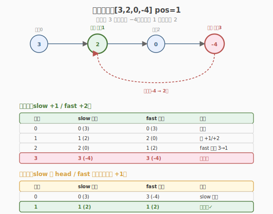

# 环形链表 II

- **题目名称**：环形链表 II
- **链接**：[142. 环形链表 II](https://leetcode.cn/problems/linked-list-cycle-ii/)
- **难度**：中等
- **标签**：链表、双指针

## 1. 题目概述

给定一个链表的头节点 `head`，返回链表**开始入环的第一个节点**。如果链表无环，则返回 `null`。

**环的定义**：链表中某个节点的 `next` 指针通过再次跟踪可以再次到达该节点。`pos` 仅用于标识环的入口下标，**不作为参数传入**，不允许修改链表。

**示例 1**：

```text
输入：head = [3,2,0,-4], pos = 1
输出：返回下标为 1 的链表节点（节点值 2）
解释：链表中有一个环，其尾部连接到第二个节点（下标 1，节点值 2）。

  3 → 2 → 0 → -4
      ↑___________↓
```

**示例 2**：

```text
输入：head = [1,2], pos = 0
输出：返回下标为 0 的链表节点（节点值 1）
解释：链表中有一个环，其尾部连接到第一个节点。

  1 → 2
  ↑___↓
```

**示例 3**：

```text
输入：head = [1], pos = -1
输出：null
解释：链表中没有环。

  1 → null
```

**约束条件**：

- 链表中节点数范围是 `[0, 10^4]`
- `-10^5 <= Node.val <= 10^5`
- `pos` 为 `-1` 或者链表中的一个有效下标（仅用于标识，不作为参数传入）
- **进阶**：你是否可以用 `O(1)` 空间解决？

> 💡 这是 [141. 环形链表](../../week3/day4/环形链表.md) 的进阶版。141 只问"**有没有环**"，本题问"**环入口在哪**"。同一套 Floyd 快慢指针，但需要多走一个"第二阶段"——把数学关系 `a = (k-1)(b+c) + c` 翻译成代码。一旦想通这个等式，本题就是 141 的"加两行"。

---

## 2. 解题思路

### 2.1 暴力思路：哈希表记录访问过的节点

遍历链表，用哈希集合记录每个访问过的节点引用。第一次遇到已在集合中的节点即为环入口；若到达 `null` 则无环。

```text
visited = set()
while node:
    if node in visited: return node   # 环入口
    visited.add(node)
    node = node.next
return null
```

时间 `O(n)`，空间 `O(n)`（哈希集合存所有节点）。能过，但**不满足进阶的** `O(1)` **空间要求**。

> ⚠️ 哈希表法的瓶颈：需要 `O(n)` 额外空间。要 `O(1)` 必须用**快慢指针**——靠追及相遇 + 数学推导定位入口，无需记录历史。

### 2.2 核心观察：快慢指针 + 距离等式

继承 141 的 Floyd 判圈法，分**两个阶段**：

- **阶段一（找相遇点）**：`slow` 走 1、`fast` 走 2，同 141。相遇则证明有环；`fast` 到 `null` 则无环。
- **阶段二（找入口）**：把 `slow` 重置到 `head`，`fast` 留在相遇点，**两者都改为每次走 1 步**，再次相遇的节点就是**环入口**。



**为什么阶段二会停在入口？** 这是本题最关键的问题。设：

- `a` = 头节点 → 环入口的距离
- `b` = 环入口 → 相遇点的距离（沿前进方向）
- `c` = 相遇点 → 环入口的距离（环长 `b + c`）

相遇时：

- `slow` 走了 `a + b`（slow 进环后走不到一圈就被追上）
- `fast` 走了 `a + b + k(b+c)`（`k` 圈整 + `b`，`k ≥ 1`）

因为 `fast` 速度是 `slow` 的 2 倍，路程也是 2 倍：

$$2(a + b) = a + b + k(b+c)$$

化简得：

$$a = (k-1)(b+c) + c$$

**这个等式的含义**：从 `head` 走 `a` 步到入口 = 从相遇点走 `c` 步 + 绕 `(k-1)` 圈到入口。两者在入口**精确相遇**。这正是阶段二"两指针同速走 1，再次相遇即入口"的数学依据。

> 💡 **直觉记忆**：不必死记公式。记住一个画面——相遇点距入口 `c` 步，而头距入口 `a` 步，恰巧 `a ≡ c (mod 环长)`。于是让一个指针回起点、两人同速走，必然在入口碰头。

### 2.3 算法流程图



**完整步骤**：

1. **特判**：`head == null` 或 `head.next == null` → 无环，返回 `null`
2. **阶段一**：`slow = fast = head`
   - `while fast && fast.next`：
     - `slow = slow.next`（走 1）
     - `fast = fast.next.next`（走 2）
     - `if slow == fast`：**相遇，跳出**进入阶段二
   - 若循环正常结束（`fast` 到 `null`）→ 无环，返回 `null`
3. **阶段二**：`slow = head`（重置到头），`fast` 留在相遇点
   - `while slow != fast`：`slow = slow.next`，`fast = fast.next`（都走 1）
   - 返回 `slow`（再次相遇 = 环入口）

> ⚠️ **阶段一的循环条件仍是** `fast && fast.next`——和 141 完全一致，因为 `fast` 仍走 2 步。阶段二两指针都只走 1 步，且保证有环，故只需 `slow != fast`，无需判空。

### 2.4 示例演算

以 `head = [3,2,0,-4]`（pos=1，`-4 → 2` 成环）为例。先给节点编号下标，方便演算：

```text
下标:  0   1   2   3       (环入口下标 1)
值:    3 → 2 → 0 → -4 ─┐
          ↑____________┘   (-4 的 next 指回下标 1)
```

即节点序列 `3 → 2 → 0 → -4 → 2(回入口)`。`slow`/`fast` 都从 `head`（下标 0）出发，**先移动再比较**。



**阶段一（找相遇点，slow +1 / fast +2）**：

| 轮次 | slow 下标 | fast 下标 | 说明 |
|------|-----------|-----------|------|
| 0 | 0 (3) | 0 (3) | 起点 |
| 1 | 1 (2) | 2 (0) | slow +1 到 1；fast +2：0→1→2 |
| 2 | 2 (0) | 1 (2) | slow +1 到 2；fast +2：2→3→1（环回） |
| 3 | 3 (-4) | 3 (-4) | slow +1 到 3；fast +2：1→2→3 → **相遇于下标 3（val -4）** |

**阶段二（找入口，slow 回 head / fast 留相遇点，都 +1）**：

| 轮次 | slow 下标 | fast 下标 | 说明 |
|------|-----------|-----------|------|
| 0 | 0 (3) | 3 (-4) | slow 重置到 head，fast 留相遇点 |
| 1 | 1 (2) | 1 (2) | slow +1：0→1；fast +1：3→1（环回）→ **再次相遇于下标 1（val 2）= 环入口** ✓ |

阶段二仅 **1 步**即在下标 1（节点值 2）相遇，正是 `pos=1` 标记的环入口。

> 💡 **对照数学**：本例 `a = 1`（头→入口下标 1），`b = 2`（入口下标 1→相遇下标 3，走 2 步），`c = 1`（相遇下标 3→入口下标 1，环回 1 步），环长 `b+c = 3`。代入 $a = (k-1)(b+c) + c$ → $1 = (k-1)\cdot3 + 1$ → $k = 1$ ✓。阶段二 slow 走 `a=1` 步、fast 走 `c=1` 步，双双落在入口。

---

## 3. 参考代码

### C++

```cpp
// 环形链表 II.cpp —— Floyd 判圈法（两阶段）
// 编译: g++ -O2 -std=c++17 环形链表\ II.cpp -o cycle2
struct ListNode {
    int val;
    ListNode* next;
    ListNode(int x) : val(x), next(nullptr) {}
};

class Solution {
public:
    ListNode* detectCycle(ListNode* head) {
        if (head == nullptr || head->next == nullptr)
            return nullptr;                       // 0/1 个节点无环

        ListNode* slow = head;
        ListNode* fast = head;

        // 阶段一：找相遇点
        while (fast != nullptr && fast->next != nullptr) {
            slow = slow->next;                    // 慢走 1
            fast = fast->next->next;              // 快走 2
            if (slow == fast) break;              // 相遇，进阶段二
        }
        if (fast == nullptr || fast->next == nullptr)
            return nullptr;                       // fast 到 null → 无环

        // 阶段二：slow 回头，同速走，再次相遇即入口
        slow = head;
        while (slow != fast) {
            slow = slow->next;                    // 都走 1
            fast = fast->next;
        }
        return slow;                              // 环入口
    }
};
```

### Python

```python
class Solution:
    def detectCycle(self, head: ListNode | None) -> ListNode | None:
        if not head or not head.next:
            return None

        slow = fast = head

        # 阶段一：找相遇点
        while fast and fast.next:
            slow = slow.next                      # 慢走 1
            fast = fast.next.next                 # 快走 2
            if slow is fast:                      # 用 is 比较节点身份
                break
        else:
            return None                           # fast 到 null → 无环

        # 阶段二：slow 回头，同速走，再次相遇即入口
        slow = head
        while slow is not fast:
            slow = slow.next
            fast = fast.next
        return slow
```

> 💡 Python 的 `while...else`：`else` 在循环**正常结束**（非 break）时执行。这里若阶段一因 `fast` 到 `null` 正常退出，`else` 返回 `None`；若因 `break`（相遇）退出，则跳过 `else` 进入阶段二。这比 C++ 版的"循环后再 if 判空"更优雅。

---

## 4. 复杂度分析

| 维度 | 快慢指针 | 哈希表 |
|------|---------|--------|
| **时间复杂度** | `O(n)` | `O(n)` |
| **空间复杂度** | `O(1)` | `O(n)` |
| **满足进阶** | ✅ | ✗ |

> ⚠️ 快慢指针时间 `O(n)` 的证明：阶段一 `slow` 进环后，`fast` 最多再走环长步追上，总步数 `O(n)`；阶段二两指针各走不超过 `a + max(b,c)` 步即相遇，仍是 `O(n)`。整体 `O(n)`。

---

## 5. 扩展：Floyd 判圈法的可迁移性

### 5.1 通用模板

142 的两阶段流程是一个**通用判圈 + 定位模板**，可迁移到所有"序列重复且需定位重复点"的问题：

```text
阶段一：slow=f(x), fast=f(f(x))，直到 slow==fast（确认有环）
阶段二：slow 回起点，两者都 f(x) 同速，再次相遇即重复点
```

### 5.2 经典迁移：287 寻找重复数

数组 `nums` 长度 `n+1`，元素范围 `[1, n]`，有且仅有一个重复数。把 `nums[i]` 当作"next 指针"（`i → nums[i]`），数组变成一个"隐式链表"，重复数导致**环**。用 Floyd 两阶段：相遇点确认有环，第二阶段找入口 = 重复数。

> 💡 这是 Floyd 判圈法最巧妙的迁移——把数组下标当成链表指针，"寻找重复数"变成"找环入口"。与 142 完全同构，只是"next"从 `node.next` 变成 `nums[i]`，且要求 `O(1)` 空间且不修改数组，快慢指针几乎是唯一解。

---

## 6. 面试要点

1. **阶段二为什么把 slow 重置到 head 而不是 fast？**

   > 数学等式 `a = (k-1)(b+c) + c` 要求"一个指针从 head 走 `a` 步、另一个从相遇点走 `c` 步"在入口会合。把 `slow` 重置到 head（走 `a`）、`fast` 留在相遇点（走 `c` + 整数圈）正好对上。反过来也能解，但代码不如这样直观。

2. **`a = (k-1)(b+c) + c` 这个等式怎么推？面试要会推。**

   > 设相遇时 `slow` 走 `a+b`，`fast` 走 `a+b+k(b+c)`（`k≥1` 圈）。因 2 倍速：`2(a+b) = a+b+k(b+c)` → `a+b = k(b+c)` → `a = k(b+c) - b = (k-1)(b+c) + c`。面试画图标出 `a,b,c`，口述这步推导即可。

3. **`slow` 进环后会不会已经走了一圈以上才被追上？**

   > 不会。`slow` 进环时，`fast` 已在环中。环长 `L=b+c`，两者距离 `d < L`，每轮追近 1，最多 `L-1` 轮追上，`slow` 走不到一圈。所以相遇时 `slow` 的路程恒为 `a+b`（不含整圈），这是推导成立的前提。

4. **为什么必须用 `is`（Python）/ 指针比较（C++）而不是值比较？**

   > 链表可能有**值相同的不同节点**（如 `[1,1,1,1]` 全是 1，无环但值都同）。判断"是否同一节点"要比较**身份**（内存地址）。Python `==` 默认比值，`is` 比身份；C++ 指针比较天然是地址比较。

5. **阶段一无环时如何区分"正常退出"与"相遇退出"？**

   > C++：循环后用 `if (fast == nullptr || fast->next == nullptr) return nullptr;` 判断——若因 `fast` 到尾退出则无环。Python：用 `while...else`，`else` 仅在循环正常结束（非 break）时执行，更简洁。两者本质都是区分"break（相遇）"与"条件假（到尾）"。

> 💡 **一句话总结**：142 = 141 的阶段一 + 数学等式 `a = (k-1)(b+c) + c` 翻译成"slow 回头、同速走"的阶段二。空间 `O(1)`。这个"追及 + 定位"模板可迁移到 287（寻找重复数）、202（快乐数）等所有"序列重复定位"问题，是面试必会的核心模板。

---

## 7. 同类练习题

- [141. 环形链表](https://leetcode.cn/problems/linked-list-cycle/)：本题前置题，只判环不找入口，同一套快慢指针阶段一
- [287. 寻找重复数](https://leetcode.cn/problems/find-the-duplicate-number/)：把数组下标当链表指针，Floyd 两阶段找环入口 = 重复数，要求 `O(1)` 空间不修改数组
- [202. 快乐数](https://leetcode.cn/problems/happy-number/)：数位平方和序列判环，阶段一判是否进入循环（非快乐数必成环）
- [457. 环形数组循环](https://leetcode.cn/problems/circular-array-loop/)：数组当下标链表，带方向约束的 Floyd 判圈
