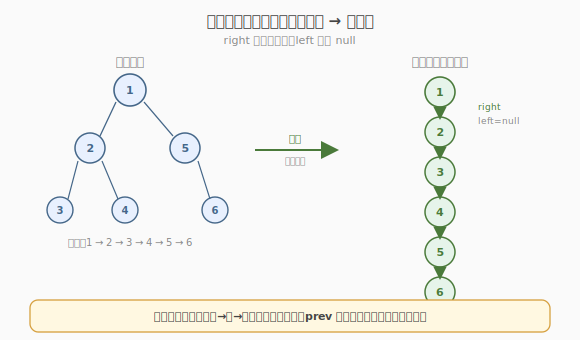
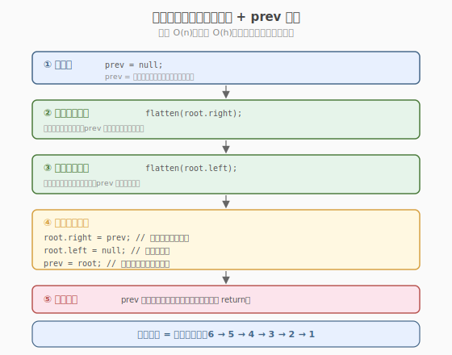
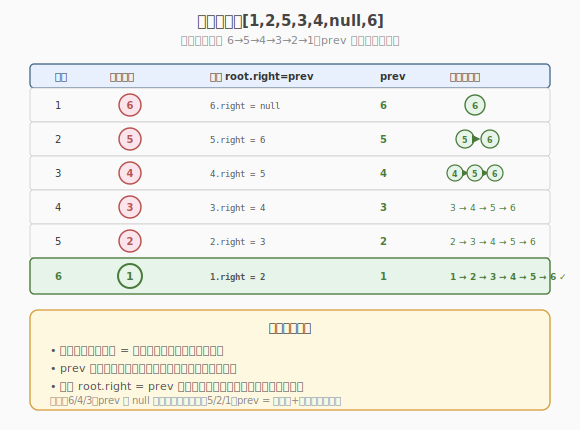

# 二叉树展开为链表

- **题目名称**：二叉树展开为链表
- **链接**：[114. 二叉树展开为链表](https://leetcode.cn/problems/flatten-binary-tree-to-linked-list/)
- **难度**：中等
- **标签**：树、二叉树、深度优先搜索

## 1. 题目概述

给你二叉树的根结点 `root`，将它展开为一个「单链表」：

1. 展开后的单链表应该同样使用 `TreeNode`，其中 `right` 指针指向链表中下一个结点，而 `left` 指针始终为 `null`。
2. 展开后的单链表应该与二叉树**前序遍历**顺序相同。

**示例 1**：

```text
输入：root = [1,2,5,3,4,null,6]
输出：[1,null,2,null,3,null,4,null,5,null,6]

        1                      1
       / \                      \
      2   5        →             2
     / \   \                      \
    3   4   6                      3
                                   \
                                    4
                                     \
                                      5
                                       \
                                        6
```

**示例 2**：

```text
输入：root = []
输出：[]
```

**示例 3**：

```text
输入：root = [0]
输出：[0]
```

**约束条件**：

- 树中节点数目范围 `[0, 2000]`
- `-100 <= Node.val <= 100`
- **进阶**：你可以使用原地（`O(1)` 额外空间）展开这棵树吗？

> 💡 这是「**原地修改树结构**」的招牌题。与 [226. 翻转二叉树](../../week4/day4/翻转二叉树.md) 的「每个节点交换左右孩子」不同，本题要把整棵树**压成一条右链**，且顺序必须是前序。关键观察：**反向后序遍历**（右→左→根）正好逆序产生前序序列，配合一个 `prev` 指针就能从尾部向头部逐节点串接，无需额外空间存节点列表。

---

## 2. 解题思路

### 2.1 暴力思路：前序遍历收集节点 + 重新串接

最直观的做法：先做一次前序遍历把所有节点按顺序存进列表，再遍历列表依次把每个节点的 `right` 指向下一个、`left` 置 `null`。

```text
order = []
preorder(root)               # 收集到 order
for i in range(len(order)-1):
    order[i].right = order[i+1]
    order[i].left  = null
order[-1].right = null
order[-1].left  = null
```

时间 `O(n)`，但空间 `O(n)`（列表存所有节点）+ `O(h)` 递归栈。能过，但**不满足进阶的** `O(1)` **空间要求**。

> ⚠️ 暴力法的瓶颈：必须用 `O(n)` 列表保存前序顺序，因为前序是「根→左→右」，处理根时还不知道右子树展开后的链表头在哪。要想原地，得换一个方向——**从尾部往前构建**。

### 2.2 核心观察：反向后序 + prev 指针



**关键洞察**：展开后的链表顺序是前序（根→左→右）。如果我们**反向**遍历——先右、再左、最后根（即「右→左→根」的反向后序），那么访问节点的顺序恰好是**前序的逆序**：链表的最后一个节点先被访问，根节点最后被访问。

于是维护一个全局指针 `prev`，表示「**已经构建好的链表段的头节点**」（即当前节点在最终链表中的**后继**）。每访问一个节点 `root`：

1. `root.right = prev` —— 把已构建的链表段接到自己后面
2. `root.left = null` —— 左指针清空
3. `prev = root` —— 自己成为新的链表头

处理完根节点时，`prev` 指向整条链的头，展开完成。

> 💡 **为什么是「右→左→根」而不是普通后序「左→右→根」？** 因为前序是「根→左→右」，它的逆序是「右→左→根」。普通后序「左→右→根」的逆序是「根→右→左」，不对应前序。必须**先访问右子树再访问左子树**，才能让 `prev` 始终指向当前节点的直接后继。

### 2.3 算法流程图



**完整步骤**：

1. **全局变量**：`prev = null`（已构建链表头）
2. **递归函数** `flatten(root)`：
   - `root == null` → 返回
   - `flatten(root.right)` —— **先递归右子树**（让右子树链先构建好，`prev` 指向其头）
   - `flatten(root.left)` —— **再递归左子树**（让左子树链接在右子树链前面，`prev` 更新为左子树链头）
   - `root.right = prev` —— 当前节点指向已构建链表
   - `root.left = null` —— 左指针清空
   - `prev = root` —— 当前节点成为新链表头
3. 调用 `flatten(root)`，无需返回值（原地修改）

> ⚠️ **递归顺序不能改**：必须 `right` 在 `left` 之前。若先递归 `left`，`prev` 会先指向左子树链头，再递归 `right` 时右子树链会错误地接在左子树链前面，破坏前序。

### 2.4 示例演算

以 `root = [1,2,5,3,4,null,6]`（树形见题目示例 1）为例。反向后序访问顺序为 `6 → 5 → 4 → 3 → 2 → 1`，恰好是前序 `1,2,3,4,5,6` 的逆序。



| 步骤 | 访问节点 | 操作（root.right = prev） | prev（链表头） | 已构建链表 |
|------|----------|---------------------------|----------------|------------|
| 1 | 6（叶子） | `6.right = null` | 6 | 6 |
| 2 | 5 | `5.right = 6` | 5 | 5 → 6 |
| 3 | 4（叶子） | `4.right = 5` | 4 | 4 → 5 → 6 |
| 4 | 3（叶子） | `3.right = 4` | 3 | 3 → 4 → 5 → 6 |
| 5 | 2 | `2.right = 3` | 2 | 2 → 3 → 4 → 5 → 6 |
| 6 | 1 | `1.right = 2` | 1 | 1 → 2 → 3 → 4 → 5 → 6 |

最终 `prev = 1`，链表 `1 → 2 → 3 → 4 → 5 → 6`，与前序顺序一致 ✓。

> 💡 **观察步骤 1 与 3/4**：叶子节点（6、4、3）的 `prev` 直接接 `null` 或前一步的链表头；非叶节点（5、2、1）的 `prev` 是其右子树链头 + 左子树链头依次前移的结果。每一步 `root.right = prev` 都把当前节点插到链表最前面，像「头插法」。

---

## 3. 参考代码

### C++

```cpp
// 二叉树展开为链表.cpp —— 反向后序 + prev 指针（原地）
// 编译: g++ -O2 -std=c++17 二叉树展开为链表.cpp -o flatten
class Solution {
    TreeNode* prev = nullptr;
public:
    void flatten(TreeNode* root) {
        if (root == nullptr) return;
        flatten(root->right);          // 先右
        flatten(root->left);           // 后左
        root->right = prev;            // 接上已构建的链表段
        root->left = nullptr;          // 左指针清空
        prev = root;                   // 当前节点成为新链表头
    }
};
```

### Python

```python
class Solution:
    def flatten(self, root: Optional[TreeNode]) -> None:
        prev = None
        def dfs(node: Optional[TreeNode]) -> None:
            nonlocal prev
            if not node:
                return
            dfs(node.right)            # 先右
            dfs(node.left)             # 后左
            node.right = prev          # 接上已构建的链表段
            node.left = None           # 左指针清空
            prev = node                # 当前节点成为新链表头
        dfs(root)
```

> 💡 Python 用 `nonlocal prev` 在嵌套函数中读写外层闭包变量。C++ 用成员变量 `prev` 更自然。两者等价。注意 `prev` 必须在递归**之外**初始化一次，保证全局唯一。

---

## 4. 复杂度分析

| 维度 | 反向后序 + prev | 前序遍历 + 列表 |
|------|----------------|----------------|
| **时间复杂度** | `O(n)` | `O(n)` |
| **空间复杂度** | `O(h)`（递归栈） | `O(n)`（列表 + 递归栈） |
| **满足进阶** | ✗（需 `O(h)` 栈） | ✗ |

> ⚠️ 反向后序的时间 `O(n)`：每个节点访问一次，每次做 `O(1)` 指针操作。空间 `O(h)` 来自递归调用栈，`h` 为树高：平衡树 `O(log n)`，退化为链表时 `O(n)`。要真正做到 `O(1)` 额外空间，需用扩展中的 Morris 迭代法。

---

## 5. 扩展：O(1) 空间 Morris 迭代

进阶要求 `O(1)` 额外空间，需消去递归栈。**Morris 式迭代**利用「前序前驱」原地串接，无需栈也无需列表：

**核心思想**：对每个有左子树的节点 `cur`，找到左子树的**最右节点** `p`（即前序遍历中 `cur` 左子树的最后一个节点，也就是 `cur.right` 在展开后应该接的位置）。把 `p.right` 指向 `cur.right`（原右子树），再把 `cur.left` 整体移到 `cur.right`，`cur.left` 置空。然后 `cur = cur.right` 继续处理。

```python
class Solution:
    def flatten(self, root: Optional[TreeNode]) -> None:
        cur = root
        while cur:
            if cur.left:
                # 找左子树最右节点 = 前序前驱
                p = cur.left
                while p.right:
                    p = p.right
                # 前驱的 right 接上原右子树
                p.right = cur.right
                # 左子树整体移到右边
                cur.right = cur.left
                cur.left = None
            cur = cur.right            # 沿右链继续
```

> 💡 **Morris 与反向后序的对比**：反向后序是「自底向上」构建（从链表尾部往前头插）；Morris 是「自顶向下」构建（从根开始，每次把左子树插到当前与右子树之间）。两者都原地，Morris 额外做到 `O(1)` 空间，但找最右节点的内层循环在最坏情况下使总时间为 `O(n²)`（左偏斜树）；不过均摊仍为 `O(n)`，面试中作为「满足进阶」的压轴解法。

---

## 6. 面试要点

1. **为什么用「右→左→根」而不是普通后序「左→右→根」？**

   > 展开后链表是前序（根→左→右），其逆序是「右→左→根」。只有按逆序访问，`prev` 才能始终指向当前节点的直接后继。普通后序「左→右→根」的逆序是「根→右→左」，访问顺序不对应前序的逆序，`prev` 语义会错乱。

2. **`prev` 指针的语义是什么？为什么初始化为 `null`？**

   > `prev` = 「已经构建好的链表段的头节点」= 当前节点在最终链表中的**后继**。初始化为 `null` 是因为链表最后一个节点（前序的最后一个）的后继是 `null`。反向后序第一个访问的就是这个末尾节点，它的 `right` 自然应指向 `null`。

3. **能否用前序遍历自顶向下原地构建？**

   > 可以，就是 Morris 迭代法：对每个节点把左子树插到当前与右子树之间。但「自顶向下」处理根时，右子树还没展开，所以要把左子树最右节点（前序前驱）连到原右子树根，保证前序顺序不乱。比反向后序的「自底向上」稍难理解，但能做到 `O(1)` 空间。

4. **为什么递归顺序必须 `right` 在 `left` 之前？**

   > 反向后序要求「右→左→根」。若先递归 `left`，`prev` 会先变成左子树链头；再递归 `right` 时，右子树链会错误地接在左子树链**前面**，最终链表顺序变成「根→右→左」，与前序「根→左→右」不符。

5. **本题和「前序遍历」「Morris 遍历」的关系？**

   > 本质都是前序顺序的产物。暴力法用前序遍历收集节点；Morris 迭代利用的「前序前驱」正是 Morris 遍历中找前驱的同套机制。掌握 Morris 遍历（94 题中序的 Morris 解法）后，本题的 `O(1)` 解法是自然迁移。

> 💡 **一句话总结**：114 的灵魂是「**反向遍历 + prev 头插**」——反向后序（右→左→根）逆序产生前序，`prev` 指针从尾部向头部逐节点串接，原地 `O(n)` 时间 `O(h)` 空间。要 `O(1)` 空间则上 Morris 迭代。这个「反向遍历 + 全局前驱指针」模板在「原地重构链表/树」类问题中反复出现，是面试必会的核心套路。

---

## 7. 同类练习题

- [226. 翻转二叉树](https://leetcode.cn/problems/invert-binary-tree/)：原地修改树结构入门，每个节点交换左右孩子
- [94. 二叉树的中序遍历](https://leetcode.cn/problems/binary-tree-inorder-traversal/)：Morris 遍历的招牌题，掌握后本题 `O(1)` 解法是自然迁移
- [116. 填充每个节点的下一个右侧节点指针](https://leetcode.cn/problems/populating-next-right-pointers-in-each-node/)：另一种原地修改树指针，用 `next` 串接层序相邻节点
- [430. 扁平化多级双向链表](https://leetcode.cn/problems/flatten-a-multilevel-doubly-linked-list/)：把带子链的链表压平，同套「原地重构指针」思路
