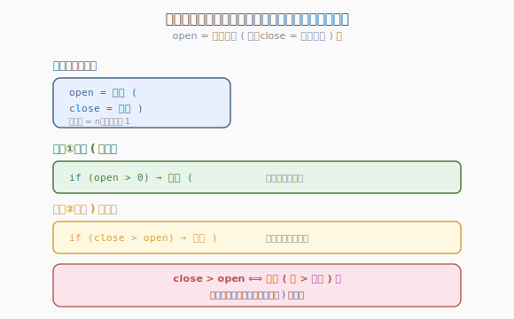
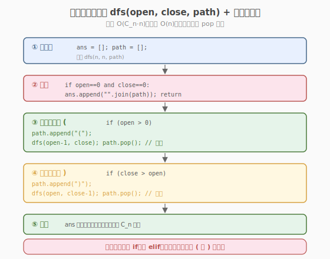
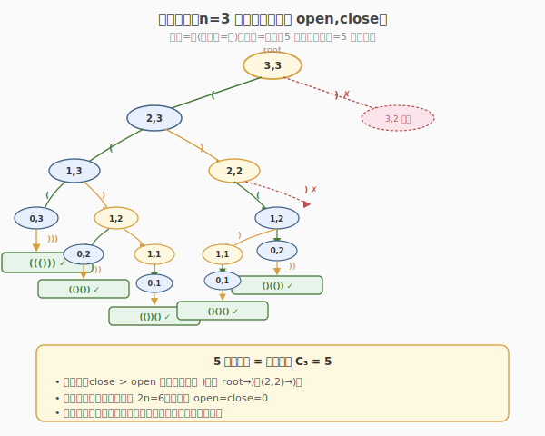

# 括号生成

- **题目名称**：括号生成
- **链接**：[22. 括号生成](https://leetcode.cn/problems/generate-parentheses/)
- **难度**：中等
- **标签**：字符串、回溯、递归

## 1. 题目概述

数字 `n` 代表生成括号的对数，请你设计一个函数，生成所有可能的并且**有效的**括号组合。

**示例 1**：

```text
输入：n = 3
输出：["((()))","(()())","(())()","()(())","()()()"]
```

**示例 2**：

```text
输入：n = 1
输出：["()"]
```

**约束条件**：

- `1 <= n <= 8`

> 💡 这是 [20. 有效括号](../../week9/day3/有效括号.md) 的对偶题——20 题是「给定字符串判定是否合法」，22 题是「枚举所有合法字符串」。核心都是**括号合法性条件**：任意前缀中 `(` 的数量 ≥ `)` 的数量，且总数 `n` 对恰好用完。这个「左括号余量」约束就是回溯的剪枝条件。

---

## 2. 解题思路

### 2.1 暴力思路：枚举所有 2^(2n) 序列再过滤

每个位置选 `(` 或 `)`，共 `2n` 个位置，生成 `2^(2n)` 个序列，逐个判断是否合法。`n=8` 时 `2^16 = 65536`，能过但极低效，且大量序列在中间就已非法（如 `))...` 开头）却仍要生成完整。

### 2.2 核心观察：回溯 + 余量剪枝



合法括号的充要条件可改写为**两个计数器约束**：

- `open` = 还能放多少个 `(`（初始 `n`，放一个减 1）
- `close` = 还能放多少个 `)`（初始 `n`，放一个减 1）

**剪枝规则**（保证任意前缀合法）：

1. **可放 `(` 的条件**：`open > 0`（左括号还有余量）
2. **可放 `)` 的条件**：`close > open`（已放的 `(` 比已放的 `)` 多，即当前前缀有未闭合的左括号）

> 💡 **为什么 `close > open` 是放 `)` 的条件？** `open`/`close` 是「剩余可放数」，而已放数 = `n - 剩余`。前缀中 `(` 比 `)` 多 ⟺ `(n - open) > (n - close)` ⟺ `close > open`。这个等价转换把「已放计数」的判断变成「剩余计数」的判断，无需维护额外的已放变量。

回溯就是在每个位置尝试两种选择，用这两个条件剪去非法分支。当 `open == close == 0` 时，2n 个位置填满且保证合法，记录答案。

### 2.3 算法流程图



**完整步骤**：

1. **初始化**：`ans = []`，`path = []`（用列表便于 append/pop）
2. **递归函数** `dfs(open, close, path)`：
   - **终止**：`open == 0 and close == 0` → `ans.append("".join(path))`，返回
   - **分支一（放 `(`）**：`if open > 0`：`path.append("(")` → `dfs(open-1, close, path)` → `path.pop()`
   - **分支二（放 `)`）**：`if close > open`：`path.append(")")` → `dfs(open, close-1, path)` → `path.pop()`
3. 调用 `dfs(n, n, [])`，返回 `ans`

> ⚠️ **两个分支都要试**（满足条件时），不能用 `if-elif`。因为同一位置既可能放 `(` 也可能放 `)`（当 `open>0` 且 `close>open` 同时成立），二者产生不同的合法串。回溯的「回」体现在每个分支结束后 `pop()` 恢复 `path`，让兄弟分支从相同状态出发。

### 2.4 示例演算

以 `n = 3` 为例，回溯树（节点标 `open,close`，边标选择）：



```text
dfs(3,3)
├─ ( → dfs(2,3)
│   ├─ ( → dfs(1,3)
│   │   ├─ ( → dfs(0,3)
│   │   │   └─ ) → dfs(0,2) → ) → dfs(0,1) → ) → dfs(0,0) ✓ "((()))"
│   │   └─ ) → dfs(1,2)
│   │       ├─ ( → dfs(0,2) → ) → dfs(0,1) → ) → dfs(0,0) ✓ "(()())"
│   │       └─ ) → dfs(1,1)
│   │           └─ ( → dfs(0,1) → ) → dfs(0,0) ✓ "(())()"
│   └─ ) → dfs(2,2)          (close=2 > open=2? 否, 2>2 假 → 不放) ✗
├─ ) → dfs(3,2)              (close=2 > open=3? 否 → 不放) ✗
```

更精确地，从 `dfs(3,3)` 出发：

| 路径 | 生成的串 | open,close 终态 |
|------|----------|-----------------|
| `((()))` | 左→左→左→右→右→右 | (0,0) ✓ |
| `(()())` | 左→左→右→左→右→右 | (0,0) ✓ |
| `(())()` | 左→左→右→右→左→右 | (0,0) ✓ |
| `()(())` | 左→右→左→左→右→右 | (0,0) ✓ |
| `()()()` | 左→右→左→右→左→右 | (0,0) ✓ |

共 5 个合法串，即 `n=3` 时的卡特兰数 $C_3 = \frac{1}{4}\binom{6}{3} = 5$。

> 💡 **注意 `dfs(2,2)` 这类分支被剪掉**：`close=2 > open=2` 不成立，不能放 `)`，因为此时已放的 `(` 和 `)` 数相等（前缀已闭合），再放 `)` 会让 `)` 多于 `(` 变成非法。剪枝让回溯树只长合法分支，效率远高于暴力枚举。

---

## 3. 参考代码

### C++

```cpp
// 括号生成.cpp —— 回溯 + 余量剪枝
// 编译: g++ -O2 -std=c++17 括号生成.cpp -o genparen
class Solution {
public:
    vector<string> generateParenthesis(int n) {
        vector<string> ans;
        string path;
        path.reserve(2 * n);
        dfs(n, n, path, ans);
        return ans;
    }
private:
    void dfs(int open, int close, string& path, vector<string>& ans) {
        if (open == 0 && close == 0) {
            ans.push_back(path);
            return;
        }
        if (open > 0) {                     // 可放 (
            path.push_back('(');
            dfs(open - 1, close, path, ans);
            path.pop_back();
        }
        if (close > open) {                 // 可放 )（前提：有未闭合的左括号）
            path.push_back(')');
            dfs(open, close - 1, path, ans);
            path.pop_back();
        }
    }
};
```

### Python

```python
class Solution:
    def generateParenthesis(self, n: int) -> List[str]:
        ans = []
        path = []

        def dfs(open: int, close: int):
            if open == 0 and close == 0:
                ans.append("".join(path))
                return
            if open > 0:                     # 可放 (
                path.append("(")
                dfs(open - 1, close)
                path.pop()
            if close > open:                 # 可放 )（前提：有未闭合的左括号）
                path.append(")")
                dfs(open, close - 1)
                path.pop()

        dfs(n, n)
        return ans
```

> 💡 **两个细节**：① 用 `path` 列表 + `append/pop` 而非字符串拼接，避免每次创建新对象的 `O(n)` 拷贝；记录答案时 `"".join(path)` 一次性转串。② C++ 的 `path.reserve(2*n)` 预分配，减少扩容。两个分支用**独立** `if` 而非 `if-elif`，因为同一位置可能两种选择都合法。

---

## 4. 复杂度分析

| 维度 | 复杂度 | 说明 |
|------|--------|------|
| **时间** | $O(C_n \cdot n)$ | 合法串数为卡特兰数 $C_n = \frac{1}{n+1}\binom{2n}{n}$，每个串长 `2n` |
| **空间** | $O(n)$ | 递归栈深度 `2n` + path 长度 `2n`（不计答案存储） |

> ⚠️ 卡特兰数 $C_n$ 增长近似 $\frac{4^n}{n^{3/2}\sqrt{\pi}}$，`n=8` 时 $C_8 = 1430$，规模可控。剪枝保证回溯树**只遍历合法前缀**，每个叶节点对应一个合法串，无冗余分支。

---

## 5. 扩展：闭合数递推与 DP

除了回溯，22 题还有基于**卡特兰递推**的 DP 解法。核心观察：任意合法括号串可写成 `A(B)` 的形式，其中 `A`、`B` 是合法括号串（可为空），`(` 与 `)` 是最外层的一对括号。

**递推**：`dp[i]` = `i` 对括号的所有合法串集合。则

$$dp[i] = \bigcup_{j=0}^{i-1} \{\, "( " + a + " )" + b \mid a \in dp[j],\ b \in dp[i-1-j] \,\}$$

含义：最外层第一对 `(` `)` 把内部 `j` 对括在中间，剩余 `i-1-j` 对放在右边。

```python
class Solution:
    def generateParenthesis(self, n: int) -> List[str]:
        dp = [[] for _ in range(n + 1)]
        dp[0] = [""]
        for i in range(1, n + 1):
            for j in range(i):                # 内层 j 对，外层右侧 i-1-j 对
                for a in dp[j]:
                    for b in dp[i - 1 - j]:
                        dp[i].append("(" + a + ")" + b)
        return dp[n]
```

> 💡 **回溯 vs DP**：回溯是「自顶向下」逐位置填字符，DP 是「自底向上」按对数构造。两者生成结果相同，但回溯代码更简洁、常数更小（无需集合拼接），面试首选。DP 的价值在于揭示括号串的递归结构，也是证明合法串数 = 卡特兰数的途径。

---

## 6. 面试要点

1. **为什么 `close > open` 是放 `)` 的条件？**

   > `open`/`close` 是剩余可放数。已放 `(` 数 = `n - open`，已放 `)` 数 = `n - close`。前缀合法要求已放 `(` ≥ 已放 `)`，即 `n - open ≥ n - close` → `close ≥ open`。放 `)` 还要满足有得放（`close > 0`），合并即 `close > open`（因为 `close > open ≥ 0` 蕴含 `close > 0`）。

2. **两个分支为什么用两个 `if` 而不是 `if-elif`？**

   > 同一位置可能 `(` 和 `)` 都合法（当 `open > 0` 且 `close > open` 同时成立）。`if-elif` 会在选了 `(` 后跳过 `)`，漏掉 `()(())` 这类串。两个独立 `if` 配合 `append/pop`，让两种选择各自作为独立分支探索，才是完整的回溯。

3. **合法括号串数为什么是卡特兰数？**

   > 卡特兰数 $C_n$ 计数「`n` 个 `(` 和 `n` 个 `)` 的合法前缀序列」。证明思路：总排列数 $\binom{2n}{n}$，减去非法（前缀 `)` 多于 `(` 的）数 $\binom{2n}{n-1}$，得 $C_n = \binom{2n}{n} - \binom{2n}{n-1} = \frac{1}{n+1}\binom{2n}{n}$。本题剪枝保证回溯树恰有 $C_n$ 个叶节点。

4. **`path` 用列表还是字符串？**

   > 列表 + `append/pop`。字符串在 Python 中不可变，`path + "("` 每次创建新对象，回溯时无法「撤销」，且拷贝开销 `O(n)`。列表是可变的，`pop()` `O(1)` 恢复，记录答案时 `"".join(path)` 一次性转串，整体 `O(C_n \cdot n)`。

5. **本题和「有效括号」（20）、「最长有效括号」（32）的区别？**

   > 20 是**判定**给定串是否合法（栈匹配）；32 是**求最长合法子串长度**（栈/DP）；22 是**枚举所有合法串**（回溯）。三者共享「括号合法性」定义，但范式不同：判定用栈，最优化用 DP，枚举用回溯。22 的剪枝条件 `close > open` 正是 20 题栈非空语义的「计数器化」。

> 💡 **一句话总结**：22 题是「回溯剪枝」的招牌——用 `open`/`close` 两个剩余计数器，剪枝条件 `open>0` 放 `(`、`close>open` 放 `)`，保证每个分支都是合法前缀。回溯树恰有卡特兰数 $C_n$ 个叶节点，时间 $O(C_n \cdot n)$。这个「剩余计数器剪枝」模板可迁移到所有「构造合法序列」问题，是面试必会的核心套路。

---

## 7. 同类练习题

- [20. 有效的括号](https://leetcode.cn/problems/valid-parentheses/)：判定给定串是否合法（栈），与本题的生成对偶
- [32. 最长有效括号](https://leetcode.cn/problems/longest-valid-parentheses/)：求最长合法子串（栈/DP），同一合法性的最优化版本
- [17. 电话号码的字母组合](https://leetcode.cn/problems/letter-combinations-of-a-phone-number/)：回溯枚举所有组合，结构类似但无合法性剪枝
- [301. 删除无效的括号](https://leetcode.cn/problems/remove-invalid-parentheses/)：删除最少括号使串合法，回溯 + 合法性剪枝的进阶
