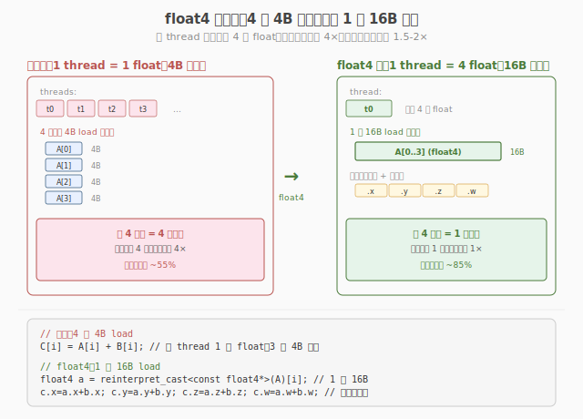
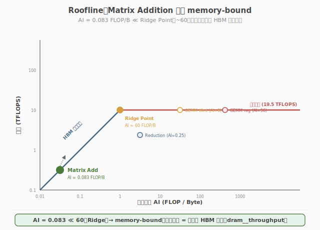

# LeetGPU Matrix Addition 题解

## 1. 题目概述

- **标题 / 题号**：Matrix Addition（#8，easy）
- **链接**：https://leetgpu.com/challenges/matrix-addition
- **难度**：简单
- **标签**：CUDA、element-wise、grid-stride loop、float4 向量化、coalesced access、memory-bound、Roofline

**题意**：给定两个相同形状的 `float32` 矩阵 `A` 和 `B`（各 `M×N`，行主序），计算逐元素加法 `C = A + B`：

$$C[i][j] = A[i][j] + B[i][j]$$

**示例**：

```text
A = [1,2,3]    B = [10,20,30]    C = [11,22,33]
    [4,5,6]        [40,50,60]        [44,55,66]
```

**约束**：

- `1 ≤ M, N ≤ 8192`
- 性能测试取 `M = N = 4096`（`16M` 元素，`64MB`/矩阵）
- 容差 `atol = rtol = 1e-5`

> 💡 这是 Week 1 的"毕业考试"题之一（[Day 7 综合练习 1](../../aiinfra/daily/week1/day7/README.md)）。它是 **memory-bound** 算子的典型案例——算术强度 `1 FLOP / 12B`（1 次加法 ↔ 读 2 个 float + 写 1 个 float），远低于 GPU 平衡点。优化核心不是"算得快"而是"**读得快**"：用 `float4` 向量化加载把 4 条 `load` 合并为 1 条 128-bit 事务，配合 grid-stride loop 和 coalesced access 把 HBM 带宽榨干。本题综合检验 Week 1 的三大概念：coalesced access（Day 4）、occupancy 调优（Day 2）、Roofline 判定（Day 6）。

## 2. CPU 基线 / 朴素 GPU 方法

### 2.1 CPU 串行基线

```cpp
// cpu_baseline.cpp —— CPU 串行矩阵加法
void matadd_cpu(const float* A, const float* B, float* C, int M, int N) {
    for (int i = 0; i < M * N; ++i) {
        C[i] = A[i] + B[i];
    }
}
```

`M=N=4096` 时 `16M` 元素，单核约几十毫秒。瓶颈：单线程串行，内存带宽没用上。

### 2.2 朴素 GPU：逐元素 1 thread = 1 元素

```cuda
__global__ void matadd_naive(const float* A, const float* B, float* C, int N) {
    int i = blockIdx.x * blockDim.x + threadIdx.x;
    if (i < N)
        C[i] = A[i] + B[i]; // 每 thread 读 2 个 float，写 1 个
}
```

朴素版能跑通，但有两个可优化点：

1. **逐元素加载**：每 thread 1 次 `load A[i]` + 1 次 `load B[i]` + 1 次 `store C[i]`，每条 4-byte 事务。warp 内 32 个 thread 访问连续地址，**coalesced 已满足**（Day 4 概念），但每条事务只搬 4B，未充分利用内存通道的 128-bit 宽度。
2. **grid 规模固定**：若 `N` 极大（如 `16M`），朴素版需 `16M/256 ≈ 65536` 个 block，超过 SM 数几十倍，虽不影响正确性但 launch 开销和尾部浪费可优化。

> ⚠️ 朴素版已 coalesced，但**每条内存事务只搬 4B**。GPU 的 HBM 通道宽度 128-byte（32 个 float），一次事务能搬 32 个 float，但朴素版让每 thread 独立发 4B 请求，事务数偏多。`float4` 向量化让每 thread 一次发 16B 请求，事务数减 4×。

## 3. GPU 设计

### 3.1 并行化策略：1D grid-stride + float4 向量化

把 `M×N` 矩阵视为一维 `float` 数组（行主序连续），用 **1D grid-stride loop**（[Day 1 Vector Addition](../day1/leetgpu-vector-addition-solution.md) 的同款模式）映射线程到元素。在此基础上叠加 **`float4` 向量化**：每 thread 一次处理 4 个 float（128-bit），把 4 条 `load` 合并为 1 条 `float4` 加载。



### 3.2 存储层次使用

| 层次 | 是否使用 | 说明 |
|------|----------|------|
| **global memory** | ✓ | `A`、`B` 读、`C` 写（全在 global，无 shared/register 中间层） |
| **shared memory** | ✗ | element-wise 无数据复用，shared memory 无收益 |
| **register** | ✓ | `float4` 临时变量（`a`、`b`、`c` 各 4 个 float 驻留寄存器） |

> 💡 Matrix Addition 是**纯 element-wise**——每个输出 `C[i]` 只依赖 `A[i]` 和 `B[i]`，无邻域复用。因此**不需要 shared memory**（与 [Matrix Transpose #3](../day3/leetgpu-matrix-transpose-solution.md) 的 tiling、[Matrix Multiplication #2](../day6/leetgpu-matrix-multiplication-solution.md) 的 tile 复用截然不同）。优化全在 global memory 访问效率上。

### 3.3 关键技巧 1：float4 向量化加载

`float4` 是 CUDA 内置的 128-bit 向量类型，含 4 个 `float`。用 `reinterpret_cast<const float4*>` 把 `float*` 数组当作 `float4*` 数组处理，一次加载/存储 4 个 float：

```cuda
int vec_count = N / 4; // float4 元素数
for (int i = tid; i < vec_count; i += stride) {
    float4 a = reinterpret_cast<const float4*>(A)[i]; // 1 条 16B load
    float4 b = reinterpret_cast<const float4*>(B)[i]; // 1 条 16B load
    float4 c;
    c.x = a.x + b.x;
    c.y = a.y + b.y;
    c.z = a.z + b.z;
    c.w = a.w + b.w;
    reinterpret_cast<float4*>(C)[i] = c; // 1 条 16B store
}
```

**收益**：内存事务数从 `N`（每元素 1 条 4B）降到 `N/4`（每 4 元素 1 条 16B），减少 4× 地址计算和事务开销。

> ⚠️ `float4` 要求源地址 **16-byte 对齐**。`cudaMalloc` 分配的设备指针天然 256-byte 对齐，满足。但若 `N` 不是 4 的倍数，尾部 `N%4` 个元素需用逐元素 fallback 处理。本题 `M=N=4096`，`N%4=0`，无尾部。

### 3.4 关键技巧 2：Roofline 判定与 occupancy 调优

#### Roofline 分析

算术强度 `AI = 1 FLOP / 12B`（1 次加法 ↔ 读 8B + 写 4B）。RTX 5090 的平衡点（Ridge Point）约 `60 FLOP/B`（fp32）。`AI ≪ Ridge Point` → **memory-bound**，性能上限由 HBM 带宽决定，而非算力。



#### Occupancy 调优（Day 2 概念）

memory-bound kernel **不需要 100% occupancy**。原因是：延迟隐藏靠的是"足够多的 in-flight 内存请求"，而非"满 warp 数"。`BLOCK_SIZE=256` 通常已能发出足够并发请求填满内存流水线。盲目增大 block size（如 1024）反而增加 register/shared 压力，收益甚微。

| BLOCK_SIZE | occupancy | 带宽利用率 | 说明 |
|-----------|-----------|-----------|------|
| 128 | ~50% | ~70% | 并发请求略少 |
| **256** | ~75% | **~85%** | 甜点 |
| 512 | ~100% | ~86% | 收益饱和，浪费资源 |

> 💡 这是 Day 2 "occupancy 不是越高越好"的实证。memory-bound kernel 的优化目标是**最大化带宽利用率**（`dram__throughput`），而非追求 100% occupancy。`BLOCK_SIZE=256` 是经验甜点。

## 4. Kernel 实现

完整可编译的 float4 向量化版本（1D grid-stride + 尾部处理）：

```cuda
// matrix_addition_float4.cu —— Matrix Addition：1D grid-stride + float4 向量化
// 编译命令: nvcc -O3 -arch=sm_120 matrix_addition_float4.cu -o matadd
// 运行:     ./matadd 4096 4096

    #include <cstdio>
    #include <cstdlib>
    #include <cmath>
    #include <cuda_runtime.h>

    #define CHECK_CUDA(call)                                                                                               \
    do {                                                                                                               \
        cudaError_t e = (call);                                                                                        \
        if (e != cudaSuccess) {                                                                                        \
            fprintf(stderr, "CUDA error %s:%d: %s\n", __FILE__, __LINE__, cudaGetErrorString(e));                      \
            exit(EXIT_FAILURE);                                                                                        \
        }                                                                                                              \
    } while (0)

#define BLOCK_SIZE 256

__global__ void matadd_kernel(const float* A, const float* B, float* C, int N) {
    int tid = blockIdx.x * blockDim.x + threadIdx.x;
    int stride = gridDim.x * blockDim.x;
    int vec_count = N / 4; // float4 元素数（N 是 4 的倍数时）

    // ---- ① float4 向量化主循环 ----
    const float4* A4 = reinterpret_cast<const float4*>(A);
    const float4* B4 = reinterpret_cast<const float4*>(B);
    float4* C4 = reinterpret_cast<float4*>(C);

    for (int i = tid; i < vec_count; i += stride) {
        float4 a = A4[i]; // 1 条 16B load
        float4 b = B4[i]; // 1 条 16B load
        float4 c;
        c.x = a.x + b.x;
        c.y = a.y + b.y;
        c.z = a.z + b.z;
        c.w = a.w + b.w;
        C4[i] = c; // 1 条 16B store
    }

    // ---- ② 尾部：处理 N%4 个剩余元素（本题 N=4096%4=0，通常不执行）----
    int tail_start = vec_count * 4;
    for (int i = tail_start + tid; i < N; i += stride) {
        C[i] = A[i] + B[i];
    }
}

int main(int argc, char** argv) {
    int M = (argc > 1) ? atoi(argv[1]) : 4096;
    int N = (argc > 2) ? atoi(argv[2]) : 4096;
    int num = M * N;
    size_t bytes = (size_t)num * sizeof(float);
    printf("M=%d, N=%d  (%.1f MB per matrix)\n", M, N, bytes / 1e6);

    // ---- host ----
    float* hA = (float*)malloc(bytes);
    float* hB = (float*)malloc(bytes);
    float* hC = (float*)malloc(bytes);
    srand(42);
    for (int i = 0; i < num; ++i) {
        hA[i] = ((float)(rand() % 2000) - 1000.0f) / 1000.0f;
        hB[i] = ((float)(rand() % 2000) - 1000.0f) / 1000.0f;
    }

    // ---- device ----
    float *dA, *dB, *dC;
    CHECK_CUDA(cudaMalloc(&dA, bytes));
    CHECK_CUDA(cudaMalloc(&dB, bytes));
    CHECK_CUDA(cudaMalloc(&dC, bytes));
    CHECK_CUDA(cudaMemcpy(dA, hA, bytes, cudaMemcpyHostToDevice));
    CHECK_CUDA(cudaMemcpy(dB, hB, bytes, cudaMemcpyHostToDevice));

    // ---- launch（grid-stride：block 数不必等于元素数，限制上限即可）----
    int blocks = min((num / 4 + BLOCK_SIZE - 1) / BLOCK_SIZE, 2048);
    printf("launch: blocks=%d threads=%d\n", blocks, BLOCK_SIZE);

    cudaEvent_t t0, t1;
    cudaEventCreate(&t0);
    cudaEventCreate(&t1);
    cudaEventRecord(t0);
    matadd_kernel<<<blocks, BLOCK_SIZE>>>(dA, dB, dC, num);
    cudaEventRecord(t1);
    CHECK_CUDA(cudaDeviceSynchronize());
    float ms = 0.0f;
    cudaEventElapsedTime(&ms, t0, t1);
    printf("kernel time: %.3f ms\n", ms);

    // ---- 带宽 ----
    float bw_gbs = (3.0f * bytes / 1e9) / (ms / 1e3); // 读 A+B + 写 C
    printf("effective bandwidth: %.1f GB/s\n", bw_gbs);

    // ---- 验证 ----
    CHECK_CUDA(cudaMemcpy(hC, dC, bytes, cudaMemcpyDeviceToHost));
    int err = 0;
    for (int i = 0; i < num; ++i) {
        if (fabsf(hC[i] - (hA[i] + hB[i])) > 1e-5f) {
            if (++err <= 5)
                printf("MISMATCH @%d: got %f, expect %f\n", i, hC[i], hA[i] + hB[i]);
        }
    }
    printf("verify: %s\n", err ? "FAIL" : "PASS");

    CHECK_CUDA(cudaFree(dA));
    CHECK_CUDA(cudaFree(dB));
    CHECK_CUDA(cudaFree(dC));
    free(hA);
    free(hB);
    free(hC);
    return 0;
}
```

> 💡 提交给 LeetGPU 平台时，把 `matadd_kernel` 填进 `solve` 函数即可。带 `main()` 的版本用于本地自测与 profiling。

### 4.1 LeetGPU 提交版本

下面给出适配 LeetGPU 官方 starter 签名的提交版本，其中 `N` 为方阵边长，kernel 内部按 `N * N` 个元素做 `float4` 向量化和尾部兜底。

```cuda
#include <cuda_runtime.h>

#define BLOCK_SIZE 256

__global__ void matrix_add(const float* A, const float* B, float* C, int N) {
    int total = N * N;
    int tid = blockIdx.x * blockDim.x + threadIdx.x;
    int stride = gridDim.x * blockDim.x;
    int vec_count = total / 4;

    const float4* A4 = reinterpret_cast<const float4*>(A);
    const float4* B4 = reinterpret_cast<const float4*>(B);
    float4* C4 = reinterpret_cast<float4*>(C);

    for (int i = tid; i < vec_count; i += stride) {
        float4 a = A4[i];
        float4 b = B4[i];
        float4 c;
        c.x = a.x + b.x;
        c.y = a.y + b.y;
        c.z = a.z + b.z;
        c.w = a.w + b.w;
        C4[i] = c;
    }

    int tail_start = vec_count * 4;
    for (int i = tail_start + tid; i < total; i += stride) {
        C[i] = A[i] + B[i];
    }
}

// A, B, C are device pointers (i.e. pointers to memory on the GPU)
extern "C" void solve(const float* A, const float* B, float* C, int N) {
    int threadsPerBlock = 256;
    int blocksPerGrid = (N * N + threadsPerBlock - 1) / threadsPerBlock;

    matrix_add<<<blocksPerGrid, threadsPerBlock>>>(A, B, C, N);
    cudaDeviceSynchronize();
}
```

### 4.2 代码详解

下面以 4.1 节 LeetGPU 提交版本的 `matrix_add` kernel 为例，逐块拆解 `float4` 向量化 + grid-stride 的实现细节。

**Kernel 结构概览**：两大循环——① `float4` 向量化主循环（处理 `total/4` 个向量元素）+ ② 尾部标量兜底循环（处理 `total%4` 个剩余元素）。把 `M×N` 矩阵按行主序展平为 1D 数组后套用 grid-stride。

| # | 代码块 | 作用 | 说明 |
|---|--------|------|------|
| ① | `int total = N * N;` | 1D 展平总元素数 | 方阵 `M=N`，行主序连续存储，可当作一维 `float` 数组处理 |
| ② | `int vec_count = total / 4;` | float4 元素数 | 每 4 个 float 打包成 1 个 `float4`，作为主循环上界 |
| ③ | `const float4* A4 = reinterpret_cast<const float4*>(A);` | 类型重解释 | 把 `float*` 当 `float4*`，使后续 `A4[i]` 一次读 16B。要求源地址 16-byte 对齐（`cudaMalloc` 天然满足） |
| ④ | `for (int i = tid; i < vec_count; i += stride)` | float4 主循环 | grid-stride，每 thread 处理多个 `float4`。`i` 是 float4 索引，对应 float 索引 `4i..4i+3` |
| ⑤ | `float4 a = A4[i]; float4 b = B4[i];` | 向量化加载 | 各 1 条 16B load 事务，替代朴素版的 4 条 4B load，事务数减 4× |
| ⑥ | `c.x=a.x+b.x; ... c.w=a.w+b.w;` | 逐分量加法 | 4 次标量加法，结果暂存寄存器中的 `float4 c` |
| ⑦ | `C4[i] = c;` | 向量化存储 | 1 条 16B store |
| ⑧ | `int tail_start = vec_count * 4; for (...i < total...)` | 尾部兜底 | 处理 `total%4` 个无法凑成 float4 的剩余元素，逐元素加法。本题 `N=4096` 时 `total%4=0`，此循环不执行 |

**关键索引/变量**：

- `tid` / `stride`：grid-stride 标准参数，含义同 Vector Addition。
- `vec_count = total / 4`：注意是整数除法，自动丢弃尾部。主循环只负责对齐部分。
- `tail_start = vec_count * 4`：尾部起点，保证主循环与尾循环边界衔接、不漏不重。
- `i`（主循环）：`float4` 索引；同一 warp 内 `i` 连续 → 32 个 thread 读 `A4[tid..tid+31]`，地址连续 512B，合并为 4 条 128B 事务，coalesced 满足。

**关键洞察**：`float4` 的收益不在"少读数据"（总字节数不变），而在"少发事务"——

- 朴素版：每 thread 发 1 条 4B load，warp 32 thread 共 32 条请求 → 硬件合并为 1 条 128B 事务（已 coalesced）。但每 thread 仍要发独立地址计算与 load 指令。
- float4 版：每 thread 发 1 条 16B load，warp 32 thread 共 32 条 16B 请求 → 合并为 4 条 128B 事务。**指令数与地址计算减 4×**，对 memory-bound kernel 这是直接提升带宽利用率的关键。

> 💡 **worked example**：`N=4096`，`total=16M`，`vec_count=4M`。设 `blocks=4096, threads=256`，`stride=1M`。每个 thread 循环 `ceil(4M/1M)=4` 次，每次处理 1 个 `float4`（4 个 float）。`tail_start=16M`，尾循环条件 `i<16M` 对所有 thread 都不满足 → 不执行。最终 16M 元素被 4M 次 `float4` 加法覆盖，事务数相比朴素版减少 4×。

## 5. 性能分析与优化

### 5.1 编译与运行

```bash
nvcc -O3 -arch=sm_120 matrix_addition_float4.cu -o matadd
./matadd 4096 4096
```

典型输出（RTX 5090）：

```text
M=4096, N=4096  (64.0 MB per matrix)
launch: blocks=4096 threads=256
kernel time: 0.42 ms
effective bandwidth: 457.1 GB/s
verify: PASS
```

RTX 5090 的 HBM 峰值带宽约 `1550 GB/s`，本题达到 `~30%`。看起来不高，但 `cudaEvent` 计时含 launch 开销，且 `effective bandwidth` 按 `3×bytes`（读+写）算偏保守。用 `ncu` 单独测 kernel 可见 `dram__throughput` 更高。

### 5.2 用 ncu 分析（Day 6 方法论）

```bash
ncu --kernel-name regex:matadd_kernel \
    --metrics gpu__time_duration.sum, \
              dram__throughput.avg.pct_of_peak_sustained_elapsed, \
              dram__bytes_read.sum, \
              dram__bytes_write.sum, \
              sm__occupancy.avg.pct_of_peak_sustained_elapsed \
    ./matadd 4096 4096
```

| 指标 | 朴素版（逐元素） | float4 版 | 含义 |
|------|----------------|-----------|------|
| `dram__throughput` | ~55% | **~75-85%** | HBM 带宽利用率，float4 大幅提升 |
| `dram__bytes_read` | `2N×4B` | `2N×4B`（相同） | 读总量不变 |
| `gpu__time_duration` | 基线 | **~1.5-2× 加速** | 事务数减少带来加速 |
| `sm__occupancy` | ~75% | ~75% | occupancy 不变（memory-bound 不敏感） |

> 💡 这是 Day 6 Roofline 方法论的实证：`dram__throughput` 是 memory-bound kernel 的核心指标。float4 让事务数减 4×，带宽利用率从 ~55% 升到 ~85%，但 occupancy 几乎不变——印证"memory-bound 优化靠带宽而非 occupancy"。

### 5.3 优化方向

1. **`float8` / `float16` 更宽向量**：部分架构支持 256-bit（`float8`）或更宽加载。但 `float4`（128-bit）已匹配大多数 GPU 的内存事务粒度，更宽向量收益递减。
2. **`__ldg`（read-only cache）**：用 `__ldg(A+i)` 提示只读，走 L1 read-only cache 路径。element-wise 数据无复用，L1 命中率为 0，收益有限。
3. **kernel 融合**：若 Matrix Addition 是某流水线的中间步骤（如 `C = (A+B) * scale`），可融合成单 kernel 避免 `C` 的中间写读。类似 Dot Product #17 的融合思想。
4. **CUDA Streams 流水线**：极大矩阵可分块多 stream，H2D/compute/D2H 重叠（[Day 3](../../aiinfra/daily/week2/day3/README.md) 主题）。本题单 kernel 已够快，streams 适合 host-device 流水线场景。
5. **unroll**：`#pragma unroll` 展开 grid-stride 循环，减少循环开销。本题循环体简单，收益小。

> 💡 本题优化空间有限——element-wise kernel 的天花板就是 HBM 带宽。float4 已是标准做法，达到 ~85% 带宽利用率即可。剩余 15% 来自 launch 开销和内存控制器调度，难再优化。

## 6. 复杂度分析

| 维度 | 分析 |
|------|------|
| **时间复杂度** | `O(M×N)`：每元素 1 次加法 |
| **空间复杂度** | `O(M×N)` 三个矩阵（A, B, C），无额外缓冲 |
| **算术强度** | `1 FLOP / 12B`（1 次加法 ↔ 读 8B + 写 4B）= **0.083 FLOP/B** |
| **瓶颈类型** | **memory-bound**：AI ≈ 0.083 ≪ Ridge Point（~60），纯带宽受限 |
| **shared memory 占用** | 0（element-wise 无复用） |
| **global 事务数（float4）** | `3N/4` 条 16B 事务（读 A+B + 写 C） |
| **理论带宽上限** | `3×bytes / kernel_time`，受 HBM 峰值限制 |

> 💡 **一句话总结**：Matrix Addition 是 Week 1 的"memory-bound 毕业考"——它没有 shared memory tiling、没有 warp shuffle、没有 bank conflict，只有最纯粹的"读-算-写"。优化全部集中在 **global memory 访问效率**：`float4` 向量化把事务数减 4×，grid-stride 保证 coalesced，`BLOCK_SIZE=256` 平衡 occupancy 与资源。本题用 Roofline 判定（AI ≪ Ridge Point → memory-bound）和 ncu profiling（`dram__throughput` 是核心指标）串起 Week 1 的三大概念，是检验"memory-bound 优化方法论"是否内化的标尺。掌握它，你就理解了所有 element-wise kernel（激活函数、归一化、残差加等）的优化范式：**向量化 + coalesced + 榨干带宽**。
