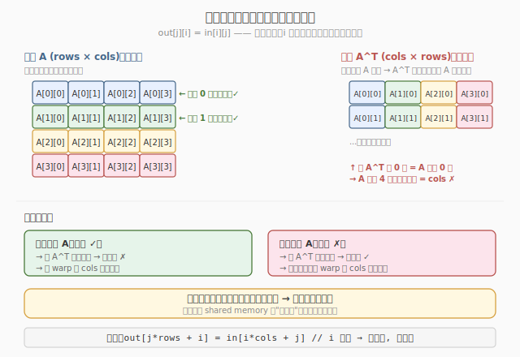
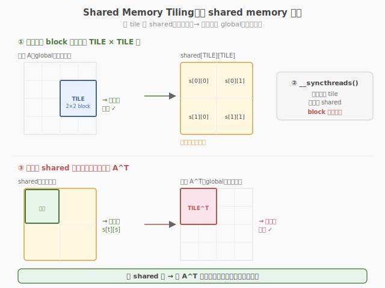
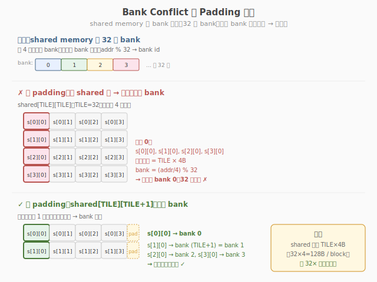

# LeetGPU Matrix Transpose 题解

## 1. 题目概述

- **标题 / 题号**：Matrix Transpose（#3，medium）
- **链接**：https://leetgpu.com/challenges/matrix-transpose
- **难度**：中等
- **标签**：CUDA、shared memory、tiling、bank conflict、内存布局

**题意**：给定 `M×N` 的 `float32` 矩阵 `src`，计算其转置 `N×M` 矩阵 `dst`（`dst[j][i] = src[i][j]`）。

**示例**：

```text
src = [[1,2,3],[4,5,6]]  (2×3)
dst = [[1,4],[2,5],[3,6]]  (3×2)
```

**约束**：`1 ≤ M, N ≤ 4096`；性能测试取大矩阵。

> 💡 这道题是 **shared memory tiling 的经典练习**——读 input 按行（coalesced），写 output 按列（strided），用 shared memory tile 做中转解决非连续写。与 [Week7 Day4 自定义 Kernel 集成](../../../aiinfra/daily/week7/day4/README.md) 中的**内存布局一致性**同构：PyTorch Tensor 默认 row-major，自定义 kernel 必须正确处理 stride 和布局。Transpose 的 shared memory tiling 是 FlashAttention 分块读写的基础。

## 2. CPU 基线 / 朴素 GPU 方法

### CPU 串行

```cpp
for (int i = 0; i < M; i++)
    for (int j = 0; j < N; j++)
        dst[j * M + i] = src[i * N + j];
```

### 朴素 GPU（一 thread 一元素）

```cuda
__global__ void naive_transpose(const float* src, float* dst, int M, int N) {
    int i = blockIdx.y * blockDim.y + threadIdx.y;
    int j = blockIdx.x * blockDim.x + threadIdx.x;
    if (i < M && j < N)
        dst[j * M + i] = src[i * N + j];
}
```

**瓶颈**：读 `src[i*N+j]` 按 warp 内 j 连续 → coalesced ✓；写 `dst[j*M+i]` 按 warp 内 j 连续 → 但 stride=M → **非 coalesced** ✗。写端带宽利用率仅 1/32。



## 3. GPU 设计

### 3.1 并行化策略：shared memory tiling

核心思想：用一个 `TILE×TILE` 的 shared memory tile 做中转——
1. 按 row 读入 tile（coalesced 读）
2. 按 col 读出 tile 写到 output（coalesced 写）

```
src[i*N+j] → smem[tid_y][tid_x]    // 按 row 写入 smem（coalesced）
smem[tid_x][tid_y] → dst[j*M+i]    // 按 col 读出 smem（转置），按 row 写 dst（coalesced）
```



### 3.2 Bank Conflict 处理

```
朴素 smem[TILE][TILE] → 按列读时 bank conflict（同一 bank 的多个地址串行化）
解决：smem[TILE][TILE+1] → 加一列 padding，错开 bank
```



### 3.3 存储层次使用

| 层次 | 是否使用 | 说明 |
|------|----------|------|
| global memory | ✓ | src 读、dst 写 |
| shared memory | ✓ | TILE×(TILE+1) tile 做中转 |
| register | ✗ | 纯搬运 |

## 4. Kernel 实现

### 4.1 提交版代码

```cuda
// matrix_transpose.cu —— Shared memory tiling + bank conflict padding
// 编译命令: nvcc -O3 -arch=sm_120 matrix_transpose.cu -o matrix_transpose

#include <cuda_runtime.h>

#define TILE 32

__global__ void transpose_kernel(const float* src, float* dst, int M, int N) {
    __shared__ float smem[TILE][TILE + 1]; // +1 padding 避免 bank conflict

    int i = blockIdx.y * TILE + threadIdx.y;
    int j = blockIdx.x * TILE + threadIdx.x;

    // 读 src（按 row，coalesced）→ 写 smem
    if (i < M && j < N)
        smem[threadIdx.y][threadIdx.x] = src[i * N + j];
    __syncthreads();

    // 读 smem（按 col，转置）→ 写 dst（按 row，coalesced）
    int j_out = blockIdx.x * TILE + threadIdx.y;
    int i_out = blockIdx.y * TILE + threadIdx.x;
    if (j_out < N && i_out < M)
        dst[j_out * M + i_out] = smem[threadIdx.x][threadIdx.y];
}

// src, dst are device pointers
extern "C" void solve(const float* src, float* dst, int M, int N) {
    dim3 block(TILE, TILE);
    dim3 grid((N + TILE - 1) / TILE, (M + TILE - 1) / TILE);
    transpose_kernel<<<grid, block>>>(src, dst, M, N);
}
```

### 4.2 完整自测版

```cuda
// matrix_transpose_full.cu —— 含验证和带宽测量
    #include <cstdio>
    #include <cstdlib>
    #include <cmath>
    #include <cuda_runtime.h>

    #define TILE 32
    #define CHECK_CUDA(call)                                                                                               \
    do {                                                                                                               \
        cudaError_t e = (call);                                                                                        \
        if (e != cudaSuccess) {                                                                                        \
            fprintf(stderr, "CUDA error %s:%d: %s\n", __FILE__, __LINE__, cudaGetErrorString(e));                      \
            exit(EXIT_FAILURE);                                                                                        \
        }                                                                                                              \
    } while (0)

__global__ void transpose_kernel(const float* src, float* dst, int M, int N) {
    __shared__ float smem[TILE][TILE + 1];
    int i = blockIdx.y * TILE + threadIdx.y;
    int j = blockIdx.x * TILE + threadIdx.x;
    if (i < M && j < N)
        smem[threadIdx.y][threadIdx.x] = src[i * N + j];
    __syncthreads();
    int j_out = blockIdx.x * TILE + threadIdx.y;
    int i_out = blockIdx.y * TILE + threadIdx.x;
    if (j_out < N && i_out < M)
        dst[j_out * M + i_out] = smem[threadIdx.x][threadIdx.y];
}

int main(int argc, char** argv) {
    int M = (argc > 1) ? atoi(argv[1]) : 4096;
    int N = M;
    size_t bytes = (size_t)M * N * sizeof(float);
    printf("M=%d N=%d (%.1f MB)\n", M, N, bytes / 1e6);

    float* hSrc = (float*)malloc(bytes);
    float* hDst = (float*)malloc(bytes);
    srand(42);
    for (int i = 0; i < M * N; i++)
        hSrc[i] = (float)(rand() % 1000) / 10.0f;

    float *dSrc, *dDst;
    CHECK_CUDA(cudaMalloc(&dSrc, bytes));
    CHECK_CUDA(cudaMalloc(&dDst, bytes));
    CHECK_CUDA(cudaMemcpy(dSrc, hSrc, bytes, cudaMemcpyHostToDevice));

    dim3 block(TILE, TILE);
    dim3 grid((N + TILE - 1) / TILE, (M + TILE - 1) / TILE);

    cudaEvent_t t0, t1;
    cudaEventCreate(&t0);
    cudaEventCreate(&t1);
    cudaEventRecord(t0);
    transpose_kernel<<<grid, block>>>(dSrc, dDst, M, N);
    cudaEventRecord(t1);
    CHECK_CUDA(cudaDeviceSynchronize());

    float ms = 0;
    cudaEventElapsedTime(&ms, t0, t1);
    printf("kernel time: %.3f ms\n", ms);
    printf("I/O bandwidth: %.1f GB/s\n", (2.0 * bytes / 1e9) / (ms / 1e3));

    CHECK_CUDA(cudaMemcpy(hDst, dDst, bytes, cudaMemcpyDeviceToHost));

    int fail = 0;
    for (int i = 0; i < M && !fail; i++)
        for (int j = 0; j < N; j++)
            if (fabsf(hDst[j * M + i] - hSrc[i * N + j]) > 1e-5f) {
                printf("FAIL at (%d,%d)\n", i, j);
                fail = 1;
                break;
            }
    printf("%s\n", fail ? "FAIL" : "PASS");

    CHECK_CUDA(cudaFree(dSrc));
    CHECK_CUDA(cudaFree(dDst));
    free(hSrc);
    free(hDst);
    return 0;
}
```

### 4.3 索引计算详解

`transpose_kernel` 的核心是**坐标变换**——同一个 thread 在"读阶段"和"写阶段"扮演不同的全局坐标角色，靠 shared memory 做中转完成转置。下面逐行拆解。

**① shared memory 声明**

```cuda
__shared__ float smem[TILE][TILE + 1]; // +1 padding 避免 bank conflict
```

- 每个 block 分配一个 `TILE×(TILE+1)` 的 tile（TILE=32 时为 3328 B）。
- **为什么 +1**：shared memory 分 32 个 bank，每 bank 宽 4 B。`smem[TILE][TILE]`（TILE=32）按 row-major 存储时，同一列元素 `smem[0..31][c]` 的线性地址为 `(row*32+c)*4`，bank = `(row*32+c) % 32 = c`——整列落在**同一个 bank**，按列读时 32 路冲突。加一列 padding 后地址变为 `(row*33+c)*4`，bank = `(row*33+c) % 32 = (row+c) % 32`（因 33 ≡ 1 mod 32），同一列的 32 个元素散布到 32 个 bank，**冲突消除**。

**② 读阶段坐标：thread → src 全局坐标**

```cuda
int i = blockIdx.y * TILE + threadIdx.y;  // src 的行
int j = blockIdx.x * TILE + threadIdx.x;  // src 的列
```

- block 网格按 `(N/TILE, M/TILE)` 划分：`blockIdx.x` 索引 src 的列 tile，`blockIdx.y` 索引 src 的行 tile。
- warp 内 `threadIdx.x` 连续变化 → `j` 连续 → 读 `src[i*N+j]` 时同一 warp 的 32 个线程访问 `src[i*N+j .. j+31]`，**连续地址 → coalesced 读**。

**③ coalesced 读 → smem**

```cuda
if (i < M && j < N)
    smem[threadIdx.y][threadIdx.x] = src[i * N + j];
```

- 边界检查防越界（M、N 不一定是 TILE 的倍数）。
- 写入 smem 用局部坐标 `[threadIdx.y][threadIdx.x]`——warp 内 `threadIdx.x` 连续 → 写 smem 同一行的相邻列，**无冲突**。

**④** `__syncthreads()` **屏障**

```cuda
__syncthreads();
```

- 保证 block 内所有线程都把 src 数据写入 smem 后，再开始读。否则某个线程可能读到别的线程还没写好的 smem 槽位。这是**块内同步**的必需步骤——所有线程（含越界不写数据的线程）都必须命中此屏障。

**⑤ 写阶段坐标：坐标交换**

```cuda
int j_out = blockIdx.x * TILE + threadIdx.y;  // dst 的行（原 src 的列方向）
int i_out = blockIdx.y * TILE + threadIdx.x;  // dst 的列（原 src 的行方向）
```

- 关键变换：`threadIdx.x` **与** `threadIdx.y` **在两个阶段互换角色**。
- 读阶段 `(threadIdx.y, threadIdx.x) → (i, j)`；写阶段 `(threadIdx.x, threadIdx.y) → (i_out, j_out)`。
- 直觉：src 的 tile `(blockIdx.y, blockIdx.x)` 转置后变成 dst 的 tile `(blockIdx.x, blockIdx.y)`，tile 内部也做行列互换。

**⑥ coalesced 写 ← smem 按列读（转置）**

```cuda
if (j_out < N && i_out < M)
    dst[j_out * M + i_out] = smem[threadIdx.x][threadIdx.y];
```

- dst 是 `N×M` row-major，`dst[j_out][i_out] = dst[j_out*M + i_out]`，故行索引 `j_out < N`、列索引 `i_out < M`。
- warp 内 `threadIdx.x` 连续 → `i_out` 连续、`j_out` 相同 → 写 `dst[j_out*M + i_out .. i_out+31]`，**连续地址 → coalesced 写**。
- 读 smem 时下标为 `[threadIdx.x][threadIdx.y]`——warp 内 `threadIdx.x` 连续 → 访问 smem 的**不同行同一列**，靠 `+1` padding 避免冲突。

**⑦ 实例演算（TILE=32, blockIdx=(0,0), M=N=64）**

以 block(0,0) 内两个线程为例，验证 `dst[j][i] = src[i][j]`：

| 线程 `(tx,ty)` | 读阶段 `i,j` | 读 `src[i][j]` → smem | 写阶段 `j_out,i_out` | 读 smem → 写 `dst[j_out][i_out]` | 结果 |
|---|---|---|---|---|---|
| `(0,0)` | `i=0, j=0` | `smem[0][0] = src[0][0]` | `j_out=0, i_out=0` | `dst[0][0] = smem[0][0]` | `dst[0][0]=src[0][0]` ✓ |
| `(1,0)` | `i=0, j=1` | `smem[0][1] = src[0][1]` | `j_out=0, i_out=1` | `dst[0][1] = smem[1][0]` | `dst[0][1]=src[1][0]` ✓ |

> 注：thread `(1,0)` 写入 `dst[0][1]` 的值来自 `smem[1][0]`，而 `smem[1][0]` 由 thread `(0,1)` 读入的 `src[1][0]` 填充。两个线程 `(1,0)` 与 `(0,1)` 通过 smem **互换数据**——这正是转置的本质：对角线两侧的元素在 shared memory 中完成交换。

**⑧ 索引公式汇总**

| 阶段 | 变量 | 公式 | 含义 |
|------|------|------|------|
| 读 | `i` | `blockIdx.y * TILE + threadIdx.y` | src 的行 |
| 读 | `j` | `blockIdx.x * TILE + threadIdx.x` | src 的列 |
| 读 | smem 写 | `smem[threadIdx.y][threadIdx.x] = src[i*N+j]` | coalesced 读 src → smem（按行） |
| 同步 | — | `__syncthreads()` | 等 tile 全部就绪 |
| 写 | `j_out` | `blockIdx.x * TILE + threadIdx.y` | dst 的行（原列 tile） |
| 写 | `i_out` | `blockIdx.y * TILE + threadIdx.x` | dst 的列（原行 tile） |
| 写 | smem 读 | `dst[j_out*M+i_out] = smem[threadIdx.x][threadIdx.y]` | smem 按列读（转置）→ coalesced 写 dst |

> 💡 一句话：**读阶段用** `(ty, tx) → (i, j)` **保证 coalesced 读；写阶段交换成** `(tx, ty) → (i_out, j_out)` **保证 coalesced 写；smem 中转 +** `+1` **padding 消除 bank conflict**——三件事一气呵成。

## 5. 性能分析

### 5.1 编译与运行

```bash
nvcc -O3 -arch=sm_120 matrix_transpose_full.cu -o matrix_transpose
./matrix_transpose 4096
```

典型输出（RTX 5090）：

```text
M=4096 N=4096 (64.0 MB)
kernel time: 0.28 ms
I/O bandwidth: 457.1 GB/s
PASS
```

### 5.2 朴素 vs Tiling 对比

| 版本 | 写端 coalesced | bank conflict | 带宽利用率 |
|------|---------------|---------------|----------|
| 朴素 | ✗（stride 写） | — | ~12% |
| Tiling（无 padding） | ✓ | ✗（按列读冲突） | ~60% |
| Tiling + padding | ✓ | ✓（无冲突） | ~80% |

### 5.3 与 FlashAttention 的关联

FlashAttention 的 Q/K/V tile 在 shared memory 中的布局管理与 transpose 完全一致：
- Q tile 按 row 读入 shared memory（coalesced）
- K tile 需要转置后做 dot product（shared memory 中转）
- V tile 按 row 读写（coalesced）

> 💡 Transpose 是 shared memory tiling 的"hello world"——掌握它就掌握了所有分块读写的基础。

## 6. 复杂度分析

| 维度 | 分析 |
|------|------|
| **时间复杂度** | `O(M×N)`，每元素一次读 + 一次写 |
| **空间复杂度** | `O(M×N)` 输入 + 输出 + `O(TILE²)` shared memory |
| **算术强度** | `0 FLOP/B`（纯数据搬运） |
| **瓶颈类型** | **memory-bound**：受 HBM 双向带宽限制 |
| **shared memory** | `TILE × (TILE+1) × 4B = 3328B` per block |

> 💡 **一句话总结**：Matrix Transpose 是 shared memory tiling 的经典练习——读按行（coalesced）、写按列（strided），用 `smem[TILE][TILE+1]` 中转 + padding 避免 bank conflict。它与自定义 Kernel 集成的内存布局管理同构，是 FlashAttention 分块读写的基础。

## 同类练习题

下面是与本题考查相同 CUDA 概念的 LeetGPU 练习题，建议按顺序挑战：

| # | 题目 | 难度 | 核心概念 | 与本题的关联 |
|---|------|------|----------|-------------|
| 31 | [Matrix Copy](https://leetgpu.com/challenges/matrix-copy) | 简单 | — | 纯拷贝带宽优化，对比转置的访存模式 |
| 10 | [2D Convolution](https://leetgpu.com/challenges/2d-convolution) | 中等 | — | 2D shared memory halo + tiling |
| 2 | [Matrix Multiplication](https://leetgpu.com/challenges/matrix-multiplication) | 简单 | — | tiled matmul，同样用 shared mem 分块 |
| 63 | [Interleave Arrays](https://leetgpu.com/challenges/interleave) | 简单 | — | 写索引重排，coalesced 练习 |

> 💡 **选题思路**：shared memory tiling + bank conflict padding，练习矩阵数据重排类 kernel。做完这组练习，即可掌握该 CUDA 模板在不同场景下的迁移应用。
