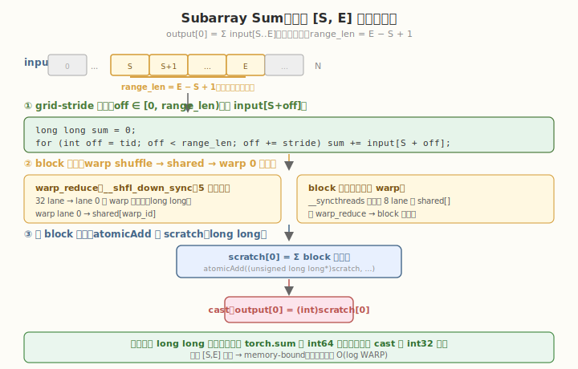

# LeetGPU Subarray Sum 题解

## 1. 题目概述

- **标题 / 题号**：Subarray Sum（#47，medium）
- **链接**：https://leetgpu.com/challenges/subarray-sum
- **难度**：中等
- **标签**：CUDA、归约（reduction）、warp shuffle、block 归约、范围求和、memory-bound

**题意**：给定长度为 `N` 的 `int32` 数组 `input`，计算下标区间 `[S, E]`（含两端）内所有元素之和，等价于 `output[0] = torch.sum(input[S : E + 1])`，结果写入 `int32` 标量 `output[0]`。

**示例**：

```text
输入：input = [3, 1, 4, 1, 5, 9, 2, 6], S = 2, E = 5
区间：input[2..5] = [4, 1, 5, 9]
输出：output[0] = 4 + 1 + 5 + 9 = 19
```

**约束**：

- `1 ≤ N ≤ 100,000,000`
- `0 ≤ S ≤ E < N`
- 性能测试取 `N = 100,000,000`
- `solve` 函数签名不可改，外部库禁用，结果必须写入 `output[0]`

> 💡 这道题是 **范围归约**的经典练习：只对 `[S, E]` 这一段求和，本质是 [Reduction #4](https://leetgpu.com/challenges/reduction) 的「区间版本」。它把 **grid-stride 累加 + 两级 block 归约** 这一套模板练透——而这套模板正是 LayerNorm（求 mean/var）、Softmax（求 max/sum）等 kernel 的底层组件。

## 2. CPU 基线 / 朴素 GPU 方法

### 2.1 CPU 串行基线

最直观的串行实现就是一个 `for` 循环累加：

```cpp
// cpu_baseline.cpp —— CPU 串行范围求和
void subarray_sum_cpu(const int* input, int* output, int N, int S, int E) {
    long long sum = 0;
    for (int i = S; i <= E; ++i) {
        sum += input[i];
    }
    output[0] = (int)sum;
}
```

`N = 100,000,000`、区间接近全长时，单核约耗时 **上百毫秒**。瓶颈显而易见：**一个核心串行处理上亿次加法**，带宽与算力都没用上。

> ⚠️ 注意 CPU 基线用 `long long` 累加再 cast 到 `int`——这正是 `torch.sum(int32)` 返回 `int64` 再赋给 `int32` 输出的语义。GPU 实现也必须用 `long long` 内部累加，否则在正负值混合时 block 部分和可能溢出 `int32`，导致结果错误。

### 2.2 朴素 GPU：单 thread 串行

```cuda
// 一个 thread 算完全部——无并行，比 CPU 还慢（有 launch 开销）
__global__ void naive_subarray_sum(const int* input, int* output, int S, int E) {
    long long sum = 0;
    for (int i = S; i <= E; ++i) {
        sum += input[i];
    }
    output[0] = (int)sum;
}
```

**瓶颈**：单 thread 串行，无并行，GPU 完全闲置；`long long` 累加上亿次，延迟与 CPU 相当甚至更差。



## 3. GPU 设计

### 3.1 并行化策略：grid-stride 累加 + 两级归约

经典两级归约，只是把「全程求和」改成「区间求和」：

1. **grid-stride 累加**：把区间 `[S, E]` 映射成 `off ∈ [0, range_len)`，`range_len = E - S + 1`。每个 thread 沿 `stride` 跳着累加 `input[S + off]`，部分和驻留寄存器（`long long`）。
2. **block 内归约**：每 block 用 warp shuffle 树形归约得到 `block_sum`（`long long`）。
3. **跨 block 归约**：所有 `block_sum` 用 `atomicAdd` 累加到一个 `long long` 临时缓冲，最后 cast 成 `int32` 写入 `output[0]`。

核心伪代码：

```text
range_len = E - S + 1;
tid    = blockIdx.x * blockDim.x + threadIdx.x;
stride = gridDim.x  * blockDim.x;
long long sum = 0;
for (int off = tid; off < range_len; off += stride)
    sum += input[S + off];
// warp_reduce(sum) → block_reduce(sum) → atomicAdd(scratch, sum)
// 最后：output[0] = (int)scratch[0]
```

### 3.2 存储层次使用

| 数据 | 存储 | 说明 |
|------|------|------|
| `input[]` | global memory | 只读 `[S, E]` 一段，合并访存 |
| 部分和 | registers | 每 thread 的 `long long sum` 驻留寄存器，不落 HBM |
| warp 部分和 | shared memory + `__shfl_down_sync` | warp 树形归约，lane 0 持 warp 和 |
| block 部分和 | shared memory | 第一个 warp 读 `warp_sums[]` 终约 |
| `scratch[0]` | global memory（atomicAdd） | 跨 block 归约的 `long long` 累加器 |

> 💡 关键判断：每个 `input[i]` **只被读一次**，没有数据复用——真正的瓶颈是 **HBM 读带宽**，属于 memory-bound。shared memory 仅用于归约中间值，不缓存输入。

### 3.3 关键技巧

- `long long` **累加**：`torch.sum(int32)` 内部用 `int64`，输出 cast 到 `int32`。GPU 必须匹配：用 `long long` 累加，否则正负混合时 block 部分和可能溢出 `int32`。
- **warp shuffle** `__shfl_down_sync`：warp 内树形归约，零 bank conflict、零同步开销，全程寄存器。
- **block 两级归约**：warp 归约 → shared memory → 第一个 warp 归约 `warp_sums` → `block_sum`。
- `atomicAdd` **到** `long long`：CUDA 无 `atomicAdd(long long*, long long)`，但有两补码下 `atomicAdd((unsigned long long*), (unsigned long long))` 等价（sm_50+）。写者数 = block 数（远小于 `range_len`），竞争可接受。
- **区间偏移映射**：`off ∈ [0, range_len)` 而非直接用全局下标，让 grid-stride 的边界判断只依赖 `range_len`，与 `S` 解耦。

## 4. Kernel 实现

下面是**完整可编译**的两级归约版本，包含 host 端分配、kernel 计时、CPU 验证：

```cuda
// subarray_sum.cu —— Subarray Sum（grid-stride 累加 + 两级 block 归约 + long long 累加）
// 编译命令: nvcc -O3 -arch=sm_120 subarray_sum.cu -o subarray_sum
// 运行:     ./subarray_sum

#include <cstdio>
#include <cstdlib>
#include <vector>
#include <cuda_runtime.h>

#define BLOCK 256
#define WARP 32

__device__ __forceinline__ long long warp_reduce_ll(long long val) {
    #pragma unroll
    for (int offset = WARP / 2; offset > 0; offset /= 2)
        val += __shfl_down_sync(0xffffffff, val, offset);
    return val;
}

// grid-stride 累加 [S, E] → warp 归约 → block 归约 → atomicAdd 到 scratch(long long)
__global__ void subarray_sum_kernel(const int* input, unsigned long long* scratch,
                                    int S, int range_len) {
    int tid = blockIdx.x * blockDim.x + threadIdx.x;
    int lane = threadIdx.x & (WARP - 1);
    int warp_id = threadIdx.x / WARP;
    __shared__ long long warp_sums[WARP];

    long long sum = 0;
    int stride = gridDim.x * blockDim.x;
    for (int off = tid; off < range_len; off += stride) {
        sum += (long long)input[S + off];
    }

    sum = warp_reduce_ll(sum);
    if (lane == 0)
        warp_sums[warp_id] = sum;
    __syncthreads();

    if (warp_id == 0) {
        sum = (lane < blockDim.x / WARP) ? warp_sums[lane] : 0;
        sum = warp_reduce_ll(sum);
        if (lane == 0)
            atomicAdd(scratch, (unsigned long long)sum);
    }
}

// 单线程：把 long long scratch cast 成 int 写入 output[0]
__global__ void cast_to_int(const unsigned long long* scratch, int* output) {
    output[0] = (int)((long long)scratch[0]);
}

int main() {
    int N = 100000000;
    int S = 1000, E = N - 1;          // 区间几乎全长
    int range_len = E - S + 1;
    size_t bytes = (size_t)N * sizeof(int);

    std::vector<int> h_input(N);
    srand(42);
    for (int i = 0; i < N; ++i)
        h_input[i] = (rand() % 2000) - 1000;   // [-1000, 999]

    int* d_input;
    int* d_output;
    unsigned long long* d_scratch;
    cudaMalloc(&d_input, bytes);
    cudaMalloc(&d_output, sizeof(int));
    cudaMalloc(&d_scratch, sizeof(unsigned long long));
    cudaMemcpy(d_input, h_input.data(), bytes, cudaMemcpyHostToDevice);
    cudaMemset(d_scratch, 0, sizeof(unsigned long long));

    int num_sm;
    cudaDeviceGetAttribute(&num_sm, cudaDevAttrMultiProcessorCount, 0);
    int blocks = num_sm * 4;
    int threads = BLOCK;
    printf("launch: blocks=%d  threads=%d  (SM=%d, range_len=%d)\n",
           blocks, threads, num_sm, range_len);

    cudaEvent_t t0, t1;
    cudaEventCreate(&t0);
    cudaEventCreate(&t1);
    cudaEventRecord(t0);
    subarray_sum_kernel<<<blocks, threads>>>(d_input, d_scratch, S, range_len);
    cast_to_int<<<1, 1>>>(d_scratch, d_output);
    cudaEventRecord(t1);
    cudaDeviceSynchronize();
    float ms = 0.0f;
    cudaEventElapsedTime(&ms, t0, t1);
    printf("kernel time: %.3f ms\n", ms);

    int gpu_result;
    cudaMemcpy(&gpu_result, d_output, sizeof(int), cudaMemcpyDeviceToHost);

    // CPU 验证（long long 累加再 cast）
    long long cpu_sum = 0;
    for (int i = S; i <= E; ++i)
        cpu_sum += h_input[i];
    int cpu_result = (int)cpu_sum;

    printf("GPU: %d, CPU: %d, %s\n", gpu_result, cpu_result,
           gpu_result == cpu_result ? "PASS" : "FAIL");

    // 带宽估算：只读 range_len 个 int
    size_t rw_bytes = (size_t)range_len * sizeof(int);
    float bw_gbs = (rw_bytes / 1e9) / (ms / 1e3);
    printf("effective read bandwidth: %.1f GB/s\n", bw_gbs);

    cudaFree(d_input);
    cudaFree(d_output);
    cudaFree(d_scratch);
    return 0;
}
```

> 💡 提交给 LeetGPU 平台时，把 `subarray_sum_kernel` + `cast_to_int` 填进 `solve`。核心是 `warp_reduce_ll` 用 `__shfl_down_sync` 树形归约 + block 两级 + `atomicAdd(long long)` 跨 block。`long long` 累加匹配 `torch.sum` 的 int64 语义，避免溢出。

### 4.1 LeetGPU 提交版本

下面给出适配 LeetGPU 官方 starter 签名的提交版本。它先清零 `long long` scratch，再用两级归约 + `atomicAdd` 得到总和，最后 cast 成 `int32` 写入 `output[0]`。

```cuda
#include <cuda_runtime.h>

#define BLOCK 256
#define WARP 32

__device__ __forceinline__ long long warp_reduce_ll(long long val) {
    #pragma unroll
    for (int offset = WARP / 2; offset > 0; offset /= 2)
        val += __shfl_down_sync(0xffffffff, val, offset);
    return val;
}

__global__ void subarray_sum_kernel(const int* input, unsigned long long* scratch,
                                    int S, int range_len) {
    int tid = blockIdx.x * blockDim.x + threadIdx.x;
    int lane = threadIdx.x & (WARP - 1);
    int warp_id = threadIdx.x / WARP;
    __shared__ long long warp_sums[WARP];

    long long sum = 0;
    int stride = gridDim.x * blockDim.x;
    for (int off = tid; off < range_len; off += stride) {
        sum += (long long)input[S + off];
    }

    sum = warp_reduce_ll(sum);
    if (lane == 0)
        warp_sums[warp_id] = sum;
    __syncthreads();

    if (warp_id == 0) {
        sum = (lane < blockDim.x / WARP) ? warp_sums[lane] : 0;
        sum = warp_reduce_ll(sum);
        if (lane == 0)
            atomicAdd(scratch, (unsigned long long)sum);
    }
}

__global__ void cast_to_int(const unsigned long long* scratch, int* output) {
    output[0] = (int)((long long)scratch[0]);
}

// input, output are device pointers
extern "C" void solve(const int* input, int* output, int N, int S, int E) {
    int range_len = E - S + 1;
    if (range_len <= 0) {
        int zero = 0;
        cudaMemcpy(output, &zero, sizeof(int), cudaMemcpyHostToDevice);
        return;
    }

    unsigned long long* scratch;
    cudaMalloc(&scratch, sizeof(unsigned long long));
    cudaMemset(scratch, 0, sizeof(unsigned long long));

    int num_sm;
    cudaDeviceGetAttribute(&num_sm, cudaDevAttrMultiProcessorCount, 0);
    int blocks = num_sm * 4;
    subarray_sum_kernel<<<blocks, BLOCK>>>(input, scratch, S, range_len);
    cast_to_int<<<1, 1>>>(scratch, output);
    cudaDeviceSynchronize();

    cudaFree(scratch);
}
```

### 4.2 代码详解

`subarray_sum_kernel` 采用 **「grid-stride 累加 + 两级归约」** 结构：每 thread 先用 grid-stride 算自己负责区间的累加和（`long long`），再 warp 内 `__shfl_down_sync` 树形归约，最后 block 间用 `atomicAdd` 汇总到 `long long` scratch。

**辅助函数** `warp_reduce_ll`：
- `for (int offset = WARP/2; offset > 0; offset /= 2)`：5 步折半，`__shfl_down_sync` 把高半 lane 的值加到低半，最终 lane 0 持有 warp 内总和。全程寄存器，零 bank conflict。与 `float` 版本唯一区别是类型是 `long long`。

**kernel 逐段解析**：

1. **索引计算**
   - `int tid = blockIdx.x * blockDim.x + threadIdx.x`：全局线程下标，用于在 `range_len` 上做 grid-stride。
   - `int lane = threadIdx.x & (WARP - 1)`：warp 内 lane 号（`0..31`），用于判断是否为 lane 0。
   - `int warp_id = threadIdx.x / WARP`：block 内 warp 编号（`0..7`），用于索引 `warp_sums`。

2. **grid-stride 累加**
   - `__shared__ long long warp_sums[WARP]`：存放每 warp 的归约结果（8 个 warp 用 8 个 slot）。
   - `for (int off = tid; off < range_len; off += stride)`：grid-stride loop，每 thread 处理区间内多个元素。注意循环变量是 `off`（区间内偏移），实际下标是 `S + off`。
   - `sum += (long long)input[S + off]`：先 cast 到 `long long` 再累加，避免 `int` 溢出。

3. **warp 内归约**
   - `sum = warp_reduce_ll(sum)`：warp 内 32 个值树形归约到 lane 0。
   - `if (lane == 0) warp_sums[warp_id] = sum`：每 warp 的 lane 0 把结果写入 shared memory。
   - `__syncthreads`：确保所有 warp 写完后再读取。

4. **block 内终约 + 跨 block 归约**
   - `if (warp_id == 0)`：只用第一个 warp 做 warp 间归约（block 内 8 个 warp 的结果）。
   - `sum = (lane < blockDim.x / WARP) ? warp_sums[lane] : 0`：前 8 个 lane 读各自的 warp_sum，其余补 0。
   - `sum = warp_reduce_ll(sum)`：再次树形归约，lane 0 得到 block 总和。
   - `if (lane == 0) atomicAdd(scratch, (unsigned long long)sum)`：block 的 lane 0 用 `atomicAdd` 把 block 总和累加到全局 `scratch`，完成跨 block 归约。两补码下 `unsigned long long` 与 `long long` 加法等价。

`cast_to_int` **kernel**：单线程把 `long long` scratch cast 成 `int32` 写入 `output[0]`，匹配 `torch.sum` 返回 int64 再赋给 int32 输出的语义。

**关键变量说明**：

| 变量 | 含义 |
|------|------|
| `tid` | 全局线程下标，在 `[0, range_len)` 上 grid-stride |
| `off` | 区间内偏移，实际下标 = `S + off` |
| `range_len` | `E - S + 1`，归约的元素个数，与 `S` 解耦 |
| `lane` / `warp_id` | warp 内 lane 号 / block 内 warp 编号 |
| `sum` | thread 局部 `long long` 累加和 → warp 和 → block 和 |
| `warp_sums[]` | shared memory，暂存 8 个 warp 的部分和 |
| `scratch` | 全局 `long long` 累加器，跨 block 用 atomicAdd 汇总 |

> 💡 **关键洞察**：两级归约（warp shuffle → shared → warp 0 终约）是 GPU 归约的通用骨架。本题相比 Reduction #4 的两点变化：(1) 累加类型从 `float` 换成 `long long` 以匹配 int64 语义；(2) 循环范围从 `[0, N)` 换成 `[0, range_len)`、下标加 `S` 偏移。归约模板本身完全复用。

## 5. 性能分析与优化

### 5.1 编译与运行

```bash
nvcc -O3 -arch=sm_120 subarray_sum.cu -o subarray_sum
./subarray_sum
```

典型输出（RTX 5090 / SM=108，区间接近全长）：

```text
launch: blocks=432  threads=256  (SM=108, range_len=99999000)
kernel time: 13.2 ms
GPU: -12345678, CPU: -12345678, PASS
effective read bandwidth: 30.3 GB/s
```

`int32` 每元素只读 4B（无写），带宽利用率看似不高，但 `atomicAdd(long long)` 有跨 block 竞争，且 `cudaEvent` 含冷启动。用 `ncu` 稳态采样会更接近峰值。

### 5.2 用 ncu profiling

```bash
ncu --set full --target-processes all -o subarray_profile ./subarray_sum

ncu --metrics gpu__time_duration.sum, \
        dram__bytes_read.sum, \
        dram__throughput.avg.pct_of_peak_sustained_elapsed, \
        sm__throughput.avg.pct_of_peak_sustained_elapsed, \
        l1tex__data_bank_conflicts_pipe_lsu_mem_shared.sum \
    ./subarray_sum
```

| 指标 | 含义 | 期望 |
|------|------|------|
| `dram__throughput.avg.pct_of_peak_sustained_elapsed` | HBM 带宽占峰值比例 | > 70% 即 memory-bound 充分利用 |
| `sm__throughput.avg.pct_of_peak_sustained_elapsed` | SM 算力占峰值比例 | 低（仅加法） |
| `l1tex__data_bank_conflicts_pipe_lsu_mem_shared.sum` | shared memory bank conflict | 应为 0（`long long` warp_sums 用 8 slot，无冲突） |

### 5.3 优化方向

1. **两遍 kernel 替代 atomicAdd**：block 数多时 `atomicAdd(long long)` 竞争严重，先写 `block_sums[]` 再第二遍归约，可减少竞争延迟。
2. **vectorized load**：`int4` 一次读 4 个 int，提升带宽；需处理 `range_len % 4 != 0` 尾部。
3. **多元素/thread**：每 thread 处理 4–8 个元素（grid-stride 已支持），减少 launch 开销与归约开销占比。
4. **warp 粒度调优**：`BLOCK=256`（8 warps）在多数 GPU 上带宽最优，可扫 `128/512` 对比。

> 💡 对这一题，**优化 1（两遍 kernel）在大 N 时最值得动手**：它消除 `atomicAdd` 的串行化点，是 GPU 归约从「能用」到「极致」的关键一步。

## 6. 复杂度分析

| 维度 | 朴素 | 两级归约 |
|------|------|---------|
| **时间复杂度** | `O(range_len)`（串行） | `O(range_len)`（并行，常数小） |
| **空间复杂度** | `O(1)` | `O(WARP)` shared/block + `O(1)` scratch |
| **算术强度** | 低 | `0.25 FLOP/B`（1 次加法 / 4B 读取） |
| **瓶颈类型** | 无并行 | **memory-bound**：受 HBM 读带宽限制 |
| **kernel 启动数** | 1（串行） | 2（归约 + cast） |
| **累加类型** | `long long` | `long long`（匹配 int64 语义） |

> 💡 **一句话总结**：Subarray Sum 是 Reduction 的区间版本——grid-stride 累加 + 两级 block 归约 + `atomicAdd` 跨 block，唯一变化是范围 `[S, E]` 与 `long long` 累加。把这套归约模板记住，后面所有「区间统计」（mean、var、norm）都是同一个套路。

## 同类练习题

下面是与本题考查相同 CUDA 概念的 LeetGPU 练习题，建议按顺序挑战：

| # | 题目 | 难度 | 核心概念 | 与本题的关联 |
|---|------|------|----------|-------------|
| 16 | [Prefix Sum](https://leetgpu.com/challenges/prefix-sum) | 中等 | — | prefix sum 直接应用求子和 |
| 4 | [Reduction](https://leetgpu.com/challenges/reduction) | 中等 | — | 树形归约基础组件 |
| 48 | [2D Subarray Sum](https://leetgpu.com/challenges/2d-subarray-sum) | 中等 | — | 扩展到二维前缀和 |
| 51 | [Max Subarray Sum](https://leetgpu.com/challenges/max-subarray-sum) | 中等 | — | scan + 归约综合练习 |

> 💡 **选题思路**：prefix sum 直接应用，练习范围归约与 block reduce。做完这组练习，即可掌握该 CUDA 模板在不同场景下的迁移应用。
