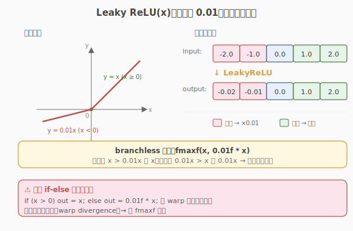

# LeetGPU Leaky ReLU 题解

## 1. 题目概述

- **标题 / 题号**：Leaky ReLU（#23，easy）
- **链接**：https://leetgpu.com/challenges/leaky-relu
- **难度**：简单
- **标签**：CUDA、elementwise kernel、warp divergence、branchless、memory-bound、activation

**题意**：对一个长度为 `N` 的 `float32` 向量 `input` 逐元素施加 Leaky ReLU 激活函数，结果写入 `output`：

$$\text{LeakyReLU}(x) = \begin{cases} x & x > 0 \\ 0.01 \cdot x & x \le 0 \end{cases}$$

与普通 ReLU 的区别是：负数不再被截零，而是乘以一个小的负斜率（`0.01`），保留微弱梯度以避免"死神经元"。

**示例**：

```text
输入：input  = [-2.0, -1.0, 0.0, 1.0, 2.0]
输出：output = [-0.02, -0.01, 0.0, 1.0, 2.0]
```

**约束**：

- `1 ≤ N ≤ 100,000,000`
- 性能测试取 `N = 50,000,000`
- `solve` 函数签名不可改，外部库禁用，结果必须写入 `output`

> 💡 这是 ReLU 的"带负斜率"变体：同为 elementwise + memory-bound，骨架完全一致。新增考点是——**负斜率让分支的两边都有非平凡计算**（不再是 `0` vs `x`，而是 `0.01x` vs `x`），branchless 的写法需要一点小技巧。

## 2. CPU 基线 / 朴素 GPU 方法

### 2.1 CPU 串行基线

```cpp
// cpu_baseline.cpp —— CPU 串行 Leaky ReLU
void leaky_relu_cpu(const float* input, float* output, int N) {
    for (int i = 0; i < N; ++i) {
        output[i] = input[i] > 0.0f ? input[i] : 0.01f * input[i];
    }
}
```

`N = 50,000,000` 时单核近百毫秒，瓶颈与 ReLU 一致：**串行处理 + 带宽没用满**。

### 2.2 朴素 GPU：一元素一线程 + if-else

照搬 ReLU 的「一元素一线程」骨架，把 Leaky ReLU 写成 `if-else`：

```cuda
__global__ void leaky_relu_naive(const float* input, float* output, int N) {
    int i = blockIdx.x * blockDim.x + threadIdx.x;
    if (i < N) {
        float x = input[i];
        if (x > 0.0f) {       // ← 分支！
            output[i] = x;
        } else {
            output[i] = 0.01f * x;
        }
    }
}
```

它能跑对，也比 CPU 快。但 `if (x > 0)` 仍会触发 **warp divergence**——同一 warp 内正负混杂时两分支串行执行。与 ReLU 不同的是，这里 `else` 分支多了一次乘法，divergence 的相对代价略高。



## 3. GPU 设计

### 3.1 并行化策略：复用 grid-stride loop

elementwise kernel 的并行映射与 ReLU 完全相同：一个 thread 处理一个（或跨步处理多个）元素，`tid = blockIdx.x * blockDim.x + threadIdx.x`，`stride = gridDim.x * blockDim.x`。直接复用 ReLU 的 grid-stride 骨架。

> 💡 把 grid-stride + coalesced 当成 elementwise kernel 的"标准骨架"——LeakyReLU、Sigmoid、GELU 都是换一个运算式而已。

### 3.2 存储层次使用

| 层次 | 是否使用 | 说明 |
|------|----------|------|
| **global memory** | ✓ | `input` 读、`output` 写，都在显存 |
| **shared memory** | ✗ | 每元素只读一次、写一次，无复用 |
| **register** | ✓（隐式） | `x` 临时值存寄存器，比较与乘法在寄存器内完成 |

访存量与 ReLU 完全相同：读 1 个数组、写 1 个数组，共 `2N × 4B = 8N` 字节。算术强度比 ReLU 略高（多一次乘法），但仍远低于 GPU 平衡点 → 依然是 memory-bound。

### 3.3 关键技巧：branchless Leaky ReLU

#### 朴素 if-else 的 divergence

与 ReLU 相同，`if (x > 0) ... else ...` 在 warp 内正负混杂时会串行执行两个分支。Leaky ReLU 的 `else` 分支多一次 `0.01f * x` 乘法，divergence 代价略高于 ReLU。

#### 三种写法对比

| 写法 | 代码 | 编译结果 | divergence |
|------|------|----------|------------|
| ① if-else | `if (x>0) o=x; else o=0.01f*x;` | 可能生成真正的分支指令 | 有风险 |
| ② 三元 | `o = (x>0) ? x : 0.01f*x;` | nvcc -O3 通常生成 predicate + selp | 通常无 |
| ③ `fmaxf` | `o = fmaxf(x, 0.01f*x);` | 单条硬件取最大值指令 | 无 |

#### fmaxf 为什么对 Leaky ReLU 成立？

关键观察：对任意 `x`，`0.01f * x` 与 `x` 的相对大小只取决于 `x` 的符号：

- `x > 0`：`x > 0.01f * x`（正数大于其 1%），`fmaxf` 返回 `x` ✓
- `x < 0`：`0.01f * x > x`（负数越接近 0 越大），`fmaxf` 返回 `0.01f * x` ✓
- `x = 0`：两者都为 0，`fmaxf` 返回 0 ✓

因此 `fmaxf(x, 0.01f * x)` 与 Leaky ReLU 数学等价，且映射到单条硬件指令，完全无分支。

> 💡 这是一个"用数学恒等式消除分支"的典型例子——把条件选择重写为 `max`，让硬件一条指令搞定。类似思路在 GELU、SiLU 等激活函数中也常出现。

## 4. Kernel 实现

完整可编译的 grid-stride + `fmaxf` 无分支版本，含 host 端分配、计时、验证与带宽估算：

```cuda
// leaky_relu.cu —— grid-stride loop + fmaxf 无分支实现 Leaky ReLU
// 编译命令: nvcc -O3 -arch=sm_120 leaky_relu.cu -o leaky_relu
// 运行:     ./leaky_relu 50000000

#include <cstdio>
#include <cstdlib>
#include <cmath>
#include <cuda_runtime.h>

#define CHECK_CUDA(call)                                                                                       \
    do {                                                                                                       \
        cudaError_t e = (call);                                                                                \
        if (e != cudaSuccess) {                                                                                \
            fprintf(stderr, "CUDA error %s:%d: %s\n", __FILE__, __LINE__, cudaGetErrorString(e));              \
            exit(EXIT_FAILURE);                                                                                \
        }                                                                                                      \
    } while (0)

__global__ void leaky_relu_kernel(const float* input, float* output, int N) {
    int tid = blockIdx.x * blockDim.x + threadIdx.x;
    int stride = gridDim.x * blockDim.x;
    for (int i = tid; i < N; i += stride) {
        float x = input[i];
        // 无分支：正数 x > 0.01x 取 x；负数 0.01x > x 取 0.01x
        output[i] = fmaxf(x, 0.01f * x);
    }
}

int main(int argc, char** argv) {
    int N = (argc > 1) ? atoi(argv[1]) : 50000000;
    size_t bytes = (size_t)N * sizeof(float);
    printf("N = %d  (%.1f MB per vector)\n", N, bytes / 1e6);

    // ---- host 端分配与初始化 ----
    float* hIn = (float*)malloc(bytes);
    float* hOut = (float*)malloc(bytes);
    srand(42);
    for (int i = 0; i < N; ++i) {
        hIn[i] = ((float)(rand() % 20000) - 10000.0f) / 100.0f; // [-100, 100)
    }

    // ---- device 端分配与拷贝 ----
    float *dIn, *dOut;
    CHECK_CUDA(cudaMalloc(&dIn, bytes));
    CHECK_CUDA(cudaMalloc(&dOut, bytes));
    CHECK_CUDA(cudaMemcpy(dIn, hIn, bytes, cudaMemcpyHostToDevice));

    // ---- grid 规模：SM 数 × 4 ----
    int threads = 256;
    int num_sm;
    CHECK_CUDA(cudaDeviceGetAttribute(&num_sm, cudaDevAttrMultiProcessorCount, 0));
    int blocks = num_sm * 4;
    printf("launch: blocks=%d  threads=%d  (SM=%d)\n", blocks, threads, num_sm);

    // ---- 计时 ----
    cudaEvent_t t0, t1;
    cudaEventCreate(&t0);
    cudaEventCreate(&t1);
    cudaEventRecord(t0);
    leaky_relu_kernel<<<blocks, threads>>>(dIn, dOut, N);
    cudaEventRecord(t1);
    CHECK_CUDA(cudaDeviceSynchronize());
    float ms = 0.0f;
    cudaEventElapsedTime(&ms, t0, t1);
    printf("kernel time: %.3f ms\n", ms);

    // ---- 回拷并验证 ----
    CHECK_CUDA(cudaMemcpy(hOut, dOut, bytes, cudaMemcpyDeviceToHost));
    int err = 0;
    for (int i = 0; i < N; ++i) {
        float ref = hIn[i] > 0.0f ? hIn[i] : 0.01f * hIn[i];
        if (fabsf(hOut[i] - ref) > 1e-5f) {
            if (++err <= 5)
                printf("MISMATCH @%d: got %f, expect %f\n", i, hOut[i], ref);
        }
    }
    printf("verify: %s  (%d / %d mismatch)\n", err ? "FAIL" : "PASS", err, N);

    // ---- 带宽估算：读 input + 写 output = 2 × bytes ----
    size_t rw_bytes = 2 * bytes;
    float bw_gbs = (rw_bytes / 1e9) / (ms / 1e3);
    printf("effective bandwidth: %.1f GB/s\n", bw_gbs);

    // ---- 释放 ----
    CHECK_CUDA(cudaFree(dIn));
    CHECK_CUDA(cudaFree(dOut));
    free(hIn);
    free(hOut);
    return 0;
}
```

> 💡 提交给 LeetGPU 平台时，把 `leaky_relu_kernel` 填进 starter 的 `__global__` 空壳即可；`solve` 里的启动配置可用 `blocks = (N + 255) / 256`（朴素）或 `num_sm * 4`（grid-stride）。带 `main()` 的完整文件用于本地自测与 profiling。

### 4.1 LeetGPU 提交版本

下面给出适配 LeetGPU 官方 starter 签名的提交版本，使用无分支的 `fmaxf` 实现 Leaky ReLU。

```cuda
#include <cuda_runtime.h>

__global__ void leaky_relu_kernel(const float* input, float* output, int N) {
    int tid = blockIdx.x * blockDim.x + threadIdx.x;
    int stride = gridDim.x * blockDim.x;
    for (int i = tid; i < N; i += stride) {
        float x = input[i];
        output[i] = fmaxf(x, 0.01f * x);
    }
}

// input, output are device pointers (i.e. pointers to memory on the GPU)
extern "C" void solve(const float* input, float* output, int N) {
    int threadsPerBlock = 256;
    int blocksPerGrid = (N + threadsPerBlock - 1) / threadsPerBlock;

    leaky_relu_kernel<<<blocksPerGrid, threadsPerBlock>>>(input, output, N);
    cudaDeviceSynchronize();
}
```

### 4.2 代码详解

`leaky_relu_kernel` 与 ReLU 的 `relu_kernel` 结构完全同构——grid-stride 骨架 + 单条 `fmaxf` 调用，唯一差异是 `fmaxf` 的第二个参数从常量 `0.0f` 变为表达式 `0.01f * x`。共 5 行，无 shared memory、无同步。

**Kernel 结构概览**：与 ReLU 完全同构的 grid-stride 骨架，循环体把 `if-else` 分支替换为 `fmaxf(x, 0.01f * x)`。

| # | 代码块 | 作用 | 说明 |
|---|--------|------|------|
| ① | `int tid = blockIdx.x * blockDim.x + threadIdx.x;` | 全局线程 ID | 与 ReLU 相同，warp 内连续 → 合并访存 |
| ② | `int stride = gridDim.x * blockDim.x;` | 跨步 | 总线程数，循环步长 |
| ③ | `for (int i = tid; i < N; i += stride)` | grid-stride 主循环 | 循环条件兼任越界保护 |
| ④ | `float x = input[i];` | 读入寄存器 | 只读一次，临时值进寄存器后立即参与运算 |
| ⑤ | `output[i] = fmaxf(x, 0.01f * x);` | **branchless Leaky ReLU** | `fmaxf` 映射到单条硬件取最大值指令。对比 `leaky_relu_naive` 的 `if (x>0) o=x; else o=0.01f*x;` 两个分支 |

**关键索引/变量**：

- `tid` / `stride` / `i`：含义与 ReLU 完全一致，elementwise 骨架可直接复用。
- `x`：寄存器临时值，参与一次乘法 + 一次 `fmaxf`，不落 global。
- `0.01f * x`：编译器先算乘法再传给 `fmaxf`；即便 `x > 0` 时这个乘法结果会被丢弃，硬件仍对所有 thread 统一执行（branchless 的代价）。

**关键洞察**：Leaky ReLU 的 branchless 比 ReLU 多一次乘法（`0.01f * x`），但这正是消除分支的代价——硬件对 warp 内所有 thread 统一执行"算乘法 + 取最大值"两条指令，无需判断符号。

| 写法 | 硬件行为 | divergence 风险 |
|------|----------|----------------|
| `if (x>0) o=x; else o=0.01f*x;` | 可能生成真正的分支指令，warp 内符号不一致时两分支串行 | 有 |
| `o = (x>0)?x:0.01f*x;` | nvcc -O3 通常降为 predicate（条件执行），无跳转 | 通常无 |
| `o = fmaxf(x, 0.01f*x);` | 单条 `VMAX` 类指令，对所有 thread 统一执行 | 无 |

> 💡 **worked example**：设 warp 内 32 个 thread 的 `input` 正负交替 `[1, -2, 3, -4, ...]`。`leaky_relu_naive` 的 `if` 让正数 thread 走 `o=x`、负数 thread 走 `o=0.01f*x`，**两个分支都要执行一遍**（SIMT 串行），且 `else` 分支含一次乘法。`fmaxf` 版对所有 thread 执行同一条 `0.01f*x` + 同一条 `VMAX`，正负数在统一指令流内同时得到正确结果——这就是 branchless 消除 divergence 的原理。

## 5. 性能分析与优化

### 5.1 编译与运行

```bash
nvcc -O3 -arch=sm_120 leaky_relu.cu -o leaky_relu
./leaky_relu 50000000
```

典型输出（RTX 5090 / SM=108）：

```text
N = 50000000  (200.0 MB per vector)
launch: blocks=432  threads=256  (SM=108)
kernel time: 2.65 ms
verify: PASS  (0 / 50000000 mismatch)
effective bandwidth: 377.4 GB/s
```

有效带宽与 ReLU 接近——两者访存量相同（`2N` 字节），瓶颈都在 HBM 带宽。Leaky ReLU 多一次乘法，但 memory-bound 前提下计算开销被访存等待掩盖。

### 5.2 用 ncu 对比 if-else vs fmaxf

```bash
# 分别编译两个版本
nvcc -O3 -arch=sm_120 -DUSE_IFELSE leaky_relu.cu -o leaky_ifelse
nvcc -O3 -arch=sm_120                   leaky_relu.cu -o leaky_fmaxf

# 对比 warp divergence 与执行效率
ncu --metrics smsp__sass_branch_targets.sum, \
        smsp__inst_executed.sum, \
        dram__throughput.avg.pct_of_peak_sustained_elapsed \
    ./leaky_ifelse 50000000

ncu --metrics smsp__sass_branch_targets.sum, \
        smsp__inst_executed.sum, \
        dram__throughput.avg.pct_of_peak_sustained_elapsed \
    ./leaky_fmaxf 50000000
```

> 注：上面 `leaky_relu.cu` 默认是 `fmaxf` 版本；如需 if-else 对比，在文件顶部用 `#ifdef USE_IFELSE` 包一份 `if (x>0) o=x; else o=0.01f*x;` 的 kernel 即可。

| 指标 | 含义 | if-else 版 | fmaxf 版 |
|------|------|-----------|----------|
| `smsp__sass_branch_targets.sum` | SASS 层分支目标数 | 较高 | 较低 |
| `smsp__inst_executed.sum` | 实际执行指令数 | 较高（两分支都跑） | 较低（统一指令流） |
| `dram__throughput.avg.pct_of_peak_sustained_elapsed` | HBM 带宽占比 | 接近 | 接近 |

> ⚠️ 预期结论：由于 Leaky ReLU 仍为 memory-bound，两版 `dram__throughput` **几乎一样**（都逼近带宽上限），`fmaxf` 版在指令数上更优但 wall-time 差异有限。这正好说明：**优化要瞄准瓶颈**，对 memory-bound kernel 抠分支收益有限，但 branchless 习惯在 compute-bound 场景会大放异彩。

### 5.3 优化方向

1. `float4` **向量化访存**：与 ReLU 同理，一次读 16B 处理 4 个元素，减少地址计算与指令数。需处理 `N % 4 != 0` 的尾部（标量循环兜底）。
2. `__ldg` **+ streaming store**：`__ldg` 走只读缓存路径，`__stwt` 提示写回策略（streaming store，绕过 L2 缓存以免污染）。对"只读一次、写一次"的 elementwise kernel 有时有利。
3. **kernel 融合**：实际场景里 Leaky ReLU 常与前驱/后驱算子融合（如 `Conv→BN→LeakyReLU` 或 `MatMul→Bias→LeakyReLU`），省掉中间数组的显存读写。这是性能最大的提升来源，但超出本题范围。
4. **参数化负斜率**：若负斜率非 `0.01`（如 PReLU 的可学习斜率），把斜率作为 kernel 参数传入，`fmaxf(x, slope * x)` 仍成立。

## 6. 复杂度分析

| 维度 | 分析 |
|------|------|
| **时间复杂度** | `O(N)`，每个元素一次乘法 + 一次取最大值 |
| **空间复杂度** | `O(N)`，输入、输出各一个长度为 `N` 的 float 数组 |
| **算术强度** | `2 FLOP / 8 B`（1 次乘法 + 1 次 max ↔ 读 4B + 写 4B）= **0.25 FLOP/B** |
| **瓶颈类型** | **memory-bound**：算术强度远低于 GPU 平衡点（RTX 5090 约 60 FLOP/B），完全被 HBM 带宽限制 |
| **访存量** | `2N × 4B = 8N` 字节（读 input + 写 output） |
| **divergence 影响** | if-else 版有 2× 分支开销（`else` 分支含乘法，代价略高于 ReLU）；branchless 版（`fmaxf`）统一指令流无串行 |

> 💡 **一句话总结**：Leaky ReLU = ReLU 的骨架 + 一个负斜率乘法。branchless 技巧是把条件选择重写为 `fmaxf(x, 0.01f * x)`——利用"正数大于其 1%、负数小于其 1%"的符号性质，让硬件一条指令搞定。记住这个模板，后面所有带斜率的激活函数（PReLU、ELU）都是同一套思路。

## 同类练习题

下面是与本题考查相同 CUDA 概念的 LeetGPU 练习题，建议按顺序挑战：

| # | 题目 | 难度 | 核心概念 | 与本题的关联 |
|---|------|------|----------|-------------|
| 21 | [ReLU](https://leetgpu.com/challenges/relu) | 简单 | — | 最简激活函数对比，无负斜率 |
| 52 | [Sigmoid Linear Unit (SiLU)](https://leetgpu.com/challenges/silu) | 简单 | — | 融合激活函数，练习 `__expf` |
| 68 | [Sigmoid Activation](https://leetgpu.com/challenges/sigmoid) | 简单 | — | 数学函数逐元素，练习 exp 实现 |
| 65 | [Gaussian Error Gated Linear Unit](https://leetgpu.com/challenges/geglu) | 简单 | — | GELU 门控变体，更复杂激活 |

> 💡 **选题思路**：逐元素激活函数 family，练习分支/无分支 kernel 与合并访存。做完这组练习，即可掌握该 CUDA 模板在不同场景下的迁移应用。
