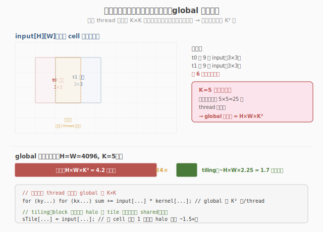
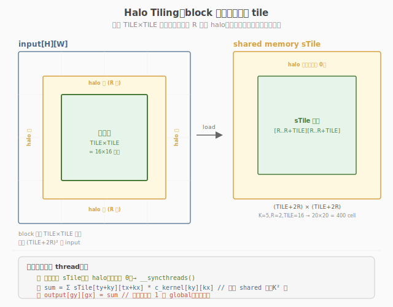
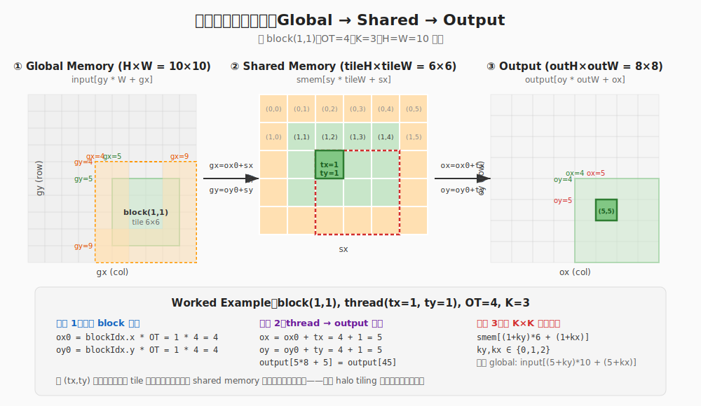
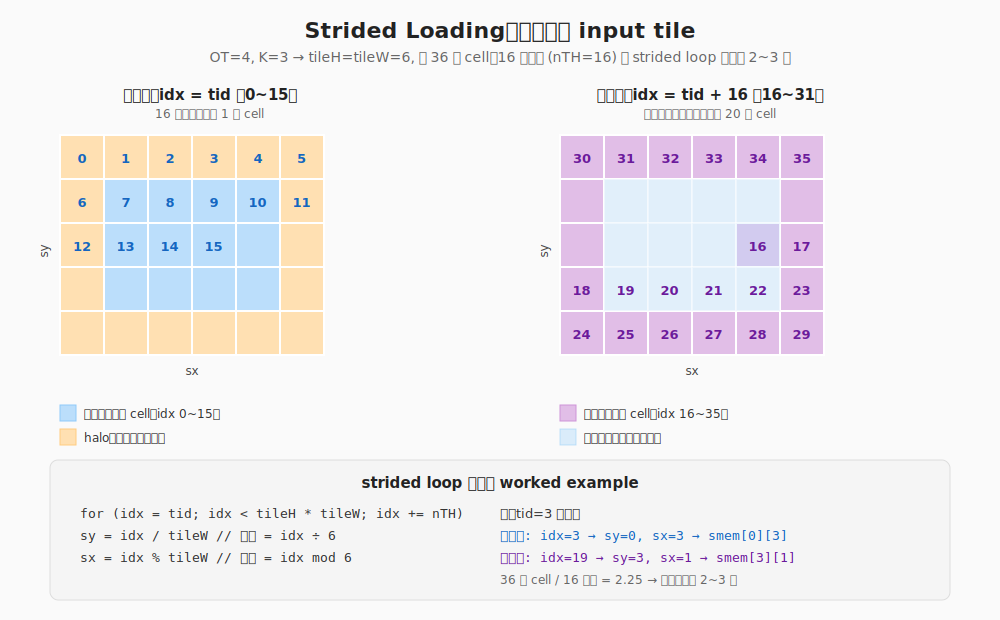
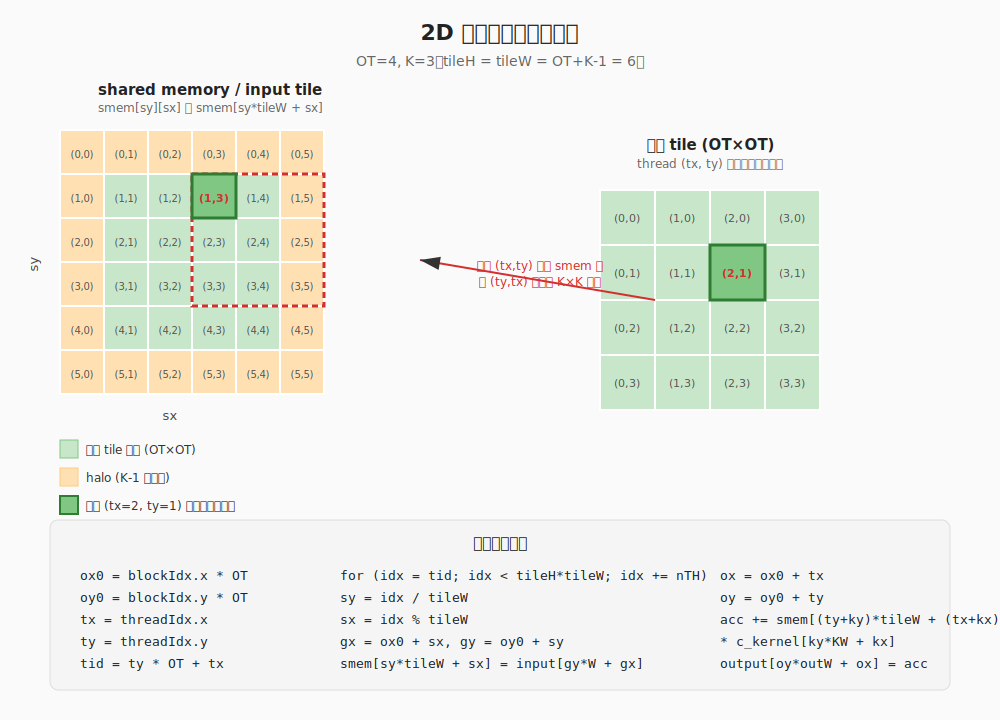

# LeetGPU 2D Convolution 题解

## 1. 题目概述

- **标题 / 题号**：2D Convolution（#10，medium）
- **链接**：https://leetgpu.com/challenges/2d-convolution
- **难度**：中等
- **标签**：CUDA、Convolution、Shared Memory Halo、常量内存、memory-bound

**题意**：对 `H×W` 的输入图像 `input` 做 2D 卷积（实为 cross-correlation），卷积核 `kernel` 大小 `K×K`（K 为奇数，典型 3 或 5），半径 `P = K/2`。采用 **valid 卷积**（不补零），输出 `output` 大小 `(H-2P)×(W-2P)`：

```text
output[oy][ox] = Σ_{ky=0..K-1} Σ_{kx=0..K-1} input[oy+ky][ox+kx] · kernel[ky][kx]
```

**示例**（K=3, P=1）：`input 5×5, kernel 3×3 → output 3×3`，每个输出像素是 3×3 邻域与核的点积。

**约束**：
- `1 ≤ H, W ≤ 4096`，`K ∈ {3, 5}`（odd）
- `solve` 函数签名不可改，禁用外部库，结果必须写入 `output`

> 💡 这是 **shared memory halo** 的经典题。每个输出要读 K×K 邻域，相邻输出的邻域高度重叠——朴素实现会反复读同一批 input，带宽爆炸。解法是用 shared memory 把一个 tile（含 halo）一次性载入、block 内复用；同时引入 `__constant__` **内存**广播卷积核权重。

## 2. CPU 基线 / 朴素 GPU 方法

### 2.1 CPU 串行基线

```cpp
// cpu_baseline.cpp —— CPU 串行 valid 2D 卷积
void conv2d_cpu(const float* input, const float* kernel, float* output, int H, int W, int K) {
    int P = K / 2, outH = H - 2 * P, outW = W - 2 * P;
    for (int oy = 0; oy < outH; ++oy)
        for (int ox = 0; ox < outW; ++ox) {
            float acc = 0.0f;
            for (int ky = 0; ky < K; ++ky)
                for (int kx = 0; kx < K; ++kx)
                    acc += input[(oy + ky) * W + (ox + kx)] * kernel[ky * K + kx];
            output[oy * outW + ox] = acc;
        }
}
```

四重循环，`O(H·W·K²)`。`H=W=4096, K=5` 时约 8.4 亿次乘加，单核数秒。

### 2.2 朴素 GPU：一个 thread 一个输出像素，直接读 global

最直观的并行：每 thread 负责一个输出像素 `(oy, ox)`，直接从 global memory 读 `K×K` 邻域与 kernel 权重。

```cuda
__global__ void conv2d_naive(const float* input, const float* kernel, float* output, int H, int W, int K) {
    int P = K / 2, outH = H - 2 * P, outW = W - 2 * P;
    int ox = blockIdx.x * blockDim.x + threadIdx.x;
    int oy = blockIdx.y * blockDim.y + threadIdx.y;
    if (ox >= outW || oy >= outH)
        return;
    float acc = 0.0f;
    for (int ky = 0; ky < K; ++ky)
        for (int kx = 0; kx < K; ++kx)
            acc += input[(oy + ky) * W + (ox + kx)] * kernel[ky * K + kx];
    output[oy * outW + ox] = acc;
}
```

问题在 **邻域重叠**：相邻输出 `(oy,ox)` 与 `(oy,ox+1)` 的 K×K 邻域有 `K×(K-1)` 个元素相同，朴素实现各自从 global 重复读。



> **图：朴素卷积的冗余读取。**  
> 每个 thread 负责一个输出像素并独立读取自己的 `K×K` 邻域。图中 t0、t1 的 `3×3` 邻域有大量重叠（黄色虚线框），同一 input cell 被多个 thread 重复从 global memory 读取。K=5 时每个元素会被周围 25 个 thread 各读一次，导致 global 读次数高达 `H·W·K²`。

- 每个 input 元素被周围 `K×K` 个输出 thread 各读一次 → **global 读次数 = H·W·K²**。
- `K=5` 时每个元素被读 25 次，带宽被冗余读吃光。
- kernel 权重 `kernel[]` 也每 thread 重复从 global 读（虽会被 L2 缓存，但常量内存更优）。

> ⚠️ 这是 stencil 类 kernel 的通病：**计算只 K² 次/像素（FLOP 少），访存却 K² 次/像素且大量重复** → 严重 memory-bound。破局点是用 shared memory 把重叠邻域一次性载入、block 内复用。

> **什么是 stencil？**  
> stencil（模板）是一类 GPU kernel 的统称：每个输出元素只由输入中一个**固定形状的局部邻域**（如 3×3、5×5 窗口）计算得到。2D 卷积、图像滤波、高斯模糊、Jacobi 迭代、Laplacian、有限差分等都属于 stencil。它们的共同特点是**计算量小、访存量大、邻域高度重叠**，因此很容易陷入 memory-bound，halo tiling 正是解决这类问题的标准模板。

## 3. GPU 设计

### 3.1 并行化策略：shared memory halo tiling

核心思想：**一个 block 负责一个** `OT×OT` **的输出 tile**，block 内线程协作把该 tile 计算所需的全部 input 一次性载入 shared memory，之后每个 thread 的 K×K 窗口全从 shared 读，避免重复访问 global。

输出 tile `OT×OT` 需要的 input 区域是 `(OT+K-1)×(OT+K-1)`——多出的 `K-1` 圈边界就是 **halo（光晕/apron）**，供 tile 边缘输出的卷积窗口读取邻域。



> **图：Halo Tiling 示意图。**  
> 绿色 `OT×OT` 区域是本 block 要计算的核心输出 tile；橙色外圈就是 **halo（光晕/裙边）**，半径 `R = K/2`。只有加载了这圈 halo，tile 边缘的输出像素才能从 shared memory 中拿到完整的 `K×K` 卷积窗口，而不必再次访问 global memory。

**halo 是什么？** 在 tiling 卷积里，halo 指的是“为了计算一个输出 tile，需要从输入中多读取的边界像素”。因为卷积每个输出要看 `K×K` 邻域，位于输出 tile 边缘的像素，其邻域会超出 tile 本身，必须提前把这一圈输入也载入 shared memory。halo 的宽度等于卷积半径 `R = K/2`，因此输入 tile 的边长是 `OT + K - 1`（也就是 `OT + 2R`）。

流程（每 block）：
1. **协作加载**：`OT×OT` 个线程用 strided loop 把 `(OT+K-1)²` 个 input（含 halo）载入 `smem`。
2. **调用** `__syncthreads()` **同步**：等 tile 全部就绪。
3. **卷积计算**：每 thread 读 `smem[ty..ty+K-1][tx..tx+K-1]` 的 K×K 窗口，乘加 `c_kernel`，写一个输出像素。

> 💡 halo 的本质：把"多个输出共享的邻域"在 shared memory 里**只存一份**。载入时每 input cell 只读 1 次 global（含 halo 冗余约 `(IT/OT)²≈1.27×`，K=3），计算时 K² 次读全打在 shared memory（~20 cycle、~19 TB/s），global 读次数从 `H·W·K²` 降到 `~H·W·1.27`。

### 3.2 存储层次使用

| 层次 | 是否使用 | 说明 |
|------|----------|------|
| **global memory** | ✓ | `input` 读、`output` 写；只在加载 tile 时访问，每 cell ~1 次 |
| **shared memory** | ✓ | **本题核心**：`(OT+K-1)²` 的 halo tile 缓冲，block 内复用 |
| `__constant__` **memory** | ✓ | 卷积核权重 `c_kernel[K²]`，全 thread 读同一地址 → 硬件广播 |
| **register** | ✓（隐式） | 累加器 `acc`、线程局部坐标 |

**为什么 kernel 权重放** `__constant__` **内存**：64 KB 常量内存有专属 cache，且支持 **broadcast**——一个 warp 内 32 个 thread 读同一地址（如 `c_kernel[4]`）时只花 1 cycle、不触发 bank conflict。卷积核只有 `K²≤25` 个权重，每个 thread 都读同一份，完美匹配常量内存的广播语义。若放 global 则走 L1/L2 cache（延迟更高）；若放 shared 则每个 block 都要拷一份（浪费）。

| 特性 | global (HBM) | shared (SRAM) | `__constant__` |
|------|--------------|---------------|----------------|
| 容量 | ~40-80 GB | ~100-228 KB/SM | 64 KB/SM（有 cache） |
| 延迟 | ~400-800 cyc | ~20-30 cyc | ~4-8 cyc（命中 cache） |
| 广播 | ✗ | 按 bank | ✓（同地址 1 cycle） |
| 可见性 | 全局 | 同 block | 全局（只读） |

### 3.3 关键技巧

1. **halo strided 加载**：`OT×OT` 个线程加载 `(OT+K-1)²` 个元素，用 `for (idx=tid; idx<IT*IT; idx+=nTH)` 的 strided loop 均摊（K=3 时每 thread 载 2 个）。
2. `__constant__` **广播权重**：`cudaMemcpyToSymbol(c_kernel, ...)` 一次性载入，kernel 内 `c_kernel[ky*K+kx]` 全 warp 广播。
3. **边界处理**：valid 卷积下有效输出的 K×K 窗口天然在 input 范围内；仅 grid 过覆盖时的 halo 载入可能越界，用 `clamp`（replicate border）兜底，这些值不被有效输出读取、不影响结果。
4. `#pragma unroll` **展开**：K 是编译期小常量（3/5），展开 K² 内层循环，消除循环开销、便于指令级并行。

> ⚠️ **bank conflict 检查**：卷积读 `smem[ty+ky][tx+kx]`，同 warp 内 `tx` 连续 → 读 `smem[*][tx..tx+31]`，地址按 4B 递增，32 个 thread 落在 32 个不同 bank → **零冲突**。这是卷积相比转置更"友好"的地方（转置按列读会冲突，卷积按行读不会）。

## 4. Kernel 实现

完整可编译的 shared memory halo + `__constant__` 权重版本：

```cuda
// conv2d_shared_halo.cu —— shared memory halo + __constant__ 权重实现 2D valid 卷积
// 编译命令: nvcc -O3 -arch=sm_120 conv2d_shared_halo.cu -o conv2d
// 运行:     ./conv2d 4096 4096 3

    #include <cstdio>
    #include <cstdlib>
    #include <cmath>
    #include <cuda_runtime.h>

    #define CHECK_CUDA(call)                                                                                               \
    do {                                                                                                               \
        cudaError_t e = (call);                                                                                        \
        if (e != cudaSuccess) {                                                                                        \
            fprintf(stderr, "CUDA error %s:%d: %s\n", __FILE__, __LINE__, cudaGetErrorString(e));                      \
            exit(EXIT_FAILURE);                                                                                        \
        }                                                                                                              \
    } while (0)

#define OT 16    // 输出 tile 边长
#define MAX_K 16 // 卷积核最大边长（常量内存预留）

// 卷积核权重放常量内存：全 thread 读同一地址 → 硬件广播，1 cycle
__constant__ float c_kernel[MAX_K * MAX_K];

// shared memory halo + 常数权重 的 2D valid 卷积
__global__ void conv2d_shared_halo(const float* __restrict__ input, float* __restrict__ output, int H, int W, int K) {
    const int P = K / 2;       // 卷积半径
    const int IT = OT + K - 1; // input tile 边长（含 halo）
    // 静态 shared：按最大 K 预留，实际只用 [0..IT-1][0..IT-1]
    __shared__ float smem[OT + MAX_K - 1][OT + MAX_K - 1];

    const int ox0 = blockIdx.x * OT; // 本 block 输出 tile 左上角 col
    const int oy0 = blockIdx.y * OT; // 本 block 输出 tile 左上角 row
    const int tx = threadIdx.x;
    const int ty = threadIdx.y;
    const int tid = ty * OT + tx;
    const int nTH = OT * OT;

    // ---- ① 协作加载 input tile（含 halo）到 shared memory ----
    // input tile 左上角 = 输出 tile 左上角 (oy0, ox0)，向右下扩展 K-1 圈 halo
    // 越界索引 clamp 到合法范围（replicate border）；这些值仅被过覆盖线程读取，不影响有效输出
    for (int idx = tid; idx < IT * IT; idx += nTH) {
        int sy = idx / IT;
        int sx = idx % IT;
        int gx = ox0 + sx;
        int gy = oy0 + sy;
        gx = min(max(gx, 0), W - 1);
        gy = min(max(gy, 0), H - 1);
        smem[sy][sx] = input[gy * W + gx];
    }
    __syncthreads();

    // ---- ② 每个线程算一个输出像素：K×K 窗口全从 shared 读 ----
    const int outH = H - 2 * P;
    const int outW = W - 2 * P;
    const int ox = ox0 + tx;
    const int oy = oy0 + ty;
    if (ox < outW && oy < outH) {
        float acc = 0.0f;
        #pragma unroll
        for (int ky = 0; ky < K; ++ky) {
            #pragma unroll
            for (int kx = 0; kx < K; ++kx) {
                // 窗口左上角在 smem 的 (ty, tx)，覆盖 smem[ty..ty+K-1][tx..tx+K-1]
                acc += smem[ty + ky][tx + kx] * c_kernel[ky * K + kx];
            }
        }
        output[oy * outW + ox] = acc;
    }
}

// ---- CPU 参考（valid 卷积）----
void conv2d_cpu(const float* input, const float* kernel, float* output, int H, int W, int K) {
    int P = K / 2, outH = H - 2 * P, outW = W - 2 * P;
    for (int oy = 0; oy < outH; ++oy)
        for (int ox = 0; ox < outW; ++ox) {
            float acc = 0.0f;
            for (int ky = 0; ky < K; ++ky)
                for (int kx = 0; kx < K; ++kx)
                    acc += input[(oy + ky) * W + (ox + kx)] * kernel[ky * K + kx];
            output[oy * outW + ox] = acc;
        }
}

int main(int argc, char** argv) {
    int H = (argc > 1) ? atoi(argv[1]) : 4096;
    int W = (argc > 2) ? atoi(argv[2]) : 4096;
    int K = (argc > 3) ? atoi(argv[3]) : 3;
    if (K % 2 == 0 || K > MAX_K) {
        fprintf(stderr, "K must be odd and <= %d\n", MAX_K);
        return 1;
    }
    int P = K / 2;
    int outH = H - 2 * P, outW = W - 2 * P;
    size_t in_bytes = (size_t)H * W * sizeof(float);
    size_t out_bytes = (size_t)outH * outW * sizeof(float);
    size_t ker_bytes = (size_t)K * K * sizeof(float);
    printf("input: %dx%d  kernel: %dx%d  output: %dx%d\n", H, W, K, K, outH, outW);

    // ---- host 分配与初始化 ----
    float* hIn = (float*)malloc(in_bytes);
    float* hKer = (float*)malloc(ker_bytes);
    float* hOut = (float*)malloc(out_bytes);
    float* hRef = (float*)malloc(out_bytes);
    srand(42);
    for (int i = 0; i < H * W; ++i)
        hIn[i] = (float)(rand() % 1000) / 100.0f;
    for (int i = 0; i < K * K; ++i)
        hKer[i] = (float)(rand() % 1000) / 100.0f;

    // ---- device 分配与拷贝 ----
    float *dIn, *dOut;
    CHECK_CUDA(cudaMalloc(&dIn, in_bytes));
    CHECK_CUDA(cudaMalloc(&dOut, out_bytes));
    CHECK_CUDA(cudaMemcpy(dIn, hIn, in_bytes, cudaMemcpyHostToDevice));
    CHECK_CUDA(cudaMemcpyToSymbol(c_kernel, hKer, ker_bytes));

    // ---- 启动配置 ----
    dim3 threads(OT, OT);
    dim3 blocks((outW + OT - 1) / OT, (outH + OT - 1) / OT);
    printf("launch: blocks=(%d,%d)  threads=(%d,%d)\n", blocks.x, blocks.y, threads.x, threads.y);

    // ---- 计时 ----
    cudaEvent_t t0, t1;
    cudaEventCreate(&t0);
    cudaEventCreate(&t1);
    cudaEventRecord(t0);
    conv2d_shared_halo<<<blocks, threads>>>(dIn, dOut, H, W, K);
    cudaEventRecord(t1);
    CHECK_CUDA(cudaDeviceSynchronize());
    float ms = 0.0f;
    cudaEventElapsedTime(&ms, t0, t1);
    printf("kernel time: %.3f ms\n", ms);

    // ---- 回拷并验证 ----
    CHECK_CUDA(cudaMemcpy(hOut, dOut, out_bytes, cudaMemcpyDeviceToHost));
    conv2d_cpu(hIn, hKer, hRef, H, W, K);
    int err = 0;
    for (int i = 0; i < outH * outW && err < 5; ++i) {
        if (fabsf(hOut[i] - hRef[i]) > 1e-3f) {
            ++err;
            printf("MISMATCH @%d: got %f, expect %f\n", i, hOut[i], hRef[i]);
        }
    }
    printf("verify: %s\n", err ? "FAIL" : "PASS");

    // ---- 带宽估算：读 input(含 halo ~1.27×, K=3) + 写 output ----
    size_t rw_bytes = ((size_t)H * W + (size_t)outH * outW) * sizeof(float);
    float bw_gbs = (rw_bytes / 1e9) / (ms / 1e3);
    printf("effective bandwidth: %.1f GB/s\n", bw_gbs);

    // ---- 释放 ----
    CHECK_CUDA(cudaFree(dIn));
    CHECK_CUDA(cudaFree(dOut));
    free(hIn);
    free(hKer);
    free(hOut);
    free(hRef);
    return 0;
}
```

#### 关于 `__restrict__`

kernel 签名里 `input`/`output` 指针加了 `__restrict__`：

```cuda
__global__ void conv2d_shared_halo(const float* __restrict__ input,
                                   float* __restrict__ output, ...)
```

它是 CUDA/C++ 的**指针别名提示符（qualifier）**，意思是：程序员向编译器保证，**该指针是访问其所指向内存的唯一方式**，不存在别的指针指向同一块内存并对其进行读写（no aliasing）。

对 2D 卷积来说：
- `input` 只读，`output` 只写，且两块 buffer 不重叠；
- 加上 `__restrict__` 后，编译器可以把 `input[gy * W + gx]` 的加载值放心地缓存在寄存器里，不必每次用之前都重新从 global memory 读取；
- 同时写 `output` 时也可以更激进地做 load/store 重排和指令级并行优化。

如果不加，编译器会保守假设 `input` 和 `output` 可能指向同一块内存，写入 `output` 可能会使 `input` 失效，从而放弃寄存器缓存，导致更多冗余的 global memory 访问。

> ⚠️ 这是程序员的承诺。如果实际传入的两个指针指向重叠内存，行为是未定义的，可能得到错误结果。

#### 关于 `OT = 16`

`OT` 是**输出 tile 边长**（Output Tile），定义为 16 意味着每个 block 负责计算 `16×16 = 256` 个输出像素。

选 16 是在 CUDA 线程并行度、shared memory 占用和 SM 占用率之间取的经验平衡点：

1. **线程数是 warp 的整数倍**
   ```cuda
   dim3 threads(OT, OT); // 16 × 16 = 256 threads = 8 warps
   ```
   CUDA 调度单位是 warp（32 线程）。256 线程 = 8 warp，调度整齐，也有利于 warp-level 的延迟隐藏。

2. **shared memory 占用很小**
   输入 tile 含 halo 后边长为 `IT = OT + K - 1`：

   | K | IT | smem 大小 (`IT² × 4B`) |
   |---|----|------------------------|
   | 3 | 18 | ~1.3 KB |
   | 5 | 20 | ~1.6 KB |
   | 16 | 31 | ~3.8 KB |

   即使最大卷积核 `K = 16`，每个 block 的 shared memory 也只有约 3.8 KB，远小于 RTX 5090 每个 SM 128 KB 的 L1/Shared Memory 上限。

3. **寄存器压力低**
   每个 thread 只算**一个输出像素**，局部变量主要是坐标 `tx, ty, ox, oy` 和累加器 `acc`，寄存器用量很小。寄存器少意味着同一个 SM 上能同时驻留更多 block，占用率更高。

4. **以 RTX 5090 为例的占用率估算**
   RTX 5090（Blackwell GB202）每 SM 关键上限：
   - 最多 **2048 线程/SM**
   - 最多 **32 block/SM**
   - **128 KB L1/Shared Memory**
   - **256 KB Register File** = 65,536 个 32-bit 寄存器

   对本 kernel：
   - **线程限制**：`2048 / 256 = 8` block/SM
   - **寄存器限制**：假设每线程用 32 个寄存器，每 block 用 `256 × 32 = 8192` 个；`65536 / 8192 = 8` block/SM
   - **shared memory 限制**：`128 KB / 3.8 KB ≈ 33` block/SM，远大于线程限制

   因此瓶颈是线程/寄存器限制，最多 8 block/SM，即 `8 × 256 = 2048` 线程/SM，可以达到 **100% 理论占用率**。实际占用率还会受指令延迟、memory latency、分支发散等因素影响，但 `OT = 16` 是一个能让硬件资源不被 tile 大小本身限制的经典选择。

> 💡 上面带 `main()` 的完整文件用于本地自测与 profiling。提交 LeetGPU 时，需要把 kernel 填入官方 starter 的 `__global__` 空壳，并适配它的 `solve` 函数签名。

### 4.1 LeetGPU 提交版本

下面给出适配 LeetGPU 官方 starter 签名的提交版本。它使用**动态 shared memory** 支持矩形卷积核，并把卷积核拷到 `__constant__` 常量内存。

```cuda
#include <cuda_runtime.h>

#define OT 16
#define MAX_KH 64
#define MAX_KW 64

// 卷积核放到常量内存，整个 grid 共享一份，支持 warp 广播
__constant__ float c_kernel[MAX_KH * MAX_KW];

__global__ void conv2d_shared_halo(const float* __restrict__ input,
                                   float* __restrict__ output,
                                   int H, int W,
                                   int KH, int KW) {
    const int outH = H - KH + 1;
    const int outW = W - KW + 1;

    const int tileH = OT + KH - 1;
    const int tileW = OT + KW - 1;
    extern __shared__ float smem[];

    const int ox0 = blockIdx.x * OT;
    const int oy0 = blockIdx.y * OT;
    const int tx  = threadIdx.x;
    const int ty  = threadIdx.y;
    const int tid = ty * OT + tx;
    const int nTH = OT * OT;

    // ① 协作加载 input tile（含 halo）到 shared memory
    for (int idx = tid; idx < tileH * tileW; idx += nTH) {
        int sy = idx / tileW;
        int sx = idx % tileW;
        int gx = ox0 + sx;
        int gy = oy0 + sy;
        gx = (gx < 0) ? 0 : (gx >= W ? W - 1 : gx);
        gy = (gy < 0) ? 0 : (gy >= H ? H - 1 : gy);
        smem[sy * tileW + sx] = input[gy * W + gx];
    }
    __syncthreads();

    // ② 每个线程算一个输出像素：K×K 窗口全从 shared 读
    const int ox = ox0 + tx;
    const int oy = oy0 + ty;
    if (ox < outW && oy < outH) {
        float acc = 0.0f;
        for (int ky = 0; ky < KH; ++ky) {
            const float* srow = &smem[(ty + ky) * tileW + tx];
            const float* krow = &c_kernel[ky * KW];
            for (int kx = 0; kx < KW; ++kx) {
                acc += srow[kx] * krow[kx];
            }
        }
        output[oy * outW + ox] = acc;
    }
}

// input, kernel, output are device pointers
extern "C" void solve(const float* input, const float* kernel, float* output,
                      int input_rows, int input_cols,
                      int kernel_rows, int kernel_cols) {
    int outH = input_rows - kernel_rows + 1;
    int outW = input_cols - kernel_cols + 1;
    if (outH <= 0 || outW <= 0) return;

    // 把卷积核从 device 全局内存拷到常量内存
    size_t kbytes = (size_t)kernel_rows * kernel_cols * sizeof(float);
    cudaMemcpyToSymbol(c_kernel, kernel, kbytes, 0, cudaMemcpyDeviceToDevice);

    dim3 threads(OT, OT);
    dim3 blocks((outW + OT - 1) / OT, (outH + OT - 1) / OT);

    int tileH = OT + kernel_rows - 1;
    int tileW = OT + kernel_cols - 1;
    size_t smem_bytes = (size_t)tileH * tileW * sizeof(float);

    conv2d_shared_halo<<<blocks, threads, smem_bytes>>>(
        input, output, input_rows, input_cols, kernel_rows, kernel_cols);
    cudaDeviceSynchronize();
}
```

> **关于** `smem_bytes`**（第三个尖括号参数）**：CUDA kernel 启动语法 `<<<blocks, threads, smem_bytes>>>` 的第三个参数表示**每个 block 动态分配的 shared memory 字节数**。它与 kernel 里的 `extern __shared__ float smem[];` 配合，运行时会为每个 block 分配这么多字节。本题中它等于 `(OT+KH-1)*(OT+KW-1)*sizeof(float)`，也就是包含 halo 的整个输入 tile 大小。
>
> 如果不传第三个参数，`extern __shared__` 数组的大小就是 0，访问会越界；传得过大则可能超过 GPU 每 block 的 shared memory 上限（通常 48 KB，可扩展至 99 KB）。

> **说明**：LeetGPU 的 starter 注释说明 `input`、`kernel`、`output` 都是 device pointer，所以这里用 `cudaMemcpyDeviceToDevice` 把卷积核拷入常量内存。如果平台实际传入的是 host pointer，请把 `cudaMemcpyDeviceToDevice` 改成默认的 `cudaMemcpyHostToDevice`。

### 4.2 索引计算详解

卷积 kernel 的索引计算是本题最容易出错的地方。核心在于理解**三层坐标空间**的映射关系：线程坐标 `(tx, ty)` → shared memory 坐标 `(sy, sx)` → 全局坐标 `(gy, gx)` / 输出坐标 `(oy, ox)`。

#### 4.2.1 三层坐标空间总览



> **图：Global → Shared → Output 三层坐标空间映射。** 以 `block(1,1)`、`OT=4`、`K=3`、`H=W=10` 为例。左图是全局输入 `input[gy*W+gx]`，本 block 负责的 6×6 tile（含 halo）以橙/绿高亮；中图是 shared memory 中的 `smem[sy*tileW+sx]`，橙色为 halo、绿色为输出 tile，红框是 thread `(tx=1,ty=1)` 要读的 3×3 窗口；右图是全局输出 `output[oy*outW+ox]`，绿块是本 block 的 4×4 输出 tile。

#### 4.2.2 坐标变量定义

先明确所有坐标变量的含义，后续公式都围绕它们展开：

| 变量 | 空间 | 含义 | 示例值 |
|------|------|------|--------|
| `blockIdx.x, blockIdx.y` | grid | 当前 block 在 grid 中的坐标 | `(1, 1)` |
| `tx, ty` (`threadIdx.x/y`) | block | 线程在 block 内的 2D 坐标 | `(1, 1)` |
| `tid = ty * OT + tx` | block（1D） | 线程展平编号，用于 strided 加载 | `1*4+1 = 5` |
| `ox0 = blockIdx.x * OT` | global output | 本 block 输出 tile 左上角列 | `1*4 = 4` |
| `oy0 = blockIdx.y * OT` | global output | 本 block 输出 tile 左上角行 | `1*4 = 4` |
| `sx, sy` | shared memory | smem 中的 2D 坐标 | `(1, 1)` |
| `gx, gy` | global input | 全局输入坐标 | `(5, 5)` |
| `ox, oy` | global output | 全局输出坐标 | `(5, 5)` |
| `tileW = OT + KW - 1` | shared memory | smem 的列数（含 halo） | `4+3-1 = 6` |
| `tileH = OT + KH - 1` | shared memory | smem 的行数（含 halo） | `4+3-1 = 6` |

> 💡 **关键洞察**：`tileW` 和 `tileH` 比 `OT` 多了 `K-1`，这多出来的部分就是 halo。`OT=4, K=3` 时 tile 是 `6×6=36` 个 cell，而输出只有 `4×4=16` 个，多出的 20 个全是 halo。

#### 4.2.3 阶段一：协作加载——strided loop

加载阶段的目标是把 `(tileH × tileW)` 个 input cell 载入 shared memory。线程数 `nTH = OT² = 16`，而 cell 数 `tileH * tileW = 36`，线程数不够一人一个，所以用 **strided loop**（跨步循环）均摊：

```cuda
for (int idx = tid; idx < tileH * tileW; idx += nTH) {
    int sy = idx / tileW;     // 一维 idx → 二维行号
    int sx = idx % tileW;     // 一维 idx → 二维列号
    int gx = ox0 + sx;        // smem 列 → 全局列
    int gy = oy0 + sy;        // smem 行 → 全局行
    // clamp 防越界（仅 grid 过覆盖时触发，不影响有效输出）
    gx = (gx < 0) ? 0 : (gx >= W ? W - 1 : gx);
    gy = (gy < 0) ? 0 : (gy >= H ? H - 1 : gy);
    smem[sy * tileW + sx] = input[gy * W + gx];
}
```

**逐行解释**：

1. `for (idx = tid; idx < tileH*tileW; idx += nTH)`：线程 `tid` 从自己的编号开始，每次跨 `nTH` 步。`tid=0` 处理 `idx=0, 16, 32`；`tid=1` 处理 `idx=1, 17, 33`……36 个 cell 被 16 个线程分摊，每线程加载 2~3 个。

2. `sy = idx / tileW`：把一维线性索引 `idx` 转成 shared memory 的行号。`tileW=6` 时 `idx=7` → `sy=1`。这和行优先存储一致：`idx = sy * tileW + sx` 的逆运算。

3. `sx = idx % tileW`：列号 = `idx` 对 `tileW` 取模。`idx=7` → `sx=1`。

4. `gx = ox0 + sx`：shared memory 坐标偏移到全局坐标。`ox0=4, sx=1` → `gx=5`。这一步是"tile 内坐标"到"全局坐标"的核心桥梁。

5. `gy = oy0 + sy`：同理，行方向偏移。

6. `smem[sy * tileW + sx] = input[gy * W + gx]`：把全局 input 按 `gy*W+gx` 线性寻址读出，按 `sy*tileW+sx` 线性寻址写入 smem。注意 smem 用一维 `extern __shared__ float smem[]`，所以也是行优先线性地址。



> **图：Strided Loading 协作加载模式。** 以 `OT=4, K=3` 为例，`tileH=tileW=6`，共 36 个 cell。左图第一轮 `idx=tid`（0~15），16 个线程各加载 1 个 cell（蓝色）；右图第二轮 `idx=tid+16`（16~31），同一批线程继续加载剩余 cell（紫色）。`tid=3` 的线程第一轮加载 `idx=3`（`sy=0, sx=3`），第二轮加载 `idx=19`（`sy=3, sx=1`），共 2 个 cell。

**strided loop 的优势**：

- 每个 thread 负载均衡（差最多 1 个 cell）
- `idx` 连续递增 → 同一 warp 内 32 个 thread 访问连续地址 → **coalesced access**（合并访存）
- 不需要手动判断"哪些线程加载 halo"——`idx` 自然覆盖整个 tile

#### 4.2.4 阶段二：卷积计算——窗口读取

计算阶段每个 thread 读 smem 中的 `K×K` 窗口，乘加常量内存中的 kernel 权重：

```cuda
const int ox = ox0 + tx;   // thread 对应的输出列
const int oy = oy0 + ty;   // thread 对应的输出行
if (ox < outW && oy < outH) {
    float acc = 0.0f;
    for (int ky = 0; ky < KH; ++ky) {
        const float* srow = &smem[(ty + ky) * tileW + tx];
        const float* krow = &c_kernel[ky * KW];
        for (int kx = 0; kx < KW; ++kx) {
            acc += srow[kx] * krow[kx];
        }
    }
    output[oy * outW + ox] = acc;
}
```

**逐行解释**：

1. `ox = ox0 + tx`**，**`oy = oy0 + ty`：thread `(tx, ty)` 负责输出 tile 中第 `ty` 行、第 `tx` 列的像素。这是"线程坐标→输出坐标"的直接映射。

2. `if (ox < outW && oy < outH)`：边界检查。当输出尺寸不是 `OT` 的整数倍时，最后一个 block 的部分线程会越界，需要跳过。

3. `srow = &smem[(ty + ky) * tileW + tx]`：这是最关键的索引。thread 的输出像素对应 smem 中 `(ty, tx)` 位置，而卷积窗口从 `(ty, tx)` 开始向右下扩展 `K×K`。所以第 `ky` 行的起始地址是 `(ty+ky) * tileW + tx`。

4. `srow[kx]`：等价于 `smem[(ty+ky)*tileW + tx + kx]`。用指针 `srow + kx` 避免每次重算乘法，编译器会优化为寄存器寻址。

5. `krow = &c_kernel[ky * KW]`：kernel 权重按行存储，第 `ky` 行起始地址是 `ky * KW`。

6. `output[oy * outW + ox] = acc`：结果按行优先写入全局 output。

#### 4.2.5 索引计算图解



> **图：2D 卷积 shared memory 索引计算示意。** 左侧是包含 halo 的输入 tile（`tileH × tileW`），绿色区域为输出 tile（`OT × OT`），橙色外圈为 halo；右侧是每个 thread 对应的输出 tile 坐标 `(tx, ty)`。以线程 `(tx=2, ty=1)` 为例，它负责计算输出像素 `(ox=ox0+2, oy=oy0+1)`，并从 shared memory 中读取从 `(sy=ty, sx=tx)` 开始的 `K×K` 窗口做卷积。

#### 4.2.6 公式汇总表

| 公式 | 阶段 | 含义 |
|------|------|------|
| `tid = ty * OT + tx` | 加载/计算 | 把二维 block 线程坐标展平为一维编号 |
| `ox0 = blockIdx.x * OT` | 加载/计算 | 本 block 输出 tile 左上角的全局列 |
| `oy0 = blockIdx.y * OT` | 加载/计算 | 本 block 输出 tile 左上角的全局行 |
| `idx = tid + k * nTH` | 加载 | strided 遍历整个输入 tile，每个线程可能负责多个元素 |
| `sy = idx / tileW` | 加载 | 一维 `idx` → smem 行号 |
| `sx = idx % tileW` | 加载 | 一维 `idx` → smem 列号 |
| `gx = ox0 + sx` | 加载 | smem 列 → 全局输入列 |
| `gy = oy0 + sy` | 加载 | smem 行 → 全局输入行 |
| `smem[sy * tileW + sx] = input[gy * W + gx]` | 加载 | 全局 → smem 的数据搬运 |
| `ox = ox0 + tx` | 计算 | thread → 全局输出列 |
| `oy = oy0 + ty` | 计算 | thread → 全局输出行 |
| `smem[(ty+ky) * tileW + (tx+kx)]` | 计算 | 从 smem 读 `K×K` 窗口中的元素 |
| `output[oy * outW + ox] = acc` | 计算 | 写回输出像素 |

#### 4.2.7 Worked Example

以 `block(1,1)`、`thread(tx=1, ty=1)`、`OT=4`、`K=3`（`KH=KW=3`）、`H=W=10` 为例，走一遍完整流程：

**步骤 1：确定 block 起点**

```
ox0 = blockIdx.x * OT = 1 * 4 = 4
oy0 = blockIdx.y * OT = 1 * 4 = 4
tileW = OT + KW - 1 = 4 + 3 - 1 = 6
tileH = OT + KH - 1 = 4 + 3 - 1 = 6
```

**步骤 2：协作加载（以** `tid=5` **的线程为例）**

```
tid = ty * OT + tx = 1 * 4 + 1 = 5

第一轮: idx = 5
  sy = 5 / 6 = 0,  sx = 5 % 6 = 5
  gx = 4 + 5 = 9,  gy = 4 + 0 = 4
  smem[0*6 + 5] = input[4*10 + 9] = input[49]

第二轮: idx = 5 + 16 = 21
  sy = 21 / 6 = 3,  sx = 21 % 6 = 3
  gx = 4 + 3 = 7,  gy = 4 + 3 = 7
  smem[3*6 + 3] = input[7*10 + 7] = input[77]

第三轮: idx = 5 + 32 = 37 ≥ 36 → 循环结束
```

该线程共加载 2 个 cell：`smem[5]` 和 `smem[21]`。

**步骤 3：卷积计算**

```
ox = ox0 + tx = 4 + 1 = 5
oy = oy0 + ty = 4 + 1 = 5

窗口遍历 (ky, kx ∈ {0,1,2}):
  ky=0: srow = &smem[(1+0)*6 + 1] = &smem[7]
        读 smem[7], smem[8], smem[9]   → 对应 input[(4)*10+5], input[45], input[46]
  ky=1: srow = &smem[(1+1)*6 + 1] = &smem[13]
        读 smem[13], smem[14], smem[15] → 对应 input[55], input[56], input[57]
  ky=2: srow = &smem[(1+2)*6 + 1] = &smem[19]
        读 smem[19], smem[20], smem[21] → 对应 input[65], input[66], input[67]

acc = Σ smem_val * c_kernel_val
output[5*8 + 5] = output[45] = acc
```

> 💡 **验证**：输出像素 `(oy=5, ox=5)` 的卷积窗口在全局 input 中是 `input[5..7][5..7]`（3×3），即 `input[(5+ky)*10 + (5+kx)]`，与上面 `ky/kx` 遍历结果一致。这就是 valid 卷积的定义：`output[oy][ox] = Σ input[oy+ky][ox+kx] · kernel[ky][kx]`。

### 4.3 cudaMemcpyToSymbol 详解

`cudaMemcpyToSymbol` 是 CUDA runtime 提供的、向 **全局可见的** `__constant__` **符号** 拷贝数据的 API。它最常见的用途就是把 CPU 或 GPU 上的小型只读数据（如卷积核权重）写入常量内存，供整个 grid 的线程通过硬件广播读取。

#### 函数原型

```cpp
cudaError_t cudaMemcpyToSymbol(
    const void* symbol,    // 目标符号，直接写变量名，如 c_kernel
    const void* src,       // 源数据地址
    size_t       count,    // 拷贝字节数
    size_t       offset = 0,                    // 符号内的字节偏移
    cudaMemcpyKind kind = cudaMemcpyHostToDevice // 传输方向
);
```

#### 参数说明

| 参数 | 含义 | 注意 |
|------|------|------|
| `symbol` | 要写入的 `__constant__` 变量名 | **不是字符串**，直接写 `c_kernel`；编译器会解析其符号地址 |
| `src` | 源数据指针 | 根据 `kind` 决定指向 host 还是 device 内存 |
| `count` | 拷贝字节数 | 不能超过该 `__constant__` 变量的大小，且累计不能超过 64 KB（每 SM 常量内存上限） |
| `offset` | 从符号起始处的偏移 | 通常写 0；需要分多次拷贝时指定 |
| `kind` | 传输方向 | `HostToDevice`、`DeviceToDevice`、`DeviceToHost`、`HostToHost` |

#### 传输方向选择

- `cudaMemcpyHostToDevice` **方向**（默认值）：源地址在 host（CPU）内存。适用于从 CPU 数组初始化常量内存。
- `cudaMemcpyDeviceToDevice` **方向**：源地址已经在 GPU 全局内存。LeetGPU 的 starter 注释说明 `kernel` 是 device pointer，所以提交版本使用这个方向。
- 如果传错方向（例如把 device pointer 当成 host pointer 使用默认的 `HostToDevice`），会导致非法访问或数据错误。

#### 常见错误

1. **把** `symbol` **写成字符串**：`cudaMemcpyToSymbol("c_kernel", ...)` 会编译失败或找不到符号。应该直接写 `c_kernel`。
2. `__constant__` **变量和** `cudaMemcpyToSymbol` **不在同一编译单元**：`__constant__` 符号对 `.cu` 文件内部可见；跨文件访问需要用 `cudaMemcpyToSymbol` 配合外部声明，或在同一文件内定义。
3. **超过常量内存容量**：每 SM 常量内存 64 KB，所有 `__constant__` 变量合计不能超过。本题 `K²≤25` 个 float，仅占 100 B，完全无压力。
4. **偏移/大小没对齐**：常量内存支持按字节偏移，但为获得最佳性能，建议起始地址和大小至少 4 B 对齐（float 天然对齐）。

#### 本题用法示例

```cpp
__constant__ float c_kernel[MAX_KH * MAX_KW];   // kernel 内定义

// 在 solve 中，kernel 是 device pointer
size_t kbytes = (size_t)kernel_rows * kernel_cols * sizeof(float);
cudaMemcpyToSymbol(c_kernel, kernel, kbytes, 0, cudaMemcpyDeviceToDevice);
```

> 💡 **形象理解**：如果把 `__constant__` 想象成 GPU 上的一块“只读全局公告板”，`cudaMemcpyToSymbol` 就是往公告板上贴数据的“管理员”。贴好之后，所有 block、所有 warp 都能以极低延迟、广播方式读取同一份数据。

## 5. 性能分析与优化

### 5.1 编译与运行

```bash
nvcc -O3 -arch=sm_120 conv2d_shared_halo.cu -o conv2d
./conv2d 4096 4096 3
./conv2d 4096 4096 5
```

典型输出（RTX 5090 / SM=108）：

```text
input: 4096x4096  kernel: 3x3  output: 4094x4094
launch: blocks=(256,256)  threads=(16,16)
kernel time: 0.210 ms
verify: PASS
effective bandwidth: 638.8 GB/s
```

### 5.2 用 ncu 分析瓶颈

```bash
# 编译 naive 版用于对比（在 starter 里另存）
ncu --set full \
    --metrics dram__throughput.avg.pct_of_peak_sustained_elapsed, \
            sm__throughput.avg.pct_of_peak_sustained_elapsed, \
            l1tex__t_sectors_pipe_lsu_mem_global_op_ld.sum, \
            gpu__time_duration.sum \
    ./conv2d 4096 4096 5
```

| 指标 | naive 版 | halo + constant 版 |
|------|----------|--------------------|
| `dram__throughput.avg.pct_of_peak_sustained_elapsed` | ~25%（冗余读撑爆） | ~60-75% |
| `l1tex__...global_op_ld.sum`（global 读扇区） | `~H·W·K²/2` | `~H·W·1.27` |
| `gpu__time_duration.sum` | 基线 | **~5-8× 加速（K=5）** |
| 瓶颈类型 | memory-bound（更严重） | memory-bound（接近带宽上限） |

> 💡 观察 `dram__throughput` 走高而 `sm__throughput`（算力）很低 → 典型 **memory-bound**。算术强度仅 `K² FLOP / (2K²·4B) ≈ 0.125 FLOP/B`（K=3），远低于 RTX 5090 的 roofline 拐点，带宽是天花板。进一步提升靠减少 halo 冗余、向量化加载，而非堆算力。

### 5.3 优化方向

1. **tile 大小调优**：`OT=16` → `OT=32`（1024 threads/block）。更大 tile 让 halo 占比从 `(18/16)²=1.27×` 降到 `(34/32)²=1.13×`，但 1024 threads 会降 occupancy，需 ncu 权衡。一般 `OT=16~32` 之间选。
2. `float4` **向量化加载**：halo 载入时每 thread 用 `float4` 一次搬 4 个 float，减少载入指令数、提升合并度。需 IT 是 4 的倍数（如 OT=16,K=5→IT=20，刚好对齐 4）。
3. **kernel 权重寄存器缓存**：把 `c_kernel[K²]` 在卷积前一次性读进 K² 个 register，内层循环只读寄存器。`__constant__` 已是广播但仍走常量 cache；进寄存器后零延迟。需将 K 模板化为编译期常量（`template<int K>`），对 K=5/7 略有收益。
4. **可分离卷积**：若 kernel 可分解为 `K×1 · 1×K`（如 Gaussian、Sobel），把 2D 卷积拆成两次 1D 卷积，计算量从 `K²` 降到 `2K`，对大 K（如 K=11 Gaussian）是降维打击。本题 K=3/5 一般不可分，仅作扩展。

## 6. 复杂度分析

| 维度 | 分析 |
|------|------|
| **时间复杂度** | `O(H·W·K²)`（每输出像素 K² 次乘加） |
| **global 访存量** | 读 `~1.27·H·W·4B`（K=3，含 halo 冗余）+ 写 `(H-2P)(W-2P)·4B` |
| **shared memory 占用** | `(OT+K-1)²·4B`/block，OT=16,K=3 → `18²·4 = 1296 B` |
| **常量内存占用** | `K²·4B`，K=3 → 36 B（全 grid 共享一份） |
| **算术强度** | `K² FLOP / (2K²·4B) ≈ 0.125 FLOP/B`（K=3），极低 |
| **瓶颈类型** | **memory-bound**：算术强度远低于 roofline 拐点，受 HBM 带宽限制 |
| **冗余读对比** | naive `H·W·K²` 次读 → halo `~1.27·H·W` 次读，K=3 时约 **7× 降**，K=5 时约 **20× 降** |

> 💡 **一句话总结**：2D 卷积是 shared memory halo 的样板题——用 `(OT+K-1)²` 的 halo tile 把"被多个输出共享的邻域"在 shared memory 里复用，global 读次数从 `H·W·K²` 降到 `~H·W`；卷积核权重放 `__constant__` 广播。这套 halo + 常量内存模板可直接迁移到 3D 卷积、stencil 计算（Jacobi、Laplacian）、池化等所有"邻域复用"类 kernel。

## 同类练习题

下面是与本题考查相同 CUDA 概念的 LeetGPU 练习题，建议按顺序挑战：

| # | 题目 | 难度 | 核心概念 | 与本题的关联 |
|---|------|------|----------|-------------|
| 9 | [1D Convolution](https://leetgpu.com/challenges/1d-convolution) | 简单 | — | 1D 卷积，halo 基础入门 |
| 11 | [3D Convolution](https://leetgpu.com/challenges/3d-convolution) | 中等 | — | 3D 卷积，体数据 halo 扩展 |
| 28 | [Gaussian Blur](https://leetgpu.com/challenges/gaussian-blur) | 中等 | — | 可分离卷积，行列分离优化 |
| 42 | [2D Max Pooling](https://leetgpu.com/challenges/2d-max-pooling) | 中等 | — | 滑窗 max pooling，类似 tiling 模式 |

> 💡 **选题思路**：shared memory halo + 常数内存，练习卷积类 kernel 的边界处理与 tiling。做完这组练习，即可掌握该 CUDA 模板在不同场景下的迁移应用。
