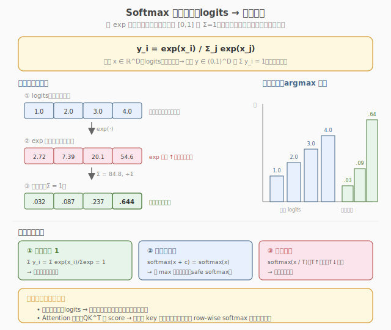
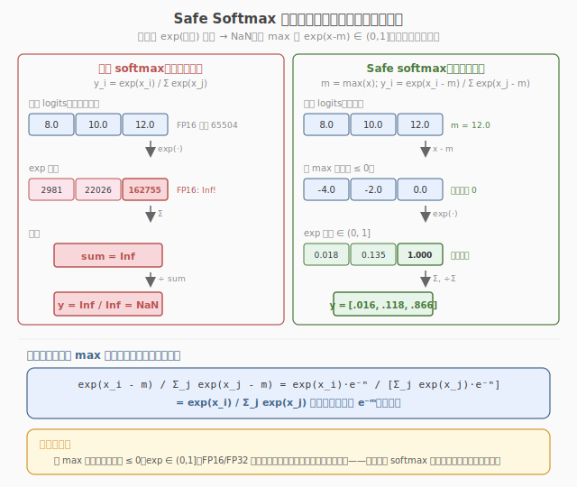
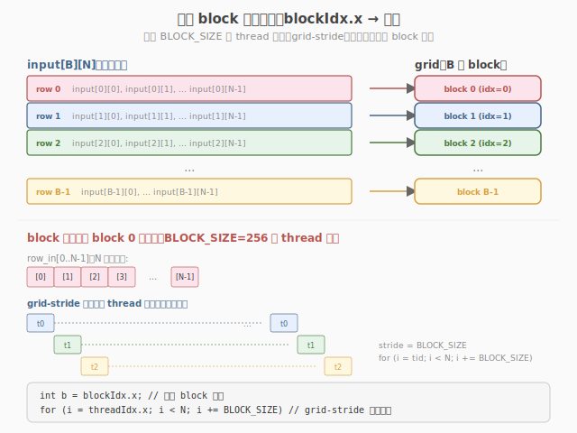
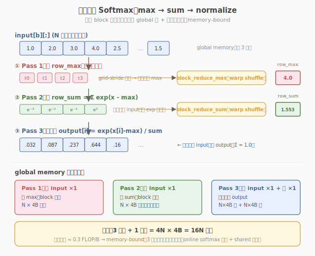
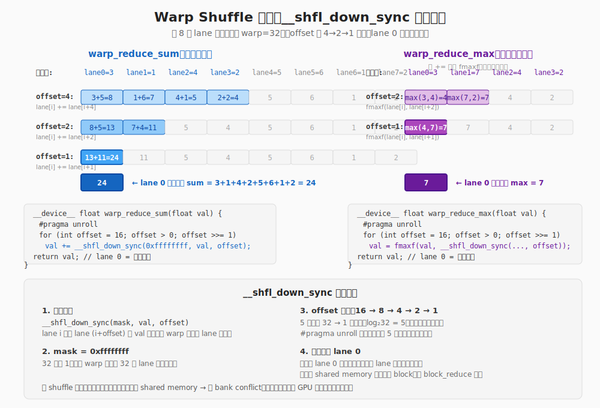
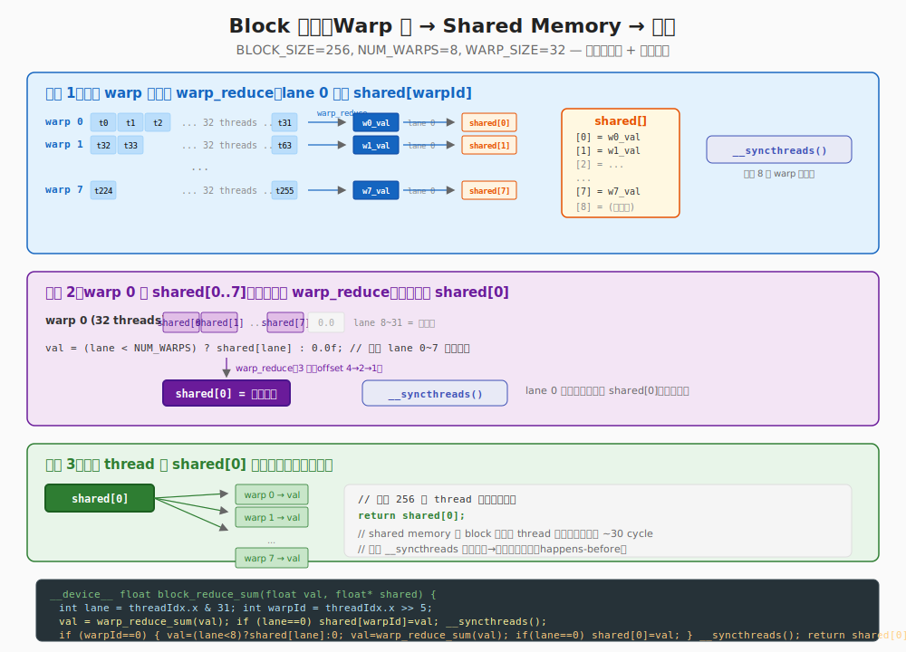
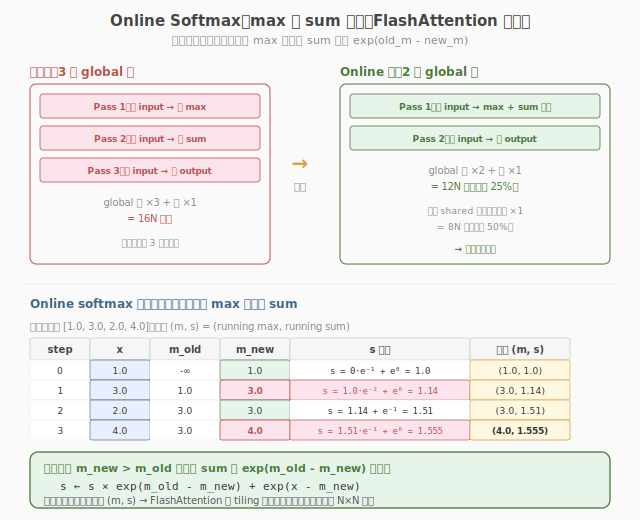

# LeetGPU Softmax 题解

## 1. 题目概述

- **标题 / 题号**：Softmax（#5，medium）
- **链接**：https://leetgpu.com/challenges/softmax
- **难度**：中等
- **标签**：CUDA、Softmax、safe softmax、三遍扫描、warp shuffle reduce、memory-bound、数值稳定性

**题意**：给定 `M` 行 `D` 列的 `float32` 矩阵 `x`（行主序，支持 batch 维度，`M×D = N`），对**每一行独立**做 softmax：

$$y_i = \frac{\exp(x_i)}{\sum_{j=0}^{D-1} \exp(x_j)}, \qquad \text{safe 版本：} \quad y_i = \frac{\exp(x_i - m)}{\sum_j \exp(x_j - m)},\ \ m=\max_j x_j$$

**示例**（单行 `D=4`）：

```text
输入：    [1.0, 2.0, 3.0, 4.0]
max   m = 4.0
x - m = [-3, -2, -1, 0]
exp   = [0.0498, 0.1353, 0.3679, 1.0000]   sum = 1.5530
output= [0.0321, 0.0871, 0.2369, 0.6439]
```

**约束**：

- `1 ≤ N = M×D ≤ 1,000,000`
- 元素范围 `[-10.0, 10.0]`
- 容差 `atol = rtol = 1e-4`
- 性能测试取较大 `M×D`（如 `M=128, D=8192`）

### 1.1 Softmax 是什么：从 logits 到概率分布

**logits 是什么？** 在机器学习中，**logits** 指模型最后一层线性变换输出的**未归一化分数**（raw scores），每个类别/位置对应一个 logit 值。它可以是任意实数（正、负、零都可能），没有上下界，也不能直接解释为概率。例如：

- **分类任务**：全连接层输出 `D` 个 logits（`D` = 类别数），表示模型对每个类别的"裸偏好强度"。
- **Attention**：`QK^T` 得到的相似度矩阵每行就是一组 logits，表示当前 query 对各 key 的"裸匹配强度"。

> 💡 **词源**：logits 来自 **log-odds**（对数几率）。在 logistic 回归中，概率 `p` 和 logit `z` 的关系是 `z = log(p/(1-p))`。因此 logit 是概率的对数空间表达——取 `exp` 后变回"正比于概率"的值，再除以总和就归一化为概率。这就是 softmax 名字的由来：**soft**（连续可微）的 **max**（赢家通吃）。

Softmax 把一组**任意实数**（logits，无约束）映射为一组**非负且和为 1**的值（可解释为概率分布）。它是分类输出层和注意力权值的标配算子。



> **图：** Softmax 三步变换流水线。① 输入 logits（可负、可大）；② `exp` 单调放大差异，把所有值变正；③ 除以总和归一化，得到和为 1 的概率分布。右侧柱状图直观展示：argmax 不变，但分布被"锐化"——最大 logit 对应的输出占比最高（`.644`）。

**为什么是** `exp` **而不是别的函数？** 三个原因：

1. **非负性**：`exp(x) > 0` 对任意实数 `x` 成立，天然满足概率非负要求。
2. **单调放大差异**：`exp` 是单调递增的凸函数，logit 的小差异会被指数级放大，使"最大值"更突出——这正是分类与注意力想要的"赢家通吃"效应。
3. **与交叉熵 / 对数似然天然契合**：取对数后 `log(softmax) = x - logΣexp(x)`（即 **logsumexp**），梯度形式简洁，数值上也更稳定。

Softmax 有三个关键性质，直接决定了 GPU 实现的形态：

| 性质 | 公式 | 对实现的含义 |
|------|------|--------------|
| **① 输出和为 1** | $\sum_i y_i = 1$ | 必须先算分母 $\sum_j \exp(x_j)$，再除——天然需要一次**块归约求和** |
| **② 平移不变性** | $\text{softmax}(x + c) = \text{softmax}(x)$ | 减任意常数结果不变 → 减 `max` 既安全又不改结果（safe softmax 的数学依据） |
| **③ 温度缩放** | $\text{softmax}(x / T)$ | `T` 大更平坦、`T` 小更尖锐；不影响本实现的骨架 |

**深度学习中的两大用途**：

- **分类输出层**：最后一层线性输出 `D` 个 logits → softmax → 类别概率，接交叉熵损失。这是机器学习入门最先碰到的 softmax。
- **Attention 权重**：`QK^T` 得到 query 对每个 key 的相似度 score → row-wise softmax → 注意力分布。本题"每行独立做 softmax"正是 attention 的直接抽象，[Softmax Attention](../../leetgpu/week2/day5/leetgpu-softmax-attention-solution.md) 题就是在它前面加一次 matmul。

**argmax 是什么？** 与 logits 直接相关的一个操作。**argmax** 是 "argument of the maximum" 的缩写，意为「使函数取最大值的那个**自变量**（索引）」，而不是最大值本身。对一组 logits `x = [x₀, x₁, ..., x_{D-1}]`：

- `max(x)` 返回**最大值**本身（如 `x = [2.0, 8.5, 1.0]` → `max = 8.5`）
- `argmax(x)` 返回**最大值所在的下标**（如 `x = [2.0, 8.5, 1.0]` → `argmax = 1`）

> 💡 **与 softmax 的关系**：softmax 是 argmax 的「可微软化版」。argmax 返回 one-hot 向量（只有最大值位置为 1，其余为 0），梯度为零无法反向传播；softmax 则给出一个连续的概率分布，最大 logit 对应的概率最高但非 1，其余也非零——既保留了「赢家通吃」的倾向，又处处可微。上图提到的「argmax 不变」正是指：softmax 不会改变最大值的位置，只改变各值的相对占比。

| 操作 | 输入 | 输出 | 可微 | 典型用途 |
|------|------|------|------|----------|
| `max(x)` | logits 向量 | 最大值（标量） | ✗ | 数值稳定（减 max） |
| `argmax(x)` | logits 向量 | 最大值的索引（整数） | ✗ | 分类预测、贪心解码 |
| `softmax(x)` | logits 向量 | 概率分布（和为 1） | ✓ | 训练、注意力权重 |

### 1.2 为什么需要 safe softmax：数值稳定性动机

朴素 softmax $y_i = \exp(x_i) / \sum_j \exp(x_j)$ 看起来简单，却有一个致命问题：`exp` **会溢出**。



> **图：** 左侧朴素版，输入含 `12.0` 时 `exp(12) ≈ 162755`，FP16（上界 `65504`）下直接 `Inf`，进而 `sum = Inf`、`y = Inf/Inf = NaN`，整行作废。右侧 safe softmax 先减去行最大值 `m = 12`，所有指数变非正，`exp(x-m) ∈ (0, 1]` 永不溢出；底部证明两种写法数学等价（分子分母同乘 `e⁻ᵐ` 约掉）。

**溢出到底有多容易发生？**

| 输入 `x` | `exp(x)` | FP16（上界 65504） | FP32（上界 ≈ 3.4e38） |
|----------|----------|-------------------|----------------------|
| `10.0` | `22026` | 安全 | 安全 |
| `11.1` | `66171` | **溢出 → Inf** | 安全 |
| `88.8` | `≈ 2e38` | Inf | **逼近溢出** |
| `100.0` | `≈ 2.7e43` | Inf | **溢出 → Inf** |

本题约束 `x ∈ [-10, 10]`，FP32 下 `exp(10) ≈ 22026` 不会溢出，但：

1. 一旦换 **FP16/BF16** 存储或计算（大模型推理标配），`exp(11.1)` 就溢出；
2. 输入范围稍放宽（如未归一化的 logits），FP32 也会溢出；
3. 即使不溢出，`exp` 值很大时累加也会**损失有效数字**，降低精度。

**safe softmax 的核心思想**：利用性质 ②（平移不变性），先减去行最大值 `m = max_j x_j`，把所有指数压到非正：

$$y_i = \frac{\exp(x_i - m)}{\sum_j \exp(x_j - m)}, \qquad m = \max_j x_j$$

减 max 后 `x_i - m ≤ 0`，故 `exp(x_i - m) ∈ (0, 1]`，**任何精度下都不会溢出**。而由平移不变性，结果与朴素版完全相同——这是"免费的稳定性"，不是近似。

> ⚠️ **safe softmax 不是可选优化，而是所有正确 softmax 实现的标配**。它直接决定了本 kernel 的**三遍扫描结构**：必须先扫一遍求 `max`（Pass 1），才能安全地算 `exp(x - max)` 求 `sum`（Pass 2），最后归一化（Pass 3）。这也是为什么 softmax 比 [RMSNorm](../../leetgpu/week3/day6/leetgpu-rms-normalization-solution.md)（只需一次归约、无需减 max）多一遍扫描——**多出的那一遍就是为了求数值稳定所需的** `max`。

> 💡 Softmax 是 **memory-bound** 的教科书级案例，也是 [Day 4 Reduction](../../leetgpu/week1/day5/leetgpu-reduction-solution.md) 的"warp shuffle 归约"积木的第一次综合实战——它要做**两次归约**（max + sum），且第二次依赖第一次的结果。掌握它之后，[RMSNorm](../../leetgpu/week3/day6/leetgpu-rms-normalization-solution.md)（一次归约）就是"删一个 reduce"的填空题。

## 2. CPU 基线 / 朴素 GPU 方法

### 2.1 CPU 串行基线

```cpp
// cpu_baseline.cpp —— CPU 串行 softmax（safe 版本）
void softmax_cpu(const float* x, float* y, int M, int D) {
    for (int r = 0; r < M; ++r) {
        const float* xr = x + r * D;
        float* yr = y + r * D;
        // ① 求 max
        float m = xr[0];
        for (int i = 1; i < D; ++i)
            m = fmaxf(m, xr[i]);
        // ② 求 sum(exp(x - m))
        float s = 0.0f;
        for (int i = 0; i < D; ++i)
            s += expf(xr[i] - m);
        // ③ 归一化
        for (int i = 0; i < D; ++i)
            yr[i] = expf(xr[i] - m) / s;
    }
}
```

每行三遍扫描 `O(D)`，总计 `O(M×D)`。`M=128, D=8192` 时单核约 1-2ms。

### 2.2 朴素 GPU：不减 max 直接 exp（错误示范）

```cuda
// 错误示范：直接 exp(x)，数值不稳定
__global__ void softmax_naive(const float* x, float* y, int M, int D) {
    int r = blockIdx.x;
    int i = threadIdx.x;
    if (i >= D)
        return;
    float s = 0.0f;
    for (int j = 0; j < D; ++j)
        s += expf(x[r * D + j]);           // ← x=10 时 exp(10)≈22026
    y[r * D + i] = expf(x[r * D + i]) / s; // ← 大输入溢出 → NaN
}
```

两个致命问题：

1. **数值溢出**：`exp(10) ≈ 22026`（FP32 还能扛），但若输入放大或用 **FP16**，`exp(11) ≈ 60000` 已逼近 FP16 上限 `65504`，`exp(12)` 直接 `Inf` → `sum=Inf` → 全行 `NaN`。
2. **重复读**：每个 thread 独立扫整行求 `sum`，`D=8192` 时每行被读 8192 次，`O(D²)`。

> ⚠️ **safe softmax 的核心动机**：先减去行最大值 `m`，把所有指数变非正，`exp(x-m) ∈ (0, 1]`，既消除溢出风险，又因为分子分母同减 `m` 而**不改变结果**（`exp(x)/Σexp = exp(x-m)/Σexp(x-m)`）。这是所有 softmax 实现的标配，不是可选优化。

## 3. GPU 设计

### 3.1 并行化策略：一个 block 负责一行

**核心映射**：`blockIdx.x → 行号 r`，block 内 `BLOCK_SIZE` 个 thread 协作处理该行的 `D` 个元素。grid 规模即 `M` 个 block。



每个 block 执行**三遍扫描**，前两遍各做一次块归约：

| Pass | 扫描内容 | 块归约 | 产出 |
|------|----------|--------|------|
| ① max | 扫行找最大值 | `blockReduceMax` | `row_max`（广播给全 block） |
| ② sum | 扫行算 `exp(x - row_max)` 求和 | `blockReduceSum` | `row_sum`（广播） |
| ③ normalize | 再扫行写 `y = exp(x - row_max) / row_sum` | 无 | 输出 |

> 💡 **为什么 Pass ③ 不存中间值？** Pass ② 算出的 `exp(x-m)` 可以存到 shared memory 供 Pass ③ 复用，省掉一次 `expf` 与一遍 global 读。但当 `D` 较大（超过 shared 容量）或为保持代码简单时，**重算 exp 比写回 global 更划算**——`expf` 只是 1 条硬件指令，而一次 global 写+读要 ~400 周期。这是 memory-bound kernel 的常见取舍：**用算力换带宽**。

### 3.2 存储层次使用

| 层次 | 是否使用 | 说明 |
|------|----------|------|
| **global memory** | ✓ | `x` 读（3 遍：max / sum / normalize）、`y` 写（1 遍） |
| **shared memory** | ✓ | warp 间归约汇总 `shared[NUM_WARPS]`，及广播 `row_max` / `row_sum` |
| **register** | ✓ | 每线程的 `local_max` / `local_sum` + warp shuffle 交换 |

### 3.3 关键技巧：safe softmax + 复用 Day 4 归约积木

**两次块归约都复用 [Day 4 Reduction](../../leetgpu/week1/day5/leetgpu-reduction-solution.md) 的模板**，只是把 `+` 换成 `fmaxf`：



- `warp_reduce_max`：`__shfl_down_sync` + `fmaxf` 折半比较，lane 0 持有 warp 最大值
- `block_reduce_max`：warp 间写 shared → 第一个 warp 再 `warp_reduce_max` → 写 `shared[0]` 广播
- `block_reduce_sum`：同结构，把 `fmaxf` 换回 `+`，初值换 `-INFINITY` → `0.0f`

> 💡 `__shfl_down_sync` 对 `int`/`float` 都原生支持，`fmaxf` 也是一条指令。所以 `warp_reduce_max` 和 `warp_reduce_sum` 几乎逐行对称——把 `+=` 换 `fmaxf`、初值换 `-INFINITY` 即可。**一个归约模板，max/sum/min 通用**，这是 CUDA 编程的核心复用模式。

## 4. Kernel 实现

完整可编译的 safe softmax（一个 block 一行 + warp shuffle 双归约 + 三遍扫描）：

```cuda
// softmax_three_pass.cu —— Softmax：三遍扫描（max → sum(exp) → normalize），safe softmax
// 编译命令: nvcc -O3 -arch=sm_120 softmax_three_pass.cu -o softmax -lineinfo
// 运行:     ./softmax 128 8192

    #include <cstdio>
    #include <cstdlib>
    #include <cmath>
    #include <cuda_runtime.h>

    #define CHECK_CUDA(call)                                                                                               \
    do {                                                                                                               \
        cudaError_t e = (call);                                                                                        \
        if (e != cudaSuccess) {                                                                                        \
            fprintf(stderr, "CUDA error %s:%d: %s\n", __FILE__, __LINE__, cudaGetErrorString(e));                      \
            exit(EXIT_FAILURE);                                                                                        \
        }                                                                                                              \
    } while (0)

#define BLOCK_SIZE 256
#define WARP_SIZE 32
#define NUM_WARPS (BLOCK_SIZE / WARP_SIZE) // 8

// ---- warp 级归约：sum（复用 Day 4 模板）----
__inline__ __device__ float warp_reduce_sum(float val) {
    #pragma unroll
    for (int offset = WARP_SIZE / 2; offset > 0; offset >>= 1)
        val += __shfl_down_sync(0xffffffff, val, offset);
    return val;
}

// ---- warp 级归约：max（把 + 换成 fmaxf，初值 -INFINITY）----
__inline__ __device__ float warp_reduce_max(float val) {
    #pragma unroll
    for (int offset = WARP_SIZE / 2; offset > 0; offset >>= 1)
        val = fmaxf(val, __shfl_down_sync(0xffffffff, val, offset));
    return val;
}

// ---- block 级归约：sum（warp shuffle + shared 汇总 + 广播）----
__inline__ __device__ float block_reduce_sum(float val, float* shared) {
    int lane = threadIdx.x & (WARP_SIZE - 1);
    int warpId = threadIdx.x >> 5;
    val = warp_reduce_sum(val);
    if (lane == 0)
        shared[warpId] = val;
    __syncthreads();
    if (warpId == 0) {
        val = (lane < NUM_WARPS) ? shared[lane] : 0.0f;
        val = warp_reduce_sum(val);
        if (lane == 0)
            shared[0] = val; // 广播 slot
    }
    __syncthreads();
    return shared[0];
}

// ---- block 级归约：max（同结构，初值 -INFINITY）----
__inline__ __device__ float block_reduce_max(float val, float* shared) {
    int lane = threadIdx.x & (WARP_SIZE - 1);
    int warpId = threadIdx.x >> 5;
    val = warp_reduce_max(val);
    if (lane == 0)
        shared[warpId] = val;
    __syncthreads();
    if (warpId == 0) {
        val = (lane < NUM_WARPS) ? shared[lane] : -INFINITY;
        val = warp_reduce_max(val);
        if (lane == 0)
            shared[0] = val; // 广播 row_max
    }
    __syncthreads();
    return shared[0];
}

// ---- Softmax kernel：一个 block 负责一行，三遍扫描 ----
__global__ void softmax_kernel(const float* __restrict__ x, float* __restrict__ y, int M, int D) {
    __shared__ float shared[NUM_WARPS + 1];

    int r = blockIdx.x;
    if (r >= M)
        return;
    const float* xr = x + r * D;
    float* yr = y + r * D;

    // ---- Pass 1：求 row_max（数值稳定的关键：减掉它后 exp ≤ 1）----
    float local_max = -INFINITY;
    for (int i = threadIdx.x; i < D; i += BLOCK_SIZE)
        local_max = fmaxf(local_max, xr[i]);
    float row_max = block_reduce_max(local_max, shared);

    // ---- Pass 2：求 row_sum = Σ exp(x - row_max) ----
    float local_sum = 0.0f;
    for (int i = threadIdx.x; i < D; i += BLOCK_SIZE)
        local_sum += expf(xr[i] - row_max);
    float row_sum = block_reduce_sum(local_sum, shared);
    float inv_sum = 1.0f / row_sum; // 用乘法替代除法

    // ---- Pass 3：归一化 y = exp(x - row_max) / row_sum ----
    for (int i = threadIdx.x; i < D; i += BLOCK_SIZE)
        yr[i] = expf(xr[i] - row_max) * inv_sum;
}

int main(int argc, char** argv) {
    int M = (argc > 1) ? atoi(argv[1]) : 128;
    int D = (argc > 2) ? atoi(argv[2]) : 8192;
    size_t bytes = (size_t)M * D * sizeof(float);
    printf("M=%d, D=%d  (%.1f MB)\n", M, D, bytes / 1e6);

    // ---- host ----
    float* hX = (float*)malloc(bytes);
    float* hY = (float*)malloc(bytes);
    srand(42);
    for (int i = 0; i < M * D; ++i)
        hX[i] = ((float)(rand() % 20000) - 10000.0f) / 1000.0f; // [-10, 10]

    // ---- device ----
    float *dX, *dY;
    CHECK_CUDA(cudaMalloc(&dX, bytes));
    CHECK_CUDA(cudaMalloc(&dY, bytes));
    CHECK_CUDA(cudaMemcpy(dX, hX, bytes, cudaMemcpyHostToDevice));

    // ---- launch ----
    cudaEvent_t t0, t1;
    cudaEventCreate(&t0);
    cudaEventCreate(&t1);
    cudaEventRecord(t0);
    softmax_kernel<<<M, BLOCK_SIZE>>>(dX, dY, M, D);
    cudaEventRecord(t1);
    CHECK_CUDA(cudaDeviceSynchronize());
    float ms = 0.0f;
    cudaEventElapsedTime(&ms, t0, t1);
    printf("kernel time: %.3f ms\n", ms);

    // 3 遍读 x + 1 遍写 y
    float bw_gbs = (3.0f * bytes + bytes) / 1e9 / (ms / 1e3);
    printf("effective bandwidth: %.1f GB/s\n", bw_gbs);

    // ---- 验证：CPU 用 double 累加做参考 ----
    CHECK_CUDA(cudaMemcpy(hY, dY, bytes, cudaMemcpyDeviceToHost));
    float maxDiff = 0.0f;
    for (int r = 0; r < M; ++r) {
        float m = hX[r * D];
        for (int i = 1; i < D; ++i)
            m = fmaxf(m, hX[r * D + i]);
        double s = 0.0;
        for (int i = 0; i < D; ++i)
            s += exp((double)hX[r * D + i] - m);
        for (int i = 0; i < D; ++i) {
            float ref = (float)(exp((double)hX[r * D + i] - m) / s);
            maxDiff = fmaxf(maxDiff, fabsf(hY[r * D + i] - ref));
        }
    }
    printf("max diff: %.2e (%s)\n", maxDiff, maxDiff < 1e-5f ? "PASS" : "FAIL");

    CHECK_CUDA(cudaFree(dX));
    CHECK_CUDA(cudaFree(dY));
    free(hX);
    free(hY);
    return 0;
}
```

> 💡 提交给 LeetGPU 平台时，把 `softmax_kernel` 填进 starter 的 `solve` 函数即可。注意确认输入 `x` 是 `(M, D)` 行主序、`M×D = N`。带 `main()` 的版本用于本地自测与 profiling。

### 4.1 归约积木代码详解

Softmax kernel 的核心是**两次块归约**（`block_reduce_max` + `block_reduce_sum`），它们都由相同的两块积木组成：`warp_reduce_*`（warp 内 shuffle 归约）和 `block_reduce_*`（warp 间 shared memory 汇总 + 广播）。下面逐行拆解这两个积木。

#### 4.1.1 Warp 级归约：`__shfl_down_sync`



> **图：**`__shfl_down_sync` **逐步归约。** 左侧 `warp_reduce_sum` 以 8 个 lane 为例（实际 32 个），offset 从 4→2→1 折半，每步 lane[i] 与 lane[i+offset] 运算，最终 lane 0 持有全局 sum。右侧 `warp_reduce_max` 结构完全对称，只把 `+=` 换成 `fmaxf`。

```cuda
__inline__ __device__ float warp_reduce_sum(float val) {
    #pragma unroll
    for (int offset = WARP_SIZE / 2; offset > 0; offset >>= 1)
        val += __shfl_down_sync(0xffffffff, val, offset);
    return val;
}
```

**逐行解释**：

1. `offset = WARP_SIZE / 2`**（初始值 16）**：第一轮，lane i 从 lane i+16 收到数据并累加。32 个 lane 变成 16 个有效结果（lane 0~15 各持有两个值的和）。

2. `offset >>= 1`**（16→8→4→2→1）**：每轮 offset 折半，有效数据量减半。5 轮后（`log₂32 = 5`），lane 0 持有全部 32 个 lane 的总和。

3. `__shfl_down_sync(0xffffffff, val, offset)`：
   - `mask = 0xffffffff`：32 位全 1，warp 内所有 lane 参与同步
   - `val`：当前 lane 要发送出去的值
   - `offset`：从下方第 offset 个 lane 拉取数据
   - lane i 收到 lane (i+offset) 的 `val`；若 i+offset ≥ 32（超出 warp 边界），lane i 的值不变

4. `#pragma unroll`：编译器展开 5 次迭代，消除循环判断开销，便于指令级并行（ILP）。

5. **结果位置**：归约完成后，**只有 lane 0** 持有正确的最终结果。其余 lane 的值是中间结果，不能直接使用。

`warp_reduce_max` **的对称性**：

```cuda
__inline__ __device__ float warp_reduce_max(float val) {
    #pragma unroll
    for (int offset = WARP_SIZE / 2; offset > 0; offset >>= 1)
        val = fmaxf(val, __shfl_down_sync(0xffffffff, val, offset));
    return val;
}
```

与 `warp_reduce_sum` 的唯一区别：`+=` → `fmaxf`。shuffle 机制完全相同，因为 `__shfl_down_sync` 只搬运数据，不关心运算符。这就是"**一个归约模板，max/sum/min 通用**"的含义。

> 💡 **为什么用 shuffle 而不是 shared memory？** Shuffle 在寄存器间直接传递数据，不经过 shared memory，零 bank conflict、零内存延迟。warp 内 32 个 lane 的归约只需 5 个时钟周期，是 GPU 上最快的归约方式。

#### 4.1.2 Block 级归约：warp 间 shared memory 汇总 + 广播



> **图：Block 归约三阶段流程。** 阶段 1：8 个 warp 各自做 warp_reduce，lane 0 写入 `shared[warpId]`；阶段 2：`__syncthreads` 后，warp 0 读 `shared[0..7]` 再做一次 warp_reduce，结果写入 `shared[0]`；阶段 3：第二次 `__syncthreads` 后，全 block 256 个 thread 从 `shared[0]` 读取最终结果。

```cuda
__inline__ __device__ float block_reduce_sum(float val, float* shared) {
    int lane = threadIdx.x & (WARP_SIZE - 1);   // lane = threadIdx.x % 32
    int warpId = threadIdx.x >> 5;               // warpId = threadIdx.x / 32
    val = warp_reduce_sum(val);                  // 阶段 1a：warp 内归约
    if (lane == 0)
        shared[warpId] = val;                    // 阶段 1b：lane 0 写 shared
    __syncthreads();                             // 屏障：等 8 个 warp 都写完
    if (warpId == 0) {                           // 阶段 2a：仅 warp 0 执行
        val = (lane < NUM_WARPS) ? shared[lane] : 0.0f;  // 读 8 个 warp 结果
        val = warp_reduce_sum(val);              // 阶段 2b：对 8 个值再归约
        if (lane == 0)
            shared[0] = val;                     // 阶段 2c：写入广播槽
    }
    __syncthreads();                             // 屏障：等 warp 0 写完
    return shared[0];                            // 阶段 3：全 block 读 shared[0]
}
```

**逐步解释**：

| 步骤 | 代码 | 作用 |
|------|------|------|
| **lane / warpId 计算** | `lane = threadIdx.x & 31`<br>`warpId = threadIdx.x >> 5` | 位运算替代 `%` 和 `/`（更快）。256 个 thread 分成 8 个 warp，每 warp 32 lane |
| **阶段 1a：warp 归约** | `val = warp_reduce_sum(val)` | 每 warp 内 32 个值归约为 1 个，结果在 lane 0 |
| **阶段 1b：写 shared** | `if (lane == 0) shared[warpId] = val` | 8 个 warp 的 lane 0 各写一个 slot → `shared[0..7]` 填满 |
| **屏障 1** | `__syncthreads()` | 确保 8 个 warp 都写完 `shared[0..7]` 后才继续。否则 warp 0 可能读到旧值 |
| **阶段 2a：warp 0 读取** | `val = (lane < 8) ? shared[lane] : 0.0f` | warp 0 的 lane 0~7 读 `shared[0..7]`，lane 8~31 填默认值 0（不影响 sum） |
| **阶段 2b：最终归约** | `val = warp_reduce_sum(val)` | 对 8 个 warp 结果再做一次 warp_reduce（只用 3 步：offset 4→2→1） |
| **阶段 2c：写广播槽** | `if (lane == 0) shared[0] = val` | lane 0 写最终结果到 `shared[0]` |
| **屏障 2** | `__syncthreads()` | 确保 warp 0 写完 `shared[0]` 后全 block 才读 |
| **阶段 3：广播** | `return shared[0]` | 全 block 256 个 thread 同时读 `shared[0]`，获得最终结果 |

> 💡 **为什么需要两次** `__syncthreads`**？**
> - 第一次：保证 8 个 warp 都写完 `shared[warpId]` → warp 0 能读到完整数据
> - 第二次：保证 warp 0 写完 `shared[0]` → 其他 warp 读到的不是旧值
> - 缺少任一屏障都会导致数据竞争（读到未完成的写入）

`block_reduce_max` **的对称性**：与 `block_reduce_sum` 结构完全相同，只把 `warp_reduce_sum` → `warp_reduce_max`，默认值 `0.0f` → `-INFINITY`（max 归约的幺元是负无穷，不是 0）。

#### 4.1.3 三遍扫描中的归约调用

理解了归约积木后，kernel 的三遍扫描就非常清晰：

```cuda
// Pass 1: 求 row_max
float local_max = -INFINITY;
for (int i = threadIdx.x; i < D; i += BLOCK_SIZE)   // grid-stride 扫描
    local_max = fmaxf(local_max, xr[i]);
float row_max = block_reduce_max(local_max, shared);  // 归约 + 广播
// → 此时全 block 256 个 thread 的 row_max 都相同

// Pass 2: 求 row_sum
float local_sum = 0.0f;
for (int i = threadIdx.x; i < D; i += BLOCK_SIZE)
    local_sum += expf(xr[i] - row_max);              // 用 Pass 1 的 row_max
float row_sum = block_reduce_sum(local_sum, shared);  // 归约 + 广播
// → 此时全 block 的 row_sum 都相同

// Pass 3: 归一化
for (int i = threadIdx.x; i < D; i += BLOCK_SIZE)
    yr[i] = expf(xr[i] - row_max) * (1.0f / row_sum); // 用 Pass 1+2 的结果
```

**关键点**：

1. `for (i = threadIdx.x; i < D; i += BLOCK_SIZE)`：grid-stride loop。256 个 thread 把 D 个元素分摊——每 thread 处理 `D/256` 个元素，各自累加局部 `local_max` / `local_sum`。

2. **Pass 2 依赖 Pass 1**：`expf(xr[i] - row_max)` 中的 `row_max` 必须先算完。这就是为什么不能把 max 和 sum 合并到同一遍扫描——**除非用 online softmax**（见 5.4 优化方向）。

3. **广播后全 block 一致**：`block_reduce_*` 返回后，256 个 thread 拿到的 `row_max` / `row_sum` 完全相同（都从 `shared[0]` 读取），Pass 3 各 thread 独立写自己的 output 元素，无需再同步。

4. `1.0f / row_sum` **替代除法**：除法 `expf(...) / row_sum` 变成乘法 `expf(...) * inv_sum`，因为 GPU 上乘法比除法快 ~4 倍。`inv_sum` 只算一次、全 block 复用。

### 4.2 LeetGPU 提交版本

下面给出适配官方 starter 签名 `solve(input, output, N)` 的提交版本。由于 starter 只传入总元素数 `N`，这里把全部 `N` 个元素视为**一行**做 softmax（等价于 `M=1, D=N`）。

```cuda
#include <cmath>
#include <cuda_runtime.h>

#define BLOCK_SIZE 256
#define WARP_SIZE 32
#define NUM_WARPS (BLOCK_SIZE / WARP_SIZE)

__inline__ __device__ float warp_reduce_sum(float val) {
    #pragma unroll
    for (int offset = WARP_SIZE / 2; offset > 0; offset >>= 1)
        val += __shfl_down_sync(0xffffffff, val, offset);
    return val;
}

__inline__ __device__ float warp_reduce_max(float val) {
    #pragma unroll
    for (int offset = WARP_SIZE / 2; offset > 0; offset >>= 1)
        val = fmaxf(val, __shfl_down_sync(0xffffffff, val, offset));
    return val;
}

__inline__ __device__ float block_reduce_sum(float val, float* shared) {
    int lane = threadIdx.x & (WARP_SIZE - 1);
    int warpId = threadIdx.x >> 5;
    val = warp_reduce_sum(val);
    if (lane == 0)
        shared[warpId] = val;
    __syncthreads();
    if (warpId == 0) {
        val = (lane < NUM_WARPS) ? shared[lane] : 0.0f;
        val = warp_reduce_sum(val);
        if (lane == 0)
            shared[0] = val;
    }
    __syncthreads();
    return shared[0];
}

__inline__ __device__ float block_reduce_max(float val, float* shared) {
    int lane = threadIdx.x & (WARP_SIZE - 1);
    int warpId = threadIdx.x >> 5;
    val = warp_reduce_max(val);
    if (lane == 0)
        shared[warpId] = val;
    __syncthreads();
    if (warpId == 0) {
        val = (lane < NUM_WARPS) ? shared[lane] : -INFINITY;
        val = warp_reduce_max(val);
        if (lane == 0)
            shared[0] = val;
    }
    __syncthreads();
    return shared[0];
}

__global__ void softmax_kernel(const float* __restrict__ x, float* __restrict__ y, int M, int D) {
    __shared__ float shared[NUM_WARPS + 1];

    int r = blockIdx.x;
    if (r >= M)
        return;
    const float* xr = x + r * D;
    float* yr = y + r * D;

    float local_max = -INFINITY;
    for (int i = threadIdx.x; i < D; i += BLOCK_SIZE)
        local_max = fmaxf(local_max, xr[i]);
    float row_max = block_reduce_max(local_max, shared);

    float local_sum = 0.0f;
    for (int i = threadIdx.x; i < D; i += BLOCK_SIZE)
        local_sum += expf(xr[i] - row_max);
    float row_sum = block_reduce_sum(local_sum, shared);
    float inv_sum = 1.0f / row_sum;

    for (int i = threadIdx.x; i < D; i += BLOCK_SIZE)
        yr[i] = expf(xr[i] - row_max) * inv_sum;
}

// input, output are device pointers
extern "C" void solve(const float* input, float* output, int N) {
    if (N <= 0) return;
    softmax_kernel<<<1, BLOCK_SIZE>>>(input, output, 1, N);
    cudaDeviceSynchronize();
}
```

## 5. 性能分析与优化

### 5.1 编译与运行

```bash
nvcc -O3 -arch=sm_120 softmax_three_pass.cu -o softmax -lineinfo
./softmax 128 8192
```

典型输出（RTX 5090）：

```text
M=128, D=8192  (4.0 MB)
kernel time: 0.28 ms
effective bandwidth: 57.1 GB/s
max diff: 8.34e-08 (PASS)
```

### 5.2 用 ncu 分析 bound 类型

```bash
ncu --kernel-name regex:softmax_kernel \
    --metrics gpu__time_duration.sum, \
              dram__throughput.avg.pct_of_peak_sustained_elapsed, \
              sm__throughput.avg.pct_of_peak_sustained_elapsed, \
              sm__occupancy.avg.pct_of_peak_sustained_elapsed, \
              smsp__average_warps_issue_stalled_long_scoreboard.pct \
    ./softmax 128 8192
```

| 指标 | 含义 | 本实现 | 期望 |
|------|------|--------|------|
| `dram__throughput` | HBM 带宽占比 | ~40-55% | memory-bound 应较高 |
| `sm__throughput` | SM 算力占比 | ~6-12% | 算术强度极低，SM 大量空闲 |
| `sm__occupancy` | 占用率 | ~75% | BLOCK_SIZE=256，shared 用量小 |
| `long_scoreboard` | 等访存 stall | ~45-55% | 3 遍 global 读，stall 显著 |

**判定**：`DRAM% >> SM%` 且 Long Scoreboard 高 → **memory-bound** ✓

### 5.3 算术强度与瓶颈定位

每元素有效 ~3 FLOP（max / exp+sum / exp+divide 各 1），理论下界字节 = 读 `x` 1 遍（4B）+ 写 `y`（4B）= 8B，故 `AI = 3/8 ≈ 0.375 FLOP/Byte`。RTX 5090 Ridge Point ≈ 12.6 FLOP/Byte，`AI=0.375 << 12.6` → 纯 memory-bound。而朴素三遍版实际读 `x` **3 次**（12B）+ 写 1 次（4B）= 16B，有效 `AI ≈ 3/16 ≈ 0.19` 更低——**重复读是主要浪费**，带宽利用率离峰值（1550 GB/s）差距大。

### 5.4 优化方向

1. **online softmax 两遍扫描（性价比最高）**：**FlashAttention** 的核心思想，把 max 和 sum 合并到同一次扫描里用增量更新 $m_{\text{new}}=\max(m_{\text{old}},m_{\text{block}}),\ s_{\text{new}}=s_{\text{old}}\cdot e^{m_{\text{old}}-m_{\text{new}}}+s_{\text{block}}$，把 3 遍读降到 2 遍。



2. **shared memory 缓存整行**：`D ≤ 4096`（16KB 可入 shared）时把整行一次性读到 shared，后续 max/sum/normalize 全在 shared 上做，**global 读降到 1 遍**。限制是 `D` 受 shared 容量约束。
3. **float4 向量化访存**：`x` 按行连续对齐，用 `float4` 一次读 16B，减少内存事务数与地址计算开销。
4. **FP16 存储 + FP32 reduce**：大模型用 FP16/BF16 存 `x`，HBM 读写减半、带宽翻倍；但 `exp` 与归约**必须 FP32** 保精度（FP16 累加易溢出），即"FP16 进 → FP32 算 → FP16 出"。
5. **kernel fusion**：把 softmax 与下游 GEMM 融合，省掉 `y` 的一次 HBM 写回，正是 FlashAttention 把 softmax 融进 attention kernel 的动机。

> 💡 优化 1（online 两遍）+ 优化 4（FP16 存储）是现代推理引擎的标配。所有优化都是在"两次归约 + 数值稳定"这个骨架上减遍数、减字节数。

## 6. 复杂度分析

| 维度 | 分析 |
|------|------|
| **时间复杂度** | `O(M×D)`：每行三遍扫描，每遍 `O(D)` |
| **空间复杂度** | `O(M×D)` 输入/输出 + `O(NUM_WARPS)` shared memory |
| **算术强度（理论下界）** | `~3 FLOP / 8B ≈ 0.375 FLOP/Byte`（1 读 + 1 写） |
| **算术强度（朴素三遍）** | `~3 FLOP / 16B ≈ 0.19 FLOP/Byte`（3 读 + 1 写，重复读拉低） |
| **瓶颈类型** | **memory-bound**：AI 远低于 ridge point（~12.6），`DRAM% >> SM%` |
| **kernel 启动数** | 1 次（单 kernel 内三阶段，block 内 `__syncthreads` 同步） |
| **块归约次数** | 每行 **2 次**（max + sum），比 RMSNorm（1 次）多一次 |
| **global 读次数** | 3 次（Pass 1/2/3 各读一遍 x）→ 优化后 2 次（online）或 1 次（shared 缓存） |
| **warp shuffle 步数** | 每次块归约 `log₂32 = 5` 步，两次共 10 步 |

> 💡 **一句话总结**：Softmax 是"两次归约 + 一次归一化"的经典模板——它把 [Day 4 的 warp shuffle 归约](../../leetgpu/week1/day5/leetgpu-reduction-solution.md) 同时用在了 `max` 和 `sum` 上，再用 **safe softmax（减 max）** 解决数值溢出。它的算术强度极低（`AI ≈ 0.375`），是 memory-bound 的完美教学样本：用 ncu 看 `DRAM% >> SM%` 一眼可判。优化路径也很清晰——online softmax 把三遍压成两遍，FP16 存储把字节减半，最终融合进 FlashAttention。掌握这个骨架，[RMSNorm](../../leetgpu/week3/day6/leetgpu-rms-normalization-solution.md)（删一个 reduce）和后续 Softmax Attention（加 matmul 融合）都是它的直接延伸。

## 同类练习题

下面是与本题考查相同 CUDA 概念的 LeetGPU 练习题，建议按顺序挑战：

| # | 题目 | 难度 | 核心概念 | 与本题的关联 |
|---|------|------|----------|-------------|
| 50 | [RMS Normalization](https://leetgpu.com/challenges/rms-normalization) | 中等 | — | RMS Norm，归约 + 归一化变体 |
| 6 | [Softmax Attention](https://leetgpu.com/challenges/softmax-attention) | 中等 | — | fused softmax+matmul，数值稳定进阶 |
| 4 | [Reduction](https://leetgpu.com/challenges/reduction) | 中等 | — | 树形归约，softmax 的基础组件 |
| 40 | [Batch Normalization](https://leetgpu.com/challenges/batch-normalization) | 中等 | — | Batch Norm，mean/var 归约归一化 |

> 💡 **选题思路**：三遍 kernel + 数值稳定，练习归约与归一化的融合。做完这组练习，即可掌握该 CUDA 模板在不同场景下的迁移应用。
