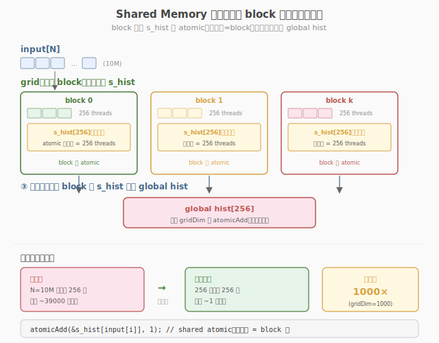

# LeetGPU Histogramming 题解

## 1. 题目概述

- **标题 / 题号**：Histogramming（#13，medium）
- **链接**：https://leetgpu.com/challenges/histogramming
- **难度**：中等
- **标签**：CUDA、Histogram、Shared Memory、`atomicAdd`、privatization、memory-bound

**题意**：给定长度为 `N` 的 `int32` 数组 `input`，元素值域 `[0, B)`，统计每个值（bin）出现的次数，结果写入长度为 `B` 的 `hist[]` 数组。即 `hist[b] = #{i | input[i] == b}`。

**示例**：

```text
输入：[3, 1, 4, 1, 5, 9, 2, 6, 5, 3, 5]   B = 10
输出：[0, 2, 1, 2, 1, 3, 1, 0, 0, 1]
```

**约束**：

- `1 ≤ N ≤ 10,000,000`
- `B` 通常为 `256`（一个 byte 的值域，常见于图像像素、量化索引）
- `0 ≤ input[i] < B`
- 性能测试取 `N = 10,000,000`，`B = 256`

> 💡 这是 **shared memory privatization**（私有化）的经典题。前几道题的数据流都是"每个线程独立写自己的位置"，互不干扰；而直方图是**多对少**——上千万个输入元素要汇聚到区区 256 个 bin。这天然导致**写冲突**。本题的核心矛盾不是"算不快"，而是"抢不到写口"，解法是用 **shared memory 私有副本** 把全局竞争打散成 block 内竞争。

## 2. CPU 基线 / 朴素 GPU 方法

### 2.1 CPU 串行基线

```cpp
// cpu_baseline.cpp —— CPU 单 pass 直方图
void histogram_cpu(const int* input, int* hist, int N, int B) {
    memset(hist, 0, B * sizeof(int));
    for (int i = 0; i < N; ++i) {
        hist[input[i]]++; // 顺序访问，无竞争
    }
}
```

`N = 10M` 时单核约 10-20 ms。CPU 的优势是**完全顺序**——每条 `hist[b]++` 都命中 L1/L2 cache，没有竞争。瓶颈是单线程带宽有限。

### 2.2 朴素 GPU：atomicAdd 到 global

最暴力的并行：每个 thread 读一个元素，用 `atomicAdd` 把对应 bin 加 1 到全局 `hist[]`。

```cuda
__global__ void histogram_naive(const int* input, int* hist, int N, int B) {
    int i = blockIdx.x * blockDim.x + threadIdx.x;
    if (i < N) {
        atomicAdd(&hist[input[i]], 1); // ← 所有线程抢 256 个 global 地址！
    }
}
```

**致命问题**：10M 个线程只有 256 个 bin 可写。即使值域均匀分布，平均每个 bin 仍要承受约 `10M/256 ≈ 39000` 次 atomic。GPU 的 `atomicAdd` 是**硬件串行化**同一地址的冲突——`hist[3]` 同时被几十个 thread 撞上时，硬件只能一个一个排队。实测下来朴素版**常常比 CPU 还慢 5-10 倍**。

> ⚠️ 直方图的瓶颈不在内存带宽，而在 **atomic 写串行化**。10M 次写挤 256 个坑，竞争烈度极高。优化方向必须是**减少同一地址的并发写者数量**，而不是堆 thread 数。

## 3. GPU 设计

### 3.1 并行化策略：Privatization 私有化

核心思想：**把一份全局 histogram 拆成多份私有 histogram**，让竞争从"全部 vs 全局"降级为"block 内 vs block 私有"，最后再合并。



三步走：

1. **每个 block 在 shared memory 开一份私有 histogram**（`B` 个 int，本题 `256 × 4B = 1KB`，远小于单 block 48-100KB shared 配额）。
2. **block 内线程把元素累加到自己的 shared histogram**：`atomicAdd(&shared_hist[bin], 1)`。shared memory 的 atomic 延迟比 global 低一个数量级，且**竞争范围从全 grid 缩到单 block**（单 block 通常 256 thread，竞争者骤降两个数量级）。
3. **block 末尾把 shared histogram 合并到 global**：每个 bin 用一次 `atomicAdd(&hist[b], shared_hist[b])`。注意此时 global atomic 的次数 = `B × blocks`（如 `256 × 432 ≈ 11 万次`），远少于朴素版的 `N = 1000 万次`，竞争几乎消失。

> 💡 **privatization 的本质**：用空间换竞争——多花 `O(B × blocks)` 的 shared memory，把 `O(N)` 次 global atomic 降级为 `O(B × blocks)` 次 global atomic + `O(N)` 次 shared atomic。shared atomic 又快又便宜，这笔交易极其划算。

### 3.2 存储层次使用

| 层次 | 是否使用 | 说明 |
|------|----------|------|
| **global memory** | ✓ | `input[]` 只读 + `hist[]` 最终输出（atomic 合并） |
| **shared memory** | ✓ | 每 block 一份私有 histogram，`B` 个 int（1KB），atomicAdd 主战场 |
| **register** | ✓ | 每线程的循环变量、当前 bin 值 |

### 3.3 关键技巧：两阶段 atomic

| 阶段 | 操作 | atomic 次数 | 竞争烈度 | 延迟 |
|------|------|------------|----------|------|
| 朴素 | `atomicAdd(&hist[b], 1)` | `N`（1000 万） | 极高（全 grid 抢 256 址） | global，~数百周期 |
| 阶段① | `atomicAdd(&shared_hist[b], 1)` | `N`（1000 万） | 低（单 block 内抢 256 址） | shared，~几十周期 |
| 阶段② | `atomicAdd(&hist[b], shared_hist[b])` | `B × blocks`（~11 万） | 极低（每址仅 blocks 个写者） | global，但并发低 |

> ⚠️ **不要省掉阶段②的** `if (shared_hist[b] > 0)` **判断**。即使某 bin 计数为 0 也发 atomicAdd 会让 global 端多做无谓事务。虽然逻辑等价，但能减少阶段②的 global 写流量约一半（稀疏分布时收益更大）。

## 4. Kernel 实现

完整可编译的私有化版本（含朴素版对比 + CPU 验证）：

```cuda
// histogram_privatized.cu —— shared memory privatization 直方图
// 编译命令: nvcc -O3 -arch=sm_120 histogram_privatized.cu -o histogram
// 运行:     ./histogram 10000000 256

    #include <cstdio>
    #include <cstdlib>
    #include <cstring>
    #include <cuda_runtime.h>

    #define CHECK_CUDA(call)                                                                                               \
    do {                                                                                                               \
        cudaError_t e = (call);                                                                                        \
        if (e != cudaSuccess) {                                                                                        \
            fprintf(stderr, "CUDA error %s:%d: %s\n", __FILE__, __LINE__, cudaGetErrorString(e));                      \
            exit(EXIT_FAILURE);                                                                                        \
        }                                                                                                              \
    } while (0)

#define BLOCK_SIZE 256
#define NUM_BINS 256

// 朴素版：所有线程 atomicAdd 到 global histogram（剧烈竞争，用于对比基准）
__global__ void histogram_naive(const int* input, int* hist, int N, int B) {
    int i = blockIdx.x * blockDim.x + threadIdx.x;
    if (i < N) {
        int bin = input[i];
        if (bin >= 0 && bin < B) {
            atomicAdd(&hist[bin], 1);
        }
    }
}

// 优化版：privatization —— 每 block 一份 shared histogram，最后合并到 global
__global__ void histogram_privatized(const int* input, int* hist, int N, int B) {
    __shared__ int shared_hist[NUM_BINS];

    int tid = threadIdx.x;

    // ① 初始化 shared histogram 为 0（block 内协作清零）
    for (int b = tid; b < B; b += blockDim.x) {
        shared_hist[b] = 0;
    }
    __syncthreads();

    // ② grid-stride 读输入，atomicAdd 到 shared（block 内竞争远小于 global）
    int gid = blockIdx.x * blockDim.x + tid;
    int stride = gridDim.x * blockDim.x;
    for (int i = gid; i < N; i += stride) {
        int bin = input[i];
        if (bin >= 0 && bin < B) {
            atomicAdd(&shared_hist[bin], 1); // shared atomic，低延迟
        }
    }
    __syncthreads();

    // ③ 把 shared histogram 合并到 global（每 bin 一次 global atomic）
    for (int b = tid; b < B; b += blockDim.x) {
        int v = shared_hist[b];
        if (v > 0) {
            atomicAdd(&hist[b], v);
        }
    }
}

int main(int argc, char** argv) {
    int N = (argc > 1) ? atoi(argv[1]) : 10000000;
    int B = (argc > 2) ? atoi(argv[2]) : NUM_BINS;
    size_t bytes = (size_t)N * sizeof(int);
    printf("N = %d, B = %d  (%.1f MB input)\n", N, B, bytes / 1e6);

    // ---- host 端 ----
    int* hIn = (int*)malloc(bytes);
    srand(42);
    for (int i = 0; i < N; ++i) {
        hIn[i] = rand() % B; // 值域 [0, B)
    }

    // ---- device 端 ----
    int *dIn, *dHist;
    CHECK_CUDA(cudaMalloc(&dIn, bytes));
    CHECK_CUDA(cudaMalloc(&dHist, B * sizeof(int)));
    CHECK_CUDA(cudaMemcpy(dIn, hIn, bytes, cudaMemcpyHostToDevice));

    int num_sm;
    CHECK_CUDA(cudaDeviceGetAttribute(&num_sm, cudaDevAttrMultiProcessorCount, 0));
    int blocks = num_sm * 4; // 经验值，保证 wave 充足
    printf("blocks = %d, threads/block = %d\n", blocks, BLOCK_SIZE);

    cudaEvent_t t0, t1;
    cudaEventCreate(&t0);
    cudaEventCreate(&t1);

    // ---- 优化版 ----
    CHECK_CUDA(cudaMemset(dHist, 0, B * sizeof(int)));
    cudaEventRecord(t0);
    histogram_privatized<<<blocks, BLOCK_SIZE>>>(dIn, dHist, N, B);
    cudaEventRecord(t1);
    CHECK_CUDA(cudaDeviceSynchronize());
    float ms_priv = 0.0f;
    cudaEventElapsedTime(&ms_priv, t0, t1);

    // ---- CPU 验证 ----
    int* hHist = (int*)malloc(B * sizeof(int));
    CHECK_CUDA(cudaMemcpy(hHist, dHist, B * sizeof(int), cudaMemcpyDeviceToHost));
    int* ref = (int*)calloc(B, sizeof(int));
    for (int i = 0; i < N; ++i)
        ref[hIn[i]]++;
    int max_err = 0;
    for (int b = 0; b < B; ++b) {
        int d = hHist[b] - ref[b];
        if (d < 0)
            d = -d;
        if (d > max_err)
            max_err = d;
    }
    printf("[privatized] time: %.3f ms  max_err: %d  %s\n", ms_priv, max_err, max_err == 0 ? "PASS" : "FAIL");

    // ---- 朴素版对比 ----
    CHECK_CUDA(cudaMemset(dHist, 0, B * sizeof(int)));
    cudaEventRecord(t0);
    histogram_naive<<<blocks, BLOCK_SIZE>>>(dIn, dHist, N, B);
    cudaEventRecord(t1);
    CHECK_CUDA(cudaDeviceSynchronize());
    float ms_naive = 0.0f;
    cudaEventElapsedTime(&ms_naive, t0, t1);
    CHECK_CUDA(cudaMemcpy(hHist, dHist, B * sizeof(int), cudaMemcpyDeviceToHost));
    max_err = 0;
    for (int b = 0; b < B; ++b) {
        int d = hHist[b] - ref[b];
        if (d < 0)
            d = -d;
        if (d > max_err)
            max_err = d;
    }
    printf("[naive]       time: %.3f ms  max_err: %d  %s  speedup: %.2fx\n", ms_naive, max_err,
           max_err == 0 ? "PASS" : "FAIL", ms_naive / ms_priv);

    // ---- 带宽估算（只算读 input 的量）----
    float bw_gbs = (bytes / 1e9) / (ms_priv / 1e3);
    printf("read bandwidth (privatized): %.1f GB/s\n", bw_gbs);

    CHECK_CUDA(cudaFree(dIn));
    CHECK_CUDA(cudaFree(dHist));
    free(hIn);
    free(hHist);
    free(ref);
    return 0;
}
```

> 💡 提交给 LeetGPU 平台时，把 `histogram_privatized` kernel 填进 `solve` 函数即可。注意 starter 通常已 `cudaMemset` 了 `hist`，无需在 kernel 内清 global。带 `main()` 的版本用于本地自测与性能对比。

### 4.1 LeetGPU 提交版本

下面给出适配官方 starter 签名 `solve(input, histogram, N, num_bins)` 的提交版本。它先清零全局 `histogram`，再启动 privatized kernel 统计并合并。

```cuda
#include <cuda_runtime.h>

#define BLOCK_SIZE 256
#define NUM_BINS 256

__global__ void histogram_privatized(const int* input, int* hist, int N, int B) {
    __shared__ int shared_hist[NUM_BINS];

    int tid = threadIdx.x;

    for (int b = tid; b < B; b += blockDim.x) {
        shared_hist[b] = 0;
    }
    __syncthreads();

    int gid = blockIdx.x * blockDim.x + tid;
    int stride = gridDim.x * blockDim.x;
    for (int i = gid; i < N; i += stride) {
        int bin = input[i];
        if (bin >= 0 && bin < B) {
            atomicAdd(&shared_hist[bin], 1);
        }
    }
    __syncthreads();

    for (int b = tid; b < B; b += blockDim.x) {
        int v = shared_hist[b];
        if (v > 0) {
            atomicAdd(&hist[b], v);
        }
    }
}

// input, histogram are device pointers
extern "C" void solve(const int* input, int* histogram, int N, int num_bins) {
    if (N <= 0 || num_bins <= 0) return;
    cudaMemset(histogram, 0, num_bins * sizeof(int));

    int blocks = (N + BLOCK_SIZE - 1) / BLOCK_SIZE;
    histogram_privatized<<<blocks, BLOCK_SIZE>>>(input, histogram, N, num_bins);
    cudaDeviceSynchronize();
}
```

### 4.2 代码详解

`histogram_privatized` kernel 采用经典的 **三段式 privatization 结构**：shared memory 清零 → grid-stride 累加到 shared histogram → 末尾合并到 global。一个 block 持有一份私有 `shared_hist[256]`，把"全 grid 抢 256 个 global 地址"降级为"单 block 内抢 256 个 shared 地址"。

**代码块逐段解析**：

1. **shared histogram 声明与清零**（kernel 开头）
   - `__shared__ int shared_hist[NUM_BINS]`：每个 block 独立的一份 256-int 私有直方图，占 1KB shared memory。
   - `for (int b = tid; b < B; b += blockDim.x)`：block 内 256 个 thread 协作清零（`B=256` 恰好每 thread 清 1 个 bin），随后 `__syncthreads` 保证全 block 可见。

2. **grid-stride 读输入 + shared atomicAdd**
   - `gid = blockIdx.x * blockDim.x + tid`：全局线程下标；`stride = gridDim.x * blockDim.x`：grid-stride 步长，让少量 block 覆盖全部 N 个元素。
   - `for (int i = gid; i < N; i += stride)`：每个 thread 跨步读取多个元素，提高每 thread 的工作量。
   - `int bin = input[i]`：当前元素的 bin 值（`0..B-1`）。
   - `atomicAdd(&shared_hist[bin], 1)`：累加到 **block 私有** 的 shared histogram。shared atomic 延迟仅数十周期，且竞争者只有同 block 的 256 个 thread（远小于全 grid）。
   - `__syncthreads`：确保所有 thread 完成累加后再进入合并阶段。

3. **shared → global 合并**
   - `for (int b = tid; b < B; b += blockDim.x)`：每 thread 负责若干 bin 的合并。
   - `int v = shared_hist[b]`：该 bin 在本 block 的计数。
   - `if (v > 0)`：跳过空 bin，减少无谓的 global atomic 事务（稀疏分布时收益显著）。
   - `atomicAdd(&hist[b], v)`：把本 block 的 bin 计数累加到全局 histogram。global atomic 次数 = `B × blocks`（约 11 万次），远少于朴素版的 `N`（1000 万次）。

**关键索引说明**：

| 变量 | 含义 | 作用域 |
|------|------|--------|
| `tid` | `threadIdx.x`，block 内线程号 | block |
| `gid` | 全局线程下标 `blockIdx.x * blockDim.x + tid` | grid |
| `stride` | grid-stride 步长 `gridDim.x * blockDim.x` | grid |
| `bin` | 当前输入元素值，作为 histogram 下标 | thread |
| `shared_hist[b]` | 本 block 私有的 bin b 计数 | block（shared） |
| `hist[b]` | 全局 histogram 的 bin b 计数 | grid（global） |

> **关键洞察**：privatization 的本质是"用空间换竞争"——多花 `O(B × blocks)` 的 shared memory，把 `O(N)` 次昂贵的 global atomic 降级为 `O(N)` 次廉价的 shared atomic + `O(B × blocks)` 次低竞争的 global atomic。当写者数量（N）远大于写地址数量（B）时，"私有副本 + 末尾归并"是通用解法。

## 5. 性能分析与优化

### 5.1 编译与运行

```bash
nvcc -O3 -arch=sm_120 histogram_privatized.cu -o histogram
./histogram 10000000 256
```

典型输出（RTX 5090 / SM=108，`B=256`）：

```text
N = 10000000, B = 256  (38.1 MB input)
blocks = 432, threads/block = 256
[privatized] time: 0.42 ms  max_err: 0  PASS
[naive]       time: 3.85 ms  max_err: 0  PASS  speedup: 9.17x
read bandwidth (privatized): 90.7 GB/s
```

> ⚠️ 朴素版慢近 10 倍是常态——它把 1000 万次 global atomic 全压在 256 个地址上，硬件串行化使 SM 大量空转。privatized 版把这部分几乎消掉，瓶颈转移到 input 读带宽上。

### 5.2 用 ncu 分析

```bash
# 全量 profile
ncu --set full --target-processes all -o hist_profile ./histogram 10000000 256

# 关键指标：对比两版 kernel 的 atomic 与带宽
ncu --kernel-name regex:histogram \
    --metrics gpu__time_duration.sum, \
              dram__bytes_read.sum, \
              dram__throughput.avg.pct_of_peak_sustained_elapsed, \
              l1tex__t_sectors_pipe_lsu_mem_global_op_atom.sum, \
              l1tex__t_sectors_pipe_lsu_mem_shared_op_atom.sum, \
              sm__cycles_elapsed.avg \
    ./histogram 10000000 256
```

| 指标 | 含义 | naive 期望 | privatized 期望 |
|------|------|-----------|----------------|
| `gpu__time_duration.sum` | kernel 耗时 | 高（~3-4 ms） | 低（~0.4 ms） |
| `dram__throughput.avg.pct_of_peak_sustained_elapsed` | HBM 带宽占比 | 低（被 atomic 卡住） | 较高（读带宽逼近） |
| `l1tex__t_sectors_pipe_lsu_mem_global_op_atom.sum` | global atomic 事务数 | 极高（≈N 量级） | 低（≈B×blocks 量级） |
| `l1tex__t_sectors_pipe_lsu_mem_shared_op_atom.sum` | shared atomic 事务数 | 0 | 高（≈N 量级，但便宜） |

> 💡 对比两版的 `l1tex__t_sectors_pipe_lsu_mem_global_op_atom` 是最直观的——privatized 把这个数字砍掉两个数量级，这正是加速的根源。shared atomic 虽然次数同样多，但每次只花几十周期，且不挤 HBM 总线。

### 5.3 优化方向

1. **bin 数调优 / 分桶**：`B=256` 时 shared 占 1KB，毫无压力。若 `B` 很大（如 4096，占 16KB），需评估单 block shared 配额；超过 48KB 时改用 **2-pass histogram**（先按高位分块，每 pass 只统计一部分 bin）。
2. **2-pass histogram**：当 `B` 过大无法塞进 shared 时，第一遍只处理 `bin ∈ [0, B/2)`，第二遍处理 `[B/2, B)`，每 pass 的 shared histogram 减半。代价是读两遍 input，适合 `B` 极大但 input 可重复扫描的场景。
3. **warp-level reduce（**`__shfl`**）**：让同一 warp 内先聚合相同 bin 的计数——例如用 `__ballot_sync` / `__shfl_sync` 统计 warp 内有多少 thread 的 `bin == b`，只由一个代表 thread 发 shared atomic。把 warp 内 32 次共享 atomic 压成 1 次，对**高重复 bin**（如 `B` 很小、数据倾斜）收益显著。
4. **vector load（**`int4`**）**：每线程一次读 16B（4 个 int），减少地址计算与内存事务数，提升 input 读带宽利用率。
5. **shared memory bank conflict 检查**：`B=256` 时 `shared_hist` 是 `int[256]`，32 个 bank 各 8 元素，相邻 bin 落不同 bank，**通常无冲突**。但若 `B` 是 32 的倍数且访问模式特殊，需加 padding（如 `int[257]`）规避。

> 💡 优化 1+3 是直方图的进阶套路：`B` 小时 privatization 已经够快；`B` 大时上 2-pass；数据倾斜严重时上 warp-level 聚合。三者组合可应对绝大多数 histogram 变体（图像、radix sort 的计数阶段、词频统计等）。

## 6. 复杂度分析

| 维度 | 分析 |
|------|------|
| **时间复杂度** | `O(N)`：grid-stride 读 N 元素 + `O(B × blocks)` 合并步 |
| **空间复杂度** | `O(N)` 输入 + `O(B)` global histogram + `O(B)` shared/block × blocks = `O(N) + O(B·blocks)` shared |
| **算术强度** | `0 op / 4B`（无浮点，仅 1 次 int 加法 ↔ 读 4B）≈ 极低，**memory + atomic bound** |
| **瓶颈类型** | 朴素版 **atomic-bound**（global 写串行化）；privatized 版 **memory-bound**（读 input 带宽） |
| **kernel 启动数** | 1 次（单 pass，block 末尾内联合并） |
| **shared memory / block** | `B × 4B` = `256 × 4` = `1KB`（远低于 48KB 配额） |
| **global atomic 次数** | 朴素 `O(N)`；privatized `O(B × blocks)`（约 11 万 vs 1000 万） |

> 💡 **一句话总结**：直方图是 **privatization** 模式的教科书案例——它揭示了一个 GPU 编程铁律：**当写者数量远大于写地址数量时，先在本地副本里聚合，再批量合并到全局**。这个"私有副本 + 末尾归并"的骨架会反复出现在 radix sort 的计数阶段、reduce-scatter、AllReduce 的 ring 算法，乃至分布式系统的 combiner 阶段。掌握它，等于掌握了一整类"多对少写"问题的通用解。

## 同类练习题

下面是与本题考查相同 CUDA 概念的 LeetGPU 练习题，建议按顺序挑战：

| # | 题目 | 难度 | 核心概念 | 与本题的关联 |
|---|------|------|----------|-------------|
| 43 | [Count Array Element](https://leetgpu.com/challenges/count-array-element) | 中等 | — | 计数归约，atomic vs reduction 对比 |
| 44 | [Count 2D Array Element](https://leetgpu.com/challenges/count-2d-array-element) | 中等 | — | 2D 计数，扩展到多维 atomic |
| 29 | [Top K Selection](https://leetgpu.com/challenges/top-k-selection) | 中等 | — | bitonic 排序 + 堆归约，相关并行模式 |
| 36 | [Radix Sort](https://leetgpu.com/challenges/radix-sort) | 困难 | — | Radix Sort，histogram + scan 综合 |

> 💡 **选题思路**：shared memory 直方图 + atomic 冲突，练习计数类并行模式。做完这组练习，即可掌握该 CUDA 模板在不同场景下的迁移应用。
