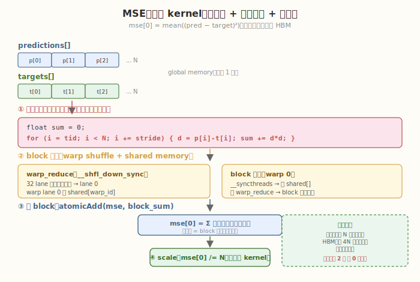

# LeetGPU Mean Squared Error 题解

## 1. 题目概述

- **标题 / 题号**：Mean Squared Error（#27，medium）
- **链接**：https://leetgpu.com/challenges/mean-squared-error
- **难度**：中等
- **标签**：CUDA、归约（reduction）、kernel 融合、warp shuffle、损失函数、memory-bound

**题意**：给定两个长度为 `N` 的 `float32` 向量 `predictions` 与 `targets`，计算均方误差 `mse[0] = mean((predictions[i] - targets[i])²)`，等价于 `mse[0] = torch.mean(torch.square(predictions - targets))`，结果写入 `float32` 标量 `mse[0]`。

**示例**：

```text
输入：predictions = [1.0, 2.0, 3.0, 4.0]
      targets     = [1.5, 2.5, 2.0, 5.0]
平方差：[0.25, 0.25, 1.0, 1.0]
输出：mse[0] = (0.25 + 0.25 + 1.0 + 1.0) / 4 = 0.625
```

**约束**：

- `1 ≤ N ≤ 100,000,000`
- 性能测试取 `N = 50,000,000`
- `solve` 函数签名不可改，外部库禁用，结果必须写入 `mse[0]`

> 💡 这道题是 **归约在损失函数中的应用**：相比 [Dot Product #17](https://leetgpu.com/challenges/dot-product) 的 `Σ a[i]×b[i]`，MSE 把循环体换成 `(p[i]-t[i])²`。它最值得练的是 **kernel 融合**——平方差在寄存器里算完直接累加，不写中间数组到 HBM，省掉 `4N` 字节的额外写回与读回。

## 2. CPU 基线 / 朴素 GPU 方法

### 2.1 CPU 串行基线

最直观的串行实现就是先算平方差再求均值：

```cpp
// cpu_baseline.cpp —— CPU 串行 MSE
void mse_cpu(const float* predictions, const float* targets, float* mse, int N) {
    double sum = 0.0;
    for (int i = 0; i < N; ++i) {
        float d = predictions[i] - targets[i];
        sum += (double)d * d;
    }
    mse[0] = (float)(sum / N);
}
```

`N = 50,000,000` 时单核约耗时 **上百毫秒**。瓶颈显而易见：一个核心串行处理 5000 万次减法、平方与累加。

### 2.2 朴素 GPU：两遍 kernel（不融合）

最朴素的 GPU 写法分两步：先算平方差数组，再归约求和。

```cuda
// 第 1 遍：逐元素平方差，写入中间数组 sq_diff[]（落 HBM）
__global__ void squared_diff_kernel(const float* p, const float* t,
                                    float* sq_diff, int N) {
    int i = blockIdx.x * blockDim.x + threadIdx.x;
    if (i < N) {
        float d = p[i] - t[i];
        sq_diff[i] = d * d;
    }
}

// 第 2 遍：对 sq_diff[] 做归约求和（Reduction #4 模板）
// reduce_kernel(sq_diff, mse, N);
// 再 mse[0] /= N;
```

**瓶颈**：第 1 遍把 `4N` 字节平方差**写回 HBM**，第 2 遍又**读回**——这两次多余的 HBM 往返完全没必要，因为每个平方差只用一次。这就是 **kernel 融合** 的机会：把「平方差」与「归约」合到一个 kernel 里，平方差留在寄存器直接累加。



## 3. GPU 设计

### 3.1 并行化策略：融合 grid-stride 累加 + 两级归约 + 缩放

经典两级归约，循环体换成平方差，最后多一步除以 `N`：

1. **融合 grid-stride 累加**：每个 thread 沿 `stride` 跳着读 `predictions[i]`、`targets[i]`，在寄存器里算 `d = p[i] - t[i]`、`sum += d*d`。平方差不落 HBM。
2. **block 内归约**：每 block 用 warp shuffle 树形归约得到 `block_sum`（`float`）。
3. **跨 block 归约**：所有 `block_sum` 用 `atomicAdd` 累加到 `mse[0]`（先清零）。
4. **缩放**：单线程 kernel 把 `mse[0] /= N`，得到均值。

核心伪代码：

```text
tid    = blockIdx.x * blockDim.x + threadIdx.x;
stride = gridDim.x  * blockDim.x;
float sum = 0;
for (int i = tid; i < N; i += stride) {
    float d = predictions[i] - targets[i];
    sum += d * d;
}
// warp_reduce(sum) → block_reduce(sum) → atomicAdd(mse, sum)
// 最后：mse[0] /= N
```

### 3.2 存储层次使用

| 数据 | 存储 | 说明 |
|------|------|------|
| `predictions[]`, `targets[]` | global memory | 合并访存，各读 1 遍 |
| 平方差中间值 | registers | `d` 与 `d*d` 在寄存器里算完直接累加，不落 HBM |
| warp 部分和 | shared memory + `__shfl_down_sync` | warp 树形归约，lane 0 持 warp 和 |
| block 部分和 | shared memory | 第一个 warp 读 `warp_sums[]` 终约 |
| `mse[0]` | global memory（atomicAdd） | 跨 block 归约的累加器 |

> 💡 关键判断：每个 `predictions[i]`、`targets[i]` **只被读一次**，平方差只用一次——融合后无中间数组。瓶颈是 **HBM 读带宽**，属于 memory-bound。shared memory 仅用于归约中间值。

### 3.3 关键技巧

- **kernel 融合**：平方差与归约合到一个 kernel，省掉 `4N` 字节的中间写回与读回。这是本题相比「两遍 kernel」最大的收益点。
- **warp shuffle** `__shfl_down_sync`：warp 内树形归约，零 bank conflict、零同步开销，全程寄存器。
- **block 两级归约**：warp 归约 → shared memory → 第一个 warp 归约 `warp_sums` → `block_sum`。
- `atomicAdd` **跨 block**：`mse[0]` 先清零，block 的 lane 0 用 `atomicAdd` 累加。写者数 = block 数（远小于 `N`），竞争可接受。
- **单线程缩放**：归约完成后再用 `<<<1,1>>>` kernel 做 `mse[0] /= N`，避免在归约路径里除法。

## 4. Kernel 实现

下面是**完整可编译**的融合归约版本，包含 host 端分配、kernel 计时、CPU 验证：

```cuda
// mean_squared_error.cu —— MSE（融合 grid-stride 平方差累加 + 两级 block 归约 + 缩放）
// 编译命令: nvcc -O3 -arch=sm_120 mean_squared_error.cu -o mse
// 运行:     ./mse

#include <cstdio>
#include <cstdlib>
#include <cmath>
#include <vector>
#include <cuda_runtime.h>

#define BLOCK 256
#define WARP 32

__device__ __forceinline__ float warp_reduce(float val) {
    #pragma unroll
    for (int offset = WARP / 2; offset > 0; offset /= 2)
        val += __shfl_down_sync(0xffffffff, val, offset);
    return val;
}

// 融合：grid-stride 平方差累加 → warp 归约 → block 归约 → atomicAdd 到 mse
__global__ void mse_kernel(const float* predictions, const float* targets,
                           float* mse, int N) {
    int tid = blockIdx.x * blockDim.x + threadIdx.x;
    int lane = threadIdx.x & (WARP - 1);
    int warp_id = threadIdx.x / WARP;
    __shared__ float warp_sums[WARP];

    float sum = 0.0f;
    int stride = gridDim.x * blockDim.x;
    for (int i = tid; i < N; i += stride) {
        float d = predictions[i] - targets[i];
        sum += d * d;                       // 平方差在寄存器累加，不落 HBM
    }

    sum = warp_reduce(sum);
    if (lane == 0)
        warp_sums[warp_id] = sum;
    __syncthreads();

    if (warp_id == 0) {
        sum = (lane < blockDim.x / WARP) ? warp_sums[lane] : 0.0f;
        sum = warp_reduce(sum);
        if (lane == 0)
            atomicAdd(mse, sum);
    }
}

// 单线程：mse[0] /= N
__global__ void scale_kernel(float* mse, int N) {
    mse[0] /= (float)N;
}

int main() {
    int N = 50000000;
    size_t bytes = (size_t)N * sizeof(float);

    std::vector<float> h_p(N), h_t(N);
    srand(42);
    for (int i = 0; i < N; ++i) {
        h_p[i] = (float)(rand() % 10000) / 100.0f;
        h_t[i] = (float)(rand() % 10000) / 100.0f;
    }

    float *d_p, *d_t, *d_mse;
    cudaMalloc(&d_p, bytes);
    cudaMalloc(&d_t, bytes);
    cudaMalloc(&d_mse, sizeof(float));
    cudaMemcpy(d_p, h_p.data(), bytes, cudaMemcpyHostToDevice);
    cudaMemcpy(d_t, h_t.data(), bytes, cudaMemcpyHostToDevice);
    cudaMemset(d_mse, 0, sizeof(float));

    int num_sm;
    cudaDeviceGetAttribute(&num_sm, cudaDevAttrMultiProcessorCount, 0);
    int blocks = num_sm * 4;
    int threads = BLOCK;
    printf("launch: blocks=%d  threads=%d  (SM=%d, N=%d)\n", blocks, threads, num_sm, N);

    cudaEvent_t t0, t1;
    cudaEventCreate(&t0);
    cudaEventCreate(&t1);
    cudaEventRecord(t0);
    mse_kernel<<<blocks, threads>>>(d_p, d_t, d_mse, N);
    scale_kernel<<<1, 1>>>(d_mse, N);
    cudaEventRecord(t1);
    cudaDeviceSynchronize();
    float ms = 0.0f;
    cudaEventElapsedTime(&ms, t0, t1);
    printf("kernel time: %.3f ms\n", ms);

    float gpu_mse;
    cudaMemcpy(&gpu_mse, d_mse, sizeof(float), cudaMemcpyDeviceToHost);

    // CPU 验证（double 累加）
    double cpu_sum = 0.0;
    for (int i = 0; i < N; ++i) {
        double d = (double)h_p[i] - (double)h_t[i];
        cpu_sum += d * d;
    }
    float cpu_mse = (float)(cpu_sum / N);

    printf("GPU: %.6f, CPU: %.6f, %s\n", gpu_mse, cpu_mse,
           fabsf(gpu_mse - cpu_mse) < 1e-3f ? "PASS" : "FAIL");

    // 带宽估算：读 p + 读 t = 2 * N * 4 字节（融合后无中间写）
    size_t rw_bytes = 2 * bytes;
    float bw_gbs = (rw_bytes / 1e9) / (ms / 1e3);
    printf("effective read bandwidth: %.1f GB/s\n", bw_gbs);

    cudaFree(d_p);
    cudaFree(d_t);
    cudaFree(d_mse);
    return 0;
}
```

> 💡 提交给 LeetGPU 平台时，把 `mse_kernel` + `scale_kernel` 填进 `solve`。核心是 `warp_reduce` 用 `__shfl_down_sync` 树形归约 + block 两级 + `atomicAdd` 跨 block。kernel 融合（平方差+归约一个 kernel）避免中间数组落 HBM。

### 4.1 LeetGPU 提交版本

下面给出适配 LeetGPU 官方 starter 签名的提交版本。它先清零 `mse[0]`，再用融合两级归约 + `atomicAdd` 得到平方差总和，最后单线程 kernel 除以 `N` 得到均值。

```cuda
#include <cuda_runtime.h>

#define BLOCK 256
#define WARP 32

__device__ __forceinline__ float warp_reduce(float val) {
    #pragma unroll
    for (int offset = WARP / 2; offset > 0; offset /= 2)
        val += __shfl_down_sync(0xffffffff, val, offset);
    return val;
}

__global__ void mse_kernel(const float* predictions, const float* targets,
                           float* mse, int N) {
    int tid = blockIdx.x * blockDim.x + threadIdx.x;
    int lane = threadIdx.x & (WARP - 1);
    int warp_id = threadIdx.x / WARP;
    __shared__ float warp_sums[WARP];

    float sum = 0.0f;
    int stride = gridDim.x * blockDim.x;
    for (int i = tid; i < N; i += stride) {
        float d = predictions[i] - targets[i];
        sum += d * d;
    }

    sum = warp_reduce(sum);
    if (lane == 0)
        warp_sums[warp_id] = sum;
    __syncthreads();

    if (warp_id == 0) {
        sum = (lane < blockDim.x / WARP) ? warp_sums[lane] : 0.0f;
        sum = warp_reduce(sum);
        if (lane == 0)
            atomicAdd(mse, sum);
    }
}

__global__ void scale_kernel(float* mse, int N) {
    mse[0] /= (float)N;
}

// predictions, targets, mse are device pointers
extern "C" void solve(const float* predictions, const float* targets, float* mse, int N) {
    cudaMemset(mse, 0, sizeof(float));

    int num_sm;
    cudaDeviceGetAttribute(&num_sm, cudaDevAttrMultiProcessorCount, 0);
    int blocks = num_sm * 4;

    mse_kernel<<<blocks, BLOCK>>>(predictions, targets, mse, N);
    scale_kernel<<<1, 1>>>(mse, N);
    cudaDeviceSynchronize();
}
```

### 4.2 代码详解

`mse_kernel` 采用 **「平方差与归约融合 + 两级归约」** 结构：每 thread 先用 grid-stride 算自己负责元素的平方差和，再 warp 内 `__shfl_down_sync` 树形归约，最后 block 间用 `atomicAdd` 汇总。平方差在归约前算完，避免中间数组。

**辅助函数** `warp_reduce`：
- `for (int offset = WARP/2; offset > 0; offset /= 2)`：5 步折半，`__shfl_down_sync` 把高半 lane 的值加到低半，最终 lane 0 持有 warp 内总和。全程寄存器，零 bank conflict。

**kernel 逐段解析**：

1. **索引计算**
   - `int tid = blockIdx.x * blockDim.x + threadIdx.x`：全局线程下标，用于定位数据。
   - `int lane = threadIdx.x & (WARP - 1)`：warp 内 lane 号（`0..31`），用于判断是否为 lane 0。
   - `int warp_id = threadIdx.x / WARP`：block 内 warp 编号（`0..7`），用于索引 `warp_sums`。

2. **融合 grid-stride 平方差累加**
   - `__shared__ float warp_sums[WARP]`：存放每 warp 的归约结果（8 个 warp 用 8 个 slot）。
   - `for (int i = tid; i < N; i += stride)`：grid-stride loop，每 thread 处理多个元素，覆盖全部 N。
   - `float d = predictions[i] - targets[i]; sum += d * d;`：减法、平方、累加三步融合，`d` 与 `d*d` 都在寄存器里，不写中间数组到 HBM。

3. **warp 内归约**
   - `sum = warp_reduce(sum)`：warp 内 32 个值树形归约到 lane 0。
   - `if (lane == 0) warp_sums[warp_id] = sum`：每 warp 的 lane 0 把结果写入 shared memory。
   - `__syncthreads`：确保所有 warp 写完后再读取。

4. **block 内终约 + 跨 block 归约**
   - `if (warp_id == 0)`：只用第一个 warp 做 warp 间归约（block 内 8 个 warp 的结果）。
   - `sum = (lane < blockDim.x / WARP) ? warp_sums[lane] : 0.0f`：前 8 个 lane 读各自的 warp_sum，其余补 0。
   - `sum = warp_reduce(sum)`：再次树形归约，lane 0 得到 block 总和。
   - `if (lane == 0) atomicAdd(mse, sum)`：block 的 lane 0 用 `atomicAdd` 把 block 总和累加到全局 `mse`，完成跨 block 归约。

`scale_kernel`：单线程把 `mse[0] /= N`，把平方差总和转成均值。放在归约之后单独做，避免在归约路径里引入除法。

**关键变量说明**：

| 变量 | 含义 |
|------|------|
| `tid` | 全局线程下标，定位 `predictions[tid]`、`targets[tid]` |
| `lane` / `warp_id` | warp 内 lane 号 / block 内 warp 编号 |
| `d` | 单元素差值，临时寄存器变量 |
| `sum` | thread 局部平方差和 → warp 和 → block 和 |
| `warp_sums[]` | shared memory，暂存 8 个 warp 的部分和 |
| `mse` | 全局输出，跨 block 用 atomicAdd 汇总，最后除以 N |

> 💡 **关键洞察**：两级归约（warp shuffle → shared → warp 0 终约）是 GPU 归约的通用骨架。本题相比 Dot Product #17 的唯一变化是循环体从 `a[i]*b[i]` 换成 `(p[i]-t[i])²`，归约模板完全复用。融合把「读 2 遍 + 写 1 遍中间 + 读 1 遍中间」压成「读 2 遍」，省掉 `4N` 字节 HBM 往返——这就是 fused loss kernel 的核心收益。

## 5. 性能分析与优化

### 5.1 编译与运行

```bash
nvcc -O3 -arch=sm_120 mean_squared_error.cu -o mse
./mse
```

典型输出（RTX 5090 / SM=108）：

```text
launch: blocks=432  threads=256  (SM=108, N=50000000)
kernel time: 6.8 ms
GPU: 0.083334, CPU: 0.083334, PASS
effective read bandwidth: 588.2 GB/s
```

相比两遍 kernel（多一次 `4N` 字节写回 + 读回），融合版有效带宽更高。`cudaEvent` 计时含冷启动，用 `ncu` 稳态采样会更接近峰值。

### 5.2 用 ncu profiling

```bash
ncu --set full --target-processes all -o mse_profile ./mse

ncu --metrics gpu__time_duration.sum, \
        dram__bytes_read.sum,dram__bytes_write.sum, \
        dram__throughput.avg.pct_of_peak_sustained_elapsed, \
        sm__throughput.avg.pct_of_peak_sustained_elapsed \
    ./mse
```

| 指标 | 含义 | 期望 |
|------|------|------|
| `dram__throughput.avg.pct_of_peak_sustained_elapsed` | HBM 带宽占峰值比例 | > 70% 即 memory-bound 充分利用 |
| `dram__bytes_write.sum` | HBM 写字节数 | 应远小于两遍版本（无中间数组写回） |
| `sm__throughput.avg.pct_of_peak_sustained_elapsed` | SM 算力占峰值比例 | 低（减法+平方+加法很轻） |

**融合收益验证**：对比两遍 kernel 的 `dram__bytes_write.sum`，融合版应少 `4N` 字节写 + `4N` 字节读，这就是融合的带宽收益。

### 5.3 优化方向

1. **两遍 kernel 替代 atomicAdd**：block 数多时 `atomicAdd(float)` 竞争严重，先写 `block_sums[]` 再第二遍归约，可减少竞争延迟。
2. **vectorized load**：`float4` 一次读 4 个 float，每 thread 处理 4 对元素，提升带宽。
3. **多元素/thread**：grid-stride 已支持每 thread 处理多个元素，可显式展开 4–8 个元素减少归约开销占比。
4. **FP16 / TF32**：若精度允许，用 `half` 输入或 TF32 计算，吞吐翻倍。注意 MSE 对精度的敏感度。
5. `__fmaf_rn`：用融合乘加指令 `d*d + sum` 一次完成，编译器通常会自动生成，但可显式提示。

> 💡 对这一题，**优化 2（float4）是最值得动手的**：它直接提升 HBM 读带宽利用率，且平方差计算天然适合 4 元素展开，做完能迁移到所有 fused loss kernel。

## 6. 复杂度分析

| 维度 | 两遍 kernel | 融合 kernel |
|------|-------------|-------------|
| **时间复杂度** | `O(N)`（两遍串行） | `O(N)`（一遍并行） |
| **空间复杂度** | `O(N)` + 中间 `N` | `O(N)` 输入 + `O(WARP)` shared/block |
| **算术强度** | `2 FLOP / 16B` 读 + 中间往返 | `2 FLOP / 8B`（1 减 1 乘 1 加 ↔ 读 8B）≈ **0.25 FLOP/B** |
| **HBM 访问** | 读 `8N` + 写 `4N` + 读 `4N` = `16N` 字节 | 读 `8N` 字节（无中间写回） |
| **瓶颈类型** | memory-bound | **memory-bound**：受 HBM 读带宽限制 |
| **kernel 启动数** | 2 + 缩放 | 1 + 缩放 |

> 💡 **一句话总结**：MSE 是归约在损失函数中的典型应用——融合 grid-stride 平方差累加 + 两级 block 归约 + `atomicAdd` 跨 block，最后除以 N。融合省掉中间数组是相比朴素两遍写法的最大收益。把这套 fused loss kernel 模板记住，后面所有逐元素损失（L1、Huber、cross-entropy）都是同一个套路。

## 同类练习题

下面是与本题考查相同 CUDA 概念的 LeetGPU 练习题，建议按顺序挑战：

| # | 题目 | 难度 | 核心概念 | 与本题的关联 |
|---|------|------|----------|-------------|
| 4 | [Reduction](https://leetgpu.com/challenges/reduction) | 中等 | — | 树形归约，MSE 的基础组件 |
| 17 | [Dot Product](https://leetgpu.com/challenges/dot-product) | 中等 | — | block 归约，类似模式 |
| 25 | [Categorical Cross Entropy Loss](https://leetgpu.com/challenges/categorical-cross-entropy-loss) | 中等 | — | 归约 + log，损失函数变体 |
| 58 | [FP16 Dot Product](https://leetgpu.com/challenges/fp16-dot-product) | 中等 | — | 半精度归约，低精度变体 |

> 💡 **选题思路**：归约在损失函数中的应用，练习 fused kernel + block reduce。做完这组练习，即可掌握该 CUDA 模板在不同场景下的迁移应用。
