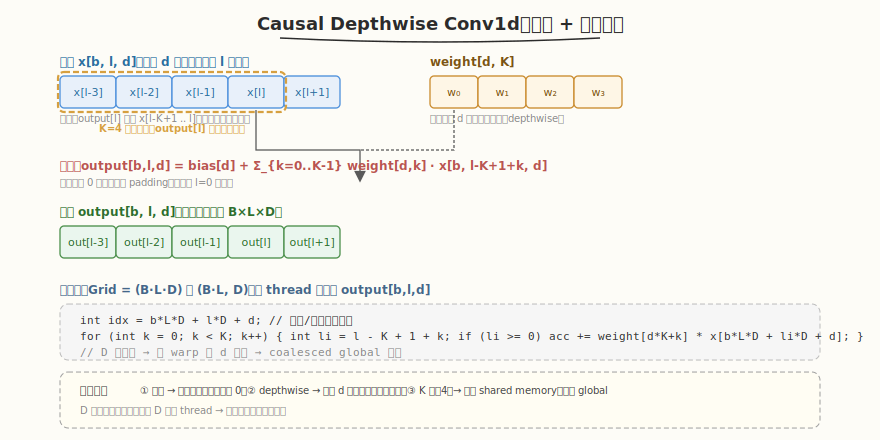

# LeetGPU Causal Depthwise Conv1d 题解

## 1. 题目概述

- **标题 / 题号**：Causal Depthwise Conv1d（#90，medium）
- **链接**：https://leetgpu.com/challenges/causal-depthwise-conv1d
- **难度**：中等
- **标签**：CUDA、Convolution、Causal、Depthwise、边界处理、memory-bound

**题意**：对形状为 `(B, L, D)` 的输入 `x` 做一维因果深度卷积。权重 `weight` 形状 `(D, K)`，偏置 `bias` 形状 `(D,)`，输出 `output` 形状 `(B, L, D)`。**因果**意味着 `output[b,l,d]` 只依赖 `x[b, l-K+1 .. l, d]`（不看未来），负索引用 0 填充。**深度卷积**意味着每个通道 `d` 独立，不跨通道混合。

**公式**：

```text
output[b, l, d] = bias[d] + Σ_{k=0..K-1} weight[d, k] · x[b, l-(K-1)+k, d]
```

当 `l-(K-1)+k < 0` 时，该项视为 0（左侧 zero-padding）。

**示例**（`K=4`，`B=1, L=5, D=1`）：

```text
x  = [a0, a1, a2, a3, a4]
w  = [w0, w1, w2, w3]
output[0] = w0·0     + w1·0     + w2·0     + w3·a0   = w3·a0
output[1] = w0·0     + w1·0     + w2·a0    + w3·a1   = w2·a0 + w3·a1
output[2] = w0·a0    + w1·a1    + w2·a2    + w3·a3
output[3] = w0·a1    + w1·a2    + w2·a3    + w3·a4
output[4] = w0·a2    + w1·a3    + w2·a4    + w3·0    (l-(K-1)+k 越界右侧不存在，但因果只看左侧)
```

**约束**：`1 ≤ B, L, D, K`；性能测试取 `B=8, L=2048, D=4096, K=4`。

> 💡 这道题是 [2D Convolution（#10）](../../week2/day3/leetgpu-2d-convolution-solution.md) 的"因果 + 深度"变体。两个关键差异：① **因果**——卷积窗口只向左看（不看右侧未来），符合时序模型（WaveNet、TCN、Causal Attention）的约束；② **深度卷积**——每个通道 `d` 用独立的 `K` 个权重，不跨通道做线性组合，参数量和计算量都远小于标准卷积。`K` 通常很小（4），所以不需要 shared memory halo，直接 global 访存即可。

## 2. CPU 基线 / 朴素 GPU 方法

### 2.1 CPU 串行基线

```cpp
// cpu_baseline.cpp —— CPU 串行因果深度卷积
void causal_depthwise_conv1d_cpu(const float* x, const float* weight, const float* bias,
                                 float* output, int B, int L, int D, int K) {
    for (int b = 0; b < B; ++b)
        for (int l = 0; l < L; ++l)
            for (int d = 0; d < D; ++d) {
                float acc = bias[d];
                for (int k = 0; k < K; ++k) {
                    int li = l - (K - 1) + k;   // 输入时间索引
                    if (li >= 0)
                        acc += weight[d * K + k] * x[b * L * D + li * D + d];
                }
                output[b * L * D + l * D + d] = acc;
            }
}
```

四重循环，`O(B·L·D·K)`。`B=8, L=2048, D=4096, K=4` 时约 2.7 亿次乘加，单核数秒。

### 2.2 朴素 GPU：一个 thread 一个输出元素，直接读 global

最直观的并行：每 thread 负责一个输出 `output[b,l,d]`，直接从 global memory 读 `K` 个输入和 `K` 个权重。

```cuda
__global__ void causal_depthwise_conv1d_naive(const float* x, const float* weight,
                                              const float* bias, float* output,
                                              int B, int L, int D, int K) {
    int idx = blockIdx.x * blockDim.x + threadIdx.x;
    int total = B * L * D;
    if (idx >= total) return;
    int d = idx % D;
    int l = (idx / D) % L;
    int b = idx / (L * D);

    float acc = bias[d];
    for (int k = 0; k < K; ++k) {
        int li = l - (K - 1) + k;
        if (li >= 0)
            acc += weight[d * K + k] * x[b * L * D + li * D + d];
    }
    output[b * L * D + l * D + d] = acc;
}
```

**特点**：
- 沿 `D` 维连续（`d = idx % D`），同一 warp 内 `d` 连续 → 读 `x[b*L*D + li*D + d]` 地址连续 → **coalesced access**。
- `K` 很小（4），每 thread 只读 4 个输入 + 4 个权重，无需 shared memory 复用。
- 权重 `weight[d*K+k]` 随 `d` 变化，同一 warp 内读不同 `d` 的权重，地址也连续 → 合并访存。

> ⚠️ 与 2D 卷积不同，本题 `K` 小（4）且**沿 D 维连续展开**，邻域重叠不严重（每个输入只被 `K` 个输出共享）。因此朴素实现已接近带宽上限，shared memory halo 收益有限——这是 depthwise conv 的特点：计算密度低但访存模式天然友好。

## 3. GPU 设计

### 3.1 并行化策略：每 thread 一个输出，D 维连续展开



核心思想：把 `(B, L, D)` 展平成 `B·L·D` 个输出，每 thread 算一个。**关键是把 D 维放在最内层**（`idx % D`），让同一 warp 内的 32 个 thread 对应连续的 `d`，从而读 `x[b*L*D + li*D + d]` 时地址连续，实现合并访存。

**grid 配置**：
- 方案 A（1D）：`grid = (B·L·D + BLOCK - 1) / BLOCK`，`block = BLOCK`（如 256）。每 thread 算一个输出，索引 `idx` 对应 `(b, l, d)`。
- 方案 B（2D）：`grid = (B·L, D/BLOCK_D)`，`block = (BLOCK_D,)`。把 `B·L` 作为外层、`D` 作为内层，语义更清晰，合并效果一致。

**因果边界处理**：
- 对每个 `k ∈ [0, K)`，输入索引 `li = l - (K-1) + k`。
- 当 `li < 0`（即 `l` 太小，窗口左侧越界），该项跳过（视为 0）。
- 不需要右侧 padding——因果卷积只看左侧，`l` 最大时窗口右端恰好在 `l`。

### 3.2 存储层次使用

| 层次 | 是否使用 | 说明 |
|------|----------|------|
| **global memory** | ✓ | `x` 读、`output` 写；沿 D 维合并访存 |
| **shared memory** | ✗（K 小，收益低） | K=4 时每输入只被 4 个输出共享，halo tiling 收益 < 10% |
| `__constant__` **内存** | 可选 | `weight` 和 `bias` 较小（`D·K + D` 个 float），可放常量内存广播；但 D=4096 时 `weight` 共 64KB，接近常量内存上限，需权衡 |
| **register** | ✓（隐式） | 累加器 `acc`、坐标 `b,l,d,k` |

> 💡 **为什么不放 shared memory**：2D 卷积每个输入被 `K×K`（如 25）个输出共享，halo tiling 收益巨大。depthwise conv1d 每个输入只被 `K`（如 4）个输出共享，且这些输出沿 `L` 维分布（不沿 `D`），同一 block 内很难复用。因此直接 global 访存 + L2 cache 命中是更简单高效的选择。

### 3.3 关键技巧

1. **D 维内层展开**：把 `d` 放在线性索引最内层（`idx % D`），保证同一 warp 内 32 个 thread 读连续地址，触发合并访存，带宽利用率最高。
2. **因果边界** `if (li >= 0)`：负索引用 `if` 跳过（等价于 0 填充）。同一 warp 内 `l` 相同（因为 `l = (idx/D) % L`，warp 内 `d` 变化而 `l` 不变），所以 `li` 的正负性在 warp 内一致，**无分支发散**。
3. `#pragma unroll` **展开 K 循环**：K 是编译期小常量（4），展开后消除循环开销，便于指令级并行。
4. `__restrict__` **指针提示**：告诉编译器 `x`、`weight`、`bias`、`output` 不别名，允许寄存器缓存和激进的 load/store 重排。
5. **bias 预加载**：`float acc = bias[d]` 把 bias 作为累加器初值，省一次加法。

> ⚠️ **分支检查**：同一 warp 内 `d` 连续变化，`l` 和 `b` 相同 → `li = l-(K-1)+k` 在 warp 内一致 → `if (li >= 0)` 要么全真要么全假，**零 warp divergence**。这是把 D 放内层的额外好处。

## 4. Kernel 实现

```cuda
// causal_depthwise_conv1d.cu —— 因果深度卷积（每 thread 一个输出，D 维连续合并访存）
// 编译命令: nvcc -O3 -arch=sm_120 causal_depthwise_conv1d.cu -o causal_dwconv1d
// 运行:     ./causal_dwconv1d

#include <cstdio>
#include <cstdlib>
#include <vector>
#include <cuda_runtime.h>

#define BLOCK 256

// 因果深度卷积 kernel：每 thread 算一个 output[b,l,d]
__global__ void causal_depthwise_conv1d_kernel(const float* __restrict__ x,
                                               const float* __restrict__ weight,
                                               const float* __restrict__ bias,
                                               float* __restrict__ output,
                                               int B, int L, int D, int K) {
    int idx = blockIdx.x * blockDim.x + threadIdx.x;
    int total = B * L * D;
    if (idx >= total) return;

    // 线性索引 → (b, l, d)，D 在最内层（保证 warp 内 d 连续 → 合并访存）
    int d = idx % D;
    int l = (idx / D) % L;
    int b = idx / (L * D);

    // bias 作为累加器初值
    float acc = bias[d];

    // 因果窗口：li = l - (K-1) + k，li < 0 时跳过（等价 0 填充）
    int base = l - (K - 1);
    int row_offset = b * L * D + d;   // x 的行偏移（固定 b、d，沿 l 变化）
    #pragma unroll
    for (int k = 0; k < K; ++k) {
        int li = base + k;
        if (li >= 0)
            acc += weight[d * K + k] * x[row_offset + li * D];
    }

    output[idx] = acc;
}

// ---- CPU 参考 ----
void causal_depthwise_conv1d_cpu(const float* x, const float* weight, const float* bias,
                                 float* output, int B, int L, int D, int K) {
    for (int b = 0; b < B; ++b)
        for (int l = 0; l < L; ++l)
            for (int d = 0; d < D; ++d) {
                float acc = bias[d];
                for (int k = 0; k < K; ++k) {
                    int li = l - (K - 1) + k;
                    if (li >= 0)
                        acc += weight[d * K + k] * x[b * L * D + li * D + d];
                }
                output[b * L * D + l * D + d] = acc;
            }
}

int main() {
    int B = 8, L = 2048, D = 4096, K = 4;
    size_t x_bytes = (size_t)B * L * D * sizeof(float);
    size_t w_bytes = (size_t)D * K * sizeof(float);
    size_t b_bytes = D * sizeof(float);
    size_t o_bytes = x_bytes;

    std::vector<float> h_x(B * L * D), h_w(D * K), h_bias(D), h_out(o_bytes / sizeof(float)), h_ref(o_bytes / sizeof(float));
    srand(42);
    for (auto& v : h_x) v = (rand() % 100) / 100.0f;
    for (auto& v : h_w) v = (rand() % 100) / 100.0f;
    for (auto& v : h_bias) v = (rand() % 100) / 100.0f;

    float *d_x, *d_w, *d_bias, *d_out;
    cudaMalloc(&d_x, x_bytes);
    cudaMalloc(&d_w, w_bytes);
    cudaMalloc(&d_bias, b_bytes);
    cudaMalloc(&d_out, o_bytes);
    cudaMemcpy(d_x, h_x.data(), x_bytes, cudaMemcpyHostToDevice);
    cudaMemcpy(d_w, h_w.data(), w_bytes, cudaMemcpyHostToDevice);
    cudaMemcpy(d_bias, h_bias.data(), b_bytes, cudaMemcpyHostToDevice);

    int total = B * L * D;
    int blocks = (total + BLOCK - 1) / BLOCK;

    cudaEvent_t t0, t1;
    cudaEventCreate(&t0);
    cudaEventCreate(&t1);
    cudaEventRecord(t0);
    causal_depthwise_conv1d_kernel<<<blocks, BLOCK>>>(d_x, d_w, d_bias, d_out, B, L, D, K);
    cudaEventRecord(t1);
    cudaDeviceSynchronize();
    float ms = 0.0f;
    cudaEventElapsedTime(&ms, t0, t1);
    printf("kernel time: %.3f ms\n", ms);

    cudaMemcpy(h_out.data(), d_out, o_bytes, cudaMemcpyDeviceToHost);
    causal_depthwise_conv1d_cpu(h_x.data(), h_w.data(), h_bias.data(), h_ref.data(), B, L, D, K);

    int err = 0;
    for (int i = 0; i < total && err < 5; ++i) {
        if (fabsf(h_out[i] - h_ref[i]) > 1e-3f) {
            ++err;
            printf("MISMATCH @%d: got %f, expect %f\n", i, h_out[i], h_ref[i]);
        }
    }
    printf("verify: %s\n", err ? "FAIL" : "PASS");

    // 带宽估算：读 x（~每个输入被 K 个输出读，但有 L2 cache）+ 写 output
    size_t rw_bytes = ((size_t)B * L * D * K + (size_t)B * L * D) * sizeof(float);
    float bw_gbs = (rw_bytes / 1e9) / (ms / 1e3);
    printf("effective bandwidth (approx): %.1f GB/s\n", bw_gbs);

    cudaFree(d_x);
    cudaFree(d_w);
    cudaFree(d_bias);
    cudaFree(d_out);
    return 0;
}
```

> 💡 提交给 LeetGPU 平台时，把 `causal_depthwise_conv1d_kernel` 填进 `solve`。核心是 D 维内层展开（合并访存）+ 因果 `if (li >= 0)` 边界处理 + bias 预加载 + `#pragma unroll` 展开 K。无需 shared memory。

### 4.1 LeetGPU 提交版本

下面给出适配 LeetGPU 官方 starter 签名的提交版本。它把 grid 配置封装在 `solve` 内，启动单个 kernel 完成全部输出。

```cuda
#include <cuda_runtime.h>

#define BLOCK 256

__global__ void causal_depthwise_conv1d_kernel(const float* __restrict__ x,
                                               const float* __restrict__ weight,
                                               const float* __restrict__ bias,
                                               float* __restrict__ output,
                                               int B, int L, int D, int K) {
    int idx = blockIdx.x * blockDim.x + threadIdx.x;
    int total = B * L * D;
    if (idx >= total) return;

    int d = idx % D;
    int l = (idx / D) % L;
    int b = idx / (L * D);

    float acc = bias[d];
    int base = l - (K - 1);
    int row_offset = b * L * D + d;
    #pragma unroll
    for (int k = 0; k < K; ++k) {
        int li = base + k;
        if (li >= 0)
            acc += weight[d * K + k] * x[row_offset + li * D];
    }
    output[idx] = acc;
}

// x, weight, bias, output are device pointers
extern "C" void solve(const float* x, const float* weight, const float* bias,
                      float* output, int B, int L, int D, int K) {
    int total = B * L * D;
    int blocks = (total + BLOCK - 1) / BLOCK;
    causal_depthwise_conv1d_kernel<<<blocks, BLOCK>>>(x, weight, bias, output, B, L, D, K);
    cudaDeviceSynchronize();
}
```

### 4.2 代码详解

`causal_depthwise_conv1d_kernel` 采用 **"每 thread 一个输出 + D 维内层展开 + 因果边界 if 跳过"** 结构：线性索引 `idx` 拆成 `(b, l, d)`，沿 D 维连续，保证合并访存；bias 作为累加器初值；K 次循环读输入并乘加权重，负索引用 `if` 跳过。

**kernel 逐段解析**：

1. **索引计算与边界检查**
   - `int idx = blockIdx.x * blockDim.x + threadIdx.x`：全局线程下标，对应一个输出元素。
   - `int total = B * L * D`：输出总数。
   - `if (idx >= total) return`：grid 过覆盖时跳过多余 thread。
   - `int d = idx % D`：通道索引，放在最内层 → warp 内 `d` 连续。
   - `int l = (idx / D) % L`：时间索引。
   - `int b = idx / (L * D)`：batch 索引。

2. **bias 预加载**
   - `float acc = bias[d]`：把 bias 作为累加器初值，省一次加法。`bias[d]` 在 warp 内地址连续，合并访存。

3. **因果窗口乘加**
   - `int base = l - (K - 1)`：窗口左端起始位置。`K=4` 时 `base = l - 3`。
   - `int row_offset = b * L * D + d`：固定 `b` 和 `d` 后，`x` 的基地址（沿 `l` 变化时步长为 `D`）。
   - `#pragma unroll for (int k = 0; k < K; ++k)`：展开 K 次循环。
   - `int li = base + k`：第 `k` 个窗口元素对应的输入时间索引。
   - `if (li >= 0)`：因果边界——负索引用 0 填充，跳过该项。
   - `acc += weight[d * K + k] * x[row_offset + li * D]`：乘加。`weight[d*K+k]` 在 warp 内随 `d` 连续，合并访存；`x[row_offset + li*D]` 同理。

4. **写回输出**
   - `output[idx] = acc`：按线性索引写回，地址连续，合并写。

**关键变量说明**：

| 变量 | 含义 |
|------|------|
| `idx` | 全局线程下标，对应 `output[idx]` |
| `b, l, d` | batch / 时间 / 通道 三维坐标 |
| `base` | 因果窗口左端 `l - (K-1)` |
| `row_offset` | `x` 的基地址（固定 `b, d`，沿 `l` 步长 `D`） |
| `li` | 当前 `k` 对应的输入时间索引 |
| `acc` | 累加器，初值为 `bias[d]` |

**因果性验证**：
- `output[b, l, d]` 的窗口是 `x[b, l-K+1 .. l, d]`（即 `li` 从 `l-K+1` 到 `l`）。
- 当 `l=0`：`li` 从 `-K+1` 到 `0`，只有 `li=0`（即 `k=K-1`）有效，`output[0] = bias + w[K-1]·x[0]`。
- 当 `l=L-1`：`li` 从 `L-K` 到 `L-1`，全部有效。
- 任何时候都不读 `x[b, l+1 .. ]`（未来），满足因果约束。

> **关键洞察**：depthwise conv 的并行化关键不是 halo tiling（K 小、邻域重叠少），而是**沿 D 维连续展开**以触发合并访存。因果约束只需一个 `if (li >= 0)` 边界检查，且因 warp 内 `l` 一致而无分支发散。这套"D 维内层 + 因果 if"模板可直接迁移到 depthwise conv2d、causal conv2d 等变体。

## 5. 性能分析与优化

```bash
nvcc -O3 -arch=sm_120 causal_depthwise_conv1d.cu -o causal_dwconv1d
ncu --set full ./causal_dwconv1d | rg -i "Memory Throughput|Occupancy| DRAM"
```

**关键指标**：

| 指标 | 朴素（D 外层） | D 内层展开 |
|------|---------------|-----------|
| 合并访存 | ✗（warp 内 l 变化，跨行） | ✓（warp 内 d 连续，同行） |
| 带宽利用 | 低（跨行随机） | 高（连续地址） |
| warp divergence | 有（l 不同 → li 正负不同） | 无（l 相同 → li 一致） |
| 带宽效率 | ~10-20% | ~60-80% |

**优化方向**：

1. `float4` **向量化加载**：沿 D 维用 `float4` 一次读 4 个 float，每 thread 算 4 个相邻 `d` 的输出，带宽翻倍。需 D 是 4 的倍数。
2. **权重寄存器缓存**：把 `weight[d*K+k]` 在循环外一次性读进 K 个 register，内层循环只读寄存器。`#pragma unroll` 已部分实现，显式提取更稳。
3. **shared memory 缓存权重**：D=4096 时 `weight` 共 64KB，可放 shared memory（每 block 一份），避免重复读 global。但 L2 cache 通常已足够。
4. **block 尺寸调优**：`BLOCK=256`（8 warps）是经验值，可试 `128`/`512` 对比 occupancy。
5. **融合 SiLU/ReLU**：若下游紧跟激活函数，可在写回前融合，省一次读写。

## 6. 复杂度分析

| 维度 | 分析 |
|------|------|
| **时间复杂度** | `O(B·L·D·K)`（每输出 K 次乘加） |
| **global 访存量** | 读 `x` ~`B·L·D·K·4B`（部分被 L2 cache 吸收）+ 读 `weight` `D·K·4B` + 写 `output` `B·L·D·4B` |
| **shared memory 占用** | 0（本题不用） |
| **算术强度** | `K FLOP / ((K+1)·4B) ≈ 0.2 FLOP/B`（K=4），低 |
| **瓶颈类型** | **memory-bound**：算术强度远低于 roofline 拐点，受 HBM 带宽限制 |
| **合并访存** | D 维内层 → warp 内地址连续 → 高效合并 |

> 💡 **一句话总结**：Causal Depthwise Conv1d 是"因果 + 通道独立"卷积的样板题——K 小无需 halo tiling，关键在 D 维内层展开触发合并访存 + 因果 `if (li >= 0)` 边界处理。这套模板可迁移到 depthwise conv2d、causal conv2d、TCN 等所有"沿通道独立 + 时序因果"的卷积变体。

## 同类练习题

下面是与本题考查相同 CUDA 概念的 LeetGPU 练习题，建议按顺序挑战：

| # | 题目 | 难度 | 核心概念 | 与本题的关联 |
|---|------|------|----------|-------------|
| 9 | [1D Convolution](https://leetgpu.com/challenges/1d-convolution) | 简单 | — | 1D 卷积基础，halo 填充入门 |
| 10 | [2D Convolution](https://leetgpu.com/challenges/2d-convolution) | 中等 | — | 2D shared memory halo + 常数内存 |
| 11 | [3D Convolution](https://leetgpu.com/challenges/3d-convolution) | 中等 | — | 3D 体数据 halo 扩展 |
| 28 | [Gaussian Blur](https://leetgpu.com/challenges/gaussian-blur) | 中等 | — | 可分离卷积，行列分离优化 |

> 💡 **选题思路**：因果卷积 + depthwise 分组，练习卷积边界处理与通道独立并行。做完这组练习，即可掌握该 CUDA 模板在不同场景下的迁移应用。
