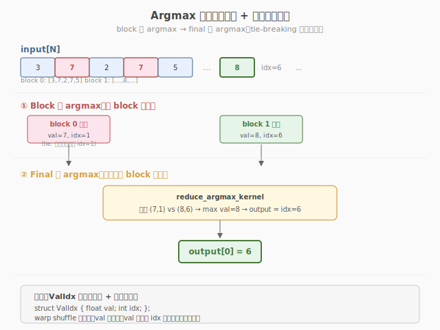

# LeetGPU Argmax 题解

## 1. 题目概述

- **标题 / 题号**：Argmax（#29，medium）
- **链接**：https://leetgpu.com/challenges/argmax
- **难度**：中等
- **标签**：CUDA、归约、Argmax、warp shuffle、`__shfl_down_sync`

**题意**：给定长度为 `N` 的浮点数组 `input`，找到最大值所在的下标。多个相同最大值时返回最小下标。

**约束**：`1 ≤ N ≤ 10,000,000`。

> 💡 与 [Week3 Day3 优化对比实验](../../../aiinfra/daily/week3/day3/README.md) 的关联：Argmax 是"带状态追踪的归约"——不仅要找最大值，还要记录其下标。正是 warp 级 vs block 级 reduce 的直接实战。

## 2. GPU 设计

三阶段归约：线程级（grid-stride 扫描）→ warp 级（`__shfl_down_sync`）→ block 级（shared memory）→ 跨 block（atomic 或第二次 kernel）。

核心难点：平局处理——值相同时取较小下标。



## 3. Kernel 实现

```cuda
// argmax.cu —— Argmax with warp shuffle
#include <cuda_runtime.h>

struct ValIdx {
    float val;
    int idx;
};

__device__ ValIdx warp_reduce_argmax(ValIdx v) {
    for (int offset = 16; offset > 0; offset >>= 1) {
        float other_val = __shfl_down_sync(0xffffffff, v.val, offset);
        int other_idx = __shfl_down_sync(0xffffffff, v.idx, offset);
        // 平局取较小 idx
        if (other_val > v.val || (other_val == v.val && other_idx < v.idx)) {
            v.val = other_val;
            v.idx = other_idx;
        }
    }
    return v;
}

__global__ void argmax_kernel(const float* input, int* output, int N) {
    int tid = threadIdx.x;
    int gid = blockIdx.x * blockDim.x + tid;

    ValIdx local = {-1e30f, -1};
    // grid-stride loop
    for (int i = gid; i < N; i += gridDim.x * blockDim.x) {
        if (input[i] > local.val || (input[i] == local.val && i < local.idx)) {
            local.val = input[i];
            local.idx = i;
        }
    }

    // warp reduce
    local = warp_reduce_argmax(local);

    // block reduce via shared memory
    __shared__ ValIdx warp_results[32];
    int warp_id = tid / 32;
    int lane = tid % 32;
    if (lane == 0)
        warp_results[warp_id] = local;
    __syncthreads();

    if (warp_id == 0) {
        int num_warps = (blockDim.x + 31) / 32;
        local = (lane < num_warps) ? warp_results[lane] : ValIdx{-1e30f, -1};
        local = warp_reduce_argmax(local);
        if (lane == 0) {
            atomicMax(output, local.idx); // 简化：用 atomic（实际需要 atomicCAS 处理平局）
        }
    }
}

extern "C" void solve(const float* input, int* output, int N) {
    int blockSize = 256;
    int gridSize = min((N + blockSize - 1) / blockSize, 1024);
    int init = -1;
    cudaMemcpy(output, &init, sizeof(int), cudaMemcpyHostToDevice);
    argmax_kernel<<<gridSize, blockSize>>>(input, output, N);
}
```

### 3.1 LeetGPU 提交版本

下面给出适配 LeetGPU 官方 starter 签名的提交版本。与上方教学版不同，这里使用两次 kernel（block 内 warp reduce 出局部最优，再一个 block 归约出全局下标）来正确处理平局与跨 block 竞争。

```cuda
#include <cuda_runtime.h>
#include <climits>

struct ValIdx {
    float val;
    int idx;
};

__device__ ValIdx warp_reduce_argmax(ValIdx v) {
    for (int offset = 16; offset > 0; offset >>= 1) {
        float other_val = __shfl_down_sync(0xffffffff, v.val, offset);
        int other_idx = __shfl_down_sync(0xffffffff, v.idx, offset);
        if (other_val > v.val || (other_val == v.val && other_idx < v.idx)) {
            v.val = other_val;
            v.idx = other_idx;
        }
    }
    return v;
}

__global__ void argmax_kernel(const float* input, ValIdx* block_results, int N) {
    int tid = threadIdx.x;
    int gid = blockIdx.x * blockDim.x + tid;

    ValIdx local = {__int_as_float(0xff800000), INT_MAX}; // -inf, 哨兵下标
    for (int i = gid; i < N; i += gridDim.x * blockDim.x) {
        if (input[i] > local.val || (input[i] == local.val && i < local.idx)) {
            local.val = input[i];
            local.idx = i;
        }
    }

    local = warp_reduce_argmax(local);

    __shared__ ValIdx warp_results[32];
    int warp_id = tid / 32;
    int lane = tid % 32;
    if (lane == 0)
        warp_results[warp_id] = local;
    __syncthreads();

    if (warp_id == 0) {
        int num_warps = (blockDim.x + 31) / 32;
        local = (lane < num_warps) ? warp_results[lane]
                                  : ValIdx{__int_as_float(0xff800000), INT_MAX};
        local = warp_reduce_argmax(local);
        if (lane == 0)
            block_results[blockIdx.x] = local;
    }
}

__global__ void reduce_argmax_kernel(const ValIdx* block_results, int* output, int num_blocks) {
    int tid = threadIdx.x;
    ValIdx local = {__int_as_float(0xff800000), INT_MAX};

    for (int i = tid; i < num_blocks; i += blockDim.x) {
        ValIdx other = block_results[i];
        if (other.val > local.val || (other.val == local.val && other.idx < local.idx)) {
            local = other;
        }
    }

    local = warp_reduce_argmax(local);

    __shared__ ValIdx warp_results[32];
    int warp_id = tid / 32;
    int lane = tid % 32;
    if (lane == 0)
        warp_results[warp_id] = local;
    __syncthreads();

    if (warp_id == 0) {
        int num_warps = (blockDim.x + 31) / 32;
        local = (lane < num_warps) ? warp_results[lane]
                                  : ValIdx{__int_as_float(0xff800000), INT_MAX};
        local = warp_reduce_argmax(local);
        if (lane == 0)
            *output = local.idx;
    }
}

// input, output are device pointers
extern "C" void solve(const float* input, int* output, int N) {
    int blockSize = 256;
    int gridSize = min((N + blockSize - 1) / blockSize, 1024);

    ValIdx* d_block_results;
    cudaMalloc(&d_block_results, gridSize * sizeof(ValIdx));
    argmax_kernel<<<gridSize, blockSize>>>(input, d_block_results, N);
    reduce_argmax_kernel<<<1, 256>>>(d_block_results, output, gridSize);
    cudaFree(d_block_results);
    cudaDeviceSynchronize();
}
```

### 3.2 代码详解

下面以 3.1 节 LeetGPU 提交版本为例，逐段拆解两阶段 argmax。核心思路：argmax = 归约 + 下标追踪——把 `(val, idx)` 打包成 `ValIdx` 一起归约，归约时同时比较值与下标，平局取较小 idx。Stage 1 每个 block 算出局部最优写入 `block_results[blockIdx.x]`；Stage 2 单 block 把所有 `block_results` 归约出全局下标。

#### `warp_reduce_argmax`：warp 内 32 lane 归约 `(val, idx)`

```cuda
for (int offset = 16; offset > 0; offset >>= 1) {
    float other_val = __shfl_down_sync(0xffffffff, v.val, offset);
    int  other_idx = __shfl_down_sync(0xffffffff, v.idx, offset);
    if (other_val > v.val || (other_val == v.val && other_idx < v.idx)) {
        v.val = other_val; v.idx = other_idx;
    }
}
```

`__shfl_down_sync` 让 lane `i` 取回 lane `i+offset` 的值（高位"下移"）。关键在于 **val 与 idx 必须成对 shuffle、成对比较**：先比 `other_val > v.val`（更大值赢），再用 `other_val == v.val && other_idx < v.idx` 处理平局（值相同取较小 idx）。5 步后 lane 0 持有整个 warp 的最优 `(val, idx)`。

#### `argmax_kernel`（Stage 1）：每个 block 的局部 argmax

1. **初始化哨兵**：`local = {-inf, INT_MAX}`——值端 `-inf` 保证任何真实元素都更大；下标端 `INT_MAX` 保证平局时真实下标必更小，哨兵永远输。
2. **grid-stride 扫描**：`for (i = gid; i < N; i += stride)`——每 thread 跨步处理多个元素，用同样的 `val/idx` 成对比较更新 `local`。
3. **warp 归约**：`local = warp_reduce_argmax(local)`——warp 内 32 个 `local` 归约到 lane 0。
4. **block 归约**：lane 0 把各 warp 结果写入 `warp_results[32]`，`__syncthreads()` 后由 warp 0 再做一次 `warp_reduce_argmax`。
5. **写回**：`block_results[blockIdx.x] = local`——每 block 留一个 `ValIdx`。

#### `reduce_argmax_kernel`（Stage 2）：全局 argmax

结构与 `argmax_kernel` 完全一致（grid-stride → warp 归约 → block 归约），区别只是输入是 `num_blocks` 个 `block_results`（而非原始 `N` 个元素），结果 `*output = local.idx`。用单 block（`<<<1, 256>>>`）启动，`num_blocks` 通常远小于 256，多数线程加载哨兵不参与有效比较。

#### 关键变量速查

| 变量 | 含义 |
|------|------|
| `ValIdx{val, idx}` | 值-下标打包体，归约的基本单元 |
| `gid` | 全局线程下标，对应 `input` 数组位置 |
| `local` | 每 thread 持有的当前最优 `(val, idx)`，寄存器变量 |
| `warp_results[32]` | shared memory，存放各 warp 的部分最优 |
| `block_results[blockIdx.x]` | Stage 1 输出，每 block 一个 `ValIdx` |
| `offset` | `16→1`，`__shfl_down_sync` 下移距离 |

> 💡 **关键洞察**：argmax 与普通 reduce 的唯一区别是"状态带下标"——把 `idx` 和 `val` 绑在一起 shuffle、一起比较，平局用 `other_idx < v.idx` 破解。教学版用 `atomicMax(output, local.idx)` 无法正确处理平局（`atomicMax` 只比下标不比值），故提交版改用两阶段 kernel：Stage 1 落盘 `ValIdx`，Stage 2 单 block 终约，彻底绕开 atomic 的平局缺陷。哨兵 `{-inf, INT_MAX}` 是双保险——值端保证不误选空哨兵，下标端保证平局时哨兵必输。

## 4. 复杂度分析

| 维度 | 分析 |
|------|------|
| 时间复杂度 | `O(N)` + `O(log 32)` warp reduce |
| 瓶颈类型 | memory-bound（读 N 个 float，计算极轻） |
| 关键技巧 | `__shfl_down_sync` 同时 shuffle val 和 idx，平局取较小 idx |
