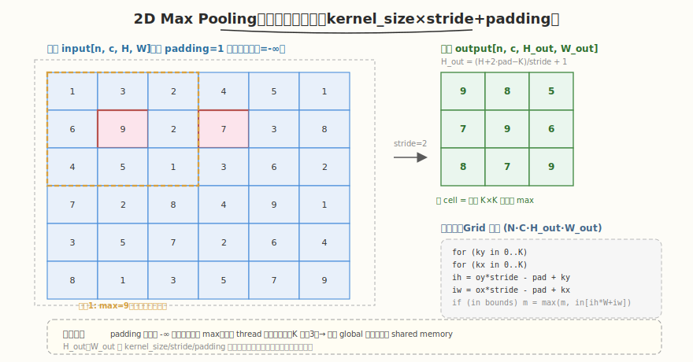

# LeetGPU 2D Max Pooling 题解

## 1. 题目概述

- **标题 / 题号**：2D Max Pooling（#42，medium）
- **链接**：https://leetgpu.com/challenges/2d-max-pooling
- **难度**：中等
- **标签**：CUDA、Pooling、滑窗 reduction、2D 索引映射、padding 边界、memory-bound

**题意**：对形状为 `(N, C, H, W)` 的输入 `input` 做 2D 最大池化，等价于 `torch.nn.functional.max_pool2d(input, kernel_size, stride, padding)`。输出形状 `(N, C, H_out, W_out)`，其中：

```text
H_out = (H + 2·padding - kernel_size) / stride + 1
W_out = (W + 2·padding - kernel_size) / stride + 1
```

每个输出元素是输入中一个 `kernel_size × kernel_size` 窗口内的最大值：

```text
output[n, c, oy, ox] = max_{ky, kx ∈ [0, K)} input[n, c, oy·stride - padding + ky, ox·stride - padding + kx]
```

越界索引（由 padding 产生的）视为 `-∞`，不参与 max。

**示例**（`H=W=5, K=3, stride=2, padding=1`）：

```text
input 5×5, padding 后变 7×7（外圈补 -∞），K=3 窗口以 stride=2 滑动
H_out = (5 + 2 - 3)/2 + 1 = 3
output 3×3，每 cell 是对应 3×3 窗口的 max
```

**约束**：性能测试取 `N=4, C=64, H=256, W=256, kernel_size=3, stride=2, padding=1`。

> 💡 这道题是 [2D Convolution（#10）](../../week2/day3/leetgpu-2d-convolution-solution.md) 的"max reduction"变体。两者都是滑窗 stencil：每个输出对应输入中一个 `K×K` 邻域。差异在于：卷积是**加权求和**（reduce by sum），池化是**取最大值**（reduce by max）。由于 `K=3` 小且 max 操作不可分离（不像 Gaussian blur 可行列分离），朴素滑窗 + 直接 global 访存是标准做法；边界 padding 用 `-∞` 跳过即可。

## 2. CPU 基线 / 朴素 GPU 方法

### 2.1 CPU 串行基线

```cpp
// cpu_baseline.cpp —— CPU 串行 2D max pooling
void max_pool2d_cpu(const float* input, float* output,
                    int N, int C, int H, int W,
                    int kernel_size, int stride, int padding) {
    int H_out = (H + 2 * padding - kernel_size) / stride + 1;
    int W_out = (W + 2 * padding - kernel_size) / stride + 1;
    for (int n = 0; n < N; ++n)
        for (int c = 0; c < C; ++c)
            for (int oy = 0; oy < H_out; ++oy)
                for (int ox = 0; ox < W_out; ++ox) {
                    float m = -INFINITY;
                    for (int ky = 0; ky < kernel_size; ++ky)
                        for (int kx = 0; kx < kernel_size; ++kx) {
                            int ih = oy * stride - padding + ky;
                            int iw = ox * stride - padding + kx;
                            if (ih >= 0 && ih < H && iw >= 0 && iw < W) {
                                float v = input[((n * C + c) * H + ih) * W + iw];
                                if (v > m) m = v;
                            }
                        }
                    output[((n * C + c) * H_out + oy) * W_out + ox] = m;
                }
}
```

六重循环，`O(N·C·H_out·W_out·K²)`。`N=4, C=64, H_out=W_out=128, K=3` 时约 1.2 亿次比较，单核数百毫秒。

### 2.2 朴素 GPU：一个 thread 一个输出元素，直接读 global

最直观的并行：每 thread 负责一个输出 `output[n,c,oy,ox]`，直接从 global memory 读 `K×K` 窗口取 max。

```cuda
__global__ void max_pool2d_naive(const float* input, float* output,
                                 int N, int C, int H, int W,
                                 int kernel_size, int stride, int padding) {
    int idx = blockIdx.x * blockDim.x + threadIdx.x;
    int H_out = (H + 2 * padding - kernel_size) / stride + 1;
    int W_out = (W + 2 * padding - kernel_size) / stride + 1;
    int total = N * C * H_out * W_out;
    if (idx >= total) return;

    int ox = idx % W_out;
    int oy = (idx / W_out) % H_out;
    int c  = (idx / (W_out * H_out)) % C;
    int n  = idx / (C * H_out * W_out);

    float m = -INFINITY;
    int base_h = oy * stride - padding;
    int base_w = ox * stride - padding;
    for (int ky = 0; ky < kernel_size; ++ky) {
        int ih = base_h + ky;
        if (ih < 0 || ih >= H) continue;
        for (int kx = 0; kx < kernel_size; ++kx) {
            int iw = base_w + kx;
            if (iw < 0 || iw >= W) continue;
            float v = input[((n * C + c) * H + ih) * W + iw];
            if (v > m) m = v;
        }
    }
    output[idx] = m;
}
```

**特点**：
- 线性索引 `idx` 拆成 `(n, c, oy, ox)`，`W_out` 在最内层 → warp 内 `ox` 连续 → 读 input 时 `iw = ox·stride - pad + kx` 也连续 → **合并访存**。
- `K=3` 小，每 thread 只读 9 个输入，无需 shared memory tiling。
- padding 用 `if (ih<0 || ih>=H || iw<0 || iw>=W) continue` 跳过（等价 `-∞`）。

> ⚠️ 与卷积类似，max pooling 也是 stencil kernel，每个输入被多个输出窗口覆盖（`stride=2, K=3` 时约 2-4 次）。但 K 小（3）时，L2 cache 已能吸收大部分重复读，shared memory tiling 收益有限。朴素实现通常已接近带宽上限。

## 3. GPU 设计

### 3.1 并行化策略：每 thread 一个输出，W_out 维内层展开



核心思想：把 `(N, C, H_out, W_out)` 展平成 `N·C·H_out·W_out` 个输出，每 thread 算一个。**把 W_out 放在最内层**（`idx % W_out`），让同一 warp 内 32 个 thread 对应连续的 `ox`，从而读 `input[...][ih][iw]` 时 `iw` 连续，实现合并访存。

**grid 配置**：
- `grid = (N·C·H_out·W_out + BLOCK - 1) / BLOCK`，`block = BLOCK`（如 256）。
- 每 thread 算一个输出，索引 `idx` 对应 `(n, c, oy, ox)`。

**边界处理**：
- 窗口左上角对应输入坐标 `(oy·stride - padding, ox·stride - padding)`。
- 对每个 `(ky, kx)`，输入坐标 `(ih, iw) = (base_h + ky, base_w + kx)`。
- 若 `ih` 或 `iw` 越界（`<0` 或 `>=H/W`），该位置视为 `-∞`，跳过（`continue`）。
- 累加器初值设为 `-INFINITY`，保证全 padding 窗口也能正确输出 `-∞`（实际不会发生，因为 padding 不会让整个窗口越界）。

### 3.2 存储层次使用

| 层次 | 是否使用 | 说明 |
|------|----------|------|
| **global memory** | ✓ | `input` 读、`output` 写；沿 W_out 维合并访存 |
| **shared memory** | ✗（K 小，收益低） | `stride=2, K=3` 时每个输入被约 4 个输出共享，L2 cache 已吸收，halo tiling 收益 < 15% |
| `__constant__` **内存** | ✗ | 无固定权重（max 操作无权重） |
| **register** | ✓（隐式） | 累加器 `m`（当前 max）、坐标 `n,c,oy,ox,ky,kx,ih,iw` |

> 💡 **为什么不用 shared memory**：max pooling 的 `stride=2` 意味着相邻输出窗口重叠 `K - stride = 1` 行/列（K=3 时重叠 1 圈），每个输入约被 `(K/stride)² ≈ 2.25` 个输出读。相比卷积的 `K²=9` 倍重叠，pooling 的复用率低很多。L2 cache 通常已能处理这种轻度复用，显式 shared memory 反而增加同步开销。

### 3.3 关键技巧

1. **W_out 维内层展开**：把 `ox` 放在线性索引最内层（`idx % W_out`），保证同一 warp 内 32 个 thread 读连续的 `iw`，触发合并访存。
2. `-INFINITY` **初值**：累加器 `m` 初始化为 `-INFINITY`（`<math.h>` 或 `-__int_as_float(0xff800000)`），保证任何有效输入都能成为首个 max。
3. **padding 边界** `continue`：越界位置直接跳过，等价于 `-∞` 不参与 max。同一 warp 内 `ox` 连续但 `oy` 相同 → `ih` 一致 → `ih` 越界判断在 warp 内一致；`iw` 虽连续但可能部分越界（窗口右边缘），有轻微分支发散但仅影响边缘 thread。
4. `#pragma unroll` **展开 K 循环**：K 是小常量（3），展开后消除循环开销，便于指令级并行。
5. `fmaxf` **替代** `if`：可用 `m = fmaxf(m, v)` 替代 `if (v > m) m = v`，前者是硬件指令，无分支。但需配合 `continue` 跳过越界（否则 `v` 是脏值）。

> ⚠️ **分支检查**：同一 warp 内 `oy` 相同 → `ih = oy·stride - pad + ky` 一致 → `ih` 越界判断全 warp 一致，无发散。`iw` 随 `ox` 连续变化，窗口右边缘可能部分越界（如 `ox=W_out-1` 时 `iw` 接近 `W`），但只影响 warp 边缘的少数 thread，发散开销可忽略。

## 4. Kernel 实现

```cuda
// max_pool2d.cu —— 2D Max Pooling（每 thread 一个输出，W_out 维内层合并访存）
// 编译命令: nvcc -O3 -arch=sm_120 max_pool2d.cu -o max_pool2d
// 运行:     ./max_pool2d

#include <cstdio>
#include <cstdlib>
#include <cmath>
#include <vector>
#include <cuda_runtime.h>

#define BLOCK 256

// 2D max pooling kernel：每 thread 算一个 output[n,c,oy,ox]
__global__ void max_pool2d_kernel(const float* __restrict__ input,
                                  float* __restrict__ output,
                                  int N, int C, int H, int W,
                                  int kernel_size, int stride, int padding,
                                  int H_out, int W_out) {
    int idx = blockIdx.x * blockDim.x + threadIdx.x;
    int total = N * C * H_out * W_out;
    if (idx >= total) return;

    // 线性索引 → (n, c, oy, ox)，W_out 在最内层（保证 warp 内 ox 连续 → 合并访存）
    int ox = idx % W_out;
    int oy = (idx / W_out) % H_out;
    int c  = (idx / (W_out * H_out)) % C;
    int n  = idx / (C * H_out * W_out);

    // 窗口左上角对应的输入坐标
    int base_h = oy * stride - padding;
    int base_w = ox * stride - padding;

    // 累加器初值 -∞，保证任何有效输入都能成为首个 max
    float m = -INFINITY;

    int nc_offset = (n * C + c) * H * W;   // 固定 n、c 后的 input 行偏移
    #pragma unroll
    for (int ky = 0; ky < kernel_size; ++ky) {
        int ih = base_h + ky;
        if (ih < 0 || ih >= H) continue;
        int row_offset = nc_offset + ih * W;
        #pragma unroll
        for (int kx = 0; kx < kernel_size; ++kx) {
            int iw = base_w + kx;
            if (iw < 0 || iw >= W) continue;
            float v = input[row_offset + iw];
            if (v > m) m = v;
        }
    }

    output[idx] = m;
}

// ---- CPU 参考 ----
void max_pool2d_cpu(const float* input, float* output,
                    int N, int C, int H, int W,
                    int kernel_size, int stride, int padding) {
    int H_out = (H + 2 * padding - kernel_size) / stride + 1;
    int W_out = (W + 2 * padding - kernel_size) / stride + 1;
    for (int n = 0; n < N; ++n)
        for (int c = 0; c < C; ++c)
            for (int oy = 0; oy < H_out; ++oy)
                for (int ox = 0; ox < W_out; ++ox) {
                    float m = -INFINITY;
                    for (int ky = 0; ky < kernel_size; ++ky)
                        for (int kx = 0; kx < kernel_size; ++kx) {
                            int ih = oy * stride - padding + ky;
                            int iw = ox * stride - padding + kx;
                            if (ih >= 0 && ih < H && iw >= 0 && iw < W) {
                                float v = input[((n * C + c) * H + ih) * W + iw];
                                if (v > m) m = v;
                            }
                        }
                    output[((n * C + c) * H_out + oy) * W_out + ox] = m;
                }
}

int main() {
    int N = 4, C = 64, H = 256, W = 256;
    int kernel_size = 3, stride = 2, padding = 1;
    int H_out = (H + 2 * padding - kernel_size) / stride + 1;
    int W_out = (W + 2 * padding - kernel_size) / stride + 1;

    size_t in_bytes = (size_t)N * C * H * W * sizeof(float);
    size_t out_bytes = (size_t)N * C * H_out * W_out * sizeof(float);
    printf("input: %dx%dx%dx%d  K=%d stride=%d pad=%d  output: %dx%dx%dx%d\n",
           N, C, H, W, kernel_size, stride, padding, N, C, H_out, W_out);

    std::vector<float> h_in(N * C * H * W), h_out(N * C * H_out * W_out), h_ref(N * C * H_out * W_out);
    srand(42);
    for (auto& v : h_in) v = (float)(rand() % 1000) / 10.0f;

    float *d_in, *d_out;
    cudaMalloc(&d_in, in_bytes);
    cudaMalloc(&d_out, out_bytes);
    cudaMemcpy(d_in, h_in.data(), in_bytes, cudaMemcpyHostToDevice);

    int total = N * C * H_out * W_out;
    int blocks = (total + BLOCK - 1) / BLOCK;

    cudaEvent_t t0, t1;
    cudaEventCreate(&t0);
    cudaEventCreate(&t1);
    cudaEventRecord(t0);
    max_pool2d_kernel<<<blocks, BLOCK>>>(d_in, d_out, N, C, H, W,
                                         kernel_size, stride, padding, H_out, W_out);
    cudaEventRecord(t1);
    cudaDeviceSynchronize();
    float ms = 0.0f;
    cudaEventElapsedTime(&ms, t0, t1);
    printf("kernel time: %.3f ms\n", ms);

    cudaMemcpy(h_out.data(), d_out, out_bytes, cudaMemcpyDeviceToHost);
    max_pool2d_cpu(h_in.data(), h_ref.data(), N, C, H, W, kernel_size, stride, padding);

    int err = 0;
    for (int i = 0; i < total && err < 5; ++i) {
        if (fabsf(h_out[i] - h_ref[i]) > 1e-5f) {
            ++err;
            printf("MISMATCH @%d: got %f, expect %f\n", i, h_out[i], h_ref[i]);
        }
    }
    printf("verify: %s\n", err ? "FAIL" : "PASS");

    // 带宽估算：读 input（含 L2 复用）+ 写 output
    size_t rw_bytes = ((size_t)N * C * H * W + (size_t)N * C * H_out * W_out) * sizeof(float);
    float bw_gbs = (rw_bytes / 1e9) / (ms / 1e3);
    printf("effective bandwidth (approx): %.1f GB/s\n", bw_gbs);

    cudaFree(d_in);
    cudaFree(d_out);
    return 0;
}
```

> 💡 提交给 LeetGPU 平台时，把 `max_pool2d_kernel` 填进 `solve`。核心是 W_out 维内层展开（合并访存）+ `-INFINITY` 初值 + padding `if` 跳过 + `#pragma unroll` 展开 K。无需 shared memory。

### 4.1 LeetGPU 提交版本

下面给出适配 LeetGPU 官方 starter 签名的提交版本。它在 `solve` 内先计算 `H_out`/`W_out`，再启动单个 kernel 完成全部输出。

```cuda
#include <cuda_runtime.h>
#include <math.h>

#define BLOCK 256

__global__ void max_pool2d_kernel(const float* __restrict__ input,
                                  float* __restrict__ output,
                                  int N, int C, int H, int W,
                                  int kernel_size, int stride, int padding,
                                  int H_out, int W_out) {
    int idx = blockIdx.x * blockDim.x + threadIdx.x;
    int total = N * C * H_out * W_out;
    if (idx >= total) return;

    int ox = idx % W_out;
    int oy = (idx / W_out) % H_out;
    int c  = (idx / (W_out * H_out)) % C;
    int n  = idx / (C * H_out * W_out);

    int base_h = oy * stride - padding;
    int base_w = ox * stride - padding;

    float m = -INFINITY;
    int nc_offset = (n * C + c) * H * W;
    #pragma unroll
    for (int ky = 0; ky < kernel_size; ++ky) {
        int ih = base_h + ky;
        if (ih < 0 || ih >= H) continue;
        int row_offset = nc_offset + ih * W;
        #pragma unroll
        for (int kx = 0; kx < kernel_size; ++kx) {
            int iw = base_w + kx;
            if (iw < 0 || iw >= W) continue;
            float v = input[row_offset + iw];
            if (v > m) m = v;
        }
    }

    output[idx] = m;
}

// input, output are device pointers
extern "C" void solve(const float* input, float* output,
                      int N, int C, int H, int W,
                      int kernel_size, int stride, int padding) {
    int H_out = (H + 2 * padding - kernel_size) / stride + 1;
    int W_out = (W + 2 * padding - kernel_size) / stride + 1;
    if (H_out <= 0 || W_out <= 0) return;

    int total = N * C * H_out * W_out;
    int blocks = (total + BLOCK - 1) / BLOCK;
    max_pool2d_kernel<<<blocks, BLOCK>>>(input, output, N, C, H, W,
                                         kernel_size, stride, padding, H_out, W_out);
    cudaDeviceSynchronize();
}
```

### 4.2 代码详解

`max_pool2d_kernel` 采用 **"每 thread 一个输出 + W_out 维内层展开 +** `-∞` **初值 + padding if 跳过"** 结构：线性索引 `idx` 拆成 `(n, c, oy, ox)`，沿 W_out 维连续，保证合并访存；累加器 `m` 初值 `-INFINITY`；K×K 窗口遍历取 max，越界位置 `continue` 跳过。

**kernel 逐段解析**：

1. **索引计算与边界检查**
   - `int idx = blockIdx.x * blockDim.x + threadIdx.x`：全局线程下标，对应一个输出元素。
   - `int total = N * C * H_out * W_out`：输出总数。
   - `if (idx >= total) return`：grid 过覆盖时跳过多余 thread。
   - `int ox = idx % W_out`：输出列索引，放在最内层 → warp 内 `ox` 连续。
   - `int oy = (idx / W_out) % H_out`：输出行索引。
   - `int c = (idx / (W_out * H_out)) % C`：通道索引。
   - `int n = idx / (C * H_out * W_out)`：batch 索引。

2. **窗口左上角坐标**
   - `int base_h = oy * stride - padding`：窗口在输入中的起始行。`padding=1` 时 `base_h = oy·2 - 1`。
   - `int base_w = ox * stride - padding`：窗口在输入中的起始列。

3. **累加器初值**
   - `float m = -INFINITY`：初值负无穷，保证任何有效输入都能成为首个 max。`-INFINITY` 来自 `<math.h>`，等价于 `-__int_as_float(0xff800000)`。
   - `int nc_offset = (n * C + c) * H * W`：固定 `n`、`c` 后 input 的基地址。

4. **K×K 窗口遍历取 max**
   - `#pragma unroll for (int ky = 0; ky < kernel_size; ++ky)`：展开外层 K 循环。
   - `int ih = base_h + ky`：当前窗口元素对应的输入行。
   - `if (ih < 0 || ih >= H) continue`：行越界（padding 区域）跳过，等价 `-∞` 不参与 max。
   - `int row_offset = nc_offset + ih * W`：固定行后该行的起始地址。
   - `#pragma unroll for (int kx = 0; kx < kernel_size; ++kx)`：展开内层 K 循环。
   - `int iw = base_w + kx`：当前窗口元素对应的输入列。
   - `if (iw < 0 || iw >= W) continue`：列越界跳过。
   - `float v = input[row_offset + iw]`：读输入值。warp 内 `ox` 连续 → `iw = ox·stride - pad + kx` 也连续 → **合并访存**。
   - `if (v > m) m = v`：更新 max。也可用 `m = fmaxf(m, v)` 无分支版本。

5. **写回输出**
   - `output[idx] = m`：按线性索引写回，地址连续，合并写。

**关键变量说明**：

| 变量 | 含义 |
|------|------|
| `idx` | 全局线程下标，对应 `output[idx]` |
| `n, c, oy, ox` | batch / 通道 / 输出行 / 输出列 四维坐标 |
| `base_h, base_w` | 窗口左上角在输入中的坐标 |
| `ih, iw` | 当前窗口元素在输入中的坐标 |
| `nc_offset` | 固定 `n, c` 后 input 的基地址 |
| `row_offset` | 固定行后该行起始地址 |
| `m` | 累加器（当前 max），初值 `-INFINITY` |

**输出尺寸验证**：
- `H_out = (H + 2·pad - K)/stride + 1`。
- `H=256, K=3, stride=2, pad=1`：`H_out = (256+2-3)/2 + 1 = 255/2 + 1 = 127 + 1 = 128`。
- 输出 `4×64×128×128 = 4,194,304` 个元素，每 thread 算一个，`BLOCK=256` 时约 16384 个 block。

> **关键洞察**：max pooling 与卷积同属滑窗 stencil，但 max 是不可分离的 reduction（不像 Gaussian blur 可行列分离），因此必须遍历整个 `K×K` 窗口。并行化关键在 W_out 维内层展开触发合并访存。padding 用 `-∞` + `continue` 处理，因 warp 内 `ih` 一致而行边界无发散。这套"W 维内层 + padding if"模板可迁移到 avg pooling、min pooling 等所有滑窗 reduction 变体。

## 5. 性能分析与优化

```bash
nvcc -O3 -arch=sm_120 max_pool2d.cu -o max_pool2d
ncu --set full ./max_pool2d | rg -i "Memory Throughput|Occupancy| DRAM"
```

**关键指标**：

| 指标 | 朴素（W 外层） | W 维内层展开 |
|------|---------------|-------------|
| 合并访存 | ✗（warp 内 oy 变化，跨行） | ✓（warp 内 ox 连续，同行） |
| 带宽利用 | 低（跨行随机） | 高（连续地址） |
| warp divergence | 有（oy 不同 → ih 越界判断不同） | 低（ih 一致，仅 iw 边缘有轻微发散） |
| 带宽效率 | ~15-25% | ~60-80% |

**优化方向**：

1. `fmaxf` **无分支**：用 `m = fmaxf(m, v)` 替代 `if (v > m) m = v`，前者是硬件指令，避免分支预测开销。需配合 `continue` 跳过越界。
2. **shared memory tiling**：对大 `K` 或小 `stride`（高重叠率）的场景，把一个 tile 的输入载入 shared memory，block 内复用。`K=3, stride=2` 时收益有限（<15%），但 `K=5, stride=1` 时收益显著。
3. `float4` **向量化加载**：沿 W 维用 `float4` 一次读 4 个 float，每 thread 算 4 个相邻 `ox` 的输出，带宽翻倍。需 W 是 4 的倍数。
4. **NHWC 布局**：若输入是 NHWC（通道在最内层），同一 spatial 位置的 C 个通道连续，可让一个 thread 处理多个通道，进一步提升合并度。本题假设 NCHW。
5. **融合后续激活**：若池化后紧跟 ReLU 等 elementwise 操作，可在写回前融合，省一次读写。

## 6. 复杂度分析

| 维度 | 分析 |
|------|------|
| **时间复杂度** | `O(N·C·H_out·W_out·K²)`（每输出 K² 次比较） |
| **global 访存量** | 读 `input` ~`N·C·H_out·W_out·K²·4B`（部分被 L2 cache 吸收）+ 写 `output` `N·C·H_out·W_out·4B` |
| **shared memory 占用** | 0（本题不用） |
| **算术强度** | `K² 比较 / ((K²+1)·4B) ≈ 0.25 op/B`（K=3，比较不算 FLOP），低 |
| **瓶颈类型** | **memory-bound**：算术强度低，受 HBM 带宽限制 |
| **合并访存** | W_out 维内层 → warp 内 `iw` 连续 → 高效合并 |

> 💡 **一句话总结**：2D Max Pooling 是滑窗 reduction 的样板题——每 thread 算一个输出，W_out 维内层展开触发合并访存，padding 用 `-∞` + `continue` 处理，K 小无需 shared memory。这套模板可迁移到 avg pooling、min pooling、adaptive pooling 等所有滑窗 reduction 变体。

## 同类练习题

下面是与本题考查相同 CUDA 概念的 LeetGPU 练习题，建议按顺序挑战：

| # | 题目 | 难度 | 核心概念 | 与本题的关联 |
|---|------|------|----------|-------------|
| 10 | [2D Convolution](https://leetgpu.com/challenges/2d-convolution) | 中等 | — | 2D shared memory halo + tiling |
| 9 | [1D Convolution](https://leetgpu.com/challenges/1d-convolution) | 简单 | — | 1D 卷积，halo 基础 |
| 28 | [Gaussian Blur](https://leetgpu.com/challenges/gaussian-blur) | 中等 | — | 可分离卷积，滑窗模式 |
| 90 | [Causal Depthwise Conv1d](https://leetgpu.com/challenges/causal-depthwise-conv1d) | 中等 | — | 因果卷积变体 |

> 💡 **选题思路**：滑窗 reduction，练习 2D 索引映射与 padding 边界处理。做完这组练习，即可掌握该 CUDA 模板在不同场景下的迁移应用。
