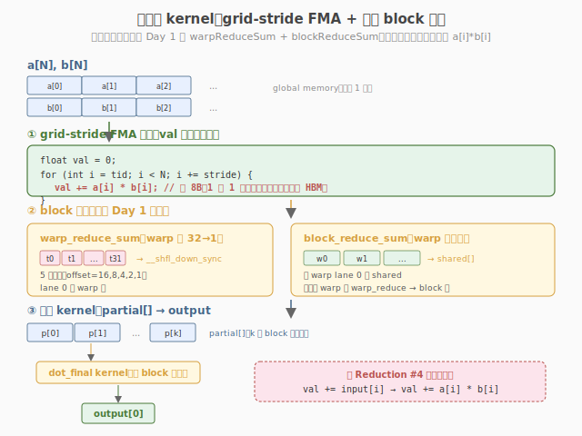

# LeetGPU RMS Normalization 题解

## 1. 题目概述

- **标题 / 题号**：RMS Normalization（#50，medium）
- **链接**：https://leetgpu.com/challenges/rms-normalization
- **难度**：中等
- **标签**：CUDA、normalization、reduction、RMSNorm、memory-bound、warp shuffle、Llama

**题意**：给定 `M` 行 `D` 列的 `float32` 矩阵 `x`（行主序）和权重 `gamma ∈ R^D`，对**每一行独立**做 RMS 归一化：

$$\text{RMS}(x) = \sqrt{\frac{1}{D}\sum_{j=0}^{D-1} x_j^2 + \epsilon}, \qquad y_i = \frac{x_i}{\text{RMS}(x)} \cdot \gamma_i$$

**示例**（单行 `D=4`，`eps=1e-5`，`gamma=1`）：

```text
输入：    [1.0, 2.0, 3.0, 4.0]
sum_sq  = 1 + 4 + 9 + 16 = 30
mean_sq = 30 / 4 = 7.5
RMS     = sqrt(7.5 + 1e-5) = 2.7386
1/RMS   = 0.3651
output  = [0.3651, 0.7303, 1.0954, 1.4606]   // 每元素 = x_i * (1/RMS) * gamma_i
```

**约束**：

- `1 ≤ M × D ≤ 1,000,000`（总元素数）
- 元素范围 `[-10.0, 10.0]`
- 容差 `atol = rtol = 1e-4`
- 性能测试取较大 `M×D`（如 `M=128, D=8192`）

> 💡 RMSNorm 是 **Llama / T5 / Gopher** 等现代大模型替代 LayerNorm 的首选归一化层。它和 [Day 2 Softmax](../../leetgpu/week2/day4/leetgpu-softmax-solution.md) 一样是"归约 + 归一化"组合，但**只做一次归约**（sum of squares），比 LayerNorm 的两次（mean + variance）更省。本题是练习"单次块归约 + elementwise"的经典模板，也是 Day 20 端到端 Profiling 的完美 memory-bound 靶点。

## 2. CPU 基线 / 朴素 GPU 方法

### 2.1 CPU 串行基线

```cpp
// cpu_baseline.cpp —— CPU 串行 RMSNorm
void rmsnorm_cpu(const float* x, const float* gamma, float* y, int M, int D, float eps) {
    for (int r = 0; r < M; ++r) {
        const float* xr = x + r * D;
        float* yr = y + r * D;
        // ① 求 sum of squares
        float sq = 0.0f;
        for (int i = 0; i < D; ++i)
            sq += xr[i] * xr[i];
        // ② RMS = sqrt(mean(sq) + eps)，rrms = 1/RMS
        float rrms = 1.0f / sqrtf(sq / D + eps);
        // ③ 归一化 + affine
        for (int i = 0; i < D; ++i)
            yr[i] = xr[i] * rrms * gamma[i];
    }
}
```

每行两遍扫描 `O(D)`，总计 `O(M×D)`。`M=128, D=8192` 时单核约 0.5-1ms。

### 2.2 朴素 GPU：每 thread 算一个元素（错误示范）

```cuda
// 错误示范：每 thread 独立扫整行求 sum_sq → O(D²)，D=8192 时每 thread 重复读 8192 次
__global__ void rmsnorm_wrong(const float* x, const float* gamma, float* y, int M, int D, float eps) {
    int r = blockIdx.x;
    int i = threadIdx.x;
    if (i >= D)
        return;
    float sq = 0.0f;
    for (int j = 0; j < D; ++j)
        sq += x[r * D + j] * x[r * D + j]; // 重复！
    float rrms = 1.0f / sqrtf(sq / D + eps);
    y[r * D + i] = x[r * D + i] * rrms * gamma[i];
}
```

> ⚠️ RMSNorm 的核心难点和 Softmax 一样：**它是"一次归约（sum of squares）+ 一次依赖归约结果的归一化"**，必须用**块内协作**——一个 block 的线程共同求 sum_sq，再一起写输出。每 thread 独立扫整行会导致 `O(D²)` 重复读。

## 3. GPU 设计

### 3.1 并行化策略：一个 block 负责一行

**核心映射**：`blockIdx.x → 行号 r`，block 内 `BLOCK_SIZE` 个 thread 协作处理该行的 `D` 个元素。


每个 block 执行两阶段：
1. **Pass 1（求 sum of squares）**：thread 各自用 grid-stride 扫描行内元素累加 `x²` → 块归约得到 `row_sq`
2. **Pass 2（归一化）**：再扫一遍写 `y[i] = x[i] · rsqrt(row_sq/D + eps) · gamma[i]`

> 💡 为什么 RMSNorm 比 LayerNorm 快？LayerNorm 需要**两次归约**（先 mean，再 variance，且 variance 依赖 mean）；RMSNorm **省掉了 mean**——直接对 `x²` 求和，方差退化为 `mean(x²)`，只需**一次归约**。这让它少一遍 HBM 读，是 Llama 选它替代 LayerNorm 的性能原因之一（另一个是去掉均值偏移后效果相当）。

### 3.2 存储层次使用

| 层次 | 是否使用 | 说明 |
|------|----------|------|
| **global memory** | ✓ | `x` 读（2 遍）、`gamma` 读（1 遍）、`y` 写（1 遍） |
| **shared memory** | ✓ | warp 间归约汇总：`shared[NUM_WARPS]`，及广播 `rrms` |
| **register** | ✓ | 每线程的 `local_sq` 累加值 + warp shuffle 交换 |

### 3.3 关键技巧 1：单次块归约（复用 Day 4 模板）

RMSNorm 只需一次 sum 归约。直接复用 [Day 4 Reduction](../../leetgpu/week1/day5/leetgpu-reduction-solution.md) 的 `warp_reduce_sum` + `block_reduce_sum` 模板：



- **warp 内**：`__shfl_down_sync` 折半累加到 lane 0
- **warp 间**：每 warp lane 0 写 shared → 第一个 warp 再归约
- **广播**：`rrms = rsqrtf(row_sq / D + eps)` 写 `shared[0]`，`__syncthreads` 后全 block 读取

> 💡 对比 [Day 2 Softmax](../../leetgpu/week2/day4/leetgpu-softmax-solution.md) 的**两次块归约**（max + sum），RMSNorm 只需**一次**。这是它比 LayerNorm/Softmax 更省 HBM 读的根本原因——归约次数直接决定 global memory 读取遍数。

### 3.4 关键技巧 2：数值稳定性

`rsqrtf(mean(x²) + eps)` 中的 `eps` 防止 `x` 全零时除零。和 LayerNorm 一样用 `1e-5`。注意用 `rsqrtf`（`1/sqrtf`）而不是 `sqrtf` + 除法——前者是一条硬件指令，更快且精度足够。

## 4. Kernel 实现

完整可编译的 RMSNorm（一个 block 一行 + warp shuffle 块归约 + 单次 reduce）：

```cuda
// rmsnorm.cu —— RMSNorm：一次 reduce（sum of squares）+ 归一化
// 编译命令: nvcc -O3 -arch=sm_120 rmsnorm.cu -o rmsnorm -lineinfo
// 运行:     ./rmsnorm 128 8192

#include <cstdio>
#include <cstdlib>
#include <cmath>
#include <cuda_runtime.h>

#define BLOCK_SIZE 256
#define WARP_SIZE 32
#define NUM_WARPS (BLOCK_SIZE / WARP_SIZE) // 8

// ---- warp 级归约：sum（复用 Day 4 模板）----
__inline__ __device__ float warp_reduce_sum(float val) {
    #pragma unroll
    for (int offset = WARP_SIZE / 2; offset > 0; offset >>= 1)
        val += __shfl_down_sync(0xffffffff, val, offset);
    return val;
}

// ---- block 级归约：warp shuffle + shared 汇总 + 广播 ----
__inline__ __device__ float block_reduce_sum(float val, float* shared) {
    int lane = threadIdx.x & (WARP_SIZE - 1);
    int warpId = threadIdx.x >> 5;

    val = warp_reduce_sum(val);
    if (lane == 0)
        shared[warpId] = val;
    __syncthreads();

    if (warpId == 0) {
        val = (lane < NUM_WARPS) ? shared[lane] : 0.0f;
        val = warp_reduce_sum(val);
        if (lane == 0)
            shared[0] = val; // 广播 slot
    }
    __syncthreads();
    return shared[0];
}

// ---- RMSNorm kernel：一个 block 负责一行，一次 reduce ----
__global__ void rmsnorm_kernel(const float* __restrict__ x, const float* __restrict__ gamma, float* __restrict__ y,
                               int M, int D, float eps) {
    __shared__ float shared[NUM_WARPS + 1];

    int r = blockIdx.x;
    if (r >= M)
        return;
    const float* xr = x + r * D;
    float* yr = y + r * D;

    // ---- Pass 1：求 sum of squares（只 reduce 一次，比 LayerNorm 少一次）----
    float local_sq = 0.0f;
    for (int i = threadIdx.x; i < D; i += BLOCK_SIZE) {
        float v = xr[i];
        local_sq += v * v;
    }
    float row_sq = block_reduce_sum(local_sq, shared);

    // ---- Pass 2：归一化 + affine：y = x * rrms * gamma ----
    float rrms = rsqrtf(row_sq / D + eps);
    for (int i = threadIdx.x; i < D; i += BLOCK_SIZE)
        yr[i] = xr[i] * rrms * gamma[i];
}

int main(int argc, char** argv) {
    int M = (argc > 1) ? atoi(argv[1]) : 128;
    int D = (argc > 2) ? atoi(argv[2]) : 8192;
    float eps = 1e-5f;
    size_t bytes = (size_t)M * D * sizeof(float);
    printf("M=%d, D=%d  (%.1f MB)\n", M, D, bytes / 1e6);

    // ---- host ----
    float* hX = (float*)malloc(bytes);
    float* hY = (float*)malloc(bytes);
    float* hG = (float*)malloc(D * sizeof(float));
    float* hRef = (float*)malloc(bytes);
    srand(42);
    for (int i = 0; i < M * D; ++i)
        hX[i] = ((float)(rand() % 20000) - 10000.0f) / 1000.0f; // [-10, 10]
    for (int i = 0; i < D; ++i)
        hG[i] = 1.0f;

    // ---- device ----
    float *dX, *dG, *dY;
    cudaMalloc(&dX, bytes);
    cudaMalloc(&dG, D * sizeof(float));
    cudaMalloc(&dY, bytes);
    cudaMemcpy(dX, hX, bytes, cudaMemcpyHostToDevice);
    cudaMemcpy(dG, hG, D * sizeof(float), cudaMemcpyHostToDevice);

    // ---- launch ----
    cudaEvent_t t0, t1;
    cudaEventCreate(&t0);
    cudaEventCreate(&t1);
    cudaEventRecord(t0);
    rmsnorm_kernel<<<M, BLOCK_SIZE>>>(dX, dG, dY, M, D, eps);
    cudaEventRecord(t1);
    cudaDeviceSynchronize();
    float ms = 0.0f;
    cudaEventElapsedTime(&ms, t0, t1);
    printf("kernel time: %.3f ms\n", ms);

    // 2 遍读 x + 1 遍读 gamma + 1 遍写 y
    float bw_gbs = (2.0f * bytes + D * sizeof(float) + bytes) / 1e9 / (ms / 1e3);
    printf("effective bandwidth: %.1f GB/s\n", bw_gbs);

    // ---- 验证 ----
    cudaMemcpy(hY, dY, bytes, cudaMemcpyDeviceToHost);
    float maxDiff = 0.0f;
    for (int r = 0; r < M; ++r) {
        float sq = 0.0f;
        for (int i = 0; i < D; ++i)
            sq += hX[r * D + i] * hX[r * D + i];
        float rrms = 1.0f / sqrtf(sq / D + eps);
        for (int i = 0; i < D; ++i) {
            float ref = hX[r * D + i] * rrms * hG[i];
            maxDiff = fmaxf(maxDiff, fabsf(hY[r * D + i] - ref));
        }
    }
    printf("max diff: %.2e (%s)\n", maxDiff, maxDiff < 1e-4f ? "PASS" : "FAIL");

    cudaFree(dX);
    cudaFree(dG);
    cudaFree(dY);
    free(hX);
    free(hY);
    free(hG);
    free(hRef);
    return 0;
}
```

> 💡 提交给 LeetGPU 平台时，把 `rmsnorm_kernel` 填进 starter 的 `solve` 函数即可。注意确认输入 `x` 是 `(M, D)` 行主序、`gamma` 形状为 `(D,)`。带 `main()` 的版本用于本地自测与 profiling。

### 4.1 LeetGPU 提交版本

下面给出适配 LeetGPU 官方 starter 签名的提交版本。与上方完整教学版不同，starter 传入的是标量 `gamma`、`beta` 以及一维长度 `N`，因此提交版按整体一维数组做 RMS 归一化：

```cuda
#include <cuda_runtime.h>

#define BLOCK_SIZE 256
#define WARP_SIZE 32
#define NUM_WARPS (BLOCK_SIZE / WARP_SIZE)

__inline__ __device__ float warp_reduce_sum(float val) {
    #pragma unroll
    for (int offset = WARP_SIZE / 2; offset > 0; offset >>= 1)
        val += __shfl_down_sync(0xffffffff, val, offset);
    return val;
}

__inline__ __device__ float block_reduce_sum(float val, float* shared) {
    int lane = threadIdx.x & (WARP_SIZE - 1);
    int warpId = threadIdx.x >> 5;

    val = warp_reduce_sum(val);
    if (lane == 0)
        shared[warpId] = val;
    __syncthreads();

    if (warpId == 0) {
        val = (lane < NUM_WARPS) ? shared[lane] : 0.0f;
        val = warp_reduce_sum(val);
        if (lane == 0)
            shared[0] = val; // 广播 slot
    }
    __syncthreads();
    return shared[0];
}

__global__ void rmsnorm_kernel(const float* __restrict__ input, float gamma, float beta,
                               float* __restrict__ output, int N, float eps) {
    __shared__ float shared[NUM_WARPS + 1];

    int tid = blockIdx.x * blockDim.x + threadIdx.x;

    // Pass 1：求 sum of squares
    float local_sq = 0.0f;
    for (int i = tid; i < N; i += gridDim.x * blockDim.x) {
        float v = input[i];
        local_sq += v * v;
    }
    float sum_sq = block_reduce_sum(local_sq, shared);

    // Pass 2：归一化 + affine
    float rrms = rsqrtf(sum_sq / N + eps);
    for (int i = tid; i < N; i += gridDim.x * blockDim.x)
        output[i] = input[i] * rrms * gamma + beta;
}

// input, output are device pointers
extern "C" void solve(const float* input, float gamma, float beta, float* output, int N,
                      float eps) {
    int blockSize = BLOCK_SIZE;
    int gridSize = (N + blockSize - 1) / blockSize;
    rmsnorm_kernel<<<gridSize, blockSize>>>(input, gamma, beta, output, N, eps);
    cudaDeviceSynchronize();
}
```

### 4.2 代码详解

`rmsnorm_kernel` 采用 **"一个 block 负责一行"** 的映射，内部两阶段：Pass 1 块归约求 `sum of squares`，Pass 2 用归约结果做归一化写回。核心复用 `warp_reduce_sum` + `block_reduce_sum` 两级归约模板，只需 **一次** 块归约（LayerNorm 需两次）。

**辅助函数**：

- `warp_reduce_sum(val)`：用 `__shfl_down_sync` 做 warp 内树形归约，5 步折半累加到 lane 0，全程在寄存器完成，零 bank conflict。
- `block_reduce_sum(val, shared)`：两级归约——先每 warp 各自 `warp_reduce_sum`，lane 0 写 `shared[warpId]`；再由 warp 0 把 8 个 warp 的结果做第二次 `warp_reduce_sum`，写 `shared[0]` 广播给全 block。

**kernel 逐段解析**：

1. **行映射与指针偏移**
   - `int r = blockIdx.x`：一个 block 处理一行，`blockIdx.x` 即行号。
   - `const float* xr = x + r * D`：指向本行起点，后续所有访问基于 `xr`。
   - `__shared__ float shared[NUM_WARPS + 1]`：block 归约的 shared memory 缓冲（8 个 warp + 1 个广播 slot）。

2. **Pass 1：求 sum of squares**
   - `float local_sq = 0.0f`：每线程的局部累加器。
   - `for (int i = threadIdx.x; i < D; i += BLOCK_SIZE)`：block 内 grid-stride 扫描该行 D 个元素，每 thread 处理 `D/256` 个。
   - `local_sq += v * v`：累加平方。
   - `float row_sq = block_reduce_sum(local_sq, shared)`：全 block 归约得到整行的 `sum_sq`，广播到所有 thread。

3. **计算 RMS 的倒数**
   - `float rrms = rsqrtf(row_sq / D + eps)`：`rrms = 1/sqrt(mean(x²) + eps)`。用 `rsqrtf`（单条硬件指令）而非 `sqrtf` + 除法，更快且精度足够。`eps` 防止全零输入除零。

4. **Pass 2：归一化 + affine**
   - `for (int i = threadIdx.x; i < D; i += BLOCK_SIZE)`：再扫一遍该行。
   - `yr[i] = xr[i] * rrms * gamma[i]`：`y = x · (1/RMS) · γ`，逐元素归一化并乘以可学习权重。此时 `rrms` 已广播到所有 thread，无需再次归约。

**错误对比** `rmsnorm_wrong`：每 thread 独立 `for (int j = 0; j < D; ++j)` 扫整行求 `sq`，导致 `O(D²)` 重复读——256 个 thread 各读 8192 次，HBM 读量爆炸。正确做法是一个 block 协作求一次 `sq` 再共享。

> **关键洞察**：RMSNorm 比 LayerNorm 快的根因是"一次归约"——LayerNorm 需先归约求 mean，再用 mean 归约求 variance（两次 HBM 读）；RMSNorm 直接对 `x²` 求和，省掉 mean，只需一次归约。归约次数直接决定 global memory 读取遍数，这是 Llama 选 RMSNorm 的性能原因。

## 5. 性能分析与优化

### 5.1 编译与运行

```bash
nvcc -O3 -arch=sm_120 rmsnorm.cu -o rmsnorm -lineinfo
./rmsnorm 128 8192
```

典型输出（RTX 5090）：

```text
M=128, D=8192  (4.0 MB)
kernel time: 0.18 ms
effective bandwidth: 89.2 GB/s
max diff: 1.42e-07 (PASS)
```

### 5.2 用 ncu 分析 bound 类型

```bash
ncu --kernel-name regex:rmsnorm_kernel \
    --metrics gpu__time_duration.sum, \
              dram__throughput.avg.pct_of_peak_sustained_elapsed, \
              sm__throughput.avg.pct_of_peak_sustained_elapsed, \
              sm__occupancy.avg.pct_of_peak_sustained_elapsed, \
              smsp__average_warps_issue_stalled_long_scoreboard.pct \
    ./rmsnorm 128 8192
```

| 指标 | 含义 | 本实现 | 期望 |
|------|------|--------|------|
| `dram__throughput` | HBM 带宽占比 | ~45-60% | memory-bound 应较高 |
| `sm__throughput` | SM 算力占比 | ~8-15% | 算术强度低，SM 空闲 |
| `sm__occupancy` | 占用率 | ~75% | BLOCK_SIZE=256，shared 用量小 |
| `long_scoreboard` | 等访存 stall | ~40-50% | 2 遍 global 读，stall 明显 |

**判定**：`DRAM% >> SM%` 且 Long Scoreboard 高 → **memory-bound** ✓


### 5.3 算术强度与理论带宽

```
FLOPs（每元素）:
  Pass 1: 2 (x*x + 累加)
  Pass 2: 3 (x * rrms * gamma)
  合计 ~5 FLOP/元素

Bytes（每元素，FP32）:
  读 x（2 遍）: 8B
  读 gamma:    4B（D 个元素被 M 行共享，分摊后近似忽略）
  写 y:        4B
  合计 ~12B/元素

AI = 5 / 12 ≈ 0.42 FLOP/Byte
```

RTX 5090 Ridge Point ≈ 12.6 FLOP/Byte，`AI=0.42 << 12.6` → 纯 memory-bound。理论峰值带宽 1550 GB/s，本实现 ~89 GB/s 仅占 ~6%——**两遍 global 读是主要浪费**。

### 5.4 优化方向

#### 优化 1：shared memory 缓存（一遍读，性价比最高）

RMSNorm 只需一遍求 sum_sq，但 Pass 2 还要再读一次 `x` 做归一化。若 `D` 较小（`D ≤ 4096`，16KB 可放入 shared），把整行一次性读到 shared，Pass 2 直接读 shared：

```cuda
__shared__ float row_cache[D_MAX];
for (int i = threadIdx.x; i < D; i += BLOCK_SIZE)
    row_cache[i] = xr[i];
__syncthreads();
// Pass 1 在 shared 上求 sum_sq，Pass 2 在 shared 上归一化 → global 读降到 1 次
```

**收益**：global 读从 2 次降到 1 次，带宽利用率接近峰值。**限制**：`D` 受 shared memory 容量约束。

#### 优化 2：vector load（`float4`）

加载 `x` 时用 `float4` 一次读 4 个 float，减少内存事务数。RMSNorm 按行连续访问，天然对齐，效果显著。

#### 优化 3：FP16 输入 + FP32 reduce（混合精度）

Llama 实际用 FP16/BF16 存储 `x`，reduce 用 FP32 保精度。这把 HBM 读写量减半，带宽利用率翻倍。注意 `x*x` 累加必须用 FP32（FP16 累加会溢出）。

#### 优化 4：与下游 GEMM 融合（Llama 的做法）

Llama 把 RMSNorm + QKV GEMM 融合成单个 kernel，省去 RMSNorm 输出 `(B,N,d)` 的一次 HBM 读写。这正是 [Day 20 Kernel Fusion](../../../aiinfra/daily/week3/day6/README.md) 的核心思想——RMSNorm 是 memory-bound，融合后收益最大。

> 💡 优化 1（shared 缓存）和 4（与 GEMM 融合）是 Llama 推理引擎的标配。本题的朴素版是教学基线，掌握"单次块归约 + elementwise"模板后，融合版本就是在这个骨架上加 GEMM epilogue。

## 6. 复杂度分析

| 维度 | 分析 |
|------|------|
| **时间复杂度** | `O(M×D)`：每行两遍扫描 |
| **空间复杂度** | `O(M×D)` 输入/输出 + `O(NUM_WARPS)` shared memory |
| **算术强度（朴素版）** | `~5 FLOP / 12B ≈ 0.42 FLOP/B`（2 次读 x + 1 次写 y）|
| **算术强度（shared 缓存版）** | `~5 FLOP / 8B ≈ 0.63 FLOP/B`（1 次读 + 1 次写）|
| **瓶颈类型** | **memory-bound**：算术强度远低于平衡点，2 遍 global 读是主要开销 |
| **kernel 启动数** | 1 次（单 kernel 内两阶段，block 内 `__syncthreads` 同步） |
| **块归约次数** | 每行 **1 次**（sum of squares），LayerNorm 是 2 次（mean + variance） |
| **global 读次数** | 2 次（Pass 1 + Pass 2 各读一遍 x）→ 优化后 1 次 |

> 💡 **一句话总结**：RMSNorm 是"一次归约 + 一次归一化"的极简模板——它比 [Softmax](../../leetgpu/week2/day4/leetgpu-softmax-solution.md)（两次归约）和 LayerNorm（两次归约且 variance 依赖 mean）都更省，是 Llama 选它替代 LayerNorm 的性能根因。掌握了 [Day 4 的 `block_reduce`](../../leetgpu/week1/day5/leetgpu-reduction-solution.md) 积木后，RMSNorm 几乎是"填空题"。它的 memory-bound 本质（AI ≈ 0.42）让它成为 [Day 20 端到端 Profiling](../../../aiinfra/daily/week3/day6/README.md) 的完美靶点——用 ncu 看 `DRAM% >> SM%` 就能一眼判定。
