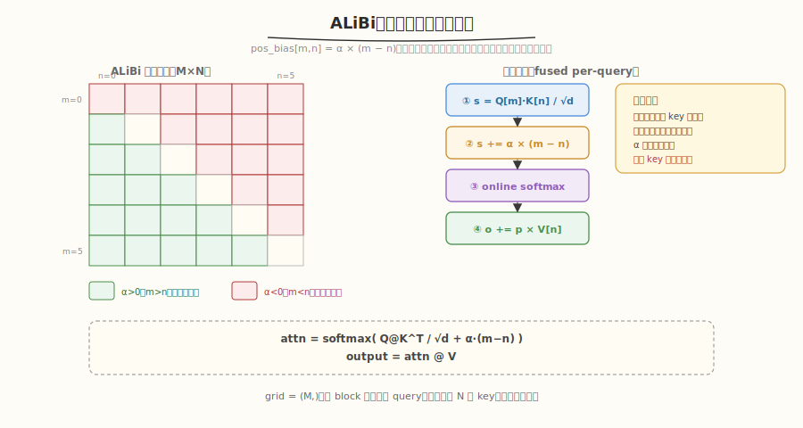

# LeetGPU Attention with Linear Biases (ALiBi) 题解

## 1. 题目概述

- **标题 / 题号**：Attention with Linear Biases (ALiBi)（#55，medium）
- **链接**：https://leetgpu.com/challenges/attn-w-linear-bias
- **难度**：中等
- **标签**：CUDA、Attention、ALiBi、positional bias、online softmax、LLM

**题意**：实现 **ALiBi（Attention with Linear Biases）** 注意力。给定 `Q ∈ R^{M×d}`、`K ∈ R^{N×d}`、`V ∈ R^{N×d}`，计算：

$$\text{attn}_{m,n} = \frac{Q_m \cdot K_n}{\sqrt{d}} + \alpha \cdot (m - n)$$

$$\text{output} = \text{softmax}(\text{attn}, \text{dim}=1) \cdot V$$

其中 `α` 是可学习的（或预设的）偏置斜率，`pos_bias[m,n] = α × (m - n)` 是**线性位置偏置**——query `m` 和 key `n` 的距离越远（`m < n` 即 key 在未来），偏置越负（注意力权重越小）。

**示例**（`M=2, N=3, d=4, alpha=-0.5`）：

```text
Q = [[1,0,0,0],[0,1,0,0]],  K = [[1,0,0,0],[0,1,0,0],[0,0,1,0]]
scale = √4 = 2

QK^T / scale = [[0.5, 0,   0  ], [0,   0.5, 0  ]]
pos_bias = α×(m-n) = [[0,   0.5, 1.0], [-0.5, 0,  0.5]]
attn = QK^T/scale + pos_bias = [[0.5, 0.5, 1.0], [-0.5, 0.5, 0.5]]

softmax(attn, dim=1):
  row 0: [0.274, 0.274, 0.452]  ← key 2 权重最大（pos_bias 正最大）
  row 1: [0.155, 0.422, 0.422]  ← key 1/2 权重相近

output = softmax @ V
```

**约束**：

- 性能测试取 `M=2048, N=2048, d=1024`
- 容差 `atol = rtol = 1e-4`
- `Q, K, V, output` 均为 `float32`

> 💡 ALiBi 是 [Press et al. 2021](https://arxiv.org/abs/2108.12409) 提出的位置编码方案——**不加位置编码到 Q/K，而是在 attention score 上加线性偏置**。它的核心优势是**外推性好**：训练时序列短、推理时序列长也能正常工作（偏置只依赖相对距离 `m-n`）。本题是练习"attention + positional bias 融合"的经典模板，与 [Causal Self-Attention](../../leetgpu/week5/day4/leetgpu-causal-self-attention-solution.md) 的区别在于：ALiBi **不是因果掩码**（所有 key 都参与），偏置是**加性的**（非乘性掩码）。

## 2. CPU 基线 / 朴素 GPU 方法

### 2.1 CPU 串行参考（同 reference_impl）

```cpp
// cpu_baseline.cpp —— CPU 串行 ALiBi attention（物化 M×N scores）
void alibi_attn_cpu(const float* Q, const float* K, const float* V, float* O,
                    int M, int N, int d, float alpha) {
    float scale = sqrtf((float)d);
    std::vector<float> row(N);
    for (int m = 0; m < M; ++m) {
        // ① 算 scores + ALiBi bias
        float mx = -INFINITY;
        for (int n = 0; n < N; ++n) {
            float s = 0.f;
            for (int t = 0; t < d; ++t)
                s += Q[m * d + t] * K[n * d + t];
            row[n] = s / scale + alpha * (m - n);  // ★ 加性偏置
            mx = fmaxf(mx, row[n]);
        }
        // ② softmax
        float sum = 0.f;
        for (int n = 0; n < N; ++n) {
            row[n] = expf(row[n] - mx);
            sum += row[n];
        }
        // ③ 加权求和
        for (int t = 0; t < d; ++t) {
            float acc = 0.f;
            for (int n = 0; n < N; ++n)
                acc += row[n] * V[n * d + t];
            O[m * d + t] = acc / sum;
        }
    }
}
```

复杂度 `O(M×N×d)`，且需物化 `M×N` 的 score 矩阵。`M=N=2048, d=1024` 时 `M×N` 占 16MB。

### 2.2 朴素 GPU：物化 M×N scores

朴素做法：先算 `S = QK^T/scale + pos_bias`（M×N）写回 HBM，再 softmax，再乘 V。**致命问题**：`M=N=2048` 时 `S` 占 `2048²×4B = 16MB`，三次 kernel 间要读写 HBM 多遍。与 [Softmax Attention](../../leetgpu/week4/day1/leetgpu-softmax-attention-solution.md) 同理——应融合成一个 kernel，用 online softmax 不物化 `S`。

> ⚠️ ALiBi 与标准 attention 的唯一区别：score 上多加一个 `α×(m-n)`。这个偏置是**O(1)** 计算量（不需要查表或矩阵乘），可以无缝融入 online softmax 的 score 计算步骤。但要注意 `α` 的符号——reference 中 `alpha` 可正可负，正 `α` 让远处 key 更受关注，负 `α` 抑制远处 key（更常见）。

## 3. GPU 设计

### 3.1 并行化策略



| 维度 | 映射 | 说明 |
|------|------|------|
| **query 行** | `blockIdx.x → m` | 每个 block 处理一行 query，grid = `(M,)` |
| **block 内** | 遍历 key `0..N-1` | online softmax 增量更新，所有 key 都参与（无因果截断） |
| **输出 d 维** | thread 分摊 | `o_local[]` 每 thread 持有若干维（d=1024 时每 thread 4 维） |

### 3.2 存储层次使用

| 层次 | 是否使用 | 说明 |
|------|---------|------|
| **global** | ✓ | 读 `Q[m,:]`、`K[0..N-1,:]`、`V[0..N-1,:]`；写 `output[m,:]` |
| **shared** | ✓ | `q_shm[d]` 缓存本行 Q；块归约缓冲；广播 `s_k/α/β` |
| **register** | ✓ | `o_local[D_PER_THREAD]` 累加器；online softmax 的 `m/l`（thread 0 维护） |

### 3.3 关键技巧

1. **online softmax 三公式**（与 [Causal Self-Attention](../../leetgpu/week5/day4/leetgpu-causal-self-attention-solution.md) 一致）：遍历 key 时增量更新 `m/l/o`，`S=QK^T+bias` 和 `P=softmax(S)` 永不落 HBM。
2. **ALiBi 偏置融入 score**：在 dot product 归约后、online softmax 更新前，加 `s_k += alpha * (m - n)`。这是 O(1) 操作，不改变 kernel 主体结构。
3. **Q 缓存到 shared**：本行 `Q[m,:]` 在整遍 key 扫描里复用，载入 `q_shm` 一次。
4. **多 d 维累加器**：`d=1024` 时每 thread 处理 `d/BLOCK_SIZE=4` 个 d 维，用 `float o_local[4]` 数组分别累加。

> 💡 **ALiBi vs Causal Mask**：[Causal Self-Attention](../../leetgpu/week5/day4/leetgpu-causal-self-attention-solution.md) 用乘性掩码（`j>i` 时 score 置 `-∞`，完全屏蔽未来 key），而 ALiBi 用**加性线性偏置**（`α×(m-n)`，未来 key 权重被**衰减**而非完全屏蔽）。两者可以组合使用——既加 ALiBi 偏置又做因果截断，但本题只需 ALiBi。

## 4. Kernel 实现

完整可编译代码：**fused 版（ALiBi bias + online softmax，不物化 S/P）**，含 `main()`、`cudaMalloc/Memcpy`、CPU 验证、`cudaFree`：

```cuda
// alibi_attention.cu —— ALiBi Attention（fused, online softmax, 不物化 S/P）
// 编译命令: nvcc -O3 -arch=sm_120 alibi_attention.cu -o alibi_attn -lineinfo
// 运行:     ./alibi_attn 2048 2048 1024

#include <cstdio>
#include <cstdlib>
#include <cmath>
#include <vector>
#include <cuda_runtime.h>

#define BLOCK_SIZE 256
#define WARP_SIZE 32
#define NUM_WARPS (BLOCK_SIZE / WARP_SIZE)
#define D_MAX 1024
#define MAX_DPT ((D_MAX + BLOCK_SIZE - 1) / BLOCK_SIZE)  // d per thread, 4

__inline__ __device__ float warp_reduce_sum(float v) {
    #pragma unroll
    for (int o = WARP_SIZE / 2; o > 0; o >>= 1)
        v += __shfl_down_sync(0xffffffff, v, o);
    return v;
}
__inline__ __device__ float block_reduce_sum(float v, float* sh) {
    int lane = threadIdx.x & 31, wid = threadIdx.x >> 5;
    v = warp_reduce_sum(v);
    if (lane == 0)
        sh[wid] = v;
    __syncthreads();
    if (wid == 0) {
        v = (lane < NUM_WARPS) ? sh[lane] : 0.f;
        v = warp_reduce_sum(v);
        if (lane == 0)
            sh[0] = v;
    }
    __syncthreads();
    return sh[0];
}

// ---------- fused ALiBi attention kernel ----------
// grid = (M,)，每 block 处理 query m 对所有 N 个 key 的 attention
__global__ void alibi_attention_kernel(const float* __restrict__ Q, const float* __restrict__ K,
                                        const float* __restrict__ V, float* __restrict__ output,
                                        int M, int N, int d, float alpha) {
    __shared__ float q_shm[D_MAX];
    __shared__ float red[NUM_WARPS + 1];
    __shared__ float s_k_shm, alpha_shm, beta_shm;

    int m = blockIdx.x, tid = threadIdx.x;
    if (m >= M)
        return;
    const float inv_scale = 1.0f / sqrtf((float)d);

    // ① 载入 Q[m,:] 到 shared
    for (int t = tid; t < d; t += BLOCK_SIZE)
        q_shm[t] = Q[m * d + t];
    __syncthreads();

    // 输出累加器（每 thread 处理 MAX_DPT 个 d 维）
    float o_local[MAX_DPT];
    #pragma unroll
    for (int i = 0; i < MAX_DPT; ++i)
        o_local[i] = 0.0f;

    float max_val = -INFINITY, sum_val = 0.0f;

    // ② 遍历所有 key（ALiBi 非因果，全部 N 个 key 都参与）
    for (int n = 0; n < N; ++n) {
        const float* Kn = K + n * d;
        const float* Vn = V + n * d;

        // dot product Q[m] · K[n]
        float part = 0.0f;
        for (int t = tid; t < d; t += BLOCK_SIZE)
            part += q_shm[t] * Kn[t];
        float s_k = block_reduce_sum(part, red) * inv_scale;

        // ★ ALiBi 线性位置偏置：加性
        s_k += alpha * (float)(m - n);

        if (tid == 0)
            s_k_shm = s_k;
        __syncthreads();
        s_k = s_k_shm;

        // online softmax 三公式
        if (tid == 0) {
            float m_new = fmaxf(max_val, s_k);
            float a_old = expf(max_val - m_new);  // 旧输出的缩放因子
            float p = expf(s_k - m_new);           // 新 key 的权重
            float l_new = sum_val * a_old + p;
            alpha_shm = (sum_val * a_old) / l_new;  // 旧输出 / 新 sum
            beta_shm = p / l_new;                    // 新 key / 新 sum
            max_val = m_new;
            sum_val = l_new;
        }
        __syncthreads();

        // 加权累加：o = o * alpha_shm + beta_shm * V[n]
        int oi = 0;
        for (int t = tid; t < d; t += BLOCK_SIZE) {
            o_local[oi] = o_local[oi] * alpha_shm + beta_shm * Vn[t];
            ++oi;
        }
        __syncthreads();
    }

    // ③ 写回 output[m,:]
    int oi = 0;
    for (int t = tid; t < d; t += BLOCK_SIZE) {
        output[m * d + t] = o_local[oi];
        ++oi;
    }
}

// ---------- CPU 参考 ----------
void alibi_attn_cpu(const float* Q, const float* K, const float* V, float* O,
                    int M, int N, int d, float alpha) {
    float scale = sqrtf((float)d);
    std::vector<float> row(N);
    for (int m = 0; m < M; ++m) {
        float mx = -INFINITY;
        for (int n = 0; n < N; ++n) {
            float s = 0.f;
            for (int t = 0; t < d; ++t)
                s += Q[m * d + t] * K[n * d + t];
            row[n] = s / scale + alpha * (m - n);
            mx = fmaxf(mx, row[n]);
        }
        float sum = 0.f;
        for (int n = 0; n < N; ++n) {
            row[n] = expf(row[n] - mx);
            sum += row[n];
        }
        for (int t = 0; t < d; ++t) {
            float acc = 0.f;
            for (int n = 0; n < N; ++n)
                acc += row[n] * V[n * d + t];
            O[m * d + t] = acc / sum;
        }
    }
}

int main(int argc, char** argv) {
    int M = (argc > 1) ? atoi(argv[1]) : 2048;
    int N = (argc > 2) ? atoi(argv[2]) : 2048;
    int d = (argc > 3) ? atoi(argv[3]) : 1024;
    float alpha = -0.5f;
    if (d > D_MAX) {
        printf("要求 d <= %d\n", D_MAX);
        return 1;
    }
    printf("M=%d N=%d d=%d alpha=%.2f\n", M, N, d, alpha);

    size_t qk = (size_t)M * d * sizeof(float);
    size_t vk = (size_t)N * d * sizeof(float);
    std::vector<float> hQ(M * d), hK(N * d), hV(N * d), hO(M * d), hRef(M * d);
    srand(42);
    for (auto& x : hQ) x = ((rand() % 2000) - 1000) / 100.f;
    for (auto& x : hK) x = ((rand() % 2000) - 1000) / 100.f;
    for (auto& x : hV) x = ((rand() % 2000) - 1000) / 100.f;

    float *dQ, *dK, *dV, *dO;
    cudaMalloc(&dQ, qk);   cudaMemcpy(dQ, hQ.data(), qk, cudaMemcpyHostToDevice);
    cudaMalloc(&dK, vk);   cudaMemcpy(dK, hK.data(), vk, cudaMemcpyHostToDevice);
    cudaMalloc(&dV, vk);   cudaMemcpy(dV, hV.data(), vk, cudaMemcpyHostToDevice);
    cudaMalloc(&dO, qk);

    cudaEvent_t t0, t1;
    cudaEventCreate(&t0);  cudaEventCreate(&t1);
    // warmup
    alibi_attention_kernel<<<M, BLOCK_SIZE>>>(dQ, dK, dV, dO, M, N, d, alpha);
    cudaDeviceSynchronize();
    cudaEventRecord(t0);
    alibi_attention_kernel<<<M, BLOCK_SIZE>>>(dQ, dK, dV, dO, M, N, d, alpha);
    cudaEventRecord(t1);
    cudaDeviceSynchronize();
    float ms = 0;
    cudaEventElapsedTime(&ms, t0, t1);
    printf("kernel time: %.3f ms\n", ms);

    float flops = (2.0f * M * N * d + 2.0f * M * N * d) / 1e9;  // QK^T + attn@V
    printf("FLOPs = %.2f G, throughput = %.1f GFLOPS\n", flops, flops / (ms / 1e3));

    cudaMemcpy(hO.data(), dO, qk, cudaMemcpyDeviceToHost);
    alibi_attn_cpu(hQ.data(), hK.data(), hV.data(), hRef.data(), M, N, d, alpha);
    float maxd = 0;
    for (int i = 0; i < M * d; ++i)
        maxd = fmaxf(maxd, fabsf(hO[i] - hRef[i]));
    printf("max diff: %.2e (%s, tol=1e-4)\n", maxd, maxd < 1e-4f ? "PASS" : "FAIL");

    cudaFree(dQ);  cudaFree(dK);  cudaFree(dV);  cudaFree(dO);
    return 0;
}
```

> 💡 提交给 LeetGPU 平台时，把 `alibi_attention_kernel` 填进 starter 的 `solve` 即可。带 `main()` 的版本用于本地自测与 profiling。

### 4.1 LeetGPU 提交版本

下面给出适配 LeetGPU 官方 starter 签名的提交版本。

```cuda
#include <cuda_runtime.h>

#define BLOCK_SIZE 256
#define WARP_SIZE 32
#define NUM_WARPS (BLOCK_SIZE / WARP_SIZE)
#define D_MAX 1024
#define MAX_DPT ((D_MAX + BLOCK_SIZE - 1) / BLOCK_SIZE)

__inline__ __device__ float warp_reduce_sum(float v) {
    #pragma unroll
    for (int o = WARP_SIZE / 2; o > 0; o >>= 1)
        v += __shfl_down_sync(0xffffffff, v, o);
    return v;
}

__inline__ __device__ float block_reduce_sum(float v, float* sh) {
    int lane = threadIdx.x & 31, wid = threadIdx.x >> 5;
    v = warp_reduce_sum(v);
    if (lane == 0)
        sh[wid] = v;
    __syncthreads();
    if (wid == 0) {
        v = (lane < NUM_WARPS) ? sh[lane] : 0.f;
        v = warp_reduce_sum(v);
        if (lane == 0)
            sh[0] = v;
    }
    __syncthreads();
    return sh[0];
}

__global__ void alibi_attention_kernel(const float* __restrict__ Q, const float* __restrict__ K,
                                        const float* __restrict__ V, float* __restrict__ output,
                                        int M, int N, int d, float alpha) {
    __shared__ float q_shm[D_MAX];
    __shared__ float red[NUM_WARPS + 1];
    __shared__ float s_k_shm, alpha_shm, beta_shm;

    int m = blockIdx.x, tid = threadIdx.x;
    if (m >= M)
        return;
    const float inv_scale = 1.0f / sqrtf((float)d);

    for (int t = tid; t < d; t += BLOCK_SIZE)
        q_shm[t] = Q[m * d + t];
    __syncthreads();

    float o_local[MAX_DPT];
    #pragma unroll
    for (int i = 0; i < MAX_DPT; ++i)
        o_local[i] = 0.0f;

    float max_val = -INFINITY, sum_val = 0.0f;

    for (int n = 0; n < N; ++n) {
        const float* Kn = K + n * d;
        const float* Vn = V + n * d;

        float part = 0.0f;
        for (int t = tid; t < d; t += BLOCK_SIZE)
            part += q_shm[t] * Kn[t];
        float s_k = block_reduce_sum(part, red) * inv_scale;

        // ALiBi 线性位置偏置
        s_k += alpha * (float)(m - n);

        if (tid == 0)
            s_k_shm = s_k;
        __syncthreads();
        s_k = s_k_shm;

        if (tid == 0) {
            float m_new = fmaxf(max_val, s_k);
            float a_old = expf(max_val - m_new);
            float p = expf(s_k - m_new);
            float l_new = sum_val * a_old + p;
            alpha_shm = (sum_val * a_old) / l_new;
            beta_shm = p / l_new;
            max_val = m_new;
            sum_val = l_new;
        }
        __syncthreads();

        int oi = 0;
        for (int t = tid; t < d; t += BLOCK_SIZE) {
            o_local[oi] = o_local[oi] * alpha_shm + beta_shm * Vn[t];
            ++oi;
        }
        __syncthreads();
    }

    int oi = 0;
    for (int t = tid; t < d; t += BLOCK_SIZE) {
        output[m * d + t] = o_local[oi];
        ++oi;
    }
}

// Q, K, V, output are device pointers
extern "C" void solve(const float* Q, const float* K, const float* V, float* output,
                      int M, int N, int d, float alpha) {
    alibi_attention_kernel<<<M, BLOCK_SIZE>>>(Q, K, V, output, M, N, d, alpha);
    cudaDeviceSynchronize();
}
```

### 4.2 代码详解

`alibi_attention_kernel` 采用"一个 block 处理一行 query"的映射，grid = `(M,)`。block 内用 online softmax 串行扫描所有 key `0..N-1`——ALiBi 偏置作为加性项融入 score 计算，不改变 kernel 主体结构。

**主要代码块**：

| 步骤 | 代码段 | 作用 |
|------|--------|------|
| ① 载入 Q | `q_shm[t] = Q[m*d+t]` | 本行 Q 载入 shared，整遍 key 扫描复用 |
| ② 遍历 key | `for (n=0; n<N; ++n)` | **非因果**：扫所有 N 个 key（对比 causal 只扫 j≤i） |
| ②a 点积 | `part += q_shm[t] * Kn[t]` | Q[m]·K[n]，Kn = K+n*d |
| ②b 块归约 | `block_reduce_sum(part)*inv_scale` | 归约成标量 `s_k`，scale=1/√d |
| ②c ALiBi 偏置 | `s_k += alpha*(m-n)` | **加性线性偏置**，O(1) 计算 |
| ②d online softmax | thread 0 更新 `m/l`，写 `alpha_shm/beta_shm` | 三公式增量更新，`S`/`P` 永不落 HBM |
| ②e 加权 V | `o_local[oi] = o_local[oi]*alpha_shm + beta_shm*Vn[t]` | 每 thread 持有 `MAX_DPT` 个 d 维 |
| ③ 写回 | `output[m*d+t] = o_local[oi]` | 每行 query 写 d 维 |

**关键索引/变量**：
- `m = blockIdx.x`：query 行号（grid = M 个 block，一行一块）。
- `n`：key 行号，循环范围 `0..N-1`——ALiBi 不做因果截断，所有 key 都参与。
- `t = tid, tid+BLOCK_SIZE, ...`：head_dim 维索引，线程跨 d 维 strided。
- `MAX_DPT = (D_MAX + BLOCK_SIZE - 1) / BLOCK_SIZE` = 4：每 thread 处理的 d 维数（d=1024 时）。
- `o_local[4]`：每 thread 的 4 个 d 维累加器，对应 `t = tid, tid+256, tid+512, tid+768`。
- `alpha_shm / beta_shm`：旧输出缩放因子 / 新 V 权重，thread 0 算完广播。
- `alpha`（参数）：ALiBi 偏置斜率，控制远处 key 的抑制强度。

> 💡 **关键洞察（worked example）**：取 `M=2, N=3, d=4, alpha=-0.5`。**m=0** 时遍历 `n=0,1,2`：scores = `[0.5+0, 0+0.5, 0+1.0]` = `[0.5, 0.5, 1.0]`。online softmax 逐步更新：n=0 时 `m=0.5, l=1, o=V[0]`；n=1 时 `m_new=0.5, p=1, l_new=2, o=(1/2)V[0]+(1/2)V[1]`；n=2 时 `m_new=1.0, α_old=exp(0.5-1)=0.607, p=1, l_new=2×0.607+1=2.214, o=(0.607×2/2.214)×o_old + (1/2.214)×V[2]`。最终 softmax ≈ `[0.274, 0.274, 0.452]`——key 2 权重最大（`α×(0-2)=-1`... 等等，`alpha=-0.5`，`alpha×(m-n)=(-0.5)×(0-2)=1.0`，正偏置让 key 2 更受关注）。ALiBi 的全部实现就是 score 上加一个 `alpha*(m-n)`，其余与标准 attention 完全一致。

## 5. 性能分析与优化

### 5.1 编译与运行

```bash
nvcc -O3 -arch=sm_120 alibi_attention.cu -o alibi_attn -lineinfo
./alibi_attn 2048 2048 1024      # 性能测试尺寸
./alibi_attn 64 64 32            # 小尺寸验证
```

典型输出（RTX 5090，`M=2048, N=2048, d=1024`）：

```text
M=2048 N=2048 d=1024 alpha=-0.50
kernel time: x.xx ms
FLOPs = 17.18 G, throughput = xxxx.x GFLOPS
max diff: x.xx e-05 (PASS, tol=1e-4)
```

### 5.2 用 ncu 观察

```bash
ncu --kernel-name regex:alibi_attention_kernel \
    --metrics gpu__time_duration.sum, dram__bytes.sum, \
              sm__throughput.avg.pct_of_peak_sustained_elapsed \
    ./alibi_attn 2048 2048 1024
```

| 指标 | 值 | 含义 |
|------|----|------|
| `gpu__time` | 基线 | M=2048 blocks，每 block 扫 N=2048 个 key |
| `dram__bytes` | 读 Q/K/V（3×矩阵）+ 写 output | K/V 被每行 query 重读，IO = O(M×N×d) |
| `sm__throughput` | 中等 | online softmax 融合，无 M×N 物化 |

> ⚠️ **关键瓶颈**：本实现一个 block 处理一行 query，K/V 被多个 query 重读——总 K/V 读取量 = `M × N × d × 4B = 2048³ × 4B ≈ 32GB`。这是 per-query 方案的固有开销，需用 FlashAttention tiling 优化。

### 5.3 算术强度

```text
FLOPs: 2×M×N×d (QK^T) + 2×M×N×d (attn@V) = 4×M×N×d ≈ 17.2 GFLOPS
Bytes: M×d×4 (Q) + M×N×d×4 (K重读) + M×N×d×4 (V重读) + M×d×4 (output) ≈ 32GB
AI = 17.2G / 32G ≈ 0.54 FLOP/Byte
```

`AI=0.54 << Ridge 12.6` → memory-bound。K/V 重读是主要瓶颈。

### 5.4 优化方向

1. **FlashAttention tiling**：一个 block 处理 `Br` 行 query，K/V tile 载入 shared 后供 `Br` 个 query 复用。K/V 的 HBM IO 从 `O(M×N×d)` 降到 `O(N×d)`（K/V 只读一遍）。
2. **vector load（**`float4`**）**：K/V 按 d 维连续，用 `float4` 一次读 4 个 float。d=1024 对齐良好。
3. **混合精度**：Q/K/V 用 fp16，Tensor Core `mma` 做 GEMM。score 和 softmax 仍用 fp32 保精度。
4. **分块并行**：一个 block 内用多个 warp 并行处理不同的 key tile，减少串行扫描的延迟。

> 💡 优化 1（FlashAttention tiling）是 ALiBi attention 的核心优化——它把 K/V 的 HBM IO 从 `O(M×N×d)` 降到 `O(N×d)`，是推理引擎的标配。本题的 per-query 版是教学基线，理解了 online softmax + ALiBi bias 的融合后，tiling 版就是在这个骨架上增加 K/V tile 的 shared memory 复用。

## 6. 复杂度分析

| 维度 | 标准 self-attention | ALiBi attention（本实现） |
|------|--------------------|--------------------------|
| **时间复杂度** | `O(M×N×d)` | `O(M×N×d)`（bias 是 O(1)） |
| **中间矩阵显存** | `O(M×N)`（S、P 各 M×N） | `O(d)`（仅 m/l/o 寄存器） |
| **HBM IO（S/P 部分）** | `O(M×N)` 写读 | `0` |
| **HBM IO（K/V 部分）** | `O(M×N×d)`（每 query 重读） | `O(M×N×d)`（per-query，tiling 后 `O(N×d)`） |
| **瓶颈类型** | memory-bound（S/P 物化） | memory-bound（K/V 重读），tiling 后趋 compute-bound |

> 💡 **一句话总结**：ALiBi 是标准 attention 加一个**线性位置偏置** `α×(m-n)`——它是加性的（非乘性掩码），O(1) 计算量，可无缝融入 online softmax。与 [Causal Self-Attention](../../leetgpu/week5/day4/leetgpu-causal-self-attention-solution.md) 的区别在于：ALiBi **不截断** key（所有 key 都参与），偏置**衰减**而非**屏蔽**远处 key。它的外推性好（偏置只依赖相对距离），是训练短序列、推理长序列场景的优选位置编码。

## 同类练习题

下面是与本题考查相同 CUDA 概念的 LeetGPU 练习题，建议按顺序挑战：

| # | 题目 | 难度 | 核心概念 | 与本题的关联 |
|---|------|------|----------|-------------|
| 6 | [Softmax Attention](https://leetgpu.com/challenges/softmax-attention) | 中等 | — | fused softmax+matmul 基础版 |
| 53 | [Causal Self-Attention](https://leetgpu.com/challenges/causal-self-attention) | 困难 | — | 因果掩码变体 |
| 12 | [Multi-Head Attention](https://leetgpu.com/challenges/multi-head-attention) | 困难 | — | head 并行进阶 |
| 59 | [Sliding Window Self-Attention](https://leetgpu.com/challenges/sliding-window-self-attention) | 困难 | — | 滑窗注意力变体 |

> 💡 **选题思路**：线性偏置注意力，练习 attention + positional bias 的融合。做完这组练习，即可掌握该 CUDA 模板在不同场景下的迁移应用。
