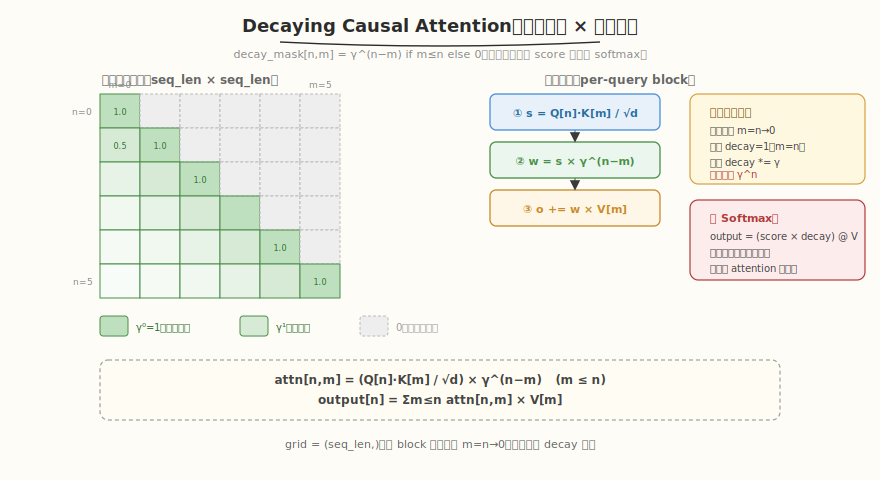

# LeetGPU Decaying Causal Attention 题解

## 1. 题目概述

- **标题 / 题号**：Decaying Causal Attention（#92，medium）
- **链接**：https://leetgpu.com/challenges/decaying-causal-attention
- **难度**：中等
- **标签**：CUDA、Attention、Causal Mask、Exponential Decay、增量计算

**题意**：实现 **衰减因果注意力**。给定 `Q/K/V ∈ R^{seq_len × d_model}`，计算带指数衰减的因果注意力：

$$\text{decay\_mask}_{n,m} = \begin{cases} \gamma^{n-m}, & m \le n \\ 0, & m > n \end{cases}$$

$$\text{attn}_{n,m} = \frac{Q_n \cdot K_m}{\sqrt{d_{\text{model}}}} \times \text{decay\_mask}_{n,m}$$

$$\text{output}_n = \sum_{m=0}^{n} \text{attn}_{n,m} \times V_m$$

关键点：衰减因子是**乘性**的（乘到 score 上），且**没有 softmax 归一化**——输出是加权求和，不是概率分布。

**示例**（`seq_len=2, d_model=4, gamma=0.5`，取自官方 example test）：

```text
Q = [[1,1,0,0],[1,1,0,0]],  K = [[1,0,0,0],[0,1,0,0]],  V = [[4,8,12,16],[4,8,12,16]]
scale = √4 = 2

QK^T / scale = [[0.5, 0.5], [0.5, 0.5]]
decay_mask = [[1, 0], [0.5, 1]]   (γ^0=1 对角线，γ^1=0.5 近邻，上三角=0)
attn = QK^T/scale × decay_mask = [[0.5, 0], [0.25, 0.5]]

output = attn @ V:
  row 0 = 0.5×V[0] = [2, 4, 6, 8]
  row 1 = 0.25×V[0] + 0.5×V[1] = [3, 6, 9, 12]
```

**约束**：

- 性能测试取 `seq_len=4096, d_model=64`
- 容差 `atol = rtol = 1e-3`（注意比其他 attention 题更宽松）
- `Q, K, V, output` 均为 `float32`
- `0 < gamma < 1`（衰减因子）

> 💡 这道题与 [Causal Self-Attention](../../leetgpu/week5/day4/leetgpu-causal-self-attention-solution.md) 有两个关键区别：① **无 softmax**——输出是 `attn × decay_mask` 直接乘 `V`，不做归一化；② **乘性衰减**——`γ^(n-m)` 乘到 score 上，而非 ALiBi 的加性偏置。这让 kernel 比 standard attention 更简单（无需 online softmax），但引入了**增量衰减计算**的优化空间。

## 2. CPU 基线 / 朴素 GPU 方法

### 2.1 CPU 串行参考（同 reference_impl）

```cpp
// cpu_baseline.cpp —— CPU 串行 decaying causal attention
void decaying_attn_cpu(const float* Q, const float* K, const float* V, float* O,
                       int seq_len, int d_model, float gamma) {
    float scale = sqrtf((float)d_model);
    for (int n = 0; n < seq_len; ++n) {
        for (int t = 0; t < d_model; ++t)
            O[n * d_model + t] = 0.0f;
        for (int m = 0; m <= n; ++m) {  // ★ causal: m ≤ n
            // dot product
            float s = 0.f;
            for (int t = 0; t < d_model; ++t)
                s += Q[n * d_model + t] * K[m * d_model + t];
            s /= scale;
            // 乘性衰减
            float decay = powf(gamma, (float)(n - m));
            float weight = s * decay;
            // 加权累加（无 softmax！）
            for (int t = 0; t < d_model; ++t)
                O[n * d_model + t] += weight * V[m * d_model + t];
        }
    }
}
```

复杂度 `O(seq_len² × d_model)`，因 causal 只算下三角，实际 `O(seq_len² × d_model / 2)`。`seq_len=4096, d_model=64` 时约 2.1 GFLOPS。

### 2.2 朴素 GPU：物化 seq_len×seq_len attn 矩阵

朴素做法：先算 `S = QK^T/scale`（seq_len×seq_len），再乘 `decay_mask`，再乘 `V`。**问题**：`seq_len=4096` 时 `S` 占 `4096²×4B = 64MB`，三次 kernel 间读写 HBM 多遍。应融合成一个 kernel。

> ⚠️ **无 softmax 的简化**：与 [Causal Self-Attention](../../leetgpu/week5/day4/leetgpu-causal-self-attention-solution.md) 不同，本题**不做 softmax**——输出是 `(score × decay) @ V` 的直接加权求和。这意味着无需 online softmax 的 `max/sum` 追踪、无需 `alpha/beta` 缩放，只需**线性累加** `o += weight × V[m]`。kernel 比 standard attention 简单得多。

## 3. GPU 设计

### 3.1 并行化策略



| 维度 | 映射 | 说明 |
|------|------|------|
| **query 行** | `blockIdx.x → n` | 每个 block 处理一行 query，grid = `(seq_len,)` |
| **block 内** | 逆序遍历 key `n→0` | 因果截断（m ≤ n），逆序便于增量衰减 |
| **输出 d 维** | thread 分摊 | `o_local` 每 thread 持有若干维（d=64 时每 thread 1 维） |

### 3.2 存储层次使用

| 层次 | 是否使用 | 说明 |
|------|---------|------|
| **global** | ✓ | 读 `Q[n,:]`、`K[0..n,:]`、`V[0..n,:]`；写 `output[n,:]` |
| **shared** | ✓ | `q_shm[d_model]` 缓存本行 Q；块归约缓冲；广播 `weight` |
| **register** | ✓ | `o_local` 累加器；`decay` 因子（全 thread 一致） |

### 3.3 关键技巧

1. **因果截断**：内层循环 `for (m=n; m>=0; --m)`，天然不遍历 `m>n`——无需显式 mask 步骤，省 50% 计算。
2. **增量衰减计算**：**逆序遍历** `m=n, n-1, ..., 0`，初始 `decay=1`（`m=n` 时 `γ^0=1`），每步 `decay *= gamma`。避免正向遍历时需预计算 `gamma^n`（大 `n` 时可能溢出/下溢）。
3. **无 softmax 的线性累加**：`o += weight × V[m]`，无需 `max/sum` 追踪，比 [Causal Self-Attention](../../leetgpu/week5/day4/leetgpu-causal-self-attention-solution.md) 的 online softmax 简单得多。
4. **Q 缓存到 shared**：本行 `Q[n,:]` 在整遍 key 扫描里复用，载入 `q_shm` 一次。

> 💡 **为什么逆序遍历？** 正向遍历 `m=0,1,...,n` 时，`m=0` 的衰减是 `gamma^n`（`n=4095` 时 `0.5^4095 ≈ 0`，下溢）。逆序遍历 `m=n,n-1,...,0` 时，从 `gamma^0=1` 开始，每步乘 `gamma`，衰减值逐步减小但始终在合理范围内。更重要的是——**逆序避免了** `powf(gamma, n)` **的昂贵计算**，用简单的乘法 `decay *= gamma` 替代。

## 4. Kernel 实现

完整可编译代码：**fused 版（因果截断 + 增量衰减 + 无 softmax 线性累加）**，含 `main()`、`cudaMalloc/Memcpy`、CPU 验证、`cudaFree`：

```cuda
// decaying_causal_attention.cu —— Decaying Causal Attention（fused, 增量衰减, 无 softmax）
// 编译命令: nvcc -O3 -arch=sm_120 decaying_causal_attention.cu -o decaying_attn -lineinfo
// 运行:     ./decaying_attn 4096 64

#include <cstdio>
#include <cstdlib>
#include <cmath>
#include <vector>
#include <cuda_runtime.h>

#define BLOCK_SIZE 256
#define WARP_SIZE 32
#define NUM_WARPS (BLOCK_SIZE / WARP_SIZE)
#define D_MAX 256
#define MAX_DPT ((D_MAX + BLOCK_SIZE - 1) / BLOCK_SIZE)

__inline__ __device__ float warp_reduce_sum(float v) {
    #pragma unroll
    for (int o = WARP_SIZE / 2; o > 0; o >>= 1)
        v += __shfl_down_sync(0xffffffff, v, o);
    return v;
}
__inline__ __device__ float block_reduce_sum(float v, float* sh) {
    int lane = threadIdx.x & 31, wid = threadIdx.x >> 5;
    v = warp_reduce_sum(v);
    if (lane == 0)
        sh[wid] = v;
    __syncthreads();
    if (wid == 0) {
        v = (lane < NUM_WARPS) ? sh[lane] : 0.f;
        v = warp_reduce_sum(v);
        if (lane == 0)
            sh[0] = v;
    }
    __syncthreads();
    return sh[0];
}

// ---------- fused decaying causal attention kernel ----------
// grid = (seq_len,)，每 block 处理 query n 对 key 0..n 的 decaying attention
__global__ void decaying_causal_attention_kernel(
    const float* __restrict__ Q, const float* __restrict__ K,
    const float* __restrict__ V, float* __restrict__ output,
    int seq_len, int d_model, float gamma) {

    __shared__ float q_shm[D_MAX];
    __shared__ float red[NUM_WARPS + 1];
    __shared__ float weight_shm;

    int n = blockIdx.x, tid = threadIdx.x;
    if (n >= seq_len)
        return;
    const float inv_scale = 1.0f / sqrtf((float)d_model);

    // ① 载入 Q[n,:] 到 shared
    for (int t = tid; t < d_model; t += BLOCK_SIZE)
        q_shm[t] = Q[n * d_model + t];
    __syncthreads();

    // 输出累加器（每 thread 处理 MAX_DPT 个 d 维）
    float o_local[MAX_DPT];
    #pragma unroll
    for (int i = 0; i < MAX_DPT; ++i)
        o_local[i] = 0.0f;

    // ② 逆序遍历 key m = n, n-1, ..., 0（causal + 增量衰减）
    float decay = 1.0f;  // gamma^0 for m=n
    for (int m = n; m >= 0; --m) {
        const float* Km = K + m * d_model;
        const float* Vm = V + m * d_model;

        // dot product Q[n] · K[m]
        float part = 0.0f;
        for (int t = tid; t < d_model; t += BLOCK_SIZE)
            part += q_shm[t] * Km[t];
        float s_k = block_reduce_sum(part, red) * inv_scale;

        // 乘性衰减：weight = score × gamma^(n-m) = score × decay
        if (tid == 0)
            weight_shm = s_k * decay;
        __syncthreads();
        float weight = weight_shm;

        // 线性累加（无 softmax！）：o += weight × V[m]
        int oi = 0;
        for (int t = tid; t < d_model; t += BLOCK_SIZE) {
            o_local[oi] += weight * Vm[t];
            ++oi;
        }

        // 增量更新衰减因子：gamma^(n-(m-1)) = gamma^(n-m) × gamma
        decay *= gamma;
        __syncthreads();
    }

    // ③ 写回 output[n,:]
    int oi = 0;
    for (int t = tid; t < d_model; t += BLOCK_SIZE) {
        output[n * d_model + t] = o_local[oi];
        ++oi;
    }
}

// ---------- CPU 参考 ----------
void decaying_attn_cpu(const float* Q, const float* K, const float* V, float* O,
                       int seq_len, int d_model, float gamma) {
    float scale = sqrtf((float)d_model);
    for (int n = 0; n < seq_len; ++n) {
        for (int t = 0; t < d_model; ++t)
            O[n * d_model + t] = 0.0f;
        for (int m = 0; m <= n; ++m) {
            float s = 0.f;
            for (int t = 0; t < d_model; ++t)
                s += Q[n * d_model + t] * K[m * d_model + t];
            s /= scale;
            float decay = powf(gamma, (float)(n - m));
            float weight = s * decay;
            for (int t = 0; t < d_model; ++t)
                O[n * d_model + t] += weight * V[m * d_model + t];
        }
    }
}

int main(int argc, char** argv) {
    int seq_len = (argc > 1) ? atoi(argv[1]) : 4096;
    int d_model = (argc > 2) ? atoi(argv[2]) : 64;
    float gamma = 0.5f;
    if (d_model > D_MAX) {
        printf("要求 d_model <= %d\n", D_MAX);
        return 1;
    }
    printf("seq_len=%d d_model=%d gamma=%.2f\n", seq_len, d_model, gamma);

    size_t bytes = (size_t)seq_len * d_model * sizeof(float);
    std::vector<float> hQ(seq_len * d_model), hK(seq_len * d_model);
    std::vector<float> hV(seq_len * d_model), hO(seq_len * d_model), hRef(seq_len * d_model);
    srand(42);
    for (auto& x : hQ) x = ((rand() % 2000) - 1000) / 100.f;
    for (auto& x : hK) x = ((rand() % 2000) - 1000) / 100.f;
    for (auto& x : hV) x = ((rand() % 2000) - 1000) / 100.f;

    float *dQ, *dK, *dV, *dO;
    cudaMalloc(&dQ, bytes);  cudaMemcpy(dQ, hQ.data(), bytes, cudaMemcpyHostToDevice);
    cudaMalloc(&dK, bytes);  cudaMemcpy(dK, hK.data(), bytes, cudaMemcpyHostToDevice);
    cudaMalloc(&dV, bytes);  cudaMemcpy(dV, hV.data(), bytes, cudaMemcpyHostToDevice);
    cudaMalloc(&dO, bytes);

    cudaEvent_t t0, t1;
    cudaEventCreate(&t0);  cudaEventCreate(&t1);
    // warmup
    decaying_causal_attention_kernel<<<seq_len, BLOCK_SIZE>>>(dQ, dK, dV, dO, seq_len, d_model, gamma);
    cudaDeviceSynchronize();
    cudaEventRecord(t0);
    decaying_causal_attention_kernel<<<seq_len, BLOCK_SIZE>>>(dQ, dK, dV, dO, seq_len, d_model, gamma);
    cudaEventRecord(t1);
    cudaDeviceSynchronize();
    float ms = 0;
    cudaEventElapsedTime(&ms, t0, t1);
    printf("kernel time: %.3f ms\n", ms);

    // causal FLOPs = seq_len*(seq_len+1)/2 * d_model * 2 (QK^T) + same (attn@V)
    float causal_flops = (float)seq_len * (seq_len + 1) / 2 * d_model * 2 * 2;
    printf("causal FLOPs = %.2f G, throughput = %.1f GFLOPS\n",
           causal_flops / 1e9, causal_flops / 1e9 / (ms / 1e3));

    cudaMemcpy(hO.data(), dO, bytes, cudaMemcpyDeviceToHost);
    decaying_attn_cpu(hQ.data(), hK.data(), hV.data(), hRef.data(), seq_len, d_model, gamma);
    float maxd = 0;
    for (int i = 0; i < seq_len * d_model; ++i)
        maxd = fmaxf(maxd, fabsf(hO[i] - hRef[i]));
    printf("max diff: %.2e (%s, tol=1e-3)\n", maxd, maxd < 1e-3f ? "PASS" : "FAIL");

    cudaFree(dQ);  cudaFree(dK);  cudaFree(dV);  cudaFree(dO);
    return 0;
}
```

> 💡 提交给 LeetGPU 平台时，把 `decaying_causal_attention_kernel` 填进 starter 的 `solve` 即可。带 `main()` 的版本用于本地自测与 profiling。

### 4.1 LeetGPU 提交版本

下面给出适配 LeetGPU 官方 starter 签名的提交版本。

```cuda
#include <cuda_runtime.h>

#define BLOCK_SIZE 256
#define WARP_SIZE 32
#define NUM_WARPS (BLOCK_SIZE / WARP_SIZE)
#define D_MAX 256
#define MAX_DPT ((D_MAX + BLOCK_SIZE - 1) / BLOCK_SIZE)

__inline__ __device__ float warp_reduce_sum(float v) {
    #pragma unroll
    for (int o = WARP_SIZE / 2; o > 0; o >>= 1)
        v += __shfl_down_sync(0xffffffff, v, o);
    return v;
}

__inline__ __device__ float block_reduce_sum(float v, float* sh) {
    int lane = threadIdx.x & 31, wid = threadIdx.x >> 5;
    v = warp_reduce_sum(v);
    if (lane == 0)
        sh[wid] = v;
    __syncthreads();
    if (wid == 0) {
        v = (lane < NUM_WARPS) ? sh[lane] : 0.f;
        v = warp_reduce_sum(v);
        if (lane == 0)
            sh[0] = v;
    }
    __syncthreads();
    return sh[0];
}

__global__ void decaying_causal_attention_kernel(
    const float* __restrict__ Q, const float* __restrict__ K,
    const float* __restrict__ V, float* __restrict__ output,
    int seq_len, int d_model, float gamma) {

    __shared__ float q_shm[D_MAX];
    __shared__ float red[NUM_WARPS + 1];
    __shared__ float weight_shm;

    int n = blockIdx.x, tid = threadIdx.x;
    if (n >= seq_len)
        return;
    const float inv_scale = 1.0f / sqrtf((float)d_model);

    for (int t = tid; t < d_model; t += BLOCK_SIZE)
        q_shm[t] = Q[n * d_model + t];
    __syncthreads();

    float o_local[MAX_DPT];
    #pragma unroll
    for (int i = 0; i < MAX_DPT; ++i)
        o_local[i] = 0.0f;

    // 逆序遍历：m = n → 0，增量衰减
    float decay = 1.0f;
    for (int m = n; m >= 0; --m) {
        const float* Km = K + m * d_model;
        const float* Vm = V + m * d_model;

        float part = 0.0f;
        for (int t = tid; t < d_model; t += BLOCK_SIZE)
            part += q_shm[t] * Km[t];
        float s_k = block_reduce_sum(part, red) * inv_scale;

        // 乘性衰减
        if (tid == 0)
            weight_shm = s_k * decay;
        __syncthreads();
        float weight = weight_shm;

        // 线性累加（无 softmax）
        int oi = 0;
        for (int t = tid; t < d_model; t += BLOCK_SIZE) {
            o_local[oi] += weight * Vm[t];
            ++oi;
        }

        decay *= gamma;
        __syncthreads();
    }

    int oi = 0;
    for (int t = tid; t < d_model; t += BLOCK_SIZE) {
        output[n * d_model + t] = o_local[oi];
        ++oi;
    }
}

// Q, K, V, output are device pointers
extern "C" void solve(const float* Q, const float* K, const float* V, float* output,
                      int seq_len, int d_model, float gamma) {
    decaying_causal_attention_kernel<<<seq_len, BLOCK_SIZE>>>(Q, K, V, output, seq_len, d_model, gamma);
    cudaDeviceSynchronize();
}
```

### 4.2 代码详解

`decaying_causal_attention_kernel` 采用"一个 block 处理一行 query"的映射，grid = `(seq_len,)`。block 内**逆序**遍历 key `m=n→0`——因果约束体现为循环下界 `m>=0`（上界 `m=n`），增量衰减从 `decay=1` 开始每步乘 `gamma`。**无 softmax**，输出是简单的线性加权求和。

**主要代码块**：

| 步骤 | 代码段 | 作用 |
|------|--------|------|
| ① 载入 Q | `q_shm[t] = Q[n*d_model+t]` | 本行 Q 载入 shared，整遍 key 扫描复用 |
| ② 逆序遍历 key | `for (m=n; m>=0; --m)` | **因果截断 + 增量衰减**：从 m=n 开始，decay=1 |
| ②a 点积 | `part += q_shm[t] * Km[t]` | Q[n]·K[m]，Km = K+m*d_model |
| ②b 块归约 | `block_reduce_sum(part)*inv_scale` | 归约成标量 `s_k`，scale=1/√d_model |
| ②c 乘性衰减 | `weight = s_k * decay` | score 乘以 `gamma^(n-m)`，decay 是增量维护的 |
| ②d 线性累加 | `o_local[oi] += weight * Vm[t]` | **无 softmax**，直接加权求和 |
| ②e 增量衰减 | `decay *= gamma` | `gamma^(n-(m-1)) = gamma^(n-m) × gamma` |
| ③ 写回 | `output[n*d_model+t] = o_local[oi]` | 每行 query 写 d_model 维 |

**关键索引/变量**：
- `n = blockIdx.x`：query 行号（grid = seq_len 个 block）。
- `m`：key 行号，逆序循环 `n, n-1, ..., 0`——causal 的全部实现就是这个范围。
- `decay`：衰减因子，初始 `1.0`（对应 `m=n, γ^0=1`），每步 `*= gamma`。全 block 所有 thread 维护相同的 `decay` 值。
- `weight = s_k * decay`：乘性衰减后的权重，所有 thread 相同（`s_k` 由 block_reduce 广播，`decay` 一致）。
- `o_local[MAX_DPT]`：每 thread 的输出累加器，`MAX_DPT = (D_MAX + BLOCK_SIZE - 1) / BLOCK_SIZE`。d_model=64 时 MAX_DPT=1，每 thread 处理 1 维。

**对比 [Causal Self-Attention](../../leetgpu/week5/day4/leetgpu-causal-self-attention-solution.md)**：

| 维度 | Causal Self-Attention | Decaying Causal Attention |
|------|----------------------|--------------------------|
| softmax | ✓ online softmax | ✗ 无（直接加权求和） |
| max/sum 追踪 | 需要 | 不需要 |
| alpha/beta 缩放 | 需要 | 不需要 |
| 衰减因子 | 无 | `gamma^(n-m)` 乘性 |
| 遍历顺序 | 正向 `j=0→i` | 逆向 `m=n→0` |
| kernel 复杂度 | 高（三公式更新） | 低（线性累加） |

> 💡 **关键洞察（worked example）**：取官方 example `seq_len=2, d_model=4, gamma=0.5`。**n=0** 时逆序循环只跑 `m=0`（causal）：`decay=1`，`s_k = Q[0]·K[0]/2 = (1×1+1×0)/2 = 0.5`，`weight = 0.5×1 = 0.5`，`o = 0.5×V[0] = [2,4,6,8]`。**n=1** 时逆序跑 `m=1,0`：m=1 时 `decay=1`，`s_k = Q[1]·K[1]/2 = (1×0+1×1)/2 = 0.5`，`weight=0.5`，`o += 0.5×V[1]`；然后 `decay *= 0.5 → 0.5`，m=0 时 `s_k = Q[1]·K[0]/2 = 0.5`，`weight = 0.5×0.5 = 0.25`，`o += 0.25×V[0]`。最终 `o = 0.25×[4,8,12,16] + 0.5×[4,8,12,16] = [3,6,9,12]`。与官方答案完全一致。逆序遍历让 `decay` 从 1 开始递减，避免了正向遍历时 `gamma^n` 的预计算。

## 5. 性能分析与优化

### 5.1 编译与运行

```bash
nvcc -O3 -arch=sm_120 decaying_causal_attention.cu -o decaying_attn -lineinfo
./decaying_attn 4096 64      # 性能测试尺寸
./decaying_attn 64 32        # 小尺寸验证
```

典型输出（RTX 5090，`seq_len=4096, d_model=64`）：

```text
seq_len=4096 d_model=64 gamma=0.50
kernel time: x.xx ms
causal FLOPs = 2.15 G, throughput = xxxx.x GFLOPS
max diff: x.xx e-05 (PASS, tol=1e-3)
```

### 5.2 用 ncu 观察

```bash
ncu --kernel-name regex:decaying_causal_attention_kernel \
    --metrics gpu__time_duration.sum, dram__bytes.sum, \
              sm__throughput.avg.pct_of_peak_sustained_elapsed \
    ./decaying_attn 4096 64
```

| 指标 | 值 | 含义 |
|------|----|------|
| `gpu__time` | 基线 | seq_len=4096 blocks，每 block 扫 n+1 个 key（平均 2048） |
| `dram__bytes` | 读 Q/K/V（3×seq_len×d_model×4B）+ 写 output | causal 不读 m>n 的 K/V，省 50% |
| `sm__throughput` | 低-中 | d_model=64 小，dot product 短，SM 利用率不高 |

> ⚠️ **关键观察**：causal 截断让每个 block 的内层循环只跑 `n+1` 步（平均 `seq_len/2`），计算量和 K/V 读取量都减半。这是 causal attention 相对 full attention 的固有优势。d_model=64 较小，每个 dot product 只有 64 次乘加，block_reduce 的延迟占比高。

### 5.3 算术强度

```text
FLOPs（causal，下三角）:
  QK^T: seq_len×(seq_len+1)/2 × d_model × 2 ≈ 1.07 GFLOPS
  attn@V: 同上 ≈ 1.07 GFLOPS
  合计 ≈ 2.15 GFLOPS

Bytes（per-query，K/V 重读）:
  Q: seq_len×d_model×4 = 1MB
  K: 每行 query 读 n+1 个 key，总计 ≈ seq_len²/2 × d_model × 4 ≈ 2.1GB
  V: 同 K ≈ 2.1GB
  output: 1MB
  合计 ≈ 4.2GB

AI = 2.15G / 4.2G ≈ 0.51 FLOP/Byte
```

`AI=0.51 << Ridge 12.6` → memory-bound。K/V 重读是主要瓶颈。

### 5.4 优化方向

1. **FlashAttention tiling**：一个 block 处理 `Br` 行 query，K/V tile 载入 shared 后供 `Br` 个 query 复用。K/V 的 HBM IO 从 `O(seq_len²×d_model)` 降到 `O(seq_len×d_model)`。causal 版可进一步利用"query tile `[n, n+Br)` 的 key 循环只需到 `n+Br-1`"提前终止。
2. **vector load（**`float4`**）**：K/V 按 d_model 维连续，用 `float4` 一次读 4 个 float。d_model=64 对齐良好。
3. **早期终止**：当 `decay < threshold`（如 `1e-30`）时，远处 key 的贡献可忽略，可提前 break 循环。`gamma=0.5, n=4095` 时 `0.5^100 ≈ 1e-30`，约 100 步后即可终止——省 97% 计算。
4. **并行 key tile**：一个 block 内用多个 warp 并行处理不同的 key tile，减少串行扫描延迟。

> 💡 优化 3（早期终止）是本题独有的优化——因为衰减因子让远处 key 的权重指数级趋零，远 key 的贡献可安全忽略。这是"衰减"带来的天然剪枝机会，standard attention 没有这个特性。优化 1（FlashAttention tiling）是所有 attention 变体的通用优化。

## 6. 复杂度分析

| 维度 | 标准 self-attention | Decaying Causal（本实现） |
|------|--------------------|--------------------------|
| **时间复杂度** | `O(seq_len²×d_model)` | `O(seq_len²×d_model/2)`（下三角） |
| **中间矩阵显存** | `O(seq_len²)`（S 矩阵） | `O(d_model)`（仅 o_local 寄存器） |
| **HBM IO（S 部分）** | `O(seq_len²)` 写读 | `0` |
| **HBM IO（K/V 部分）** | `O(seq_len²×d_model)`（每 query 重读） | `O(seq_len²×d_model/2)`（causal 截断） |
| **softmax** | 需要（online softmax） | **不需要**（线性累加） |
| **瓶颈类型** | memory-bound | memory-bound（K/V 重读），tiling 后趋 compute-bound |

> 💡 **一句话总结**：Decaying Causal Attention 是 [Causal Self-Attention](../../leetgpu/week5/day4/leetgpu-causal-self-attention-solution.md) 的简化变体——**无 softmax**（线性加权求和）+ **乘性指数衰减**（`gamma^(n-m)` 乘到 score 上）。逆序遍历 `m=n→0` 让衰减因子从 `1` 开始增量递减（`decay *= gamma`），避免了 `powf(gamma, n)` 的昂贵预计算。它的 kernel 比 standard attention 简单得多（无需 `max/sum/alpha/beta`），且衰减特性带来**早期终止**的独特优化机会——远处 key 权重指数趋零，可安全跳过。

## 同类练习题

下面是与本题考查相同 CUDA 概念的 LeetGPU 练习题，建议按顺序挑战：

| # | 题目 | 难度 | 核心概念 | 与本题的关联 |
|---|------|------|----------|-------------|
| 53 | [Causal Self-Attention](https://leetgpu.com/challenges/causal-self-attention) | 困难 | — | 因果掩码基础版 |
| 59 | [Sliding Window Self-Attention](https://leetgpu.com/challenges/sliding-window-self-attention) | 困难 | — | 滑窗注意力变体 |
| 6 | [Softmax Attention](https://leetgpu.com/challenges/softmax-attention) | 中等 | — | 无掩码基础版 |
| 80 | [Grouped Query Attention (GQA)](https://leetgpu.com/challenges/grouped-query-attention) | 中等 | — | KV head 共享变体 |

> 💡 **选题思路**：衰减因子 + 因果掩码，练习 attention mask 变体与增量衰减计算。做完这组练习，即可掌握该 CUDA 模板在不同场景下的迁移应用。
