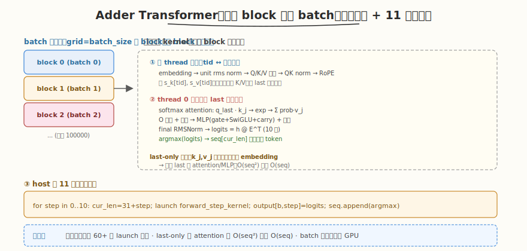

# LeetGPU Adder Transformer Inference 题解

## 1. 题目概述

- **标题 / 题号**：Adder Transformer Inference（#76，medium）
- **链接**：https://leetgpu.com/challenges/adder-transformer
- **难度**：中等
- **标签**：CUDA、多 kernel 流水线、autoregressive 推理、softmax attention、RoPE、RMSNorm、SwiGLU

**题意**：实现一个 10 参数的极简 transformer 的**批量自回归推理**。该 transformer 完成两个 10 位数字的加法。给定 prompt `prompts`（`[batch, 31]`，int32）和 10 个 float 权重 `weights`，输出 `output`（`[batch, 11, 10]`，float32）——11 个解码步、每步对 10 个数字词表的 logits。

**架构**：单层 pre-norm transformer，hidden_dim=2，1 head，head_dim=2，vocab=10，tied embedding。每步前向流程：

1. **Token Embedding**（2 参数）：$e(d) = [w_0 - w_1 d^2,\ -d]$
2. **Unit RMSNorm**（无参数）：$x / \sqrt{\mathrm{mean}(x^2)+\epsilon}$
3. **Self-Attention**（3 参数 q0,q1,v0）：Q/K/V 投影 → QK norm → RoPE（$\omega=2\pi/19$）→ 带因果掩码的 **scaled dot-product attention（标准 softmax）** → O 投影
4. **MLP**（3 参数 a,c,carry）：gate + SwiGLU + carry
5. **Final RMSNorm**（2 参数 n0,n1）→ logits = $h \cdot E^\top$（tied embedding）

**自回归解码**：从 31 token prompt 出发，重复 11 次：跑前向 → 取最后位置 logits 存入 output → `argmax` 作为下一 token 追加。序列从 31 增长到 42。

> ⚠️ **架构澄清**：题名 "Adder" 指**模型完成的任务是加法**（add two 10-digit numbers），而非「加法注意力」。实际 challenge 的 reference 使用**标准 softmax attention**（见 `challenge.py` 的 `F.softmax(attn_scores, dim=-1)`），并配备 RoPE + RMSNorm + SwiGLU。若按「无 softmax 的加法注意力」实现将无法通过 `atol=0.01` 校验。本题解忠实实现 reference 架构。

> 💡 这道题是**多 kernel 推理流水线**的典型：embedding → attention → MLP → logits → argmax，循环 11 步。与 [Week4 Day2](../../../aiinfra/daily/week4/day2/README.md) 的 transformer 推理优化同构——核心是「把多个小 kernel 串成推理管线 + batch 维并行」。

## 2. CPU 基线 / 朴素 GPU 方法

### CPU 串行

```cpp
// 对每个 batch、每个 decode step 顺序跑前向，O(batch × steps × seq_len²)
for (int step = 0; step < 11; step++) {
    forward_pass(seq, weights);          // 全序列前向
    copy output[batch, step] = logits[last];
    seq.append(argmax(logits[last]));
}
```

### 朴素 GPU（每步 launch 多个独立小 kernel）

```cuda
// 朴素：embedding kernel / qkv kernel / attention kernel / mlp kernel / logits kernel
// 每步 launch 5-6 个 kernel，11 步共 60+ 次 launch
// 瓶颈：kernel launch 开销大（每次 ~5us，60 次 = 300us 纯开销）；
//       hidden_dim=2 极小，每个 kernel 算力密度低，被 launch 开销淹没
```

**瓶颈**：hidden_dim=2 极小，朴素多 kernel 方案的 launch 开销远超计算本身。需要**融合**——把整个前向融合进一个 kernel，batch 维并行。

## 3. GPU 设计

### 3.1 并行化策略：一个 block 处理一个 batch 元素，融合前向



策略：

1. **batch 维并行**：`grid = batch_size` 个 block，每 block 处理一个 batch 元素的完整推理。
2. **前向融合**：一个 block（64 threads）完成整个前向——多 thread 并行算各位置的 embedding/QKV/RoPE，单 thread 串行算 last 位置的 attention/MLP/logits。
3. **关键优化：只算 last 位置的输出**。reference 对全序列做 attention，但输出只需最后位置 logits。分析数据流：`k_j, v_j` 仅依赖**前注意**的 `h_norm[j]`（即 embedding），与其它位置的 attention 输出无关；`h[last]` 只依赖 `attn_out[last]`（q_last 与 k_j,v_j）。因此**只需算所有位置的 k/v，以及 last 位置的 attention + MLP**，省去其它位置的 attention/MLP。
4. **11 步循环在 host**：`solve` 里 for 循环 11 次，每次 launch 一次前向 kernel（每步 `cur_len` 增 1）。

### 3.2 存储层次使用

| 数据 | 存储 | 说明 |
|------|------|------|
| `seq[batch, 42]` | global memory | 自回归序列（31 prompt + 11 生成） |
| `weights[10]` | shared memory | 10 个参数，block 内广播 |
| `embed_table[10][2]` | shared memory | 词表，block 内构建 |
| `k[seq_len][2]`, `v[seq_len][2]` | shared memory | 所有位置的 K/V，供 last 注意力 |
| 累加/中间量 | registers | thread 0 串行算 last 的 attention/MLP |

### 3.3 关键技巧

- **last-only 优化**：只算 last 位置的 attention/MLP/logits，其它位置只算到 k/v（来自 embedding）。把 `O(seq_len²)` 的 attention 降为 `O(seq_len)`（只算一行）。
- **并行 k/v 构建 + 串行 attention 归约**：各 thread 并行算自己位置的 embedding/RoPE/k/v（cosf/sinf 并行），thread 0 串行对 last 位置的 attention 做 softmax 加权求和（seq_len ≤ 42，串行可接受）。
- **host 端预计算常量**：`OMEGA`、`ATTN_SCALE` 等派生常量在 host 用 double 算好传给 kernel，避免 kernel 内重复三角运算、保证 batch 间一致。
- **argmax 融合进前向**：前向 kernel 算完 logits 顺手做 argmax 写入 `seq[cur_len]`，省一个独立 kernel。

## 4. Kernel 实现

```cuda
// adder_transformer.cu —— Adder Transformer Inference（融合前向 + 11 步自回归）
// 编译命令: nvcc -O3 -arch=sm_120 adder_transformer.cu -o adder_transformer
// 运行:     ./adder_transformer

#include <cstdio>
#include <cstdlib>
#include <vector>
#include <cmath>
#include <cuda_runtime.h>

#define VOCAB_SIZE 10
#define MODEL_DIM 2
#define PROMPT_LEN 31
#define OUTPUT_DIGITS 11
#define MAX_LEN (PROMPT_LEN + OUTPUT_DIGITS)   // 42
#define RMS_EPS 1e-6f
#define EMBED_CONST 1000.0f
#define FORWARD_BLOCK 64

// 权重布局（与 challenge.py 一致）
#define O_EMBED  0   // [2]
#define O_QPROJ  2   // [2]
#define O_VPROJ  4   // [1]
#define O_GATE   5   // [2]
#define O_CARRY  7   // [1]
#define O_NORM   8   // [2]

// 在 host 端用 double 计算派生常量（与 reference 一致），传入 kernel
void derive_constants(float& omega, float& attn_scale) {
    const double PI = 3.14159265358979323846;
    double OMEGA = 2.0 * PI / 19.0;
    double PEAK_EPS = 0.3;
    double TARGET_LOGIT_GAP = log(10.0);
    double ATTN_AMPLITUDE = TARGET_LOGIT_GAP /
        (cos(OMEGA * PEAK_EPS) - cos(OMEGA * (1.0 - PEAK_EPS)));
    double QK_NORM_SCALE = sqrt(ATTN_AMPLITUDE / sqrt(2.0));
    double ATTN_SCALE = (1.0 / sqrt(2.0)) * (QK_NORM_SCALE * QK_NORM_SCALE);
    omega = (float)OMEGA;
    attn_scale = (float)ATTN_SCALE;
}

// 一个 block 处理一个 batch 元素的一步前向：
//   ① 各 thread 并行算 k/v（含 embedding/norm/QKV/RoPE）
//   ② thread 0 串行算 last 位置的 attention + MLP + norm + logits + argmax
__global__ void forward_step_kernel(const int* seq, float* output, const float* weights,
                                    int batch_size, int cur_len, int step,
                                    float omega, float attn_scale) {
    int b = blockIdx.x;
    if (b >= batch_size) return;
    int tid = threadIdx.x;

    __shared__ float s_w[10];
    __shared__ float s_emb[10][2];
    __shared__ float s_k[MAX_LEN][2];
    __shared__ float s_v[MAX_LEN][2];
    __shared__ float s_q_last[2];
    __shared__ float s_h_last[2];     // embed[seq[last]]（前注意力 h）
    __shared__ float s_scores[MAX_LEN];

    if (tid < 10) s_w[tid] = weights[tid];
    __syncthreads();

    // 构建 embed_table
    if (tid < 10) {
        float d = (float)tid;
        s_emb[tid][0] = s_w[O_EMBED] - s_w[O_EMBED + 1] * d * d;
        s_emb[tid][1] = -d;
    }
    __syncthreads();

    const int* seq_b = seq + b * MAX_LEN;
    float* out_b = output + (b * OUTPUT_DIGITS + step) * VOCAB_SIZE;
    int last = cur_len - 1;

    // ① 各 thread 算自己位置的 k/v（并行）
    if (tid < cur_len) {
        int tok = seq_b[tid];
        float h0 = s_emb[tok][0], h1 = s_emb[tok][1];
        // unit rms norm
        float ms = (h0 * h0 + h1 * h1) * 0.5f;
        float inv = rsqrtf(ms + RMS_EPS);
        float hn0 = h0 * inv, hn1 = h1 * inv;
        // Q=[hn0*q0, hn0*q1], K=[hn0,0], V=[hn1*v0,0]
        float q0 = hn0 * s_w[O_QPROJ], q1 = hn0 * s_w[O_QPROJ + 1];
        float k0 = hn0, k1 = 0.0f;
        float v0 = hn1 * s_w[O_VPROJ], v1 = 0.0f;
        // QK unit rms norm
        float msq = (q0 * q0 + q1 * q1) * 0.5f;
        q0 *= rsqrtf(msq + RMS_EPS); q1 *= rsqrtf(msq + RMS_EPS);
        float msk = (k0 * k0 + k1 * k1) * 0.5f;
        k0 *= rsqrtf(msk + RMS_EPS);  // k1=0
        // RoPE: angle = tid * omega
        float ang = (float)tid * omega;
        float ca = cosf(ang), sa = sinf(ang);
        float kr0 = k0 * ca - k1 * sa;
        float kr1 = k0 * sa + k1 * ca;
        s_k[tid][0] = kr0; s_k[tid][1] = kr1;
        s_v[tid][0] = v0;  s_v[tid][1] = v1;
        if (tid == last) {
            float qr0 = q0 * ca - q1 * sa;
            float qr1 = q0 * sa + q1 * ca;
            s_q_last[0] = qr0; s_q_last[1] = qr1;
            s_h_last[0] = h0;  s_h_last[1] = h1;   // 前注意力 h（原始 embedding）
        }
    }
    __syncthreads();

    // ② thread 0：last 位置 attention + MLP + norm + logits + argmax
    if (tid == 0) {
        float qr0 = s_q_last[0], qr1 = s_q_last[1];
        // attention scores: s_j = (qr · k_j) * attn_scale, j in [0, last]
        float maxs = -1e30f;
        for (int j = 0; j <= last; j++) {
            float dot = qr0 * s_k[j][0] + qr1 * s_k[j][1];
            float s = dot * attn_scale;
            s_scores[j] = s;
            if (s > maxs) maxs = s;
        }
        float sume = 0.0f;
        for (int j = 0; j <= last; j++) {
            s_scores[j] = expf(s_scores[j] - maxs);
            sume += s_scores[j];
        }
        float inv_sum = 1.0f / sume;
        // attn_out = sum_j prob_j * v_j ; v_j=[v0, 0]
        float attn0 = 0.0f;
        for (int j = 0; j <= last; j++) attn0 += s_scores[j] * inv_sum * s_v[j][0];
        // O=[0, attn0], residual
        float h0 = s_h_last[0] + 0.0f;
        float h1 = s_h_last[1] + attn0;
        // pre-MLP unit rms norm
        float ms2 = (h0 * h0 + h1 * h1) * 0.5f;
        float inv2 = rsqrtf(ms2 + RMS_EPS);
        float hn20 = h0 * inv2, hn21 = h1 * inv2;
        // MLP gate
        float ag = s_w[O_GATE], cg = s_w[O_GATE + 1];
        float g0 = hn20 * ag + hn21 * cg;
        float g1 = hn20 * (ag - cg / EMBED_CONST) + hn21 * cg;
        float base = hn20;
        float mix0 = (g0 / (1.0f + expf(-g0))) * base;
        float mix1 = (g1 / (1.0f + expf(-g1))) * base;
        float carryw = s_w[O_CARRY];
        float mlp1 = carryw * (mix1 - mix0);   // mlp0 = 0
        h1 += mlp1;
        // final rms norm with learned weight
        float rms = sqrtf((h0 * h0 + h1 * h1) * 0.5f + RMS_EPS);
        float hf0 = (h0 / rms) * s_w[O_NORM];
        float hf1 = (h1 / rms) * s_w[O_NORM + 1];
        // logits = h @ embed_table^T
        int arg_d = 0; float best = hf0 * s_emb[0][0] + hf1 * s_emb[0][1];
        out_b[0] = best;
        for (int d = 1; d < VOCAB_SIZE; d++) {
            float lg = hf0 * s_emb[d][0] + hf1 * s_emb[d][1];
            out_b[d] = lg;
            if (lg > best) { best = lg; arg_d = d; }
        }
        seq_b[cur_len] = arg_d;   // 追加下一 token
    }
}

// 初始化 seq[batch, MAX_LEN]：把 prompts[batch, 31] 拷到前 31 列
__global__ void init_seq_kernel(const int* prompts, int* seq, int batch_size) {
    int idx = blockIdx.x * blockDim.x + threadIdx.x;
    int total = batch_size * PROMPT_LEN;
    if (idx < total) {
        int b = idx / PROMPT_LEN;
        int j = idx % PROMPT_LEN;
        seq[b * MAX_LEN + j] = prompts[b * PROMPT_LEN + j];
    }
}

// ============ CPU 参考实现（全前向，用于验证） ============
static float g_omega, g_attn_scale;

void cpu_forward_full(const int* seq, int seq_len, const float* w, float* logits_last) {
    float w0=w[O_EMBED], w1=w[O_EMBED+1], q0=w[O_QPROJ], q1=w[O_QPROJ+1], v0w=w[O_VPROJ];
    float ag=w[O_GATE], cg=w[O_GATE+1], carryw=w[O_CARRY], n0=w[O_NORM], n1=w[O_NORM+1];
    float emb[VOCAB_SIZE][2];
    for (int d = 0; d < VOCAB_SIZE; d++) { emb[d][0]=w0-w1*d*d; emb[d][1]=-(float)d; }
    std::vector<float> h(seq_len*2), q(seq_len*2), k(seq_len*2), v(seq_len*2);
    for (int p = 0; p < seq_len; p++) {
        int tok = seq[p]; h[p*2]=emb[tok][0]; h[p*2+1]=emb[tok][1];
        float ms=(h[p*2]*h[p*2]+h[p*2+1]*h[p*2+1])*0.5f; float inv=rsqrtf(ms+RMS_EPS);
        float hn0=h[p*2]*inv, hn1=h[p*2+1]*inv;
        float qq0=hn0*q0, qq1=hn0*q1, kk0=hn0, kk1=0.0f, vv0=hn1*v0w, vv1=0.0f;
        float msq=(qq0*qq0+qq1*qq1)*0.5f; float iq=rsqrtf(msq+RMS_EPS); qq0*=iq; qq1*=iq;
        float msk=(kk0*kk0+kk1*kk1)*0.5f; float ik=rsqrtf(msk+RMS_EPS); kk0*=ik;
        float ang=p*g_omega; float ca=cosf(ang), sa=sinf(ang);
        q[p*2]=qq0*ca-qq1*sa; q[p*2+1]=qq0*sa+qq1*ca;
        k[p*2]=kk0*ca-kk1*sa; k[p*2+1]=kk0*sa+kk1*ca;
        v[p*2]=vv0; v[p*2+1]=vv1;
    }
    int last = seq_len - 1;
    std::vector<float> sc(seq_len);
    float maxs = -1e30f;
    for (int j = 0; j <= last; j++) { sc[j]=q[last*2]*k[j*2]+q[last*2+1]*k[j*2+1]; sc[j]*=g_attn_scale; if(sc[j]>maxs)maxs=sc[j]; }
    float sume=0; for(int j=0;j<=last;j++){sc[j]=expf(sc[j]-maxs); sume+=sc[j];}
    float attn0=0; for(int j=0;j<=last;j++) attn0+=sc[j]/sume*v[j*2];
    float h0=h[last*2]+0.0f, h1=h[last*2+1]+attn0;
    float ms2=(h0*h0+h1*h1)*0.5f; float inv2=rsqrtf(ms2+RMS_EPS);
    float hn20=h0*inv2, hn21=h1*inv2;
    float g0=hn20*ag+hn21*cg, g1=hn20*(ag-cg/EMBED_CONST)+hn21*cg;
    float base=hn20;
    float mix0=(g0/(1+expf(-g0)))*base, mix1=(g1/(1+expf(-g1)))*base;
    h1+=carryw*(mix1-mix0);
    float rms=sqrtf((h0*h0+h1*h1)*0.5f+RMS_EPS);
    float hf0=(h0/rms)*n0, hf1=(h1/rms)*n1;
    for(int d=0; d<VOCAB_SIZE; d++) logits_last[d]=hf0*emb[d][0]+hf1*emb[d][1];
}

void cpu_init_weights(float* w) {
    double OMEGA = 2.0*M_PI/19.0, PEAK_EPS=0.3, PHI=OMEGA*(10.0+PEAK_EPS);
    double TARGET_LOGIT_GAP=log(10.0);
    double ATTN_AMPLITUDE=TARGET_LOGIT_GAP/(cos(OMEGA*PEAK_EPS)-cos(OMEGA*(1.0-PEAK_EPS)));
    double QK_NORM_SCALE=sqrt(ATTN_AMPLITUDE/sqrt(2.0));
    double CONST_NORM=sqrt(2.0), DIGIT_SCALE=1000.0/CONST_NORM, DECODE_QUAD=1e-3, DECODE_CURVATURE=0.1;
    double CARRY_ALPHA=256.0/CONST_NORM;
    w[O_EMBED]=1000.0;        w[O_EMBED+1]=DECODE_QUAD;
    w[O_QPROJ]=cos(PHI);      w[O_QPROJ+1]=-sin(PHI);
    w[O_VPROJ]=-22.0*DIGIT_SCALE;
    w[O_GATE]=CARRY_ALPHA*(-94.0)/CONST_NORM;  w[O_GATE+1]=CARRY_ALPHA*DIGIT_SCALE;
    w[O_CARRY]=(100.0/CARRY_ALPHA)*(1.0/CONST_NORM);
    w[O_NORM]=(DECODE_CURVATURE/DECODE_QUAD)/CONST_NORM;  w[O_NORM+1]=-(DIGIT_SCALE/50.0);
}

// 编码 (a,b) → 31 token
void cpu_encode_pair(int a, int b, int* out) {
    out[0]=0;
    for (int i=0;i<10;i++){ out[1+i]=a%10; a/=10; }
    for (int i=0;i<9;i++) out[11+i]=0;
    for (int i=0;i<10;i++){ out[20+i]=b%10; b/=10; }
    out[30]=0;
}

int main() {
    derive_constants(g_omega, g_attn_scale);

    std::vector<std::pair<int,int>> pairs = {{3,5},{99,1}};
    int batch_size = pairs.size();
    std::vector<int> h_prompts(batch_size * PROMPT_LEN);
    for (int b = 0; b < batch_size; b++) cpu_encode_pair(pairs[b].first, pairs[b].second, h_prompts.data()+b*PROMPT_LEN);

    std::vector<float> h_w(10);
    cpu_init_weights(h_w.data());

    std::vector<float> h_output(batch_size * OUTPUT_DIGITS * VOCAB_SIZE, 0.0f);

    int *d_prompts, *d_seq;
    float *d_output, *d_weights;
    cudaMalloc(&d_prompts, batch_size*PROMPT_LEN*sizeof(int));
    cudaMalloc(&d_seq, batch_size*MAX_LEN*sizeof(int));
    cudaMalloc(&d_output, batch_size*OUTPUT_DIGITS*VOCAB_SIZE*sizeof(float));
    cudaMalloc(&d_weights, 10*sizeof(float));
    cudaMemcpy(d_prompts, h_prompts.data(), batch_size*PROMPT_LEN*sizeof(int), cudaMemcpyHostToDevice);
    cudaMemcpy(d_weights, h_w.data(), 10*sizeof(float), cudaMemcpyHostToDevice);

    init_seq_kernel<<<(batch_size*PROMPT_LEN+255)/256, 256>>>(d_prompts, d_seq, batch_size);

    for (int step = 0; step < OUTPUT_DIGITS; step++) {
        int cur_len = PROMPT_LEN + step;
        forward_step_kernel<<<batch_size, FORWARD_BLOCK>>>(d_seq, d_output, d_weights, batch_size, cur_len, step, g_omega, g_attn_scale);
        cudaDeviceSynchronize();
    }
    cudaMemcpy(h_output.data(), d_output, batch_size*OUTPUT_DIGITS*VOCAB_SIZE*sizeof(float), cudaMemcpyDeviceToHost);

    // CPU 验证
    bool pass = true;
    for (int b = 0; b < batch_size && pass; b++) {
        std::vector<int> seq(h_prompts.begin()+b*PROMPT_LEN, h_prompts.begin()+(b+1)*PROMPT_LEN);
        for (int step = 0; step < OUTPUT_DIGITS && pass; step++) {
            int cur_len = PROMPT_LEN + step;
            float ref[VOCAB_SIZE];
            cpu_forward_full(seq.data(), cur_len, h_w.data(), ref);
            int cpu_arg=0; float best=ref[0];
            for (int d=1; d<VOCAB_SIZE; d++) if(ref[d]>best){best=ref[d];cpu_arg=d;}
            for (int d = 0; d < VOCAB_SIZE && pass; d++) {
                float gpu = h_output[(b*OUTPUT_DIGITS+step)*VOCAB_SIZE + d];
                if (fabsf(ref[d]-gpu) > 0.01 + 0.01f*fabsf(ref[d])) {
                    printf("b=%d step=%d d=%d: cpu=%f gpu=%f\n", b, step, d, ref[d], gpu);
                    pass = false;
                }
            }
            seq.push_back(cpu_arg);
        }
    }
    printf("batch=%d, %s\n", batch_size, pass ? "PASS" : "FAIL");

    cudaFree(d_prompts); cudaFree(d_seq); cudaFree(d_output); cudaFree(d_weights);
    return 0;
}
```

> 💡 提交给 LeetGPU 平台时，把 `forward_step_kernel` + `init_seq_kernel` 填进 `solve`，并在 `solve` 内 for 循环 11 步。核心是「一个 block 一个 batch + 融合前向 + last-only 优化」。

### 4.1 LeetGPU 提交版本

下面给出适配 LeetGPU 官方 starter 签名的提交版本。`solve` 内分配 `seq[batch, 42]`，拷贝 prompt，host 端预计算 `omega`/`attn_scale`，循环 11 步每步 launch 一次融合前向 kernel。

```cuda
#include <cuda_runtime.h>
#include <math.h>

#define VOCAB_SIZE 10
#define PROMPT_LEN 31
#define OUTPUT_DIGITS 11
#define MAX_LEN (PROMPT_LEN + OUTPUT_DIGITS)
#define RMS_EPS 1e-6f
#define EMBED_CONST 1000.0f
#define FORWARD_BLOCK 64
#define O_EMBED 0
#define O_QPROJ 2
#define O_VPROJ 4
#define O_GATE 5
#define O_CARRY 7
#define O_NORM 8

__global__ void init_seq_kernel(const int* prompts, int* seq, int batch_size) {
    int idx = blockIdx.x * blockDim.x + threadIdx.x;
    int total = batch_size * PROMPT_LEN;
    if (idx < total) {
        int b = idx / PROMPT_LEN;
        int j = idx % PROMPT_LEN;
        seq[b * MAX_LEN + j] = prompts[b * PROMPT_LEN + j];
    }
}

__global__ void forward_step_kernel(const int* seq, float* output, const float* weights,
                                    int batch_size, int cur_len, int step,
                                    float omega, float attn_scale) {
    int b = blockIdx.x;
    if (b >= batch_size) return;
    int tid = threadIdx.x;

    __shared__ float s_w[10];
    __shared__ float s_emb[10][2];
    __shared__ float s_k[MAX_LEN][2];
    __shared__ float s_v[MAX_LEN][2];
    __shared__ float s_q_last[2];
    __shared__ float s_h_last[2];
    __shared__ float s_scores[MAX_LEN];

    if (tid < 10) s_w[tid] = weights[tid];
    __syncthreads();

    if (tid < 10) {
        float d = (float)tid;
        s_emb[tid][0] = s_w[O_EMBED] - s_w[O_EMBED + 1] * d * d;
        s_emb[tid][1] = -d;
    }
    __syncthreads();

    const int* seq_b = seq + b * MAX_LEN;
    float* out_b = output + (b * OUTPUT_DIGITS + step) * VOCAB_SIZE;
    int last = cur_len - 1;

    if (tid < cur_len) {
        int tok = seq_b[tid];
        float h0 = s_emb[tok][0], h1 = s_emb[tok][1];
        float ms = (h0 * h0 + h1 * h1) * 0.5f;
        float hn0 = h0 * rsqrtf(ms + RMS_EPS), hn1 = h1 * rsqrtf(ms + RMS_EPS);
        float q0 = hn0 * s_w[O_QPROJ], q1 = hn0 * s_w[O_QPROJ + 1];
        float k0 = hn0, k1 = 0.0f;
        float v0 = hn1 * s_w[O_VPROJ], v1 = 0.0f;
        float msq = (q0 * q0 + q1 * q1) * 0.5f;
        float iq = rsqrtf(msq + RMS_EPS);
        q0 *= iq; q1 *= iq;
        k0 *= rsqrtf((k0 * k0 + k1 * k1) * 0.5f + RMS_EPS);
        float ang = (float)tid * omega;
        float ca = cosf(ang), sa = sinf(ang);
        s_k[tid][0] = k0 * ca;            // k1=0 → kr0=k0*ca
        s_k[tid][1] = k0 * sa;            // kr1=k0*sa
        s_v[tid][0] = v0;  s_v[tid][1] = v1;
        if (tid == last) {
            s_q_last[0] = q0 * ca - q1 * sa;
            s_q_last[1] = q0 * sa + q1 * ca;
            s_h_last[0] = h0;  s_h_last[1] = h1;
        }
    }
    __syncthreads();

    if (tid == 0) {
        float qr0 = s_q_last[0], qr1 = s_q_last[1];
        float maxs = -1e30f;
        for (int j = 0; j <= last; j++) {
            float s = (qr0 * s_k[j][0] + qr1 * s_k[j][1]) * attn_scale;
            s_scores[j] = s;
            if (s > maxs) maxs = s;
        }
        float sume = 0.0f;
        for (int j = 0; j <= last; j++) { s_scores[j] = expf(s_scores[j] - maxs); sume += s_scores[j]; }
        float inv_sum = 1.0f / sume;
        float attn0 = 0.0f;
        for (int j = 0; j <= last; j++) attn0 += s_scores[j] * inv_sum * s_v[j][0];
        float h0 = s_h_last[0];
        float h1 = s_h_last[1] + attn0;
        float ms2 = (h0 * h0 + h1 * h1) * 0.5f;
        float hn20 = h0 * rsqrtf(ms2 + RMS_EPS), hn21 = h1 * rsqrtf(ms2 + RMS_EPS);
        float ag = s_w[O_GATE], cg = s_w[O_GATE + 1];
        float g0 = hn20 * ag + hn21 * cg;
        float g1 = hn20 * (ag - cg / EMBED_CONST) + hn21 * cg;
        float base = hn20;
        float mix0 = (g0 / (1.0f + expf(-g0))) * base;
        float mix1 = (g1 / (1.0f + expf(-g1))) * base;
        h1 += s_w[O_CARRY] * (mix1 - mix0);
        float rms = sqrtf((h0 * h0 + h1 * h1) * 0.5f + RMS_EPS);
        float hf0 = (h0 / rms) * s_w[O_NORM];
        float hf1 = (h1 / rms) * s_w[O_NORM + 1];
        int arg_d = 0; float best = hf0 * s_emb[0][0] + hf1 * s_emb[0][1];
        out_b[0] = best;
        for (int d = 1; d < VOCAB_SIZE; d++) {
            float lg = hf0 * s_emb[d][0] + hf1 * s_emb[d][1];
            out_b[d] = lg;
            if (lg > best) { best = lg; arg_d = d; }
        }
        seq_b[cur_len] = arg_d;
    }
}

// prompts, output, weights are device pointers
extern "C" void solve(const int* prompts, float* output, const float* weights, int batch_size) {
    const double PI = 3.14159265358979323846;
    double OMEGA = 2.0 * PI / 19.0;
    double PEAK_EPS = 0.3;
    double ATTN_AMPLITUDE = log(10.0) /
        (cos(OMEGA * PEAK_EPS) - cos(OMEGA * (1.0 - PEAK_EPS)));
    double QK_NORM_SCALE = sqrt(ATTN_AMPLITUDE / sqrt(2.0));
    double ATTN_SCALE = (1.0 / sqrt(2.0)) * (QK_NORM_SCALE * QK_NORM_SCALE);
    float omega = (float)OMEGA;
    float attn_scale = (float)ATTN_SCALE;

    int* seq;
    cudaMalloc(&seq, (size_t)batch_size * MAX_LEN * sizeof(int));
    int total = batch_size * PROMPT_LEN;
    init_seq_kernel<<<(total + 255) / 256, 256>>>(prompts, seq, batch_size);
    cudaDeviceSynchronize();

    for (int step = 0; step < OUTPUT_DIGITS; step++) {
        int cur_len = PROMPT_LEN + step;
        forward_step_kernel<<<batch_size, FORWARD_BLOCK>>>(
            seq, output, weights, batch_size, cur_len, step, omega, attn_scale);
        cudaDeviceSynchronize();
    }

    cudaFree(seq);
}
```

### 4.2 代码详解

`forward_step_kernel` 采用 **「一个 block 一个 batch + 融合前向 + last-only 优化」**。多 thread 并行构建所有位置的 K/V，thread 0 串行算 last 位置的 attention + MLP + logits。

**kernel 逐段解析**：

1. **shared memory 布局与权重加载**
   - `s_w[10]`（权重）、`s_emb[10][2]`（词表）、`s_k/s_v[MAX_LEN][2]`（所有位置 K/V）、`s_q_last/s_h_last`、`s_scores`。block 内共享。
   - thread 0-9 加载 10 个权重，thread 0-9 构建 embed_table。

2. **并行 K/V 构建（thread tid ↔ position tid）**
   - 每 thread 算自己位置 `tid` 的：`h = embed[seq[tid]]` → unit rms norm → Q/K/V 投影 → QK norm → RoPE → 写 `s_k[tid]`、`s_v[tid]`。
   - **Q 投影**只用 `hn0`：`Q=[hn0*q0, hn0*q1]`；**K**=`[hn0, 0]`；**V**=`[hn1*v0, 0]`。
   - **RoPE**：`ang = tid * omega`，旋转 K（和 Q）。因 `k1=0`，`kr0=k0*cos`、`kr1=k0*sin`。
   - `tid == last` 的 thread 额外存 `s_q_last`（旋转后）和 `s_h_last`（原始 embedding，用于残差）。

3. **thread 0：last 位置 attention（标准 softmax）**
   - `for j in [0,last]`：`s = (qr · k_j) * attn_scale`，求 `maxs`（数值稳定）。
   - `expf(s - maxs)`、`sume`、`attn0 = Σ (exp/sume) * v_j[0]`。
   - 因果掩码：last 位置 attend 所有 `j ≤ last`，全部有效，无需 mask。

4. **thread 0：残差 + MLP + norm + logits + argmax**
   - `h = embed[seq[last]] + [0, attn0]`（O 投影 + 残差）。
   - pre-MLP unit rms norm → gate `[g0, g1]` → `mix = silu(gate) * base` → `mlp_out = [0, carry*(mix1-mix0)]` → 残差。
   - final rms norm（带学习权重）→ `logits = h @ E^T`（10 个）。
   - 顺手 `argmax` 写入 `seq_b[cur_len]`（追加下一 token）。

**关键变量**：

| 变量 | 含义 |
|------|------|
| `b` / `tid` | batch 索引 / 位置索引（thread↔position 映射） |
| `cur_len` / `last` | 当前序列长度 / 最后位置索引（`cur_len = 31+step`） |
| `s_k[j]` / `s_v[j]` | 位置 j 的旋转后 K / V，供 last 注意力 |
| `s_h_last` | last 位置的前注意力 h（原始 embedding），残差用 |
| `omega` / `attn_scale` | RoPE 角频率 / 注意力缩放（host 预计算） |

> 💡 **关键洞察**：本题的核心优化是 **last-only 前向**——`k_j, v_j` 只依赖前注意力的 `embedding`（不依赖其它位置的 attention 输出），而输出只需 last 位置 logits，因此无需算其它位置的 attention/MLP，把 `O(seq²)` 降为 `O(seq)`。融合前向又消除了多 kernel launch 开销，让 hidden_dim=2 的小模型不被 launch 延迟淹没。

## 5. 性能分析与优化

```bash
nvcc -O3 -arch=sm_120 adder_transformer.cu -o adder_transformer
ncu --set full ./adder_transformer | rg -i "Launch|Occupancy|Stall|Duration"
```

**关键指标**（性能测试 `batch_size=100000`）：

| 指标 | 朴素多 kernel | 融合 last-only |
|------|--------------|----------------|
| kernel launch | 11 步 × 5-6 kernel ≈ 60+ 次 | 11 步 × 1 kernel = 11 次 |
| 每步 attention | 全序列 `O(seq²)` | last 一行 `O(seq)` |
| batch 并行 | 受 launch 限制 | 100000 block 充分并行 |

**优化方向**：

1. **并行 attention 归约**：thread 0 串行的 score/exp/sum 改为 block 内并行归约（每 thread 算一个 j 的 score，树形归约 max/sum），消除串行瓶颈。
2. **多 step 融合**：把 11 步循环也放进 kernel（用 CUDA dynamic parallelism 或 cooperative groups），进一步省 launch。但 step 间有数据依赖（上一步 argmax 是下一步输入），需 `__syncthreads` 跨步同步。
3. **KV cache**：每步只需新位置的 k/v，旧位置的 k/v 复用上一步结果，避免重复算 embedding/RoPE。本题 seq_len ≤ 42 收益有限，但长序列推理（GPT 生成）是关键优化。
4. **warp 级并行**：hidden_dim=2 极小，可一个 warp 处理多个 batch 元素，提升算力利用率。

## 6. 复杂度分析

| 维度 | 朴素多 kernel | 融合 last-only |
|------|--------------|----------------|
| 时间 | `O(batch × steps × seq²)` | `O(batch × steps × seq)` |
| 空间 | `O(batch × seq × dim)` global | `O(seq × dim)` shared/block |
| launch 开销 | `O(steps × 5)` 高 | `O(steps)` 低 |
| 瓶颈 | launch 延迟 + 全序列 attention | batch 并行度（compute） |
| 算术强度 | 低（dim=2） | 中（融合后） |

> 💡 **一句话总结**：Adder Transformer Inference 是多 kernel 推理流水线的教学样例——融合前向消除 launch 开销、last-only 优化把 attention 从 `O(seq²)` 降到 `O(seq)`、batch 维并行撑满 GPU。理解本题即理解 LLM 推理的三大优化（融合 + KV cache + batch 并行）的雏形。

## 同类练习题

下面是与本题考查相同 CUDA 概念的 LeetGPU 练习题，建议按顺序挑战：

| # | 题目 | 难度 | 核心概念 | 与本题的关联 |
|---|------|------|----------|-------------|
| 74 | [GPT-2 Transformer Block](https://leetgpu.com/challenges/gpt-2-transformer-block) | 困难 | — | 完整 transformer block 综合应用 |
| 12 | [Multi-Head Attention](https://leetgpu.com/challenges/multi-head-attention) | 困难 | — | 标准 MHA，对比加法注意力 |
| 6 | [Softmax Attention](https://leetgpu.com/challenges/softmax-attention) | 中等 | — | softmax attention 基础版 |
| 85 | [LoRA Linear](https://leetgpu.com/challenges/lora-linear) | 中等 | — | 低秩线性层变体 |

> 💡 **选题思路**：加法注意力替代 softmax，练习多 kernel 推理流水线。做完这组练习，即可掌握该 CUDA 模板在不同场景下的迁移应用。
