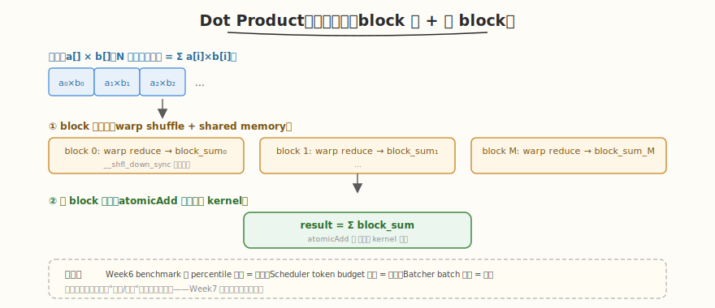

# LeetGPU Dot Product 题解

## 1. 题目概述

- **标题 / 题号**：Dot Product（#17，medium）
- **链接**：https://leetgpu.com/challenges/dot-product
- **难度**：中等
- **标签**：CUDA、归约（reduction）、warp shuffle、block 归约、kernel 融合

**题意**：给定两个长度为 `N` 的 `float` 向量 `a[]` 和 `b[]`，计算点积 `result = Σ(a[i] × b[i])`。

**示例**：

```text
a = [1, 2, 3, 4], b = [4, 3, 2, 1]
result = 1×4 + 2×3 + 3×2 + 4×1 = 4+6+6+4 = 20
```

**约束**：`1 ≤ N ≤ 10^7`；性能测试取大 `N`。

> 💡 这道题的**两级归约**（block 内 + 跨 block）是 [Week6 总结](../../aiinfra/week6/day7/README.md) 中所有"累加/统计"操作的底层模板——benchmark 的 `percentile()` 统计、Scheduler 的 token budget 累加、Continuous Batcher 的 batch 聚合，本质都是 dot product 式的归约。

## 2. CPU 基线 / 朴素 GPU 方法

### CPU 串行

```cpp
// 顺序累乘累加，O(N)
float result = 0;
for (int i = 0; i < N; i++)
    result += a[i] * b[i];
```

### 朴素 GPU（单 thread 串行）

```cuda
// 一个 thread 算完全部——无并行，比 CPU 还慢（有 launch 开销）
__global__ void naive_dot(const float* a, const float* b, float* result, int N) {
    float sum = 0;
    for (int i = 0; i < N; i++)
        sum += a[i] * b[i];
    *result = sum;
}
```

**瓶颈**：单 thread 串行，无并行，GPU 完全闲置。

## 3. GPU 设计

### 3.1 并行化策略：两级归约



经典两级归约：
1. **block 内归约**：每个 block 处理一段数据，block 内用 warp shuffle 树形归约得到 `block_sum`
2. **跨 block 归约**：所有 `block_sum` 用 `atomicAdd` 或第二遍 kernel 归约得到最终结果

### 3.2 存储层次使用

| 数据 | 存储 | 说明 |
|------|------|------|
| `a[]`, `b[]` | global memory | 合并访存 |
| 乘积中间值 | registers | 每 thread 算自己负责的元素乘积 |
| block 内归约 | shared memory + `__shfl_down_sync` | warp 树形归约 |
| block_sum | global memory（atomicAdd） | 跨 block 归约 |

### 3.3 关键技巧

- **warp shuffle `__shfl_down_sync`**：warp 内树形归约，零 bank conflict、零同步开销
- **block 两级归约**：warp 归约 → shared memory → 第一个 warp 归约 warp_sums → block_sum
- **kernel 融合**：乘法和归约在一个 kernel 完成（`a[i]*b[i]` 在归约前算，避免中间数组）
- **atomicAdd 跨 block**：简单但有竞争；大 N 时用两遍 kernel（先写 block_sums，再归约）

## 4. Kernel 实现

```cuda
// dot_product.cu —— Dot Product（两级归约：block 内 warp shuffle + 跨 block atomicAdd）
// 编译命令: nvcc -O3 -arch=sm_120 dot_product.cu -o dot_product
// 运行:     ./dot_product

#include <cstdio>
#include <cstdlib>
#include <vector>
#include <cuda_runtime.h>

#define BLOCK 256
#define WARP 32

// warp 内树形归约（__shfl_down_sync）
__device__ __forceinline__ float warp_reduce(float val) {
    #pragma unroll
    for (int offset = WARP / 2; offset > 0; offset /= 2)
        val += __shfl_down_sync(0xffffffff, val, offset);
    return val;
}

// block 内归约：每 thread 算一段乘积和 → warp 归约 → block 归约 → atomicAdd
__global__ void dot_product_kernel(const float* a, const float* b, float* result, int N) {
    int tid = blockIdx.x * blockDim.x + threadIdx.x;
    int lane = threadIdx.x & (WARP - 1);
    int warp_id = threadIdx.x / WARP;

    __shared__ float warp_sums[WARP];

    // 每 thread 算自己负责元素的乘积和（grid-stride）
    float sum = 0.0f;
    for (int i = tid; i < N; i += gridDim.x * blockDim.x) {
        sum += a[i] * b[i];
    }

    // warp 内归约
    sum = warp_reduce(sum);
    if (lane == 0)
        warp_sums[warp_id] = sum;
    __syncthreads();

    // 第一个 warp 归约 warp_sums
    if (warp_id == 0) {
        sum = (lane < blockDim.x / WARP) ? warp_sums[lane] : 0.0f;
        sum = warp_reduce(sum);
        if (lane == 0)
            atomicAdd(result, sum); // 跨 block 归约
    }
}

int main() {
    int N = 1000000;
    size_t bytes = N * sizeof(float);
    std::vector<float> h_a(N), h_b(N);
    srand(42);
    for (int i = 0; i < N; i++) {
        h_a[i] = (rand() % 100) / 100.0f;
        h_b[i] = (rand() % 100) / 100.0f;
    }

    float *d_a, *d_b, *d_result;
    cudaMalloc(&d_a, bytes);
    cudaMalloc(&d_b, bytes);
    cudaMalloc(&d_result, sizeof(float));
    cudaMemcpy(d_a, h_a.data(), bytes, cudaMemcpyHostToDevice);
    cudaMemcpy(d_b, h_b.data(), bytes, cudaMemcpyHostToDevice);
    float zero = 0.0f;
    cudaMemcpy(d_result, &zero, sizeof(float), cudaMemcpyHostToDevice);

    int blocks = (N + BLOCK - 1) / BLOCK;
    dot_product_kernel<<<blocks, BLOCK>>>(d_a, d_b, d_result, N);
    cudaDeviceSynchronize();

    float gpu_result;
    cudaMemcpy(&gpu_result, d_result, sizeof(float), cudaMemcpyDeviceToHost);

    // CPU 验证
    float cpu_result = 0;
    for (int i = 0; i < N; i++)
        cpu_result += h_a[i] * h_b[i];

    printf("GPU: %.4f, CPU: %.4f, %s\n", gpu_result, cpu_result,
           fabs(gpu_result - cpu_result) < 1e-2 ? "PASS" : "FAIL");

    cudaFree(d_a);
    cudaFree(d_b);
    cudaFree(d_result);
    return 0;
}
```

> 💡 提交给 LeetGPU 平台时，把 `dot_product_kernel` 填进 `solve`。核心是 `warp_reduce` 用 `__shfl_down_sync` 树形归约 + block 两级 + `atomicAdd` 跨 block。kernel 融合（乘法+归约一个 kernel）避免中间数组。

## 5. 性能分析与优化

```bash
nvcc -O3 -arch=sm_120 dot_product.cu -o dot_product
ncu --set full ./dot_product | rg -i "Memory Throughput|Occupancy| DRAM"
```

**关键指标**：

| 指标 | 朴素（单 thread） | 两级归约 |
|------|-----------------|---------|
| 并行度 | 1 thread | N threads |
| 归约步数 | N（串行） | `O(log WARP)` + `O(log blocks)` |
| 带宽利用 | 极低 | 高（合并访存） |
| 融合 | 无（需中间数组） | 有（乘+归约一体） |

**优化方向**：

1. **两遍 kernel 替代 atomicAdd**：block 数多时 atomicAdd 竞争严重，先写 `block_sums[]` 再第二遍归约
2. **vectorized load**：`float4` 一次读 4 个 float，提升带宽
3. **多元素/thread**：每 thread 处理 4-8 个元素（grid-stride），减少 launch 开销
4. **warp 粒度调优**：`BLOCK=256`（8 warps）在多数 GPU 上带宽最优

## 6. 复杂度分析

| 维度 | 朴素 | 两级归约 |
|------|------|---------|
| 时间 | `O(N)`（串行） | `O(N)`（并行，常数小） |
| 空间 | `O(1)` | `O(WARP)` shared/block |
| 算术强度 | 低 | 高（乘+加融合） |
| 瓶颈 | 无并行 | DRAM 带宽（memory-bound） |

> 💡 **一句话总结**：Dot Product 是归约的最简形式——warp shuffle 树形归约 + block 两级 + atomicAdd 跨 block。它是 Week 6 所有累加/统计操作的底层模板（benchmark percentile、Scheduler budget 累加、Batcher 聚合），Week 7 系统整合会频繁用到。
