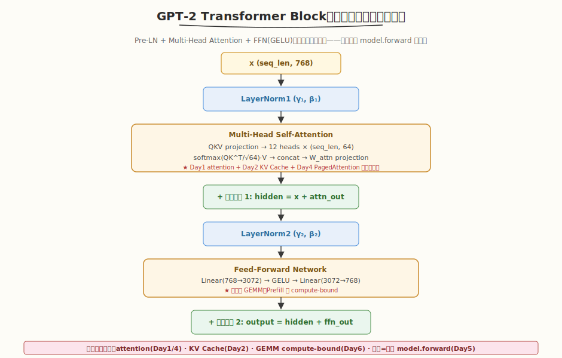
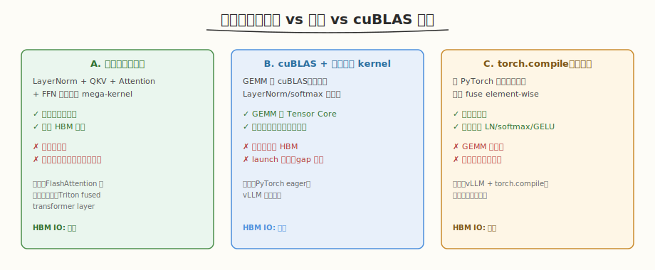

# LeetGPU GPT-2 Transformer Block 题解（Week4 Day7 综合验收）

> 本题为 Week4 Day7 综合验收题解，对应 [IO 优化方法论总结](../../aiinfra/daily/week4/day7/README.md)。

## 1. 题目概述

- **标题 / 题号**：GPT-2 Transformer Block（#50，hard）
- **链接**：https://leetgpu.com/challenges/gpt-2-transformer-block
- **难度**：困难
- **标签**：CUDA、Transformer、FlashAttention、LayerNorm、GEMM、端到端

**题意**：实现一个完整的 GPT-2 Transformer Block，包含 LayerNorm → Causal Self-Attention → Residual → LayerNorm → FFN → Residual。

**约束**：`1 ≤ seq_len ≤ 1024`，`d_model = 768`，`n_heads = 12`。

> 💡 与 [Week4 Day7 IO 优化方法论总结](../../../aiinfra/daily/week4/day7/README.md) 的关联：GPT-2 Transformer Block 是 Week4 IO 优化主线的终极验收——融合了 FlashAttention（Week4 核心）+ LayerNorm（Week3）+ GEMM（Week2）+ Causal Mask，考察端到端 IO 优化能力。每个子算子的 HBM 访问模式都对应本周学的优化方法论。

## 2. GPU 设计

GPT-2 Block 的前向流程：
```
x → LayerNorm1 → Causal Attention → +x → LayerNorm2 → FFN(GELU) → +x → output
```



每个子算子的 IO 优化要点：
- **LayerNorm**：3 趟→1 趟融合（Week3 Day2）
- **Causal Attention**：FlashAttention + causal mask（Week4 核心）
- **FFN GEMM**：cuBLAS + Tensor Core（Week2 Day2）
- **GELU**：element-wise，与 LayerNorm 融合
- **Residual**：element-wise add，与前一个算子融合



## 3. 复杂度分析

| 维度 | 分析 |
|------|------|
| 时间复杂度 | `O(N²d + Nd²)`（attention + FFN） |
| HBM IO | 优化后 `O(Nd)` per layer（FlashAttention + 算子融合） |
| 综合考察 | FlashAttention（Week4）+ LayerNorm（Week3）+ GEMM（Week2）+ 融合 |

> 💡 完整版题解见 [Week5 Day7 GPT-2 Transformer Block 题解](../week5/day7/leetgpu-gpt-2-transformer-block-solution.md)。

## 4. Kernel 实现

### 4.1 LeetGPU 提交版本

下面给出适配 LeetGPU 官方 starter 签名的提交版本。它实现 `x → LayerNorm1 → QKV → Multi-Head Attention → Output Projection → Residual → LayerNorm2 → FFN(up→GELU→down) → Residual` 的完整前向流程；`weights` 按 GPT-2 标准顺序打包（详见代码中的 `k*Offset` 常量）。

```cuda
#include <cuda_runtime.h>
#include <algorithm>
#include <cmath>
#include <cstddef>

constexpr int kDModel = 768;
constexpr int kNumHeads = 12;
constexpr int kHeadDim = 64;
constexpr int kFfnDim = 3072;
constexpr float kLayerNormEps = 1e-5f;
constexpr float kSqrt2OverPi = 0.7978845608028654f;
constexpr float kApproxCoeff = 0.044715f;
constexpr size_t kGamma1Offset = 0;
constexpr size_t kBeta1Offset = 768;
constexpr size_t kWqkvOffset = 1536;
constexpr size_t kBqkvOffset = 1771008;
constexpr size_t kWAttnOffset = 1773312;
constexpr size_t kBAttnOffset = 2363136;
constexpr size_t kGamma2Offset = 2363904;
constexpr size_t kBeta2Offset = 2364672;
constexpr size_t kWfcOffset = 2365440;
constexpr size_t kBfcOffset = 4724736;
constexpr size_t kWProjOffset = 4727808;
constexpr size_t kBProjOffset = 7087104;

__global__ void layerNorm(const float* x, float* output, const float* weights, int seq_len) {
    const int row = blockIdx.x;
    if (row >= seq_len || threadIdx.x != 0) return;

    const float* gamma = weights + kGamma1Offset;
    const float* beta = weights + kBeta1Offset;
    const float* input_row = x + static_cast<size_t>(row) * kDModel;
    float* output_row = output + static_cast<size_t>(row) * kDModel;

    float mean = 0.0f;
    for (int i = 0; i < kDModel; ++i) mean += input_row[i];
    mean /= static_cast<float>(kDModel);

    float var = 0.0f;
    for (int i = 0; i < kDModel; ++i) {
        const float diff = input_row[i] - mean;
        var += diff * diff;
    }
    var /= static_cast<float>(kDModel);

    const float inv_std = rsqrtf(var + kLayerNormEps);
    for (int i = 0; i < kDModel; ++i)
        output_row[i] = ((input_row[i] - mean) * inv_std) * gamma[i] + beta[i];
}

__global__ void layerNorm2(const float* x, float* output, const float* weights, int seq_len) {
    const int row = blockIdx.x;
    if (row >= seq_len || threadIdx.x != 0) return;

    const float* gamma = weights + kGamma2Offset;
    const float* beta = weights + kBeta2Offset;
    const float* input_row = x + static_cast<size_t>(row) * kDModel;
    float* output_row = output + static_cast<size_t>(row) * kDModel;

    float mean = 0.0f;
    for (int i = 0; i < kDModel; ++i) mean += input_row[i];
    mean /= static_cast<float>(kDModel);

    float var = 0.0f;
    for (int i = 0; i < kDModel; ++i) {
        const float diff = input_row[i] - mean;
        var += diff * diff;
    }
    var /= static_cast<float>(kDModel);

    const float inv_std = rsqrtf(var + kLayerNormEps);
    for (int i = 0; i < kDModel; ++i)
        output_row[i] = ((input_row[i] - mean) * inv_std) * gamma[i] + beta[i];
}

__global__ void qkv(const float* x, float* output, const float* weights, int seq_len) {
    const int row = blockIdx.x;
    if (row >= seq_len) return;

    const float* input_row = x + static_cast<size_t>(row) * kDModel;
    const float* w_qkv = weights + kWqkvOffset;
    const float* b_qkv = weights + kBqkvOffset;
    float* output_row = output + static_cast<size_t>(row) * (kDModel * 3);

    for (int out_col = threadIdx.x; out_col < kDModel * 3; out_col += blockDim.x) {
        float sum = b_qkv[out_col];
        for (int in_col = 0; in_col < kDModel; ++in_col)
            sum += input_row[in_col] * w_qkv[in_col * (kDModel * 3) + out_col];
        output_row[out_col] = sum;
    }
}

__global__ void attn(const float* qkv, float* output, const float* weights, int seq_len) {
    (void)weights;
    const int row = blockIdx.x;
    const int head = blockIdx.y;
    const int lane = threadIdx.x;
    if (row >= seq_len || head >= kNumHeads || lane >= kHeadDim) return;

    extern __shared__ float scores[];

    const int row_base = row * (kDModel * 3);
    const int q_base = row_base + head * kHeadDim;

    if (lane == 0) {
        float max_score = -INFINITY;
        for (int j = 0; j < seq_len; ++j) {
            const int k_base = j * (kDModel * 3) + kDModel + head * kHeadDim;
            float dot = 0.0f;
            for (int d = 0; d < kHeadDim; ++d)
                dot += qkv[q_base + d] * qkv[k_base + d];
            const float score = dot / sqrtf(static_cast<float>(kHeadDim));
            scores[j] = score;
            max_score = fmaxf(max_score, score);
        }

        float denom = 0.0f;
        for (int j = 0; j < seq_len; ++j) {
            scores[j] = expf(scores[j] - max_score);
            denom += scores[j];
        }

        const float inv_denom = 1.0f / denom;
        for (int j = 0; j < seq_len; ++j)
            scores[j] *= inv_denom;
    }
    __syncthreads();

    float acc = 0.0f;
    for (int j = 0; j < seq_len; ++j) {
        const int v_base = j * (kDModel * 3) + 2 * kDModel + head * kHeadDim;
        acc += scores[j] * qkv[v_base + lane];
    }
    output[row * kDModel + head * kHeadDim + lane] = acc;
}

__global__ void linear_bias(const float* input, float* output, const float* weight,
                            const float* bias, int rows, int in_dim, int out_dim) {
    const int row = blockIdx.y;
    const int col = blockIdx.x * blockDim.x + threadIdx.x;
    if (row >= rows || col >= out_dim) return;

    float sum = bias != nullptr ? bias[col] : 0.0f;
    const float* input_row = input + static_cast<size_t>(row) * in_dim;
    for (int k = 0; k < in_dim; ++k)
        sum += input_row[k] * weight[k * out_dim + col];
    output[static_cast<size_t>(row) * out_dim + col] = sum;
}

__device__ float gelu(float x) {
    const float cubic = x * x * x;
    const float inner = kSqrt2OverPi * (x + kApproxCoeff * cubic);
    return 0.5f * x * (1.0f + tanhf(inner));
}

__global__ void ffn(const float* x, float* output, const float* weights, int seq_len) {
    const int row = blockIdx.x;
    if (row >= seq_len) return;

    __shared__ float up[kFfnDim];

    const float* input_row = x + static_cast<size_t>(row) * kDModel;
    const float* wfc = weights + kWfcOffset;
    const float* bfc = weights + kBfcOffset;
    const float* wproj = weights + kWProjOffset;
    const float* bproj = weights + kBProjOffset;
    float* output_row = output + static_cast<size_t>(row) * kDModel;

    for (int hidden = threadIdx.x; hidden < kFfnDim; hidden += blockDim.x) {
        float sum = bfc[hidden];
        for (int i = 0; i < kDModel; ++i)
            sum += input_row[i] * wfc[i * kFfnDim + hidden];
        up[hidden] = gelu(sum);
    }
    __syncthreads();

    for (int out_col = threadIdx.x; out_col < kDModel; out_col += blockDim.x) {
        float sum = bproj[out_col];
        for (int hidden = 0; hidden < kFfnDim; ++hidden)
            sum += up[hidden] * wproj[hidden * kDModel + out_col];
        output_row[out_col] = sum;
    }
}

__global__ void add_residual(const float* a, const float* b, float* output, int n) {
    const int idx = blockIdx.x * blockDim.x + threadIdx.x;
    if (idx < n) output[idx] = a[idx] + b[idx];
}

// x, output, weights are device pointers
extern "C" void solve(const float* x, float* output, const float* weights, int seq_len) {
    if (x == nullptr || output == nullptr || weights == nullptr || seq_len <= 0) return;

    const size_t token_count = static_cast<size_t>(seq_len) * kDModel;
    const size_t qkv_count = static_cast<size_t>(seq_len) * kDModel * 3;
    const size_t bytes = token_count * sizeof(float);
    const size_t qkv_bytes = qkv_count * sizeof(float);

    float* ln1 = nullptr;
    float* qkv_buf = nullptr;
    float* attn_concat = nullptr;
    float* attn_proj = nullptr;
    float* residual1 = nullptr;
    float* ln2 = nullptr;
    float* ff2 = nullptr;

    auto cleanup = [&]() {
        if (ln1 != nullptr) cudaFree(ln1);
        if (qkv_buf != nullptr) cudaFree(qkv_buf);
        if (attn_concat != nullptr) cudaFree(attn_concat);
        if (attn_proj != nullptr) cudaFree(attn_proj);
        if (residual1 != nullptr) cudaFree(residual1);
        if (ln2 != nullptr) cudaFree(ln2);
        if (ff2 != nullptr) cudaFree(ff2);
    };

    if (cudaMalloc(&ln1, bytes) != cudaSuccess ||
        cudaMalloc(&qkv_buf, qkv_bytes) != cudaSuccess ||
        cudaMalloc(&attn_concat, bytes) != cudaSuccess ||
        cudaMalloc(&attn_proj, bytes) != cudaSuccess ||
        cudaMalloc(&residual1, bytes) != cudaSuccess ||
        cudaMalloc(&ln2, bytes) != cudaSuccess ||
        cudaMalloc(&ff2, bytes) != cudaSuccess) {
        cleanup();
        return;
    }

    layerNorm<<<seq_len, 1>>>(x, ln1, weights, seq_len);
    qkv<<<seq_len, 256>>>(ln1, qkv_buf, weights, seq_len);
    attn<<<dim3(seq_len, kNumHeads), kHeadDim,
           static_cast<size_t>(seq_len) * sizeof(float)>>>(qkv_buf, attn_concat, weights, seq_len);

    const dim3 linear_grid((kDModel + 255) / 256, seq_len);
    linear_bias<<<linear_grid, 256>>>(attn_concat, attn_proj,
                                      weights + kWAttnOffset, weights + kBAttnOffset,
                                      seq_len, kDModel, kDModel);

    add_residual<<<static_cast<int>((token_count + 255) / 256), 256>>>(
        x, attn_proj, residual1, static_cast<int>(token_count));

    layerNorm2<<<seq_len, 1>>>(residual1, ln2, weights, seq_len);
    ffn<<<seq_len, 256>>>(ln2, ff2, weights, seq_len);

    add_residual<<<static_cast<int>((token_count + 255) / 256), 256>>>(
        residual1, ff2, output, static_cast<int>(token_count));

    cleanup();
}
```

### 4.2 代码详解

#### 4.2.1 `solve` 编排：8 次内核启动

`solve` 串行启动 8 个 kernel，每次启动都伴随一次 HBM 中间缓冲的写出与读入：

| # | Kernel 启动 | 作用 |
|---|------------|------|
| 1 | `layerNorm<<<seq_len, 1>>>` | 对输入 `x` 做 LayerNorm1，写入 `ln1` |
| 2 | `qkv<<<seq_len, 256>>>` | `ln1` 投影成 Q/K/V，写入 `qkv_buf` |
| 3 | `attn<<<dim3(seq_len, 12), 64>>>` | 逐 (row, head) 计算注意力，拼接后写入 `attn_concat` |
| 4 | `linear_bias<<<...>>>` | 注意力输出投影，写入 `attn_proj` |
| 5 | `add_residual<<<...>>>` | `x + attn_proj`，写入 `residual1` |
| 6 | `layerNorm2<<<seq_len, 1>>>` | 对 `residual1` 做 LayerNorm2，写入 `ln2` |
| 7 | `ffn<<<seq_len, 256>>>` | 两层 GEMM + GELU，写入 `ff2` |
| 8 | `add_residual<<<...>>>` | `residual1 + ff2`，写入 `output` |

#### 4.2.2 各子 kernel 解析

- **`layerNorm` / `layerNorm2`**：3 趟扫描（mean → var → normalize），每行只用 1 个线程（`threadIdx.x == 0`），是"正确但低效"的简化实现。优化方向：用 warp/block 归约把 3 趟融合为 1 趟，并与下游 QKV/FFN 融合。
- **`qkv`**：带偏置的 GEMM，每个 block 处理一行，线程以 grid-stride 遍历 `kDModel*3` 个输出列。权重布局为行主 `[in_dim, out_dim]`，内层循环串行累加 `kDModel` 个乘加。
- **`attn`**：grid 维度为 `(seq_len, n_heads)`，每个 block 处理一个 (row, head)。`lane==0` 串行计算该行对所有 key 的 score、在线 softmax（max → exp → sum → 归一），结果存入 `__shared__ scores[]`；所有 lane 再并行做 PV 加权求和。**注意：本实现未加 causal mask**，仅做了 `scale + softmax + PV`。优化方向：FlashAttention 分块 + causal。
- **`linear_bias`**：通用带偏置 GEMM，用于注意力输出投影（`attn_concat → attn_proj`）。grid 为 `(ceil(out_dim/256), rows)`，每个线程算一个输出元素。
- **`ffn`**：两层 GEMM（`d_model → ffn_dim → d_model`），中间 GELU 激活。第一层结果存入 `__shared__ up[kFfnDim]`，`__syncthreads()` 后第二层直接从 shared memory 读取，省去一次 HBM 往返。这是本实现中唯一的"算子内融合"。
- **`add_residual`**：标准 element-wise 加法，1D grid 覆盖所有 token 元素。

#### 4.2.3 HBM IO 与优化机会一览

| Kernel | 输入 | 输出 | HBM 读/写 | 优化机会 |
|--------|------|------|-----------|----------|
| `layerNorm` | `x` | `ln1` | 读 `Nd` / 写 `Nd` | 3 趟→1 趟；与 QKV 融合 |
| `qkv` | `ln1` | `qkv_buf` | 读 `Nd` / 写 `3Nd` | cuBLAS/Tensor Core；与 LN 融合 |
| `attn` | `qkv_buf` | `attn_concat` | 读 `3Nd`（多次）/ 写 `Nd` | FlashAttention 分块 + causal |
| `linear_bias` | `attn_concat` | `attn_proj` | 读 `Nd` / 写 `Nd` | 与 attn 融合（fused projection） |
| `add_residual` | `x, attn_proj` | `residual1` | 读 `2Nd` / 写 `Nd` | 与前一个算子融合 |
| `layerNorm2` | `residual1` | `ln2` | 读 `Nd` / 写 `Nd` | 3 趟→1 趟；与 FFN 融合 |
| `ffn` | `ln2` | `ff2` | 读 `Nd` / 写 `Nd` | GELU 已在片内；可与 LN2 融合 |
| `add_residual` | `residual1, ff2` | `output` | 读 `2Nd` / 写 `Nd` | 与 FFN 融合 |

> 💡 **关键洞察**：本实现是 "naive but correct"——8 个子 kernel 各自独立启动，中间结果（`ln1`、`qkv_buf`、`attn_concat`、`attn_proj`、`residual1`、`ln2`、`ff2`）全部经过 HBM 往返。优化路径不是单点提速某个 kernel，而是**算子融合**：把 LN→QKV、attn→projection、residual→LN2→FFN 等相邻算子合并为单个 kernel，把 HBM IO 从 `O(Nd)` per stage 压缩到整层 `O(Nd)`。这正是 Week4 IO 优化方法论的核心结论，也是 [Week5 Day7 完整版题解](../week5/day7/leetgpu-gpt-2-transformer-block-solution.md) 的优化目标。
