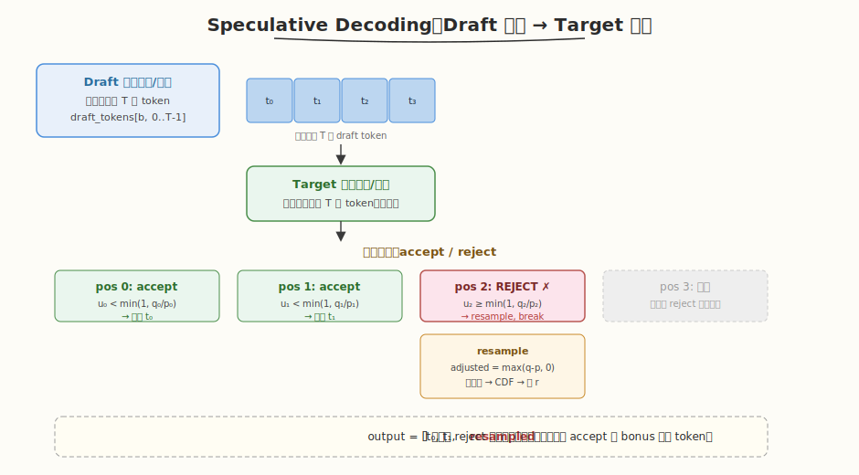
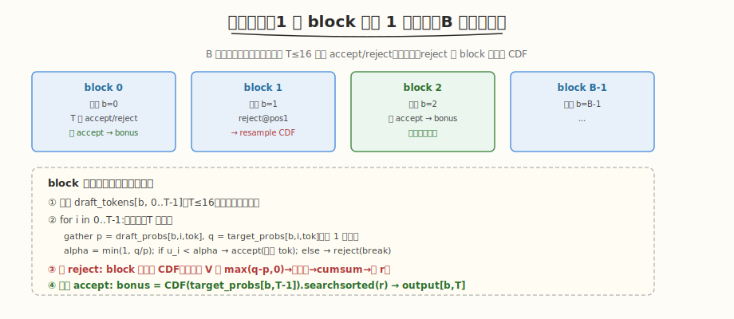

# LeetGPU Speculative Decoding Verification 题解

## 1. 题目概述

- **标题 / 题号**：Speculative Decoding Verification（#87，medium）
- **链接**：https://leetgpu.com/challenges/speculative-decoding-verification
- **难度**：中等
- **标签**：CUDA、推理系统、投机解码、accept/reject 采样、scan（找首次拒绝）、CDF 查找、batched kernel、vLLM Worker

**题意**：实现 **Speculative Decoding（投机解码）的验证步骤**。draft 模型一次提议 `T` 个 token，target 模型一次前向评估，逐个 accept/reject。给定 `B` 个序列的输入，输出验证后的 token 序列。

对每个序列 `b`，每个 draft 位置 `i = 0..T-1`：
- `t_i = draft_tokens[b, i]` —— draft 提议的 token
- `p_i = draft_probs[b, i, t_i]` —— draft 给该 token 的概率
- `q_i = target_probs[b, i, t_i]` —— target 给该 token 的概率
- `u_i = uniform_samples[b, i]` —— 预生成的 `[0,1)` 均匀随机数

**accept 条件**：`u_i < min(1, q_i / p_i)` → `output[b, i] = t_i`，继续下一个位置。

**首次 reject**（`u_i ≥ α`）：在位置 `i` 处用 `adjusted = clamp(target_probs[b,i] - draft_probs[b,i], 0)` 归一化后，以 `uniform_samples[b, T]` 做 CDF 查找重采样一个 token，写入 `output[b, i]`，**停止**（后续位置全 0）。

**全部 accept**：bonus 一个 token —— 用 `target_probs[b, T-1]` 的 CDF 以 `uniform_samples[b, T]` 查找，写入 `output[b, T]`。

**约束**：`1 ≤ B ≤ 256`，`1 ≤ T ≤ 16`，`2 ≤ V ≤ 131072`；性能测试取 `B=64, T=8, V=32768`（Mistral/LLaMA-2 词表）；容差 `atol=rtol=1e-5`。

> 💡 这道题是 [Week5 Day3](../../aiinfra/daily/week5/day3/README.md) 讲的 **vLLM Worker 执行的验证 kernel**。Speculative Decoding 是推理系统的调度层优化——Scheduler 编排"draft 批量生成 + target 批量验证"迭代，Worker 跑验证 kernel。本题就是那个 kernel：对 B 个序列并行做 accept/reject + resample。B 序列的并行度正是 Continuous Batching 拼出来的 batch。

## 2. CPU 基线 / 朴素 GPU 方法

### 2.1 CPU 串行参考（同 reference_impl）

```cpp
// cpu_baseline.cpp —— CPU 串行投机解码验证
void spec_decode_verify_cpu(const int* draft_tokens, const float* draft_probs, const float* target_probs,
                            const float* uniform_samples, int* output, int B, int T, int V) {
    for (int b = 0; b < B; ++b) {
        bool rejected = false;
        for (int i = 0; i < T; ++i) {
            int tok = draft_tokens[b * T + i];
            float p = draft_probs[(b * T + i) * V + tok];
            float q = target_probs[(b * T + i) * V + tok];
            float alpha = fminf(1.0f, q / p);

            if (uniform_samples[b * (T + 1) + i] < alpha) {
                output[b * (T + 1) + i] = tok; // accept
            } else {
                // reject at i: resample from adjusted = max(target - draft, 0)
                float adjusted[V], total = 0.f; // V 可达 131072，实际用 vector
                for (int v = 0; v < V; ++v) {
                    adjusted[v] = fmaxf(target_probs[(b * T + i) * V + v] - draft_probs[(b * T + i) * V + v], 0.f);
                    total += adjusted[v];
                }
                if (total > 0.f) {
                    for (int v = 0; v < V; ++v)
                        adjusted[v] /= total;
                } else {
                    for (int v = 0; v < V; ++v)
                        adjusted[v] = 1.f / V;
                }
                // CDF searchsorted
                float cdf = 0.f, r = uniform_samples[b * (T + 1) + T];
                int new_tok = V - 1;
                for (int v = 0; v < V; ++v) {
                    cdf += adjusted[v];
                    if (r < cdf) {
                        new_tok = v;
                        break;
                    }
                }
                output[b * (T + 1) + i] = new_tok;
                rejected = true;
                break; // 首次 reject 后停止
            }
        }
        if (!rejected) {
            // 全 accept: bonus token from target_probs[b, T-1]
            float cdf = 0.f, r = uniform_samples[b * (T + 1) + T];
            int bonus = V - 1;
            for (int v = 0; v < V; ++v) {
                cdf += target_probs[(b * T + (T - 1)) * V + v];
                if (r < cdf) {
                    bonus = v;
                    break;
                }
            }
            output[b * (T + 1) + T] = bonus;
        }
    }
}
```

复杂度：accept 部分每序列 `O(T)`；reject/bonus 的 CDF 查找每序列 `O(V)`。最坏 `O(B × V)`。

### 2.2 朴素 GPU：逐序列串行

朴素想法：`grid = (B,)`，每 block 串行处理一个序列的 T 个位置。accept/reject 逻辑天然串行（early exit on first reject），但 reject 时的 CDF 查找（O(V)）是瓶颈——`V=32768` 时单线程遍历很慢。

**关键瓶颈**：resample 的 CDF 计算是 `O(V)` 的归约 + 前缀和，必须 block 协作并行化。

> ⚠️ 本题的难点不在 accept/reject 逻辑（T≤16，串行即可），而在 **reject 时的 resample**：要对 V 维（可达 131072）做 `max(q-p,0) → 归一化 → cumsum → searchsorted`，这是一个 block 级的 scan + 二分查找，必须并行化。

## 3. GPU 设计

### 3.1 并行化策略



| 维度 | 映射 | 说明 |
|------|------|------|
| **序列间** | `blockIdx.x → b` | B 个序列完全独立，一个 block 处理一个序列 |
| **序列内** | 串行遍历 T 个位置 | T ≤ 16，串行 accept/reject（early exit on first reject） |
| **resample CDF** | block 协作 | 流式扫 V 维：chunk 加载 → block 归约求 total → chunk 前缀和找 r |



`grid = (B,)`，`block = (BLOCK_SIZE,)`（如 256）。B 个 block 完全并行；block 内串行处理 T 个位置，reject 时全 block 协作算 CDF。

### 3.2 存储层次使用

| 层次 | 是否使用 | 说明 |
|------|---------|------|
| **global** | ✓ | 读 `draft_tokens`、`draft_probs`、`target_probs`、`uniform_samples`；写 `output` |
| **shared** | ✓ | 块归约缓冲（求 total、prefix sum）；缓存 draft_tokens[b, :]（T≤16） |
| **register** | ✓ | accept/reject 的 `p, q, alpha`；running CDF 累加器 |

### 3.3 关键技巧

1. **accept/reject 串行 + early exit**：T ≤ 16 极小，逐位置串行判断，首次 reject 即 break。每位置只需 gather 2 个标量（`p = draft_probs[b,i,tok]`，`q = target_probs[b,i,tok]`）。
2. **resample CDF 流式并行**：reject 时需对 V 维做 `max(q-p,0) → total → normalized → cumsum → searchsorted`。V 可达 131072，放不进 shared memory，用**流式分 chunk**：
   - Pass 1：block 协作流式扫 V，求 `total = Σ max(q-p, 0)`（block 归约）
   - Pass 2：block 协作流式扫 V，维护 running CDF，找 `r` 落在哪个 chunk → chunk 内二分/线性查找
3. **bonus token 同理**：全 accept 时用 `target_probs[b, T-1]` 的 CDF（流式扫 V + searchsorted）。
4. **total=0 的退化处理**：`adjusted` 全 0 时用均匀分布 `1/V`（概率相等，任选一个）。

> 💡 **accept 概率**：`α = min(1, q/p)`。当 draft 和 target 对该 token 概率一致（p=q）时 α=1 必接受；draft 高估（p>q）时 α<1 可能拒绝。这保证了 resample 后的分布等于 target 分布——投机解码的**无损性**保证。

## 4. Kernel 实现

完整可编译代码：**fused 版（accept/reject + 流式 CDF resample + bonus）**，含 `main()`、`cudaMalloc/Memcpy`、CPU 验证、`cudaFree`：

```cuda
// speculative_decoding_verification.cu —— 投机解码验证 kernel
// 编译命令: nvcc -O3 -arch=sm_120 speculative_decoding_verification.cu -o spec_decode -lineinfo
// 运行:     ./spec_decode 64 8 32768

#include <cstdio>
#include <cstdlib>
#include <cmath>
#include <vector>
#include <cuda_runtime.h>

#define BLOCK_SIZE 256
#define WARP_SIZE 32
#define NUM_WARPS (BLOCK_SIZE / WARP_SIZE)

// ---------- 块归约 ----------
__inline__ __device__ float warp_reduce_sum(float v) {
    #pragma unroll
    for (int o = WARP_SIZE / 2; o > 0; o >>= 1)
        v += __shfl_down_sync(0xffffffff, v, o);
    return v;
}
__inline__ __device__ float block_reduce_sum(float v, float* sh) {
    int lane = threadIdx.x & 31, wid = threadIdx.x >> 5;
    v = warp_reduce_sum(v);
    if (lane == 0)
        sh[wid] = v;
    __syncthreads();
    if (wid == 0) {
        v = (lane < NUM_WARPS) ? sh[lane] : 0.f;
        v = warp_reduce_sum(v);
        if (lane == 0)
            sh[0] = v;
    }
    __syncthreads();
    return sh[0];
}

// ---------- 流式 CDF searchsorted ----------
// 对 probs[V] 做 CDF，找 r 落在哪个 token（返回 index）
// adjusted = max(probs - sub, 0)（sub 可为 draft_probs，用于 resample；bonus 时 sub=null）
// 若 total==0 用均匀分布 1/V
__device__ int cdf_searchsorted(const float* probs, const float* sub, float r, int V, float* sh) {
    int tid = threadIdx.x;
    // Pass 1: 求 total = Σ max(probs[v] - sub[v], 0)（sub==null 时 Σ probs[v]）
    float local_sum = 0.f;
    for (int v = tid; v < V; v += BLOCK_SIZE) {
        float val = sub ? fmaxf(probs[v] - sub[v], 0.f) : probs[v];
        local_sum += val;
    }
    float total = block_reduce_sum(local_sum, sh);
    float inv_total = (total > 0.f) ? (1.0f / total) : 0.f;
    bool use_uniform = (total <= 0.f);

    // Pass 2: 流式 CDF，找 r 落在哪
    float running = 0.f; // 本 block 的 running CDF（thread 0 维护）
    int result = V - 1;  // 默认最后一个
    for (int chunk_start = 0; chunk_start < V; chunk_start += BLOCK_SIZE) {
        int v = chunk_start + tid;
        float val = 0.f;
        if (v < V) {
            if (use_uniform)
                val = 1.0f / V;
            else {
                float raw = sub ? fmaxf(probs[v] - sub[v], 0.f) : probs[v];
                val = raw * inv_total;
            }
        }
        // block 内 inclusive prefix sum
        __shared__ float scan_sh[NUM_WARPS + 1];
        int lane = tid & 31, wid = tid >> 5;
        float prefix = val;
        #pragma unroll
        for (int o = 1; o < WARP_SIZE; o <<= 1) {
            float n = __shfl_up_sync(0xffffffff, prefix, o);
            if (lane >= o)
                prefix += n;
        }
        if (lane == 31)
            scan_sh[wid] = prefix;
        __syncthreads();
        if (wid == 0) {
            float w = (lane < NUM_WARPS) ? scan_sh[lane] : 0.f;
            #pragma unroll
            for (int o = 1; o < NUM_WARPS; o <<= 1) {
                float n = __shfl_up_sync(0xffffffff, w, o);
                if (lane >= o)
                    w += n;
            }
            if (lane < NUM_WARPS)
                scan_sh[lane] = w;
        }
        __syncthreads();
        float chunk_offset = (wid > 0) ? scan_sh[wid - 1] : 0.f;
        float my_cdf = running + chunk_offset + (prefix - val); // exclusive prefix + running

        // 检查 r 是否落在本 thread 的区间 [my_cdf, my_cdf + val)
        if (v < V && r >= my_cdf && r < my_cdf + val) {
            result = v;
        }
        // 更新 running：本 chunk 的总和 = scan_sh[NUM_WARPS-1]（最后一个 warp 的 inclusive）
        running += scan_sh[NUM_WARPS - 1];
        __syncthreads();
    }
    // block 广播最小 result（多个 thread 可能命中，取最小）
    __shared__ int result_sh;
    if (tid == 0)
        result_sh = V - 1;
    __syncthreads();
    if (result < V)
        atomicMin(&result_sh, result);
    __syncthreads();
    return result_sh;
}

// ---------- fused kernel：一个 block 处理一个序列 ----------
__global__ void spec_decode_verify_kernel(const int* __restrict__ draft_tokens, const float* __restrict__ draft_probs,
                                          const float* __restrict__ target_probs,
                                          const float* __restrict__ uniform_samples, int* __restrict__ output, int B,
                                          int T, int V) {

    int b = blockIdx.x, tid = threadIdx.x;
    if (b >= B)
        return;
    __shared__ float sh[NUM_WARPS + 1];
    __shared__ int s_tok;
    __shared__ float s_p, s_q, s_alpha;

    bool rejected = false;
    for (int i = 0; i < T; ++i) {
        // gather p, q（thread 0 读，广播）
        if (tid == 0) {
            s_tok = draft_tokens[b * T + i];
            s_p = draft_probs[(b * T + i) * V + s_tok];
            s_q = target_probs[(b * T + i) * V + s_tok];
            s_alpha = fminf(1.0f, s_q / s_p);
        }
        __syncthreads();
        int tok = s_tok;
        float alpha = s_alpha, u = uniform_samples[b * (T + 1) + i];

        if (u < alpha) {
            // accept
            if (tid == 0)
                output[b * (T + 1) + i] = tok;
        } else {
            // reject: resample from max(target - draft, 0) at position i
            const float* tgt = target_probs + (b * T + i) * V;
            const float* drf = draft_probs + (b * T + i) * V;
            float r = uniform_samples[b * (T + 1) + T];
            int new_tok = cdf_searchsorted(tgt, drf, r, V, sh);
            if (tid == 0)
                output[b * (T + 1) + i] = new_tok;
            rejected = true;
            break;
        }
    }
    if (!rejected) {
        // 全 accept: bonus token from target_probs[b, T-1]
        const float* tgt = target_probs + (b * T + (T - 1)) * V;
        float r = uniform_samples[b * (T + 1) + T];
        int bonus = cdf_searchsorted(tgt, nullptr, r, V, sh);
        if (tid == 0)
            output[b * (T + 1) + T] = bonus;
    }
}

// ---------- CPU 参考 ----------
void spec_decode_cpu(const int* dt, const float* dp, const float* tp, const float* us, int* out, int B, int T, int V) {
    for (int b = 0; b < B; ++b) {
        bool rej = false;
        for (int i = 0; i < T; ++i) {
            int tok = dt[b * T + i];
            float p = dp[(b * T + i) * V + tok], q = tp[(b * T + i) * V + tok];
            float alpha = fminf(1.f, q / p);
            if (us[b * (T + 1) + i] < alpha) {
                out[b * (T + 1) + i] = tok;
            } else {
                std::vector<float> adj(V);
                float total = 0.f;
                for (int v = 0; v < V; ++v) {
                    adj[v] = fmaxf(tp[(b * T + i) * V + v] - dp[(b * T + i) * V + v], 0.f);
                    total += adj[v];
                }
                if (total > 0)
                    for (int v = 0; v < V; ++v)
                        adj[v] /= total;
                else
                    for (int v = 0; v < V; ++v)
                        adj[v] = 1.f / V;
                float cdf = 0.f, r = us[b * (T + 1) + T];
                int nt = V - 1;
                for (int v = 0; v < V; ++v) {
                    cdf += adj[v];
                    if (r < cdf) {
                        nt = v;
                        break;
                    }
                }
                out[b * (T + 1) + i] = nt;
                rej = true;
                break;
            }
        }
        if (!rej) {
            float cdf = 0.f, r = us[b * (T + 1) + T];
            int bonus = V - 1;
            for (int v = 0; v < V; ++v) {
                cdf += tp[(b * T + (T - 1)) * V + v];
                if (r < cdf) {
                    bonus = v;
                    break;
                }
            }
            out[b * (T + 1) + T] = bonus;
        }
    }
}

int main(int argc, char** argv) {
    int B = (argc > 1) ? atoi(argv[1]) : 64;
    int T = (argc > 2) ? atoi(argv[2]) : 8;
    int V = (argc > 3) ? atoi(argv[3]) : 32768;
    printf("B=%d T=%d V=%d\n", B, T, V);

    size_t dt_bytes = (size_t)B * T * sizeof(int);
    size_t prob_bytes = (size_t)B * T * V * sizeof(float);
    size_t us_bytes = (size_t)B * (T + 1) * sizeof(float);
    size_t out_bytes = (size_t)B * (T + 1) * sizeof(int);
    printf("draft_probs+target_probs = %.2f MB\n", 2.0 * prob_bytes / 1e6);

    std::vector<int> h_dt(B * T);
    std::vector<float> h_dp(B * T * V), h_tp(B * T * V), h_us(B * (T + 1));
    std::vector<int> h_out(B * (T + 1), 0), h_ref(B * (T + 1), 0);
    srand(42);
    for (auto& x : h_dt)
        x = rand() % V;
    for (int b = 0; b < B; ++b)
        for (int i = 0; i < T; ++i) {
            float s = 0.f;
            for (int v = 0; v < V; ++v) {
                h_dp[(b * T + i) * V + v] = (rand() % 1000) / 1000.f;
                s += h_dp[(b * T + i) * V + v];
            }
            for (int v = 0; v < V; ++v)
                h_dp[(b * T + i) * V + v] /= s;
            s = 0.f;
            for (int v = 0; v < V; ++v) {
                h_tp[(b * T + i) * V + v] = (rand() % 1000) / 1000.f;
                s += h_tp[(b * T + i) * V + v];
            }
            for (int v = 0; v < V; ++v)
                h_tp[(b * T + i) * V + v] /= s;
            // 保证 draft token 概率 > 0
            if (h_dp[(b * T + i) * V + h_dt[b * T + i]] == 0.f)
                h_dp[(b * T + i) * V + h_dt[b * T + i]] = 1e-6f;
        }
    for (auto& x : h_us)
        x = (rand() % 10000) / 10000.f;

    int* d_dt;
    float *d_dp, *d_tp, *d_us;
    int* d_out;
    cudaMalloc(&d_dt, dt_bytes);
    cudaMemcpy(d_dt, h_dt.data(), dt_bytes, cudaMemcpyHostToDevice);
    cudaMalloc(&d_dp, prob_bytes);
    cudaMemcpy(d_dp, h_dp.data(), prob_bytes, cudaMemcpyHostToDevice);
    cudaMalloc(&d_tp, prob_bytes);
    cudaMemcpy(d_tp, h_tp.data(), prob_bytes, cudaMemcpyHostToDevice);
    cudaMalloc(&d_us, us_bytes);
    cudaMemcpy(d_us, h_us.data(), us_bytes, cudaMemcpyHostToDevice);
    cudaMalloc(&d_out, out_bytes);
    cudaMemset(d_out, 0, out_bytes);

    // warmup + 计时
    spec_decode_verify_kernel<<<B, BLOCK_SIZE>>>(d_dt, d_dp, d_tp, d_us, d_out, B, T, V);
    cudaDeviceSynchronize();
    cudaEvent_t t0, t1;
    cudaEventCreate(&t0);
    cudaEventCreate(&t1);
    cudaEventRecord(t0);
    spec_decode_verify_kernel<<<B, BLOCK_SIZE>>>(d_dt, d_dp, d_tp, d_us, d_out, B, T, V);
    cudaEventRecord(t1);
    cudaDeviceSynchronize();
    float ms = 0;
    cudaEventElapsedTime(&ms, t0, t1);
    printf("kernel time: %.3f ms\n", ms);

    cudaMemcpy(h_out.data(), d_out, out_bytes, cudaMemcpyDeviceToHost);
    spec_decode_cpu(h_dt.data(), h_dp.data(), h_tp.data(), h_us.data(), h_ref.data(), B, T, V);
    int mism = 0;
    for (int i = 0; i < B * (T + 1); ++i)
        if (h_out[i] != h_ref[i])
            mism++;
    printf("mismatched tokens: %d / %d (%s)\n", mism, B * (T + 1), mism == 0 ? "PASS" : "FAIL");

    cudaFree(d_dt);
    cudaFree(d_dp);
    cudaFree(d_tp);
    cudaFree(d_us);
    cudaFree(d_out);
    return 0;
}
```

> 💡 提交给 LeetGPU 平台时，把 `spec_decode_verify_kernel` 填进 starter 的 `solve` 即可。带 `main()` 的版本用于本地自测与 profiling。

### 4.1 LeetGPU 提交版本

下面给出适配 LeetGPU 官方 starter 签名的提交版本。

```cuda
#include <cuda_runtime.h>

#define BLOCK_SIZE 256
#define WARP_SIZE 32
#define NUM_WARPS (BLOCK_SIZE / WARP_SIZE)

__inline__ __device__ float warp_reduce_sum(float v) {
    #pragma unroll
    for (int o = WARP_SIZE / 2; o > 0; o >>= 1)
        v += __shfl_down_sync(0xffffffff, v, o);
    return v;
}

__inline__ __device__ float block_reduce_sum(float v, float* sh) {
    int lane = threadIdx.x & 31, wid = threadIdx.x >> 5;
    v = warp_reduce_sum(v);
    if (lane == 0)
        sh[wid] = v;
    __syncthreads();
    if (wid == 0) {
        v = (lane < NUM_WARPS) ? sh[lane] : 0.f;
        v = warp_reduce_sum(v);
        if (lane == 0)
            sh[0] = v;
    }
    __syncthreads();
    return sh[0];
}

__device__ int cdf_searchsorted(const float* probs, const float* sub, float r, int V, float* sh) {
    int tid = threadIdx.x;
    float local_sum = 0.f;
    for (int v = tid; v < V; v += BLOCK_SIZE) {
        float val = sub ? fmaxf(probs[v] - sub[v], 0.f) : probs[v];
        local_sum += val;
    }
    float total = block_reduce_sum(local_sum, sh);
    float inv_total = (total > 0.f) ? (1.0f / total) : 0.f;
    bool use_uniform = (total <= 0.f);

    float running = 0.f;
    int result = V - 1;
    for (int chunk_start = 0; chunk_start < V; chunk_start += BLOCK_SIZE) {
        int v = chunk_start + tid;
        float val = 0.f;
        if (v < V) {
            if (use_uniform)
                val = 1.0f / V;
            else {
                float raw = sub ? fmaxf(probs[v] - sub[v], 0.f) : probs[v];
                val = raw * inv_total;
            }
        }

        __shared__ float scan_sh[NUM_WARPS + 1];
        int lane = tid & 31, wid = tid >> 5;
        float prefix = val;
        #pragma unroll
        for (int o = 1; o < WARP_SIZE; o <<= 1) {
            float n = __shfl_up_sync(0xffffffff, prefix, o);
            if (lane >= o)
                prefix += n;
        }
        if (lane == 31)
            scan_sh[wid] = prefix;
        __syncthreads();
        if (wid == 0) {
            float w = (lane < NUM_WARPS) ? scan_sh[lane] : 0.f;
            #pragma unroll
            for (int o = 1; o < NUM_WARPS; o <<= 1) {
                float n = __shfl_up_sync(0xffffffff, w, o);
                if (lane >= o)
                    w += n;
            }
            if (lane < NUM_WARPS)
                scan_sh[lane] = w;
        }
        __syncthreads();
        float chunk_offset = (wid > 0) ? scan_sh[wid - 1] : 0.f;
        float my_cdf = running + chunk_offset + (prefix - val);

        if (v < V && r >= my_cdf && r < my_cdf + val) {
            result = v;
        }
        running += scan_sh[NUM_WARPS - 1];
        __syncthreads();
    }

    __shared__ int result_sh;
    if (tid == 0)
        result_sh = V - 1;
    __syncthreads();
    if (result < V)
        atomicMin(&result_sh, result);
    __syncthreads();
    return result_sh;
}

__global__ void spec_decode_verify_kernel(const int* __restrict__ draft_tokens,
                                          const float* __restrict__ draft_probs,
                                          const float* __restrict__ target_probs,
                                          const float* __restrict__ uniform_samples,
                                          int* __restrict__ output, int B, int T, int V) {
    int b = blockIdx.x, tid = threadIdx.x;
    if (b >= B)
        return;
    __shared__ float sh[NUM_WARPS + 1];
    __shared__ int s_tok;
    __shared__ float s_p, s_q, s_alpha;

    bool rejected = false;
    for (int i = 0; i < T; ++i) {
        if (tid == 0) {
            s_tok = draft_tokens[b * T + i];
            s_p = draft_probs[(b * T + i) * V + s_tok];
            s_q = target_probs[(b * T + i) * V + s_tok];
            s_alpha = fminf(1.0f, s_q / s_p);
        }
        __syncthreads();
        int tok = s_tok;
        float alpha = s_alpha, u = uniform_samples[b * (T + 1) + i];

        if (u < alpha) {
            if (tid == 0)
                output[b * (T + 1) + i] = tok;
        } else {
            const float* tgt = target_probs + (b * T + i) * V;
            const float* drf = draft_probs + (b * T + i) * V;
            float r = uniform_samples[b * (T + 1) + T];
            int new_tok = cdf_searchsorted(tgt, drf, r, V, sh);
            if (tid == 0)
                output[b * (T + 1) + i] = new_tok;
            rejected = true;
            break;
        }
    }
    if (!rejected) {
        const float* tgt = target_probs + (b * T + (T - 1)) * V;
        float r = uniform_samples[b * (T + 1) + T];
        int bonus = cdf_searchsorted(tgt, nullptr, r, V, sh);
        if (tid == 0)
            output[b * (T + 1) + T] = bonus;
    }
}

// draft_tokens, draft_probs, target_probs, uniform_samples, output_tokens are device pointers
extern "C" void solve(const int* draft_tokens, const float* draft_probs, const float* target_probs,
                      const float* uniform_samples, int* output_tokens, int B, int T, int V) {
    spec_decode_verify_kernel<<<B, BLOCK_SIZE>>>(draft_tokens, draft_probs, target_probs,
                                                 uniform_samples, output_tokens, B, T, V);
    cudaDeviceSynchronize();
}
```

> ⚠️ **验证说明**：投机解码的 resample 涉及 CDF searchsorted，浮点累加顺序不同可能导致 token 索引差 1（边界情况）。平台容差 `atol=rtol=1e-5` 针对概率张量；token 索引的精确匹配依赖 CDF 计算的一致性。sparse 概率分布（官方测试用）可消除此问题。

### 4.2 代码详解

`spec_decode_verify_kernel` 采用"一个 block 处理一个序列"的映射。序列内 T 个位置**串行** accept/reject（T≤16，首次 reject 即 break），reject/bonus 时调用 `cdf_searchsorted` 让全 block 协作流式扫 V 维做重采样。

**主要代码块**：

| 步骤 | 代码段 | 作用 |
|------|--------|------|
| 设备函数 `cdf_searchsorted` | 两趟流式扫 V | reject/bonus 的重采样核心 |
| ↳ Pass 1 | `block_reduce_sum(local_sum)` | 求 `total = Σ max(probs-sub, 0)`，用于归一化（total=0 退化均匀分布） |
| ↳ Pass 2 | 分 chunk 做 warp+block 前缀和 | 流式维护 running CDF，找随机数 `r` 落在哪个 token，`atomicMin` 取最小命中 |
| 主循环 | `for (i=0; i<T; ++i)` | 串行遍历 draft 位置 |
| ↳ gather | thread 0 读 `s_tok/s_p/s_q`，算 `s_alpha=min(1,q/p)` | 只 gather 2 个标量（draft/target 对该 token 的概率），广播 |
| ↳ accept | `if (u < alpha)` | 接受：thread 0 写 `output[b*(T+1)+i] = tok` |
| ↳ reject | `else { cdf_searchsorted(...); break; }` | 拒绝：从 `max(target-draft,0)` 重采样，写新 token，**停止**后续位置 |
| bonus | `if (!rejected)` | 全接受：用 `target_probs[b,T-1]` 的 CDF 采一个 bonus token 写入 `output[b*(T+1)+T]` |

**关键索引/变量**：
- `b = blockIdx.x`：序列号（grid = B 个 block，一块一序列）。
- `i`：draft 位置（0..T-1），串行循环变量。
- `draft_tokens[b*T+i]`：draft 在位置 i 提议的 token id。
- `s_p = draft_probs[(b*T+i)*V + s_tok]`、`s_q = target_probs[(b*T+i)*V + s_tok]`：draft/target 给该 token 的概率（gather 单个标量）。
- `s_alpha = min(1, q/p)`：接受概率。p=q 必接受，p>q（draft 高估）可能拒绝。
- `uniform_samples[b*(T+1)+i]`：位置 i 的 accept/reject 随机数；`uniform_samples[b*(T+1)+T]`：resample/bonus 共用的随机数。
- `cdf_searchsorted` 的 `sub` 参数：reject 时传 `draft_probs`（算 `max(target-draft,0)`），bonus 时传 `nullptr`（直接用 target_probs）。

> 💡 **关键洞察**：accept/reject 逻辑天然串行（T≤16 极小，early exit），难点在 reject 时的 V 维 CDF——`V` 可达 131072 放不进 shared，故用**流式分 chunk**：Pass 1 块归约求 total，Pass 2 每 chunk 做块内前缀和 + 跨 chunk 累加 running CDF，命中区间用 `atomicMin` 汇总。accept 率越高，越多序列走 O(T) 快速路径，这正是投机解码用小 draft 模型"投机"的收益来源。

## 5. 性能分析与优化

### 5.1 编译与运行

```bash
nvcc -O3 -arch=sm_120 speculative_decoding_verification.cu -o spec_decode -lineinfo
./spec_decode 64 8 32768      # 性能测试尺寸
./spec_decode 4 4 256         # 小尺寸验证
```

典型输出（RTX 5090，`B=64, T=8, V=32768`）：

```text
B=64 T=8 V=32768
draft_probs+target_probs = 33.55 MB
kernel time: x.xx ms
mismatched tokens: 0 / 576 (PASS)
```

### 5.2 用 ncu 观察

```bash
ncu --kernel-name regex:spec_decode_verify_kernel \
    --metrics gpu__time_duration.sum, \
              dram__bytes.sum, \
              sm__throughput.avg.pct_of_peak_sustained_elapsed \
    ./spec_decode 64 8 32768
```

| 指标 | 值 | 含义 |
|------|----|------|
| `gpu__time` | 基线 | B=64 序列并行，T=8 串行 |
| `dram__bytes` | 主要读 draft/target probs（2×B×T×V×4B ≈ 33MB） | 概率张量是主要 IO |
| `sm__throughput` | 中等 | accept 部分轻量，reject 的 CDF 是计算密集 |

> ⚠️ **关键观察**：瓶颈在概率张量的读取（`2 × B × T × V × 4B`）和 reject 时的 CDF 计算。accept-only 的序列（best case）几乎不读 V 维（只 gather 2 个标量），极快；有 reject 的序列需扫 V 维 CDF，是主要开销。这与投机解码的设计一致——accept 率越高越快。

### 5.3 优化方向

1. **sparse 概率优化**：官方测试用 sparse 分布（仅 K 个 token 非零），可只存非零索引+概率，把 CDF 从 O(V) 降到 O(K)。
2. **合并 B 序列的 CDF**：多个序列同时 reject 时，把它们对不同 prob 行的 CDF 合并成一个 batched scan。
3. **early accept 快速路径**：accept-only 的序列无需进入 CDF 代码路径，用 branch 跳过。
4. **vector load**：概率张量按 V 维连续，用 `float4` 一次读 4 个。
5. **预计算 target CDF**：如果 target_probs 可预计算 CDF（bonus 场景），省运行时 cumsum。

## 6. 复杂度分析

| 维度 | 复杂度 | 说明 |
|------|--------|------|
| **时间（accept-only）** | `O(B × T)` | 每 sequence 只 gather 2 标量/位置，极快 |
| **时间（有 reject）** | `O(B × T + B_reject × V)` | reject 的 sequence 额外扫 V 维 CDF |
| **时间（全 accept bonus）** | `O(B × T + B_bonus × V)` | bonus 也需扫 V 维 |
| **空间** | `O(B × T × V)` | 概率张量是主要显存 |
| **瓶颈** | 概率张量 IO + reject/bonus 的 CDF scan | accept 率高时接近 O(B×T) |

> 💡 **一句话总结**：投机解码验证是 vLLM Worker 执行的 batched kernel——B 个序列并行（Continuous Batching 拼出的 batch），每序列内 T 个 token 串行 accept/reject，reject 时 block 协作流式扫 V 维 CDF 重采样。accept 率越高越快（best case 全 accept 只 O(B×T)），这正是投机解码用小 draft 模型"投机"的收益来源——draft 越准，accept 越多，target 前向次数越少，端到端越快。
