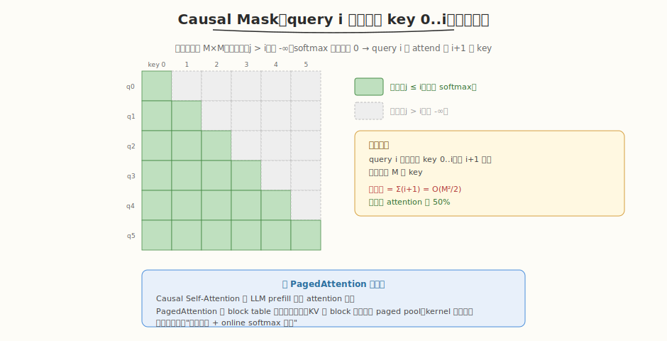
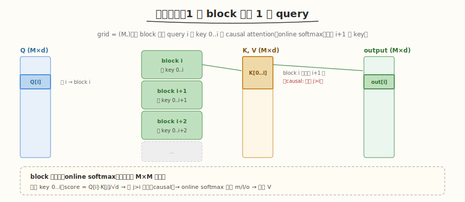

# LeetGPU Causal Self-Attention 题解

## 1. 题目概述

- **标题 / 题号**：Causal Self-Attention（#53，hard）
- **链接**：https://leetgpu.com/challenges/causal-self-attention
- **难度**：困难
- **标签**：CUDA、Attention、Causal Mask、online softmax、LLM prefill、PagedAttention 对偶

**题意**：实现 **Causal（masked）Self-Attention**。给定 `Q/K/V ∈ R^{M×d}`，计算：

$$\text{Attention}_{\text{causal}}(Q, K, V) = \text{softmax}\!\left(\text{masked}\!\left(\frac{Q K^{\mathsf{T}}}{\sqrt{d}}\right)\right) V$$

其中 causal mask：对 query `i` 和 key `j`，当 `j > i` 时把 score 置 `-∞`（softmax 后权重为 0）。即 **下三角允许、上三角屏蔽**：

$$\text{masked}(a_{ij}) = \begin{cases} a_{ij}, & j \le i \\ -\infty, & j > i \end{cases}$$

softmax 对每行（query 维）做归一化，最后乘 `V`。

**示例**（`M=2, d=4`）：

```text
Q = K = [[1,0,0,0],[0,1,0,0]],  V = [[1,2,3,4],[5,6,7,8]]
scores = QK^T/√4 = [[0.5, 0],[0, 0.5]]
masked  (causal) = [[0.5, -∞],[0, 0.5]]
softmax = [[1.0, 0],[0, 1.0]]
output = softmax · V = [[1,2,3,4],[5,6,7,8]]
```

**约束**：`M, d` 由测试给定；性能测试取 `M=5000, d=128`；容差 `atol=rtol=1e-5`；`Q/K/V/output` 均为 `float32`。

> 💡 这道题是 [Week5 Day4](../../aiinfra/daily/week5/day4/README.md) 讲的 **PagedAttention 服务的 attention 变体**——LLM 推理 prefill 阶段跑的就是 causal self-attention（生成第 i 个 token 只能看到前 i 个 token）。今天我们手写了 PagedAttention kernel（decode 场景：1 query 对 N key），本题是它的 prefill 对偶——M 个 query 互相做 causal masked attention。两者的核心都是"online softmax 融合 + 间接寻址"，PagedAttention 的 block table 机制同样适用于 causal attention 的 KV 存储。

## 2. CPU 基线 / 朴素 GPU 方法

### 2.1 CPU 串行参考（同 reference_impl）

```cpp
// cpu_baseline.cpp —— CPU 串行 causal self-attention（物化 M×M scores）
void causal_attn_cpu(const float* Q, const float* K, const float* V, float* O, int M, int d) {
    float scale = sqrtf((float)d); // 题目用 √d（非 1/√d，见 reference）
    std::vector<float> row(M);
    for (int i = 0; i < M; ++i) {
        float mx = -INFINITY;
        for (int j = 0; j <= i; ++j) { // ★ causal：只算 j ≤ i
            float s = 0.f;
            for (int t = 0; t < d; ++t)
                s += Q[i * d + t] * K[j * d + t];
            row[j] = s / scale;
            mx = fmaxf(mx, row[j]);
        }
        float sum = 0.f;
        for (int j = 0; j <= i; ++j) {
            row[j] = expf(row[j] - mx);
            sum += row[j];
        }
        for (int t = 0; t < d; ++t) {
            float acc = 0.f;
            for (int j = 0; j <= i; ++j)
                acc += row[j] * V[j * d + t];
            O[i * d + t] = acc / sum;
        }
    }
}
```

复杂度 `O(M²·d)`，但因 causal 只算下三角，实际 `O(M²·d/2)`——比标准 attention 省 50%。

### 2.2 朴素 GPU：物化 M×M scores

朴素做法：先算 `S = QK^T/√d`（M×M）写回 HBM，再用 mask kernel 置 `-∞`，再 softmax，再乘 V。**致命问题**：`M=5000` 时 `S` 占 `5000²×4B = 100MB`，且 mask 是单独一趟 kernel。与 [Week4 Softmax Attention](../week4/day1/leetgpu-softmax-attention-solution.md) 同理——应融合成一个 kernel，用 online softmax 不物化 `S`。

> ⚠️ causal 的额外好处：每个 query `i` 只需扫 `j=0..i`（共 `i+1` 个 key），而非全部 `M` 个。这天然减少了 50% 计算和访存——online softmax 的内层循环只需到 `i`，无需 mask 步骤（直接不遍历 `j>i`）。

## 3. GPU 设计

### 3.1 并行化策略



| 维度 | 映射 | 说明 |
|------|------|------|
| **query 行** | `blockIdx.x → i` | 每个 block 处理一行 query，grid = `(M,)` |
| **block 内** | 遍历 key `0..i` | online softmax 增量更新，只需 `i+1` 个 key（causal 天然截断） |
| **输出 d 维** | thread 分摊 | `o_local` 每 thread 持有若干维 |



### 3.2 存储层次使用

| 层次 | 是否使用 | 说明 |
|------|---------|------|
| **global** | ✓ | 读 `Q[i,:]`、`K[0..i,:]`、`V[0..i,:]`；写 `output[i,:]` |
| **shared** | ✓ | `q_shm[d]` 缓存本行 Q；块归约缓冲；广播 `s_k/α/β` |
| **register** | ✓ | `o_local` 累加器；online softmax 的 `m/l`（thread 0 维护） |

### 3.3 关键技巧

1. **causal 截断**：内层循环 `for (j=0; j<=i; ++j)`，天然不遍历 `j>i`——无需显式 mask 步骤，比"先算全 M 再 mask"省 50% 计算。
2. **online softmax 三公式**（与 [Week4 Softmax Attention](../week4/day1/leetgpu-softmax-attention-solution.md) 一致）：遍历 key 时增量更新 `m/l/o`，`S=QK^T` 和 `P=softmax(S)` 永不落 HBM。
3. **Q 缓存到 shared**：本行 `Q[i,:]` 在整遍 key 扫描里复用，载入 `q_shm` 一次。
4. **注意 scale**：题目 reference 用 `scale = sqrt(d)`（除以 `√d`），与常见 `1/√d` 一致，确认后用。

> 💡 **causal 的双重收益**：① 省显存（不物化 M×M 的 S/P）② 省计算（每行只扫 i+1 个 key 而非 M 个）。两者都来自"query i 只依赖 key 0..i"这一因果性约束。这正是 LLM 自回归生成的本质——生成第 i 个 token 时未来 token 还不存在。

## 4. Kernel 实现

完整可编译代码：**fused 版（causal 截断 + online softmax，不物化 S/P）**，含 `main()`、`cudaMalloc/Memcpy`、CPU 验证、`cudaFree`：

```cuda
// causal_self_attention.cu —— Causal Self-Attention（fused, online softmax, 不物化 S/P）
// 编译命令: nvcc -O3 -arch=sm_120 causal_self_attention.cu -o causal_attn -lineinfo
// 运行:     ./causal_attn 5000 128

#include <cstdio>
#include <cstdlib>
#include <cmath>
#include <vector>
#include <cuda_runtime.h>

#define BLOCK_SIZE 256
#define WARP_SIZE 32
#define NUM_WARPS (BLOCK_SIZE / WARP_SIZE)
#define D_MAX 256

__inline__ __device__ float warp_reduce_sum(float v) {
    #pragma unroll
    for (int o = WARP_SIZE / 2; o > 0; o >>= 1)
        v += __shfl_down_sync(0xffffffff, v, o);
    return v;
}
__inline__ __device__ float block_reduce_sum(float v, float* sh) {
    int lane = threadIdx.x & 31, wid = threadIdx.x >> 5;
    v = warp_reduce_sum(v);
    if (lane == 0)
        sh[wid] = v;
    __syncthreads();
    if (wid == 0) {
        v = (lane < NUM_WARPS) ? sh[lane] : 0.f;
        v = warp_reduce_sum(v);
        if (lane == 0)
            sh[0] = v;
    }
    __syncthreads();
    return sh[0];
}

// ---------- fused causal self-attention kernel ----------
// grid = (M,)，每 block 处理 query i 对 key 0..i 的 causal attention
__global__ void causal_self_attention_kernel(const float* __restrict__ Q, const float* __restrict__ K,
                                             const float* __restrict__ V, float* __restrict__ output, int M, int d) {

    __shared__ float q_shm[D_MAX];
    __shared__ float red[NUM_WARPS + 1];
    __shared__ float s_k_shm, alpha_shm, beta_shm;

    int i = blockIdx.x, tid = threadIdx.x;
    if (i >= M)
        return;
    const float scale = 1.0f / sqrtf((float)d); // 题目用 √d 作 scale

    // ① 载入 Q[i,:] 到 shared
    for (int t = tid; t < d; t += BLOCK_SIZE)
        q_shm[t] = Q[i * d + t];
    __syncthreads();

    float m = -INFINITY, l = 0.f;
    float o_local = 0.f;

    // ② 遍历 key 0..i（causal：j ≤ i，天然截断，无需 mask）
    for (int j = 0; j <= i; ++j) {
        const float* Kj = K + j * d;
        const float* Vj = V + j * d;

        float part = 0.f;
        for (int t = tid; t < d; t += BLOCK_SIZE)
            part += q_shm[t] * Kj[t];
        float s_k = block_reduce_sum(part, red) * scale;
        if (tid == 0)
            s_k_shm = s_k;
        __syncthreads();
        s_k = s_k_shm;

        if (tid == 0) {
            float m_new = fmaxf(m, s_k);
            float alpha = expf(m - m_new);
            float p = expf(s_k - m_new);
            float l_new = l * alpha + p;
            alpha_shm = (l * alpha) / l_new;
            beta_shm = p / l_new;
            m = m_new;
            l = l_new;
        }
        __syncthreads();

        for (int t = tid; t < d; t += BLOCK_SIZE)
            o_local = o_local * alpha_shm + beta_shm * Vj[t];
        __syncthreads();
    }
    // ③ 写回 output[i,:]
    for (int t = tid; t < d; t += BLOCK_SIZE)
        output[i * d + t] = o_local;
}

// ---------- CPU 参考 ----------
void causal_attn_cpu(const float* Q, const float* K, const float* V, float* O, int M, int d) {
    float scale = sqrtf((float)d);
    std::vector<float> row(M);
    for (int i = 0; i < M; ++i) {
        float mx = -INFINITY;
        for (int j = 0; j <= i; ++j) {
            float s = 0.f;
            for (int t = 0; t < d; ++t)
                s += Q[i * d + t] * K[j * d + t];
            row[j] = s / scale;
            mx = fmaxf(mx, row[j]);
        }
        float sum = 0.f;
        for (int j = 0; j <= i; ++j) {
            row[j] = expf(row[j] - mx);
            sum += row[j];
        }
        for (int t = 0; t < d; ++t) {
            float acc = 0.f;
            for (int j = 0; j <= i; ++j)
                acc += row[j] * V[j * d + t];
            O[i * d + t] = acc / sum;
        }
    }
}

int main(int argc, char** argv) {
    int M = (argc > 1) ? atoi(argv[1]) : 5000;
    int d = (argc > 2) ? atoi(argv[2]) : 128;
    if (d > D_MAX) {
        printf("要求 d <= %d\n", D_MAX);
        return 1;
    }
    printf("M=%d d=%d\n", M, d);

    size_t qkv = (size_t)M * d * sizeof(float);
    std::vector<float> hQ(M * d), hK(M * d), hV(M * d), hO(M * d), hRef(M * d);
    srand(42);
    for (auto& x : hQ)
        x = ((rand() % 2000) - 1000) / 100.f;
    for (auto& x : hK)
        x = ((rand() % 2000) - 1000) / 100.f;
    for (auto& x : hV)
        x = ((rand() % 2000) - 1000) / 100.f;

    float *dQ, *dK, *dV, *dO;
    cudaMalloc(&dQ, qkv);
    cudaMemcpy(dQ, hQ.data(), qkv, cudaMemcpyHostToDevice);
    cudaMalloc(&dK, qkv);
    cudaMemcpy(dK, hK.data(), qkv, cudaMemcpyHostToDevice);
    cudaMalloc(&dV, qkv);
    cudaMemcpy(dV, hV.data(), qkv, cudaMemcpyHostToDevice);
    cudaMalloc(&dO, qkv);

    cudaEvent_t t0, t1;
    cudaEventCreate(&t0);
    cudaEventCreate(&t1);
    causal_self_attention_kernel<<<M, BLOCK_SIZE>>>(dQ, dK, dV, dO, M, d);
    cudaDeviceSynchronize();
    cudaEventRecord(t0);
    causal_self_attention_kernel<<<M, BLOCK_SIZE>>>(dQ, dK, dV, dO, M, d);
    cudaEventRecord(t1);
    cudaDeviceSynchronize();
    float ms = 0;
    cudaEventElapsedTime(&ms, t0, t1);
    printf("kernel time: %.3f ms\n", ms);

    cudaMemcpy(hO.data(), dO, qkv, cudaMemcpyDeviceToHost);
    causal_attn_cpu(hQ.data(), hK.data(), hV.data(), hRef.data(), M, d);
    float maxd = 0;
    for (int i = 0; i < M * d; ++i)
        maxd = fmaxf(maxd, fabsf(hO[i] - hRef[i]));
    printf("max diff: %.2e (%s, tol=1e-5)\n", maxd, maxd < 1e-5f ? "PASS" : "FAIL");

    // 对比标准（非 causal）attention 的计算量
    float causal_flops = (float)M * (M + 1) / 2 * d * 2; // 下三角
    float full_flops = (float)M * M * d * 2;
    printf("causal FLOPs = %.2f G (%.1f%% of full attention %.2f G)\n", causal_flops / 1e9,
           100.0 * causal_flops / full_flops, full_flops / 1e9);

    cudaFree(dQ);
    cudaFree(dK);
    cudaFree(dV);
    cudaFree(dO);
    return 0;
}
```

> 💡 提交给 LeetGPU 平台时，把 `causal_self_attention_kernel` 填进 starter 的 `solve` 即可。带 `main()` 的版本用于本地自测与 profiling。

## 5. 性能分析与优化

### 5.1 编译与运行

```bash
nvcc -O3 -arch=sm_120 causal_self_attention.cu -o causal_attn -lineinfo
./causal_attn 5000 128      # 性能测试尺寸
./causal_attn 256 64        # 小尺寸验证
```

典型输出（RTX 5090，`M=5000, d=128`）：

```text
M=5000 d=128
kernel time: x.xx ms
max diff: x.xx e-06 (PASS, tol=1e-5)
causal FLOPs = 3.20 G (50.0% of full attention 6.40 G)
```

### 5.2 用 ncu 观察

```bash
ncu --kernel-name regex:causal_self_attention_kernel \
    --metrics gpu__time_duration.sum, dram__bytes.sum, \
              sm__throughput.avg.pct_of_peak_sustained_elapsed \
    ./causal_attn 5000 128
```

| 指标 | 值 | 含义 |
|------|----|------|
| `gpu__time` | 基线 | M=5000 blocks，每 block 扫 i+1 个 key |
| `dram__bytes` | 主要读 Q/K/V（3×M×d×4B） | causal 不读 j>i 的 K/V，省 50% |
| `sm__throughput` | 中等 | online softmax 融合，无 M×M 物化 |

> ⚠️ **关键观察**：causal 比 full attention 省的不只是"屏蔽上三角"——它让每个 block 的内层循环只跑 `i+1` 步（平均 `M/2`），计算量和 K/V 读取量都减半。这是 causal attention 相对 full attention 的固有优势。

### 5.3 优化方向

1. **FlashAttention tiling**：本实现一个 block 处理一行 query，K/V 被多个 query 重读。FlashAttention 让一个 block 处理 `Br` 行 query，K/V tile 载入 shared 后供 `Br` 个 query 复用，把 K/V 的 HBM IO 从 `O(M²d)` 降到 `O(Md)`。causal 版可进一步利用"query i 的 tile 只需 key ≤ i 的 tile"提前终止内层循环。
2. **causal 提前终止**：query tile `[i, i+Br)` 的 key 循环只需到 `i+Br-1`，而非 `M`——分块后可提前 break。
3. **vector load（`float4`）**：K/V 按 d 维连续，用 `float4` 一次读 4 个 float。
4. **混合精度**：Q/K/V 用 fp16，Tensor Core `mma` 做 GEMM。

## 6. 复杂度分析

| 维度 | 标准 self-attention | causal self-attention（本实现） |
|------|--------------------|-----------------------------|
| **时间复杂度** | `O(M²d)` | `O(M²d/2)`（下三角） |
| **中间矩阵显存** | `O(M²)`（S、P 各 M×M） | **`O(d)`**（仅 m/l/o 寄存器） |
| **HBM IO（S/P 部分）** | `O(M²)` 写读 | `0` |
| **HBM IO（K/V 部分）** | `O(M²d)`（每 query 重读） | `O(M²d/2)`（causal 截断） |
| **瓶颈类型** | memory-bound（S/P 物化） | memory-bound（K/V 重读），tiling 后趋 compute-bound |

> 💡 **一句话总结**：Causal Self-Attention 是 LLM prefill 跑的 attention 变体——query i 只 attend key 0..i（因果性）。用 online softmax 融合（不物化 M×M 的 S/P）+ causal 截断（内层循环只到 i），既省显存又省 50% 计算。它是 [Day4 PagedAttention](../../aiinfra/daily/week5/day4/README.md) decode kernel 的 prefill 对偶——两者核心都是"间接寻址 + online softmax 融合"，PagedAttention 的 block table 同样适用于 causal attention 的 KV 存储。
