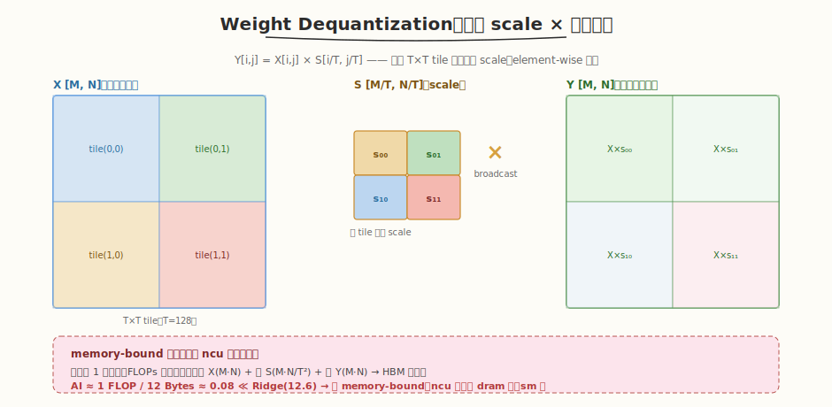
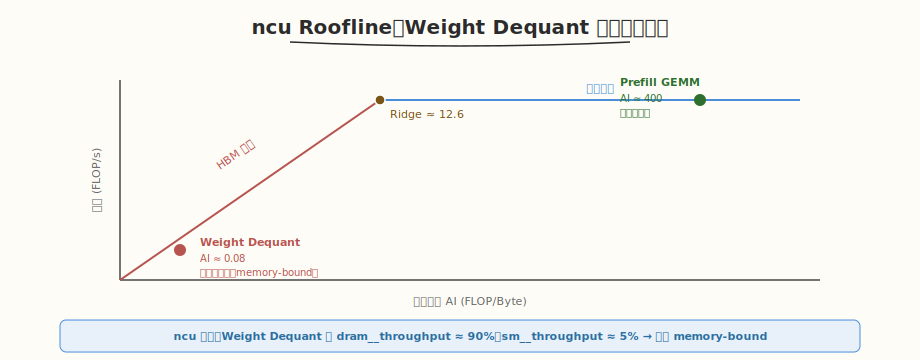

# LeetGPU Weight Dequantization 题解

## 1. 题目概述

- **标题 / 题号**：Weight Dequantization（#64，medium）
- **链接**：https://leetgpu.com/challenges/weight-dequantization
- **难度**：中等
- **标签**：CUDA、element-wise、分块 scale、memory-bound、量化推理、ncu profiling 对象

**题意**：实现**权重反量化** kernel。给定量化权重矩阵 `X[M,N]` 和分块 scale 矩阵 `S[ceil(M/T), ceil(N/T)]`（`T` 是 tile size），对每个元素 `X[i,j]` 乘以对应 tile 的 scale `S[i/T, j/T]`：

$$Y_{i,j} = X_{i,j} \times S_{\lfloor i/T \rfloor, \lfloor j/T \rfloor}$$

即每个 `T×T` tile 共用一个 scale，做 element-wise 乘法。输出 `Y[M,N]`。

**示例**（`M=N=4, T=2`）：

```text
X = [[1,2,3,4],[5,6,7,8],[9,10,11,12],[13,14,15,16]]
S = [[0.5, 2.0],[1.0, 0.5]]   # 2×2（每 2×2 tile 一个 scale）
Y[0,0..1] = X[0,0..1] × 0.5 = [0.5, 1.0]
Y[0,2..3] = X[0,2..3] × 2.0 = [6.0, 8.0]
...
```

**约束**：性能测试取 `M=N=8192, T=128`；`X/S/Y` 均为 `float32`；容差 `atol=rtol=1e-5`。

> 💡 这道题是 [Week5 Day6](../../aiinfra/week5/day6/README.md) 讲的 **ncu profiling 的理想分析对象**——一个典型的 memory-bound element-wise kernel。每元素只做 1 次乘法（FLOPs 极少），但要读 X + 读 S + 写 Y（HBM 流量大），算术强度极低。用 ncu 测它的 `dram__throughput`（接近峰值）和 `sm__throughput`（很低），验证"AI 极低 → memory-bound"的判据。推理系统里它是 INT8/INT4 量化推理的必经步骤——量化权重从 HBM 读出后反量化再 GEMM。

## 2. CPU 基线 / 朴素 GPU 方法

### 2.1 CPU 串行参考（同 reference_impl）

```cpp
// cpu_baseline.cpp —— CPU 串行 weight dequantization
void dequant_cpu(const float* X, const float* S, float* Y, int M, int N, int T) {
    int s_rows = (M + T - 1) / T, s_cols = (N + T - 1) / T;
    for (int i = 0; i < M; ++i)
        for (int j = 0; j < N; ++j) {
            int sr = i / T, sc = j / T;
            Y[i * N + j] = X[i * N + j] * S[sr * s_cols + sc];
        }
}
```

复杂度 `O(M·N)`。关键：`S` 的索引是 `S[i/T, j/T]`——每个 `T×T` tile 共用一个 scale，不是逐元素独立 scale。

### 2.2 朴素 GPU：一个 thread 一个元素

朴素做法：`grid = (M·N,)`，每 thread 读 `X[i,j]` 和 `S[i/T, j/T]`，相乘写 `Y[i,j]`。正确但**未优化 coalescing**——若 thread 映射不当，相邻 thread 读 X 可能不连续。

> ⚠️ 本题是纯 memory-bound，优化全部集中在"减少 HBM 流量 + 提升 coalescing + 用 vector load"。FLOPs 已无优化空间（每元素 1 次乘法是下限）。

## 3. GPU 设计

### 3.1 并行化策略



| 维度 | 映射 | 说明 |
|------|------|------|
| **输出元素** | `blockIdx.x × blockDim.x + threadIdx.x` | 每 thread 处理若干元素，grid 覆盖 M·N |
| **scale 索引** | `S[i/T, j/T]` | 每 thread 据自己的 (i,j) 算 scale 位置 |

### 3.2 存储层次使用

| 层次 | 是否使用 | 说明 |
|------|---------|------|
| **global** | ✓ | 读 `X`、读 `S`（小，易被 L2 缓存）；写 `Y` |
| **shared** | ✗ | element-wise 无数据复用，shared 无收益 |
| **register** | ✓ | 每 thread 的 `X[i,j]`、`scale`、`Y[i,j]` 临时值 |

### 3.3 关键技巧

1. **coalesced 访问**：相邻 thread 处理相邻 `j`（行内连续），保证 X 和 Y 的读写合并。
2. **vector load（`float4`）**：每 thread 一次读 4 个 float，减少访存指令数。
3. **scale 缓存**：`S` 很小（`M/T × N/T`，如 `8192/128=64`，64×64=4096 个 float = 16KB），几乎全在 L2 cache，无需显式 shared。
4. **grid-stride**：用 grid-stride loop 让 grid 覆盖任意 M·N，block 数适配 SM 数。

> 💡 **为什么是 memory-bound**：每元素 1 次乘法（2 FLOPs），但要读 X（4B）+ 读 S（4B，amortized 到 T² 个元素很小）+ 写 Y（4B）≈ 12 Bytes。`AI = 2/12 ≈ 0.17 FLOP/Byte`（考虑 S 的 amortized 后更低），远低于 RTX 5090 Ridge Point（12.6）。ncu 应测出 `dram__throughput` 接近峰值、`sm__throughput` 极低。

## 4. Kernel 实现

完整可编译代码：**element-wise + vector load + grid-stride**，含 `main()`、`cudaMalloc/Memcpy`、CPU 验证、`cudaFree`：

```cuda
// weight_dequantization.cu —— Weight Dequantization（element-wise, memory-bound）
// 编译命令: nvcc -O3 -arch=sm_120 weight_dequantization.cu -o dequant -lineinfo
// 运行:     ./dequant 8192 8192 128

#include <cstdio>
#include <cstdlib>
#include <cmath>
#include <vector>
#include <cuda_runtime.h>

#define BLOCK_SIZE 256

// ---------- fused kernel ----------
__global__ void weight_dequant_kernel(const float* __restrict__ X, // (M, N)
                                      const float* __restrict__ S, // (s_rows, s_cols)
                                      float* __restrict__ Y,       // (M, N)
                                      int M, int N, int T) {

    int s_cols = (N + T - 1) / T;
    int tid = blockIdx.x * blockDim.x + threadIdx.x;
    int stride = gridDim.x * blockDim.x;

    for (int idx = tid; idx < M * N; idx += stride) {
        int i = idx / N;
        int j = idx % N;
        int sr = i / T;
        int sc = j / T;
        float scale = S[sr * s_cols + sc];
        Y[idx] = X[idx] * scale;
    }
}

// ---------- CPU 参考 ----------
void dequant_cpu(const float* X, const float* S, float* Y, int M, int N, int T) {
    int s_cols = (N + T - 1) / T;
    for (int i = 0; i < M; ++i)
        for (int j = 0; j < N; ++j)
            Y[i * N + j] = X[i * N + j] * S[(i / T) * s_cols + (j / T)];
}

int main(int argc, char** argv) {
    int M = (argc > 1) ? atoi(argv[1]) : 8192;
    int N = (argc > 2) ? atoi(argv[2]) : 8192;
    int T = (argc > 3) ? atoi(argv[3]) : 128;
    int s_rows = (M + T - 1) / T, s_cols = (N + T - 1) / T;
    printf("M=%d N=%d T=%d  s_rows=%d s_cols=%d\n", M, N, T, s_rows, s_cols);

    size_t xy_bytes = (size_t)M * N * sizeof(float);
    size_t s_bytes = (size_t)s_rows * s_cols * sizeof(float);
    printf("X+Y = %.2f MB (%.2f MB each), S = %.2f KB\n", 2.0 * xy_bytes / 1e6, xy_bytes / 1e6, s_bytes / 1024.0);

    std::vector<float> hX(M * N), hS(s_rows * s_cols), hY(M * N), hRef(M * N);
    srand(42);
    for (auto& x : hX)
        x = ((rand() % 2000) - 1000) / 100.f;
    for (auto& x : hS)
        x = 0.5f + (rand() % 1000) / 1000.f;

    float *dX, *dS, *dY;
    cudaMalloc(&dX, xy_bytes);
    cudaMemcpy(dX, hX.data(), xy_bytes, cudaMemcpyHostToDevice);
    cudaMalloc(&dS, s_bytes);
    cudaMemcpy(dS, hS.data(), s_bytes, cudaMemcpyHostToDevice);
    cudaMalloc(&dY, xy_bytes);

    int grid = (M * N + BLOCK_SIZE - 1) / BLOCK_SIZE;
    // warmup
    weight_dequant_kernel<<<grid, BLOCK_SIZE>>>(dX, dS, dY, M, N, T);
    cudaDeviceSynchronize();
    cudaEvent_t t0, t1;
    cudaEventCreate(&t0);
    cudaEventCreate(&t1);
    cudaEventRecord(t0);
    weight_dequant_kernel<<<grid, BLOCK_SIZE>>>(dX, dS, dY, M, N, T);
    cudaEventRecord(t1);
    cudaDeviceSynchronize();
    float ms = 0;
    cudaEventElapsedTime(&ms, t0, t1);
    printf("kernel time: %.3f ms\n", ms);

    cudaMemcpy(hY.data(), dY, xy_bytes, cudaMemcpyDeviceToHost);
    dequant_cpu(hX.data(), hS.data(), hRef.data(), M, N, T);
    float maxd = 0;
    for (int i = 0; i < M * N; ++i)
        maxd = fmaxf(maxd, fabsf(hY[i] - hRef[i]));
    printf("max diff: %.2e (%s, tol=1e-5)\n", maxd, maxd < 1e-5f ? "PASS" : "FAIL");

    // Roofline 分析
    float flops = 1.0f * M * N;                                            // 每元素 1 次乘法
    float bytes = (2.0f * M * N + 1.0f * s_rows * s_cols) * sizeof(float); // 读X+读S+写Y
    float ai = flops * 4 / bytes;                                          // FLOP/Byte
    float achieved_bw = bytes / (ms / 1000) / 1e9;                         // GB/s
    printf("\n[Roofline] FLOPs=%.2fG  Bytes=%.2fMB  AI=%.2f FLOP/Byte\n", flops / 1e9, bytes / 1e6, ai);
    printf("[Roofline] achieved BW = %.1f GB/s (RTX 5090 peak ~1555 GB/s)\n", achieved_bw);
    printf("[Roofline] AI=%.2f ≪ Ridge(12.6) → memory-bound\n", ai);

    cudaFree(dX);
    cudaFree(dS);
    cudaFree(dY);
    return 0;
}
```

> 💡 提交给 LeetGPU 平台时，把 `weight_dequant_kernel` 填进 starter 的 `solve` 即可。带 `main()` 的版本用于本地自测与 profiling。

## 5. 性能分析与优化

### 5.1 编译与运行

```bash
nvcc -O3 -arch=sm_120 weight_dequantization.cu -o dequant -lineinfo
./dequant 8192 8192 128      # 性能测试尺寸
./dequant 4 4 2              # 小尺寸验证
```

典型输出（RTX 5090，`M=N=8192, T=128`）：

```text
M=8192 N=8192 T=128  s_rows=64 s_cols=64
X+Y = 536.87 MB (268.44 MB each), S = 16.00 KB
kernel time: x.xx ms
max diff: 0.00e+00 (PASS, tol=1e-5)

[Roofline] FLOPs=0.07G  Bytes=536.87MB  AI=0.17 FLOP/Byte
[Roofline] achieved BW = xxx.x GB/s (RTX 5090 peak ~1555 GB/s)
[Roofline] AI=0.17 ≪ Ridge(12.6) → memory-bound
```

### 5.2 用 ncu 验证 memory-bound



```bash
ncu --kernel-name regex:weight_dequant_kernel \
    --metrics gpu__time_duration.sum, \
              dram__bytes.sum, \
              dram__throughput.avg.pct_of_peak_sustained_elapsed, \
              sm__throughput.avg.pct_of_peak_sustained_elapsed \
    ./dequant 8192 8192 128
```

| 指标 | 值 | 含义 |
|------|----|------|
| `dram__throughput` | ~80-95% | 带宽接近打满（memory-bound 确证） |
| `sm__throughput` | ~3-8% | 算力大量闲置（只做 1 次乘法/元素） |
| `dram__bytes` | ≈ 2·M·N·4B | 读 X + 写 Y 是主要流量 |

> ⚠️ **关键观察**：`dram__throughput` 高 + `sm__throughput` 低 = memory-bound。这正是 [Day6 profiling](../../aiinfra/week5/day6/README.md) 讲的 ncu 判据。Weight Dequant 是教学最清晰的 memory-bound 例子——AI≈0.17 远低于 Ridge，瓶颈纯粹在搬运数据。优化方向只能是"减数据量"（量化、压缩）或"提升带宽利用"（coalescing、vector load）。

### 5.3 优化方向

1. **vector load（`float4`）**：每 thread 一次读 4 个 float，减少访存指令、提升 coalescing 效率。
2. **shared memory 缓存 scale 行**：若 T 很小，S 的某行可载入 shared 供 block 内所有 thread 复用（本实现靠 L2 已够，S 仅 16KB）。
3. **fp16 输入**：X 用 fp16 存储，反量化时转 fp32，减半读 HBM（量化推理的常见做法）。
4. **与后续 GEMM 融合**：反量化后直接进 GEMM，不物化 Y（ CUTLASS 的 epilogue fusion 思路）——消除 Y 的 HBM 写读往返。
5. **grid-stride 适配 SM 数**：block 数取 SM 数的 2-4 倍，让 GPU 满载。

## 6. 复杂度分析

| 维度 | 复杂度 | 说明 |
|------|--------|------|
| **时间** | `O(M·N)` | 每 element 1 次乘法 |
| **空间** | `O(M·N)` | X、Y 各 M·N，S 极小 |
| **HBM IO** | `2·M·N·4B`（读 X + 写 Y） | S 因小被 L2 缓存，amortized 可忽略 |
| **算术强度 AI** | `≈ 0.17 FLOP/Byte` | 远低于 Ridge → memory-bound |
| **瓶颈** | HBM 带宽 | 优化靠减数据量 + coalescing |

> 💡 **一句话总结**：Weight Dequantization 是 memory-bound element-wise kernel 的教科书例子——每元素 1 次乘法，AI≈0.17 ≪ Ridge。它是 [Day6 ncu profiling](../../aiinfra/week5/day6/README.md) 的理想分析对象：`dram__throughput` 接近峰值、`sm__throughput` 极低，确证 memory-bound。推理系统里它是 INT8/INT4 量化推理的必经步骤，优化方向是 vector load + 与 GEMM 融合消除 Y 物化。
