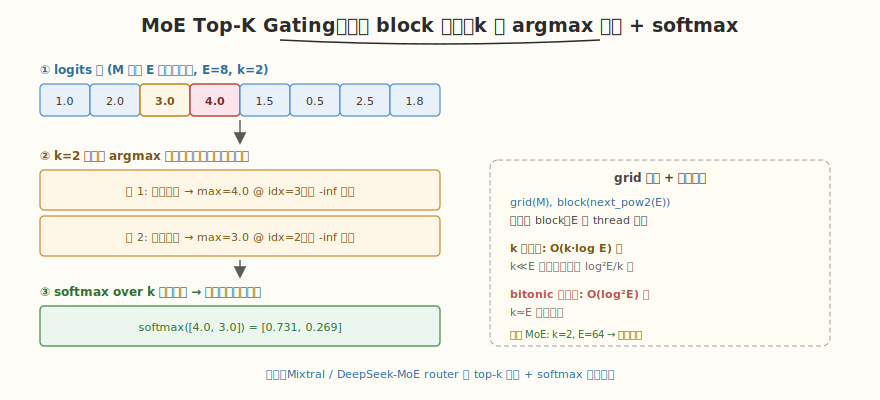

# LeetGPU MoE Top-K Gating 题解

## 1. 题目概述

- **标题 / 题号**：MoE Top-K Gating（#67，medium）
- **链接**：https://leetgpu.com/challenges/moe-topk-gating
- **难度**：中等
- **标签**：CUDA、top-k 选择、并行归约、softmax、MoE 路由

**题意**：给定路由 logits 张量 `logits`（`M×E`，float32，M 个 token 各对 E 个专家的打分），对每一行选出**最大的 k 个**值及其原始列索引，再对这 k 个值做 softmax，输出 `topk_weights`（`M×k`，float32）和 `topk_indices`（`M×k`，int32）。

**示例**：

```text
M=2, E=4, k=2
logits = [[1.0, 2.0, 3.0, 4.0],
          [4.0, 3.0, 2.0, 1.0]]
torch.topk → vals=[[4,3],[4,3]], indices=[[3,2],[0,1]]  (降序)
softmax([4,3]) = [0.731, 0.269]
topk_weights = [[0.731, 0.269], [0.731, 0.269]]
topk_indices = [[3, 2], [0, 1]]
```

**约束**：`1 ≤ k ≤ E`，`1 ≤ M`；性能测试 `M=1024, E=64, k=2`。精度 `atol=1e-5, rtol=1e-5`。`torch.topk` 返回**降序**（最大值在前），`topk_indices` 为 int32。

> 💡 这道题的 **MoE Top-K Gating** 是 Mixtral / DeepSeek-MoE 等稀疏模型的路由核心：每个 token 经 router 算出对 E 个专家的 logits，选 top-k 个专家并 softmax 归一化作为门控权重。与标准 softmax 的区别是「先选 top-k 再 softmax」（只对被选中的 k 个专家归一化），降低推理算力。

## 2. CPU 基线 / 朴素 GPU 方法

### CPU 串行

```cpp
// 方法 1：完整排序取前 k → O(E log E)
sort(logits_row);  // 降序
// 前 k 个 + 记录原始 index
// softmax over k

// 方法 2：k 趟线性扫描找最大 → O(k·E)
for (int sel = 0; sel < k; sel++) {
    int argmax = -1; float maxv = -inf;
    for (int e = 0; e < E; e++)
        if (!used[e] && logits[e] > maxv) { maxv = logits[e]; argmax = e; }
    used[argmax] = true;
    vals[sel] = maxv; idx[sel] = argmax;  // 自然降序
}
// softmax over vals
```

### 朴素 GPU（完整 bitonic 排序）

```cuda
// 对每行做 bitonic sort（升序），取后 k 个，再算 softmax
// 瓶颈：只需 top-k 却全排序，E=64 时 O(E log²E) 浪费；
//       且排序破坏原始 index，需额外 index 追踪
```

**瓶颈**：`k` 远小于 `E` 时（典型 `k=2, E=64`），全排序 `O(E log²E)` 浪费严重；只需要 k 趟最大值归约即可，`O(k·E)` 或 `O(k·log E)`。

## 3. GPU 设计

### 3.1 并行化策略：一个 block 处理一行，k 趟并行 argmax 归约



策略：

1. **grid = M 个 block**，每个 block 处理 `logits` 的一行（E 个元素）。
2. **block size = next_pow2(E)**（如 `E=64 → 64` threads），每 thread 负责一个元素。
3. **k 趟 argmax 归约**：每趟用 shared memory 树形归约找出「当前最大值 + 原始索引」，记录后把该位置置 `-inf`，重复 k 次。结果天然**降序**（第 1 趟最大、第 2 趟次大…），与 `torch.topk` 顺序一致。
4. **softmax over k 个选中值**：max → exp → sum → scale，写回 `topk_weights` 和 `topk_indices`。

**为什么 k 趟归约优于全排序**：`k=2, E=64` 时，k 趟归约 = `2 × 6 步`，而 bitonic 全排序 = `6 × 6 = 36 步`。k 越小优势越大，正好契合 MoE `k≪E` 的典型场景。

### 3.2 存储层次使用

| 数据 | 存储 | 说明 |
|------|------|------|
| `logits` 行 | global memory | 读取 `logits[row*E + tid]` |
| 行数据 + index | shared memory | `s_vals[BLOCK]`、`s_idx[BLOCK]`，归约原地更新 |
| 选中值/索引 | shared memory | `sel_vals[k]`、`sel_idx[k]`，供 softmax |
| 输出 | global memory | `topk_weights[row*k+i]`、`topk_indices[row*k+i]` |

### 3.3 关键技巧

- **并行 argmax 带索引归约**：树形归约时同时携带 `(value, index)`，比较 `s_vals[tid+stride] > s_vals[tid]` 时同时更新 value 和 index。平局时保留低 id（`>` 不含 `=`），匹配 `torch.topk` 平局取靠前位置的行为。
- **置** `-inf` **剔除已选**：每趟选完后 thread 0 把 `s_vals[argmax] = -inf`，下一趟自动跳过。
- **天然降序**：第 `sel` 趟选第 `sel+1` 大的值，`sel_vals[0..k-1]` 即降序，无需额外排序。
- **softmax 数值稳定**：先减 `max(sel_vals)` 再 `expf`，避免上溢。

## 4. Kernel 实现

```cuda
// moe_topk_gating.cu —— MoE Top-K Gating（k 趟 argmax 归约 + softmax）
// 编译命令: nvcc -O3 -arch=sm_120 moe_topk_gating.cu -o moe_topk
// 运行:     ./moe_topk

#include <cstdio>
#include <cstdlib>
#include <vector>
#include <cmath>
#include <cuda_runtime.h>

#define BLOCK 128   // 覆盖 E ≤ 128；E 更大时可调大（≤1024）

// 一个 block 处理一行：grid(M), block(BLOCK=next_pow2(E))
__global__ void moe_topk_kernel(const float* logits, float* topk_weights, int* topk_indices,
                                int M, int E, int k) {
    int row = blockIdx.x;
    if (row >= M) return;
    int tid = threadIdx.x;

    __shared__ float s_vals[BLOCK];
    __shared__ int   s_idx[BLOCK];
    __shared__ float sel_vals[64];   // k ≤ E ≤ BLOCK
    __shared__ int   sel_idx[64];
    __shared__ float s_red[BLOCK];   // softmax 归约用

    // ① 加载行数据到 shared memory
    if (tid < E) {
        s_vals[tid] = logits[row * E + tid];
        s_idx[tid]  = tid;
    } else {
        s_vals[tid] = -1e30f;
        s_idx[tid]  = -1;
    }
    __syncthreads();

    // ② k 趟 argmax 归约
    for (int sel = 0; sel < k; sel++) {
        // 树形归约找 (max_val, argmax_idx)
        for (int stride = BLOCK / 2; stride > 0; stride >>= 1) {
            if (tid < stride) {
                if (s_vals[tid + stride] > s_vals[tid]) {
                    s_vals[tid] = s_vals[tid + stride];
                    s_idx[tid]  = s_idx[tid + stride];
                }
            }
            __syncthreads();
        }
        // thread 0 持有当前最大
        if (tid == 0) {
            sel_vals[sel] = s_vals[0];
            sel_idx[sel]  = s_idx[0];
            s_vals[s_idx[0]] = -1e30f;   // 剔除已选
        }
        __syncthreads();
    }

    // ③ softmax over k 个选中值（数值稳定）
    // 求 max
    if (tid == 0) {
        float mx = sel_vals[0];
        for (int i = 1; i < k; i++) if (sel_vals[i] > mx) mx = sel_vals[i];
        float s = 0.0f;
        for (int i = 0; i < k; i++) { sel_vals[i] = expf(sel_vals[i] - mx); s += sel_vals[i]; }
        float inv = 1.0f / s;
        for (int i = 0; i < k; i++) {
            topk_weights[row * k + i] = sel_vals[i] * inv;
            topk_indices[row * k + i] = sel_idx[i];
        }
    }
}

int main() {
    int M = 8, E = 64, k = 2;
    std::vector<float> h_logits(M * E), h_w(M * k);
    std::vector<int>   h_idx(M * k);
    srand(123);
    for (auto& x : h_logits) x = (rand() % 1000) / 100.0f - 5.0f;

    float *d_logits, *d_w;
    int   *d_idx;
    cudaMalloc(&d_logits, M * E * sizeof(float));
    cudaMalloc(&d_w, M * k * sizeof(float));
    cudaMalloc(&d_idx, M * k * sizeof(int));
    cudaMemcpy(d_logits, h_logits.data(), M * E * sizeof(float), cudaMemcpyHostToDevice);

    int block = BLOCK;
    moe_topk_kernel<<<M, block>>>(d_logits, d_w, d_idx, M, E, k);
    cudaDeviceSynchronize();
    cudaMemcpy(h_w.data(), d_w, M * k * sizeof(float), cudaMemcpyDeviceToHost);
    cudaMemcpy(h_idx.data(), d_idx, M * k * sizeof(int), cudaMemcpyDeviceToHost);

    // CPU 验证：k 趟线性 argmax + softmax
    bool pass = true;
    for (int r = 0; r < M && pass; r++) {
        std::vector<bool> used(E, false);
        std::vector<float> cv(k); std::vector<int> ci(k);
        for (int sel = 0; sel < k; sel++) {
            int am = -1; float mx = -1e30f;
            for (int e = 0; e < E; e++)
                if (!used[e] && h_logits[r*E+e] > mx) { mx = h_logits[r*E+e]; am = e; }
            used[am] = true; cv[sel] = mx; ci[sel] = am;
        }
        float mx = cv[0]; for (int i=1;i<k;i++) if (cv[i]>mx) mx=cv[i];
        float s = 0; for (int i=0;i<k;i++){ cv[i]=expf(cv[i]-mx); s+=cv[i]; }
        for (int i = 0; i < k && pass; i++) {
            if (fabs(cv[i]/s - h_w[r*k+i]) > 1e-5 || ci[i] != h_idx[r*k+i]) {
                printf("row %d i %d: cpu=(%f,%d) gpu=(%f,%d)\n", r, i, cv[i]/s, ci[i], h_w[r*k+i], h_idx[r*k+i]);
                pass = false;
            }
        }
    }
    printf("M=%d E=%d k=%d, %s\n", M, E, k, pass ? "PASS" : "FAIL");

    cudaFree(d_logits); cudaFree(d_w); cudaFree(d_idx);
    return 0;
}
```

> 💡 提交给 LeetGPU 平台时，把 `moe_topk_kernel` 填进 `solve`。核心是「一个 block 一行 + k 趟并行 argmax 归约（带索引）+ 末尾 softmax」。block size 取 `next_pow2(E)`（host 端算好传入），天然降序匹配 `torch.topk`。

### 4.1 LeetGPU 提交版本

下面给出适配 LeetGPU 官方 starter 签名的提交版本。host 端计算 `block = next_pow2(E)`（封顶 1024），每个 block 处理一行，k 趟 argmax 归约后对 k 个值做 softmax。

```cuda
#include <cuda_runtime.h>

#define MAX_BLOCK 1024

__global__ void moe_topk_kernel(const float* logits, float* topk_weights, int* topk_indices,
                                int M, int E, int k) {
    int row = blockIdx.x;
    if (row >= M) return;
    int tid = threadIdx.x;

    extern __shared__ unsigned char smem[];
    float* s_vals  = (float*)smem;
    int*   s_idx   = (int*)(s_vals + blockDim.x);
    float* sel_vals = (float*)(s_idx + blockDim.x);
    int*   sel_idx  = (int*)(sel_vals + blockDim.x);

    if (tid < E) {
        s_vals[tid] = logits[row * E + tid];
        s_idx[tid]  = tid;
    } else {
        s_vals[tid] = -1e30f;
        s_idx[tid]  = -1;
    }
    __syncthreads();

    for (int sel = 0; sel < k; sel++) {
        for (int stride = blockDim.x / 2; stride > 0; stride >>= 1) {
            if (tid < stride) {
                if (s_vals[tid + stride] > s_vals[tid]) {
                    s_vals[tid] = s_vals[tid + stride];
                    s_idx[tid]  = s_idx[tid + stride];
                }
            }
            __syncthreads();
        }
        if (tid == 0) {
            sel_vals[sel] = s_vals[0];
            sel_idx[sel]  = s_idx[0];
            s_vals[s_idx[0]] = -1e30f;
        }
        __syncthreads();
    }

    if (tid == 0) {
        float mx = sel_vals[0];
        for (int i = 1; i < k; i++) if (sel_vals[i] > mx) mx = sel_vals[i];
        float s = 0.0f;
        for (int i = 0; i < k; i++) { sel_vals[i] = expf(sel_vals[i] - mx); s += sel_vals[i]; }
        float inv = 1.0f / s;
        for (int i = 0; i < k; i++) {
            topk_weights[row * k + i] = sel_vals[i] * inv;
            topk_indices[row * k + i] = sel_idx[i];
        }
    }
}

// logits, topk_weights, topk_indices are device pointers
extern "C" void solve(const float* logits, float* topk_weights, int* topk_indices,
                      int M, int E, int k) {
    int block = 1;
    while (block < E) block <<= 1;
    if (block > MAX_BLOCK) block = MAX_BLOCK;

    // 动态 shared memory: s_vals[block] + s_idx[block] + sel_vals[k] + sel_idx[k]
    size_t smem = (block * sizeof(float) + block * sizeof(int) +
                   k * sizeof(float) + k * sizeof(int));
    moe_topk_kernel<<<M, block, smem>>>(logits, topk_weights, topk_indices, M, E, k);
    cudaDeviceSynchronize();
}
```

### 4.2 代码详解

`moe_topk_kernel` 采用 **「一行一 block + k 趟并行 argmax 归约」** 结构。每趟归约找出当前剩余元素的最大值及其原始索引，记录后置 `-inf` 剔除，重复 k 次得到降序 top-k，最后 softmax。

**kernel 逐段解析**：

1. **行索引与 shared memory 布局**
   - `row = blockIdx.x`：一个 block 处理一行。
   - 动态 shared memory 划分：`s_vals[block]`（值）、`s_idx[block]`（索引）、`sel_vals[k]`、`sel_idx[k]`（选中结果）。教学版用固定大小，提交版用 `extern __shared__` 动态分配以适配任意 `E`。

2. **加载行数据**
   - `s_vals[tid] = logits[row*E + tid]`（`tid < E`），`s_idx[tid] = tid`。
   - `tid >= E` 补 `-1e30f`（归约时沉底，不干扰 argmax）。
   - `__syncthreads`。

3. **k 趟 argmax 归约（核心）**
   - 外层 `for (sel = 0; sel < k; sel++)`：共 k 趟。
   - **树形归约**：`for (stride = blockDim.x/2; stride > 0; stride >>= 1)`，每步 `if (s_vals[tid+stride] > s_vals[tid])` 则同时更新 `s_vals[tid]` 和 `s_idx[tid]`——**带索引的 argmax 归约**。平局用 `>`（不含 `=`）保留低 id，匹配 `torch.topk` 平局取靠前位置。
   - 归约到 `tid==0` 后：`sel_vals[sel] = s_vals[0]`、`sel_idx[sel] = s_idx[0]`，并把 `s_vals[s_idx[0]] = -1e30f` **剔除已选**，下一趟自动跳过。
   - `__syncthreads`：确保剔除可见后再进下一趟。

4. **softmax over k 个选中值**
   - thread 0 串行计算（k 很小）：`mx = max(sel_vals)`，`sel_vals[i] = expf(sel_vals[i]-mx)`（数值稳定），`s = sum`，`weight = sel_vals[i]/s`。
   - 写回 `topk_weights[row*k+i]` 和 `topk_indices[row*k+i]`。顺序为降序（第 0 个最大），与 `torch.topk` 一致。

**关键索引与变量**：

| 变量 | 含义 |
|------|------|
| `row` | 当前处理的行（token） |
| `tid` | block 内线程号，对应专家索引 `e`（`tid < E`） |
| `s_vals` / `s_idx` | shared memory 中的值与原始索引，归约中更新 |
| `sel_vals` / `sel_idx` | k 趟选中的（值, 索引），天然降序 |
| `stride` | 树形归约步长，从 `block/2` 折半到 1 |

> 💡 **关键洞察**：MoE top-k gating 的核心是 **「k 趟 argmax 归约」**——每趟并行找最大并剔除，天然得到降序 top-k，比 bitonic 全排序省 `O(log²E / k)` 倍工作量。`k≪E`（典型 k=2, E=64）时优势最大，正好契合 MoE 稀疏路由场景。

## 5. 性能分析与优化

```bash
nvcc -O3 -arch=sm_120 moe_topk_gating.cu -o moe_topk
ncu --set full ./moe_topk | rg -i "Memory Throughput|Occupancy|Stall"
```

**关键指标**（性能测试 `M=1024, E=64, k=2`）：

| 方法 | 工作量 | 适合场景 |
|------|--------|---------|
| k 趟 argmax 归约 | `O(k·log E)` 步 | k≪E（本题） |
| bitonic 全排序 | `O(log²E)` 步 | k≈E |
| radix select | `O(E)` | 通用，k 任意 |

**优化方向**：

1. **k=2 特化**：直接两趟 warp shuffle `__shfl_down_sync` 找 max，免去 shared memory 树形归约，延迟更低。
2. **warp 级归约**：`E ≤ 32` 时一个 warp 处理一行，用 `__shfl_down_sync` 做 argmax，免 `__syncthreads`。
3. **多行/block**：`E` 很小时（如 E=8），一个 block 可处理多行，提升 occupancy。
4. **融合 router matmul**：生产环境把 `logits = token @ router_weight` 的 GEMM 与 top-k 选路融合，省一次 global 读写。

## 6. 复杂度分析

| 维度 | k 趟 argmax | bitonic 全排序 | radix select |
|------|-------------|---------------|-------------|
| 时间 | `O(k·log E)` 步 | `O(log²E)` 步 | `O(E)` |
| 空间 | `O(E)` shared | `O(E)` shared | `O(E)` 桶 |
| 瓶颈 | compute（归约） | compute（比较网络） | memory（桶扫描） |
| 适合 | k≪E | k≈E | 通用 |

> 💡 **一句话总结**：MoE Top-K Gating 是稀疏模型路由的 GPU 加速版——「k 趟并行 argmax 归约」天然得到降序 top-k，比全排序省 `O(log²E/k)` 倍。`k≪E` 时用归约，`k≈E` 时退化为全排序，radix select 是通用兜底。

## 同类练习题

下面是与本题考查相同 CUDA 概念的 LeetGPU 练习题，建议按顺序挑战：

| # | 题目 | 难度 | 核心概念 | 与本题的关联 |
|---|------|------|----------|-------------|
| 29 | [Top K Selection](https://leetgpu.com/challenges/top-k-selection) | 中等 | — | bitonic 排序 + 堆归约基础 |
| 60 | [Top-p Sampling](https://leetgpu.com/challenges/top-p-sampling) | 中等 | — | 排序 + 累积概率 + 采样 |
| 5 | [Softmax](https://leetgpu.com/challenges/softmax) | 中等 | — | softmax，top-k 后的归一化 |
| 84 | [SwiGLU MLP Block](https://leetgpu.com/challenges/swiglu-mlp-block) | 中等 | — | MoE 中的 MLP 组件 |

> 💡 **选题思路**：top-k 选择 + softmax，练习排序归约与 MoE 路由。做完这组练习，即可掌握该 CUDA 模板在不同场景下的迁移应用。
