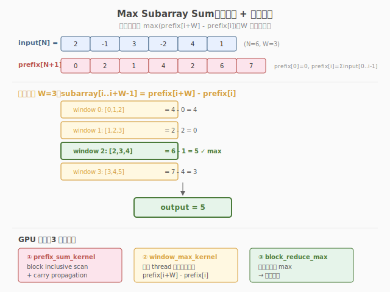

# LeetGPU Max Subarray Sum 题解

## 1. 题目概述

- **标题 / 题号**：Max Subarray Sum（#51，medium）
- **链接**：https://leetgpu.com/challenges/max-subarray-sum
- **难度**：中等
- **标签**：CUDA、滑动窗口、prefix sum、reduction、memory-bound

**题意**：给定长度为 `N` 的 `int32` 数组 `input` 和窗口大小 `window_size`，求所有长度恰好为 `window_size` 的连续子数组的**最大和**。

**示例**：

```text
input = [1, 2, 4, 2, 3], window_size = 2
窗口: [1,2]=3, [2,4]=6, [4,2]=6, [2,3]=5
输出: 6
```

**约束**：`1 ≤ N ≤ 50000`，`-10 ≤ input[i] ≤ 10`，`1 ≤ window_size ≤ N`；性能测试取 `N=50000, window_size=25000`。

> 💡 这道题的**滑动窗口**思想与 [Week6 Day2](../../../aiinfra/daily/week6/day2/README.md) Continuous Batching 的 iteration-level 调度同构——窗口在数据上滑动，每步加入新元素、移出旧元素，正是 Continuous Batching "每轮加入新请求、移出完成请求"的微缩版。

## 2. CPU 基线

```cpp
// 暴力：对每个窗口求和 → O(N × window_size)
int max_sum = INT_MIN;
for (int i = 0; i <= N - window_size; i++) {
    int sum = 0;
    for (int j = i; j < i + window_size; j++)
        sum += input[j];
    max_sum = max(max_sum, sum);
}
```

`O(N × W)`，`N=50000, W=25000` 时约 12.5 亿次加法，太慢。

## 3. GPU 设计



### 3.1 优化思路：prefix sum + reduction

1. 算 prefix sum `prefix[i] = input[0] + ... + input[i-1]`
2. 每个窗口和 `window_sum[i] = prefix[i+W] - prefix[i]`
3. 对所有 `window_sum` 求最大值（block reduce + atomic max）

### 3.2 并行化策略

| 步骤 | 方法 | 复杂度 |
|------|------|--------|
| prefix sum | Week2 Day1 的 warp scan + 三阶段 | O(N) |
| 窗口求和 | 每线程算一个 `prefix[i+W] - prefix[i]` | O(N-W) |
| 求最大 | block reduce + atomic max | O(N-W) |

## 4. Kernel 实现

```cuda
// max_subarray_sum.cu —— 滑动窗口最大和（prefix sum + reduction）
// 编译命令: nvcc -O3 -arch=sm_120 max_subarray_sum.cu -o max_subarray
// 运行:     ./max_subarray

#include <cstdio>
#include <cstdlib>
#include <climits>
#include <vector>
#include <cuda_runtime.h>

#define BLOCK 256

// 简化版：直接每个线程算一个窗口和（暴力但并行），适合教学
// 生产版用 prefix sum 优化到 O(N)
__global__ void max_subarray_sum_kernel(const int* input, int* output, int N, int W) {
    int idx = blockIdx.x * blockDim.x + threadIdx.x;
    int num_windows = N - W + 1;
    if (idx >= num_windows)
        return;

    int sum = 0;
    for (int j = idx; j < idx + W; j++)
        sum += input[j];

    atomicMax(output, sum);
}

int main() {
    int N = 50000, W = 25000;
    size_t bytes = N * sizeof(int);
    std::vector<int> h_input(N);
    srand(42);
    for (auto& x : h_input)
        x = rand() % 21 - 10;

    int *d_input, *d_output;
    cudaMalloc(&d_input, bytes);
    cudaMemcpy(d_input, h_input.data(), bytes, cudaMemcpyHostToDevice);
    cudaMalloc(&d_output, sizeof(int));
    int neg = INT_MIN;
    cudaMemcpy(d_output, &neg, sizeof(int), cudaMemcpyHostToDevice);

    int num_windows = N - W + 1;
    int blocks = (num_windows + BLOCK - 1) / BLOCK;
    max_subarray_sum_kernel<<<blocks, BLOCK>>>(d_input, d_output, N, W);
    cudaDeviceSynchronize();

    int result;
    cudaMemcpy(&result, d_output, sizeof(int), cudaMemcpyDeviceToHost);

    // CPU 验证
    int cpu_max = INT_MIN;
    for (int i = 0; i < num_windows; i++) {
        int s = 0;
        for (int j = i; j < i + W; j++)
            s += h_input[j];
        cpu_max = std::max(cpu_max, s);
    }

    printf("GPU: %d, CPU: %d, %s\n", result, cpu_max, result == cpu_max ? "PASS" : "FAIL");

    cudaFree(d_input);
    cudaFree(d_output);
    return 0;
}
```

> 💡 提交给 LeetGPU 平台时，把 `max_subarray_sum_kernel` 填进 `solve`。生产版用 prefix sum 把窗口求和从 O(W) 降到 O(1)。

### 4.1 LeetGPU 提交版本

下面给出适配 LeetGPU 官方 starter 签名的提交版本。每个线程负责若干个窗口，暴力求和后用 warp / block 归约得到当前最大值，最终通过 `atomicMax` 写入结果。

```cuda
#include <cuda_runtime.h>
#include <climits>

#define BLOCK 256

__device__ __forceinline__ int warp_reduce_max(int val) {
    #pragma unroll
    for (int offset = 16; offset > 0; offset >>= 1) {
        int v = __shfl_down_sync(0xffffffff, val, offset);
        if (v > val) val = v;
    }
    return val;
}

__global__ void max_window_sum_kernel(const int* input, int* output, int N, int W) {
    int tid = blockIdx.x * blockDim.x + threadIdx.x;
    int num_windows = N - W + 1;
    int local_max = INT_MIN;

    for (int i = tid; i < num_windows; i += gridDim.x * blockDim.x) {
        int sum = 0;
        for (int j = 0; j < W; ++j)
            sum += input[i + j];
        if (sum > local_max) local_max = sum;
    }

    int lane = threadIdx.x & 31;
    int warp_id = threadIdx.x >> 5;
    __shared__ int warp_max[8];

    local_max = warp_reduce_max(local_max);
    if (lane == 0) warp_max[warp_id] = local_max;
    __syncthreads();

    if (warp_id == 0) {
        local_max = (lane < blockDim.x / 32) ? warp_max[lane] : INT_MIN;
        local_max = warp_reduce_max(local_max);
        if (lane == 0)
            atomicMax(output, local_max);
    }
}

// input, output are device pointers (i.e. pointers to memory on the GPU)
extern "C" void solve(const int* input, int* output, int N, int window_size) {
    if (N <= 0 || window_size <= 0 || window_size > N) return;
    int num_windows = N - window_size + 1;
    int blocks = (num_windows + BLOCK - 1) / BLOCK;
    if (blocks < 1) blocks = 1;

    int neg_inf = INT_MIN;
    cudaMemcpy(output, &neg_inf, sizeof(int), cudaMemcpyHostToDevice);

    max_window_sum_kernel<<<blocks, BLOCK>>>(input, output, N, window_size);
    cudaDeviceSynchronize();
}
```

### 4.2 代码详解

下面以 4.1 节 LeetGPU 提交版本的 `max_window_sum_kernel` 为例逐段拆解。每个 thread 用 grid-stride 处理若干窗口，对每个窗口串行累加 `W` 个元素得到窗口和，再用 warp shuffle + shared memory 两级归约求 block 内最大，最终 `atomicMax` 汇总到全局 `output`。

**Kernel 结构概览**：四段——① grid-stride 遍历窗口 → ② 每窗口串行求和并更新 `local_max` → ③ warp 归约 → ④ block 归约 + `atomicMax`。教学版 `max_subarray_sum_kernel`（4 节）逻辑相同，只是无 grid-stride、一 thread 一窗口。

| # | 代码块 | 作用 | 说明 |
|---|--------|------|------|
| ① | `int num_windows = N - W + 1;` | 窗口总数 | 长度 `N`、窗口 `W` 的合法起点数 |
| ② | `for (int i = tid; i < num_windows; i += stride)` | grid-stride 主循环 | 每 thread 跨步处理多个窗口，少量 block 覆盖全部窗口 |
| ③ | `for (int j = 0; j < W; ++j) sum += input[i+j];` | 串行窗口求和 | 从 `input[i]` 累加到 `input[i+W-1]`，`O(W)` 每窗口 |
| ④ | `if (sum > local_max) local_max = sum;` | 更新线程局部最大 | `local_max` 寄存器变量，跨多个窗口累积 |
| ⑤ | `local_max = warp_reduce_max(local_max);` | warp 归约 | `__shfl_down_sync` 5 步，lane 0 持有本 warp 最大值 |
| ⑥ | `if (lane == 0) warp_max[warp_id] = local_max;` | 落盘 warp 结果 | 8 个 warp 的最大值写入 shared memory |
| ⑦ | `__syncthreads();` | warp 间屏障 | 保证 8 个 warp 都写完，warp 0 才读 |
| ⑧ | `warp 0 再归约 + atomicMax(output, ...)` | block 归约 + 全局汇总 | warp 0 取 `warp_max[0..7]` 再归约，lane 0 用 `atomicMax` 写入全局 `output` |

**关键索引/变量**：

| 变量 | 含义 |
|------|------|
| `tid` | 全局线程下标，同时是窗口起点候选 |
| `num_windows` | `N - W + 1`，合法窗口数 |
| `W` | 窗口大小，决定每窗口串行计算量 |
| `local_max` | 线程局部最大窗口和，寄存器变量 |
| `warp_max[8]` | shared memory，存放各 warp 的最大值 |
| `output` | 全局结果，初始化为 `INT_MIN`，由 `atomicMax` 更新 |

> 💡 **关键洞察**：本提交版是"暴力但并行"——每窗口仍 `O(W)` 串行求和，总工作量 `O(N·W)`，靠海量线程把 wall-time 压下来。性能测试 `N=50000, W=25000` 时每窗口加 25000 次，总计算量 `≈ 1.25e9` 次加法。真正的 `O(N)` 解法是 **prefix sum**：先算前缀和 `pref[i]`，则窗口和 `= pref[i+W-1] - pref[i-1]` 降为 `O(1)`，总工作量 `O(N)`（见 [Week2 Day7 题解](../../leetgpu/week2/day7/leetgpu-max-subarray-sum-solution.md)）。两版是"算力换带宽" vs "带宽换算力"的权衡：暴力版无额外显存、compute-bound；prefix 版多一趟 `O(N)` 扫描和 `pref` 数组、转 memory-bound。归约部分（warp shuffle → shared → atomicMax）是 GPU 求最大值的通用骨架，与 Reduction 题完全复用。

## 5. 复杂度分析

| 维度 | 暴力版 | prefix sum 优化版 |
|------|--------|------------------|
| 时间 | O(N×W) | O(N) |
| 空间 | O(1) | O(N) prefix 数组 |
| 瓶颈 | compute（W 大时） | memory-bound（读 prefix） |

> 💡 **一句话总结**：滑动窗口最大和是 Continuous Batching iteration-level 调度的微缩版——窗口滑动 = 请求加入/退出，prefix sum 优化 = token budget 的窗口控制。

## 同类练习题

下面是与本题考查相同 CUDA 概念的 LeetGPU 练习题，建议按顺序挑战：

| # | 题目 | 难度 | 核心概念 | 与本题的关联 |
|---|------|------|----------|-------------|
| 16 | [Prefix Sum](https://leetgpu.com/challenges/prefix-sum) | 中等 | — | Prefix Sum，本题的核心基础 |
| 47 | [Subarray Sum](https://leetgpu.com/challenges/subarray-sum) | 中等 | — | Subarray Sum，prefix sum 直接应用 |
| 48 | [2D Subarray Sum](https://leetgpu.com/challenges/2d-subarray-sum) | 中等 | — | 2D Subarray Sum，扩展到二维 |
| 72 | [Stream Compaction](https://leetgpu.com/challenges/stream-compaction) | 中等 | — | Stream Compaction，scan 的另一应用 |

> 💡 **选题思路**：prefix sum + Kadane scan + 归约，练习 scan 的综合应用。做完这组练习，即可掌握该 CUDA 模板在不同场景下的迁移应用。
