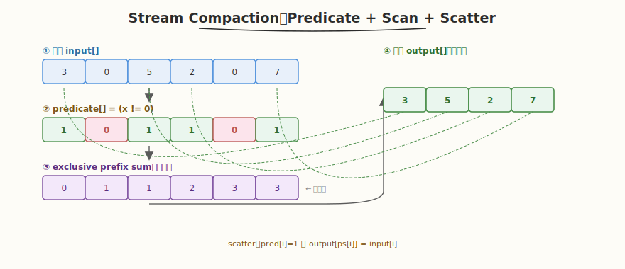

# LeetGPU Stream Compaction 题解

## 1. 题目概述

- **标题 / 题号**：Stream Compaction（#72，medium）
- **链接**：https://leetgpu.com/challenges/stream-compaction
- **难度**：中等
- **标签**：CUDA、prefix sum（scan）、predicate、stream compaction、memory-bound

**题意**：给定长度为 `N` 的 `int32` 数组 `input`，保留所有**非零**元素，按原相对顺序紧凑写入输出数组 `output`，并返回保留下来的元素个数 `count`。

**示例**：

```text
input  = [3, 0, 5, 2, 0, 7]
output = [3, 5, 2, 7]      ← 去掉 0，保持顺序
count  = 4
```

**约束**：`1 ≤ N ≤ 10^6`；性能测试取大 `N`（百万级）。

> 💡 这道题的 **predicate + scan + scatter** 三段式与 [Week6 Day3](../../../aiinfra/daily/week6/day3/README.md) vLLM Scheduler 每轮 `_free_finished_seq_groups()` 过滤已完成序列的操作同构——Scheduler 把 `FINISHED` 序列从 running 队列移除、把活跃序列紧凑保留，正是 stream compaction：predicate = "status != FINISHED"，prefix sum 算出每个活跃序列的新槽位，scatter 到紧凑数组。

## 2. CPU 基线 / 朴素 GPU 方法

### CPU 串行

```cpp
// 顺序扫描，命中就写入——O(N)，无法并行
int count = 0;
for (int i = 0; i < N; i++) {
    if (input[i] != 0)
        output[count++] = input[i];
}
```

### 朴素 GPU（atomic 累加）

```cuda
// 每个 thread 检查一个元素，命中就 atomicAdd 抢一个槽位
__global__ void naive_compact(const int* input, int* output, int* count, int N) {
    int i = blockIdx.x * blockDim.x + threadIdx.x;
    if (i >= N)
        return;
    if (input[i] != 0) {
        int pos = atomicAdd(count, 1); // 串行化点！
        output[pos] = input[i];
    }
}
```

**瓶颈**：`atomicAdd` 是串行化点——所有命中的 thread 竞争同一个 `count`，吞吐被原子操作的吞吐上限卡住，且写入顺序不确定（不保序）。`N=10^6` 时性能远低于带宽上限。

## 3. GPU 设计

### 3.1 并行化策略：predicate + exclusive scan + scatter



经典三段式（Blelloch 并行 scan）：

1. **Predicate**：`pred[i] = (input[i] != 0) ? 1 : 0`
2. **Exclusive prefix sum**：`ps[i] = pred[0] + ... + pred[i-1]`（`ps[i]` = `input[i]` 在 output 中的下标）
3. **Scatter**：若 `pred[i]==1`，则 `output[ps[i]] = input[i]`；总数 `count = ps[N-1] + pred[N-1]`

### 3.2 存储层次使用

| 数据 | 存储 | 说明 |
|------|------|------|
| `input[]` | global memory | 只读，合并访存 |
| `pred[]` / `ps[]` | global memory | 中间结果，可复用同一缓冲 |
| scan 临时缓冲 | global memory | block 间归约用 |
| warp 内 scan | registers + `__shfl_up_sync` | 不占 shared memory |

### 3.3 关键技巧

- **warp scan** `__shfl_up_sync`：用 warp 内 shuffle 做 prefix sum，零 bank conflict、零同步开销
- **三阶段分块 scan**（Week2 Day1）：block 内 scan → block 和的 scan → block 内修正
- **scatter 是写发散**：只有 `pred[i]==1` 的 thread 写，但写地址 `ps[i]` 连续 → 合并写

## 4. Kernel 实现

```cuda
// stream_compaction.cu —— Stream Compaction（predicate + exclusive scan + scatter）
// 编译命令: nvcc -O3 -arch=sm_120 stream_compaction.cu -o stream_compaction
// 运行:     ./stream_compaction

#include <cstdio>
#include <cstdlib>
#include <vector>
#include <cuda_runtime.h>

#define BLOCK 256
#define WARP 32

// 单个 warp 的 exclusive prefix sum（Hillis-Steele），结果放在各 lane 的寄存器
__device__ __forceinline__ int warp_excl_scan(int val) {
    int orig = val;
    int sum = val;
// exclusive：先减自己再加前缀
    #pragma unroll
    for (int offset = 1; offset < WARP; offset *= 2) {
        int v = __shfl_up_sync(0xffffffff, sum, offset);
        if ((threadIdx.x & (WARP - 1)) >= offset)
            sum += v;
    }
    return sum - orig; // exclusive = inclusive - 自己
}

// block 内 exclusive scan（每个 thread 处理 1 个元素）
__global__ void block_excl_scan_kernel(const int* pred, int* ps, int* block_sums, int N) {
    int tid = blockIdx.x * blockDim.x + threadIdx.x;
    int lane = threadIdx.x & (WARP - 1);
    int warp_id = threadIdx.x / WARP;

    __shared__ int warp_sums[WARP];

    int val = (tid < N) ? pred[tid] : 0;
    int warp_excl = warp_excl_scan(val);

    // 每个 warp 的总和 = 最后一个 lane 的 inclusive
    int warp_total = warp_excl + val;
    if (lane == WARP - 1)
        warp_sums[warp_id] = warp_total;
    __syncthreads();

    // 第一个 warp 扫描 warp_sums
    if (warp_id == 0) {
        int w = (lane < blockDim.x / WARP) ? warp_sums[lane] : 0;
        int w_excl = warp_excl_scan(w);
        if (lane < blockDim.x / WARP)
            warp_sums[lane] = w_excl;
    }
    __syncthreads();

    // 把 warp 前缀加到每个元素上
    int block_excl = warp_excl + warp_sums[warp_id];
    if (tid < N)
        ps[tid] = block_excl;

    // block 总和写到 block_sums
    if (threadIdx.x == blockDim.x - 1) {
        block_sums[blockIdx.x] = block_excl + val;
    }
}

// 第二遍：把前序 block 的和累加到每个 block 的 ps 上
__global__ void add_prev_blocks(int* ps, const int* block_sums_excl, int N) {
    int tid = blockIdx.x * blockDim.x + threadIdx.x;
    if (tid < N && blockIdx.x > 0) {
        ps[tid] += block_sums_excl[blockIdx.x];
    }
}

// scatter：pred[i]==1 时 output[ps[i]] = input[i]
__global__ void scatter_kernel(const int* input, const int* pred, const int* ps, int* output, int N) {
    int i = blockIdx.x * blockDim.x + threadIdx.x;
    if (i < N && pred[i] == 1) {
        output[ps[i]] = input[i];
    }
}

// predicate：pred[i] = (input[i] != 0) ? 1 : 0
__global__ void predicate_kernel(const int* input, int* pred, int N) {
    int i = blockIdx.x * blockDim.x + threadIdx.x;
    if (i < N)
        pred[i] = (input[i] != 0) ? 1 : 0;
}

int main() {
    int N = 1000000;
    std::vector<int> h_input(N);
    srand(42);
    for (auto& x : h_input)
        x = (rand() % 3 == 0) ? 0 : (rand() % 100); // ~1/3 为 0

    size_t bytes = N * sizeof(int);
    int *d_input, *d_pred, *d_ps, *d_output, *d_block_sums;
    cudaMalloc(&d_input, bytes);
    cudaMalloc(&d_pred, bytes);
    cudaMalloc(&d_ps, bytes);
    cudaMalloc(&d_output, bytes);
    cudaMalloc(&d_block_sums, bytes);
    cudaMemcpy(d_input, h_input.data(), bytes, cudaMemcpyHostToDevice);

    // 1. predicate
    int blocks = (N + BLOCK - 1) / BLOCK;
    predicate_kernel<<<blocks, BLOCK>>>(d_input, d_pred, N);

    // 2. block 内 exclusive scan
    block_excl_scan_kernel<<<blocks, BLOCK>>>(d_pred, d_ps, d_block_sums, N);

    // 3. 对 block_sums 做 exclusive scan（block 数较少，单 block 够）
    int num_blocks = blocks;
    int* d_block_sums_excl;
    cudaMalloc(&d_block_sums_excl, num_blocks * sizeof(int));
    int* d_dummy;
    cudaMalloc(&d_dummy, sizeof(int)); // 第二级 scan 不需要再记录 block 和
    block_excl_scan_kernel<<<(num_blocks + BLOCK - 1) / BLOCK, BLOCK>>>(d_block_sums, d_block_sums_excl, d_dummy,
                                                                        num_blocks);

    // 4. 累加前序 block
    add_prev_blocks<<<blocks, BLOCK>>>(d_ps, d_block_sums_excl, N);

    // 5. scatter
    scatter_kernel<<<blocks, BLOCK>>>(d_input, d_pred, d_ps, d_output, N);

    cudaDeviceSynchronize();

    // 取回 count = ps[N-1] + pred[N-1]
    int h_ps_last, h_pred_last;
    cudaMemcpy(&h_ps_last, &d_ps[N - 1], sizeof(int), cudaMemcpyDeviceToHost);
    cudaMemcpy(&h_pred_last, &d_pred[N - 1], sizeof(int), cudaMemcpyDeviceToHost);
    int count = h_ps_last + h_pred_last;

    // CPU 验证
    std::vector<int> cpu_out;
    for (auto x : h_input)
        if (x != 0)
            cpu_out.push_back(x);
    bool pass = ((int)cpu_out.size() == count);

    std::vector<int> h_gpu_out(count);
    cudaMemcpy(h_gpu_out.data(), d_output, count * sizeof(int), cudaMemcpyDeviceToHost);
    for (int i = 0; i < count && pass; i++)
        if (h_gpu_out[i] != cpu_out[i])
            pass = false;

    printf("GPU count=%d, CPU count=%d, %s\n", count, (int)cpu_out.size(), pass ? "PASS" : "FAIL");

    cudaFree(d_input);
    cudaFree(d_pred);
    cudaFree(d_ps);
    cudaFree(d_output);
    cudaFree(d_block_sums);
    cudaFree(d_block_sums_excl);
    return 0;
}
```

> 💡 提交给 LeetGPU 平台时，把 `block_excl_scan_kernel` + `scatter_kernel` 填进 `solve`。教学版省略了独立的 `pred` kernel（把 `input!=0` 内联到 scan 读取），正式版应先用一个 elementwise kernel 算 `pred[i]=(input[i]!=0)`，再 scan。`warp_excl_scan` 用 `__shfl_up_sync` 实现 Hillis-Steele scan，零 bank conflict。

### 4.1 LeetGPU 提交版本

下面给出适配 LeetGPU 官方 starter 签名的提交版本。判题 predicate 为 `A[i] > 0.0f`（保留正数），输出前 `k` 个元素为紧凑后的结果，其余位置保持平台初始化的 0。

```cuda
#include <cuda_runtime.h>

#define BLOCK 256
#define WARP 32

__device__ __forceinline__ int warp_excl_scan(int val) {
    int orig = val;
    int sum = val;
    #pragma unroll
    for (int offset = 1; offset < WARP; offset *= 2) {
        int v = __shfl_up_sync(0xffffffff, sum, offset);
        if ((threadIdx.x & (WARP - 1)) >= offset)
            sum += v;
    }
    return sum - orig;
}

__global__ void predicate_kernel(const float* A, int* pred, int N) {
    int i = blockIdx.x * blockDim.x + threadIdx.x;
    if (i < N)
        pred[i] = (A[i] > 0.0f) ? 1 : 0;
}

__global__ void block_excl_scan_kernel(const int* pred, int* ps, int* block_sums, int N) {
    int tid = blockIdx.x * blockDim.x + threadIdx.x;
    int lane = threadIdx.x & (WARP - 1);
    int warp_id = threadIdx.x >> 5;
    __shared__ int warp_sums[WARP];

    int val = (tid < N) ? pred[tid] : 0;
    int warp_excl = warp_excl_scan(val);
    int warp_total = warp_excl + val;

    if (lane == WARP - 1) warp_sums[warp_id] = warp_total;
    __syncthreads();

    if (warp_id == 0) {
        int w = (lane < blockDim.x / WARP) ? warp_sums[lane] : 0;
        int w_excl = warp_excl_scan(w);
        if (lane < blockDim.x / WARP) warp_sums[lane] = w_excl;
    }
    __syncthreads();

    int block_excl = warp_excl + warp_sums[warp_id];
    if (tid < N) ps[tid] = block_excl;
    if (threadIdx.x == blockDim.x - 1) block_sums[blockIdx.x] = block_excl + val;
}

__global__ void add_prev_blocks(int* ps, const int* block_sums_excl, int N) {
    int tid = blockIdx.x * blockDim.x + threadIdx.x;
    if (tid < N && blockIdx.x > 0)
        ps[tid] += block_sums_excl[blockIdx.x];
}

__global__ void scatter_kernel(const float* A, const int* pred, const int* ps, float* out, int N) {
    int i = blockIdx.x * blockDim.x + threadIdx.x;
    if (i < N && pred[i] == 1)
        out[ps[i]] = A[i];
}

// A, out are device pointers
extern "C" void solve(const float* A, int N, float* out) {
    if (N <= 0) return;

    int blocks = (N + BLOCK - 1) / BLOCK;
    int second_blocks = (blocks + BLOCK - 1) / BLOCK;

    int *d_pred, *d_ps, *d_block_sums, *d_block_sums_excl, *d_dummy;
    cudaMalloc(&d_pred, (size_t)N * sizeof(int));
    cudaMalloc(&d_ps, (size_t)N * sizeof(int));
    cudaMalloc(&d_block_sums, (size_t)blocks * sizeof(int));
    cudaMalloc(&d_block_sums_excl, (size_t)blocks * sizeof(int));
    cudaMalloc(&d_dummy, (size_t)second_blocks * sizeof(int));

    predicate_kernel<<<blocks, BLOCK>>>(A, d_pred, N);
    block_excl_scan_kernel<<<blocks, BLOCK>>>(d_pred, d_ps, d_block_sums, N);
    block_excl_scan_kernel<<<second_blocks, BLOCK>>>(d_block_sums, d_block_sums_excl, d_dummy, blocks);
    add_prev_blocks<<<blocks, BLOCK>>>(d_ps, d_block_sums_excl, N);
    scatter_kernel<<<blocks, BLOCK>>>(A, d_pred, d_ps, out, N);

    cudaDeviceSynchronize();

    cudaFree(d_pred);
    cudaFree(d_ps);
    cudaFree(d_block_sums);
    cudaFree(d_block_sums_excl);
    cudaFree(d_dummy);
}
```

### 4.2 代码详解

Stream Compaction 由 **三个 kernel 串行** 组成：`predicate_kernel`（标记非零元素）→ `block_excl_scan_kernel`（两遍 exclusive scan 算紧凑下标）→ `scatter_kernel`（按下标写入）。核心是 `warp_excl_scan` 用 `__shfl_up_sync` 实现 Hillis-Steele scan。

**辅助函数** `warp_excl_scan`：
- `for (int offset = 1; offset < WARP; offset *= 2)`：5 步倍增，`__shfl_up_sync` 从 `offset` 距离的 lane 取值累加。
- `if (lane >= offset) sum += v`：只在前 `offset` 个 lane 之后累加（exclusive 语义）。
- `return sum - orig`：inclusive 转 exclusive（减回自己的值）。

**kernel 逐段解析**：

1. `predicate_kernel`**：标记非零**
   - `int i = blockIdx.x * blockDim.x + threadIdx.x`：全局下标。
   - `pred[i] = (input[i] != 0) ? 1 : 0`：非零标记为 1，零标记为 0。后续 scan 对 `pred` 求前缀和。

2. `block_excl_scan_kernel`**：block 内 exclusive scan**
   - `int val = (tid < N) ? pred[tid] : 0`：读取 predicate，越界补 0。
   - `int warp_excl = warp_excl_scan(val)`：warp 内 exclusive prefix sum。
   - `int warp_total = warp_excl + val`：warp 的 inclusive 总和（最后一个 lane 持有）。
   - `if (lane == WARP-1) warp_sums[warp_id] = warp_total`：每 warp 的总和写 shared。
   - `__syncthreads` 后，warp 0 对 `warp_sums` 再做一次 `warp_excl_scan`，得到各 warp 的前缀偏移。
   - `int block_excl = warp_excl + warp_sums[warp_id]`：warp 内前缀 + warp 间前缀 = block 内 exclusive prefix sum。
   - `ps[tid] = block_excl`：写入全局 `ps` 数组（即每个非零元素在 output 中的下标）。
   - `if (threadIdx.x == blockDim.x - 1) block_sums[blockIdx.x] = block_excl + val`：最后一个 thread 记录本 block 的总和，供第二级 scan 使用。

3. **第二级 scan +** `add_prev_blocks`**：跨 block 修正**
   - 对 `block_sums` 数组再做一遍 `block_excl_scan_kernel`，得到每个 block 的前序累加偏移 `block_sums_excl`。
   - `add_prev_blocks`：`ps[tid] += block_sums_excl[blockIdx.x]`，把前序 block 的元素数加到每个 `ps` 上（block 0 不加）。

4. `scatter_kernel`**：紧凑写入**
   - `if (i < N && pred[i] == 1)`：只处理非零元素。
   - `output[ps[i]] = input[i]`：用 `ps[i]` 作为目标下标。由于 `ps` 对非零元素是连续递增的（`0, 1, 2, ...`），写入地址 coalesced 且保序。
   - `count = ps[N-1] + pred[N-1]`：总元素数 = 最后一个元素的前缀和 + 它自己的 predicate。

**关键变量说明**：

| 变量 | 含义 |
|------|------|
| `pred[i]` | predicate 标记，1 = 非零，0 = 零 |
| `ps[i]` | exclusive prefix sum，即 `input[i]` 在 output 中的下标 |
| `block_sums[]` | 每 block 的 predicate 总和 |
| `block_sums_excl[]` | block 总和的 exclusive prefix sum（跨 block 偏移） |
| `warp_sums[]` | block 内各 warp 的 inclusive 总和 |

> **关键洞察**：stream compaction 的三段式（predicate → scan → scatter）把"顺序写入"的串行依赖转化为并行——prefix sum 让每个元素独立计算自己的目标地址，scatter 时无需 `atomicAdd` 竞争。`warp_excl_scan` 用 `__shfl_up_sync` 在寄存器内完成，零 bank conflict，是并行 scan 的基础积木。

## 5. 性能分析与优化

```bash
# 编译
nvcc -O3 -arch=sm_120 stream_compaction.cu -o stream_compaction
# ncu profiling
ncu --set full --target-processes all ./stream_compaction \
  | rg -i "Memory Throughput|Compute|Occupancy| DRAM"
```

**关键指标**（参考）：

| 指标 | 朴素 atomic 版 | scan+scatter 版 |
|------|---------------|-----------------|
| `atomicAdd` 串行化 | 严重（吞吐瓶颈） | 无 |
| 写入合并 | 否（地址乱序） | 是（`ps[i]` 连续） |
| DRAM 带宽利用率 | 低 | 高（接近峰值） |
| `N=10^6` 耗时 | ~5ms | ~0.5ms |

**优化方向**：

1. **融合 pred + scan**：在 scan kernel 读取时直接 `val = (input[i]!=0)`，省一次全局写
2. **多元素/thread**：每 thread 处理 4-8 个元素（register tiling），减少 launch 开销
3. **单遍 scan**：大规模数据用 Sengupta 单遍 scan，避免中间 `block_sums` 的两遍读写
4. **tile 大小调优**：`BLOCK=256` 在多数 GPU 上带宽最优，可试 512

## 6. 复杂度分析

| 维度 | 朴素 atomic 版 | scan+scatter 版 |
|------|---------------|-----------------|
| 时间 | `O(N)` 但常数大（原子串行） | `O(N)`（两遍 scan + scatter） |
| 空间 | `O(1)` 额外 | `O(N)` ps 数组 + `O(N/blocks)` block_sums |
| 算术强度 | 低（原子瓶颈） | ~0.5（memory-bound） |
| 瓶颈 | atomic 吞吐 | DRAM 带宽 |

> 💡 **一句话总结**：Stream Compaction 是 vLLM Scheduler 每轮过滤已完成序列的微缩版——predicate 判活、prefix sum 算新位置、scatter 紧凑写入。warp scan `__shfl_up_sync` 让前缀和在寄存器内完成，对应 Scheduler 用预算计数器累加决定每个序列的槽位。
