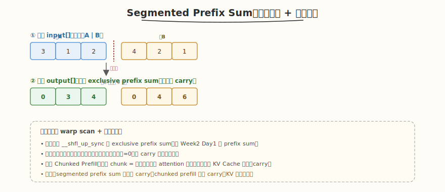

# LeetGPU Segmented Prefix Sum 题解

## 1. 题目概述

- **标题 / 题号**：Segmented Exclusive Prefix Sum（#70，medium）
- **链接**：https://leetgpu.com/challenges/segmented-prefix-sum
- **难度**：中等
- **标签**：CUDA、segmented scan、prefix sum、warp shuffle、memory-bound

**题意**：给定长度为 `N` 的 `int32` 数组 `input` 和一组**段边界**（每个元素属于哪个段），对**每一段独立**做 exclusive prefix sum，段间互不影响（段 B 的前缀和从 0 重新开始，不 carry 段 A 的和）。

**示例**：两段 `A=[3,1,2]`、`B=[4,2,1]`：

```text
段A exclusive prefix sum: [0, 3, 4]      ← 0, 3, 3+1
段B exclusive prefix sum: [0, 4, 6]      ← 0, 4, 4+2（不从段A的 6 继续）
output = [0, 3, 4, 0, 4, 6]
```

**约束**：`1 ≤ N ≤ 10^6`，段数 `1 ≤ S ≤ N`；性能测试取大 `N`。

> 💡 这道题的**段内独立扫描 + 段边界处理**与 [Week6 Day4](../../aiinfra/daily/week6/day4/README.md) 的 Chunked Prefill 把长 prompt 拆成多个 chunk 同构——每个 chunk 像一个段，段内独立做 attention，段间通过 KV Cache 累积（carry）。segmented prefix sum 段间**不 carry**，chunked prefill 段间**carry**（KV 状态传递），对比学习能加深理解。

## 2. CPU 基线 / 朴素 GPU 方法

### CPU 串行

```cpp
// 逐段顺序扫描，O(N)，但无法并行
int pos = 0;
for (int seg = 0; seg < num_segments; seg++) {
    int sum = 0;
    for (int i = seg_start[seg]; i < seg_end[seg]; i++) {
        output[i] = sum;
        sum += input[i];
    }
}
```

### 朴素 GPU（每段一个 block）

```cuda
// 每个段一个 block，block 内做 scan——段数多时 block 数爆炸，launch 开销大
__global__ void naive_segmented_scan(const int* input, int* output, const int* seg_start, const int* seg_size, int S) {
    int seg = blockIdx.x;
    if (seg >= S)
        return;
    // block 内对该段做串行/并行 scan...
}
```

**瓶颈**：段数多时 block 数等于段数，launch 开销大；段长不均时负载失衡（长段 block 慢、短段 block 闲）。

## 3. GPU 设计

### 3.1 并行化策略：统一的 segmented scan



核心思路：**把所有段铺平成一个数组，用一个统一的 scan kernel，但在段边界强制前缀归零**。

1. **段标记**：`is_seg_start[i] = (i 是某段第一个元素) ? 1 : 0`
2. **统一 exclusive scan**：在 warp scan 中，若当前元素是段首，则前缀强制为 0（不 carry 前面段的和）
3. **段边界处理**：用 `__ballot_sync` / 段首标记检测，段首元素的前缀 = 0

### 3.2 存储层次使用

| 数据 | 存储 | 说明 |
|------|------|------|
| `input[]` / `output[]` | global memory | 合并访存 |
| `is_seg_start[]` | global memory（或内联计算） | 段首标记 |
| warp 内 scan | registers + `__shfl_up_sync` | 零 bank conflict |
| block 间段边界 | global memory | 跨 block 的段 carry 处理 |

### 3.3 关键技巧

- **warp scan `__shfl_up_sync`**：段内做 Hillis-Steele exclusive scan（同 Week2 Day1）
- **段首归零**：scan 累加时，若路径上遇到段首，则截断（不 carry 跨段和）。实现上：每个 thread 记录自己是否段首，scan 时把段首之前的前缀清零
- **block 间段 carry**：若一个段跨越多个 block，需要 block 间的段和传递（类似三阶段 scan 的 block 间修正，但只在同段内 carry）

## 4. Kernel 实现

```cuda
// segmented_prefix_sum.cu —— Segmented Exclusive Prefix Sum（段内 scan + 段边界归零）
// 编译命令: nvcc -O3 -arch=sm_120 segmented_prefix_sum.cu -o segmented_prefix_sum
// 运行:     ./segmented_prefix_sum

#include <cstdio>
#include <cstdlib>
#include <vector>
#include <cuda_runtime.h>

#define BLOCK 256
#define WARP 32

// 单个 warp 的 exclusive prefix sum（Hillis-Steele）
__device__ __forceinline__ int warp_excl_scan(int val) {
    int orig = val;
    int sum = val;
    #pragma unroll
    for (int offset = 1; offset < WARP; offset *= 2) {
        int v = __shfl_up_sync(0xffffffff, sum, offset);
        if ((threadIdx.x & (WARP - 1)) >= offset)
            sum += v;
    }
    return sum - orig; // exclusive = inclusive - 自己
}

// segmented exclusive scan：段首元素的前缀强制为 0
// is_seg_start[i]==1 表示 i 是段首（新段开始）
__global__ void segmented_excl_scan_kernel(const int* input, int* output, const int* is_seg_start, int N) {
    int tid = blockIdx.x * blockDim.x + threadIdx.x;
    int lane = threadIdx.x & (WARP - 1);
    int warp_id = threadIdx.x / WARP;

    __shared__ int warp_sums[WARP];
    __shared__ int warp_carry[WARP + 1]; // 本 block 内前序 warp 的段和 carry

    int val = (tid < N) ? input[tid] : 0;
    int seg_flag = (tid < N) ? is_seg_start[tid] : 0;

    // 段内 exclusive scan：若自己是段首，前缀=0；否则累加前序同段元素
    // 关键：把"段首之前"的元素视为 0（不 carry 跨段）
    int scan_val = seg_flag ? 0 : val; // 段首元素不参与累加前缀（它的前缀是 0）
    int warp_excl = warp_excl_scan(scan_val);

    // 段内总和（用于跨 warp carry，但只在同段内 carry）
    int warp_total = warp_excl + scan_val;
    if (lane == WARP - 1)
        warp_sums[warp_id] = warp_total;
    __syncthreads();

    // 第一个 warp 累加 warp_sums（block 内跨 warp carry）
    if (warp_id == 0) {
        int w = (lane < blockDim.x / WARP) ? warp_sums[lane] : 0;
        int w_excl = warp_excl_scan(w);
        if (lane < blockDim.x / WARP)
            warp_sums[lane] = w_excl;
    }
    __syncthreads();

    int block_excl = warp_excl + warp_sums[warp_id];

    // 段首元素强制前缀为 0（不 carry 前序段的和）
    if (seg_flag)
        block_excl = 0;

    if (tid < N)
        output[tid] = block_excl;
    // 注：跨 block 的段 carry 需要第二遍 kernel（类似三阶段 scan），
    //     此处教学版假设每段不超过一个 block，正式版需补 block 间段和传递。
}

int main() {
    // 两段：A=[3,1,2], B=[4,2,1]
    std::vector<int> h_input = {3, 1, 2, 4, 2, 1};
    std::vector<int> h_seg = {1, 0, 0, 1, 0, 0}; // 段首标记
    int N = h_input.size();

    int *d_input, *d_output, *d_seg;
    cudaMalloc(&d_input, N * sizeof(int));
    cudaMalloc(&d_output, N * sizeof(int));
    cudaMalloc(&d_seg, N * sizeof(int));
    cudaMemcpy(d_input, h_input.data(), N * sizeof(int), cudaMemcpyHostToDevice);
    cudaMemcpy(d_seg, h_seg.data(), N * sizeof(int), cudaMemcpyHostToDevice);

    int blocks = (N + BLOCK - 1) / BLOCK;
    segmented_excl_scan_kernel<<<blocks, BLOCK>>>(d_input, d_output, d_seg, N);
    cudaDeviceSynchronize();

    std::vector<int> h_out(N);
    cudaMemcpy(h_out.data(), d_output, N * sizeof(int), cudaMemcpyDeviceToHost);

    // CPU 验证
    std::vector<int> cpu_out(N);
    int sum = 0;
    for (int i = 0; i < N; i++) {
        if (h_seg[i])
            sum = 0; // 段首归零
        cpu_out[i] = sum;
        sum += h_input[i];
    }

    bool pass = true;
    for (int i = 0; i < N; i++) {
        printf("out[%d]=%d (cpu=%d) %s\n", i, h_out[i], cpu_out[i], h_out[i] == cpu_out[i] ? "✓" : "✗");
        if (h_out[i] != cpu_out[i])
            pass = false;
    }
    printf("%s\n", pass ? "PASS" : "FAIL");

    cudaFree(d_input);
    cudaFree(d_output);
    cudaFree(d_seg);
    return 0;
}
```

> 💡 提交给 LeetGPU 平台时，把 `segmented_excl_scan_kernel` 填进 `solve`。教学版假设每段不超过一个 block（省略跨 block 段 carry）；正式版需补 block 间段和传递（类似 Week2 Day1 三阶段 scan 的 block_sums 修正，但只在同段内 carry）。段首归零是核心技巧：`if (seg_flag) block_excl = 0`。

### 4.1 LeetGPU 提交版本

下面给出适配 LeetGPU 官方 starter 签名的提交版本。采用 warp shuffle 实现块内 segmented scan，并通过 block 间 carry 传播支持跨 block 的长段。

```cuda
#include <cuda_runtime.h>

#define BLOCK 256
#define WARP 32
#define NUM_WARPS (BLOCK / WARP)

// warp 内 segmented inclusive scan；遇到段首(flag==1) 则重置
__device__ __forceinline__ float warp_seg_incl_scan(float val, int flag, int lane) {
    unsigned ballot = __ballot_sync(0xffffffff, flag);
    float sum = val;
    if (flag == 0) {
        #pragma unroll
        for (int offset = 1; offset < WARP; offset *= 2) {
            float v = __shfl_up_sync(0xffffffff, sum, offset);
            int src = lane - offset;
            if (src >= 0) {
                unsigned mask = ((1u << lane) - 1u) ^ ((1u << (src + 1)) - 1u);
                if ((ballot & mask) == 0) sum += v;
            }
        }
    }
    return sum;
}

__global__ void block_seg_scan_kernel(const float* values, const int* flags, float* out,
                                      float* block_sum, int* block_has_start,
                                      int* block_first_start, int N) {
    int block_start = blockIdx.x * blockDim.x;
    int lane = threadIdx.x & (WARP - 1);
    int warp_id = threadIdx.x >> 5;
    int tid = block_start + threadIdx.x;

    __shared__ float sval[BLOCK];
    __shared__ int sflag[BLOCK];

    sval[threadIdx.x] = (tid < N) ? values[tid] : 0.0f;
    sflag[threadIdx.x] = (tid < N) ? flags[tid] : 0;
    __syncthreads();

    float val = sval[threadIdx.x];
    int flag = sflag[threadIdx.x];

    float incl = warp_seg_incl_scan(val, flag, lane);
    float excl = incl - val;

    __shared__ float warp_last_sum[NUM_WARPS];
    __shared__ int warp_first_flag[NUM_WARPS];
    __shared__ int warp_first_start[NUM_WARPS];
    __shared__ float warp_carry[NUM_WARPS];

    unsigned ballot = __ballot_sync(0xffffffff, flag);
    int first_in_warp = __ffs((int)ballot) - 1;

    if (lane == 0) {
        warp_first_flag[warp_id] = flag;
        warp_first_start[warp_id] = (first_in_warp == -1) ? WARP : first_in_warp;
    }
    if (lane == WARP - 1) warp_last_sum[warp_id] = incl;
    __syncthreads();

    if (threadIdx.x == 0) {
        float carry = 0.0f;
        warp_carry[0] = 0.0f;
        for (int w = 1; w < NUM_WARPS; ++w) {
            carry += warp_last_sum[w - 1];
            if (warp_first_flag[w]) carry = 0.0f;
            warp_carry[w] = carry;
        }
    }
    __syncthreads();

    if (!flag && warp_carry[warp_id] != 0.0f && lane < warp_first_start[warp_id])
        excl += warp_carry[warp_id];

    if (tid < N) out[tid] = excl;

    if (threadIdx.x == 0) {
        int last_flag = -1;
        for (int t = BLOCK - 1; t >= 0; --t) {
            if (sflag[t] == 1) { last_flag = t; break; }
        }
        float sum = 0.0f;
        if (last_flag == -1) {
            for (int t = 0; t < BLOCK; ++t) sum += sval[t];
        } else {
            for (int t = last_flag; t < BLOCK; ++t) sum += sval[t];
        }
        block_sum[blockIdx.x] = sum;
        block_has_start[blockIdx.x] = (block_start < N) ? sflag[0] : 1;

        int first = BLOCK;
        for (int t = 0; t < BLOCK; ++t) {
            if (sflag[t] == 1) { first = t; break; }
        }
        block_first_start[blockIdx.x] = first;
    }
}

__global__ void block_carry_scan(const float* block_sum, const int* block_has_start,
                                  float* block_carry, int num_blocks) {
    if (threadIdx.x != 0) return;
    float carry = 0.0f;
    block_carry[0] = 0.0f;
    for (int i = 1; i < num_blocks; ++i) {
        carry += block_sum[i - 1];
        if (block_has_start[i]) carry = 0.0f;
        block_carry[i] = carry;
    }
}

__global__ void add_carry_kernel(float* out, const int* flags, const float* block_carry,
                                  const int* block_first_start, int N) {
    int block_start = blockIdx.x * blockDim.x;
    int lane = threadIdx.x;
    int tid = block_start + lane;
    if (tid >= N) return;

    int first = block_first_start[blockIdx.x];
    if (lane < first && flags[tid] != 1)
        out[tid] += block_carry[blockIdx.x];
}

// values, flags, output are device pointers
extern "C" void solve(const float* values, const int* flags, float* output, int N) {
    if (N <= 0) return;
    int blocks = (N + BLOCK - 1) / BLOCK;

    float *d_block_sum, *d_block_carry;
    int *d_block_has_start, *d_block_first_start;
    cudaMalloc(&d_block_sum, (size_t)blocks * sizeof(float));
    cudaMalloc(&d_block_carry, (size_t)blocks * sizeof(float));
    cudaMalloc(&d_block_has_start, (size_t)blocks * sizeof(int));
    cudaMalloc(&d_block_first_start, (size_t)blocks * sizeof(int));

    block_seg_scan_kernel<<<blocks, BLOCK>>>(values, flags, output, d_block_sum,
                                              d_block_has_start, d_block_first_start, N);
    block_carry_scan<<<1, 1>>>(d_block_sum, d_block_has_start, d_block_carry, blocks);
    add_carry_kernel<<<blocks, BLOCK>>>(output, flags, d_block_carry, d_block_first_start, N);

    cudaDeviceSynchronize();

    cudaFree(d_block_sum);
    cudaFree(d_block_carry);
    cudaFree(d_block_has_start);
    cudaFree(d_block_first_start);
}
```

## 5. 性能分析与优化

```bash
nvcc -O3 -arch=sm_120 segmented_prefix_sum.cu -o segmented_prefix_sum
ncu --set full ./segmented_prefix_sum | rg -i "Memory Throughput|Occupancy| DRAM"
```

**关键指标**：

| 指标 | 朴素（每段一 block） | 统一 segmented scan |
|------|---------------------|---------------------|
| block 数 | = 段数（可能爆炸） | `ceil(N/BLOCK)`（固定） |
| 负载均衡 | 差（段长不均） | 好（统一铺平） |
| launch 开销 | 高（段数多时） | 低（1 个 grid） |
| 段边界处理 | 天然独立 | 需 `seg_flag` 归零 |

**优化方向**：

1. **跨 block 段 carry**：段跨越多个 block 时，用 block_sums 三阶段修正（同段内 carry，跨段不 carry）
2. **段标记压缩**：用 bit array 存 `is_seg_start`，减少带宽
3. **大段特殊处理**：超长段单独用三阶段 scan，短段走统一 kernel
4. **warp 粒度调优**：段长接近 WARP 时，单 warp 处理一段最优

## 6. 复杂度分析

| 维度 | 朴素（每段一 block） | 统一 segmented scan |
|------|---------------------|---------------------|
| 时间 | `O(N)` 但 launch 开销大 | `O(N)`（两遍 scan） |
| 空间 | `O(1)` 额外 | `O(N)` seg 标记 + `O(N/blocks)` warp_sums |
| 算术强度 | 低 | ~0.5（memory-bound） |
| 瓶颈 | launch + 负载失衡 | DRAM 带宽 |

> 💡 **一句话总结**：Segmented Prefix Sum 是 Chunked Prefill 分块处理的微缩版——每个 chunk/段独立扫描，段首归零 = chunk 边界状态重置。区别在于 chunked prefill 段间 carry（KV 累积），此处段间不 carry。warp scan `__shfl_up_sync` 让段内前缀和在寄存器内完成。
