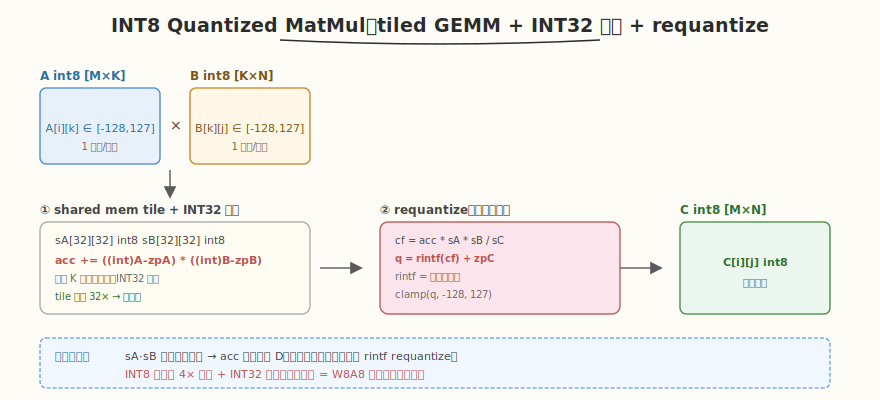

# LeetGPU INT8 Quantized MatMul 题解

## 1. 题目概述

- **标题 / 题号**：INT8 Quantized MatMul（#32，medium）
- **链接**：https://leetgpu.com/challenges/int8-quantized-matmul
- **难度**：中等
- **标签**：CUDA、INT8 量化、tiled GEMM、INT32 累加、requantize

**题意**：给定 INT8 量化矩阵 `A`（`M×K`，`int8_t`）和 `B`（`K×N`，`int8_t`），以及各自的 `scale` 与 `zero_point`，计算量化矩阵乘法并输出 INT8 结果 `C`（`M×N`，`int8_t`）。完整流程为：反量化 → 矩阵乘 → 再量化。

**量化公式**：

$$A_f = (A - zp_A) \cdot s_A, \quad B_f = (B - zp_B) \cdot s_B$$

$$C_f = A_f \times B_f, \quad C_q = \mathrm{round}\!\left(\frac{C_f}{s_A \cdot s_B} \cdot s_C\right) + zp_C$$

**关键化简**：把 $C_f = s_A \cdot s_B \cdot \bigl((A-zp_A)\,@\,(B-zp_B)\bigr)$ 代入再量化公式，$s_A \cdot s_B$ 约掉，得到：

$$C_q = \mathrm{round}\!\left(D \cdot s_C\right) + zp_C, \quad D = \sum_k (A_{ik}-zp_A)(B_{kj}-zp_B)$$

其中 $D$ 是纯整数累加（**INT32 累加**），最后乘 `scale_C`、取整、加 `zero_point_C`、clamp 到 `[-128, 127]`。

**示例**：

```text
M=2, N=2, K=2, s_A=0.1, s_B=0.2, s_C=0.05, zp 全 0
A=[[1,2],[3,4]]  B=[[5,6],[7,8]]
D = A@B = [[19,22],[43,50]]
C_f = D * s_A*s_B/s_C = D * (0.1*0.2/0.05) = D * 0.4
C_q = round(D*0.4) + 0 = [[8,9],[17,20]]   (clamp 到 [-128,127])
```

**约束**：`1 ≤ M,N,K`；性能测试 `M=8192, N=4096, K=2048`，`s_A=s_B=0.1, s_C=0.01`（此时 $s_A s_B/s_C = 1.0$，最终取整为整数无精度损失）。精度要求 `atol=0, rtol=0`（**精确匹配**）。

> 💡 这道题的 **INT8 量化 GEMM** 是大模型推理量化的底层算子。与 FP16/BF16 GEMM 不同，INT8 把"反量化→乘→再量化"折叠成"INT32 累加 + 末尾一次 requantize"，避免了内层循环里的浮点运算，是 vLLM、TensorRT-LLM 等推理引擎 W8A8 量化的核心 kernel。

## 2. CPU 基线 / 朴素 GPU 方法

### CPU 串行

```cpp
// O(M*N*K)，逐元素 INT32 累加 + 末尾 requantize
for (int i = 0; i < M; i++)
    for (int j = 0; j < N; j++) {
        int32_t acc = 0;
        for (int kk = 0; kk < K; kk++)
            acc += ((int32_t)(A[i*K+kk]) - zp_A) * ((int32_t)(B[kk*N+j]) - zp_B);
        float cf = (float)acc * scale_A * scale_B / scale_C;
        int q = (int)roundf(cf) + zp_C;
        C[i*N+j] = (int8_t)max(-128, min(127, q));
    }
```

### 朴素 GPU（一 thread 一输出元素，无 tiling）

```cuda
__global__ void naive_int8_matmul(const int8_t* A, const int8_t* B, int8_t* C,
                                  int M, int N, int K, float sA, float sB, float sC,
                                  int zpA, int zpB, int zpC) {
    int i = blockIdx.y * blockDim.y + threadIdx.y;
    int j = blockIdx.x * blockDim.x + threadIdx.x;
    if (i >= M || j >= N) return;
    int32_t acc = 0;
    for (int kk = 0; kk < K; kk++)
        acc += ((int)A[i*K+kk] - zpA) * ((int)B[kk*N+j] - zpB);
    float cf = (float)acc * sA * sB / sC;
    int q = (int)roundf(cf) + zpC;
    C[i*N+j] = (int8_t)max(-128, min(127, q));
}
```

**瓶颈**：每个 thread 重复从 global memory 读 A 的行和 B 的列，`K=2048` 时访存冗余极大，无 shared memory 复用；INT8 输入只用 1 字节带宽却没利用。

## 3. GPU 设计

### 3.1 并行化策略：tiled INT8 GEMM + INT32 累加



沿用经典 tiled GEMM 框架，区别在于：

1. **输入类型** `int8_t`：shared memory tile 存 `int8_t`（1 字节/元素，是 `float` 的 1/4 带宽）。
2. **INT32 累加**：内层 `k` 循环里 `(int)val - zp` 后相乘累加到 `int32_t`，全程无浮点。`K=2048`、单元素积 ≤ `256*256=65536`，累加最大 ~`1.3e8`，远小于 INT32 上限 `2.1e9`，**不会溢出**。
3. **末尾一次 requantize**：累加结束后做 `(float)acc * sA * sB / sC`、`rintf`（银行家舍入，匹配 `torch.round`）、`+zpC`、clamp。

### 3.2 存储层次使用

| 数据 | 存储 | 说明 |
|------|------|------|
| `A`, `B` | global memory（`int8_t`） | 输入量化矩阵，1 字节/元素 |
| A/B tile | shared memory（`int8_t[TILE][TILE]`） | block 内共享，复用 `TILE` 次 |
| 累加器 `acc` | register（`int32_t`） | 每 thread 持有一个 `int32_t` 部分和 |
| 输出 `C` | global memory（`int8_t`） | requantize 后写回 |

### 3.3 关键技巧

- **INT32 累加而非 float**：内层循环零浮点，ALU 整数吞吐高；同时规避浮点累加在大 K 下的精度漂移。
- `rintf` **匹配** `torch.round`：`torch.round` 是「四舍六入五成双」（银行家舍入），CUDA `rintf` 默认即此模式；若用 `roundf`（五远离零）会在 `.5` 处差 1，导致 `atol=0` 失败。
- `scale_A*scale_B` **约分**：由于 $C_f / (s_A s_B) = D$，等价于直接 `acc * s_C`，但为与 reference 的浮点计算顺序一致，保留 `(float)acc * sA * sB / sC` 的逐次乘除顺序。
- **int8 符号扩展**：`(int)sA[...]` 把 `signed char` 提升为 `int` 再减 `zp`，避免 INT8 运算溢出。

## 4. Kernel 实现

```cuda
// int8_quantized_matmul.cu —— INT8 Quantized MatMul（tiled GEMM + INT32 累加 + requantize）
// 编译命令: nvcc -O3 -arch=sm_120 int8_quantized_matmul.cu -o int8_matmul
// 运行:     ./int8_matmul

#include <cstdio>
#include <cstdlib>
#include <vector>
#include <cmath>
#include <cuda_runtime.h>

#define TILE 32

// tiled INT8 GEMM：grid((N+TILE-1)/TILE, (M+TILE-1)/TILE), block(TILE, TILE)
__global__ void int8_matmul_kernel(const int8_t* A, const int8_t* B, int8_t* C,
                                   int M, int N, int K,
                                   float scale_A, float scale_B, float scale_C,
                                   int zp_A, int zp_B, int zp_C) {
    int row = blockIdx.y * TILE + threadIdx.y;   // M 维
    int col = blockIdx.x * TILE + threadIdx.x;   // N 维

    __shared__ int8_t sA[TILE][TILE];
    __shared__ int8_t sB[TILE][TILE];

    int32_t acc = 0;

    // 沿 K 方向分 tile 累加
    for (int t = 0; t < (K + TILE - 1) / TILE; t++) {
        int a_col = t * TILE + threadIdx.x;
        int b_row = t * TILE + threadIdx.y;
        sA[threadIdx.y][threadIdx.x] = (row < M && a_col < K) ? A[row * K + a_col] : (int8_t)0;
        sB[threadIdx.y][threadIdx.x] = (b_row < K && col < N) ? B[b_row * N + col] : (int8_t)0;
        __syncthreads();

        #pragma unroll
        for (int k = 0; k < TILE; k++) {
            int a = (int)sA[threadIdx.y][k] - zp_A;
            int b = (int)sB[k][threadIdx.x] - zp_B;
            acc += a * b;
        }
        __syncthreads();
    }

    if (row < M && col < N) {
        // requantize：与 reference 浮点顺序一致 ((acc * sA) * sB) / sC
        float cf = (float)acc * scale_A * scale_B / scale_C;
        int q = (int)rintf(cf) + zp_C;
        if (q < -128) q = -128;
        if (q > 127)  q = 127;
        C[row * N + col] = (int8_t)q;
    }
}

int main() {
    int M = 64, N = 64, K = 128;
    float sA = 0.1f, sB = 0.2f, sC = 0.05f;
    int zpA = 0, zpB = 0, zpC = 0;

    std::vector<int8_t> h_A(M * K), h_B(K * N), h_C(M * N);
    srand(42);
    for (auto& x : h_A) x = (int8_t)(rand() % 256 - 128);
    for (auto& x : h_B) x = (int8_t)(rand() % 256 - 128);

    int8_t *d_A, *d_B, *d_C;
    cudaMalloc(&d_A, M * K * sizeof(int8_t));
    cudaMalloc(&d_B, K * N * sizeof(int8_t));
    cudaMalloc(&d_C, M * N * sizeof(int8_t));
    cudaMemcpy(d_A, h_A.data(), M * K, cudaMemcpyHostToDevice);
    cudaMemcpy(d_B, h_B.data(), K * N, cudaMemcpyHostToDevice);

    dim3 grid((N + TILE - 1) / TILE, (M + TILE - 1) / TILE);
    dim3 block(TILE, TILE);
    int8_matmul_kernel<<<grid, block>>>(d_A, d_B, d_C, M, N, K, sA, sB, sC, zpA, zpB, zpC);
    cudaDeviceSynchronize();
    cudaMemcpy(h_C.data(), d_C, M * N, cudaMemcpyDeviceToHost);

    // CPU 验证：INT32 累加 + rintf
    bool pass = true;
    for (int i = 0; i < M && pass; i++)
        for (int j = 0; j < N && pass; j++) {
            int32_t acc = 0;
            for (int k = 0; k < K; k++)
                acc += ((int)h_A[i * K + k] - zpA) * ((int)h_B[k * N + j] - zpB);
            float cf = (float)acc * sA * sB / sC;
            int q = (int)rintf(cf) + zpC;
            q = q < -128 ? -128 : (q > 127 ? 127 : q);
            if (q != (int)h_C[i * N + j]) {
                printf("Mismatch at (%d,%d): cpu=%d gpu=%d\n", i, j, q, (int)h_C[i * N + j]);
                pass = false;
            }
        }
    printf("M=%d N=%d K=%d, %s\n", M, N, K, pass ? "PASS" : "FAIL");

    cudaFree(d_A);
    cudaFree(d_B);
    cudaFree(d_C);
    return 0;
}
```

> 💡 提交给 LeetGPU 平台时，把 `int8_matmul_kernel` 填进 `solve`。核心是 INT8 输入 + INT32 累加（内层零浮点）+ 末尾 `rintf` requantize。`rintf` 必须用，不能用 `roundf`，否则 `atol=0` 会在 `.5` 处失败。

### 4.1 LeetGPU 提交版本

下面给出适配 LeetGPU 官方 starter 签名的提交版本。沿用 tiled GEMM，INT32 累加，末尾按 reference 的浮点顺序 `((acc * sA) * sB) / sC` 做 requantize 并 `rintf` 取整。

```cuda
#include <cuda_runtime.h>

#define TILE 32

__global__ void int8_matmul_kernel(const int8_t* A, const int8_t* B, int8_t* C,
                                   int M, int N, int K,
                                   float scale_A, float scale_B, float scale_C,
                                   int zp_A, int zp_B, int zp_C) {
    int row = blockIdx.y * TILE + threadIdx.y;
    int col = blockIdx.x * TILE + threadIdx.x;

    __shared__ int8_t sA[TILE][TILE];
    __shared__ int8_t sB[TILE][TILE];

    int32_t acc = 0;
    for (int t = 0; t < (K + TILE - 1) / TILE; t++) {
        int a_col = t * TILE + threadIdx.x;
        int b_row = t * TILE + threadIdx.y;
        sA[threadIdx.y][threadIdx.x] = (row < M && a_col < K) ? A[row * K + a_col] : (int8_t)0;
        sB[threadIdx.y][threadIdx.x] = (b_row < K && col < N) ? B[b_row * N + col] : (int8_t)0;
        __syncthreads();

        #pragma unroll
        for (int k = 0; k < TILE; k++) {
            int a = (int)sA[threadIdx.y][k] - zp_A;
            int b = (int)sB[k][threadIdx.x] - zp_B;
            acc += a * b;
        }
        __syncthreads();
    }

    if (row < M && col < N) {
        float cf = (float)acc * scale_A * scale_B / scale_C;
        int q = (int)rintf(cf) + zp_C;
        if (q < -128) q = -128;
        if (q > 127)  q = 127;
        C[row * N + col] = (int8_t)q;
    }
}

// A, B, C are device pointers
extern "C" void solve(const int8_t* A, const int8_t* B, int8_t* C, int M, int N, int K,
                      float scale_A, float scale_B, float scale_C, int zero_point_A,
                      int zero_point_B, int zero_point_C) {
    dim3 grid((N + TILE - 1) / TILE, (M + TILE - 1) / TILE);
    dim3 block(TILE, TILE);
    int8_matmul_kernel<<<grid, block>>>(A, B, C, M, N, K, scale_A, scale_B, scale_C,
                                        zero_point_A, zero_point_B, zero_point_C);
    cudaDeviceSynchronize();
}
```

### 4.2 代码详解

`int8_matmul_kernel` 采用经典 **tiled GEMM** 结构，区别仅在于输入是 `int8_t`、累加器是 `int32_t`、末尾一次 requantize。每 thread 计算输出 `C[row][col]` 一个元素。

**kernel 逐段解析**：

1. **坐标计算与 tile 边界**
   - `row = blockIdx.y * TILE + threadIdx.y`：M 维（输出行）。
   - `col = blockIdx.x * TILE + threadIdx.x`：N 维（输出列），x 维连续保证写 C 时 coalesced。
   - 越界保护在加载和写回处分别判断。

2. **shared memory tile 声明**
   - `__shared__ int8_t sA[TILE][TILE]`、`sB[TILE][TILE]`：缓存 A 的一行 tile 和 B 的一列 tile。**INT8 比 float 省 4 倍 shared memory**，同样 `TILE=32` 只占 `2*32*32=2KB`。

3. **沿 K 方向分 tile 累加**
   - `for (int t = 0; t < (K+TILE-1)/TILE; t++)`：外层遍历 K 方向的 tile。
   - **加载 tile**：`sA[ty][tx] = A[row*K + a_col]`，越界补 0。`sB` 同理。每 thread 加载一个 `int8_t`。
   - `__syncthreads`：等 tile 加载完毕。
   - **INT32 累加**：`int a = (int)sA[ty][k] - zp_A; int b = (int)sB[k][tx] - zp_B; acc += a*b;`——关键：先 `(int)` 符号扩展到 32 位再减 `zp`，乘积在 `int` 域累加到 `int32_t acc`。整个内层循环**零浮点运算**。
   - `__syncthreads`：等累加完成再覆写下一 tile。

4. **requantize 与写回**
   - `float cf = (float)acc * scale_A * scale_B / scale_C`：与 reference 的 `C_f * scale_A * scale_B / scale_C` 顺序一致（左结合）。
   - `int q = (int)rintf(cf) + zp_C`：`rintf` 银行家舍入匹配 `torch.round`。
   - `clamp(q, -128, 127)`：INT8 输出范围。
   - `C[row*N+col] = (int8_t)q`：写回。

**关键索引与变量**：

| 变量 | 含义 |
|------|------|
| `row` / `col` | 输出 C 的行列号 |
| `t` | K 方向 tile 编号 |
| `sA` / `sB` | shared memory 中的 INT8 tile |
| `acc` | `int32_t` 累加器，存放 $D = \sum_k (A-zp_A)(B-zp_B)$ |
| `zp_A/B/C` | 零点（反量化/再量化偏移） |
| `scale_A/B/C` | 量化比例因子 |

> 💡 **关键洞察**：INT8 量化 GEMM 的本质是「**把浮点 GEMM 的内层循环换成整数累加**」。由于 $C_f / (s_A s_B) = D$（纯整数），scale 只在末尾出现一次，内层 K 循环完全在 INT32 域完成——既省带宽（INT8 输入）又省算力（整数乘加），是大模型 W8A8 推理量化的核心收益。

## 5. 性能分析与优化

```bash
nvcc -O3 -arch=sm_120 int8_quantized_matmul.cu -o int8_matmul
ncu --set full ./int8_matmul | rg -i "Memory Throughput|Compute|Occupancy|INT"
```

**关键指标**（性能测试 `M=8192, N=4096, K=2048`）：

| 指标 | 朴素（无 tiling） | tiled INT8 |
|------|-----------------|------------|
| 输入带宽 | INT8 但无复用 | INT8 + tile 复用 `TILE` 倍 |
| 内层运算 | INT32 乘加 | INT32 乘加（同） |
| shared memory/block | 0 | `2×32×32 = 2KB` |
| 算术强度 | 低 | 高（tile 内复用） |

**优化方向**：

1. **register blocking**：每 thread 持有 `C_TM × C_TN` 个 INT32 累加器（如 4×4），提升算术强度，减少 shared memory 加载次数。
2. **vectorized load**：`char4` 一次读 4 个 INT8，提升带宽利用率；INT8 天然适合向量化打包。
3. **Tensor Core (IMMA)**：sm_80+ 支持 `mma.sync` 的 INT8 矩阵乘（`m8n8k16`/`m16n8k16`），用 PTX 或 `wmma` API 调用，吞吐比 CUDA Core 高一个量级。
4. **大 TILE + 双缓冲**：`TILE=64` 减少边界开销，配合 double buffering 隐藏 shared memory 加载延迟。
5. **scale 融合**：对称量化（`zp=0`）时可省去减零点，内层更简单。

## 6. 复杂度分析

| 维度 | 朴素 | tiled INT8 |
|------|------|------------|
| 时间 | `O(M×N×K)` | `O(M×N×K)`（常数更小） |
| 空间 | `O(1)` 额外 | `O(TILE²)` shared memory/block（INT8，2KB） |
| 算术强度 | ~0.25（memory-bound） | ~2-4（接近 compute-bound） |
| 瓶颈 | global 带宽 | 算力（大 K 时）或 INT8 带宽 |
| 精度 | INT32 精确累加 | INT32 精确累加（atol=0 可达） |

> 💡 **一句话总结**：INT8 Quantized MatMul 把"反量化→乘→再量化"折叠成"INT32 累加 + 末尾一次 `rintf` requantize"，内层零浮点、输入省 4 倍带宽，是大模型 W8A8 量化推理的核心 kernel。生产环境用 Tensor Core IMMA 进一步加速。

## 同类练习题

下面是与本题考查相同 CUDA 概念的 LeetGPU 练习题，建议按顺序挑战：

| # | 题目 | 难度 | 核心概念 | 与本题的关联 |
|---|------|------|----------|-------------|
| 22 | [General Matrix Multiplication (GEMM)](https://leetgpu.com/challenges/gemm) | 中等 | — | GEMM tiling 基础 |
| 30 | [Batched Matrix Multiplication](https://leetgpu.com/challenges/batched-matrix-multiplication) | 中等 | — | batched GEMM |
| 81 | [INT4 Weight-Only Quantized MatMul](https://leetgpu.com/challenges/int4-matmul) | 中等 | — | 4-bit 量化进阶 |
| 64 | [Weight Dequantization](https://leetgpu.com/challenges/weight-dequantization) | 中等 | — | 反量化基础操作 |

> 💡 **选题思路**：INT8 量化 GEMM，练习低精度计算与 requantize 流程。做完这组练习，即可掌握该 CUDA 模板在不同场景下的迁移应用。
