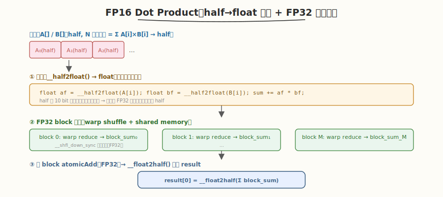

# LeetGPU FP16 Dot Product 题解

## 1. 题目概述

- **标题 / 题号**：FP16 Dot Product（#58，medium）
- **链接**：https://leetgpu.com/challenges/fp16-dot-product
- **难度**：中等
- **标签**：CUDA、归约（reduction）、half 精度、warp shuffle、FP32 累加

**题意**：给定两个长度为 `N` 的 `half`（FP16）向量 `A[]` 和 `B[]`，计算点积并输出一个 `half` 结果 `result[0] = Σ(A[i] × B[i])`。

**参考语义**（PyTorch）：

```text
result[0] = torch.dot(A.to(float32), B.to(float32)).to(float16)
```

**示例**：

```text
A = [1.0, 2.0, 3.0, 4.0] (half), B = [4.0, 3.0, 2.0, 1.0] (half)
result = 1×4 + 2×3 + 3×2 + 4×1 = 4+6+6+4 = 20.0 (half)
```

**约束**：`1 ≤ N ≤ 10^8`；性能测试取 `N = 100,000,000`，输入输出均为 `half`（`__half`）。

> 💡 这道题是 [Dot Product（#17）](../day3/leetgpu-dot-product-solution.md) 的半精度变体。核心难点不在归约结构（与 FP32 版完全一致），而在于**精度保证**：FP16 只有 10 bit 尾数（约 3 位有效十进制），直接累加大数组会迅速丢失精度。标准做法是**读 half、转 FP32、FP32 累加、最后再转回 half**——即 `__half2float()` / `__float2half()` 两次类型转换。

## 2. CPU 基线 / 朴素 GPU 方法

### CPU 串行

```cpp
// 顺序累乘累加：FP32 累加保证精度
#include <cuda_fp16.h>
float sum = 0.0f;
for (int i = 0; i < N; i++)
    sum += __half2float(A[i]) * __half2float(B[i]);
result[0] = __float2half(sum);
```

### 朴素 GPU（单 thread 串行，直接用 half 累加）

```cuda
// ❌ 错误示范：直接用 half 累加 → 精度灾难
__global__ void naive_dot_half(const half* A, const half* B, half* result, int N) {
    half sum = __float2half(0.0f);
    for (int i = 0; i < N; i++) {
        sum = __hadd(sum, __hmul(A[i], B[i]));  // half 加法/乘法
    }
    *result = sum;
}
```

**问题**：
1. 单 thread 串行，无并行，GPU 完全闲置。
2. **致命**：`half` 累加 `N=10^8` 次，累加和远大于单个乘积值时，小值会被"吞掉"（大数吃小数），最终结果可能严重失真。例如 `sum=1000.0`，再加 `0.001`，在 FP16 下会被舍入为 `1000.0`，等于没加。

> ⚠️ **精度陷阱**：FP16 的尾数只有 10 bit，能精确表示的整数范围约 `[-2048, 2048]`。当累加和超过这个量级，再加小于 `sum × 2^{-10}` 的值就会被舍入掉。`N=10^8` 量级的点积，必须用 FP32（24 bit 尾数）甚至 FP64 累加。

## 3. GPU 设计

### 3.1 并行化策略：FP32 两级归约



策略与 FP32 版 dot product 完全一致，只在数据进出口加类型转换：

1. **读 half 对**：每 thread 从 global memory 读 `A[i]`、`B[i]`（均为 `__half`）。
2. **转 FP32 乘累加**：`__half2float()` 转成 `float` 后做乘法和累加，累加器 `sum` 是 `float`。
3. **block 内归约**：warp shuffle 树形归约（FP32）→ shared memory → block 终约，得 `block_sum`（`float`）。
4. **跨 block 归约**：`atomicAdd(result_fp32, block_sum)`，把所有 block 的部分和汇总到一个 FP32 全局变量。
5. **最后转 half**：归约完成后，把 FP32 总和 `__float2half()` 写入 `result[0]`（`half*`）。

### 3.2 存储层次使用

| 数据 | 存储 | 说明 |
|------|------|------|
| `A[]`, `B[]` | global memory | `half` 数组，合并访存（每 thread 读连续 `half`） |
| 乘积与累加 | registers（`float`） | `__half2float` 后在寄存器做 FP32 乘加 |
| block 内归约 | shared memory + `__shfl_down_sync` | warp 树形归约（FP32） |
| 跨 block 部分和 | global memory（`atomicAdd` 到 `float*`） | 临时 FP32 缓冲，最后转 half |

> 💡 **带宽优势**：`half` 占 2 字节，是 `float` 的一半。读两个数组 `A+B` 共 `2N × 2B = 4N` 字节，而 FP32 版需要 `8N` 字节。半精度输入让 HBM 带宽压力减半，对 memory-bound 的归约是利好。

### 3.3 关键技巧

- **FP32 累加保证精度**：读入后立即 `__half2float()`，全程 FP32 累加，只在最后一步 `__float2half()` 转回。这是混合精度计算的金科玉律（Tensor Core 的 HMMA 也是 FP32 累加）。
- **warp shuffle 树形归约**：`__shfl_down_sync` 在 warp 内做 FP32 归约，零 bank conflict、零同步开销。
- **两阶段输出**：因为 `atomicAdd` 对 `half` 支持有限（部分架构支持 `__hatomicAdd` 但精度仍差），先用一个 `float* d_partial` 累加所有 block 的 FP32 部分和，再用一个小 kernel 或单线程把 FP32 总和转成 half 写入 `result[0]`。
- **grid-stride loop**：每 thread 处理多个元素，覆盖全部 N，避免启动过多 block。

> 💡 **为什么不用** `atomicAdd(half*, ...)`：虽然较新架构（SM 6.x+）支持 `atomicAdd` 对 `__half` 的重载，但累加仍是 half 精度，`N=10^8` 时精度会崩。FP32 原子累加 + 最后转 half 才是正解。

## 4. Kernel 实现

```cuda
// fp16_dot_product.cu —— FP16 Dot Product（half→float 转换 + FP32 两级归约 + 最后转 half）
// 编译命令: nvcc -O3 -arch=sm_120 fp16_dot_product.cu -o fp16_dot
// 运行:     ./fp16_dot

#include <cstdio>
#include <cstdlib>
#include <vector>
#include <cuda_runtime.h>
#include <cuda_fp16.h>

#define BLOCK 256
#define WARP 32

// warp 内 FP32 树形归约（__shfl_down_sync）
__device__ __forceinline__ float warp_reduce(float val) {
    #pragma unroll
    for (int offset = WARP / 2; offset > 0; offset /= 2)
        val += __shfl_down_sync(0xffffffff, val, offset);
    return val;
}

// block 内归约：每 thread 算一段乘积和 → warp 归约 → block 归约 → atomicAdd 到 FP32 结果
__global__ void fp16_dot_kernel(const half* A, const half* B, float* result, int N) {
    int tid = blockIdx.x * blockDim.x + threadIdx.x;
    int lane = threadIdx.x & (WARP - 1);
    int warp_id = threadIdx.x / WARP;

    __shared__ float warp_sums[WARP];

    // 每 thread 算自己负责元素的乘积和（grid-stride），half→float 转换后 FP32 累加
    float sum = 0.0f;
    for (int i = tid; i < N; i += gridDim.x * blockDim.x) {
        float a = __half2float(A[i]);
        float b = __half2float(B[i]);
        sum += a * b;
    }

    // warp 内归约
    sum = warp_reduce(sum);
    if (lane == 0)
        warp_sums[warp_id] = sum;
    __syncthreads();

    // 第一个 warp 归约 warp_sums
    if (warp_id == 0) {
        sum = (lane < blockDim.x / WARP) ? warp_sums[lane] : 0.0f;
        sum = warp_reduce(sum);
        if (lane == 0)
            atomicAdd(result, sum); // 跨 block 归约（FP32）
    }
}

// 单线程把 FP32 总和转成 half 写入 result[0]
__global__ void convert_fp32_to_half(const float* src, half* dst) {
    if (threadIdx.x == 0 && blockIdx.x == 0)
        dst[0] = __float2half(src[0]);
}

int main() {
    int N = 1000000;
    size_t bytes_half = N * sizeof(half);
    std::vector<half> h_a(N), h_b(N);
    srand(42);
    for (int i = 0; i < N; i++) {
        h_a[i] = __float2half((rand() % 100) / 100.0f);
        h_b[i] = __float2half((rand() % 100) / 100.0f);
    }

    half *d_a, *d_b, *d_result;
    float *d_partial;
    cudaMalloc(&d_a, bytes_half);
    cudaMalloc(&d_b, bytes_half);
    cudaMalloc(&d_result, sizeof(half));
    cudaMalloc(&d_partial, sizeof(float));
    cudaMemcpy(d_a, h_a.data(), bytes_half, cudaMemcpyHostToDevice);
    cudaMemcpy(d_b, h_b.data(), bytes_half, cudaMemcpyHostToDevice);
    float zero = 0.0f;
    cudaMemcpy(d_partial, &zero, sizeof(float), cudaMemcpyHostToDevice);

    int blocks = (N + BLOCK - 1) / BLOCK;
    fp16_dot_kernel<<<blocks, BLOCK>>>(d_a, d_b, d_partial, N);
    convert_fp32_to_half<<<1, 1>>>(d_partial, d_result);
    cudaDeviceSynchronize();

    half gpu_result;
    cudaMemcpy(&gpu_result, d_result, sizeof(half), cudaMemcpyDeviceToHost);

    // CPU 验证（FP32 累加）
    float cpu_result = 0;
    for (int i = 0; i < N; i++)
        cpu_result += __half2float(h_a[i]) * __half2float(h_b[i]);

    printf("GPU: %.4f, CPU: %.4f, %s\n", __half2float(gpu_result), cpu_result,
           fabs(__half2float(gpu_result) - cpu_result) < 1e-2 ? "PASS" : "FAIL");

    cudaFree(d_a);
    cudaFree(d_b);
    cudaFree(d_result);
    cudaFree(d_partial);
    return 0;
}
```

> 💡 提交给 LeetGPU 平台时，把 `fp16_dot_kernel` + `convert_fp32_to_half` 填进 `solve`。核心是 `__half2float` 读入 → FP32 grid-stride 乘累加 → warp shuffle 树形归约 → block 两级 → `atomicAdd` 跨 block（FP32）→ 最后 `__float2half` 写回 `result[0]`。

### 4.1 LeetGPU 提交版本

下面给出适配 LeetGPU 官方 starter 签名的提交版本。它先用一个 `float*` 临时缓冲做 FP32 跨 block 归约，再用单线程 kernel 把 FP32 总和转成 half 写入 `result`。

```cuda
#include <cuda_runtime.h>
#include <cuda_fp16.h>

#define BLOCK 256
#define WARP 32

__device__ __forceinline__ float warp_reduce(float val) {
    #pragma unroll
    for (int offset = WARP / 2; offset > 0; offset /= 2)
        val += __shfl_down_sync(0xffffffff, val, offset);
    return val;
}

__global__ void fp16_dot_kernel(const half* A, const half* B, float* result, int N) {
    int tid = blockIdx.x * blockDim.x + threadIdx.x;
    int lane = threadIdx.x & (WARP - 1);
    int warp_id = threadIdx.x / WARP;
    __shared__ float warp_sums[WARP];

    float sum = 0.0f;
    for (int i = tid; i < N; i += gridDim.x * blockDim.x) {
        float a = __half2float(A[i]);
        float b = __half2float(B[i]);
        sum += a * b;
    }

    sum = warp_reduce(sum);
    if (lane == 0)
        warp_sums[warp_id] = sum;
    __syncthreads();

    if (warp_id == 0) {
        sum = (lane < blockDim.x / WARP) ? warp_sums[lane] : 0.0f;
        sum = warp_reduce(sum);
        if (lane == 0)
            atomicAdd(result, sum);
    }
}

__global__ void convert_fp32_to_half(const float* src, half* dst) {
    if (threadIdx.x == 0 && blockIdx.x == 0)
        dst[0] = __float2half(src[0]);
}

// A, B, result are device pointers
extern "C" void solve(const half* A, const half* B, half* result, int N) {
    float* d_partial;
    cudaMalloc(&d_partial, sizeof(float));
    float zero = 0.0f;
    cudaMemcpy(d_partial, &zero, sizeof(float), cudaMemcpyHostToDevice);

    int blocks = (N + BLOCK - 1) / BLOCK;
    fp16_dot_kernel<<<blocks, BLOCK>>>(A, B, d_partial, N);
    convert_fp32_to_half<<<1, 1>>>(d_partial, result);

    cudaDeviceSynchronize();
    cudaFree(d_partial);
}
```

### 4.2 代码详解

`fp16_dot_kernel` 采用 **"half→float 转换 + 乘法与归约融合 + FP32 两级归约"** 结构：每 thread 先用 grid-stride 把自己负责元素的 `half` 读出转成 `float`，做 FP32 乘累加；再 warp 内 `__shfl_down_sync` 树形归约；最后 block 间用 `atomicAdd` 把 FP32 部分和汇总。乘法在归约前完成，避免中间数组落 HBM。

**辅助函数** `warp_reduce`：
- `for (int offset = WARP/2; offset > 0; offset /= 2)`：5 步折半，`__shfl_down_sync` 把高半 lane 的值加到低半，最终 lane 0 持有 warp 内 FP32 总和。全程寄存器，零 bank conflict。

**kernel 逐段解析**：

1. **索引计算**
   - `int tid = blockIdx.x * blockDim.x + threadIdx.x`：全局线程下标，用于定位数据。
   - `int lane = threadIdx.x & (WARP - 1)`：warp 内 lane 号（`0..31`），用于判断是否为 lane 0。
   - `int warp_id = threadIdx.x / WARP`：block 内 warp 编号（`0..7`），用于索引 `warp_sums`。

2. **grid-stride 乘积累加（half→float 转换）**
   - `__shared__ float warp_sums[WARP]`：存放每 warp 的归约结果（8 个 warp 用 8 个 slot）。
   - `for (int i = tid; i < N; i += gridDim.x * blockDim.x)`：grid-stride loop，每 thread 处理多个元素，覆盖全部 N。
   - `float a = __half2float(A[i])`：把 `half` 读入后转成 `float`，是精度保证的核心。
   - `sum += a * b`：FP32 乘法与累加融合，不写中间数组到 HBM，累加器 `sum` 是 `float`。

3. **warp 内归约**
   - `sum = warp_reduce(sum)`：warp 内 32 个 FP32 值树形归约到 lane 0。
   - `if (lane == 0) warp_sums[warp_id] = sum`：每 warp 的 lane 0 把结果写入 shared memory。
   - `__syncthreads`：确保所有 warp 写完后再读取。

4. **block 内终约 + 跨 block 归约**
   - `if (warp_id == 0)`：只用第一个 warp 做 warp 间归约（block 内 8 个 warp 的结果）。
   - `sum = (lane < blockDim.x / WARP) ? warp_sums[lane] : 0.0f`：前 8 个 lane 读各自的 warp_sum，其余补 0。
   - `sum = warp_reduce(sum)`：再次树形归约，lane 0 得到 block 总和（FP32）。
   - `if (lane == 0) atomicAdd(result, sum)`：block 的 lane 0 用 `atomicAdd` 把 FP32 block 总和累加到全局 `d_partial`，完成跨 block 归约。

5. **最终转换** `convert_fp32_to_half`：
   - 单线程 kernel，把 FP32 总和 `__float2half()` 写入 `result[0]`（`half`）。这一步在所有 block 归约完成后执行，保证 `d_partial` 已是最终总和。

**关键变量说明**：

| 变量 | 含义 |
|------|------|
| `tid` | 全局线程下标，定位 `A[tid]`、`B[tid]` |
| `lane` | warp 内 lane 号，用于归约后判断 lane 0 |
| `warp_id` | block 内 warp 编号，索引 `warp_sums` |
| `sum` | thread 局部 FP32 乘积和 → warp 和 → block 和 |
| `warp_sums[]` | shared memory，暂存 8 个 warp 的 FP32 部分和 |
| `d_partial` | 全局 FP32 临时缓冲，跨 block 用 `atomicAdd` 汇总 |
| `result` | 全局 `half` 输出，最后由 `__float2half` 写入 |

> **关键洞察**：混合精度计算的精髓是"低精度存储 + 高精度累加"。`half` 输入节省一半 HBM 带宽，FP32 累加保证数值精度，最后再转回 `half` 输出。这与 Tensor Core HMMA 的设计哲学一致（FP16/BF16 矩阵乘 + FP32 累加）。两级归约（warp shuffle → shared → warp 0 终约 + atomicAdd）是 GPU 归约的通用骨架，与 FP32 版完全一致。

## 5. 性能分析与优化

```bash
nvcc -O3 -arch=sm_120 fp16_dot_product.cu -o fp16_dot
ncu --set full ./fp16_dot | rg -i "Memory Throughput|Occupancy| DRAM"
```

**关键指标**：

| 指标 | 朴素（half 累加） | FP32 两级归约 |
|------|-----------------|---------|
| 并行度 | 1 thread | N threads |
| 精度 | 严重丢失（N 大时） | 与 CPU FP32 一致 |
| 带宽利用 | 极低 | 高（half 读取，带宽压力减半） |
| HBM 读量 | `2N × 2B` | `2N × 2B`（同，但利用率高） |

**优化方向**：

1. **vectorized load**：用 `half2`（打包两个 `half`）一次读 4 字节，`__half22float2()` 转成 `float2`，再拆开乘累加。带宽翻倍。
2. **多元素/thread**：每 thread 处理 4-8 个 `half2`（8-16 个元素），减少 launch 开销，提升指令级并行。
3. **两遍 kernel 替代 atomicAdd**：`N=10^8` 时 block 数可达数千，`atomicAdd` 竞争加剧。先写 `block_sums[]` 再第二遍归约更稳。
4. **block 数控制**：`blocks = min((N+BLOCK-1)/BLOCK, 2048)`（或 SM 数 × 4），避免过多 block 抢占。

## 6. 复杂度分析

| 维度 | 朴素 | FP32 两级归约 |
|------|------|---------|
| 时间 | `O(N)`（串行） | `O(N)`（并行，常数小） |
| 空间 | `O(1)` | `O(WARP)` shared/block + `O(1)` FP32 临时 |
| HBM 读量 | `2N × 2B`（half） | `2N × 2B`（half） |
| 算术强度 | 低 | 高（乘+加融合） |
| 瓶颈 | 无并行 + 精度灾难 | DRAM 带宽（memory-bound） |

> 💡 **一句话总结**：FP16 Dot Product 是混合精度归约的入门题——`__half2float` 读入、FP32 累加、`__float2half` 写出，两级归约结构与 FP32 版完全一致。它揭示了 GPU 混合精度的核心范式：存储用低精度省带宽，计算用高精度保数值，是后续 FP16 GEMM、Tensor Core 编程的基础。

## 同类练习题

下面是与本题考查相同 CUDA 概念的 LeetGPU 练习题，建议按顺序挑战：

| # | 题目 | 难度 | 核心概念 | 与本题的关联 |
|---|------|------|----------|-------------|
| 4 | [Reduction](https://leetgpu.com/challenges/reduction) | 中等 | — | 树形归约基础组件 |
| 17 | [Dot Product](https://leetgpu.com/challenges/dot-product) | 中等 | — | FP32 版 dot product 对比 |
| 57 | [FP16 Batched Matrix Multiplication](https://leetgpu.com/challenges/fp16-batched-matmul) | 中等 | — | FP16 + Tensor Core，半精度 GEMM |
| 27 | [Mean Squared Error](https://leetgpu.com/challenges/mean-squared-error) | 中等 | — | 归约在损失函数中的应用 |

> 💡 **选题思路**：半精度归约，练习 `__half` 类型转换与 FP32 累加精度保证。做完这组练习，即可掌握该 CUDA 模板在不同场景下的迁移应用。
