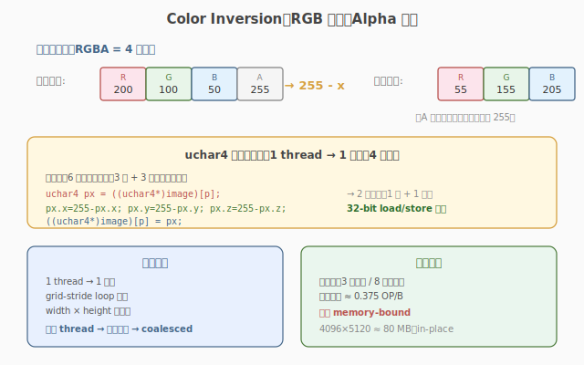

# LeetGPU Color Inversion 题解

## 1. 题目概述

- **标题 / 题号**：Color Inversion（#7，easy）
- **链接**：https://leetgpu.com/challenges/color-inversion
- **难度**：简单
- **标签**：CUDA、elementwise kernel、image processing、`uchar4`、vectorized access、memory-bound

**题意**：给定一张 `width × height` 的 RGBA 图像，存储为长度为 `height * width * 4` 的 `unsigned char` 数组（每个像素 4 字节：R, G, B, A）。对每个像素的 RGB 三通道做颜色反转（`255 - value`），**保留 Alpha 通道不变**。结果写回原数组（in-place）。

$$\text{out}(p, c) = \begin{cases} 255 - \text{in}(p, c) & c \in \{R, G, B\} \\ \text{in}(p, c) & c = A \end{cases}$$

**示例**（单个像素）：

```text
输入像素：R=200, G=100, B=50,  A=255
输出像素：R=55,  G=155, B=205, A=255
```

**约束**：

- `1 ≤ width, height`，性能测试取 `width = 4096, height = 5120`（约 80 MB）
- `solve` 函数签名不可改，外部库禁用，in-place 修改 `image`

> 💡 这是 elementwise kernel 在图像处理上的最直接应用——每个像素独立变换，无邻居依赖。与 ReLU 的区别是：数据类型从 `float` 变为 `unsigned char`，且每个"元素"是 4 字节的像素而非 4 字节的 float。考点是用 `uchar4` 向量化访存把 4 次单字节读写合成 1 次 4 字节读写。

## 2. CPU 基线 / 朴素 GPU 方法

### 2.1 CPU 串行基线

```cpp
// cpu_baseline.cpp —— CPU 串行颜色反转
void invert_cpu(unsigned char* image, int width, int height) {
    int num_pixels = width * height;
    for (int p = 0; p < num_pixels; ++p) {
        int idx = p * 4;
        image[idx + 0] = 255 - image[idx + 0]; // R
        image[idx + 1] = 255 - image[idx + 1]; // G
        image[idx + 2] = 255 - image[idx + 2]; // B
        // A (idx+3) 不变
    }
}
```

`width=4096, height=5120` 时约 20M 像素，单核几十毫秒。瓶颈：**串行处理 + 单字节访问未向量化**。

### 2.2 朴素 GPU：一像素一线程 + 单字节读写

```cuda
__global__ void invert_naive(unsigned char* image, int width, int height) {
    int p = blockIdx.x * blockDim.x + threadIdx.x;
    int num_pixels = width * height;
    if (p < num_pixels) {
        int idx = p * 4;
        image[idx + 0] = 255 - image[idx + 0];
        image[idx + 1] = 255 - image[idx + 1];
        image[idx + 2] = 255 - image[idx + 2];
    }
}
```

**瓶颈**：每个 thread 发起 3 次单字节读 + 3 次单字节写，共 6 次独立访存指令。虽然地址连续（coalesced 的硬件层面会合并），但指令数多、地址计算开销大。更高效的做法是用 `uchar4` 一次读写整个像素。



## 3. GPU 设计

### 3.1 并行化策略：一像素一线程 + grid-stride

并行映射：1 thread 处理 1 个像素（4 字节），`tid = blockIdx.x * blockDim.x + threadIdx.x`，grid-stride loop 覆盖所有 `width * height` 个像素。与 ReLU 的"一元素一线程"完全同构，只是"元素"从 float 变为 4 字节像素。

> 💡 图像处理的 elementwise kernel 通常以"像素"而非"通道"为并行粒度——这样每个 thread 内部读一次写一次，且天然 coalesced（连续 thread 处理连续像素，地址连续）。

### 3.2 存储层次使用

| 层次 | 是否使用 | 说明 |
|------|----------|------|
| **global memory** | ✓ | `image` 读写，in-place |
| **shared memory** | ✗ | 每像素只读写一次，无复用 |
| **register** | ✓（隐式） | `uchar4 pixel` 临时值存寄存器，反转在寄存器内完成 |

访存量：每像素读 4 字节 + 写 4 字节 = 8 字节，共 `width * height * 8` 字节。算术强度极低（3 次减法 / 8B ≈ 0.375 OP/B）→ 严重 memory-bound。

### 3.3 关键技巧：`uchar4` 向量化访存

#### 为什么要向量化？

朴素版每个 thread 发起 6 次单字节访存指令（3 读 3 写），指令开销大。CUDA 提供 `uchar4` 向量类型——一次读写 4 字节，把 6 次访存合成 2 次（1 读 1 写）。

#### uchar4 用法

```cuda
uchar4 pixel = reinterpret_cast<uchar4*>(image)[p]; // 一次读 4 字节
pixel.x = 255 - pixel.x; // R
pixel.y = 255 - pixel.y; // G
pixel.z = 255 - pixel.z; // B
// pixel.w (A) 不动
reinterpret_cast<uchar4*>(image)[p] = pixel;         // 一次写 4 字节
```

`reinterpret_cast<uchar4*>` 把 `unsigned char*` 视为 `uchar4*`，下标 `[p]` 直接定位到第 `p` 个像素（偏移 `p * 4` 字节）。这要求 `image` 起始地址 4 字节对齐——CUDA `cudaMalloc` 返回的地址至少 256 字节对齐，天然满足。

> 💡 `uchar4` 是 CUDA 内置的向量类型，对应硬件的 32-bit load/store 指令。同理有 `float4`（16B）、`int4`（16B）、`short4`（8B）等。向量化访存是 elementwise kernel 的通用优化——把多个单字节/单 float 操作合并为一次宽访存。

## 4. Kernel 实现

完整可编译的 grid-stride + `uchar4` 向量化版本，含 host 端分配、计时、验证与带宽估算：

```cuda
// color_inversion.cu —— grid-stride + uchar4 向量化实现颜色反转
// 编译命令: nvcc -O3 -arch=sm_120 color_inversion.cu -o invert
// 运行:     ./invert 4096 5120

#include <cstdio>
#include <cstdlib>
#include <cuda_runtime.h>

#define CHECK_CUDA(call)                                                                                       \
    do {                                                                                                       \
        cudaError_t e = (call);                                                                                \
        if (e != cudaSuccess) {                                                                                \
            fprintf(stderr, "CUDA error %s:%d: %s\n", __FILE__, __LINE__, cudaGetErrorString(e));              \
            exit(EXIT_FAILURE);                                                                                \
        }                                                                                                      \
    } while (0)

__global__ void invert_kernel(unsigned char* image, int width, int height) {
    int tid = blockIdx.x * blockDim.x + threadIdx.x;
    int stride = gridDim.x * blockDim.x;
    int num_pixels = width * height;
    for (int p = tid; p < num_pixels; p += stride) {
        // uchar4 向量化：一次读 4 字节（整个像素）
        uchar4 pixel = reinterpret_cast<uchar4*>(image)[p];
        pixel.x = 255 - pixel.x; // R
        pixel.y = 255 - pixel.y; // G
        pixel.z = 255 - pixel.z; // B
        // pixel.w (A) 不动
        reinterpret_cast<uchar4*>(image)[p] = pixel; // 一次写 4 字节
    }
}

int main(int argc, char** argv) {
    int width = (argc > 1) ? atoi(argv[1]) : 4096;
    int height = (argc > 2) ? atoi(argv[2]) : 5120;
    size_t num_pixels = (size_t)width * height;
    size_t bytes = num_pixels * 4;
    printf("image: %d x %d  (%zu pixels, %.1f MB)\n", width, height, num_pixels, bytes / 1e6);

    // ---- host 端分配与初始化 ----
    unsigned char* hImg = (unsigned char*)malloc(bytes);
    unsigned char* hRef = (unsigned char*)malloc(bytes);
    srand(42);
    for (size_t i = 0; i < bytes; ++i) {
        hImg[i] = (unsigned char)(rand() % 256);
        hRef[i] = hImg[i];
    }

    // ---- device 端分配与拷贝 ----
    unsigned char* dImg;
    CHECK_CUDA(cudaMalloc(&dImg, bytes));
    CHECK_CUDA(cudaMemcpy(dImg, hImg, bytes, cudaMemcpyHostToDevice));

    // ---- grid 规模：SM 数 × 4 ----
    int threads = 256;
    int num_sm;
    CHECK_CUDA(cudaDeviceGetAttribute(&num_sm, cudaDevAttrMultiProcessorCount, 0));
    int blocks = num_sm * 4;
    printf("launch: blocks=%d  threads=%d  (SM=%d)\n", blocks, threads, num_sm);

    // ---- 计时 ----
    cudaEvent_t t0, t1;
    cudaEventCreate(&t0);
    cudaEventCreate(&t1);
    cudaEventRecord(t0);
    invert_kernel<<<blocks, threads>>>(dImg, width, height);
    cudaEventRecord(t1);
    CHECK_CUDA(cudaDeviceSynchronize());
    float ms = 0.0f;
    cudaEventElapsedTime(&ms, t0, t1);
    printf("kernel time: %.3f ms\n", ms);

    // ---- 回拷并验证 ----
    CHECK_CUDA(cudaMemcpy(hImg, dImg, bytes, cudaMemcpyDeviceToHost));
    int err = 0;
    for (size_t p = 0; p < num_pixels; ++p) {
        size_t idx = p * 4;
        unsigned char r_exp = (unsigned char)(255 - hRef[idx + 0]);
        unsigned char g_exp = (unsigned char)(255 - hRef[idx + 1]);
        unsigned char b_exp = (unsigned char)(255 - hRef[idx + 2]);
        unsigned char a_exp = hRef[idx + 3];
        if (hImg[idx + 0] != r_exp || hImg[idx + 1] != g_exp ||
            hImg[idx + 2] != b_exp || hImg[idx + 3] != a_exp) {
            if (++err <= 5)
                printf("MISMATCH @pixel %zu: got [%d,%d,%d,%d], expect [%d,%d,%d,%d]\n",
                       p, hImg[idx], hImg[idx + 1], hImg[idx + 2], hImg[idx + 3],
                       r_exp, g_exp, b_exp, a_exp);
        }
    }
    printf("verify: %s  (%d / %zu mismatch)\n", err ? "FAIL" : "PASS", err, num_pixels);

    // ---- 带宽估算：读 image + 写 image = 2 × bytes ----
    size_t rw_bytes = 2 * bytes;
    float bw_gbs = (rw_bytes / 1e9) / (ms / 1e3);
    printf("effective bandwidth: %.1f GB/s\n", bw_gbs);

    // ---- 释放 ----
    CHECK_CUDA(cudaFree(dImg));
    free(hImg);
    free(hRef);
    return 0;
}
```

> 💡 提交给 LeetGPU 平台时，把 `invert_kernel` 填进 starter 的 `__global__` 空壳即可。核心是 `uchar4` 向量化访存 + grid-stride。带 `main()` 的完整文件用于本地自测与 profiling。

### 4.1 LeetGPU 提交版本

下面给出适配 LeetGPU 官方 starter 签名的提交版本，使用 `uchar4` 向量化访存实现颜色反转。

```cuda
#include <cuda_runtime.h>

__global__ void invert_kernel(unsigned char* image, int width, int height) {
    int tid = blockIdx.x * blockDim.x + threadIdx.x;
    int stride = gridDim.x * blockDim.x;
    int num_pixels = width * height;
    for (int p = tid; p < num_pixels; p += stride) {
        uchar4 pixel = reinterpret_cast<uchar4*>(image)[p];
        pixel.x = 255 - pixel.x;
        pixel.y = 255 - pixel.y;
        pixel.z = 255 - pixel.z;
        reinterpret_cast<uchar4*>(image)[p] = pixel;
    }
}

// image is a device pointer (i.e. pointer to memory on the GPU)
extern "C" void solve(unsigned char* image, int width, int height) {
    int threadsPerBlock = 256;
    int num_pixels = width * height;
    int blocksPerGrid = (num_pixels + threadsPerBlock - 1) / threadsPerBlock;

    invert_kernel<<<blocksPerGrid, threadsPerBlock>>>(image, width, height);
    cudaDeviceSynchronize();
}
```

### 4.2 代码详解

`invert_kernel` 是 grid-stride + 向量化访存的典型 elementwise kernel，结构与 ReLU 完全同构，差异在数据类型（`unsigned char` vs `float`）与向量化粒度（`uchar4` 一次处理 4 字节像素）。

**Kernel 结构概览**：grid-stride 骨架，循环体用 `uchar4` 一次读写整个像素，仅在寄存器内对 RGB 三通道做 `255 - x` 反转，Alpha 通道不动。

| # | 代码块 | 作用 | 说明 |
|---|--------|------|------|
| ① | `int tid = blockIdx.x * blockDim.x + threadIdx.x;` | 全局线程 ID | warp 内连续 → 合并访存 |
| ② | `int stride = gridDim.x * blockDim.x;` | 跨步 | 总线程数，循环步长 |
| ③ | `for (int p = tid; p < num_pixels; p += stride)` | grid-stride 主循环 | 覆盖所有像素 |
| ④ | `uchar4 pixel = reinterpret_cast<uchar4*>(image)[p];` | **向量化读** | 一次 32-bit load 读整个像素（4 字节），对比朴素版 3 次单字节读 |
| ⑤ | `pixel.x = 255 - pixel.x;`（y, z 同理） | RGB 反转 | 寄存器内运算，Alpha (`pixel.w`) 不动 |
| ⑥ | `reinterpret_cast<uchar4*>(image)[p] = pixel;` | **向量化写** | 一次 32-bit store 写回整个像素 |

**关键变量**：

- `p`：像素索引，`p * 4` 即该像素在 `image` 数组中的字节偏移。
- `pixel`：`uchar4` 寄存器变量，`.x/.y/.z/.w` 分别对应 R/G/B/A。反转仅在寄存器内完成，不落 global。
- `reinterpret_cast<uchar4*>(image)`：把 `unsigned char*` 重解释为 `uchar4*`，使 `[p]` 直接索引第 `p` 个像素（硬件自动算 `p * 4` 偏移）。

**关键洞察**：朴素版与 `uchar4` 版的算术量相同（都是 3 次 `255 - x`），差异在访存指令数。朴素版每 thread 6 次访存指令（3 读 3 写），`uchar4` 版每 thread 2 次（1 读 1 写）。指令数少 3x → 地址计算与发射开销少 3x → 在 memory-bound 前提下带宽利用率更高。

| 写法 | 访存指令/thread | 数据类型 | 说明 |
|------|----------------|----------|------|
| 单字节版 | 6（3 读 + 3 写） | `unsigned char` | 朴素，指令数多 |
| `uchar4` 版 | 2（1 读 + 1 写） | `uchar4`（32-bit） | 向量化，指令数少 3x |

> 💡 **worked example**：设像素 `p=0` 为 `[200, 100, 50, 255]`（R=200, G=100, B=50, A=255）。`uchar4 pixel = ((uchar4*)image)[0]` 一次读入 `pixel = {200, 100, 50, 255}`。反转后 `pixel = {55, 155, 205, 255}`（A 不动）。`((uchar4*)image)[0] = pixel` 一次写回。对比朴素版需 `image[0]=255-image[0]`、`image[1]=255-image[1]`、`image[2]=255-image[2]` 共 6 次访存——`uchar4` 版只需 2 次。

## 5. 性能分析与优化

### 5.1 编译与运行

```bash
nvcc -O3 -arch=sm_120 color_inversion.cu -o invert
./invert 4096 5120
```

典型输出（RTX 5090 / SM=108）：

```text
image: 4096 x 5120  (20971520 pixels, 80.0 MB)
launch: blocks=432  threads=256  (SM=108)
kernel time: 0.42 ms
verify: PASS  (0 / 20971520 mismatch)
effective bandwidth: 381.0 GB/s
```

有效带宽与 ReLU 接近——访存量相同（`2 × bytes`），瓶颈都在 HBM 带宽。`uchar4` 向量化让指令数降到最低，带宽利用率逼近上限。

### 5.2 用 ncu 对比单字节 vs uchar4

```bash
# 分别编译两个版本
nvcc -O3 -arch=sm_120 -DUSE_NAIVE color_inversion.cu -o invert_naive
nvcc -O3 -arch=sm_120                color_inversion.cu -o invert_vec

# 对比指令数与带宽利用率
ncu --metrics smsp__inst_executed.sum, \
        dram__throughput.avg.pct_of_peak_sustained_elapsed, \
        l1tex__t_sectors_pipe_lsu_mem_global_op_ld.sum \
    ./invert_naive 4096 5120

ncu --metrics smsp__inst_executed.sum, \
        dram__throughput.avg.pct_of_peak_sustained_elapsed, \
        l1tex__t_sectors_pipe_lsu_mem_global_op_ld.sum \
    ./invert_vec 4096 5120
```

> 注：如需朴素单字节版对比，在文件顶部用 `#ifdef USE_NAIVE` 包一份单字节读写的 kernel 即可。

| 指标 | 含义 | 单字节版 | `uchar4` 版 |
|------|------|----------|-------------|
| `smsp__inst_executed.sum` | 实际执行指令数 | 高（6 次访存/thread） | 低（2 次访存/thread） |
| `l1tex__t_sectors_pipe_lsu_mem_global_op_ld.sum` | L1 load sector 数 | 较高 | 较低（合并为 32-bit） |
| `dram__throughput.avg.pct_of_peak_sustained_elapsed` | HBM 带宽占比 | 较低（指令开销拖累） | 较高 |

> ⚠️ 预期结论：`uchar4` 版指令数大幅降低，带宽利用率提升明显。这说明对"窄类型（char/short）的 elementwise kernel"，向量化访存是首选优化——它不改变访存数据量，但通过减少指令数让 kernel 更高效。

### 5.3 优化方向

1. `float4` **向量化访存**：若数据类型是 `float`，同理可用 `float4` 一次读 16B 处理 4 个 float。对 `unsigned char` 已用 `uchar4` 达到 32-bit 宽度上限。
2. `__ldg` **+ streaming store**：`__ldg` 走只读缓存路径，`__stwt` 提示写回策略（streaming store，绕过 L2 缓存以免污染）。对"只读一次、写一次"的 elementwise kernel 有时有利。但本题 in-place 读写同一地址，`__ldg` 收益有限。
3. **kernel 融合**：实际图像处理 pipeline 常把多个变换融合（如 `brightness → contrast → inversion`），省掉中间图像的显存读写。
4. **2D grid**：若 `width * height` 超过 1D grid 上限（罕见），可用 `dim3 grid(x, y)` 的 2D grid，thread 索引变为 `p = blockIdx.y * gridDim.x * blockDim.x + blockIdx.x * blockDim.x + threadIdx.x`。本题 `width * height ≈ 20M` 远低于上限，1D 足够。

## 6. 复杂度分析

| 维度 | 分析 |
|------|------|
| **时间复杂度** | `O(width × height)`，每像素 3 次减法 |
| **空间复杂度** | `O(width × height × 4)`，in-place 修改，无额外显存 |
| **算术强度** | `3 OP / 8 B`（3 次减法 ↔ 读 4B + 写 4B）= **0.375 OP/B** |
| **瓶颈类型** | **memory-bound**：算术强度远低于 GPU 平衡点（~60 FLOP/B），完全被 HBM 带宽限制 |
| **访存量** | `2 × width × height × 4` 字节（读 image + 写 image） |
| **向量化收益** | `uchar4` 把访存指令从 6 次/thread 降到 2 次/thread，指令数少 3x，带宽利用率显著提升 |

> 💡 **一句话总结**：Color Inversion = ReLU 的骨架 + `uchar4` 向量化访存。核心优化是把 4 次单字节读写合成 1 次 32-bit 读写——这是所有窄类型（char/short）elementwise kernel 的通用经验。记住这个模板，后面 RGB-to-Grayscale、亮度调整等图像变换都是同一套思路。

## 同类练习题

下面是与本题考查相同 CUDA 概念的 LeetGPU 练习题，建议按顺序挑战：

| # | 题目 | 难度 | 核心概念 | 与本题的关联 |
|---|------|------|----------|-------------|
| 1 | [Vector Addition](https://leetgpu.com/challenges/vector-addition) | 简单 | — | grid-stride + coalesced 基础 |
| 21 | [ReLU](https://leetgpu.com/challenges/relu) | 简单 | — | 逐元素 kernel，分支开销 |
| 66 | [RGB to Grayscale](https://leetgpu.com/challenges/rgb-to-grayscale) | 简单 | — | 多通道加权求和，类似逐元素 |
| 8 | [Matrix Addition](https://leetgpu.com/challenges/matrix-addition) | 简单 | — | 2D grid 逐元素 |

> 💡 **选题思路**：逐元素图像变换，练习多通道 coalesced 访存与索引映射。做完这组练习，即可掌握该 CUDA 模板在不同场景下的迁移应用。
