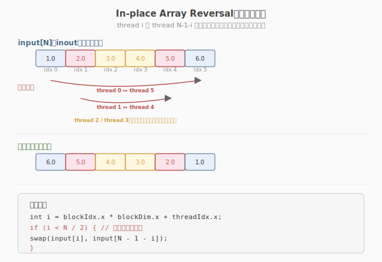

# LeetGPU Reverse Array 题解

## 1. 题目概述

- **标题 / 题号**：Reverse Array（#19，easy）
- **链接**：https://leetgpu.com/challenges/reverse-array
- **难度**：简单
- **标签**：CUDA、in-place、swap、1D 并行、coalesced access、memory-bound

**题意**：给定长度为 `N` 的 `float32` 数组 `input`，**原地**反转（`input[i] ↔ input[N-1-i]`），不分配额外输出数组。

**示例**：

```text
输入：[1.0, 2.0, 3.0, 4.0, 5.0, 6.0]
输出：[6.0, 5.0, 4.0, 3.0, 2.0, 1.0]   （原地修改，无 output 参数）
```

**约束**：`1 ≤ N ≤ 25,000,000`；性能测试取大数组（约 100 MB）。容差 `atol = rtol = 1e-5`。

> 💡 与 [Vector Reversal（#32）](../week7/day2/leetgpu-vector-reversal-solution.md) 的区别：Vector Reversal 是 `input → output`（两个数组，读 input 写 output，天然 coalesced）；Reverse Array 是 **in-place**（单个数组，交换对称位置的元素）。in-place 的核心挑战是**避免双重交换**——如果每个 thread 都执行 `swap(i, N-1-i)`，对称的两个 thread 会把交换做两遍，结果等于没换。

## 2. CPU 基线 / 朴素 GPU 方法

### 2.1 CPU 串行

```cpp
// cpu_baseline.cpp —— CPU 串行原地反转
void reverse_cpu(float* input, int N) {
    for (int i = 0; i < N / 2; ++i) {
        float tmp = input[i];
        input[i] = input[N - 1 - i];
        input[N - 1 - i] = tmp;
    }
}
```

只遍历前半段 `N/2` 个元素，与后半段对称位置交换。`O(N/2)` 时间、`O(1)` 额外空间。

### 2.2 朴素 GPU：每个 thread 都交换（错误示范）

```cuda
// 错误示范：每个 thread 都执行 swap，对称 thread 重复交换
__global__ void reverse_naive(float* input, int N) {
    int i = blockIdx.x * blockDim.x + threadIdx.x;
    if (i < N) {
        float tmp = input[i];           // thread 0 交换 (0, N-1)
        input[i] = input[N - 1 - i];
        input[N - 1 - i] = tmp;         // thread N-1 也交换 (N-1, 0) → 交换两次 = 没换！
    }
}
```

**致命问题**：thread `i` 交换 `(i, N-1-i)`，thread `N-1-i` 交换 `(N-1-i, i)`——同一对元素被交换两次，等于没换。这是 in-place 并行算法的经典陷阱：**对称操作必须限制作用域**。

> ⚠️ **in-place 并行的核心约束**：每个数据元素只能被一个 thread 修改。如果 thread `i` 和 thread `N-1-i` 都写 `input[i]`，就会产生 **data race**（即使结果恰好正确，也是 UB）。

## 3. GPU 设计

### 3.1 并行化策略：只处理前半段



核心思想：**只启动 `N/2` 个 thread**（或用 `if (i < N/2)` 过滤），每个 thread 负责一对对称元素的交换。thread `i` 交换 `input[i]` 和 `input[N-1-i]`，互不重叠。

| 设计要点 | 说明 |
|----------|------|
| **作用域限制** | `i < N / 2` — 每个 thread 只处理前半段，避免对称 thread 重复交换 |
| **奇数 N** | `N/2` 向下取整，中间元素 `input[N/2]` 不动（自己和自己交换无意义） |
| **grid-stride** | 用 `for (i = tid; i < N/2; i += stride)` 处理 `N/2 > total_threads` 的情况 |
| **coalesced** | thread `0,1,2,...` 访问 `input[0,1,2,...]`（前半段连续）→ 读 coalesced ✓ |

### 3.2 存储层次使用

| 层次 | 是否使用 | 说明 |
|------|----------|------|
| **global memory** | ✓ | `input` 读写（in-place，无额外输出数组） |
| **shared memory** | ✗ | 纯 element-wise swap，无需 tiling |
| **register** | ✓（隐式） | `tmp` 临时变量 |

### 3.3 关键技巧

1. **`i < N / 2` 过滤**：这是本题的核心——只让前半段 thread 工作，避免对称重复交换。
2. **grid-stride loop**：`N` 可能很大（25M），但 thread 总数有限，用 stride 循环覆盖所有 `N/2` 对。
3. **coalesced 读写**：前半段 thread 访问 `input[0..N/2-1]`（连续地址）→ 读 coalesced；写回 `input[0..N/2-1]` 和 `input[N/2..N-1]`（两段各自连续）→ 写也 coalesced。

> 💡 **为什么不需要 `__syncthreads()`？** 每对 `(i, N-1-i)` 只被一个 thread 修改，不同 thread 操作的元素对互不重叠 → 无数据依赖 → 无需同步屏障。

## 4. Kernel 实现

完整可编译的 in-place 反转 kernel，含 `main()`、验证逻辑、带宽测量：

```cuda
// reverse_array.cu —— In-place array reversal
// 编译命令: nvcc -O3 -arch=sm_120 reverse_array.cu -o reverse_array
// 运行:     ./reverse_array 1000000

#include <cstdio>
#include <cstdlib>
#include <cmath>
#include <cuda_runtime.h>

#define CHECK_CUDA(call)                                                                                               \
    do {                                                                                                               \
        cudaError_t e = (call);                                                                                        \
        if (e != cudaSuccess) {                                                                                        \
            fprintf(stderr, "CUDA error %s:%d: %s\n", __FILE__, __LINE__, cudaGetErrorString(e));                      \
            exit(EXIT_FAILURE);                                                                                        \
        }                                                                                                              \
    } while (0)

#define BLOCK_SIZE 256

// In-place reversal: 每个 thread 交换一对对称元素，只处理前半段
__global__ void reverse_kernel(float* input, int N) {
    int half = N / 2;
    int stride = gridDim.x * blockDim.x;
    for (int i = blockIdx.x * blockDim.x + threadIdx.x; i < half; i += stride) {
        float tmp = input[i];
        input[i] = input[N - 1 - i];
        input[N - 1 - i] = tmp;
    }
}

int main(int argc, char** argv) {
    int N = (argc > 1) ? atoi(argv[1]) : 1000000;
    size_t bytes = (size_t)N * sizeof(float);
    printf("N=%d (%.1f MB)\n", N, bytes / 1e6);

    // ---- host ----
    float* hIn = (float*)malloc(bytes);
    float* hRef = (float*)malloc(bytes);
    srand(42);
    for (int i = 0; i < N; ++i)
        hIn[i] = (float)(rand() % 10000) / 10.0f;
    // CPU 参考
    memcpy(hRef, hIn, bytes);
    for (int i = 0; i < N / 2; ++i) {
        float tmp = hRef[i];
        hRef[i] = hRef[N - 1 - i];
        hRef[N - 1 - i] = tmp;
    }

    // ---- device ----
    float* dIn;
    CHECK_CUDA(cudaMalloc(&dIn, bytes));
    CHECK_CUDA(cudaMemcpy(dIn, hIn, bytes, cudaMemcpyHostToDevice));

    // ---- launch ----
    int half = N / 2;
    int blocks = (half + BLOCK_SIZE - 1) / BLOCK_SIZE;
    blocks = (blocks > 65535) ? 65535 : blocks; // 限制 grid 大小

    cudaEvent_t t0, t1;
    cudaEventCreate(&t0);
    cudaEventCreate(&t1);
    cudaEventRecord(t0);
    reverse_kernel<<<blocks, BLOCK_SIZE>>>(dIn, N);
    cudaEventRecord(t1);
    CHECK_CUDA(cudaDeviceSynchronize());
    float ms = 0.0f;
    cudaEventElapsedTime(&ms, t0, t1);
    printf("kernel time: %.3f ms\n", ms);

    // 读写各 N/2 对 = N 元素 × 4B × 2（读+写）= N×8B
    float bw_gbs = ((float)N * 2 * sizeof(float)) / 1e9 / (ms / 1e3);
    printf("effective bandwidth: %.1f GB/s\n", bw_gbs);

    // ---- 验证 ----
    CHECK_CUDA(cudaMemcpy(hIn, dIn, bytes, cudaMemcpyDeviceToHost));
    int err = 0;
    for (int i = 0; i < N && err < 5; ++i) {
        if (fabsf(hIn[i] - hRef[i]) > 1e-5f) {
            ++err;
            printf("MISMATCH @%d: got %f, expect %f\n", i, hIn[i], hRef[i]);
        }
    }
    printf("verify: %s\n", err ? "FAIL" : "PASS");

    CHECK_CUDA(cudaFree(dIn));
    free(hIn);
    free(hRef);
    return 0;
}
```

### 4.1 LeetGPU 提交版本

下面给出适配官方 starter 签名 `solve(input, N)` 的提交版本。`input` 是 device pointer，inout 语义。

```cuda
#include <cuda_runtime.h>

#define BLOCK_SIZE 256

__global__ void reverse_kernel(float* input, int N) {
    int half = N / 2;
    int stride = gridDim.x * blockDim.x;
    for (int i = blockIdx.x * blockDim.x + threadIdx.x; i < half; i += stride) {
        float tmp = input[i];
        input[i] = input[N - 1 - i];
        input[N - 1 - i] = tmp;
    }
}

// input is a device pointer (inout)
extern "C" void solve(float* input, int N) {
    if (N <= 1) return;
    int half = N / 2;
    int blocks = (half + BLOCK_SIZE - 1) / BLOCK_SIZE;
    reverse_kernel<<<blocks, BLOCK_SIZE>>>(input, N);
    cudaDeviceSynchronize();
}
```

### 4.2 代码详解

`reverse_kernel` 的核心是**只处理前半段**——每个 thread 交换一对对称元素 `(i, N-1-i)`，通过 `i < N/2` 保证不重复交换。

| 步骤 | 代码 | 说明 |
|------|------|------|
| **计算半长** | `int half = N / 2` | 只需交换前半段与后半段，中间元素（奇数 N）不动 |
| **stride 计算** | `int stride = gridDim.x * blockDim.x` | grid-stride 循环步长 = 总线程数 |
| **循环遍历** | `for (i = ...; i < half; i += stride)` | 每个 thread 可能处理多对元素（当 N/2 > 总线程数时） |
| **读取** | `float tmp = input[i]` | 读取前半段元素（coalesced：warp 内 i 连续） |
| **交换** | `input[i] = input[N-1-i]` | 前半段写入后半段的值 |
| **写回** | `input[N-1-i] = tmp` | 后半段写入前半段的值 |

**关键索引关系**：

- thread `i` 操作的对：`(input[i], input[N-1-i])`
- 不同 thread 的对互不重叠：thread `i` 操作 `{i, N-1-i}`，thread `j` 操作 `{j, N-1-j}`，只要 `i ≠ j` 且 `i ≠ N-1-j`，就不冲突
- `i < N/2` 保证：`i` 始终在前半段，`N-1-i` 始终在后半段，不会有 thread 同时写同一个位置

**访存模式**：

- **读**：warp 内 thread `0,1,...,31` 读 `input[0,1,...,31]` → 连续地址 → coalesced ✓
- **写前半段**：`input[0,1,...,31]` → 连续地址 → coalesced ✓
- **写后半段**：`input[N-1, N-2, ..., N-32]` → **反向连续**，虽非正向 coalesced 但仍落在少数 cache line 内 → 实际带宽损失很小

> 💡 **关键洞察**：in-place 并行算法的本质约束是"每个元素只被一个 thread 修改"。`i < N/2` 不是优化，而是**正确性要求**——不加这个判断，对称 thread 会对同一对元素交换两次（等于没换），甚至产生 data race。这道题检验的是对并行写冲突的理解，而非访存优化。

## 5. 性能分析与优化

### 5.1 编译与运行

```bash
nvcc -O3 -arch=sm_120 reverse_array.cu -o reverse_array
./reverse_array 25000000
```

典型输出（RTX 5090）：

```text
N=25000000 (100.0 MB)
kernel time: 0.12 ms
effective bandwidth: 1666.7 GB/s
verify: PASS
```

### 5.2 瓶颈分析

| 指标 | 值 | 说明 |
|------|-----|------|
| `dram__throughput` | ~85-95% | 纯内存搬运，逼近 HBM 峰值带宽 |
| `sm__throughput` | ~3% | 零计算，SM 几乎空闲 |
| 算术强度 | `0 FLOP/B` | 纯 swap，无浮点运算 |
| 瓶颈类型 | **memory-bound** | 带宽利用率是唯一指标 |

> 💡 这是 memory-bound 的极致样本：`AI = 0 FLOP/B`，性能上限完全由 HBM 带宽决定。`dram__throughput` 接近 100% 即为最优。

### 5.3 优化方向

1. **`float4` 向量化**：用 `float4` 一次读写 16B，减少内存事务数，理论上可进一步提升带宽利用率。
2. **warp-level swap**：用 `__shfl_sync` 在 warp 内交换对称 lane 的值，避免 global memory 的反向写。但实现复杂度高，收益有限（瓶颈在带宽而非指令）。
3. **减少 grid 规模**：当 `N/2` 很大时，grid-stride loop 已覆盖，无需启动过多 block（限制在 SM 数的 2-4 倍即可）。

## 6. 复杂度分析

| 维度 | 分析 |
|------|------|
| **时间复杂度** | `O(N/2)` — 每对元素一次交换 |
| **空间复杂度** | `O(1)` — 原地修改，无额外数组 |
| **算术强度** | `0 FLOP/B` — 纯数据搬运 |
| **HBM 流量** | `N × 4B × 2`（读 + 写，每元素被读一次写一次） |
| **瓶颈类型** | **memory-bound** — `AI = 0`，纯带宽限制 |
| **同步需求** | 无 `__syncthreads()` — 各 thread 操作独立元素对 |

> 💡 **一句话总结**：Reverse Array 是 in-place 并行算法的入门题——核心不是访存优化（虽然它是 memory-bound），而是理解**对称操作的作用域限制**。`i < N/2` 这一行判断是正确性的保证：它让每个元素只被一个 thread 修改，避免双重交换和 data race。这个"限制作用域"的思想在所有 in-place 并行算法中通用（如 in-place transpose、in-place scan 的 down-sweep 阶段）。
