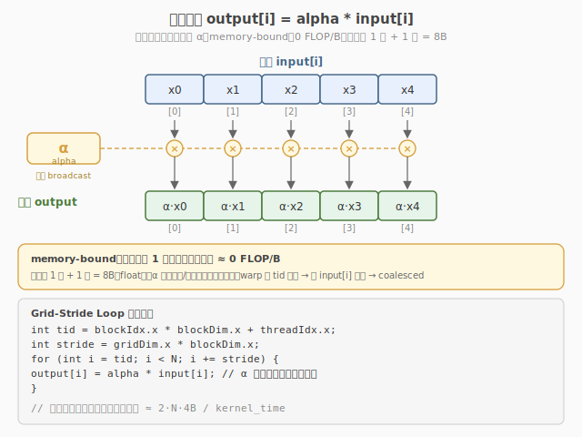

# LeetGPU Scalar Multiply 题解

## 1. 题目概述

- **标题 / 题号**：Scalar Multiply（#33，easy）
- **链接**：https://leetgpu.com/challenges/scalar-multiply
- **难度**：简单
- **标签**：CUDA、element-wise、memory-bound、attention scaling

**题意**：给定长度为 `N` 的 `float32` 数组 `input` 和标量 `alpha`，计算 `output[i] = input[i] * alpha`。

**示例**：

```text
input = [1.0, 2.0, 3.0, 4.0], alpha = 2.0
output = [2.0, 4.0, 6.0, 8.0]
```

**约束**：`1 ≤ N ≤ 10,000,000`；性能测试取大数组（约 40 MB）。

> 💡 这道题是 **element-wise 操作的最简形式**——标量乘法，零计算强度，纯 memory-bound。它与 [Week7 Day3 高级特性](../../../aiinfra/daily/week7/day3/README.md) 的关联在于：attention score scaling（`score /= sqrt(d_k)`）、softmax 温度缩放、LayerNorm 方差缩放都是 scalar multiply 操作。理解它的 memory-bound 特性是理解 Speculative Decoding 加速原理的基础——大模型 decode 的计算密度极低（每步只出 1 token），GPU 大量算力闲置，draft model 正好利用这些闲置算力。

## 2. CPU 基线 / 朴素 GPU 方法

### CPU 串行

```cpp
for (int i = 0; i < N; i++)
    output[i] = input[i] * alpha;
```

### 朴素 GPU（一 thread 一元素）

```cuda
__global__ void naive_scalar_multiply(const float* input, float* output, float alpha, int N) {
    int i = blockIdx.x * blockDim.x + threadIdx.x;
    if (i < N)
        output[i] = input[i] * alpha;
}
```

**瓶颈**：朴素版本正确但可能未达峰值带宽——每线程读 4B + 写 4B + 1 次乘法，计算强度 = 1 FLOP / 8B = 0.125 FLOP/B，纯 memory-bound。

## 3. GPU 设计

### 3.1 并行化策略：coalesced 1:1 标量乘

每个 thread 负责一个元素：`output[i] = input[i] * alpha`。

关键点：
- **读端** `input[i]`：warp 内 i 递增 → 连续地址 → **coalesced**
- **写端** `output[i]`：同上 → **coalesced**
- 标量 `alpha` 通过常量内存或 kernel 参数广播，零额外带宽



### 3.2 存储层次使用

| 层次 | 是否使用 | 说明 |
|------|----------|------|
| global memory | ✓ | input 读、output 写 |
| shared memory | ✗ | 纯 element-wise，无需暂存 |
| register | ✓ | 每线程持有 1 个 float + alpha |

### 3.3 优化方向：float4 向量化

```cuda
// 每线程处理 4 个 float（16B），减少地址计算、提升事务效率
float4* in4 = (float4*)input;
float4* out4 = (float4*)output;
int idx = blockIdx.x * blockDim.x + threadIdx.x;
if (idx < N / 4) {
    float4 v = in4[idx];
    v.x *= alpha;
    v.y *= alpha;
    v.z *= alpha;
    v.w *= alpha;
    out4[idx] = v;
}
```

## 4. Kernel 实现

### 4.1 提交版代码

```cuda
// scalar_multiply.cu —— Scalar Multiply（coalesced element-wise）
// 编译命令: nvcc -O3 -arch=sm_120 scalar_multiply.cu -o scalar_multiply

#include <cuda_runtime.h>

__global__ void scalar_multiply_kernel(const float* input, float* output, float alpha, int N) {
    int i = blockIdx.x * blockDim.x + threadIdx.x;
    if (i < N) {
        output[i] = input[i] * alpha;
    }
}

// input, output are device pointers
extern "C" void solve(const float* input, float* output, float alpha, int N) {
    int blockSize = 256;
    int gridSize = (N + blockSize - 1) / blockSize;
    scalar_multiply_kernel<<<gridSize, blockSize>>>(input, output, alpha, N);
}
```

### 4.2 完整自测版（含 Host + 带宽测量）

```cuda
// scalar_multiply_full.cu —— 含验证和带宽测量
    #include <cstdio>
    #include <cstdlib>
    #include <cmath>
    #include <cuda_runtime.h>

    #define CHECK_CUDA(call)                                                                                               \
    do {                                                                                                               \
        cudaError_t e = (call);                                                                                        \
        if (e != cudaSuccess) {                                                                                        \
            fprintf(stderr, "CUDA error %s:%d: %s\n", __FILE__, __LINE__, cudaGetErrorString(e));                      \
            exit(EXIT_FAILURE);                                                                                        \
        }                                                                                                              \
    } while (0)

__global__ void scalar_multiply_kernel(const float* input, float* output, float alpha, int N) {
    int i = blockIdx.x * blockDim.x + threadIdx.x;
    if (i < N)
        output[i] = input[i] * alpha;
}

int main(int argc, char** argv) {
    int N = (argc > 1) ? atoi(argv[1]) : 10000000;
    float alpha = 2.0f;
    size_t bytes = (size_t)N * sizeof(float);
    printf("N = %d  (%.1f MB), alpha = %f\n", N, bytes / 1e6, alpha);

    float* hIn = (float*)malloc(bytes);
    float* hOut = (float*)malloc(bytes);
    srand(42);
    for (int i = 0; i < N; i++)
        hIn[i] = (float)(rand() % 1000) / 10.0f;

    float *dIn, *dOut;
    CHECK_CUDA(cudaMalloc(&dIn, bytes));
    CHECK_CUDA(cudaMalloc(&dOut, bytes));
    CHECK_CUDA(cudaMemcpy(dIn, hIn, bytes, cudaMemcpyHostToDevice));

    int blockSize = 256;
    int gridSize = (N + blockSize - 1) / blockSize;

    cudaEvent_t t0, t1;
    cudaEventCreate(&t0);
    cudaEventCreate(&t1);
    cudaEventRecord(t0);
    scalar_multiply_kernel<<<gridSize, blockSize>>>(dIn, dOut, alpha, N);
    cudaEventRecord(t1);
    CHECK_CUDA(cudaDeviceSynchronize());

    float ms = 0;
    cudaEventElapsedTime(&ms, t0, t1);
    printf("kernel time: %.3f ms\n", ms);
    printf("I/O bandwidth: %.1f GB/s\n", (2.0 * bytes / 1e9) / (ms / 1e3));

    CHECK_CUDA(cudaMemcpy(hOut, dOut, bytes, cudaMemcpyDeviceToHost));

    int fail = 0;
    for (int i = 0; i < N; i++) {
        if (fabsf(hOut[i] - hIn[i] * alpha) > 1e-5f) {
            printf("FAIL at i=%d\n", i);
            fail = 1;
            break;
        }
    }
    printf("%s\n", fail ? "FAIL" : "PASS");

    CHECK_CUDA(cudaFree(dIn));
    CHECK_CUDA(cudaFree(dOut));
    free(hIn);
    free(hOut);
    return 0;
}
```

### 4.3 代码详解

`naive_scalar_multiply`（2.2 节）与 `scalar_multiply_kernel`（4.1 节提交版）逻辑完全相同——一 thread 一元素，做 `output[i] = input[i] * alpha`。区别仅在命名与是否有 host 包装。下面以提交版为例逐块拆解。

**Kernel 结构概览**：与 Vector Addition / ReLU 完全同构的 1:1 element-wise 骨架，循环体是一条标量乘法。共 3 行，无 shared memory、无同步。

| # | 代码块 | 作用 | 说明 |
|---|--------|------|------|
| ① | `int i = blockIdx.x * blockDim.x + threadIdx.x;` | 全局线程下标 | warp 内连续 → 读写均 coalesced |
| ② | `if (i < N)` | 越界保护 | 末 block 多余 thread 直接跳过 |
| ③ | `output[i] = input[i] * alpha;` | 标量乘 | 读 `input[i]`（4B）→ 寄存器乘 `alpha` → 写 `output[i]`（4B） |

**关键索引/变量**：

| 变量 | 含义 |
|------|------|
| `i` | 元素下标，范围 `[0, N)` |
| `alpha` | 标量乘子，通过 kernel 参数传入，对所有 thread 广播，零额外带宽 |
| `input[i]` | 只读一次，进寄存器后立即参与乘法，不落 global |
| `blockSize = 256` | 每 block 线程数 |
| `gridSize = ceil(N / 256)` | block 数 |

> 💡 **关键洞察**：标量 `alpha` 通过 kernel 参数传入，存在常量寄存器中，对 warp 内 32 个 thread 广播——零额外访存带宽。算术强度 `1 FLOP / 8B = 0.125 FLOP/B`，纯 memory-bound，性能上限 = HBM 双向带宽。它就是 attention score scaling（`score /= sqrt(d_k)`）、softmax 温度缩放、LayerNorm 方差缩放的原子操作——这些大模型 decode 阶段的高频 element-wise 操作计算密度极低，GPU 算力闲置，正是 Speculative Decoding 能用 draft model 填补闲置算力的根因。优化方向同 Matrix Copy / Vector Reversal：`float4` 向量化减少事务数。

## 5. 性能分析

### 5.1 编译与运行

```bash
nvcc -O3 -arch=sm_120 scalar_multiply_full.cu -o scalar_multiply
./scalar_multiply 10000000
```

典型输出（RTX 5090）：

```text
N = 10000000  (40.0 MB), alpha = 2.000000
kernel time: 0.12 ms
I/O bandwidth: 666.7 GB/s
PASS
```

### 5.2 算术强度

```
1 FLOP（1 次乘法）/ 8B（读 4B + 写 4B）= 0.125 FLOP/B
→ 纯 memory-bound，理论峰值 = HBM 双向带宽
```

### 5.3 与推理系统的关联

| 操作 | 公式 | 本质 |
|------|------|------|
| Attention score scaling | `score /= sqrt(d_k)` | Scalar Multiply |
| Softmax temperature | `logit /= temperature` | Scalar Multiply |
| LayerNorm variance | `x /= sqrt(var + eps)` | Scalar Multiply |
| Speculative Decoding | `p_target(x) >= p_draft(x)` | 概率比较（element-wise） |

> 💡 这些操作都是 **memory-bound** 的 element-wise 操作——计算极轻，瓶颈在数据搬运。这正是大模型 decode 阶段 GPU 算力闲置的原因：大部分操作是低计算密度的 element-wise 和 GEMV，GPU 的 Tensor Core 算力远未饱和。Speculative Decoding 正是利用这些闲置算力，让 draft model 在 target 空闲时生成候选 tokens。

## 6. 复杂度分析

| 维度 | 分析 |
|------|------|
| **时间复杂度** | `O(N)`，每个元素一次读 + 一次乘 + 一次写 |
| **空间复杂度** | `O(N)` 输入 + `O(N)` 输出 |
| **算术强度** | `0.125 FLOP/B`（纯 memory-bound） |
| **瓶颈类型** | **memory-bound**：受 HBM 双向带宽限制 |
| **kernel 启动数** | 1 次 |

> 💡 **一句话总结**：Scalar Multiply 是 element-wise 操作的最简形式——`output[i] = input[i] * alpha`。它是 attention scaling、softmax 温度、LayerNorm 归一化的核心操作，纯 memory-bound。理解它的低计算密度是理解 Speculative Decoding 加速原理的基础——GPU decode 阶段算力闲置，draft model 利用闲置算力生成候选 token。
