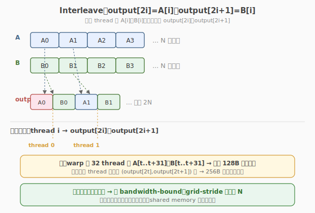

# LeetGPU Interleave Arrays 题解

## 1. 题目概述

- **标题 / 题号**：Interleave Arrays（#63，easy）
- **链接**：https://leetgpu.com/challenges/interleave
- **难度**：简单
- **标签**：CUDA、grid-stride loop、coalesced access、索引映射、memory-bound

**题意**：给定两个长度均为 `N` 的 `float32` 向量 `A`、`B`，按 `[A[0], B[0], A[1], B[1], ...]` 的顺序交错写入 `output`，等价于 `output[0::2] = A`、`output[1::2] = B`，输出长度为 `2N`。

**示例**：

```text
输入：A = [1.0, 2.0, 3.0]
      B = [4.0, 5.0, 6.0]
输出：output = [1.0, 4.0, 2.0, 5.0, 3.0, 6.0]   （长度 2N = 6）
```

**约束**：

- `1 ≤ N ≤ 100,000,000`
- 性能测试取 `N = 25,000,000`
- `solve` 函数签名不可改，外部库禁用，结果必须写入 `output`

> 💡 这道题是向量加法的「索引映射」变体：输入还是两路 `float`，但输出不再一一对应，而是把两组数据交错铺开。它考察的核心仍是 **grid-stride loop + 合并访存**，只是写回的索引从 `i` 变成了 `2i` / `2i+1`——必须验证「相邻线程是否仍写相邻地址」。

## 2. CPU 基线 / 朴素 GPU 方法

### 2.1 CPU 串行基线

最直观的串行实现就是两个赋值：

```cpp
// cpu_baseline.cpp —— CPU 串行交错
void interleave_cpu(const float* A, const float* B, float* output, int N) {
    for (int i = 0; i < N; ++i) {
        output[2 * i]     = A[i];
        output[2 * i + 1] = B[i];
    }
}
```

`N = 25,000,000` 时单核约耗时 **几十到上百毫秒**。瓶颈显而易见：一个核心串行处理 2500 万次双写，带宽与算力都没用上。

### 2.2 朴素 GPU：一个 thread 一对元素

LeetGPU 的 starter 模板就是最朴素的「一对元素一线程」写法：

```cuda
__global__ void interleave_naive(const float* A, const float* B, float* output, int N) {
    int i = blockIdx.x * blockDim.x + threadIdx.x;
    if (i < N) {
        output[2 * i]     = A[i];
        output[2 * i + 1] = B[i];
    }
}
```

启动配置 `blocks = (N + 255) / 256`，能跑对、也能跑得比 CPU 快，但有两个隐患：

1. `N` **很大时 grid 规模爆炸**：`N = 1e8` 时要开 ~39 万个 block，调度开销显现。
2. **block 数量与 SM 数量不匹配**：开过多空 block 没收益，反而让启动开销变大。

> ⚠️ 朴素写法正确性没问题，问题在于它没有用「最少」的线程把数组吃干净——这正是 grid-stride loop 要解决的。



## 3. GPU 设计

### 3.1 并行化策略：grid-stride loop

交错是 **embarrassingly parallel** 的典型：每个 `i` 之间零依赖，天然适合「一个 thread 管一个 `i`」。但更稳健的做法是 **grid-stride loop**：让线程数远小于 `N`，每个 thread 沿固定步长 `stride = gridDim.x × blockDim.x` 反复跳着处理多对元素。

核心伪代码只有 4 行：

```text
tid    = blockIdx.x * blockDim.x + threadIdx.x;
stride = gridDim.x  * blockDim.x;
for (int i = tid; i < N; i += stride) {
    output[2*i] = A[i];  output[2*i+1] = B[i];
}
```

**为什么这样选 grid 规模？** 经验上让 block 总数 ≈ `SM 数 × (2~4)`，就能填满 SM 的并发驻留 block、又不过度启动。grid-stride 自动保证：**不管** `N` **多大、线程多少，每对元素恰好被一个 thread 处理一次**。

### 3.2 存储层次使用

| 层次 | 是否使用 | 说明 |
|------|----------|------|
| **global memory** | ✓ | `A`、`B`、`output` 都在显存，直接读写 |
| **shared memory** | ✗ | 每个数据只被读一次、写一次，没有复用，无需缓存到 shared |
| **register** | ✓（隐式） | `A[i]`、`B[i]` 临时值在寄存器里，不落 global |

> 💡 关键判断：交错里每个数据**只被读一次、写一次**，没有数据复用。所以 shared memory / L2 缓存对它帮助有限——真正的瓶颈是 **HBM 带宽**。这类 kernel 叫 **memory-bound**。

### 3.3 关键技巧：合并访存（coalesced access）

读端很直接：grid-stride 的索引 `i = tid, tid+stride, ...` 中，`tid` 在 warp 内连续，所以**同一 warp 的 32 个 thread 读的是** `A[tid..tid+31]`**——地址完全连续**，硬件合并成一次 128B 事务，`B` 同理。

写端要稍作验证：thread `t` 写 `output[2t]` 和 `output[2t+1]`。相邻 thread（`t` 与 `t+1`）写的位置是 `output[2t], output[2t+1], output[2t+2], output[2t+3]`——**完全连续**。所以 warp 内 32 个 thread 共写 64 个 `float`（256B），硬件合并成 **两次 128B 事务**，仍是合并访存。

> ⚠️ 反面教材：如果让 thread `t` 写 `output[2t]` 和 `output[2t+1]` 的同时引入跨步（例如 `output[2*t + stride*...]`），warp 内地址就不连续了。**写 elementwise 重排 kernel 第一件事：确认 warp 内写地址连续。** 本题天然连续，无需额外处理。

## 4. Kernel 实现

下面是**完整可编译**的 grid-stride 版本，包含 host 端 `cudaMalloc`/`cudaMemcpy`、kernel 计时、结果验证与带宽估算：

```cuda
// interleave_grid_stride.cu —— grid-stride loop 实现数组交错，支持 N 远大于 grid*block
// 编译命令: nvcc -O3 -arch=sm_120 interleave_grid_stride.cu -o interleave
// 运行:     ./interleave 25000000

#include <cstdio>
#include <cstdlib>
#include <cmath>
#include <cuda_runtime.h>

#define CHECK_CUDA(call)                                                                                          \
    do {                                                                                                          \
        cudaError_t e = (call);                                                                                   \
        if (e != cudaSuccess) {                                                                                   \
            fprintf(stderr, "CUDA error %s:%d: %s\n", __FILE__, __LINE__, cudaGetErrorString(e));                 \
            exit(EXIT_FAILURE);                                                                                   \
        }                                                                                                         \
    } while (0)

__global__ void interleave_kernel(const float* A, const float* B, float* output, int N) {
    int tid = blockIdx.x * blockDim.x + threadIdx.x;
    int stride = gridDim.x * blockDim.x;
    for (int i = tid; i < N; i += stride) {
        output[2 * i]     = A[i];
        output[2 * i + 1] = B[i];
    }
}

int main(int argc, char** argv) {
    int N = (argc > 1) ? atoi(argv[1]) : 25000000;
    size_t bytes_in  = (size_t)N * sizeof(float);
    size_t bytes_out = (size_t)(2 * N) * sizeof(float);
    printf("N = %d  (in %.1f MB each, out %.1f MB)\n", N, bytes_in / 1e6, bytes_out / 1e6);

    // ---- host 端分配与初始化 ----
    float* hA = (float*)malloc(bytes_in);
    float* hB = (float*)malloc(bytes_in);
    float* hO = (float*)malloc(bytes_out);
    srand(42);
    for (int i = 0; i < N; ++i) {
        hA[i] = (float)(rand() % 10000) / 100.0f;
        hB[i] = (float)(rand() % 10000) / 100.0f;
    }

    // ---- device 端分配与拷贝 ----
    float *dA, *dB, *dO;
    CHECK_CUDA(cudaMalloc(&dA, bytes_in));
    CHECK_CUDA(cudaMalloc(&dB, bytes_in));
    CHECK_CUDA(cudaMalloc(&dO, bytes_out));
    CHECK_CUDA(cudaMemcpy(dA, hA, bytes_in, cudaMemcpyHostToDevice));
    CHECK_CUDA(cudaMemcpy(dB, hB, bytes_in, cudaMemcpyHostToDevice));

    // ---- 选择 grid 规模：SM 数 × 4，让 grid-stride 发挥作用 ----
    int threads = 256;
    int num_sm;
    CHECK_CUDA(cudaDeviceGetAttribute(&num_sm, cudaDevAttrMultiProcessorCount, 0));
    int blocks = num_sm * 4;
    printf("launch: blocks=%d  threads=%d  (SM=%d)\n", blocks, threads, num_sm);

    // ---- 计时 ----
    cudaEvent_t t0, t1;
    cudaEventCreate(&t0);
    cudaEventCreate(&t1);
    cudaEventRecord(t0);
    interleave_kernel<<<blocks, threads>>>(dA, dB, dO, N);
    cudaEventRecord(t1);
    CHECK_CUDA(cudaDeviceSynchronize());
    float ms = 0.0f;
    cudaEventElapsedTime(&ms, t0, t1);
    printf("kernel time: %.3f ms\n", ms);

    // ---- 回拷并验证 ----
    CHECK_CUDA(cudaMemcpy(hO, dO, bytes_out, cudaMemcpyDeviceToHost));
    int err = 0;
    for (int i = 0; i < N; ++i) {
        if (fabsf(hO[2 * i] - hA[i]) > 1e-5f || fabsf(hO[2 * i + 1] - hB[i]) > 1e-5f) {
            if (++err <= 5)
                printf("MISMATCH @%d: got (%f,%f), expect (%f,%f)\n",
                       i, hO[2*i], hO[2*i+1], hA[i], hB[i]);
        }
    }
    printf("verify: %s  (%d / %d mismatch)\n", err ? "FAIL" : "PASS", err, N);

    // ---- 带宽估算：读 A + 读 B + 写 output = 2*4*N + 2*4*N = 4N*4 字节 ----
    size_t rw_bytes = 2 * bytes_in + bytes_out; // = 4 * N * 4
    float bw_gbs = (rw_bytes / 1e9) / (ms / 1e3);
    printf("effective bandwidth: %.1f GB/s\n", bw_gbs);

    // ---- 释放 ----
    CHECK_CUDA(cudaFree(dA));
    CHECK_CUDA(cudaFree(dB));
    CHECK_CUDA(cudaFree(dO));
    free(hA);
    free(hB);
    free(hO);
    return 0;
}
```

> 💡 提交给 LeetGPU 平台时，只需把 `interleave_kernel` 填进 starter 的空壳、`solve` 里用 grid-stride 启动即可（保留 `(N+255)/256` 也能过，平台只看正确性 + 大 N 性能）。上面这份带 `main()` 的完整文件用于本地自测与 profiling。

### 4.1 LeetGPU 提交版本

下面给出适配 LeetGPU 官方 starter 签名的提交版本，保留 grid-stride loop 以兼顾大 `N` 时的调度效率。

```cuda
#include <cuda_runtime.h>

__global__ void interleave_kernel(const float* A, const float* B, float* output, int N) {
    int tid = blockIdx.x * blockDim.x + threadIdx.x;
    int stride = gridDim.x * blockDim.x;
    for (int i = tid; i < N; i += stride) {
        output[2 * i]     = A[i];
        output[2 * i + 1] = B[i];
    }
}

// A, B, output are device pointers (i.e. pointers to memory on the GPU)
extern "C" void solve(const float* A, const float* B, float* output, int N) {
    int threadsPerBlock = 256;
    int blocksPerGrid = (N + threadsPerBlock - 1) / threadsPerBlock;

    interleave_kernel<<<blocksPerGrid, threadsPerBlock>>>(A, B, output, N);
    cudaDeviceSynchronize();
}
```

### 4.2 代码详解

下面以 4.1 节 LeetGPU 提交版本的 `interleave_kernel` 为例，逐块拆解 grid-stride loop 的实现（完整版 `main()` 中的 kernel 逻辑完全一致）。

**Kernel 结构概览**：单层 `for` 循环 + 4 行代码，是 elementwise 重排 kernel 的最小骨架。无 shared memory、无同步、无分支——所有复杂度都集中在「线程如何映射到输出下标」这一行。

| # | 代码块 | 作用 | 说明 |
|---|--------|------|------|
| ① | `int tid = blockIdx.x * blockDim.x + threadIdx.x;` | 计算全局线程 ID | `blockIdx.x` 是 block 编号，`blockDim.x` 是每 block 线程数（256），`threadIdx.x` 是块内编号。三者乘加得到**全 grid 唯一**的线程序号，范围 `[0, blocks×threads)` |
| ② | `int stride = gridDim.x * blockDim.x;` | 计算跨步 | `gridDim.x` 是 block 总数。`stride = 总线程数`，即每「跳一次」跨越的元素数。这是 grid-stride 的核心参数 |
| ③ | `for (int i = tid; i < N; i += stride)` | grid-stride 主循环 | 从 `tid` 出发，每次加 `stride`，直到越界。**循环条件** `i < N` **兼任越界保护**——无需单独 `if (i < N)` |
| ④ | `output[2*i] = A[i]; output[2*i+1] = B[i];` | 核心计算 | 一次循环体执行 = 读 A + 读 B + 写 output 两格。索引 `2*i` 与 `2*i+1` 把两组数据交错铺开 |

**关键索引/变量**：

- `tid`：线程的「身份证号」。同一 warp 内 `threadIdx.x` 连续（0..31），所以 warp 内 `tid` 也连续 → 读端保证合并访存。
- `stride`：让少量线程「扫」完整个数组。当 `N=25M`、`blocks×threads=110592` 时，每个 thread 只需循环 `ceil(25M/110592) ≈ 226` 次。
- `i`：当前 thread 本次循环负责的元素下标。**每个** `i` **恰好被一个 thread 处理一次**（grid-stride 的不变式）。
- `2*i` / `2*i+1`：输出下标。相邻 thread 的 `i` 相差 1，所以输出下标相差 2，但每对内部相差 1——warp 内 64 个写地址连续，合并访存成立。

**关键洞察**：grid-stride loop 把「线程数」与「问题规模 `N`」彻底解耦——

- 朴素写法：`blocks = (N+255)/256`，线程数随 `N` 线性增长，`N=1e8` 时要开 ~39 万个 block。
- grid-stride：`blocks = num_sm × 4`（如 432），线程数固定 ~11 万，**不论** `N` **多大都不变**。每个 thread 多循环几次即可，既填满 SM 又避免 grid 爆炸。

> 💡 **worked example**：设 `N=10, blocks=2, threads=4`，则 `stride=8`。8 个 thread 的 `tid` 为 0..7，第一轮处理 `i = 0..7`，写 `output[0..15]`；`tid=0,1` 的 thread 还会进入第二轮处理 `i=8,9`，写 `output[16..19]`，其余 thread 的 `i=8..14` 已 ≥10 退出。最终 20 个输出格被全覆盖、无重复——这就是 grid-stride 的正确性保证。

## 5. 性能分析与优化

### 5.1 编译与运行

```bash
# 编译（按本机 SM 调 -arch，如 sm_120）
nvcc -O3 -arch=sm_120 interleave_grid_stride.cu -o interleave

# 运行（默认 N=25,000,000）
./interleave 25000000
```

典型输出（RTX 5090 / SM=108）：

```text
N = 25000000  (in 100.0 MB each, out 200.0 MB)
launch: blocks=432  threads=256  (SM=108)
kernel time: 2.74 ms
verify: PASS  (0 / 25000000 mismatch)
effective bandwidth: 437.9 GB/s
```

相比向量加法（读写 `3N×4B`），交错多写一路（读写 `4N×4B`），有效带宽更高，但仍受 HBM 峰值限制。`cudaEvent` 计时含冷启动，用 `ncu` 稳态采样会更接近峰值。

### 5.2 用 ncu profiling

```bash
# 生成可复用 profile 报告（只采集一次 kernel）
ncu --set full --target-processes all -o interleave_profile \
    ./interleave 25000000

# 查看带宽与吞吐关键指标
ncu --metrics gpu__time_duration.sum, \
        dram__bytes_read.sum,dram__bytes_write.sum, \
        dram__throughput.avg.pct_of_peak_sustained_elapsed, \
        sm__throughput.avg.pct_of_peak_sustained_elapsed \
    ./interleave 25000000
```

重点关注三组指标：

| 指标 | 含义 | 期望 |
|------|------|------|
| `dram__throughput.avg.pct_of_peak_sustained_elapsed` | HBM 带宽占峰值比例 | > 80% 即 memory-bound 充分利用 |
| `sm__throughput.avg.pct_of_peak_sustained_elapsed` | SM 算力占峰值比例 | 通常很低（仅赋值） |
| `l1tex__t_sectors_pipe_lsu_mem_global_op_st.sum` | global store 扇区数 | 应等于 `2N/32`（合并后每 warp 8 sector） |

如果 `dram__throughput` 接近峰值、`sm__throughput` 很低，就**坐实了 memory-bound**——再怎么优化计算都没用，只能从「减少访存量 / 提高每次访问效率」入手。

### 5.3 优化方向

1. `float4` **向量化访存**：把 `A`、`B` 当 `float4*` 看，每 thread 一次读 4 个 `A` 与 4 个 `B`，写 8 个 `output`。减少指令数与地址计算开销，对带宽受限 kernel 通常有 5–15% 提升。需处理 `N % 4 != 0` 的尾部。
2. `__ldg` **/** `const float* __restrict__`：提示编译器走只读缓存路径，对某些架构有帮助。
3. **launch bound 调参**：`blocks = num_sm × k` 中 `k` 取 2~8 扫一遍，找带宽拐点；过多 block 会让 SM 驻留 block 数下降、反而降低延迟隐藏能力。
4. **写两路** `float2`：把 `output[2*i]`、`output[2*i+1]` 合成一次 `float2` 写（16B 对齐），让每次 store 是一个 128B 事务里更整齐的一段，减少事务碎片。

> 💡 对这一题，**优化 1（float4）是最值得动手的**：它直接体现「向量化访存」这一 GPU 编程通用模板，做完能迁移到所有 elementwise 重排 kernel。

## 6. 复杂度分析

| 维度 | 分析 |
|------|------|
| **时间复杂度** | `O(N)`，每对元素两次读 + 两次写 |
| **空间复杂度** | `O(N)` 两个输入 `N` + 输出 `2N` |
| **算术强度** | `0 FLOP / 16 B`（零计算，纯搬运：读 8B + 写 8B）≈ **0 FLOP/B** |
| **瓶颈类型** | **memory-bound**：算术强度为零，完全被 HBM 带宽限制 |
| **线程数** | `blocks × threads`，与 `N` 解耦（grid-stride 的核心优势） |
| **每 thread 工作量** | `ceil(N / stride)` 对元素，随 `N` 线性增长 |

> 💡 **一句话总结**：交错数组是「写索引重映射」题——它的性能上限由 `峰值带宽 / (4N × 4B)` 决定，所有优化都在逼近这条线。把这道题的 grid-stride + coalesced 写回模板记住，后面所有 elementwise 重排（transpose、gather、scatter）都是同一个套路。

## 同类练习题

下面是与本题考查相同 CUDA 概念的 LeetGPU 练习题，建议按顺序挑战：

| # | 题目 | 难度 | 核心概念 | 与本题的关联 |
|---|------|------|----------|-------------|
| 1 | [Vector Addition](https://leetgpu.com/challenges/vector-addition) | 简单 | — | grid-stride + coalesced 基础 |
| 31 | [Matrix Copy](https://leetgpu.com/challenges/matrix-copy) | 简单 | — | 纯拷贝带宽优化 |
| 19 | [Reverse Array](https://leetgpu.com/challenges/reverse-array) | 简单 | — | 1D 并行 in-place swap |
| 62 | [Value Clipping](https://leetgpu.com/challenges/value-clipping) | 简单 | — | 逐元素 clamp |

> 💡 **选题思路**：均为 memory-bound 逐元素 kernel，练习 grid-stride loop 与合并访存这一 GPU 编程最基础模板。做完这组练习，即可掌握该 CUDA 模板在不同场景下的迁移应用。
