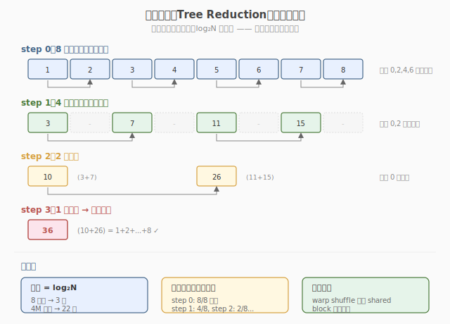
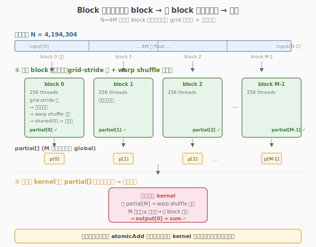

# LeetGPU Reduction 题解

## 1. 题目概述

- **标题 / 题号**：Reduction（#4，medium）
- **链接**：https://leetgpu.com/challenges/reduction
- **难度**：中等
- **标签**：CUDA、warp shuffle、归约、memory-bound、`__shfl_down_sync`

**题意**：给定长度为 `N` 的 `float32` 数组 `input`，计算所有元素的和 `sum = input[0] + input[1] + ... + input[N-1]`。

**示例**：

```text
输入：[1.0, 2.0, 3.0, 4.0, 5.0]
输出：15.0
```

**约束**：`1 ≤ N ≤ 10,000,000`；性能测试取大数组。

> 💡 这道题是 **warp shuffle 归约的经典练习**——`__shfl_down_sync` 把 warp 内 32 个 lane 的值逐级归约到 lane 0。与 [Week7 Day6 全链路 Profiling](../../../aiinfra/daily/week7/day6/README.md) 的关联在于：Reduction 是 profiling 中最常分析的 memory-bound kernel，LayerNorm（求 mean/var）和 Softmax（求 max/sum）内部都包含 reduction。理解它的性能特征是分析这些 kernel 瓶颈的基础。

## 2. GPU 设计

两阶段归约：block 归约 → final 归约。warp 内用 `__shfl_down_sync`（无 bank conflict），warp 间用 shared memory（需 padding 避免 bank conflict）。

**树形归约总览**（逐层把元素配对相加，直到只剩一个总和）：



**两阶段流程**（每个 block 产出一个部分和，再由 final kernel 聚合）：



## 3. Kernel 实现

下面给出可直接提交到 LeetGPU 的 warp shuffle 两阶段归约实现。

**warp shuffle 归约原理**：`__shfl_down_sync` 让高位 lane 的值"下移"到低位 lane 并累加，5 步内把 32 个 lane 归约到 lane 0，全程在寄存器内完成、无需 `__syncthreads`。


### 3.1 LeetGPU 提交版本

```cuda
// reduction.cu —— Warp shuffle 两阶段归约
#include <cuda_runtime.h>

#define BLOCK_SIZE 256
#define WARP_SIZE 32

__inline__ __device__ float warp_reduce(float val) {
    for (int offset = WARP_SIZE / 2; offset > 0; offset >>= 1)
        val += __shfl_down_sync(0xffffffff, val, offset);
    return val;
}

__global__ void reduce_kernel(const float* input, float* output, int N) {
    __shared__ float warp_sums[BLOCK_SIZE / WARP_SIZE];
    int tid = threadIdx.x;
    int gid = blockIdx.x * BLOCK_SIZE + tid;
    int warp_id = tid / WARP_SIZE;
    int lane = tid % WARP_SIZE;

    float val = (gid < N) ? input[gid] : 0.0f;
    val = warp_reduce(val);
    if (lane == 0)
        warp_sums[warp_id] = val;
    __syncthreads();

    if (warp_id == 0) {
        val = (lane < BLOCK_SIZE / WARP_SIZE) ? warp_sums[lane] : 0.0f;
        val = warp_reduce(val);
        if (lane == 0)
            output[blockIdx.x] = val;
    }
}

__global__ void final_reduce(const float* input, float* output, int N) {
    __shared__ float warp_sums[BLOCK_SIZE / WARP_SIZE];
    int tid = threadIdx.x;
    float val = (tid < N) ? input[tid] : 0.0f;
    val = warp_reduce(val);
    if (tid % WARP_SIZE == 0)
        warp_sums[tid / WARP_SIZE] = val;
    __syncthreads();
    if (tid < WARP_SIZE) {
        val = (tid < BLOCK_SIZE / WARP_SIZE) ? warp_sums[tid] : 0.0f;
        val = warp_reduce(val);
        if (tid == 0)
            output[0] = val;
    }
}

extern "C" void solve(const float* input, float* output, int N) {
    int gridSize = (N + BLOCK_SIZE - 1) / BLOCK_SIZE;
    reduce_kernel<<<gridSize, BLOCK_SIZE>>>(input, output, N);
    final_reduce<<<1, BLOCK_SIZE>>>(output, output, gridSize);
}
```

### 3.2 代码详解

#### `warp_reduce`：warp 内 32 lane 归约

```cuda
for (int offset = WARP_SIZE / 2; offset > 0; offset >>= 1)
    val += __shfl_down_sync(0xffffffff, val, offset);
```

`__shfl_down_sync(mask, val, offset)` 让 lane `i` 取回 lane `i+offset` 的 `val`（高位的值"下移"），并与自身相加。`0xffffffff` 是活跃掩码，表示 warp 内 32 个 lane 全部参与。循环 5 步，`offset` 依次为 16→8→4→2→1：

| 步骤 | offset | lane i 执行 | 之后持有有效和的 lane |
|------|--------|-------------|----------------------|
| 1 | 16 | `val[i] += val[i+16]` | lane 0–15（各含 2 个元素和）|
| 2 | 8  | `val[i] += val[i+8]`  | lane 0–7（各含 4 个元素和）|
| 3 | 4  | `val[i] += val[i+4]`  | lane 0–3（各含 8 个元素和）|
| 4 | 2  | `val[i] += val[i+2]`  | lane 0–1（各含 16 个元素和）|
| 5 | 1  | `val[i] += val[i+1]`  | lane 0（含 32 个元素和）|

5 步后 **lane 0** 持有整个 warp 32 个值的和，其余 lane 的值是中间结果（不再使用）。整个过程在寄存器内完成，**不访问 shared memory，也不需要** `__syncthreads`——warp 内指令是 SIMT 同步执行的。

#### `reduce_kernel`：单 block 归约（两阶段结构）

每个 block 处理 `BLOCK_SIZE`(=256) 个元素，分两个阶段：

**阶段 A — warp 内归约（8 个 warp 并行）**

```cuda
float val = (gid < N) ? input[gid] : 0.0f;   // 每线程加载 1 个元素
val = warp_reduce(val);                        // warp 内 32 lane 归约，lane 0 持有该 warp 的和
if (lane == 0)
    warp_sums[warp_id] = val;                  // 8 个 warp 的部分和写入 shared memory
```

256 个线程 = 8 个 warp。阶段 A 结束后，`warp_sums[0..7]` 存放 8 个 warp 各自的部分和。

`__syncthreads()` **的作用**

```cuda
__syncthreads();
```

阶段 A 中只有每个 warp 的 lane 0 写了 `warp_sums`，阶段 B 由第一个 warp 读取 `warp_sums`。`__syncthreads()` 保证所有 warp 都完成写入后，第一个 warp 才开始读——否则会读到未初始化的数据。这是 **warp 间同步的必要屏障**（warp 内的 `warp_reduce` 不需要它，因为 warp 内天然同步）。

**阶段 B — warp 间归约（由第一个 warp 完成）**

```cuda
if (warp_id == 0) {
    val = (lane < BLOCK_SIZE / WARP_SIZE) ? warp_sums[lane] : 0.0f;  // 前 8 个 lane 各取一个部分和
    val = warp_reduce(val);                                            // 再次 warp 归约
    if (lane == 0)
        output[blockIdx.x] = val;                                      // block 的总和写入 output
}
```

只有第一个 warp（32 个线程）执行：前 8 个 lane 各加载一个 `warp_sums`，再做一次 `warp_reduce`，lane 0 得到整个 block 256 个元素的总和，写入 `output[blockIdx.x]`。

#### `final_reduce`：聚合所有 block 的部分和

`reduce_kernel` 输出了 `numBlocks` 个部分和到 `output[0..numBlocks-1]`。`final_reduce` 用**单个 block** 对这些部分和再做一次归约，得到全局总和：

```cuda
final_reduce<<<1, BLOCK_SIZE>>>(output, output, gridSize);
```

结构与 `reduce_kernel` 完全一致（warp 归约 → shared memory → 最终 warp 归约），区别只是输入是 `numBlocks` 个部分和（而非原始 `N` 个元素），结果写到 `output[0]`。由于 `numBlocks` 通常远小于 `BLOCK_SIZE`，大部分线程加载 0（`(tid < N) ? ... : 0.0f`），不影响结果。

#### 关键变量速查

| 变量 | 定义 | 含义 |
|------|------|------|
| `tid` | `threadIdx.x` | block 内线程索引，范围 `[0, BLOCK_SIZE)` |
| `gid` | `blockIdx.x * BLOCK_SIZE + tid` | 全局线程索引，对应 `input` 数组下标 |
| `warp_id` | `tid / WARP_SIZE` | block 内的 warp 编号，范围 `[0, BLOCK_SIZE/WARP_SIZE)` |
| `lane` | `tid % WARP_SIZE` | warp 内的 lane 编号，范围 `[0, WARP_SIZE)` |
| `warp_sums` | `__shared__` 数组 | 存放各 warp 的部分和，大小 = warp 数 |
| `offset` | `WARP_SIZE/2 → 1` | `__shfl_down_sync` 的下移距离，每步减半 |

#### 完整示例：`BLOCK_SIZE=256`，8 个 warp，`N=1024`

设 `input = [1, 1, ..., 1]`（1024 个 1，期望和为 1024）。

1. **gridSize** = `(1024 + 256 - 1) / 256 = 4` 个 block。
2. `reduce_kernel`**（每个 block，互不相关地各算 256 个元素）**：
   - 256 个线程各加载 1 个元素（值为 1）。
   - 8 个 warp 各自 `warp_reduce`：每个 warp 的 32 个 1 → lane 0 得到 32。
   - `warp_sums = [32, 32, 32, 32, 32, 32, 32, 32]`，`__syncthreads()`。
   - 第一个 warp：前 8 个 lane 加载 `[32,...,32]`，`warp_reduce` → lane 0 得到 `32×8 = 256`。
   - `output[blockIdx.x] = 256`。4 个 block 各写入 256 → `output = [256, 256, 256, 256]`。
3. `final_reduce`**（1 个 block，输入 4 个部分和）**：
   - 前 4 个线程加载 `[256, 256, 256, 256]`，其余线程加载 0。
   - `warp_reduce`：lane 0 得到 `256×4 = 1024`。
   - `output[0] = 1024`。✓

## 4. 复杂度分析

| 维度 | 分析 |
|------|------|
| 时间复杂度 | `O(N)`，两阶段归约 |
| 空间复杂度 | `O(N)` 输入 + `O(numBlocks)` 中间 + `O(BLOCK_SIZE)` shared |
| 算术强度 | `0.25 FLOP/B`（1 次加法 / 4B 读取） |
| 瓶颈类型 | **memory-bound**：受 HBM 读带宽限制 |
| kernel 启动数 | 2 次（block 归约 + final 归约） |

## 同类练习题

下面是与本题考查相同 CUDA 概念的 LeetGPU 练习题，建议按顺序挑战：

| # | 题目 | 难度 | 核心概念 | 与本题的关联 |
|---|------|------|----------|-------------|
| 17 | [Dot Product](https://leetgpu.com/challenges/dot-product) | 中等 | — | 元素乘 + 全局归约，归约的直接应用 |
| 43 | [Count Array Element](https://leetgpu.com/challenges/count-array-element) | 中等 | — | 计数归约 + atomic，对比归约与 atomic |
| 27 | [Mean Squared Error](https://leetgpu.com/challenges/mean-squared-error) | 中等 | — | 平方差归约，归约在损失函数中的应用 |
| 51 | [Max Subarray Sum](https://leetgpu.com/challenges/max-subarray-sum) | 中等 | — | scan + 归约的综练习 |

> 💡 **选题思路**：树形归约 + warp shuffle，练习并行归约这一核心模板。做完这组练习，即可掌握该 CUDA 模板在不同场景下的迁移应用。
