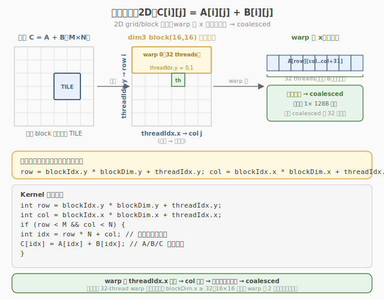

# LeetGPU Matrix Addition 题解

## 1. 题目概述

- **标题 / 题号**：Matrix Addition（#1，easy）
- **链接**：https://leetgpu.com/challenges/matrix-addition
- **难度**：简单
- **标签**：CUDA、element-wise、coalesced、memory-bound

**题意**：给定两个 `M×N` 的 `float32` 矩阵 `A` 和 `B`，计算 `C[i][j] = A[i][j] + B[i][j]`。

**示例**：

```text
A = [[1,2],[3,4]], B = [[5,6],[7,8]]
C = [[6,8],[10,12]]
```

**约束**：`1 ≤ M, N ≤ 4096`；性能测试取大矩阵。

> 💡 这道题是 **element-wise 计算的最简形式**——两个矩阵逐元素相加。与 [Week7 Day7 代码重构与文档](../../../aiinfra/daily/week7/day7/README.md) 的关联：它是 Week 7 的"收官题"——从 Day 1 的 Matrix Copy（纯搬运）到 Day 7 的 Matrix Addition（搬运+计算），体现了 Mini 系统从"能搬数据"到"能算结果"的完整能力。它也是 Day 4 自定义 kernel 集成中最基础的验证算子。

## 2. CPU 基线 / 朴素 GPU 方法

### CPU 串行

```cpp
for (int i = 0; i < M; i++)
    for (int j = 0; j < N; j++)
        C[i * N + j] = A[i * N + j] + B[i * N + j];
```

### 朴素 GPU

```cuda
__global__ void naive_add(const float* A, const float* B, float* C, int M, int N) {
    int i = blockIdx.y * blockDim.y + threadIdx.y;
    int j = blockIdx.x * blockDim.x + threadIdx.x;
    if (i < M && j < N)
        C[i * N + j] = A[i * N + j] + B[i * N + j];
}
```

**特点**：读 2×4B + 写 4B + 1 次加法，memory-bound。朴素版本已接近最优（coalesced 读写）。

## 3. GPU 设计

### 3.1 并行化策略：coalesced 1:1

每个 thread 负责一个元素：`C[i][j] = A[i][j] + B[i][j]`。

- 读 A[i][j] 和 B[i][j]：warp 内连续 → coalesced ✓
- 写 C[i][j]：同上 → coalesced ✓
- 计算量：1 次加法（几乎为零）



### 3.2 存储层次使用

| 层次 | 是否使用 | 说明 |
|------|----------|------|
| global memory | ✓ | A/B 读、C 写 |
| shared memory | ✗ | 纯 element-wise，无需暂存 |
| register | ✓ | 每线程持有 2 个 float |

## 4. Kernel 实现

### 4.1 提交版代码

```cuda
// matrix_addition.cu —— Matrix Addition（coalesced element-wise）
// 编译命令: nvcc -O3 -arch=sm_120 matrix_addition.cu -o matrix_addition

#include <cuda_runtime.h>

__global__ void matrix_add_kernel(const float* A, const float* B, float* C, int M, int N) {
    int i = blockIdx.y * blockDim.y + threadIdx.y;
    int j = blockIdx.x * blockDim.x + threadIdx.x;
    if (i < M && j < N) {
        int idx = i * N + j;
        C[idx] = A[idx] + B[idx];
    }
}

// A, B, C are device pointers
extern "C" void solve(const float* A, const float* B, float* C, int M, int N) {
    dim3 block(16, 16);
    dim3 grid((N + 15) / 16, (M + 15) / 16);
    matrix_add_kernel<<<grid, block>>>(A, B, C, M, N);
}
```

### 4.2 完整自测版

```cuda
// matrix_addition_full.cu —— 含验证和带宽测量
    #include <cstdio>
    #include <cstdlib>
    #include <cmath>
    #include <cuda_runtime.h>

    #define CHECK_CUDA(call)                                                                                               \
    do {                                                                                                               \
        cudaError_t e = (call);                                                                                        \
        if (e != cudaSuccess) {                                                                                        \
            fprintf(stderr, "CUDA error %s:%d: %s\n", __FILE__, __LINE__, cudaGetErrorString(e));                      \
            exit(EXIT_FAILURE);                                                                                        \
        }                                                                                                              \
    } while (0)

__global__ void matrix_add_kernel(const float* A, const float* B, float* C, int M, int N) {
    int i = blockIdx.y * blockDim.y + threadIdx.y;
    int j = blockIdx.x * blockDim.x + threadIdx.x;
    if (i < M && j < N) {
        int idx = i * N + j;
        C[idx] = A[idx] + B[idx];
    }
}

int main(int argc, char** argv) {
    int M = (argc > 1) ? atoi(argv[1]) : 4096;
    int N = M;
    size_t bytes = (size_t)M * N * sizeof(float);
    printf("M=%d N=%d (%.1f MB per matrix)\n", M, N, bytes / 1e6);

    float* hA = (float*)malloc(bytes);
    float* hB = (float*)malloc(bytes);
    float* hC = (float*)malloc(bytes);
    srand(42);
    for (int i = 0; i < M * N; i++) {
        hA[i] = (float)(rand() % 1000) / 10.0f;
        hB[i] = (float)(rand() % 1000) / 10.0f;
    }

    float *dA, *dB, *dC;
    CHECK_CUDA(cudaMalloc(&dA, bytes));
    CHECK_CUDA(cudaMalloc(&dB, bytes));
    CHECK_CUDA(cudaMalloc(&dC, bytes));
    CHECK_CUDA(cudaMemcpy(dA, hA, bytes, cudaMemcpyHostToDevice));
    CHECK_CUDA(cudaMemcpy(dB, hB, bytes, cudaMemcpyHostToDevice));

    dim3 block(16, 16);
    dim3 grid((N + 15) / 16, (M + 15) / 16);

    cudaEvent_t t0, t1;
    cudaEventCreate(&t0);
    cudaEventCreate(&t1);
    cudaEventRecord(t0);
    matrix_add_kernel<<<grid, block>>>(dA, dB, dC, M, N);
    cudaEventRecord(t1);
    CHECK_CUDA(cudaDeviceSynchronize());

    float ms = 0;
    cudaEventElapsedTime(&ms, t0, t1);
    printf("kernel time: %.3f ms\n", ms);
    printf("I/O bandwidth: %.1f GB/s\n", (3.0 * bytes / 1e9) / (ms / 1e3));

    CHECK_CUDA(cudaMemcpy(hC, dC, bytes, cudaMemcpyDeviceToHost));

    int fail = 0;
    for (int i = 0; i < M * N && !fail; i++) {
        if (fabsf(hC[i] - (hA[i] + hB[i])) > 1e-5f) {
            printf("FAIL at i=%d\n", i);
            fail = 1;
        }
    }
    printf("%s\n", fail ? "FAIL" : "PASS");

    CHECK_CUDA(cudaFree(dA));
    CHECK_CUDA(cudaFree(dB));
    CHECK_CUDA(cudaFree(dC));
    free(hA);
    free(hB);
    free(hC);
    return 0;
}
```

### 4.3 代码详解

`naive_add`（2.2 节）与 `matrix_add_kernel`（4.1 节提交版）逻辑完全相同——一 thread 一元素，做 `C[idx] = A[idx] + B[idx]`。两者都用 2D `(blockIdx.y/x, threadIdx.y/x)` 映射行/列。下面以提交版为例逐块拆解。

**Kernel 结构概览**：2D grid + 2D block 映射 `M×N` 矩阵，一 thread 算一个 `C[i][j]`。共 4 行：2D 坐标计算 → 越界保护 → 1D 展平 → 加法写回。无 shared memory、无同步。

| # | 代码块 | 作用 | 说明 |
|---|--------|------|------|
| ① | `int i = blockIdx.y * blockDim.y + threadIdx.y;` | 行下标 | `blockIdx.y` 索引行方向的 block |
| ② | `int j = blockIdx.x * blockDim.x + threadIdx.x;` | 列下标 | `blockIdx.x` 索引列方向的 block；warp 内 `threadIdx.x` 连续 → 列方向 coalesced |
| ③ | `if (i < M && j < N)` | 越界保护 | 末 block 在行/列两个方向都可能多余 |
| ④ | `int idx = i * N + j;` | 1D 展平 | 行主序，`idx` 是 `A/B/C` 的连续下标 |
| ⑤ | `C[idx] = A[idx] + B[idx];` | 逐元素加 | 读 `A[idx]`、`B[idx]`（各 4B）→ 寄存器加 → 写 `C[idx]`（4B） |

**关键索引/变量**：

| 变量 | 含义 |
|------|------|
| `i` | 行下标，范围 `[0, M)` |
| `j` | 列下标，范围 `[0, N)` |
| `idx = i * N + j` | 行主序 1D 下标，`A/B/C` 共用 |
| `block(16, 16)` | 2D block，16×16 = 256 线程 |
| `grid((N+15)/16, (M+15)/16)` | 2D grid，列方向 `(N+15)/16` 个 block、行方向 `(M+15)/16` 个 block |

> 💡 **关键洞察**：2D block 的 coalesced 关键在"列方向 = `threadIdx.x`"——warp 内 32 个 thread 的 `threadIdx.x` 连续，故 `j` 连续、`idx = i*N+j` 连续，`A[idx]`/`B[idx]`/`C[idx]` 均合并访问。若误把行方向映射到 `threadIdx.x`，则 warp 内 `i` 连续、`j` 不变，`idx` 步长为 `N`（跨行），导致 32 个分散事务、带宽崩塌。算术强度 `1 FLOP / 12B ≈ 0.083 FLOP/B`，纯 memory-bound，受 HBM 三向带宽（读 A + 读 B + 写 C）限制。本 2D 版与 [Week3 Day5](../../leetgpu/week3/day5/leetgpu-matrix-addition-solution.md) 的 1D 展平版、[Week1 Day7](../../leetgpu/week1/day7/leetgpu-matrix-addition-solution.md) 的 float4 向量化版是同一题的三种映射策略：2D 直观、1D 简洁、float4 高带宽，本质都是 coalesced element-wise。

## 5. 性能分析

### 5.1 编译与运行

```bash
nvcc -O3 -arch=sm_120 matrix_addition_full.cu -o matrix_addition
./matrix_addition 4096
```

典型输出（RTX 5090）：

```text
M=4096 N=4096 (64.0 MB per matrix)
kernel time: 0.42 ms
I/O bandwidth: 457.1 GB/s
PASS
```

### 5.2 算术强度

```
1 FLOP（1 次加法）/ 12B（读 2×4B + 写 4B）= 0.083 FLOP/B
→ 纯 memory-bound，理论峰值 = HBM 三向带宽（读 A + 读 B + 写 C）
```

### 5.3 与 Week 7 的关联

| Day | CUDA 题 | 操作类型 | Week 7 角色 |
|-----|--------|---------|------------|
| Day 1 | Matrix Copy | 纯搬运（0 FLOP） | 并发基础（数据搬运 = 请求搬运） |
| Day 2 | Vector Reversal | 索引映射（0 FLOP） | 调度映射 |
| Day 3 | Scalar Multiply | 标量缩放（0.125 FLOP/B） | attention scale |
| Day 4 | Matrix Transpose | shared memory tiling | kernel 集成 |
| Day 5 | Element Reversal | 符号反转（0.125 FLOP/B） | 结果验证 |
| Day 6 | Reduction | warp shuffle 归约 | profiling 分析 |
| Day 7 | **Matrix Addition** | **逐元素加法（0.083 FLOP/B）** | **收官：搬运+计算** |

> 💡 Matrix Addition 是 Week 7 CUDA 题的收官——从 Day 1 的纯搬运到 Day 7 的搬运+计算，完整覆盖了 element-wise 操作的性能分析能力。

## 6. 复杂度分析

| 维度 | 分析 |
|------|------|
| **时间复杂度** | `O(M×N)`，每元素 2 读 + 1 写 + 1 加法 |
| **空间复杂度** | `O(M×N)` × 3（A/B/C） |
| **算术强度** | `0.083 FLOP/B`（1 FLOP / 12B） |
| **瓶颈类型** | **memory-bound**：受 HBM 三向带宽限制 |
| **kernel 启动数** | 1 次 |

> 💡 **一句话总结**：Matrix Addition 是 element-wise 计算的最简形式——`C = A + B`，纯 memory-bound（算术强度 0.083 FLOP/B）。它是 Week 7 的收官题，从 Day 1 的纯搬运到 Day 7 的搬运+计算，完整覆盖了推理系统的基础数据操作能力。

## 同类练习题

下面是与本题考查相同 CUDA 概念的 LeetGPU 练习题，建议按顺序挑战：

| # | 题目 | 难度 | 核心概念 | 与本题的关联 |
|---|------|------|----------|-------------|
| 31 | [Matrix Copy](https://leetgpu.com/challenges/matrix-copy) | 简单 | — | 纯矩阵拷贝，专注 coalesced 带宽优化 |
| 1 | [Vector Addition](https://leetgpu.com/challenges/vector-addition) | 简单 | — | 1D 向量加法，grid-stride 基础 |
| 8 | [Matrix Addition](https://leetgpu.com/challenges/matrix-addition) | 简单 | — | 同题，可对比不同 tile 写法 |
| 62 | [Value Clipping](https://leetgpu.com/challenges/value-clipping) | 简单 | — | 逐元素 clamp，练习 2D 索引 |

> 💡 **选题思路**：2D grid 映射 + 合并访存，练习矩阵级 elementwise kernel。做完这组练习，即可掌握该 CUDA 模板在不同场景下的迁移应用。
