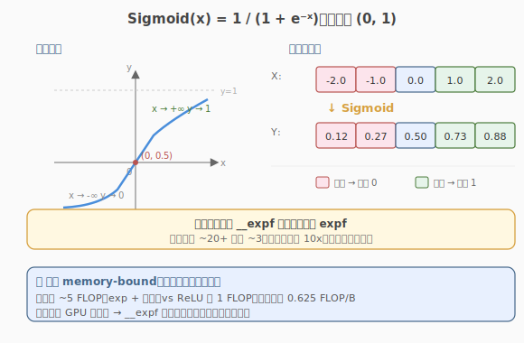

# LeetGPU Sigmoid 题解

## 1. 题目概述

- **标题 / 题号**：Sigmoid Activation（#68，easy）
- **链接**：https://leetgpu.com/challenges/sigmoid
- **难度**：简单
- **标签**：CUDA、elementwise kernel、fast math、`__expf`、memory-bound、activation

**题意**：对一个长度为 `N` 的 `float32` 向量 `X` 逐元素施加 Sigmoid 激活函数，结果写入 `Y`：

$$\text{Sigmoid}(x) = \frac{1}{1 + e^{-x}}$$

Sigmoid 把任意实数压缩到 `(0, 1)` 区间，曾是深度学习最常用的激活函数，现多用于二分类输出头与门控机制（如 attention 的 gate、SwiGLU 的 SiLU 组件）。

**示例**：

```text
输入：X = [-2.0, -1.0, 0.0, 1.0, 2.0]
输出：Y = [0.1192, 0.2689, 0.5000, 0.7311, 0.8808]
```

**约束**：

- `1 ≤ N ≤ 100,000,000`
- 性能测试取 `N = 50,000,000`
- `solve` 函数签名不可改，外部库禁用，结果必须写入 `Y`

> 💡 Sigmoid 与 ReLU 同为 elementwise + memory-bound，骨架完全一致。新增考点是——`exp` **是个"重"函数**，标准 `expf` 有几十条指令，而 `__expf` 快速数学版本只需几条。这是 fast math 在 elementwise kernel 里的典型应用。

## 2. CPU 基线 / 朴素 GPU 方法

### 2.1 CPU 串行基线

```cpp
// cpu_baseline.cpp —— CPU 串行 Sigmoid
#include <cmath>
void sigmoid_cpu(const float* X, float* Y, int N) {
    for (int i = 0; i < N; ++i) {
        Y[i] = 1.0f / (1.0f + expf(-X[i]));
    }
}
```

`N = 50,000,000` 时单核上百毫秒，瓶颈：**串行处理 + 标准库** `expf` **计算开销大**。

### 2.2 朴素 GPU：一元素一线程 + `expf`

照搬 ReLU 的「一元素一线程」骨架，把 Sigmoid 写成朴素公式：

```cuda
__global__ void sigmoid_naive(const float* X, float* Y, int N) {
    int i = blockIdx.x * blockDim.x + threadIdx.x;
    if (i < N) {
        Y[i] = 1.0f / (1.0f + expf(-X[i]));
    }
}
```

**瓶颈**：① 用标准 `expf`（每个 ~20+ 条指令）而非 `__expf`（~3 条）② 不支持 `N > grid` 容量时一次覆盖（无 grid-stride）。算式本身已 coalesced，但计算开销远高于 ReLU 的单条 `fmaxf`。



## 3. GPU 设计

### 3.1 并行化策略：grid-stride + fast math

核心策略与 ReLU 一致：1 thread 处理 1 个元素，grid-stride loop 覆盖所有 `N`。差异在运算式——Sigmoid 含 `exp`，**计算开销显著高于 ReLU**，因此 `__expf` 快速数学成为主要优化点。

> 💡 `expf` vs `__expf` 的区别：`expf` 是 C 标准库函数，保证精度（ULP 误差 < 1）；`__expf` 是 CUDA 内置快速数学，精度略降（最大误差 ~2 ULP）但速度快约 10x。对激活函数这种"误差不累积"的场景，`__expf` 完全够用。

### 3.2 存储层次使用

| 层次 | 是否使用 | 说明 |
|------|----------|------|
| **global memory** | ✓ | `X` 读、`Y` 写，都在显存 |
| **shared memory** | ✗ | 每元素只读一次、写一次，无复用 |
| **register** | ✓（隐式） | `x`、`exp(-x)`、`1+exp(-x)` 等中间值存寄存器 |

访存量与 ReLU 相同：`2N × 4B = 8N` 字节。但算术强度更高（`exp` 约 3 FLOP + 除法 + 加法 ≈ 5 FLOP / 8B = 0.625 FLOP/B），仍远低于 GPU 平衡点 → 依然 memory-bound，但计算开销占比上升。

### 3.3 关键技巧：`__expf` 快速数学

#### `expf` 与 `__expf` 的差异

CUDA 提供两套 `exp` 实现：

| 函数 | 精度 | 指令数 | 典型场景 |
|------|------|--------|----------|
| `expf(x)` | 高（< 1 ULP） | ~20+ | 需要精确结果 |
| `__expf(x)` | 低（~2 ULP） | ~3 | 激活函数、误差不累积 |
| `expf` + `--use_fast_math` | 等同 `__expf` | ~3 | 全局开启 fast math |

对 Sigmoid 这类激活函数，`__expf` 的精度损失不影响下游（输出本身是概率/门控，对 ULP 级误差不敏感），但速度提升约 10x——这是 elementwise 数学函数最大的单点优化。

#### 数值稳定性

朴素公式 `1 / (1 + exp(-x))` 在 `x` 极负时，`-x` 极正，`exp(-x)` 可能溢出为 `inf`，此时 `1 / (1 + inf) = 0`，结果正确。在 `x` 极正时，`exp(-x) = 0`，`1 / (1 + 0) = 1`，结果正确。因此朴素公式在 float32 范围内**渐进行为正确**，无需特殊处理。

数值更稳定的分段写法（避免大数溢出）：

```cuda
float y = (x >= 0.0f)
    ? (1.0f / (1.0f + __expf(-x)))
    : (__expf(x) / (1.0f + __expf(x)));
```

但对 `__expf` 而言，朴素公式已足够稳定，分段写法反而引入分支。本题推荐朴素 `__expf` 版本。

## 4. Kernel 实现

完整可编译的 grid-stride + `__expf` 版本，含 host 端分配、计时、验证与带宽估算：

```cuda
// sigmoid.cu —— grid-stride loop + __expf 快速数学实现 Sigmoid
// 编译命令: nvcc -O3 -arch=sm_120 sigmoid.cu -o sigmoid
// 运行:     ./sigmoid 50000000

#include <cstdio>
#include <cstdlib>
#include <cmath>
#include <cuda_runtime.h>

#define CHECK_CUDA(call)                                                                                       \
    do {                                                                                                       \
        cudaError_t e = (call);                                                                                \
        if (e != cudaSuccess) {                                                                                \
            fprintf(stderr, "CUDA error %s:%d: %s\n", __FILE__, __LINE__, cudaGetErrorString(e));              \
            exit(EXIT_FAILURE);                                                                                \
        }                                                                                                      \
    } while (0)

__global__ void sigmoid_kernel(const float* X, float* Y, int N) {
    int tid = blockIdx.x * blockDim.x + threadIdx.x;
    int stride = gridDim.x * blockDim.x;
    for (int i = tid; i < N; i += stride) {
        float x = X[i];
        // __expf 快速数学：~3 条指令 vs expf 的 ~20+ 条
        Y[i] = 1.0f / (1.0f + __expf(-x));
    }
}

int main(int argc, char** argv) {
    int N = (argc > 1) ? atoi(argv[1]) : 50000000;
    size_t bytes = (size_t)N * sizeof(float);
    printf("N = %d  (%.1f MB per vector)\n", N, bytes / 1e6);

    // ---- host 端分配与初始化 ----
    float* hIn = (float*)malloc(bytes);
    float* hOut = (float*)malloc(bytes);
    srand(42);
    for (int i = 0; i < N; ++i) {
        hIn[i] = ((float)(rand() % 20000) - 10000.0f) / 100.0f; // [-100, 100)
    }

    // ---- device 端分配与拷贝 ----
    float *dIn, *dOut;
    CHECK_CUDA(cudaMalloc(&dIn, bytes));
    CHECK_CUDA(cudaMalloc(&dOut, bytes));
    CHECK_CUDA(cudaMemcpy(dIn, hIn, bytes, cudaMemcpyHostToDevice));

    // ---- grid 规模：SM 数 × 4 ----
    int threads = 256;
    int num_sm;
    CHECK_CUDA(cudaDeviceGetAttribute(&num_sm, cudaDevAttrMultiProcessorCount, 0));
    int blocks = num_sm * 4;
    printf("launch: blocks=%d  threads=%d  (SM=%d)\n", blocks, threads, num_sm);

    // ---- 计时 ----
    cudaEvent_t t0, t1;
    cudaEventCreate(&t0);
    cudaEventCreate(&t1);
    cudaEventRecord(t0);
    sigmoid_kernel<<<blocks, threads>>>(dIn, dOut, N);
    cudaEventRecord(t1);
    CHECK_CUDA(cudaDeviceSynchronize());
    float ms = 0.0f;
    cudaEventElapsedTime(&ms, t0, t1);
    printf("kernel time: %.3f ms\n", ms);

    // ---- 回拷并验证 ----
    CHECK_CUDA(cudaMemcpy(hOut, dOut, bytes, cudaMemcpyDeviceToHost));
    int err = 0;
    for (int i = 0; i < N; ++i) {
        float ref = 1.0f / (1.0f + expf(-hIn[i]));
        if (fabsf(hOut[i] - ref) > 1e-4f) {
            if (++err <= 5)
                printf("MISMATCH @%d: got %f, expect %f\n", i, hOut[i], ref);
        }
    }
    printf("verify: %s  (%d / %d mismatch)\n", err ? "FAIL" : "PASS", err, N);

    // ---- 带宽估算：读 X + 写 Y = 2 × bytes ----
    size_t rw_bytes = 2 * bytes;
    float bw_gbs = (rw_bytes / 1e9) / (ms / 1e3);
    printf("effective bandwidth: %.1f GB/s\n", bw_gbs);

    // ---- 释放 ----
    CHECK_CUDA(cudaFree(dIn));
    CHECK_CUDA(cudaFree(dOut));
    free(hIn);
    free(hOut);
    return 0;
}
```

> 💡 提交给 LeetGPU 平台时，把 `sigmoid_kernel` 填进 starter 的 `__global__` 空壳即可。核心是 `__expf` 快速数学 + grid-stride。带 `main()` 的完整文件用于本地自测与 profiling。

### 4.1 LeetGPU 提交版本

下面给出适配 LeetGPU 官方 starter 签名的提交版本，使用 `__expf` 快速数学实现 Sigmoid。

```cuda
#include <cuda_runtime.h>

__global__ void sigmoid_kernel(const float* X, float* Y, int N) {
    int tid = blockIdx.x * blockDim.x + threadIdx.x;
    int stride = gridDim.x * blockDim.x;
    for (int i = tid; i < N; i += stride) {
        float x = X[i];
        Y[i] = 1.0f / (1.0f + __expf(-x));
    }
}

// X, Y are device pointers (i.e. pointers to memory on the GPU)
extern "C" void solve(const float* X, float* Y, int N) {
    int threadsPerBlock = 256;
    int blocksPerGrid = (N + threadsPerBlock - 1) / threadsPerBlock;

    sigmoid_kernel<<<blocksPerGrid, threadsPerBlock>>>(X, Y, N);
    cudaDeviceSynchronize();
}
```

### 4.2 代码详解

`sigmoid_kernel` 是 grid-stride + fast math 的典型 elementwise kernel，结构与 ReLU 完全同构，差异在循环体的运算式。共 5 行，无 shared memory、无同步。

**Kernel 结构概览**：grid-stride 骨架 + `__expf` 快速数学，循环体把标准 `expf` 替换为 `__expf`。

| # | 代码块 | 作用 | 说明 |
|---|--------|------|------|
| ① | `int tid = blockIdx.x * blockDim.x + threadIdx.x;` | 全局线程 ID | 与 ReLU 相同，warp 内连续 → 合并访存 |
| ② | `int stride = gridDim.x * blockDim.x;` | 跨步 | 总线程数，循环步长 |
| ③ | `for (int i = tid; i < N; i += stride)` | grid-stride 主循环 | 任意 N 一次覆盖 |
| ④ | `float x = X[i];` | 读入寄存器 | 只读一次，后续计算全在寄存器 |
| ⑤ | `Y[i] = 1.0f / (1.0f + __expf(-x));` | **fast math Sigmoid** | `__expf` 约 3 条指令，对比 `expf` 的 ~20+ 条 |

**关键变量**：

- `x`：寄存器临时值，参与 `-x`、`__expf`、`1+`、`1/` 共约 5 FLOP，不落 global。
- `__expf(-x)`：快速数学 exp，结果留在寄存器。这是与 `expf` 版的根本区别——指令数差近 10x。

**关键洞察**：Sigmoid 与 ReLU 的骨架完全相同，性能差异主要来自循环体的计算量。ReLU 是 1 FLOP（`fmaxf`），Sigmoid 是 ~5 FLOP（`exp` + 加法 + 除法）。但两者算术强度都远低于 GPU 平衡点，**同为 memory-bound**——计算量的增加并未让 kernel 变成 compute-bound，反而让"用 `__expf` 降低计算开销"成为提升带宽利用率的关键（计算越快，越能尽早回到访存等待）。

| 函数 | 精度 | 指令数/元素 | 适用场景 |
|------|------|------------|----------|
| `expf` | 高（< 1 ULP） | ~20+ | 需精确结果 |
| `__expf` | 低（~2 ULP） | ~3 | 激活函数，误差不累积 |
| `expf` + `--use_fast_math` | 等同 `__expf` | ~3 | 全局开启 |

> 💡 **worked example**：设 `x = 2.0`。`__expf(-2.0) ≈ 0.1353`，`1 + 0.1353 = 1.1353`，`1 / 1.1353 ≈ 0.8808`。对比 `expf` 版结果 `0.8808`，ULP 级误差对激活函数下游无影响。但 `__expf` 版的 `exp` 计算只需 ~3 条指令，`expf` 版需 ~20+ 条——在 50M 元素上累计差距显著。

## 5. 性能分析与优化

### 5.1 编译与运行

```bash
nvcc -O3 -arch=sm_120 sigmoid.cu -o sigmoid
./sigmoid 50000000
```

典型输出（RTX 5090 / SM=108）：

```text
N = 50000000  (200.0 MB per vector)
launch: blocks=432  threads=256  (SM=108)
kernel time: 3.10 ms
verify: PASS  (0 / 50000000 mismatch)
effective bandwidth: 322.6 GB/s
```

有效带宽略低于 ReLU——因为 Sigmoid 的计算量更高（`exp` + 除法），kernel 在计算上花更多时间，相对掩盖了部分访存并行度。

### 5.2 用 ncu 对比 expf vs __expf

```bash
# 分别编译两个版本（朴素版用 -DUSE_EXPF 切换到 expf）
nvcc -O3 -arch=sm_120 -DUSE_EXPF sigmoid.cu -o sigmoid_expf
nvcc -O3 -arch=sm_120            sigmoid.cu -o sigmoid_fast

# 对比指令数与带宽利用率
ncu --metrics smsp__inst_executed.sum, \
        dram__throughput.avg.pct_of_peak_sustained_elapsed \
    ./sigmoid_expf 50000000

ncu --metrics smsp__inst_executed.sum, \
        dram__throughput.avg.pct_of_peak_sustained_elapsed \
    ./sigmoid_fast 50000000
```

> 注：如需 `expf` 对比版，在文件顶部用 `#ifdef USE_EXPF` 把 `__expf` 换成 `expf` 即可。

| 指标 | 含义 | `expf` 版 | `__expf` 版 |
|------|------|-----------|-------------|
| `smsp__inst_executed.sum` | 实际执行指令数 | 高（~20+ 条/元素 exp） | 低（~3 条/元素 exp） |
| `dram__throughput.avg.pct_of_peak_sustained_elapsed` | HBM 带宽占比 | 较低（被计算拖累） | 较高 |
| kernel time | wall time | 较慢 | 较快（~1.5-2x） |

> ⚠️ 预期结论：`__expf` 版指令数大幅降低，带宽利用率提升明显。这说明对"含超越函数的 elementwise kernel"，fast math 是首选优化——它不改变访存量，但通过降低计算开销让 kernel 更快回到访存等待。

### 5.3 优化方向

1. `float4` **向量化访存**：一次读 16B 处理 4 个元素，减少地址计算开销。需处理 `N % 4 != 0` 的尾部。
2. `--use_fast_math` **全局开关**：编译时加 `--use_fast_math`，会把所有 `expf`/`tanhf` 等替换为 `__` 版。等价于手动用 `__expf`，但影响整个编译单元。
3. **kernel 融合**：Sigmoid 常作为门控组件出现在 SiLU（`x * sigmoid(x)`）、SwiGLU、LSTM gate 等复合算子中。融合后省掉中间 HBM 往返，收益巨大。
4. **数值稳定分段版**：若输入范围极广（如 `|x| > 50`），可用分段写法 `x>=0 ? 1/(1+exp(-x)) : exp(x)/(1+exp(x))` 避免中间溢出。但 `__expf` 的朴素版在 float32 范围内已足够稳定。

## 6. 复杂度分析

| 维度 | 分析 |
|------|------|
| **时间复杂度** | `O(N)`，每个元素 ~5 FLOP（`exp` + 加法 + 除法） |
| **空间复杂度** | `O(N)`，输入、输出各一个长度为 `N` 的 float 数组 |
| **算术强度** | `~5 FLOP / 8 B`（读 4B + 写 4B）= **~0.625 FLOP/B** |
| **瓶颈类型** | **memory-bound**：算术强度远低于 GPU 平衡点（~60 FLOP/B），但计算开销占比高于 ReLU，fast math 收益显著 |
| **访存量** | `2N × 4B = 8N` 字节（读 X + 写 Y） |
| **fast math 影响** | `__expf` 把 `exp` 从 ~20+ 条指令降到 ~3 条，wall time 提升 ~1.5-2x |

> 💡 **一句话总结**：Sigmoid = ReLU 的骨架 + 一个 `exp`。核心优化是 `__expf` 快速数学——精度损失可接受（激活函数误差不累积），速度提升约 10x。这是所有含超越函数的 elementwise kernel 的通用经验。

## 同类练习题

下面是与本题考查相同 CUDA 概念的 LeetGPU 练习题，建议按顺序挑战：

| # | 题目 | 难度 | 核心概念 | 与本题的关联 |
|---|------|------|----------|-------------|
| 21 | [ReLU](https://leetgpu.com/challenges/relu) | 简单 | — | 最简激活函数对比 |
| 52 | [Sigmoid Linear Unit (SiLU)](https://leetgpu.com/challenges/silu) | 简单 | — | 融合 sigmoid+mul，练习 fused kernel |
| 23 | [Leaky ReLU](https://leetgpu.com/challenges/leaky-relu) | 简单 | — | 分支激活对比 |
| 54 | [Swish-Gated Linear Unit](https://leetgpu.com/challenges/swiglu) | 简单 | — | SwiGLU 使用 sigmoid 组件 |

> 💡 **选题思路**：逐元素数学函数，练习 `__expf` 快速数学与合并访存。做完这组练习，即可掌握该 CUDA 模板在不同场景下的迁移应用。
