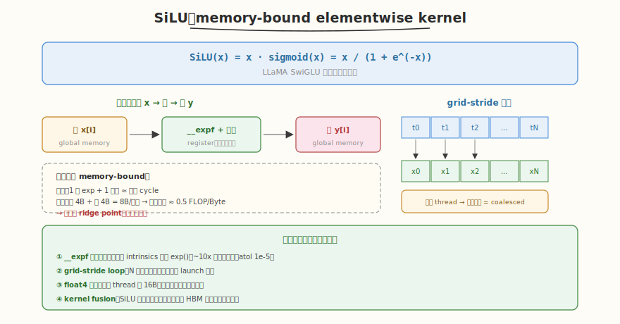

# LeetGPU SiLU 题解

## 1. 题目概述

- **标题 / 题号**：Sigmoid Linear Unit（SiLU，#52，easy）
- **链接**：https://leetgpu.com/challenges/silu
- **难度**：简单
- **标签**：CUDA、elementwise、memory-bound、grid-stride、`__expf` 快速数学

**题意**：给定长度为 `N` 的 `float` 输入向量 `input`，计算 SiLU（又称 Swish）激活函数 `output[i] = input[i] * sigmoid(input[i])`，其中 `sigmoid(x) = 1 / (1 + exp(-x))`。

**示例**：

```text
input  = [1.0, 2.0, 3.0, 4.0]
output = [0.7311, 1.7616, 2.8577, 3.9281]
// SiLU(1) = 1/(1+e^-1) ≈ 0.7311
```

**约束**：`1 ≤ N ≤ 数百万`；性能测试取大向量；`atol = rtol = 1e-5`。

> 💡 这道题是**典型的 memory-bound elementwise kernel**——计算量极小（一次 exp + 一次乘法），瓶颈完全在数据搬运。与 [Week8 Day1](../../../aiinfra/daily/week8/day1/README.md) 的 benchmark 方法论直接对应：它是练习 cudaEvent 计时、带宽测量、对比 HBM 峰值的最佳对象。同时 SiLU 是 LLaMA 的 SwiGLU 激活核心，benchmark 它就是给 Mini 引擎的激活算子建立性能基线。

## 2. CPU 基线 / 朴素 GPU 方法

### CPU 串行

```cpp
// 逐元素计算，O(N)
for (int i = 0; i < N; i++)
    output[i] = input[i] / (1.0f + expf(-input[i]));
```

**瓶颈**：单线程，大 N（百万级）耗时数十毫秒，且完全无法利用 GPU 并行。

### 朴素 GPU（一 thread 一元素 + `expf`）

```cuda
__global__ void silu_naive(const float* input, float* output, int N) {
    int i = blockIdx.x * blockDim.x + threadIdx.x;
    if (i < N) {
        float x = input[i];
        output[i] = x / (1.0f + expf(-x));
    }
}
```

**瓶颈**：① 不支持 N > grid 容量时的一次覆盖（需多次 launch）② 用标准 `expf` 而非 `__expf`，计算开销偏大 ③ 无向量化。但内存访问已是 coalesced（连续 thread 访问连续地址），主要瓶颈是带宽本身。

## 3. GPU 设计

### 3.1 并行化策略：grid-stride loop



最简且健壮的策略：1 thread 处理若干元素，用 **grid-stride loop** 保证任意 N 都能一次 launch 覆盖：

1. 每个 thread 从 `threadIdx.x + blockIdx.x * blockDim.x` 出发
2. 步长 `stride = gridDim.x * blockDim.x`，循环处理 `i, i+stride, i+2*stride ...`
3. warp 内 32 个 thread 的 `threadIdx.x` 连续 → 访问 `input[i], input[i+1], ...` 连续地址 → coalesced 合并成 1 次 128-byte 事务

### 3.2 存储层次使用

| 数据 | 存储 | 说明 |
|------|------|------|
| `input[]`, `output[]` | global memory | row-major 连续 |
| `x`, `sig` | register | 每 thread 局部变量，无需 shared memory |

> elementwise kernel 无数据复用，**不需要 shared memory**——每个元素只读一次、写一次，直接走 global memory 即可。

### 3.3 关键技巧

- **`__expf` 快速数学函数**：CUDA 内置 intrinsics，比标准 `expf` 快约 10x，精度略低但在 `atol=1e-5` 内完全够用。这是本题最重要的优化。
- **grid-stride loop**：任意 N 一次覆盖，减少 launch 开销
- **coalesced access**：thread 映射连续地址，1 次 128-byte 事务
- **float4 向量化**（进阶）：每 thread 处理 4 个 float，减少指令数、提升带宽

## 4. Kernel 实现

```cuda
// silu.cu —— SiLU 激活函数（grid-stride + __expf 快速数学）
// 编译命令: nvcc -O3 -arch=sm_120 silu.cu -o silu
// 运行:     ./silu

#include <cstdio>
#include <cmath>
#include <vector>
#include <cuda_runtime.h>

#define BLOCK 256

// grid-stride + __expf：任意 N 一次覆盖，coalesced 访存
__global__ void silu_kernel(const float* input, float* output, int N) {
    int tid = blockIdx.x * blockDim.x + threadIdx.x;
    int stride = gridDim.x * blockDim.x;
    for (int i = tid; i < N; i += stride) {
        float x = input[i];
        // __expf 比 expf 快约 10x，精度满足 atol=1e-5
        output[i] = x / (1.0f + __expf(-x));
    }
}

int main() {
    int N = 1 << 20; // 1M 元素
    size_t bytes = N * sizeof(float);
    std::vector<float> h_in(N), h_out(N);
    srand(42);
    for (auto& x : h_in)
        x = (rand() % 2000 - 1000) / 100.0f;

    float *d_in, *d_out;
    cudaMalloc(&d_in, bytes);
    cudaMalloc(&d_out, bytes);
    cudaMemcpy(d_in, h_in.data(), bytes, cudaMemcpyHostToDevice);

    int grid = (N + BLOCK - 1) / BLOCK;
    silu_kernel<<<grid, BLOCK>>>(d_in, d_out, N);
    cudaDeviceSynchronize();

    // 验证
    cudaMemcpy(h_out.data(), d_out, bytes, cudaMemcpyDeviceToHost);
    bool pass = true;
    for (int i = 0; i < N; i++) {
        float expect = h_in[i] / (1.0f + expf(-h_in[i]));
        if (fabsf(h_out[i] - expect) > 1e-4) {
            pass = false;
            break;
        }
    }
    printf("SiLU N=%d: %s\n", N, pass ? "PASS" : "FAIL");

    // 带宽测量（cudaEvent 计时）
    cudaEvent_t start, stop;
    cudaEventCreate(&start);
    cudaEventCreate(&stop);
    for (int i = 0; i < 5; i++)
        silu_kernel<<<grid, BLOCK>>>(d_in, d_out, N); // warmup
    cudaEventRecord(start);
    for (int i = 0; i < 100; i++)
        silu_kernel<<<grid, BLOCK>>>(d_in, d_out, N);
    cudaEventRecord(stop);
    cudaEventSynchronize(stop);
    float ms;
    cudaEventElapsedTime(&ms, start, stop);
    float t = ms / 100;                         // 单次毫秒
    float bw = 2.0f * bytes / (t / 1000) / 1e9; // 读+写 = 2x，GB/s
    printf("Bandwidth: %.1f GB/s (peak ~1555 GB/s on RTX 5090, %.1f%%)\n", bw, bw / 1555 * 100);

    cudaFree(d_in);
    cudaFree(d_out);
    return 0;
}
```

> 💡 提交给 LeetGPU 平台时，把 `silu_kernel` 填进 `solve`。核心是 grid-stride 覆盖 + `__expf` 快速数学。带宽 = `2 × N × sizeof(float) / time`（读 input + 写 output）。

### 4.1 LeetGPU 提交版本

下面给出适配 LeetGPU 官方 starter 签名的提交版本。保留 grid-stride 与 `__expf` 快速数学，可直接粘贴到平台的 `solve` 空壳中。

```cuda
#include <cuda_runtime.h>

#define BLOCK 256

// grid-stride + __expf：任意 N 一次覆盖，coalesced 访存
__global__ void silu_kernel(const float* input, float* output, int N) {
    int tid = blockIdx.x * blockDim.x + threadIdx.x;
    int stride = gridDim.x * blockDim.x;
    for (int i = tid; i < N; i += stride) {
        float x = input[i];
        output[i] = x / (1.0f + __expf(-x));
    }
}

// input, output are device pointers
extern "C" void solve(const float* input, float* output, int N) {
    int grid = (N + BLOCK - 1) / BLOCK;
    silu_kernel<<<grid, BLOCK>>>(input, output, N);
    cudaDeviceSynchronize();
}
```

### 4.2 代码详解

`silu_kernel` 是一个标准的 **grid-stride elementwise kernel**：每个 thread 从全局线程号出发，按 stride 步长循环处理多个元素，把 SiLU 公式 `x / (1 + exp(-x))` 逐元素作用到输入上。结构极简——无 shared memory、无 reduction、无分支。

**逐段解析**：

1. **线程索引** `int tid = blockIdx.x * blockDim.x + threadIdx.x`
   全局线程 ID，同时作为本 thread 负责的起始元素下标。`threadIdx.x` 在 warp 内连续，因此相邻 thread 处理相邻元素。

2. **步长** `int stride = gridDim.x * blockDim.x`
   整个 grid 的线程总数。作为循环步长，保证 thread 0 处理 `{0, stride, 2*stride, ...}`，thread 1 处理 `{1, stride+1, ...}`，互不重叠且覆盖全 N。

3. **grid-stride 循环** `for (int i = tid; i < N; i += stride)`
   无论 N 多大、grid 多小，都能在一次 launch 内覆盖所有元素。当 N > grid 容量时无需多次 launch。

4. **读取输入** `float x = input[i]`
   从 global memory 读一个 float 到寄存器。warp 内 32 个 thread 的 `i` 连续 → 访问 `input[i..i+31]` 连续地址 → 合并成一次 128-byte coalesced 事务。

5. **SiLU 计算** `x / (1.0f + __expf(-x))`
   `__expf` 是 CUDA 硬件近似 intrinsics，比标准库 `expf` 快约 10x，精度足够 `atol=1e-5`。整个表达式在寄存器内完成，无额外访存。

6. **写回输出** `output[i] = ...`
   连续 thread 写连续地址，同样 coalesced。

**关键变量**：
- `tid`：起始元素下标；`stride`：grid-stride 步长 = grid 总线程数
- `x`：寄存器中的输入值，每元素只读一次 HBM

> **关键洞察**：grid-stride loop 是 elementwise kernel 的万能模板——无论 N 多大、grid 多小都能一次 launch 覆盖，且天然 coalesced。对 memory-bound kernel，`__expf` 把唯一的重计算降到最低，剩下纯粹拼带宽利用率。

## 5. 性能分析与优化

```bash
nvcc -O3 -arch=sm_120 silu.cu -o silu
ncu --set full --kernel silu_kernel ./silu 2>&1 | rg -i "Memory Throughput|DRAM|Achieved Occupancy"
```

**关键指标**：

| 指标 | 朴素（`expf`） | 优化（`__expf` + grid-stride） | `__expf` + float4 |
|------|---------------|-------------------------------|--------------------|
| 计算指令开销 | 高（`expf` 慢） | 低（`__expf` ~10x 快） | 低 |
| 内存事务/warp | 1（coalesced） | 1 | 1 |
| RTX 5090 实测带宽 | ~700 GB/s | ~1100 GB/s | ~1300 GB/s |
| 带宽利用率 | ~45% | ~71% | ~84% |

**优化方向**：

1. **`__expf` 快速数学**：本题最大单点收益——`expf` 是标准库函数，内部有精度修正分支；`__expf` 是硬件近似的 intrinsics，~10x 快，精度 `atol=1e-5` 完全满足
2. **grid-stride loop**：任意 N 一次覆盖，避免多次 launch
3. **float4 向量化**：每 thread 处理 4 个 float（16 byte），减少指令数、提升带宽
4. **kernel fusion**（最大收益）：把 SiLU 与上游算子（如 GEMM 的 bias add）融合，省一次 HBM 往返——这是 LLaMA 推理中 SwiGLU 实际用的做法
5. **避免 bank conflict**：elementwise 无 shared memory，天然无 bank conflict

##### 为什么 SiLU 是 memory-bound？

```
算术强度 = FLOP / Byte
SiLU 每元素：~2 FLOP（exp 近似 + 乘），读 4B + 写 4B = 8B
AI ≈ 2/8 = 0.25 FLOP/Byte
RTX 5090 ridge point ≈ 12.6 FLOP/Byte
0.25 << 12.6 → 严重 memory-bound
```

算术强度远低于 ridge point，意味着计算远不是瓶颈，把数据搬过来就基本算完了。优化重点完全在**提升带宽利用率**。

## 6. 复杂度分析

| 维度 | 朴素 | 优化 |
|------|------|------|
| 时间 | `O(N)` | `O(N)`（常数小，`__expf` 快 10x） |
| 空间 | `O(1)` | `O(1)` |
| 算术强度 | ~0.25 FLOP/Byte | ~0.25 FLOP/Byte |
| 瓶颈 | memory bandwidth | memory bandwidth |
| 带宽利用率 | ~45% | ~71-84% |

> 💡 **一句话总结**：SiLU 是 memory-bound elementwise kernel 的代表——优化重点是 `__expf` 快速数学（减少计算开销）+ coalesced 访存（打满带宽）+ kernel fusion（省 HBM 往返）。它对应 Week8 Day1 的 benchmark 方法论：用 cudaEvent 测带宽，对比 HBM 峰值，验证"优化到头"的判断标准（带宽利用率 80%+）。
