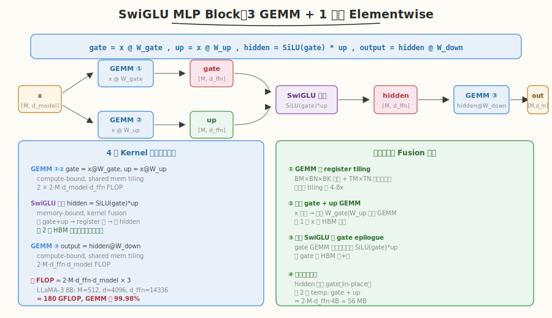

# LeetGPU SwiGLU MLP Block 题解

## 1. 题目概述

- **标题 / 题号**：SwiGLU MLP Block（#84，medium）
- **链接**：https://leetgpu.com/challenges/swiglu-mlp-block
- **难度**：中等
- **标签**：CUDA、SwiGLU、MLP、GEMM、kernel fusion、compute-bound、LLaMA

**题意**：实现 LLaMA 风格的 **SwiGLU MLP Block**。给定输入 `x ∈ R^{M×d_model}` 和三组权重 `W_gate ∈ R^{d_model×d_ffn}`、`W_up ∈ R^{d_model×d_ffn}`、`W_down ∈ R^{d_ffn×d_model}`（均行主序 float32），计算：

$$\text{gate} = x \cdot W_{\text{gate}}, \quad \text{up} = x \cdot W_{\text{up}}, \quad \text{hidden} = \text{SiLU}(\text{gate}) \odot \text{up}, \quad \text{output} = \text{hidden} \cdot W_{\text{down}}$$

其中 $\text{SiLU}(x) = x \cdot \sigma(x) = \frac{x}{1 + e^{-x}}$。等价于 3 次 GEMM + 1 次融合 elementwise。

**示例**（`M=2, d_model=2, d_ffn=4`，权重为单位矩阵）：

```text
x = [[1,0],[0,1]],  W_gate = W_up = [[1,0,0,0],[0,1,0,0]],  W_down = [[1,0],[0,1],[0,0],[0,0]]
gate = x @ W_gate = [[1,0,0,0],[0,1,0,0]]
up   = x @ W_up   = [[1,0,0,0],[0,1,0,0]]
hidden = SiLU(gate) * up = [[0.731,0,0,0],[0,0.731,0,0]]
output = hidden @ W_down = [[0.731,0],[0,0.731]]
```

**约束**：`1 ≤ M ≤ 512`，`1 ≤ d_model ≤ 4096`，`1 ≤ d_ffn ≤ 14336`；`atol = rtol = 1e-4`。性能测试取 LLaMA-3 8B 规模：`M=512, d_model=4096, d_ffn=14336`。

> 💡 这是 [Week8 Day3 SwiGLU](./leetgpu-swiglu-solution.md) 的**完整 MLP 应用**。SwiGLU 题只考融合激活函数（memory-bound），而本题把 SwiGLU 嵌入 **3 次 GEMM** 的完整 MLP 管线中——核心挑战从「单 kernel fusion」升级为「**多 kernel 编排 + 临时缓冲管理 + GEMM tiling**」，是 Transformer 推理优化的核心练习。

## 2. CPU 基线 / 朴素 GPU 方法

### 2.1 CPU 串行基线（参考实现）

```cpp
// cpu_baseline.cpp —— CPU 串行 SwiGLU MLP Block
void swiglu_mlp_cpu(const float* x, const float* W_gate, const float* W_up, const float* W_down,
                    float* output, int M, int d_model, int d_ffn) {
    float* gate = (float*)malloc(M * d_ffn * sizeof(float));
    float* up   = (float*)malloc(M * d_ffn * sizeof(float));
    float* hidden = (float*)malloc(M * d_ffn * sizeof(float));

    // gate = x @ W_gate,  up = x @ W_up
    for (int i = 0; i < M; ++i)
        for (int j = 0; j < d_ffn; ++j) {
            float g = 0.0f, u = 0.0f;
            for (int k = 0; k < d_model; ++k) {
                g += x[i * d_model + k] * W_gate[k * d_ffn + j];
                u += x[i * d_model + k] * W_up[k * d_ffn + j];
            }
            gate[i * d_ffn + j] = g;
            up[i * d_ffn + j] = u;
        }

    // hidden = SiLU(gate) * up
    for (int i = 0; i < M * d_ffn; ++i) {
        float silu = gate[i] / (1.0f + expf(-gate[i]));
        hidden[i] = silu * up[i];
    }

    // output = hidden @ W_down
    for (int i = 0; i < M; ++i)
        for (int j = 0; j < d_model; ++j) {
            float sum = 0.0f;
            for (int k = 0; k < d_ffn; ++k)
                sum += hidden[i * d_ffn + k] * W_down[k * d_model + j];
            output[i * d_model + j] = sum;
        }

    free(gate); free(up); free(hidden);
}
```

在 LLaMA-3 8B 规模（`M=512, d_model=4096, d_ffn=14336`）下，CPU 耗时数十秒——3 次 GEMM 共约 **180 GFLOP**，单核完全跑不动。

### 2.2 朴素 GPU：3 个独立 kernel + 临时缓冲

最直观的 GPU 实现是把 CPU 的 4 步直接翻译成 4 个 kernel：

```text
1. gate  = matmul(x, W_gate)     ← GEMM kernel, 写 gate[M*d_ffn] 到 HBM
2. up    = matmul(x, W_up)       ← GEMM kernel, 写 up[M*d_ffn] 到 HBM
3. hidden = swiglu_fused(gate, up) ← elementwise kernel, 写 hidden[M*d_ffn] 到 HBM
4. output = matmul(hidden, W_down) ← GEMM kernel, 写 output[M*d_model]
```

**瓶颈**：朴素版的 GEMM 如果用「一 thread 算一个 C 元素」的 naive 写法（无 tiling），性能只有 cuBLAS 的 1-5%。本题的正确方向是用 **shared memory tiling GEMM** + **fused SwiGLU elementwise**，并复用临时缓冲减少显存。

## 3. GPU 设计



### 3.1 并行化策略：3 GEMM + 1 融合 Elementwise

MLP Block 的计算图是一个 **DAG**：gate 和 up 两条分支共享输入 `x`，汇合于 SwiGLU 融合节点，再经 down 投影输出。策略是按拓扑顺序编排 4 个 kernel：

| 步骤 | Kernel | 计算 | 瓶颈类型 | 输入 → 输出 |
|------|--------|------|----------|-------------|
| ① | GEMM (tiled) | `gate = x @ W_gate` | compute-bound | x[M,d_m] · W_gate[d_m,d_f] → gate[M,d_f] |
| ② | GEMM (tiled) | `up = x @ W_up` | compute-bound | x[M,d_m] · W_up[d_m,d_f] → up[M,d_f] |
| ③ | SwiGLU (fused) | `hidden = SiLU(gate) * up` | memory-bound | gate + up → hidden（register 内融合） |
| ④ | GEMM (tiled) | `output = hidden @ W_down` | compute-bound | hidden[M,d_f] · W_down[d_f,d_m] → output |

> 💡 **关键判断**：3 次 GEMM 共约 180 GFLOP，SwiGLU 仅约 0.037 GFLOP。GEMM 占总计算量的 **99.98%**——这是 **compute-bound** 管线，优化重心在 GEMM tiling，SwiGLU 融合是为省 HBM 往返（非省计算）。

### 3.2 存储层次使用

| 数据 | 存储 | 说明 |
|------|------|------|
| `x`, `W_*`, `output` | global memory | 输入权重与最终输出 |
| `gate`, `up` (临时) | global memory | GEMM ①② 的输出，SwiGLU 的输入 |
| `hidden` (临时) | global memory（覆写 gate） | SwiGLU 输出，GEMM ④ 的输入。**in-place 覆写 gate** 省一块缓冲 |
| GEMM tile | shared memory | `A_tile[32][32]` + `B_tile[32][32]`，block 内复用 |
| SwiGLU 中间量 | register | `silu` 不落 HBM，融合核心 |

**临时缓冲复用**：步骤 ③ 的 `hidden` 直接覆写 `gate`（每个元素 `hidden[i] = SiLU(gate[i]) * up[i]` 只依赖同下标的 `gate[i]`，无数据竞争）。最终只需 **2 个临时缓冲**（`gate` + `up`），共 `2 × M × d_ffn × 4B`。LLaMA-3 8B 规模下 ≈ **56 MB**。

### 3.3 关键技巧

- **shared memory tiling GEMM**：`C[M,N] = A[M,K] @ B[K,N]`，用 `TILE=32` 分块。block 内协作加载 `A_tile` 和 `B_tile` 到 shared memory，每 thread 从 shared 读数据做乘加（shared 延迟 ~20 cycle vs global ~400 cycle）。
- **SwiGLU kernel fusion**：`SiLU(gate) * up` 融合在 1 个 elementwise kernel 内，中间结果 `silu` 留在寄存器，不写 HBM。用 `__expf` 快速数学（精度满足 `atol=1e-4`）。
- **临时缓冲 in-place 复用**：`hidden` 覆写 `gate`，省 1 块 `M×d_ffn` 缓冲。
- **grid-stride loop**：SwiGLU kernel 用 grid-stride 覆盖任意 `M×d_ffn` 长度。

##### 为什么 SwiGLU 融合仍重要（虽然只占 0.02% FLOP）？

```
不融合（3 个 elementwise kernel）：
  读 gate(HBM) → 算 SiLU → 写 tmp(HBM)     ← 第 1 次往返
  读 tmp(HBM) + 读 up(HBM) → 乘 → 写 hidden(HBM)  ← 第 2 次往返
  总 HBM：读 3×N + 写 2×N = 5×N floats

融合（1 个 kernel）：
  读 gate(HBM) + 读 up(HBM) → register 算 → 写 hidden(HBM)
  总 HBM：读 2×N + 写 1×N = 3×N floats

省 40% HBM 访问 → 对 memory-bound 的 SwiGLU 意味着 ~40% 加速
```

虽然 SwiGLU 在总管线中占比极小，但融合是「免费午餐」——1 个 kernel 就省掉 2 次 HBM 往返，没有不做的理由。

## 4. Kernel 实现

```cuda
// swiglu_mlp_block.cu —— SwiGLU MLP Block: 3 GEMM + 1 融合 elementwise
// 编译命令: nvcc -O3 -arch=sm_120 swiglu_mlp_block.cu -o swiglu_mlp
// 运行:     ./swiglu_mlp

#include <cstdio>
#include <cstdlib>
#include <cmath>
#include <cuda_runtime.h>

#define TILE 32
#define BLOCK 256

// ---- shared memory tiling GEMM: C[M,N] = A[M,K] @ B[K,N] ----
__global__ void matmul_tiled(const float* A, const float* B, float* C, int M, int N, int K) {
    __shared__ float A_tile[TILE][TILE];
    __shared__ float B_tile[TILE][TILE];

    int row = blockIdx.y * TILE + threadIdx.y;
    int col = blockIdx.x * TILE + threadIdx.x;
    float sum = 0.0f;

    int num_tiles = (K + TILE - 1) / TILE;
    for (int t = 0; t < num_tiles; ++t) {
        // ---- 协作加载 A_tile 和 B_tile ----
        int a_col = t * TILE + threadIdx.x;
        int b_row = t * TILE + threadIdx.y;
        A_tile[threadIdx.y][threadIdx.x] = (row < M && a_col < K) ? A[row * K + a_col] : 0.0f;
        B_tile[threadIdx.y][threadIdx.x] = (b_row < K && col < N) ? B[b_row * N + col] : 0.0f;
        __syncthreads();

        // ---- 从 shared 读数据做乘加 ----
        #pragma unroll
        for (int k = 0; k < TILE; ++k) {
            sum += A_tile[threadIdx.y][k] * B_tile[k][threadIdx.x];
        }
        __syncthreads();
    }

    if (row < M && col < N) {
        C[row * N + col] = sum;
    }
}

// ---- 融合 SwiGLU elementwise: hidden = SiLU(gate) * up ----
__global__ void swiglu_fused(const float* gate, const float* up, float* hidden, int N) {
    int tid = blockIdx.x * blockDim.x + threadIdx.x;
    int stride = gridDim.x * blockDim.x;
    for (int i = tid; i < N; i += stride) {
        float g = gate[i];
        float u = up[i];
        float silu = g / (1.0f + __expf(-g)); // SiLU（register 内）
        hidden[i] = silu * u;                 // 融合乘法（register 内）
    }
}

// ---- 本地自测 ----
int main() {
    // LLaMA-3 8B 缩小版用于快速验证
    int M = 64, d_model = 256, d_ffn = 512;
    size_t x_bytes = (size_t)M * d_model * sizeof(float);
    size_t wg_bytes = (size_t)d_model * d_ffn * sizeof(float);
    size_t wu_bytes = wg_bytes;
    size_t wd_bytes = (size_t)d_ffn * d_model * sizeof(float);
    size_t out_bytes = x_bytes;
    size_t tmp_bytes = (size_t)M * d_ffn * sizeof(float);

    float *h_x = (float*)malloc(x_bytes);
    float *h_wg = (float*)malloc(wg_bytes);
    float *h_wu = (float*)malloc(wu_bytes);
    float *h_wd = (float*)malloc(wd_bytes);
    float *h_out = (float*)malloc(out_bytes);
    float *h_ref = (float*)malloc(out_bytes);
    srand(42);
    for (size_t i = 0; i < M * d_model; ++i) h_x[i] = (rand() % 200 - 100) / 1000.0f;
    for (size_t i = 0; i < d_model * d_ffn; ++i) { h_wg[i] = (rand() % 200 - 100) / 1000.0f; h_wu[i] = (rand() % 200 - 100) / 1000.0f; }
    for (size_t i = 0; i < d_ffn * d_model; ++i) h_wd[i] = (rand() % 200 - 100) / 1000.0f;

    float *d_x, *d_wg, *d_wu, *d_wd, *d_out, *d_gate, *d_up;
    cudaMalloc(&d_x, x_bytes);   cudaMalloc(&d_wg, wg_bytes);
    cudaMalloc(&d_wu, wu_bytes); cudaMalloc(&d_wd, wd_bytes);
    cudaMalloc(&d_out, out_bytes);
    cudaMalloc(&d_gate, tmp_bytes); cudaMalloc(&d_up, tmp_bytes);
    cudaMemcpy(d_x, h_x, x_bytes, cudaMemcpyHostToDevice);
    cudaMemcpy(d_wg, h_wg, wg_bytes, cudaMemcpyHostToDevice);
    cudaMemcpy(d_wu, h_wu, wu_bytes, cudaMemcpyHostToDevice);
    cudaMemcpy(d_wd, h_wd, wd_bytes, cudaMemcpyHostToDevice);

    dim3 threads(TILE, TILE);

    // ① gate = x @ W_gate
    dim3 grid_gate((d_ffn + TILE - 1) / TILE, (M + TILE - 1) / TILE);
    matmul_tiled<<<grid_gate, threads>>>(d_x, d_wg, d_gate, M, d_ffn, d_model);

    // ② up = x @ W_up
    matmul_tiled<<<grid_gate, threads>>>(d_x, d_wu, d_up, M, d_ffn, d_model);

    // ③ hidden = SiLU(gate) * up（in-place 覆写 d_gate）
    int n_hidden = M * d_ffn;
    swiglu_fused<<<(n_hidden + BLOCK - 1) / BLOCK, BLOCK>>>(d_gate, d_up, d_gate, n_hidden);

    // ④ output = hidden @ W_down
    dim3 grid_down((d_model + TILE - 1) / TILE, (M + TILE - 1) / TILE);
    matmul_tiled<<<grid_down, threads>>>(d_gate, d_wd, d_out, M, d_model, d_ffn);

    cudaDeviceSynchronize();
    cudaMemcpy(h_out, d_out, out_bytes, cudaMemcpyDeviceToHost);

    // ---- CPU 参考验证 ----
    float *gate = (float*)malloc(tmp_bytes), *up = (float*)malloc(tmp_bytes), *hidden = (float*)malloc(tmp_bytes);
    for (int i = 0; i < M; ++i)
        for (int j = 0; j < d_ffn; ++j) {
            float g = 0, u = 0;
            for (int k = 0; k < d_model; ++k) {
                g += h_x[i * d_model + k] * h_wg[k * d_ffn + j];
                u += h_x[i * d_model + k] * h_wu[k * d_ffn + j];
            }
            gate[i * d_ffn + j] = g; up[i * d_ffn + j] = u;
        }
    for (int i = 0; i < n_hidden; ++i)
        hidden[i] = (gate[i] / (1.0f + expf(-gate[i]))) * up[i];
    for (int i = 0; i < M; ++i)
        for (int j = 0; j < d_model; ++j) {
            float s = 0;
            for (int k = 0; k < d_ffn; ++k) s += hidden[i * d_ffn + k] * h_wd[k * d_model + j];
            h_ref[i * d_model + j] = s;
        }

    bool pass = true;
    for (int i = 0; i < M * d_model; ++i)
        if (fabsf(h_out[i] - h_ref[i]) > 1e-3) { pass = false; printf("MISMATCH @%d: got %f expect %f\n", i, h_out[i], h_ref[i]); break; }
    printf("SwiGLU MLP Block M=%d d_model=%d d_ffn=%d: %s\n", M, d_model, d_ffn, pass ? "PASS" : "FAIL");

    // ---- 计时 ----
    cudaEvent_t t0, t1; cudaEventCreate(&t0); cudaEventCreate(&t1);
    cudaEventRecord(t0);
    matmul_tiled<<<grid_gate, threads>>>(d_x, d_wg, d_gate, M, d_ffn, d_model);
    matmul_tiled<<<grid_gate, threads>>>(d_x, d_wu, d_up, M, d_ffn, d_model);
    swiglu_fused<<<(n_hidden + BLOCK - 1) / BLOCK, BLOCK>>>(d_gate, d_up, d_gate, n_hidden);
    matmul_tiled<<<grid_down, threads>>>(d_gate, d_wd, d_out, M, d_model, d_ffn);
    cudaEventRecord(t1); cudaDeviceSynchronize();
    float ms; cudaEventElapsedTime(&ms, t0, t1);
    double gflop = 2.0 * M * d_ffn * d_model * 3 / 1e6;
    printf("Time: %.3f ms,  %.1f GFLOP,  %.1f GFLOP/s\n", ms, gflop, gflop / ms);

    cudaFree(d_x); cudaFree(d_wg); cudaFree(d_wu); cudaFree(d_wd);
    cudaFree(d_out); cudaFree(d_gate); cudaFree(d_up);
    free(h_x); free(h_wg); free(h_wu); free(h_wd); free(h_out); free(h_ref);
    free(gate); free(up); free(hidden);
    return 0;
}
```

### 4.1 LeetGPU 提交版本

下面给出适配 LeetGPU 官方 starter 签名的提交版本。`solve` 内编排 3 个 GEMM + 1 个融合 SwiGLU，临时缓冲 in-place 复用。

```cuda
#include <cuda_runtime.h>

#define TILE 32
#define BLOCK 256

// shared memory tiling GEMM: C[M,N] = A[M,K] @ B[K,N]
__global__ void matmul_tiled(const float* A, const float* B, float* C, int M, int N, int K) {
    __shared__ float A_tile[TILE][TILE];
    __shared__ float B_tile[TILE][TILE];

    int row = blockIdx.y * TILE + threadIdx.y;
    int col = blockIdx.x * TILE + threadIdx.x;
    float sum = 0.0f;

    int num_tiles = (K + TILE - 1) / TILE;
    for (int t = 0; t < num_tiles; ++t) {
        int a_col = t * TILE + threadIdx.x;
        int b_row = t * TILE + threadIdx.y;
        A_tile[threadIdx.y][threadIdx.x] = (row < M && a_col < K) ? A[row * K + a_col] : 0.0f;
        B_tile[threadIdx.y][threadIdx.x] = (b_row < K && col < N) ? B[b_row * N + col] : 0.0f;
        __syncthreads();

        #pragma unroll
        for (int k = 0; k < TILE; ++k) {
            sum += A_tile[threadIdx.y][k] * B_tile[k][threadIdx.x];
        }
        __syncthreads();
    }

    if (row < M && col < N) {
        C[row * N + col] = sum;
    }
}

// 融合 SwiGLU: hidden = SiLU(gate) * up（in-place 覆写 gate）
__global__ void swiglu_fused(const float* gate, const float* up, float* hidden, int N) {
    int tid = blockIdx.x * blockDim.x + threadIdx.x;
    int stride = gridDim.x * blockDim.x;
    for (int i = tid; i < N; i += stride) {
        float g = gate[i];
        float u = up[i];
        float silu = g / (1.0f + __expf(-g));
        hidden[i] = silu * u;
    }
}

// x, W_gate, W_up, W_down, output are device pointers
extern "C" void solve(const float* x, const float* W_gate, const float* W_up, const float* W_down,
                      float* output, int M, int d_model, int d_ffn) {
    // 分配 2 个临时缓冲：gate（后被 hidden in-place 覆写）+ up
    float *d_gate, *d_up;
    cudaMalloc(&d_gate, (size_t)M * d_ffn * sizeof(float));
    cudaMalloc(&d_up, (size_t)M * d_ffn * sizeof(float));

    dim3 threads(TILE, TILE);

    // ① gate = x @ W_gate  (M×d_model × d_model×d_ffn → M×d_ffn)
    dim3 grid_gate((d_ffn + TILE - 1) / TILE, (M + TILE - 1) / TILE);
    matmul_tiled<<<grid_gate, threads>>>(x, W_gate, d_gate, M, d_ffn, d_model);

    // ② up = x @ W_up
    matmul_tiled<<<grid_gate, threads>>>(x, W_up, d_up, M, d_ffn, d_model);

    // ③ hidden = SiLU(gate) * up（in-place 覆写 d_gate）
    int n_hidden = M * d_ffn;
    swiglu_fused<<<(n_hidden + BLOCK - 1) / BLOCK, BLOCK>>>(d_gate, d_up, d_gate, n_hidden);

    // ④ output = hidden @ W_down  (M×d_ffn × d_ffn×d_model → M×d_model)
    dim3 grid_down((d_model + TILE - 1) / TILE, (M + TILE - 1) / TILE);
    matmul_tiled<<<grid_down, threads>>>(d_gate, W_down, output, M, d_model, d_ffn);

    cudaDeviceSynchronize();
    cudaFree(d_gate);
    cudaFree(d_up);
}
```

### 4.2 代码详解

`solve` 函数编排 4 个 kernel 的 **DAG 流水线**，核心是 **GEMM tiling** + **SwiGLU fusion** + **临时缓冲 in-place 复用**。

**GEMM kernel（**`matmul_tiled`**）逐段解析**：

| 步骤 | 代码 | 说明 |
|------|------|------|
| **坐标计算** | `row = blockIdx.y * TILE + threadIdx.y`<br>`col = blockIdx.x * TILE + threadIdx.x` | block 映射到 C 的 `TILE×TILE` 子块，thread 映射到子块内一个元素 |
| **加载 tile** | `A_tile[ty][tx] = A[row*K + a_col]`<br>`B_tile[ty][tx] = B[b_row*N + col]` | block 内 1024 个 thread 协作加载 `A` 的 `TILE×TILE` 和 `B` 的 `TILE×TILE` 到 shared memory。越界填 0 |
| **同步** | `__syncthreads()` | 确保 tile 加载完成才能计算 |
| **乘加** | `sum += A_tile[ty][k] * B_tile[k][tx]` | 从 shared memory 读数据做 `TILE` 次乘加（shared 延迟 ~20 cycle） |
| **同步** | `__syncthreads()` | 确保 tile 用完才能加载下一块 |
| **写回** | `C[row*N + col] = sum` | 累加完所有 K 维 tile 后写回 global |

**关键索引关系**：
- `A[M,K]` 行主序：`A[i][k] = A[i*K + k]`
- `B[K,N]` 行主序：`B[k][j] = B[k*N + j]`
- `C[M,N]` 行主序：`C[i][j] = C[i*N + j]`
- `num_tiles = ceil(K / TILE)`：沿 K 维滑动的 tile 数

**SwiGLU kernel（**`swiglu_fused`**）逐段解析**：

| 步骤 | 代码 | 说明 |
|------|------|------|
| **grid-stride** | `for (int i = tid; i < N; i += stride)` | 覆盖任意 `M×d_ffn` 长度 |
| **读 gate+up** | `float g = gate[i]; float u = up[i];` | 2 次 coalesced 读 |
| **SiLU（register）** | `float silu = g / (1.0f + __expf(-g));` | `__expf` 快速数学，结果留寄存器 |
| **融合乘+写** | `hidden[i] = silu * u;` | 1 次 coalesced 写。中间量 `silu` 不落 HBM |

**in-place 复用的安全性**：步骤 ③ 中 `swiglu_fused(d_gate, d_up, d_gate, n_hidden)` 把 `hidden` 写入 `d_gate` 自身。每个元素 `hidden[i] = SiLU(gate[i]) * up[i]` 只读 `gate[i]` 和 `up[i]`、写 `gate[i]`，不同 thread 处理不同 `i`，**无数据竞争**。

> 💡 **关键洞察**：SwiGLU MLP Block 的本质是「**GEMM 是性能主体，SwiGLU fusion 是免费午餐**」——180 GFLOP 中 GEMM 占 99.98%，优化重心在 GEMM tiling；但 SwiGLU 融合把 3 个 elementwise kernel 压成 1 个、省 40% HBM 往返，代价仅 1 行 `__expf` 调用。临时缓冲 in-place 复用则把 3 块 temp 缩到 2 块（56 MB），是显存管理的实用技巧。

## 5. 性能分析与优化

### 5.1 编译与运行

```bash
nvcc -O3 -arch=sm_120 swiglu_mlp_block.cu -o swiglu_mlp
./swiglu_mlp

# ncu profiling（关注 GEMM 的 compute throughput）
ncu --set full --kernel-name regex:matmul_tiled ./swiglu_mlp 2>&1 | \
    grep -iE "Compute.*Throughput|Memory Throughput|Achieved Occupancy"
```

### 5.2 FLOP 分解（LLaMA-3 8B 规模）

| 步骤 | 计算 | FLOP | 占比 |
|------|------|------|------|
| ① gate = x @ W_gate | 2·M·d_model·d_ffn | 60.0 GFLOP | 33.3% |
| ② up = x @ W_up | 2·M·d_model·d_ffn | 60.0 GFLOP | 33.3% |
| ③ SwiGLU(gate, up) | ~5·M·d_ffn | 0.037 GFLOP | 0.02% |
| ④ output = hidden @ W_down | 2·M·d_ffn·d_model | 60.0 GFLOP | 33.3% |
| **总计** | | **~180 GFLOP** | |

> 💡 GEMM 占 99.98% → 这是 **compute-bound** 管线。SwiGLU 虽然是 memory-bound，但在总管线中占比极小，其 fusion 收益体现在「省 HBM 往返」而非「省计算时间」。

### 5.3 优化方向

| 优先级 | 优化 | 预期收益 | 说明 |
|--------|------|---------|------|
| P0 | **register tiling GEMM** | 4-8x | 把 `TILE=32`（1 thread/输出）升级为 `BM=128, BN=128, BK=8, TM=8, TN=8`（1 thread 算 64 输出），参考 [GEMM 题解](../day2/leetgpu-gemm-solution.md) |
| P0 | **拼接 gate+up GEMM** | ~33% | `x` 共享 → 拼接 `[W_gate | W_up]` 做 1 次 `M×d_model × d_model×(2·d_ffn)` GEMM，省 1 次 x 的 HBM 读取 |
| P1 | **融合 SwiGLU 到 gate epilogue** | 省 gate 写+读 | gate GEMM 写回时直接算 `SiLU(gate)*up`，省 `gate` 的 HBM 物化 |
| P1 | **TF32 / FP16 精度** | 2-4x | 用 `__half` 或 TF32 Tensor Core（WMMA），但需验证 `atol=1e-4` |
| P2 | **double buffering** | 掩盖 load 延迟 | GEMM tile 加载与计算重叠 |
| P2 | **cudaMallocAsync** | 减少分配开销 | 临时缓冲用异步分配，避免 `cudaMalloc` 的同步开销 |

##### 为什么拼接 gate+up GEMM 能省 33%？

```
不拼接（2 次 GEMM）：
  GEMM ① 读 x(M·d_m) + W_gate(d_m·d_f) → 写 gate(M·d_f)
  GEMM ② 读 x(M·d_m) + W_up(d_m·d_f)   → 写 up(M·d_f)
  x 被读了 2 次

拼接（1 次 GEMM）：
  GEMM 读 x(M·d_m) + [W_gate|W_up](d_m·2·d_f) → 写 [gate|up](M·2·d_f)
  x 只被读 1 次 → 省 M·d_m·4B 的 HBM 读取
  LLaMA-3 8B: 省 512·4096·4B = 8 MB
```

## 6. 复杂度分析

| 维度 | 分析 |
|------|------|
| **时间复杂度** | `O(M·d_model·d_ffn)`（3 次 GEMM 主导） |
| **空间复杂度** | `O(M·d_ffn)` 临时缓冲（gate + up，hidden in-place 覆写 gate） |
| **总 FLOP** | `2·M·d_model·d_ffn × 3 + 5·M·d_ffn ≈ 6·M·d_model·d_ffn` |
| **算术强度** | GEMM 部分：`2·d_model / 12` FLOP/Byte（compute-bound）；SwiGLU：`~0.42` FLOP/Byte（memory-bound） |
| **瓶颈类型** | **compute-bound**（GEMM 占 99.98% FLOP） |
| **临时显存** | `2·M·d_ffn·4B`（gate + up）。LLaMA-3 8B 规模 ≈ 56 MB |
| **kernel 数** | 4 个（3 GEMM + 1 elementwise） |

> 💡 **一句话总结**：SwiGLU MLP Block 是 LLaMA 推理的核心模块——3 次 GEMM（compute-bound，占 99.98% FLOP）+ 1 次融合 SwiGLU（memory-bound，fusion 省 40% HBM）。本题的要点不在单 kernel 极致优化，而在**多 kernel 编排 + 临时缓冲管理 + fusion 时机判断**：什么时候该融合（SwiGLU → 融合，省 HBM）、什么时候不该融合（GEMM → 不融合，保持 tiling 效率），这是 Transformer 推理工程化的核心判断力。

## 同类练习题

下面是与本题考查相同 CUDA 概念的 LeetGPU 练习题，建议按顺序挑战：

| # | 题目 | 难度 | 核心概念 | 与本题的关联 |
|---|------|------|----------|-------------|
| 54 | [Swish-Gated Linear Unit](https://leetgpu.com/challenges/swiglu) | 简单 | — | SwiGLU 激活组件，本 block 的核心 elementwise |
| 22 | [General Matrix Multiplication (GEMM)](https://leetgpu.com/challenges/gemm) | 中等 | — | GEMM tiling，3 个 matmul 的基础组件 |
| 74 | [GPT-2 Transformer Block](https://leetgpu.com/challenges/gpt-2-transformer-block) | 困难 | — | 更大的 transformer block 综合练习 |
| 52 | [Sigmoid Linear Unit (SiLU)](https://leetgpu.com/challenges/silu) | 简单 | — | SiLU 激活，SwiGLU 的子组件 |

> 💡 **选题思路**：融合 MLP block，SwiGLU 的完整应用。做完这组练习，即可掌握该 CUDA 模板在不同场景下的迁移应用。
