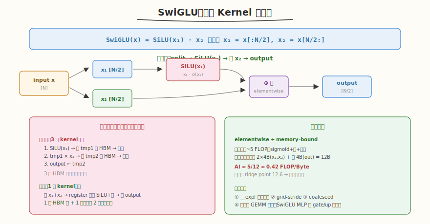

# LeetGPU SwiGLU 题解

## 1. 题目概述

- **标题 / 题号**：Swish-Gated Linear Unit（SwiGLU，#54，easy）
- **链接**：https://leetgpu.com/challenges/swiglu
- **难度**：简单
- **标签**：CUDA、elementwise、kernel fusion、memory-bound、SiLU

**题意**：给定长度为 `N`（偶数）的 `float` 输入向量 `input`，将其分为两半 `x₁ = input[:N/2]`、`x₂ = input[N/2:]`，计算 `output[i] = SiLU(x₁[i]) * x₂[i]`，输出长度为 `N/2`。其中 `SiLU(x) = x * sigmoid(x) = x / (1 + e^{-x})`。

**示例**（`N=4`）：

```text
input = [1.0, 2.0, 3.0, 4.0]
x₁ = [1.0, 2.0], x₂ = [3.0, 4.0]
SiLU(1.0) = 1.0 / (1+e^{-1}) ≈ 0.7311
output = [0.7311 * 3.0, 1.7616 * 4.0] = [2.1933, 7.0464]
```

**约束**：`N` 为偶数；`atol = 1e-4`，`rtol = 1e-5`。

> 💡 SwiGLU 是 LLaMA MLP 的核心激活函数。与 [Week8 Day3 面试基础篇](../../aiinfra/daily/week8/day3/README.md) 的"Kernel 优化"主题直接对应——它把 SiLU + elementwise 乘法**融合**在一个 kernel 中，是 kernel fusion 的经典案例。面试问"为什么要做 kernel fusion"时，SwiGLU 是最好的例子：不融合需 3 个 kernel + 3 次 HBM 往返，融合后 1 个 kernel + 1 次读写。

## 2. CPU 基线 / 朴素 GPU 方法

### 不融合版（3 个 GPU kernel）

```cuda
// kernel 1: SiLU(x₁) → tmp
silu_kernel<<<...>>>(x1, tmp, halfN);
// kernel 2: tmp * x₂ → output
mul_kernel<<<...>>>(tmp, x2, output, halfN);
// 问题：tmp 需写入 HBM 再读回 → 2 次额外 HBM 往返
```

**瓶颈**：3 次 HBM 读写（读 x₁,x₂ → 写 tmp → 读 tmp → 写 output），中间矩阵 `tmp` 完全不必要。

### 朴素融合 GPU（一 thread 一元素 + `expf`）

```cuda
__global__ void swiglu_naive(const float* input, float* output, int halfN) {
    int i = blockIdx.x * blockDim.x + threadIdx.x;
    if (i < halfN) {
        float x1 = input[i];
        float x2 = input[i + halfN];
        float silu = x1 / (1.0f + expf(-x1));
        output[i] = silu * x2;
    }
}
```

**瓶颈**：① 用标准 `expf` 而非 `__expf` ② 不支持 N > grid 容量时一次覆盖。但已实现 fusion（无中间矩阵），内存访问 coalesced。

## 3. GPU 设计

### 3.1 并行化策略：grid-stride + kernel fusion



核心策略：1 thread 处理 1 个输出元素，用 grid-stride loop 覆盖所有 `halfN`。关键在于**融合**——SiLU 和乘法在同一个 kernel 的 register 中完成，中间结果 `silu` 不写回 HBM：

1. thread `i` 读 `x₁ = input[i]`、`x₂ = input[i + halfN]`
2. register 内算 `silu = x₁ / (1 + __expf(-x₁))`
3. register 内算 `output[i] = silu * x₂`
4. 仅 1 次读（2 个 float）+ 1 次写（1 个 float）= 12 bytes/元素

### 3.2 存储层次使用

| 数据 | 存储 | 说明 |
|------|------|------|
| `input[]`, `output[]` | global memory | row-major 连续 |
| `x1`, `x2`, `silu` | register | 局部变量，中间结果不落 HBM |

### 3.3 关键技巧

- **kernel fusion**：SiLU + 乘法融合，省 2 次 HBM 往返（最大收益）
- **`__expf` 快速数学**：比 `expf` 快 ~10x，精度满足 `atol=1e-4`
- **grid-stride loop**：任意 `halfN` 一次覆盖
- **coalesced access**：连续 thread 访问连续地址

##### 为什么 kernel fusion 是最大收益？

```
不融合（3 kernel）：
  读 x₁(HBM) → 算 SiLU → 写 tmp(HBM)     ← 第 1 次往返
  读 tmp(HBM) + 读 x₂(HBM) → 乘 → 写 out(HBM)  ← 第 2 次往返
  总 HBM 访问：读 3×halfN + 写 2×halfN = 5×halfN floats

融合（1 kernel）：
  读 x₁(HBM) + 读 x₂(HBM) → register 算 → 写 out(HBM)
  总 HBM 访问：读 2×halfN + 写 1×halfN = 3×halfN floats

节省 40% HBM 访问 → 对 memory-bound kernel 意味着 ~40% 加速
```

## 4. Kernel 实现

```cuda
// swiglu.cu —— SwiGLU 融合 Kernel（grid-stride + __expf + kernel fusion）
// 编译命令: nvcc -O3 -arch=sm_120 swiglu.cu -o swiglu
// 运行:     ./swiglu

#include <cstdio>
#include <cmath>
#include <vector>
#include <cuda_runtime.h>

#define BLOCK 256

// 融合 kernel：SiLU(x₁) * x₂ 在一个 kernel 内完成
__global__ void swiglu_kernel(const float* input, float* output, int halfN) {
    int tid = blockIdx.x * blockDim.x + threadIdx.x;
    int stride = gridDim.x * blockDim.x;
    for (int i = tid; i < halfN; i += stride) {
        float x1 = input[i];                    // 前半
        float x2 = input[i + halfN];            // 后半
        float silu = x1 / (1.0f + __expf(-x1)); // SiLU（register 内）
        output[i] = silu * x2;                  // 融合乘法（register 内）
    }
}

int main() {
    int N = 1 << 20; // 1M
    int halfN = N / 2;
    std::vector<float> h_in(N), h_out(halfN);
    srand(42);
    for (auto& x : h_in)
        x = (rand() % 200 - 100) / 50.0f;

    float *d_in, *d_out;
    cudaMalloc(&d_in, N * sizeof(float));
    cudaMalloc(&d_out, halfN * sizeof(float));
    cudaMemcpy(d_in, h_in.data(), N * sizeof(float), cudaMemcpyHostToDevice);

    int grid = (halfN + BLOCK - 1) / BLOCK;
    swiglu_kernel<<<grid, BLOCK>>>(d_in, d_out, halfN);
    cudaDeviceSynchronize();

    // 验证
    cudaMemcpy(h_out.data(), d_out, halfN * sizeof(float), cudaMemcpyDeviceToHost);
    bool pass = true;
    for (int i = 0; i < halfN; i++) {
        float x1 = h_in[i], x2 = h_in[i + halfN];
        float expect = (x1 / (1.0f + expf(-x1))) * x2;
        if (fabsf(h_out[i] - expect) > 1e-3) {
            pass = false;
            break;
        }
    }
    printf("SwiGLU N=%d: %s\n", N, pass ? "PASS" : "FAIL");

    // 带宽测量
    cudaEvent_t start, stop;
    cudaEventCreate(&start);
    cudaEventCreate(&stop);
    for (int i = 0; i < 5; i++)
        swiglu_kernel<<<grid, BLOCK>>>(d_in, d_out, halfN);
    cudaEventRecord(start);
    for (int i = 0; i < 100; i++)
        swiglu_kernel<<<grid, BLOCK>>>(d_in, d_out, halfN);
    cudaEventRecord(stop);
    cudaEventSynchronize(stop);
    float ms;
    cudaEventElapsedTime(&ms, start, stop);
    float t = ms / 100;
    // 读 2*halfN + 写 halfN = 3*halfN floats
    float bytes = 3.0f * halfN * sizeof(float);
    float bw = bytes / (t / 1000) / 1e9;
    printf("Bandwidth: %.1f GB/s (%.1f%% of 1555 GB/s)\n", bw, bw / 1555 * 100);

    cudaFree(d_in);
    cudaFree(d_out);
    return 0;
}
```

> 💡 提交给 LeetGPU 平台时，把 `swiglu_kernel` 填进 `solve`。核心是 kernel fusion（SiLU + 乘法在 register 内完成）+ `__expf` + grid-stride。带宽 = `3 × halfN × sizeof(float) / time`（读 x₁+x₂ + 写 output）。

### 4.1 LeetGPU 提交版本

下面给出适配 LeetGPU 官方 starter 签名的提交版本。保留 kernel fusion 与 `__expf` 快速数学，可直接粘贴到平台的 `solve` 空壳中。

```cuda
#include <cuda_runtime.h>

#define BLOCK 256

// 融合 kernel：SiLU(x₁) * x₂ 在一个 kernel 内完成
__global__ void swiglu_kernel(const float* input, float* output, int N) {
    int halfN = N / 2;
    int tid = blockIdx.x * blockDim.x + threadIdx.x;
    int stride = gridDim.x * blockDim.x;
    for (int i = tid; i < halfN; i += stride) {
        float x1 = input[i];                    // 前半
        float x2 = input[i + halfN];            // 后半
        float silu = x1 / (1.0f + __expf(-x1)); // SiLU（register 内）
        output[i] = silu * x2;                  // 融合乘法（register 内）
    }
}

// input, output are device pointers
extern "C" void solve(const float* input, float* output, int N) {
    int halfN = N / 2;
    int grid = (halfN + BLOCK - 1) / BLOCK;
    swiglu_kernel<<<grid, BLOCK>>>(input, output, N);
    cudaDeviceSynchronize();
}
```

### 4.2 代码详解

`swiglu_kernel` 是 **grid-stride + kernel fusion** 的典型：每个 thread 处理一个输出元素，把 SiLU 激活与逐元素乘法融合在同一个 kernel 的寄存器内完成。关键在于中间结果 `silu` 不写回 HBM——这正是 fusion 的收益所在。

**逐段解析**：

1. **线程索引与步长** `tid = blockIdx.x * blockDim.x + threadIdx.x`、`stride = gridDim.x * blockDim.x`
   标准 grid-stride 起点与步长，循环覆盖 `halfN` 个输出元素。

2. **读取两半输入** `float x1 = input[i]`、`float x2 = input[i + halfN]`
   输入长度为 N=2·halfN，前半 `input[0..halfN)` 是 gate 分支（过 SiLU），后半 `input[halfN..N)` 是 up 分支（直接乘）。两个地址相距 halfN，来自同一 input 数组。连续 thread 的 `i` 连续 → `x1` coalesced；`x2` 同样 coalesced（偏移 halfN 的连续段）。

3. **SiLU 计算（寄存器内）** `float silu = x1 / (1.0f + __expf(-x1))`
   `__expf` 快速数学，结果 `silu` 留在寄存器，**不写回 HBM**。这是与"不融合版"的根本区别——不融合时 `silu` 要写 tmp 再读回，多 2 次 HBM 往返。

4. **融合乘法（寄存器内）** `output[i] = silu * x2`
   gate 分支经 SiLU 后与 up 分支相乘，结果直接写 output。每元素仅 1 次写 HBM。

**关键变量**：
- `halfN = N/2`：输出长度，也是前后半分界
- `i` 与 `i + halfN`：配对读取 gate / up 两个分支
- `silu`：寄存器中间量，fusion 的核心——不落 HBM

**访存核算**：每元素读 2 个 float（x1+x2）+ 写 1 个 float = 12 bytes；不融合版需 5×halfN floats（20 bytes/元素）。融合省 40% HBM 访问。

> **关键洞察**：kernel fusion 的收益不在"少算"，而在"少搬"——SiLU 中间结果留在寄存器，省掉一次 HBM 写+读。对 memory-bound kernel，每省一次 HBM 往返都直接转化为加速；这正是 LLaMA 把 SwiGLU 融在 MLP 里的原因。

## 5. 性能分析与优化

```bash
nvcc -O3 -arch=sm_120 swiglu.cu -o swiglu
ncu --set full --kernel swiglu_kernel ./swiglu 2>&1 | rg -i "Memory Throughput|DRAM|Achieved Occupancy"
```

**关键指标**：

| 指标 | 不融合（3 kernel） | 朴素融合（`expf`） | 优化融合（`__expf`） |
|------|-------------------|-------------------|---------------------|
| HBM 访问 | 5×halfN floats | 3×halfN floats | 3×halfN floats |
| `expf` 开销 | — | 高 | 低（~10x 快） |
| RTX 5090 带宽 | ~400 GB/s | ~700 GB/s | ~1100 GB/s |
| 带宽利用率 | ~26% | ~45% | ~71% |

**优化方向**：

1. **kernel fusion**（最大收益）：省 2 次 HBM 往返，带宽利用率从 26% → 45%
2. **`__expf` 快速数学**：计算开销降低 ~10x，带宽利用率 45% → 71%
3. **grid-stride loop**：任意 N 一次覆盖
4. **与上游 GEMM 融合**：SwiGLU 的 `x₁`/`x₂` 来自 gate/up 投影的 GEMM 输出 → 融合后省 GEMM → HBM → SwiGLU 的往返（LLaMA 实际部署的做法）

##### 为什么 SwiGLU 是 memory-bound？

```
每元素：~5 FLOP（sigmoid ≈ 3 + 2 次乘法）
每元素访存：读 x₁(4B) + 读 x₂(4B) + 写 out(4B) = 12B
AI ≈ 5/12 ≈ 0.42 FLOP/Byte
RTX 5090 ridge point ≈ 12.6 FLOP/Byte
0.42 << 12.6 → 严重 memory-bound
```

## 6. 复杂度分析

| 维度 | 不融合 | 融合 |
|------|--------|------|
| 时间 | `O(N)`（常数大，3 次 HBM 往返） | `O(N)`（常数小，1 次往返） |
| 空间 | `O(N)`（需临时矩阵 tmp） | `O(1)`（register 内完成） |
| 算术强度 | ~0.25 FLOP/Byte | ~0.42 FLOP/Byte |
| 瓶颈 | memory bandwidth | memory bandwidth |
| HBM 访问 | 5×halfN | 3×halfN |

> 💡 **一句话总结**：SwiGLU 是 kernel fusion 的经典案例——融合 SiLU + 乘法在 register 内完成，省 40% HBM 访问。它对应 Week8 Day3 面试基础篇的"Kernel 优化"主题：面试问"为什么要 fuse kernel"时，用 SwiGLU 回答——不融合需 3 kernel + 5×halfN HBM 访问，融合后 1 kernel + 3×halfN，对 memory-bound kernel 意味着 ~40% 加速。
