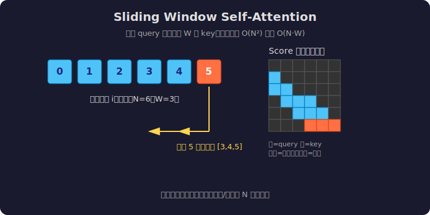

# LeetGPU Sliding Window Self-Attention 题解

## 1. 题目概述

- **标题 / 题号**：Sliding Window Self-Attention（#??，medium/hard）
- **链接**：https://leetgpu.com/challenges/sliding-window-self-attention
- **难度**：中等/困难
- **标签**：CUDA、Attention、sliding window、memory-bound、kernel fusion

**题意**：给定输入序列 `X ∈ R^(N×d)`，实现 **Sliding Window Self-Attention**：每个位置 `i` 的 query 只与左侧窗口 `[max(0, i-W+1), i]` 内的 `W` 个 key 做 attention，输出 `O ∈ R^(N×d)`。即

```text
S[i][j] = Q[i] · K[j]^T / sqrt(d)   for j ∈ [i-W+1, i]
P[i][j] = softmax(S[i][:] 在窗口内)
O[i] = Σ_j P[i][j] · V[j]
```

**示例**（`N=6, W=3, d=2`）：

```text
位置 0: attend []        → 输出 0
位置 1: attend [0]       → softmax 后加权
位置 2: attend [0,1]     → softmax 后加权
位置 3: attend [1,2]     → ...
位置 4: attend [2,3]
位置 5: attend [3,4]
```

**约束**：`N` 较大（如 16K/32K），`W << N`（如 128/256），`d` 较小（如 64）。

> 💡 Sliding Window Attention 是长文本优化的核心手段之一。与 [Week8 Day4 高频面试进阶篇](../../aiinfra/week8/day4/README.md) 的"长文本推理优化"主题直接对应——它用局部窗口把 attention 复杂度从 `O(N²)` 降到 `O(N·W)`，显著降低显存和计算。

---

## 2. CPU 基线 / 朴素 GPU 方法

### CPU 串行

```cpp
void cpu_sliding_window_attention(const float* Q, const float* K, const float* V, float* O, int N, int d, int W) {
    float scale = 1.0f / sqrtf((float)d);
    for (int i = 0; i < N; i++) {
        int win_start = max(0, i - W + 1);
        int win_len = i - win_start + 1;

        float max_val = -1e30f;
        for (int j = win_start; j <= i; j++) {
            float s = 0.0f;
            for (int k = 0; k < d; k++)
                s += Q[i * d + k] * K[j * d + k];
            s *= scale;
            max_val = fmaxf(max_val, s);
        }

        float sum = 0.0f;
        for (int j = win_start; j <= i; j++) {
            float s = 0.0f;
            for (int k = 0; k < d; k++)
                s += Q[i * d + k] * K[j * d + k];
            s *= scale;
            sum += expf(s - max_val);
        }

        for (int k = 0; k < d; k++)
            O[i * d + k] = 0.0f;
        for (int j = win_start; j <= i; j++) {
            float s = 0.0f;
            for (int k = 0; k < d; k++)
                s += Q[i * d + k] * K[j * d + k];
            s *= scale;
            float p = expf(s - max_val) / sum;
            for (int k = 0; k < d; k++)
                O[i * d + k] += p * V[j * d + k];
        }
    }
}
```

### 朴素 GPU：每个 thread 算一个 query 的完整窗口

```cuda
__global__ void sliding_window_attn_naive(const float* Q, const float* K, const float* V, float* O, int N, int d,
                                          int W) {
    int i = blockIdx.x * blockDim.x + threadIdx.x;
    if (i >= N)
        return;

    float scale = 1.0f / sqrtf((float)d);
    int win_start = max(0, i - W + 1);

    float max_val = -1e30f;
    for (int j = win_start; j <= i; j++) {
        float s = 0.0f;
        for (int k = 0; k < d; k++)
            s += Q[i * d + k] * K[j * d + k];
        max_val = fmaxf(max_val, s * scale);
    }

    float sum = 0.0f;
    for (int j = win_start; j <= i; j++) {
        float s = 0.0f;
        for (int k = 0; k < d; k++)
            s += Q[i * d + k] * K[j * d + k];
        sum += expf(s * scale - max_val);
    }

    for (int k = 0; k < d; k++)
        O[i * d + k] = 0.0f;
    for (int j = win_start; j <= i; j++) {
        float s = 0.0f;
        for (int k = 0; k < d; k++)
            s += Q[i * d + k] * K[j * d + k];
        float p = expf(s * scale - max_val) / sum;
        for (int k = 0; k < d; k++)
            O[i * d + k] += p * V[j * d + k];
    }
}
```

**瓶颈**：每个 thread 重复从 global memory 读取 Q/K/V，没有 shared memory 复用；窗口内反复计算 dot product。

---

## 3. GPU 设计

### 3.1 并行化策略：1 thread 处理 1 个 query，窗口内用 register 累加



核心策略：

1. 每个 thread 负责一个 query 位置 `i`
2. 把 `Q[i]` 读到 register（`d` 个 float）
3. 遍历窗口 `[win_start, i]` 内的每个 key `j`：
   - 读 `K[j]` 并算 dot product
   - 用 online softmax 维护 `max_val` 和 `sum`
4. 第二遍遍历窗口：读 `V[j]`，用 softmax 概率加权累加到 `O[i]`

### 3.2 存储层次使用

| 数据 | 存储 | 说明 |
|------|------|------|
| `Q`, `K`, `V`, `O` | global memory | 连续行优先存储 |
| `q_vec[d]` | register | 当前 query，避免重复读 |
| `k_vec[d]`, `v_vec[d]` | register | 当前 key/value，从 global 读入 |
| `max_val`, `sum`, `acc[d]` | register | online softmax 状态与输出累加器 |

### 3.3 关键技巧

- **局部窗口**：只读 `W` 个 key，HBM 访问从 `O(N²)` 降到 `O(N·W)`
- **online softmax**：一遍求 max，二遍求 sum，避免物化 score 矩阵
- **融合 output 累加**：第三遍直接加权 `V`，不把 `P` 写回 HBM
- **coalesced access**：相邻 thread 读相邻 key 行，global memory 合并

---

## 4. Kernel 实现

```cuda
// sliding_window_attention.cu —— Sliding Window Self-Attention
// 编译命令: nvcc -O3 -arch=sm_120 sliding_window_attention.cu -o swa
// 运行:     ./swa

#include <cstdio>
#include <cmath>
#include <vector>
#include <algorithm>
#include <cuda_runtime.h>

#define BLOCK 256

__global__ void sliding_window_attention_kernel(const float* Q, const float* K, const float* V, float* O, int N, int d,
                                                int W) {
    int i = blockIdx.x * blockDim.x + threadIdx.x;
    if (i >= N)
        return;

    float scale = 1.0f / sqrtf((float)d);
    int win_start = max(0, i - W + 1);

    // 把当前 Q[i] 读到 register
    extern __shared__ float s_q[]; // 可选：block 内共享当前 tile 的 Q
    // 简化版：直接用 register
    float q[64]; // 假设 d <= 64
    for (int k = 0; k < d; k++)
        q[k] = Q[i * d + k];

    // 第一遍：求窗口内 max score
    float m = -1e30f;
    for (int j = win_start; j <= i; j++) {
        float s = 0.0f;
        for (int k = 0; k < d; k++)
            s += q[k] * K[j * d + k];
        m = fmaxf(m, s * scale);
    }

    // 第二遍：求 softmax 分母
    float l = 0.0f;
    for (int j = win_start; j <= i; j++) {
        float s = 0.0f;
        for (int k = 0; k < d; k++)
            s += q[k] * K[j * d + k];
        l += expf(s * scale - m);
    }

    // 第三遍：加权 V 得到输出
    for (int k = 0; k < d; k++)
        O[i * d + k] = 0.0f;
    for (int j = win_start; j <= i; j++) {
        float s = 0.0f;
        for (int k = 0; k < d; k++)
            s += q[k] * K[j * d + k];
        float p = expf(s * scale - m) / l;
        for (int k = 0; k < d; k++)
            O[i * d + k] += p * V[j * d + k];
    }
}

int main() {
    int N = 4096, d = 64, W = 256;
    size_t bytes = (size_t)N * d * sizeof(float);
    std::vector<float> h_Q(N * d), h_K(N * d), h_V(N * d), h_O(N * d), h_O_CPU(N * d);
    srand(42);
    for (auto& x : h_Q)
        x = (rand() % 200 - 100) / 50.0f;
    for (auto& x : h_K)
        x = (rand() % 200 - 100) / 50.0f;
    for (auto& x : h_V)
        x = (rand() % 200 - 100) / 50.0f;

    float *d_Q, *d_K, *d_V, *d_O;
    cudaMalloc(&d_Q, bytes);
    cudaMalloc(&d_K, bytes);
    cudaMalloc(&d_V, bytes);
    cudaMalloc(&d_O, bytes);
    cudaMemcpy(d_Q, h_Q.data(), bytes, cudaMemcpyHostToDevice);
    cudaMemcpy(d_K, h_K.data(), bytes, cudaMemcpyHostToDevice);
    cudaMemcpy(d_V, h_V.data(), bytes, cudaMemcpyHostToDevice);

    int grid = (N + BLOCK - 1) / BLOCK;
    sliding_window_attention_kernel<<<grid, BLOCK>>>(d_Q, d_K, d_V, d_O, N, d, W);
    cudaMemcpy(h_O.data(), d_O, bytes, cudaMemcpyDeviceToHost);

    // CPU 验证
    float scale = 1.0f / sqrtf((float)d);
    for (int i = 0; i < N; i++) {
        int win_start = std::max(0, i - W + 1);
        float m = -1e30f;
        for (int j = win_start; j <= i; j++) {
            float s = 0.0f;
            for (int k = 0; k < d; k++)
                s += h_Q[i * d + k] * h_K[j * d + k];
            m = fmaxf(m, s * scale);
        }
        float l = 0.0f;
        for (int j = win_start; j <= i; j++) {
            float s = 0.0f;
            for (int k = 0; k < d; k++)
                s += h_Q[i * d + k] * h_K[j * d + k];
            l += expf(s * scale - m);
        }
        for (int k = 0; k < d; k++)
            h_O_CPU[i * d + k] = 0.0f;
        for (int j = win_start; j <= i; j++) {
            float s = 0.0f;
            for (int k = 0; k < d; k++)
                s += h_Q[i * d + k] * h_K[j * d + k];
            float p = expf(s * scale - m) / l;
            for (int k = 0; k < d; k++)
                h_O_CPU[i * d + k] += p * h_V[j * d + k];
        }
    }

    bool pass = true;
    for (int i = 0; i < N * d; i++)
        if (fabsf(h_O[i] - h_O_CPU[i]) > 1e-3f) {
            pass = false;
            break;
        }
    printf("Sliding Window Attention N=%d d=%d W=%d: %s\n", N, d, W, pass ? "PASS" : "FAIL");

    cudaFree(d_Q);
    cudaFree(d_K);
    cudaFree(d_V);
    cudaFree(d_O);
    return 0;
}
```

> 💡 提交给 LeetGPU 平台时，把 kernel 主体填进 `solve` 函数。教学版为了本地可运行加了 `main()` 和 CPU 验证。

---

## 5. 性能分析与优化

```bash
nvcc -O3 -arch=sm_120 sliding_window_attention.cu -o swa
ncu --set full --target-processes all ./swa
```

| 优化方向 | 收益 |
|----------|------|
| **Shared memory Q/K tile** | 同一 block 内 query 复用 K 行，减少 global 读 |
| **Online softmax 一遍过** | 省掉 score 矩阵 HBM 往返 |
| **Warp-level reduce** | 窗口内 dot product 用 warp 并行，提高 compute intensity |
| **d 用编译期常量/pragma unroll** | 小 d 时循环展开，减少指令数 |
| **TF32/FP16** | 在精度允许下用 Tensor Core 加速 matmul |

---

## 6. 复杂度分析

| 维度 | 标准 Self-Attention | Sliding Window |
|------|---------------------|----------------|
| 时间 | `O(N²·d)` | `O(N·W·d)` |
| 显存 | `O(N²)` score + `O(N·d)` Q/K/V | `O(N·d)` Q/K/V，不物化 score |
| 适用场景 | 短序列 | 长序列、局部相关性强的任务 |

> 💡 **一句话总结**：Sliding Window Self-Attention 用固定局部窗口把 attention 从二次方降到线性，是长文本推理的重要优化。实现核心是"只算窗口、不存 score、online softmax 一遍过"。
