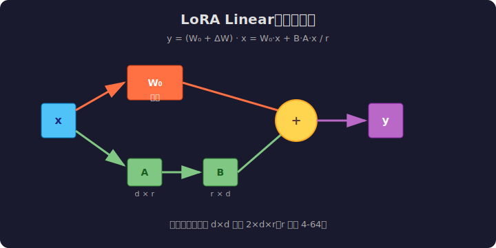

# LeetGPU LoRA Linear 题解

## 1. 题目概述

- **标题 / 题号**：LoRA Linear（#??，medium）
- **链接**：https://leetgpu.com/challenges/lora-linear
- **难度**：中等
- **标签**：CUDA、Low-Rank Adaptation、矩阵乘法、参数高效微调

**题意**：实现 LoRA（Low-Rank Adaptation）线性层前向传播：

```text
y = (W + ΔW) · x = W · x + (B · A) · x / r
```

其中：

- `W ∈ R^(m×n)`：预训练权重，**推理时冻结**
- `A ∈ R^(r×n)`、`B ∈ R^(m×r)`：低秩适配矩阵，`r << min(m,n)`
- `x ∈ R^n`：输入向量
- `y ∈ R^m`：输出向量

**示例**（`m=4, n=8, r=2`）：

```text
x:     [8]
A:     [2 × 8]
h = A·x / r: [2]
B:     [4 × 2]
y0 = B·h:    [4]
y1 = W·x:    [4]
y = y1 + y0: [4]
```

**约束**：`m,n` 中等（如 1024/4096），`r` 很小（4~64）。

> 💡 LoRA 是面试高频考点，与 [Week8 Day5 Mock 面试](../../aiinfra/week8/day5/README.md) 的"项目深度拷问"环节直接呼应：讲清楚 LoRA 为什么省显存、什么时候用、训练/推理怎么部署，是向面试官展示 LLM 工程能力的关键。

---

## 2. CPU 基线 / 朴素 GPU 方法

### CPU 串行

```cpp
void cpu_lora(const float* W, const float* A, const float* B, const float* x, float* y, int m, int n, int r) {
    // base: y0 = W * x
    for (int i = 0; i < m; i++) {
        float s = 0.0f;
        for (int k = 0; k < n; k++)
            s += W[i * n + k] * x[k];
        y[i] = s;
    }
    // h = A * x / r
    std::vector<float> h(r);
    for (int j = 0; j < r; j++) {
        float s = 0.0f;
        for (int k = 0; k < n; k++)
            s += A[j * n + k] * x[k];
        h[j] = s / r;
    }
    // delta = B * h, add to y
    for (int i = 0; i < m; i++) {
        float s = 0.0f;
        for (int j = 0; j < r; j++)
            s += B[i * r + j] * h[j];
        y[i] += s;
    }
}
```

### 朴素 GPU：每个 thread 算一个输出元素

```cuda
__global__ void lora_naive(const float* W, const float* A, const float* B, const float* x, float* y, int m, int n,
                           int r) {
    int i = blockIdx.x * blockDim.x + threadIdx.x;
    if (i >= m)
        return;

    // y0 = W[i,:] · x
    float y0 = 0.0f;
    for (int k = 0; k < n; k++)
        y0 += W[i * n + k] * x[k];

    // h = A · x / r, then delta = B[i,:] · h
    float delta = 0.0f;
    for (int j = 0; j < r; j++) {
        float s = 0.0f;
        for (int k = 0; k < n; k++)
            s += A[j * n + k] * x[k];
        delta += B[i * r + j] * (s / r);
    }
    y[i] = y0 + delta;
}
```

**瓶颈**：`A·x` 被每个 thread 重复计算，且 `x` 被重复从 global memory 读取。

---

## 3. GPU 设计

### 3.1 并行化策略：1 block 算完整向量，共享 h



核心策略：

1. 把整个输入 `x` 分配给 1 个 block
2. 先用 **r 个 thread** 并行计算 `h = A · x / r`，结果存在 **shared memory**
3. 再用 **m 个 thread** 分别计算 `W[i,:]·x` 和 `B[i,:]·h`，最后相加
4. 若 `m` 很大，可对 `W`/`B` 输出做分块

### 3.2 存储层次使用

| 数据 | 存储 | 说明 |
|------|------|------|
| `W`, `A`, `B`, `x` | global memory | 行优先连续存储 |
| `h[r]` | shared memory | block 内所有 thread 复用 |
| `x[n]` | shared memory | 一次性读入 block，减少全局访存 |
| 部分和 | register | 每个 thread 累加自己的 dot product |

### 3.3 关键技巧

- **融合低秩适配**：不把 `ΔW` 展开，而是先算 `h`，再乘 `B`，把 `O(m·n)` 降到 `O(r·(m+n))`
- **共享 h**：避免每个输出 thread 重复算 `A·x`
- **共享 x**：`W·x` 和 `A·x` 都需要 `x`，只读一次 global memory
- **合并访问**：相邻 thread 读 `W`/`B` 的同一行时，按行优先 stride 访问

---

## 4. Kernel 实现

```cuda
// lora_linear.cu —— LoRA Linear forward
// 编译命令: nvcc -O3 -arch=sm_120 lora_linear.cu -o lora
// 运行:     ./lora

#include <cstdio>
#include <cmath>
#include <vector>
#include <cuda_runtime.h>

#define BLOCK 256

__global__ void lora_linear_kernel(const float* W, const float* A, const float* B, const float* x, float* y, int m,
                                   int n, int r) {
    extern __shared__ float sbuf[]; // x[?] + h[r]
    float* s_x = sbuf;
    float* s_h = sbuf + n;

    int tid = threadIdx.x;
    int total = m;

    // 1) 协作加载 x 到 shared memory
    for (int k = tid; k < n; k += blockDim.x)
        s_x[k] = x[k];
    __syncthreads();

    // 2) 并行计算 h[j] = (A[j,:] · s_x) / r
    for (int j = tid; j < r; j += blockDim.x) {
        float s = 0.0f;
        for (int k = 0; k < n; k++)
            s += A[j * n + k] * s_x[k];
        s_h[j] = s / r;
    }
    __syncthreads();

    // 3) 每个 thread 算一个输出元素 y[i]
    for (int i = blockIdx.x * blockDim.x + tid; i < m; i += blockDim.x * gridDim.x) {
        float y0 = 0.0f;
        for (int k = 0; k < n; k++)
            y0 += W[i * n + k] * s_x[k];

        float delta = 0.0f;
        for (int j = 0; j < r; j++)
            delta += B[i * r + j] * s_h[j];

        y[i] = y0 + delta;
    }
}

int main() {
    int m = 1024, n = 512, r = 16;
    size_t Wbytes = (size_t)m * n * sizeof(float);
    size_t Abytes = (size_t)r * n * sizeof(float);
    size_t Bbytes = (size_t)m * r * sizeof(float);
    size_t xbytes = (size_t)n * sizeof(float);
    size_t ybytes = (size_t)m * sizeof(float);

    std::vector<float> h_W(m * n), h_A(r * n), h_B(m * r), h_x(n), h_y(m), h_y_cpu(m);
    srand(42);
    for (auto& v : h_W)
        v = (rand() % 200 - 100) / 100.0f;
    for (auto& v : h_A)
        v = (rand() % 200 - 100) / 100.0f;
    for (auto& v : h_B)
        v = (rand() % 200 - 100) / 100.0f;
    for (auto& v : h_x)
        v = (rand() % 200 - 100) / 100.0f;

    float *d_W, *d_A, *d_B, *d_x, *d_y;
    cudaMalloc(&d_W, Wbytes);
    cudaMalloc(&d_A, Abytes);
    cudaMalloc(&d_B, Bbytes);
    cudaMalloc(&d_x, xbytes);
    cudaMalloc(&d_y, ybytes);
    cudaMemcpy(d_W, h_W.data(), Wbytes, cudaMemcpyHostToDevice);
    cudaMemcpy(d_A, h_A.data(), Abytes, cudaMemcpyHostToDevice);
    cudaMemcpy(d_B, h_B.data(), Bbytes, cudaMemcpyHostToDevice);
    cudaMemcpy(d_x, h_x.data(), xbytes, cudaMemcpyHostToDevice);

    int smem = (n + r) * sizeof(float);
    int grid = std::min(64, (m + BLOCK - 1) / BLOCK);
    lora_linear_kernel<<<grid, BLOCK, smem>>>(d_W, d_A, d_B, d_x, d_y, m, n, r);
    cudaMemcpy(h_y.data(), d_y, ybytes, cudaMemcpyDeviceToHost);

    // CPU reference
    for (int i = 0; i < m; i++) {
        float y0 = 0.0f;
        for (int k = 0; k < n; k++)
            y0 += h_W[i * n + k] * h_x[k];
        std::vector<float> h(r);
        for (int j = 0; j < r; j++) {
            float s = 0.0f;
            for (int k = 0; k < n; k++)
                s += h_A[j * n + k] * h_x[k];
            h[j] = s / r;
        }
        float delta = 0.0f;
        for (int j = 0; j < r; j++)
            delta += h_B[i * r + j] * h[j];
        h_y_cpu[i] = y0 + delta;
    }

    bool pass = true;
    for (int i = 0; i < m; i++)
        if (fabsf(h_y[i] - h_y_cpu[i]) > 1e-3f) {
            pass = false;
            break;
        }
    printf("LoRA m=%d n=%d r=%d: %s\n", m, n, r, pass ? "PASS" : "FAIL");

    cudaFree(d_W);
    cudaFree(d_A);
    cudaFree(d_B);
    cudaFree(d_x);
    cudaFree(d_y);
    return 0;
}
```

> 💡 提交给 LeetGPU 平台时，把 kernel 主体填进 `solve` 函数。教学版为了本地可运行加了 `main()` 和 CPU 验证。

---

## 5. 性能分析与优化

```bash
nvcc -O3 -arch=sm_120 lora_linear.cu -o lora
ncu --set full --target-processes all ./lora
```

| 优化方向 | 收益 |
|----------|------|
| **共享 x 与共享 h** | 避免每个 thread 重复从 global 读 `x`，避免重复算 `A·x` |
| **合并 base + LoRA 输出** | 一次 kernel 完成 `W·x + B·(A·x/r)`，不物化 `ΔW` |
| **按 m 分块并行** | 多个 block 同时算不同输出子集，隐藏延迟 |
| **使用 cuBLAS/WMMA** | 大批量场景下用 `cublasSgemv`，低秩部分仍手写 |
| **FP16/BF16 + Tensor Core** | 推理时降低显存、提升吞吐，注意 scale 和累加精度 |

---

## 6. 复杂度分析

| 方法 | 参数量 | 乘法次数 |
|------|--------|----------|
| 全量微调 `ΔW` | `m·n` | `m·n` |
| LoRA | `r·(m+n)` | `r·n + m·r` |

当 `r << min(m,n)` 时，LoRA 把可训练参数和额外计算都降到原来的 `~r/max(m,n)`。

> 💡 **一句话总结**：LoRA Linear 的核心是"不把低秩更新物化到完整权重，而是先降维再升维"。GPU 实现要点是共享 `x` 和 `h`，并把 `W·x` 与 `B·h` 在一个 kernel 内融合完成，从而最小化 HBM 访问。
