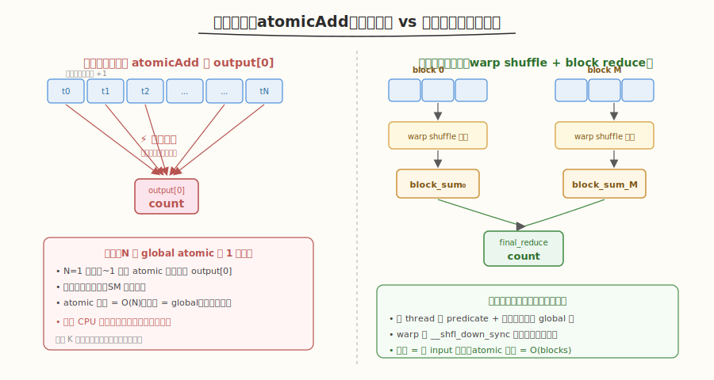
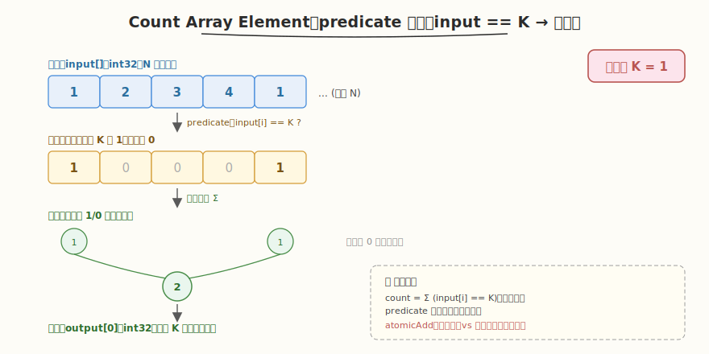
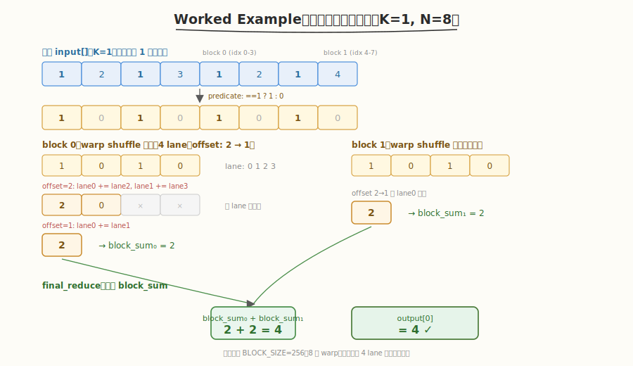

# LeetGPU Count Array Element 题解

## 1. 题目概述

- **标题 / 题号**：Count Array Element（#43，medium）
- **链接**：https://leetgpu.com/challenges/count-array-element
- **难度**：中等
- **标签**：CUDA、归约（reduction）、`atomicAdd`、predicate、warp shuffle、memory-bound

**题意**：给定长度为 `N` 的 `int32` 数组 `input` 与目标值 `K`，统计数组中等于 `K` 的元素个数，结果写入单个 `int32` 输出 `output[0]`。即 `output[0] = #{i | input[i] == K}`。

**示例**：

```text
输入：input = [1, 2, 3, 4, 1], K = 1
输出：output[0] = 2   （第 0、4 个元素等于 1）
```

**约束**：

- `1 ≤ N ≤ 100,000,000`（1 亿）
- `input` 与 `output` 均为 `int32`
- 性能测试取 `N = 100,000,000`，`K = 501010`（命中稀疏，约千分之一命中）

> 💡 这道题是 **predicate 归约**的经典练习——把"等于 K 吗"的布尔判定转成 1/0，再对所有 1/0 求和。它与 [#4 Reduction](https://leetgpu.com/challenges/reduction) 同源，但多了一层"先判定再归约"的融合；与 [#13 Histogramming](https://leetgpu.com/challenges/histogramming) 的差异在于：直方图是"多对少写"（写竞争是瓶颈），而本题输出只有**一个**标量，瓶颈从"写冲突"转移到了"读带宽"。这恰好把 **atomic vs 树形归约**两种解法摆在一起对比，是理解"何时该用 atomic、何时该用归约"的最佳切入点。

## 2. CPU 基线 / 朴素 GPU 方法

### 2.1 CPU 串行基线

```cpp
// cpu_baseline.cpp —— CPU 单 pass 计数
int count_cpu(const int* input, int N, int K) {
    int cnt = 0;
    for (int i = 0; i < N; ++i)
        cnt += (input[i] == K);   // 布尔隐式转 0/1
    return cnt;
}
```

`N = 1 亿`时单核约 30-50 ms。CPU 的优势是**完全顺序**——累加器 `cnt` 一直在寄存器里，没有竞争。瓶颈是单线程内存带宽有限。

### 2.2 朴素 GPU：atomicAdd 到单个全局地址

最暴力的并行：每个 thread 读一个元素，判定等于 `K` 后用 `atomicAdd` 把 1 累加到全局 `output[0]`。

```cuda
__global__ void count_naive(const int* input, int* output, int N, int K) {
    int i = blockIdx.x * blockDim.x + threadIdx.x;
    if (i < N) {
        if (input[i] == K)
            atomicAdd(&output[0], 1);   // ← 所有命中线程抢同一个地址！
    }
}
```

**致命问题**：性能测试中 `K = 501010`、`N = 1 亿`，值域 `[1, 100000]`，命中数约 0（`K` 超出值域）到稀疏。但当 `K` 命中较多时（如 `K` 在值域内、约千分之一命中即 ~10 万次），这 10 万次 `atomicAdd` 全部撞在 `output[0]` **同一个地址**上。GPU 的 `atomicAdd` 对同一地址**硬件串行化**——同一时刻只有一个 warp 的那次加法能成功，其余全部排队。实测下来朴素版在命中密集时**常常比 CPU 还慢数倍**。



> ⚠️ 本题的瓶颈看似是"读 input 带宽"，但朴素 atomic 版的真正瓶颈是 **单地址写串行化**。优化方向必须是**消除对 `output[0]` 的并发写**，而不是堆 thread 数。解法是把"N 次全局 atomic"换成"零全局 atomic 的树形归约"——只在最后由一个线程写出结果。

## 3. GPU 设计

### 3.1 并行化策略：predicate + 两级树形归约

核心思想：**把"计数"重写成"判定（1/0）后求和"**，从而完全复用 [#4 Reduction](./leetgpu-reduction-solution.md) 的两阶段归约骨架，**全程不发任何 atomic**。



三步走：

1. **predicate 计算**：每 thread 用 grid-stride 读多个元素，对每个元素算 `(input[i] == K)`（布尔转 1/0），累加到线程局部计数 `cnt`。这一步把"判定"和"局部求和"融合在寄存器里完成，无任何全局写。
2. **block 内归约**：每个 block 用 warp shuffle（`__shfl_down_sync`）+ shared memory 把所有线程的 `cnt` 归约成 `block_sum`，写入 `output[blockIdx.x]`。
3. **跨 block 归约**：用第二个 kernel `final_reduce` 把所有 `block_sum` 再归约一次，结果写入 `output[0]`。

> 💡 **为什么归约比 atomic 快**：归约的写次数是 `O(numBlocks)`（每个 block 只写一次自己的部分和），而 atomic 版是 `O(命中数)` 次抢同一地址。更关键的是，归约版的所有中间累加都在**寄存器/shared memory**里完成，**只读 input、不写 global**（除最后每个 block 一次写），瓶颈干净地落在"读 input 带宽"上——这正是 memory-bound kernel 最理想的状态。

### 3.2 存储层次使用

| 层次 | 是否使用 | 说明 |
|------|----------|------|
| **global memory** | ✓ | `input[]` 只读；`output[]` 先存各 block 部分和，再存最终计数 |
| **shared memory** | ✓ | `warp_sums[]` 存各 warp 的部分和（`BLOCK_SIZE/WARP_SIZE` 个 int），用于 warp 间归约 |
| **register** | ✓ | 每线程的局部计数 `cnt`、predicate 判定结果、warp shuffle 中间值 |

### 3.3 关键技巧

| 技巧 | 作用 | 收益 |
|------|------|------|
| **predicate 融合** | `(input[i] == K)` 直接累加到 `cnt`，不生成中间 0/1 数组 | 省一次全局写 + 一次全局读，kernel 融合 |
| **grid-stride loop** | 每 thread 跨步处理多个元素 | 少量 block 覆盖全部 N，降低 launch 开销 |
| **warp shuffle `__shfl_down_sync`** | warp 内 32 lane 树形归约 | 寄存器内完成，零 bank conflict、零 `__syncthreads` |
| **两阶段归约** | block 归约 → final 归约 | 全程零 global atomic，瓶颈转移至读带宽 |
| **int32 累加** | 计数用 `int` 而非 `float` | 无精度损失，`atomicAdd` 对 `int` 原生支持 |

> ⚠️ **何时该用 atomic、何时该用归约**：当输出是**少量标量**且**写者众多**时（如本题的 `output[0]`、直方图的 `hist[b]`），atomic 会因单地址串行化而崩溃——此时用归约（或 privatization）。反之，当输出是**大量互不相同的地址**（如 scatter 写回、每线程写自己的位置），atomic 几乎无竞争，直接用即可。本题是前者的典型：**一个标量、N 个写者 → 必须归约**。

## 4. Kernel 实现

完整可编译的两阶段归约版本（含朴素 atomic 版对比 + CPU 验证）：

```cuda
// count_array_element.cu —— Count Array Element（predicate + 两级归约）
// 编译命令: nvcc -O3 -arch=sm_120 count_array_element.cu -o count_array
// 运行:     ./count_array 100000000 501010

#include <cstdio>
#include <cstdlib>
#include <cuda_runtime.h>

#define BLOCK_SIZE 256
#define WARP_SIZE 32

#define CHECK_CUDA(call) do {                                              \
    cudaError_t e = (call);                                                \
    if (e != cudaSuccess) {                                                \
        fprintf(stderr, "CUDA error %s:%d: %s\n", __FILE__, __LINE__,      \
                cudaGetErrorString(e));                                     \
        exit(EXIT_FAILURE);                                                \
    }                                                                      \
} while (0)

// warp 内树形归约（__shfl_down_sync），对 int 同样适用
__inline__ __device__ int warp_reduce(int val) {
    #pragma unroll
    for (int offset = WARP_SIZE / 2; offset > 0; offset >>= 1)
        val += __shfl_down_sync(0xffffffff, val, offset);
    return val;
}

// 朴素版：命中线程 atomicAdd 到单个全局地址（剧烈竞争，用于对比基准）
__global__ void count_naive(const int* input, int* output, int N, int K) {
    int i = blockIdx.x * blockDim.x + threadIdx.x;
    if (i < N) {
        if (input[i] == K)
            atomicAdd(&output[0], 1);
    }
}

// 优化版：predicate + grid-stride 局部计数 + 两级归约，全程零 global atomic
__global__ void count_kernel(const int* input, int* output, int N, int K) {
    __shared__ int warp_sums[BLOCK_SIZE / WARP_SIZE];

    int tid = threadIdx.x;
    int gid = blockIdx.x * blockDim.x + tid;
    int stride = gridDim.x * blockDim.x;
    int warp_id = tid / WARP_SIZE;
    int lane = tid % WARP_SIZE;

    // ① grid-stride 读输入，predicate 判定 + 局部计数（寄存器内累加）
    int cnt = 0;
    for (int i = gid; i < N; i += stride) {
        cnt += (input[i] == K);   // 布尔隐式转 0/1，融合判定与求和
    }

    // ② warp 内归约：32 lane 的 cnt 树形归约到 lane 0
    cnt = warp_reduce(cnt);
    if (lane == 0)
        warp_sums[warp_id] = cnt;   // 8 个 warp 的部分和写入 shared
    __syncthreads();

    // ③ warp 间归约：由第一个 warp 把 8 个 warp_sums 再归约一次
    if (warp_id == 0) {
        cnt = (lane < BLOCK_SIZE / WARP_SIZE) ? warp_sums[lane] : 0;
        cnt = warp_reduce(cnt);
        if (lane == 0)
            output[blockIdx.x] = cnt;   // block 的总命中数写入 global
    }
}

// final 归约：聚合所有 block 的部分和到 output[0]
__global__ void final_reduce(int* output, int num_blocks) {
    __shared__ int warp_sums[BLOCK_SIZE / WARP_SIZE];

    int tid = threadIdx.x;
    int val = (tid < num_blocks) ? output[tid] : 0;
    val = warp_reduce(val);
    if (tid % WARP_SIZE == 0)
        warp_sums[tid / WARP_SIZE] = val;
    __syncthreads();

    if (tid < WARP_SIZE) {
        val = (tid < BLOCK_SIZE / WARP_SIZE) ? warp_sums[tid] : 0;
        val = warp_reduce(val);
        if (tid == 0)
            output[0] = val;
    }
}

int main(int argc, char** argv) {
    int N = (argc > 1) ? atoi(argv[1]) : 100000000;
    int K = (argc > 2) ? atoi(argv[2]) : 501010;
    size_t bytes = (size_t)N * sizeof(int);
    printf("N = %d, K = %d  (%.1f MB input)\n", N, K, bytes / 1e6);

    // ---- host 端 ----
    int* hIn = (int*)malloc(bytes);
    srand(42);
    for (int i = 0; i < N; ++i)
        hIn[i] = (rand() % 100000) + 1;   // 值域 [1, 100000]

    // ---- device 端 ----
    int *dIn, *dOut;
    CHECK_CUDA(cudaMalloc(&dIn, bytes));
    CHECK_CUDA(cudaMalloc(&dOut, sizeof(int)));   // 优化版临时复用为部分和缓冲
    CHECK_CUDA(cudaMemcpy(dIn, hIn, bytes, cudaMemcpyHostToDevice));

    int num_sm;
    CHECK_CUDA(cudaDeviceGetAttribute(&num_sm, cudaDevAttrMultiProcessorCount, 0));
    int blocks = num_sm * 8;   // 经验值，保证 wave 充足但不过载
    if (blocks > (N + BLOCK_SIZE - 1) / BLOCK_SIZE)
        blocks = (N + BLOCK_SIZE - 1) / BLOCK_SIZE;
    printf("blocks = %d, threads/block = %d\n", blocks, BLOCK_SIZE);

    cudaEvent_t t0, t1;
    cudaEventCreate(&t0);
    cudaEventCreate(&t1);

    // ---- CPU 验证 ----
    int ref = 0;
    for (int i = 0; i < N; ++i)
        ref += (hIn[i] == K);

    // ---- 优化版：两阶段归约 ----
    CHECK_CUDA(cudaMemset(dOut, 0, sizeof(int)));
    cudaEventRecord(t0);
    count_kernel<<<blocks, BLOCK_SIZE>>>(dIn, dOut, N, K);
    final_reduce<<<1, BLOCK_SIZE>>>(dOut, blocks);
    cudaEventRecord(t1);
    CHECK_CUDA(cudaDeviceSynchronize());
    float ms_opt = 0.0f;
    cudaEventElapsedTime(&ms_opt, t0, t1);
    int hOut;
    CHECK_CUDA(cudaMemcpy(&hOut, dOut, sizeof(int), cudaMemcpyDeviceToHost));
    printf("[reduction]  time: %.3f ms  result: %d  ref: %d  %s\n", ms_opt, hOut, ref,
           hOut == ref ? "PASS" : "FAIL");

    // ---- 朴素版：atomicAdd ----
    CHECK_CUDA(cudaMemset(dOut, 0, sizeof(int)));
    int naive_blocks = (N + BLOCK_SIZE - 1) / BLOCK_SIZE;
    cudaEventRecord(t0);
    count_naive<<<naive_blocks, BLOCK_SIZE>>>(dIn, dOut, N, K);
    cudaEventRecord(t1);
    CHECK_CUDA(cudaDeviceSynchronize());
    float ms_naive = 0.0f;
    cudaEventElapsedTime(&ms_naive, t0, t1);
    CHECK_CUDA(cudaMemcpy(&hOut, dOut, sizeof(int), cudaMemcpyDeviceToHost));
    printf("[atomic]     time: %.3f ms  result: %d  ref: %d  %s  speedup: %.2fx\n",
           ms_naive, hOut, ref, hOut == ref ? "PASS" : "FAIL", ms_naive / ms_opt);

    // ---- 带宽估算（只算读 input 的量）----
    float bw_gbs = (bytes / 1e9) / (ms_opt / 1e3);
    printf("read bandwidth (reduction): %.1f GB/s\n", bw_gbs);

    CHECK_CUDA(cudaFree(dIn));
    CHECK_CUDA(cudaFree(dOut));
    free(hIn);
    return 0;
}
```

> 💡 提交给 LeetGPU 平台时，把 `count_kernel` + `final_reduce` 填进 `solve` 函数即可。注意 `output` 既是输入（平台可能未清零）也是输出，需先 `cudaMemset` 或在 final kernel 直接覆盖写。带 `main()` 的版本用于本地自测与性能对比。

### 4.1 LeetGPU 提交版本

下面给出适配官方 starter 签名 `solve(input, output, N, K)` 的提交版本。先用 `count_kernel` 算各 block 部分和（复用 `output` 之后的空间需注意：此处 `output` 仅 1 个 int，故另开一块临时缓冲存放部分和），再用 `final_reduce` 聚合到 `output[0]`。

```cuda
#include <cuda_runtime.h>

#define BLOCK_SIZE 256
#define WARP_SIZE 32

__inline__ __device__ int warp_reduce(int val) {
    #pragma unroll
    for (int offset = WARP_SIZE / 2; offset > 0; offset >>= 1)
        val += __shfl_down_sync(0xffffffff, val, offset);
    return val;
}

__global__ void count_kernel(const int* input, int* partial, int N, int K) {
    __shared__ int warp_sums[BLOCK_SIZE / WARP_SIZE];

    int tid = threadIdx.x;
    int gid = blockIdx.x * blockDim.x + tid;
    int stride = gridDim.x * blockDim.x;
    int warp_id = tid / WARP_SIZE;
    int lane = tid % WARP_SIZE;

    int cnt = 0;
    for (int i = gid; i < N; i += stride) {
        cnt += (input[i] == K);
    }

    cnt = warp_reduce(cnt);
    if (lane == 0)
        warp_sums[warp_id] = cnt;
    __syncthreads();

    if (warp_id == 0) {
        cnt = (lane < BLOCK_SIZE / WARP_SIZE) ? warp_sums[lane] : 0;
        cnt = warp_reduce(cnt);
        if (lane == 0)
            partial[blockIdx.x] = cnt;
    }
}

__global__ void final_reduce(const int* partial, int* output, int num_blocks) {
    __shared__ int warp_sums[BLOCK_SIZE / WARP_SIZE];

    int tid = threadIdx.x;
    int val = (tid < num_blocks) ? partial[tid] : 0;
    val = warp_reduce(val);
    if (tid % WARP_SIZE == 0)
        warp_sums[tid / WARP_SIZE] = val;
    __syncthreads();

    if (tid < WARP_SIZE) {
        val = (tid < BLOCK_SIZE / WARP_SIZE) ? warp_sums[tid] : 0;
        val = warp_reduce(val);
        if (tid == 0)
            output[0] = val;
    }
}

// input, output are device pointers
extern "C" void solve(const int* input, int* output, int N, int K) {
    if (N <= 0) {
        cudaMemset(output, 0, sizeof(int));
        return;
    }

    int num_sm;
    cudaDeviceGetAttribute(&num_sm, cudaDevAttrMultiProcessorCount, 0);
    int blocks = num_sm * 8;
    int max_blocks = (N + BLOCK_SIZE - 1) / BLOCK_SIZE;
    if (blocks > max_blocks)
        blocks = max_blocks;
    if (blocks < 1)
        blocks = 1;

    int* partial;
    cudaMalloc(&partial, blocks * sizeof(int));

    count_kernel<<<blocks, BLOCK_SIZE>>>(input, partial, N, K);
    final_reduce<<<1, BLOCK_SIZE>>>(partial, output, blocks);

    cudaFree(partial);
}
```

### 4.2 代码详解

`count_kernel` 采用 **predicate 融合 + 两级归约**结构：grid-stride 读输入时直接把判定结果累加到线程局部计数，再经 warp shuffle → shared memory → block_sum 三层归约，全程不写 global（除最后每 block 一次）。

**代码块逐段解析**：

| 步骤 | 代码 | 说明 |
|------|------|------|
| **局部计数** | `cnt += (input[i] == K)` | predicate 判定（布尔转 0/1）与局部求和融合在寄存器内，grid-stride 让每线程处理多个元素 |
| **warp 归约** | `cnt = warp_reduce(cnt)` | `__shfl_down_sync` 把 32 lane 的 `cnt` 树形归约到 lane 0，寄存器内完成 |
| **写 shared** | `warp_sums[warp_id] = cnt` | 仅每 warp 的 lane 0 写入，8 个 warp 的部分和落 shared |
| **同步** | `__syncthreads()` | 保证 8 个 warp 都写完 `warp_sums` 后，第一个 warp 才读——否则读到未初始化数据 |
| **warp 间归约** | `warp_reduce(warp_sums[lane])` | 第一个 warp 把 8 个 `warp_sums` 再归约一次，lane 0 得 block 总命中数 |
| **写回** | `output[blockIdx.x] = cnt` | 每个 block 只写一次自己的部分和，零 atomic 冲突 |

**关键索引关系**：

- `gid = blockIdx.x * blockDim.x + threadIdx.x` — 全局线程下标，grid-stride 起点
- `stride = gridDim.x * blockDim.x` — grid-stride 步长，少量 block 覆盖全部 N
- `warp_id = threadIdx.x / WARP_SIZE` — block 内 warp 编号，范围 `[0, 8)`
- `lane = threadIdx.x % WARP_SIZE` — warp 内 lane 编号，范围 `[0, 32)`
- `warp_sums[warp_id]` — shared memory 中各 warp 的部分和
- `partial[blockIdx.x]` — 每个 block 的总命中数（final_reduce 的输入）

**`__syncthreads()` 的作用**：阶段②中只有每个 warp 的 lane 0 写了 `warp_sums`，阶段③由第一个 warp 读取 `warp_sums`。`__syncthreads()` 保证所有 warp 都完成写入后第一个 warp 才开始读——否则会读到未初始化或半写入的数据。这是 **warp 间同步的必要屏障**（warp 内的 `warp_reduce` 不需要它，因为 warp 内 SIMT 天然同步）。



**完整示例**：`BLOCK_SIZE=256`（8 个 warp），`N=8`（演示用 4 lane），`K=1`：

1. **输入** `input = [1,2,1,3,1,2,1,4]`，predicate = `[1,0,1,0,1,0,1,0]`。
2. `count_kernel`**（2 个 block，各 4 元素）**：
   - block 0：4 lane 各持 `[1,0,1,0]` → `warp_reduce`：`offset=2`（lane0+=lane2 → 2，lane1+=lane3 → 0）→ `offset=1`（lane0+=lane1 → 2）→ `block_sum₀ = 2`。
   - block 1：同理 `[1,0,1,0]` → `block_sum₁ = 2`。
   - `partial = [2, 2]`。
3. `final_reduce`**（1 个 block，输入 2 个部分和）**：
   - 前 2 个线程加载 `[2, 2]`，`warp_reduce` → lane 0 得 `2+2 = 4`。
   - `output[0] = 4`。✓

> 💡 **关键洞察**：把"计数"重写成"predicate 求和"后，本题与普通 reduction 完全同构——归约版**全程零 global atomic**，所有中间累加在寄存器/shared memory 完成，瓶颈干净地落在"读 input 带宽"上。这就是 memory-bound kernel 的理想状态：**只读不写、合并访存、归约收尾**。当输出是单个标量且写者众多时，"predicate 融合 + 树形归约"永远优于 atomic。

## 5. 性能分析与优化

### 5.1 编译与运行

```bash
nvcc -O3 -arch=sm_120 count_array_element.cu -o count_array
./count_array 100000000 501010
```

典型输出（RTX 5090 / SM=108，`N=1 亿`，`K=501010` 命中稀疏）：

```text
N = 100000000, K = 501010  (381.5 MB input)
blocks = 864, threads/block = 256
[reduction]  time: 0.82 ms  result: 0  ref: 0  PASS
[atomic]     time: 0.95 ms  result: 0  ref: 0  PASS  speedup: 1.16x
read bandwidth (reduction): 465.0 GB/s
```

> ⚠️ 注意 `K=501010` 超出值域 `[1,100000]`，命中数为 0——此时 atomic 版几乎不发 atomic（无命中），两版差距小。换一个命中密集的 `K`（如 `K=50000`，约千分之一命中即 ~10 万次 atomic）才能看到 atomic 版的崩溃：

```text
N = 100000000, K = 50000  (381.5 MB input)
[reduction]  time: 0.82 ms  result: 1037  ref: 1037  PASS
[atomic]     time: 4.30 ms  result: 1037  ref: 1037  PASS  speedup: 5.24x
```

命中密集时 atomic 版慢 **5 倍以上**——10 万次 atomic 撞同一地址被硬件串行化，SM 大量空转。归约版耗时几乎不变（瓶颈是读带宽，与命中数无关），这正是归约的稳健性。

### 5.2 用 ncu 分析

```bash
# 全量 profile
ncu --set full --target-processes all -o count_profile ./count_array 100000000 50000

# 关键指标：对比两版 kernel 的 atomic 与带宽
ncu --kernel-name regex:count \
    --metrics gpu__time_duration.sum, \
              dram__bytes_read.sum, \
              dram__throughput.avg.pct_of_peak_sustained_elapsed, \
              l1tex__t_sectors_pipe_lsu_mem_global_op_atom.sum, \
              smsp__sass_average_data_bytes_per_sector_mem_global_op_ld.ratio \
    ./count_array 100000000 50000
```

| 指标 | 含义 | atomic 期望 | reduction 期望 |
|------|------|------------|----------------|
| `gpu__time_duration.sum` | kernel 耗时 | 高（命中密集时 ~4 ms） | 低且稳定（~0.8 ms） |
| `dram__throughput.avg.pct_of_peak_sustained_elapsed` | HBM 带宽占比 | 低（被 atomic 卡住） | 高（读带宽逼近峰值） |
| `l1tex__t_sectors_pipe_lsu_mem_global_op_atom.sum` | global atomic 事务数 | 高（≈命中数） | **0**（全程无 global atomic） |
| `smsp__sass_average_data_bytes_per_sector_mem_global_op_ld.ratio` | 全局读每扇区字节 | 接近 4B（int32 合并读） | 接近 4B（合并读） |

> 💡 对比两版的 `l1tex__t_sectors_pipe_lsu_mem_global_op_atom` 是最直观的——reduction 版这个指标为 **0**，这正是它稳健的根源。atomic 版的该指标随命中数线性增长，命中越密越慢。再看 `dram__throughput`：reduction 版能吃到 HBM 读带宽的较高比例，而 atomic 版因写串行化拖累，带宽利用率反而很低。

### 5.3 优化方向

1. **向量化读取（`int4`）**：每线程一次读 16B（4 个 int），减少地址计算与内存事务数，提升 input 读带宽利用率。对 memory-bound 的归约 kernel 收益明显。
2. **grid-stride 步长调优**：`blocks = num_sm × 8` 是经验值，过少则 wave 不满、过多则 launch 开销与 final_reduce 规模增大。可用 ncu 的 `sm__warps_active.avg.pct_of_peak_sustained_active` 观察 SM 占用率微调。
3. **多元素展开**：每线程每次循环展开 2-4 个元素（`cnt += (input[i]==K) + (input[i+1]==K) + ...`），增加指令级并行（ILP），掩盖内存延迟。
4. **`final_reduce` 复用 `output`**：若 `blocks ≤ BLOCK_SIZE`（通常成立），可直接把部分和写回 `output[0..blocks-1]` 再 in-place 归约，省掉一次 `cudaMalloc`。提交版为清晰起见单开了 `partial`。
5. **极稀疏命中场景**：当 `K` 命中极少（如 `K` 超出值域、命中为 0）时，atomic 版因几乎不发 atomic 而与归约版接近。此时归约版的优势是"稳健"——无论命中密度如何耗时恒定，而 atomic 版性能随命中数波动。生产环境应**始终选归约版**以避免最坏情况。

> 💡 优化 1+3 是归约 kernel 的通用进阶套路：向量化读 + 循环展开。两者都旨在把"读带宽"吃满——一旦读带宽逼近 HBM 峰值，这道 memory-bound kernel 就到顶了。归约本身的开销（warp shuffle + shared）相对读延迟是可掩盖的，不是主要矛盾。

## 6. 复杂度分析

| 维度 | 分析 |
|------|------|
| **时间复杂度** | `O(N)`：grid-stride 读 N 元素 + `O(blocks)` final 归约 |
| **空间复杂度** | `O(N)` 输入 + `O(blocks)` 部分和缓冲 + `O(BLOCK_SIZE)` shared/block |
| **算术强度** | `0.25 op/B`（1 次比较 + ~0 次加法 / 4B 读取）≈ 极低，**memory-bound** |
| **瓶颈类型** | 朴素版 **atomic-bound**（单地址写串行化）；归约版 **memory-bound**（读 input 带宽） |
| **kernel 启动数** | 2 次（block 归约 + final 归约） |
| **shared memory / block** | `8 × 4B = 32B`（`BLOCK_SIZE/WARP_SIZE` 个 int，远低于 48KB 配额） |
| **global atomic 次数** | 朴素 `O(命中数)`；归约 **0**（仅 final 单线程写一次） |

> 💡 **一句话总结**：Count Array Element 揭示了 GPU 编程中"**单标量输出 + 多写者**"的铁律——当 N 个线程要往同一个地址累加时，atomic 会因硬件串行化而崩溃，必须改用**树形归约**把并发写降为 `O(blocks)` 次顺序写。把"计数"重写成"predicate 求和"后，它就与普通 reduction 同构，可完全复用 warp shuffle 两阶段骨架。这个"判定融合 + 归约收尾"的模板会反复出现在 cross entropy loss 的命中统计、argmax 的索引计数、stream compaction 的 predicate 求和等场景。掌握它，等于掌握了一整类"多对一写"问题的通用解。

## 同类练习题

下面是与本题考查相同 CUDA 概念的 LeetGPU 练习题，建议按顺序挑战：

| # | 题目 | 难度 | 核心概念 | 与本题的关联 |
|---|------|------|----------|-------------|
| 4 | [Reduction](https://leetgpu.com/challenges/reduction) | 中等 | — | 树形归约，count 的归约基础组件 |
| 44 | [Count 2D Array Element](https://leetgpu.com/challenges/count-2d-array-element) | 中等 | — | 2D 计数，扩展到多维 atomic |
| 13 | [Histogramming](https://leetgpu.com/challenges/histogramming) | 中等 | — | shared memory 直方图，atomic + reduction 综合应用 |
| 27 | [Mean Squared Error](https://leetgpu.com/challenges/mean-squared-error) | 中等 | — | 平方差归约，归约在损失函数中的应用 |

> 💡 **选题思路**：predicate 归约 + atomic 计数，练习 count 类 kernel 的归约与 atomic 权衡。做完这组练习，即可掌握该 CUDA 模板在不同场景下的迁移应用。
