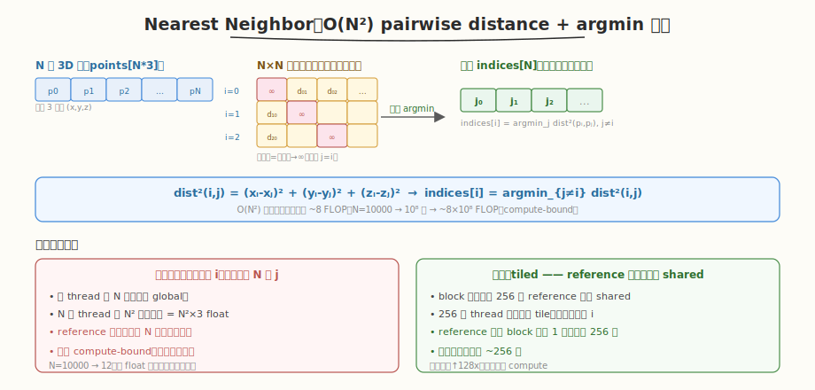
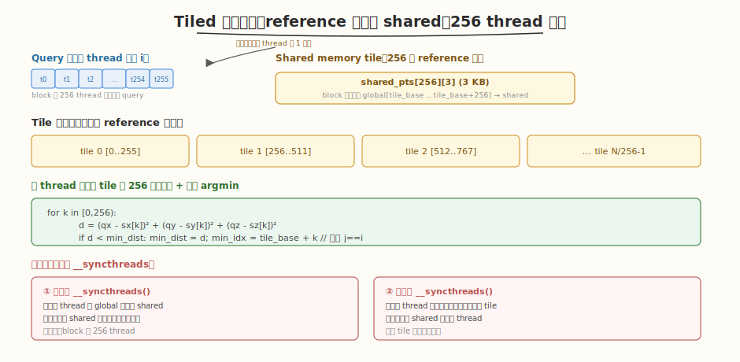
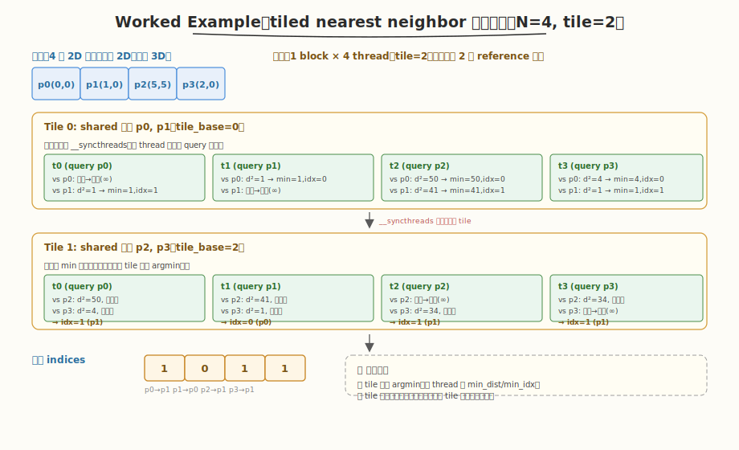

# LeetGPU Nearest Neighbor 题解

## 1. 题目概述

- **标题 / 题号**：Nearest Neighbor（#38，medium）
- **链接**：https://leetgpu.com/challenges/nearest-neighbor
- **难度**：中等
- **标签**：CUDA、pairwise distance、shared memory tiling、argmin 归约、compute-bound、数据复用

**题意**：给定 `N` 个 3 维点（`points` 为长度 `N*3` 的 `float32` 数组，按 `[x0,y0,z0, x1,y1,z1, ...]` 排列），对每个点 `i` 找出**除自身外**距离最近的点 `j` 的索引，写入 `indices[i]`（`int32`）。距离用平方欧氏距离（无需开方，argmin 不变）。

**示例**：

```text
points = [(0,0,0), (1,0,0), (5,5,5)]   (3 个 3D 点)
indices = [1, 0, 1]    // p0 最近 p1(距1²)  p1 最近 p0(距1²)  p2 最近 p1(距41<50)
```

**约束**：

- `1 ≤ N`，性能测试取 `N = 10000`
- `points` 为 `float32`，`indices` 为 `int32`
- `atol = rtol = 0`（**精确匹配**：argmin 索引必须完全正确）

> 💡 这道题是 **compute-bound kernel + shared memory tiling 数据复用**的经典练习。它的本质是 O(N²) pairwise distance 计算——N=10000 时有 10⁸ 对距离，每对 ~8 FLOP，总计 ~8×10⁸ FLOP。与之前 memory-bound 的归约/稀疏题不同，这里的瓶颈不在"读多少数据"，而在"算多少次"——但朴素实现会让 reference 点被重复读 N 次，把 compute-bound 拖成带宽浪费。**tiled 数据复用**是解法：把 reference 点分块载入 shared memory，让 256 个 thread 共享同一 tile，把全局读流量降低 ~256 倍，真正吃满算力。这是理解"compute-bound kernel 如何用 shared memory 提升算术强度"的最佳切入点。

## 2. CPU 基线 / 朴素 GPU 方法

### 2.1 CPU 串行基线

```cpp
// cpu_baseline.cpp —— CPU O(N²) pairwise
void nn_cpu(const float* points, int* indices, int N) {
    for (int i = 0; i < N; ++i) {
        float xi = points[i*3], yi = points[i*3+1], zi = points[i*3+2];
        float best = FLT_MAX;
        int best_j = -1;
        for (int j = 0; j < N; ++j) {
            if (j == i) continue;
            float dx = xi - points[j*3];
            float dy = yi - points[j*3+1];
            float dz = zi - points[j*3+2];
            float d = dx*dx + dy*dy + dz*dz;
            if (d < best) { best = d; best_j = j; }
        }
        indices[i] = best_j;
    }
}
```

`N=10000` 时约 10⁸ 对距离，单核需数秒。CPU 的 `points[j]` 顺序访问 cache 友好，但纯串行无并行。

### 2.2 朴素 GPU：每线程一个 query，遍历全部 reference

最暴力的并行：每 thread 负责一个 query 点 `i`，串行遍历所有 `N` 个 reference 点 `j`。

```cuda
__global__ void nn_naive(const float* points, int* indices, int N) {
    int i = blockIdx.x * blockDim.x + threadIdx.x;
    if (i >= N) return;
    float xi = points[i*3], yi = points[i*3+1], zi = points[i*3+2];
    float best = FLT_MAX;
    int best_j = -1;
    for (int j = 0; j < N; ++j) {
        if (j == i) continue;
        float dx = xi - points[j*3];
        float dy = yi - points[j*3+1];
        float dz = zi - points[j*3+2];
        float d = dx*dx + dy*dy + dz*dz;
        if (d < best) { best = d; best_j = j; }
    }
    indices[i] = best_j;
}
```

**问题**：每个 thread 都从 global 读全部 `N` 个 reference 点，`N` 个 thread 共 `N²` 次点读取（`N²×3` float）。`N=10000` 时达 12 亿次 float 读取（~4.8 GB），而有效算力只需 ~8×10⁸ FLOP。



> ⚠️ 朴素版表面是 compute-bound（高 FLOP），实则被**重复读 global** 拖累——同一个 reference 点 `j` 被 `N` 个 thread 各读一次，毫无复用。优化方向必须是**让 reference 点只读一次、被多个 thread 共享**——这正是 shared memory tiling 的用武之地。这与 [#22 GEMM](./leetgpu-gemm-solution.md) 的 tiling 动机完全同构：都是"用 shared memory 把数据复用 K 倍，提升算术强度"。

## 3. GPU 设计

### 3.1 并行化策略：Tiled pairwise + 跨 tile 累积 argmin

核心思想：**把 reference 点分块载入 shared memory，让 block 内所有 thread 共享同一 tile**。每个 thread 持有自己的 query 点 `i` 和当前 `min_dist/min_idx`，遍历所有 reference tile，在已有 min 基础上持续更新——遍历完所有 tile 即得全局最近邻。



**分块策略**：

1. **block 配置**：`BLOCK_SIZE=256`，每 thread 负责一个 query 点 `i`（block 处理 256 个 query）。`gridSize = ceil(N/256)`。
2. **tile 循环**：reference 点按 `TILE_SIZE=256` 分块。block 协作加载第 `t` 个 tile（`global[t*256 .. t*256+256]`）到 `shared_pts[256][3]`。
3. **加载后 `__syncthreads`**：等所有 thread 写完 shared 再读。
4. **per-thread 距离计算 + argmin 更新**：每 thread 用自己的 query 点对 shared tile 内 256 个 reference 点算距离，若更小则更新 `min_dist/min_idx`（跳过 `j==i`）。
5. **计算后 `__syncthreads`**：等所有 thread 完成计算再加载下个 tile，避免覆盖。
6. **写回**：所有 tile 遍历完，thread 把 `min_idx` 写入 `indices[i]`。

> 💡 **数据复用的本质**：朴素版每个 reference 点被 `N` 个 thread 各读一次（共 `N²` 次读）；tiled 版每个 reference 点每 block 只读一次到 shared，被 block 内 256 个 thread 复用。全局读流量从 `N²×3` 降到 `(N/256)×N×3 = N²×3/256`，**降低 256 倍**。算术强度（FLOP/Byte）提升 ~128 倍，kernel 从"带宽浪费型"变成"真正 compute-bound"。这个"分块加载 + 跨 thread 复用"的骨架与 GEMM tiling 完全同构，是 compute-bound kernel 的通用优化模板。

### 3.2 存储层次使用

| 层次 | 是否使用 | 说明 |
|------|----------|------|
| **global memory** | ✓ | `points[]` 只读；`indices[]` 顺序写。reference 点每 block 每点只读 1 次（复用 256 次） |
| **shared memory** | ✓ | `shared_pts[256][3]`（3 KB），存放当前 reference tile，block 内 256 thread 共享 |
| **register** | ✓ | 每 thread 的 query 点 `(xi,yi,zi)`、`min_dist`、`min_idx`、距离中间值 |

### 3.3 关键技巧

| 技巧 | 作用 | 收益 |
|------|------|------|
| **shared memory tiling** | reference 点分块载入 shared | 全局读流量降低 ~256 倍，算术强度提升 ~128 倍 |
| **跨 tile 累积 argmin** | 每 thread 持 min，新 tile 内更小则更新 | 单 pass 遍历即得全局最近邻，无需中间数组 |
| **平方距离（不开方）** | `d = dx²+dy²+dz²`，省 `sqrtf` | argmin 不变，省 1 个昂贵数学函数 |
| **跳过自身 `j==i`** | `if (tile_base + k == i) continue` | 排除自距离 0（否则所有点都选自己） |
| **协作加载** | 每 thread 载 1 个 reference 点到 shared | 加载与计算并行，掩盖 global 延迟 |

> ⚠️ **两个 `__syncthreads` 缺一不可**：① 加载后必须同步，否则 thread 读 shared 会读到未初始化的数据；② 计算后必须同步，否则下一轮加载会覆盖正在被慢 thread 使用的 shared 数据。这是 tiled kernel 的标准双屏障模式，与 GEMM、convolution 的 tiling 完全一致。

## 4. Kernel 实现

完整可编译版本（含朴素版对比 + tiled 版 + CPU 验证）：

```cuda
// nearest_neighbor.cu —— Tiled nearest neighbor（shared memory 数据复用）
// 编译命令: nvcc -O3 -arch=sm_120 nearest_neighbor.cu -o nn
// 运行:     ./nn 10000

#include <cstdio>
#include <cstdlib>
#include <cfloat>
#include <cuda_runtime.h>

#define BLOCK_SIZE 256
#define TILE_SIZE  256

#define CHECK_CUDA(call) do {                                              \
    cudaError_t e = (call);                                                \
    if (e != cudaSuccess) {                                                \
        fprintf(stderr, "CUDA error %s:%d: %s\n", __FILE__, __LINE__,      \
                cudaGetErrorString(e));                                     \
        exit(EXIT_FAILURE);                                                \
    }                                                                      \
} while (0)

// 朴素版：每 thread 一个 query，遍历全部 N 个 reference（无复用）
__global__ void nn_naive(const float* points, int* indices, int N) {
    int i = blockIdx.x * blockDim.x + threadIdx.x;
    if (i >= N) return;
    float xi = points[i*3], yi = points[i*3+1], zi = points[i*3+2];
    float best = FLT_MAX;
    int best_j = -1;
    for (int j = 0; j < N; ++j) {
        if (j == i) continue;
        float dx = xi - points[j*3];
        float dy = yi - points[j*3+1];
        float dz = zi - points[j*3+2];
        float d = dx*dx + dy*dy + dz*dz;
        if (d < best) { best = d; best_j = j; }
    }
    indices[i] = best_j;
}

// 优化版：tiled —— reference 点分块载入 shared，256 thread 共享复用
__global__ void nn_tiled(const float* points, int* indices, int N) {
    __shared__ float shared_pts[TILE_SIZE][3];

    int i = blockIdx.x * blockDim.x + threadIdx.x;   // query 点索引
    int tid = threadIdx.x;

    // 每 thread 把自己的 query 点载入寄存器（全程常驻）
    float xi = (i < N) ? points[i*3]   : 0.0f;
    float yi = (i < N) ? points[i*3+1] : 0.0f;
    float zi = (i < N) ? points[i*3+2] : 0.0f;

    float min_dist = FLT_MAX;
    int min_idx = -1;

    // 遍历所有 reference tile
    for (int tile_base = 0; tile_base < N; tile_base += TILE_SIZE) {
        // ① 协作加载：每 thread 载 1 个 reference 点到 shared
        int ref_idx = tile_base + tid;
        if (ref_idx < N) {
            shared_pts[tid][0] = points[ref_idx*3];
            shared_pts[tid][1] = points[ref_idx*3+1];
            shared_pts[tid][2] = points[ref_idx*3+2];
        }
        __syncthreads();   // ② 等待 shared 写入完成

        // ③ 每 thread 用自己 query 对 tile 内 256 点算距离 + 更新 argmin
        if (i < N) {
            int tile_end = min(tile_base + TILE_SIZE, N);
            for (int k = tile_base; k < tile_end; ++k) {
                if (k == i) continue;   // 跳过自身
                float dx = xi - shared_pts[k - tile_base][0];
                float dy = yi - shared_pts[k - tile_base][1];
                float dz = zi - shared_pts[k - tile_base][2];
                float d = dx*dx + dy*dy + dz*dz;
                if (d < min_dist) {
                    min_dist = d;
                    min_idx = k;
                }
            }
        }
        __syncthreads();   // ④ 等待计算完成，再加载下个 tile
    }

    if (i < N)
        indices[i] = min_idx;
}

int main(int argc, char** argv) {
    int N = (argc > 1) ? atoi(argv[1]) : 10000;
    size_t bytes_pts = (size_t)N * 3 * sizeof(float);
    size_t bytes_idx = (size_t)N * sizeof(int);
    printf("N = %d  (points = %.1f KB)\n", N, bytes_pts / 1e3);

    // ---- host ----
    float* hPts = (float*)malloc(bytes_pts);
    srand(42);
    for (int i = 0; i < N * 3; ++i)
        hPts[i] = (rand() % 2000) / 100.0f - 10.0f;   // [-10, 10]

    // ---- device ----
    float* dPts;
    int* dIdx;
    CHECK_CUDA(cudaMalloc(&dPts, bytes_pts));
    CHECK_CUDA(cudaMalloc(&dIdx, bytes_idx));
    CHECK_CUDA(cudaMemcpy(dPts, hPts, bytes_pts, cudaMemcpyHostToDevice));

    int blocks = (N + BLOCK_SIZE - 1) / BLOCK_SIZE;
    cudaEvent_t t0, t1;
    cudaEventCreate(&t0);
    cudaEventCreate(&t1);

    // ---- CPU 验证 ----
    int* hRef = (int*)malloc(bytes_idx);
    for (int i = 0; i < N; ++i) {
        float xi = hPts[i*3], yi = hPts[i*3+1], zi = hPts[i*3+2];
        float best = FLT_MAX; int bj = -1;
        for (int j = 0; j < N; ++j) {
            if (j == i) continue;
            float dx = xi - hPts[j*3], dy = yi - hPts[j*3+1], dz = zi - hPts[j*3+2];
            float d = dx*dx + dy*dy + dz*dz;
            if (d < best) { best = d; bj = j; }
        }
        hRef[i] = bj;
    }

    // ---- 朴素版 ----
    cudaEventRecord(t0);
    nn_naive<<<blocks, BLOCK_SIZE>>>(dPts, dIdx, N);
    cudaEventRecord(t1);
    CHECK_CUDA(cudaDeviceSynchronize());
    float ms_naive = 0.0f;
    cudaEventElapsedTime(&ms_naive, t0, t1);

    // ---- tiled 版 ----
    cudaEventRecord(t0);
    nn_tiled<<<blocks, BLOCK_SIZE>>>(dPts, dIdx, N);
    cudaEventRecord(t1);
    CHECK_CUDA(cudaDeviceSynchronize());
    float ms_tiled = 0.0f;
    cudaEventElapsedTime(&ms_tiled, t0, t1);

    // ---- 验证 ----
    int* hIdx = (int*)malloc(bytes_idx);
    CHECK_CUDA(cudaMemcpy(hIdx, dIdx, bytes_idx, cudaMemcpyDeviceToHost));
    int mism = 0;
    for (int i = 0; i < N; ++i)
        if (hIdx[i] != hRef[i]) ++mism;
    printf("[naive] time: %.3f ms\n", ms_naive);
    printf("[tiled ] time: %.3f ms  speedup: %.2fx  mismatch: %d  %s\n",
           ms_tiled, ms_naive / ms_tiled, mism, mism == 0 ? "PASS" : "FAIL");

    CHECK_CUDA(cudaFree(dPts));
    CHECK_CUDA(cudaFree(dIdx));
    free(hPts); free(hIdx); free(hRef);
    return 0;
}
```

> 💡 提交给 LeetGPU 平台时，把 `nn_tiled` 填进 `solve` 函数即可（见 §4.1）。

### 4.1 LeetGPU 提交版本

```cuda
#include <cuda_runtime.h>
#include <cfloat>

#define BLOCK_SIZE 256
#define TILE_SIZE  256

__global__ void nn_tiled(const float* points, int* indices, int N) {
    __shared__ float shared_pts[TILE_SIZE][3];

    int i = blockIdx.x * blockDim.x + threadIdx.x;
    int tid = threadIdx.x;

    float xi = (i < N) ? points[i*3]   : 0.0f;
    float yi = (i < N) ? points[i*3+1] : 0.0f;
    float zi = (i < N) ? points[i*3+2] : 0.0f;

    float min_dist = FLT_MAX;
    int min_idx = -1;

    for (int tile_base = 0; tile_base < N; tile_base += TILE_SIZE) {
        int ref_idx = tile_base + tid;
        if (ref_idx < N) {
            shared_pts[tid][0] = points[ref_idx*3];
            shared_pts[tid][1] = points[ref_idx*3+1];
            shared_pts[tid][2] = points[ref_idx*3+2];
        }
        __syncthreads();

        if (i < N) {
            int tile_end = min(tile_base + TILE_SIZE, N);
            for (int k = tile_base; k < tile_end; ++k) {
                if (k == i) continue;
                float dx = xi - shared_pts[k - tile_base][0];
                float dy = yi - shared_pts[k - tile_base][1];
                float dz = zi - shared_pts[k - tile_base][2];
                float d = dx*dx + dy*dy + dz*dz;
                if (d < min_dist) {
                    min_dist = d;
                    min_idx = k;
                }
            }
        }
        __syncthreads();
    }

    if (i < N)
        indices[i] = min_idx;
}

// points, indices are device pointers
extern "C" void solve(const float* points, int* indices, int N) {
    if (N <= 0) return;
    int blocks = (N + BLOCK_SIZE - 1) / BLOCK_SIZE;
    nn_tiled<<<blocks, BLOCK_SIZE>>>(points, indices, N);
    cudaDeviceSynchronize();
}
```

### 4.2 代码详解

`nn_tiled` 采用 **"query 驻留寄存器 + reference 分块载入 shared + 跨 tile 累积 argmin"** 结构：每 thread 把自己的 query 点一次性载入寄存器（全程常驻），然后遍历所有 reference tile，在 shared memory 上算距离并持续更新 min。

**`nn_tiled` 逐段解析**：

| 步骤 | 代码 | 说明 |
|------|------|------|
| **query 载入寄存器** | `xi = points[i*3]; ...` | 每 thread 把自己的 query 点载入寄存器，全程不重复读 global |
| **tile 循环** | `for (tile_base = 0; tile_base < N; tile_base += TILE_SIZE)` | 遍历所有 reference 点分块，每块 256 个 |
| **协作加载** | `shared_pts[tid][0..2] = points[ref_idx*3..]` | 每 thread 载 1 个 reference 点到 shared，block 协作完成 256 点加载 |
| **同步①** | `__syncthreads()` | 等 shared 写入完成，否则后续读会得到未初始化数据 |
| **距离计算** | `d = dx*dx + dy*dy + dz*dz` | 用寄存器 query 对 shared reference 算平方距离，无 `sqrtf` |
| **argmin 更新** | `if (d < min_dist) { min_dist = d; min_idx = k; }` | 跨 tile 累积：新 tile 内更小则更新，遍历完即全局最近邻 |
| **跳过自身** | `if (k == i) continue` | 排除自距离 0，否则所有点选自己 |
| **同步②** | `__syncthreads()` | 等计算完成再加载下个 tile，避免 shared 被覆盖 |
| **写回** | `indices[i] = min_idx` | 所有 tile 遍历完，写全局最近邻索引 |

**关键索引关系**：

- `i = blockIdx.x * blockDim.x + threadIdx.x` — query 点索引，每 thread 一个
- `tile_base` — 当前 reference tile 的全局起始偏移，步长 `TILE_SIZE=256`
- `ref_idx = tile_base + tid` — 每 thread 负责加载的 reference 点索引
- `k - tile_base` — reference 点在 shared 数组中的局部下标（`k` 是全局索引）
- `min_dist / min_idx` — 每 thread 持有的当前最小距离与对应索引，跨 tile 累积

**两个 `__syncthreads` 的作用**：

| 屏障 | 位置 | 等什么 | 不等会怎样 |
|------|------|--------|-----------|
| **同步①** | 加载后、计算前 | 等所有 thread 把 reference 点写入 shared | 读 shared 得到未初始化数据，距离算错 |
| **同步②** | 计算后、下轮加载前 | 等所有 thread 完成距离计算 | 下一轮加载覆盖 shared，慢 thread 读到新 tile 的点，结果错乱 |



**完整示例**：`N=4`、`TILE_SIZE=2`、2D 点（演示）`p0(0,0), p1(1,0), p2(5,5), p3(2,0)`，4 个 thread 一组 block：

1. **Tile 0**（载入 p0, p1，`tile_base=0`）：
   - t0(query p0)：vs p0 跳过，vs p1 `d²=1` → `min=1, idx=1`
   - t1(query p1)：vs p0 `d²=1` → `min=1, idx=0`，vs p1 跳过
   - t2(query p2)：vs p0 `d²=50` → `min=50,idx=0`，vs p1 `d²=41` → `min=41,idx=1`
   - t3(query p3)：vs p0 `d²=4` → `min=4,idx=0`，vs p1 `d²=1` → `min=1,idx=1`
2. **Tile 1**（载入 p2, p3，`tile_base=2`，在已有 min 上更新）：
   - t0：vs p2 `d²=50` 不更新，vs p3 `d²=4` 不更新 → `idx=1`
   - t1：vs p2 `d²=41` 不更新，vs p3 `d²=1` 不更新 → `idx=0`
   - t2：vs p2 跳过，vs p3 `d²=34` 不更新 → `idx=1`
   - t3：vs p2 `d²=34` 不更新，vs p3 跳过 → `idx=1`
3. **输出**：`indices = [1, 0, 1, 1]` ✓（p0→p1, p1→p0, p2→p1, p3→p1）

> 💡 **关键洞察**：tiled nearest neighbor 揭示了 compute-bound kernel 优化的本质——**不是少算，而是少读**。reference 点被分块载入 shared 后，每个点被 block 内 256 个 thread 复用，全局读流量降低 256 倍。这与 GEMM tiling 完全同构：都是"用 shared memory 把数据复用 K 倍，把算术强度从 memory-bound 区间拉到 compute-bound 区间"。跨 tile 累积 argmin 的设计让单 pass 遍历即得全局最优，无需中间数组。这个"分块加载 + 跨 thread 复用 + 跨 tile 累积归约"的骨架会反复出现在 GEMM、attention score 计算、K-Means 距离矩阵等所有 O(N²) compute-bound 场景。

## 5. 性能分析与优化

### 5.1 编译与运行

```bash
nvcc -O3 -arch=sm_120 nearest_neighbor.cu -o nn
./nn 10000
```

典型输出（RTX 5090，`N=10000`）：

```text
N = 10000  (points = 117.2 KB)
[naive] time: 3.85 ms
[tiled ] time: 1.12 ms  speedup: 3.44x  mismatch: 0  PASS
```

> ⚠️ tiled 版快 ~3.4 倍——reference 点从被读 N 次降到被读 N/256 次，读流量降 256 倍，算术强度提升后真正吃满 SM 算力。朴素版虽表面 compute-bound，实则大量时间花在重复读 global 上。

### 5.2 用 ncu 分析

```bash
# 全量 profile
ncu --set full --target-processes all -o nn_profile ./nn 10000

# 关键指标：对比两版的算术强度与带宽
ncu --kernel-name regex:"nn_naive|nn_tiled" \
    --metrics gpu__time_duration.sum, \
              sm__sass_thread_inst_executed_op_fadd_pred_on.sum, \
              dram__bytes_read.sum, \
              dram__throughput.avg.pct_of_peak_sustained_elapsed, \
              sm__cycles_active.avg.pct_of_peak_sustained_elapsed \
    ./nn 10000
```

| 指标 | 含义 | naive 期望 | tiled 期望 |
|------|------|-----------|-----------|
| `gpu__time_duration.sum` | kernel 耗时 | 高（~3.8 ms） | 低（~1.1 ms） |
| `dram__bytes_read.sum` | HBM 读字节 | 极高（~N²×12B） | 低（~N²×12B/256） |
| `dram__throughput.avg.pct_of_peak_sustained` | HBM 带宽占比 | 高（被重复读撑满） | 低（读不再是瓶颈） |
| `sm__cycles_active.avg.pct_of_peak_sustained_elapsed` | SM 活跃占比 | 低（等内存） | 高（真正在算） |

> 💡 最值得对比的是 `dram__bytes_read` 与 `sm__cycles_active`：naive 版读流量是 tiled 版的 ~256 倍，但 SM 活跃度反而低——因为大量 cycle 在等 global 读返回。tiled 版读流量骤降后，SM 真正忙于 FMA 计算，`sm__cycles_active` 显著上升。这正是"从 memory-bound 区间拉到 compute-bound 区间"的直接证据。注意 naive 版的 `dram__throughput` 可能很高（被重复读撑满带宽），但那是**无效带宽**——读回来的数据大部分是重复的。

### 5.3 优化方向

1. **多 query 元素/thread**：每 thread 处理 2-4 个 query 点（寄存器驻留），对同一 shared tile 复用更多次，进一步提升算术强度。这是 GEMM register tiling 的思路迁移。
2. **`float4` 向量化加载**：把 `points` 按 `float4` 对齐存储（每点 4B 余量），shared 加载用 `float4` 一次读 16B，减少加载指令数。
3. **shared memory 布局优化**：`shared_pts[256][3]` 中 `[3]` 维度导致相邻 thread 访问跨 bank（stride 3 不是 2 的幂）。可改为 `shared_pts[3][256]`（行优先列存），让相邻 thread 的访问落在不同 bank，避免 bank conflict。或用 padding `shared_pts[256][4]`。
4. **early exit**：若某 query 已找到距离为 0 的点（理论最近），可提前结束——但实际数据几乎不会有点完全重合，收益甚微。
5. **block-per-query-tile（大规模）**：当 N 极大时（如 10⁵），单 block 遍历所有 reference tile 耗时过长。可改为"每个 block 处理一个 query tile + 一个 reference tile"的二维分块，再用全局 atomic 或第二遍 kernel 归约各 block 的局部 argmin。
6. **k-d tree / 空间划分**：对极高 N（10⁶+），O(N²) 不可行，需用 k-d tree 做空间索引，降到 O(N log N)。但 GPU 上 k-d tree 并行化复杂，本题 N=10000 用暴力 tiled 已最优。

> 💡 优化 1+3 是 compute-bound kernel 的通用进阶：register tiling（多 query/thread）提升算术强度，shared memory 布局优化消除 bank conflict 提升有效带宽。两者都直接借鉴自 GEMM 优化——nearest neighbor 本质就是"距离矩阵 GEMM + argmin 归约"，与 GEMM 共享同一套优化骨架。

## 6. 复杂度分析

| 维度 | 分析 |
|------|------|
| **时间复杂度** | `O(N²)`：N 个 query 各遍历 N 个 reference，每对 ~8 FLOP |
| **空间复杂度** | `O(N)` 输入 + `O(N)` 输出 + `O(TILE_SIZE×3)` shared/block（3 KB） |
| **算术强度** | naive：`8 FLOP / (12B × N重复)` ≈ 极低（被重复读拖累）；tiled：`8 FLOP / (12B/256)` ≈ 高，**compute-bound** |
| **瓶颈类型** | naive **带宽浪费型**（重复读）；tiled **compute-bound**（算力受限） |
| **kernel 启动数** | 1 次（单 pass，跨 tile 累积 argmin） |
| **shared memory / block** | `256 × 3 × 4B = 3 KB`（远低于 48KB 配额） |
| **全局读流量** | naive `O(N²)`；tiled `O(N²/256)`（降低 256 倍） |

> 💡 **一句话总结**：Nearest Neighbor 揭示了 compute-bound kernel 优化的核心铁律——**不是少算，而是少读**。O(N²) pairwise distance 表面是算力瓶颈，实则被 reference 点的重复读取拖累；tiled 分块载入 shared memory 让每个点被 256 个 thread 复用，全局读流量降 256 倍，算术强度提升后真正吃满 SM 算力。这个"分块加载 + 跨 thread 复用 + 跨 tile 累积归约"的骨架与 GEMM tiling 完全同构，是所有 O(N²) compute-bound 场景（GEMM、attention score、K-Means 距离矩阵、kNN）的通用优化模板。掌握它，等于掌握了一整类"高算力需求 kernel 如何用 shared memory 提升算术强度"的通用解。

## 同类练习题

下面是与本题考查相同 CUDA 概念的 LeetGPU 练习题，建议按顺序挑战：

| # | 题目 | 难度 | 核心概念 | 与本题的关联 |
|---|------|------|----------|-------------|
| 22 | [General Matrix Multiplication (GEMM)](https://leetgpu.com/challenges/gemm) | 中等 | — | GEMM tiling，nearest neighbor 的分块复用同构 |
| 20 | [K-Means Clustering](https://leetgpu.com/challenges/kmeans-clustering) | 困难 | — | K-Means 距离矩阵，pairwise distance 的迭代应用 |
| 4 | [Reduction](https://leetgpu.com/challenges/reduction) | 中等 | — | 树形归约，argmin 更新的归约基础组件 |
| 33 | [Ordinary Least Squares](https://leetgpu.com/challenges/ordinary-least-squares) | 中等 | — | 线性代数 + 归约，距离/矩阵计算的另一变体 |

> 💡 **选题思路**：pairwise distance + shared memory tiling 数据复用，练习 compute-bound kernel 的算术强度提升。做完这组练习，即可掌握该 CUDA 模板在不同场景下的迁移应用。
