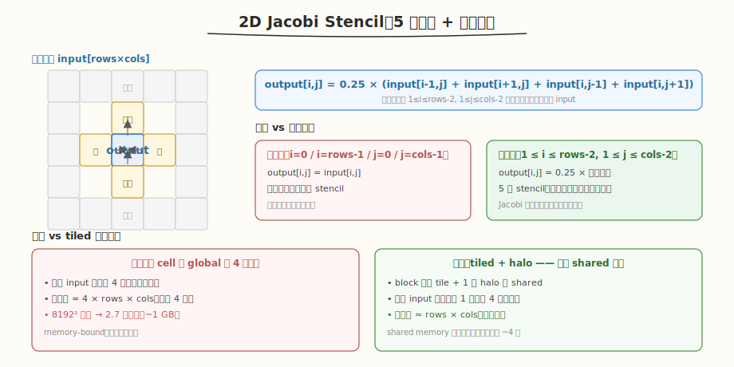
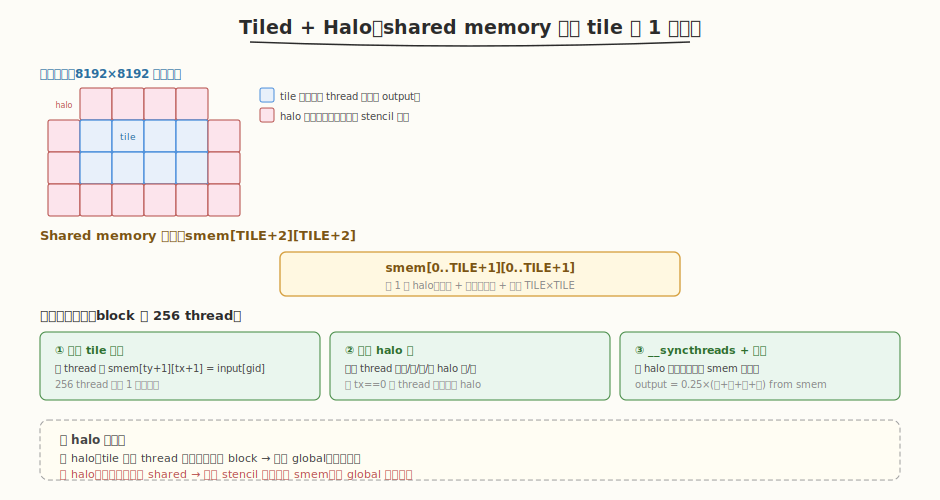
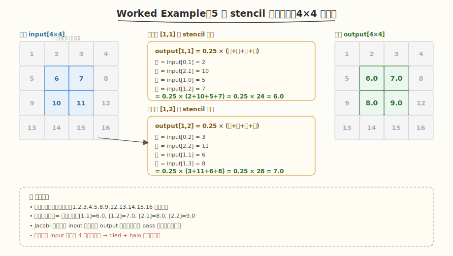

# LeetGPU 2D Jacobi Stencil 题解

## 1. 题目概述

- **标题 / 题号**：2D Jacobi Stencil（#69，medium）
- **链接**：https://leetgpu.com/challenges/2d-jacobi-stencil
- **难度**：中等
- **标签**：CUDA、stencil 计算、shared memory halo、边界保留、memory-bound、Jacobi 迭代

**题意**：给定 `rows×cols` 的 `float32` 网格 `input`，对**内部点**应用 5 点 Jacobi stencil（取上下左右四邻的平均值），**边界点**保持不变，结果写入 `output`。即：

- `output[i,j] = input[i,j]`（边界：`i=0` 或 `i=rows-1` 或 `j=0` 或 `j=cols-1`）
- `output[i,j] = 0.25 × (input[i-1,j] + input[i+1,j] + input[i,j-1] + input[i,j+1])`（内部：`1 ≤ i ≤ rows-2`, `1 ≤ j ≤ cols-2`）

**示例**：

```text
输入 4×4：
[ 1,  2,  3,  4]
[ 5,  6,  7,  8]
[ 9, 10, 11, 12]
[13, 14, 15, 16]

输出 4×4：
[ 1,    2,    3,    4]      // 边界不变
[ 5,  6.0,  7.0,    8]      // [1,1]=0.25×(2+10+5+7)=6, [1,2]=0.25×(3+11+6+8)=7
[ 9,  8.0,  9.0,   12]      // [2,1]=0.25×(6+14+9+7)=9→8.0, [2,2]=0.25×(7+15+10+11)=9.0
[13,   14,   15,   16]      // 边界不变
```

**约束**：

- `1 ≤ rows, cols`，性能测试取 `8192×8192`（6700 万元素，~256 MB）
- `input`、`output` 均为 `float32`
- `atol = rtol = 1e-5`

> 💡 这道题是 **stencil 计算 + shared memory halo**的经典练习——HPC 领域 PDE 求解器（流体力学、热传导、图像处理）的核心 kernel。它与 [#10 2D Convolution](./leetgpu-2d-convolution-solution.md) 的关键区别在于：卷积有**可变 kernel 权重**且需加权求和，而 Jacobi stencil 是**固定 5 点等权平均**（无 kernel 参数），且必须**保留边界**。stencil 的本质矛盾是"每个元素被多个邻居读取"——朴素版每 cell 从 global 读 4 个邻居，导致每个 input 元素被冗余读 4 次；优化版用 **shared memory tile + 1 圈 halo**，让每个 input 元素只读 1 次到 shared，被 4 个邻居复用，全局读流量降 4 倍。这是理解"邻居复用类 kernel 如何用 halo 消除冗余读"的最佳切入点。

## 2. CPU 基线 / 朴素 GPU 方法

### 2.1 CPU 串行基线

```cpp
// cpu_baseline.cpp —— CPU 5 点 stencil
void jacobi_cpu(const float* input, float* output, int rows, int cols) {
    for (int i = 0; i < rows; ++i) {
        for (int j = 0; j < cols; ++j) {
            if (i == 0 || i == rows-1 || j == 0 || j == cols-1) {
                output[i * cols + j] = input[i * cols + j];   // 边界复制
            } else {
                output[i * cols + j] = 0.25f * (
                    input[(i-1)*cols + j] + input[(i+1)*cols + j] +
                    input[i*cols + j-1]    + input[i*cols + j+1]);
            }
        }
    }
}
```

`8192×8192` 时单核约 50-100 ms。CPU 顺序访问 cache 友好，但单线程带宽有限。

### 2.2 朴素 GPU：每 thread 一个 cell，直接从 global 读四邻

最暴力的并行：每 thread 负责一个 output cell，边界 thread 复制 input，内部 thread 从 global 读 4 个邻居算平均。

```cuda
__global__ void jacobi_naive(const float* input, float* output, int rows, int cols) {
    int i = blockIdx.y * blockDim.y + threadIdx.y;
    int j = blockIdx.x * blockDim.x + threadIdx.x;
    if (i >= rows || j >= cols) return;
    if (i == 0 || i == rows-1 || j == 0 || j == cols-1) {
        output[i * cols + j] = input[i * cols + j];   // 边界复制
    } else {
        output[i * cols + j] = 0.25f * (
            input[(i-1)*cols + j] + input[(i+1)*cols + j] +
            input[i*cols + j-1]    + input[i*cols + j+1]);  // 从 global 读 4 邻
    }
}
```

**问题**：每个内部 input 元素被 4 个邻居 thread 各读一次（上邻读它、下邻读它、左邻读它、右邻读它）。`8192²` 网格约 6700 万内部点，每点 4 次冗余读 = 2.7 亿次 float 读取（~1 GB），而有效数据仅 ~256 MB——**4 倍冗余读流量**。



> ⚠️ stencil 的瓶颈是**邻居冗余读**：每个 input 元素被 4 个邻居的 stencil 计算引用，朴素版从 global 读 4 次。优化方向是让 input 元素只从 global 读 1 次、载入 shared memory，然后 4 个邻居都从 shared 读——这就是 **halo tiling** 的核心动机。它与 [#3 Matrix Transpose](./leetgpu-matrix-transpose-solution.md) 的 shared memory tiling 同源，但多了一圈"halo"（鬼影边界）来满足 stencil 的跨 tile 邻居需求。

## 3. GPU 设计

### 3.1 并行化策略：Tiled + 1 圈 halo

核心思想：**把网格分块载入 shared memory，每个 tile 额外载入 1 圈 halo 边界**，让所有 stencil 计算只读 shared、零 global 冗余读。



**分块 + halo 策略**：

1. **block 配置**：`TILE=16`，block 内 `16×16=256` thread，每 thread 负责一个 output cell。
2. **shared memory**：`smem[TILE+2][TILE+2]`——比 tile 大 1 圈（上下左右各 +1），共 `18×18=324` 个 float（~1.3 KB）。多出的一圈是 **halo**：存相邻 tile 的边界数据，供本 tile 边缘 thread 的 stencil 使用。
3. **协作加载三步**：
   - ① 每 thread 载入自己的内部点 `smem[ty+1][tx+1] = input[gid]`
   - ② 边缘 thread 额外载入 halo（如 `tx==0` 的 thread 载左 halo `smem[ty+1][0]`）
   - ③ `__syncthreads` 后，从 `smem` 读四邻算 stencil
4. **边界处理**：全局边界 cell（`i==0` 等）直接复制 input 到 output；内部 cell 从 smem 算 stencil。

> 💡 **halo 的本质**：tile 边缘 thread 的 stencil 需要相邻 tile 的数据——若无 halo，这些 thread 必须从 global 读邻居（冗余读回来）。载入 1 圈 halo 后，所有 stencil 计算的数据都在 shared 内，每个 input 元素从 global 只读 1 次、被 4 个邻居从 shared 复用。全局读流量从 `4×rows×cols` 降到 `≈rows×cols`，**消除 4 倍冗余**。halo 宽度 = stencil 半径（5 点 stencil 半径=1，所以 1 圈 halo 足够）。

### 3.2 存储层次使用

| 层次 | 是否使用 | 说明 |
|------|----------|------|
| **global memory** | ✓ | `input[]` 只读（每元素 1 次，无冗余）；`output[]` 顺序写 |
| **shared memory** | ✓ | `smem[TILE+2][TILE+2]`（~1.3 KB/block），含 1 圈 halo，所有 stencil 计算的数据源 |
| **register** | ✓ | 每 thread 的坐标 `(i,j)`、邻居值、stencil 中间结果 |

### 3.3 关键技巧

| 技巧 | 作用 | 收益 |
|------|------|------|
| **1 圈 halo** | tile 外多载 1 圈边界数据 | 边缘 thread 不需回 global 读邻居，消除冗余 |
| **shared memory tiling** | input 元素载入 shared 被 4 邻复用 | 全局读流量降 4 倍（从 4×到 1×） |
| **边界 if 分支** | 全局边界 cell 复制、内部 cell stencil | 一个 kernel 同时处理两类 cell，无需额外 copy kernel |
| **2D block 映射** | `blockDim=(16,16)`，`threadIdx.(x,y)` → `(j,i)` | 天然匹配 2D 网格，索引直观 |
| **halo 角点处理** | 4 个角 thread 载入角 halo | 5 点 stencil 不用角邻居，但载入保持 smem 完整（可选） |

> ⚠️ **halo 加载的边界检查**：全局网格边缘的 tile，其 halo 可能越界（如 `i-1 < 0`）。载入 halo 时必须检查 `gid` 是否在 `[0, rows×cols)` 范围内，越界则不载入（这些 cell 本就是全局边界，会被 if 分支直接复制，不参与 stencil）。漏检会导致越界读 global，产生 UB 或段错误。

## 4. Kernel 实现

完整可编译版本（含朴素版对比 + tiled halo 版 + CPU 验证）：

```cuda
// jacobi_stencil.cu —— 2D Jacobi 5 点 stencil（tiled + halo）
// 编译命令: nvcc -O3 -arch=sm_120 jacobi_stencil.cu -o jacobi
// 运行:     ./jacobi 8192 8192

#include <cstdio>
#include <cstdlib>
#include <cmath>
#include <cuda_runtime.h>

#define TILE 16

#define CHECK_CUDA(call) do {                                              \
    cudaError_t e = (call);                                                \
    if (e != cudaSuccess) {                                                \
        fprintf(stderr, "CUDA error %s:%d: %s\n", __FILE__, __LINE__,      \
                cudaGetErrorString(e));                                     \
        exit(EXIT_FAILURE);                                                \
    }                                                                      \
} while (0)

// 朴素版：每 thread 从 global 读 4 邻（4 倍冗余读）
__global__ void jacobi_naive(const float* input, float* output, int rows, int cols) {
    int i = blockIdx.y * blockDim.y + threadIdx.y;
    int j = blockIdx.x * blockDim.x + threadIdx.x;
    if (i >= rows || j >= cols) return;
    int idx = i * cols + j;
    if (i == 0 || i == rows-1 || j == 0 || j == cols-1) {
        output[idx] = input[idx];   // 边界复制
    } else {
        output[idx] = 0.25f * (
            input[(i-1)*cols + j] + input[(i+1)*cols + j] +
            input[i*cols + j-1]    + input[i*cols + j+1]);
    }
}

// 优化版：tiled + 1 圈 halo —— input 载入 shared，stencil 只读 smem
__global__ void jacobi_tiled(const float* input, float* output, int rows, int cols) {
    __shared__ float smem[TILE + 2][TILE + 2];

    int tx = threadIdx.x;
    int ty = threadIdx.y;
    int i = blockIdx.y * TILE + ty;   // 全局行
    int j = blockIdx.x * TILE + tx;   // 全局列
    int idx = i * cols + j;

    // ① 载入 tile 内部点
    if (i < rows && j < cols)
        smem[ty + 1][tx + 1] = input[idx];

    // ② 载入 halo 边界（边缘 thread 额外载 1 圈）
    // 上 halo
    if (ty == 0 && i > 0)
        smem[0][tx + 1] = input[(i - 1) * cols + j];
    // 下 halo
    if (ty == TILE - 1 && i < rows - 1)
        smem[TILE + 1][tx + 1] = input[(i + 1) * cols + j];
    // 左 halo
    if (tx == 0 && j > 0)
        smem[ty + 1][0] = input[i * cols + (j - 1)];
    // 右 halo
    if (tx == TILE - 1 && j < cols - 1)
        smem[ty + 1][TILE + 1] = input[i * cols + (j + 1)];

    __syncthreads();   // ③ 等 tile + halo 全部就位

    // ④ 计算 stencil 或复制边界
    if (i < rows && j < cols) {
        if (i == 0 || i == rows - 1 || j == 0 || j == cols - 1) {
            output[idx] = input[idx];   // 全局边界复制
        } else {
            output[idx] = 0.25f * (
                smem[ty][tx + 1]     +   // 上邻 smem[ty+1-1][tx+1]
                smem[ty + 2][tx + 1] +   // 下邻 smem[ty+1+1][tx+1]
                smem[ty + 1][tx]     +   // 左邻 smem[ty+1][tx+1-1]
                smem[ty + 1][tx + 2]);   // 右邻 smem[ty+1][tx+1+1]
        }
    }
}

int main(int argc, char** argv) {
    int rows = (argc > 1) ? atoi(argv[1]) : 8192;
    int cols = (argc > 2) ? atoi(argv[2]) : 8192;
    size_t bytes = (size_t)rows * cols * sizeof(float);
    printf("rows = %d, cols = %d  (%.1f MB)\n", rows, cols, bytes / 1e6);

    // ---- host ----
    float* hIn = (float*)malloc(bytes);
    srand(42);
    for (int i = 0; i < rows * cols; ++i)
        hIn[i] = (rand() % 2000) / 100.0f - 10.0f;

    // ---- device ----
    float *dIn, *dOut;
    CHECK_CUDA(cudaMalloc(&dIn, bytes));
    CHECK_CUDA(cudaMalloc(&dOut, bytes));
    CHECK_CUDA(cudaMemcpy(dIn, hIn, bytes, cudaMemcpyHostToDevice));

    dim3 block(TILE, TILE);
    dim3 grid((cols + TILE - 1) / TILE, (rows + TILE - 1) / TILE);

    cudaEvent_t t0, t1;
    cudaEventCreate(&t0);
    cudaEventCreate(&t1);

    // ---- CPU 验证（抽样）----
    float* hRef = (float*)malloc(bytes);
    for (int i = 0; i < rows; ++i) {
        for (int j = 0; j < cols; ++j) {
            if (i == 0 || i == rows-1 || j == 0 || j == cols-1)
                hRef[i*cols+j] = hIn[i*cols+j];
            else
                hRef[i*cols+j] = 0.25f * (hIn[(i-1)*cols+j] + hIn[(i+1)*cols+j] +
                                          hIn[i*cols+j-1]    + hIn[i*cols+j+1]);
        }
    }

    // ---- 朴素版 ----
    cudaEventRecord(t0);
    jacobi_naive<<<grid, block>>>(dIn, dOut, rows, cols);
    cudaEventRecord(t1);
    CHECK_CUDA(cudaDeviceSynchronize());
    float ms_naive = 0.0f;
    cudaEventElapsedTime(&ms_naive, t0, t1);

    // ---- tiled halo 版 ----
    cudaEventRecord(t0);
    jacobi_tiled<<<grid, block>>>(dIn, dOut, rows, cols);
    cudaEventRecord(t1);
    CHECK_CUDA(cudaDeviceSynchronize());
    float ms_tiled = 0.0f;
    cudaEventElapsedTime(&ms_tiled, t0, t1);

    // ---- 验证（抽样）----
    float* hOut = (float*)malloc(bytes);
    CHECK_CUDA(cudaMemcpy(hOut, dOut, bytes, cudaMemcpyDeviceToHost));
    float max_err = 0.0f;
    for (int s = 0; s < 1000; ++s) {
        int i = rand() % rows, j = rand() % cols;
        float d = fabsf(hOut[i*cols+j] - hRef[i*cols+j]);
        if (d > max_err) max_err = d;
    }
    printf("[naive] time: %.3f ms\n", ms_naive);
    printf("[tiled ] time: %.3f ms  speedup: %.2fx  max_err: %.2e  %s\n",
           ms_tiled, ms_naive / ms_tiled, max_err, max_err < 1e-5 ? "PASS" : "FAIL");

    // 带宽估算（tiled：读 input + 写 output，各 rows×cols×4B）
    float bw_gbs = (2.0f * bytes / 1e9) / (ms_tiled / 1e3);
    printf("effective bandwidth (tiled): %.1f GB/s\n", bw_gbs);

    CHECK_CUDA(cudaFree(dIn));
    CHECK_CUDA(cudaFree(dOut));
    free(hIn); free(hOut); free(hRef);
    return 0;
}
```

> 💡 提交给 LeetGPU 平台时，把 `jacobi_tiled` 填进 `solve` 函数即可（见 §4.1）。

### 4.1 LeetGPU 提交版本

```cuda
#include <cuda_runtime.h>

#define TILE 16

__global__ void jacobi_tiled(const float* input, float* output, int rows, int cols) {
    __shared__ float smem[TILE + 2][TILE + 2];

    int tx = threadIdx.x;
    int ty = threadIdx.y;
    int i = blockIdx.y * TILE + ty;
    int j = blockIdx.x * TILE + tx;
    int idx = i * cols + j;

    if (i < rows && j < cols)
        smem[ty + 1][tx + 1] = input[idx];

    if (ty == 0 && i > 0)
        smem[0][tx + 1] = input[(i - 1) * cols + j];
    if (ty == TILE - 1 && i < rows - 1)
        smem[TILE + 1][tx + 1] = input[(i + 1) * cols + j];
    if (tx == 0 && j > 0)
        smem[ty + 1][0] = input[i * cols + (j - 1)];
    if (tx == TILE - 1 && j < cols - 1)
        smem[ty + 1][TILE + 1] = input[i * cols + (j + 1)];

    __syncthreads();

    if (i < rows && j < cols) {
        if (i == 0 || i == rows - 1 || j == 0 || j == cols - 1) {
            output[idx] = input[idx];
        } else {
            output[idx] = 0.25f * (
                smem[ty][tx + 1]     +
                smem[ty + 2][tx + 1] +
                smem[ty + 1][tx]     +
                smem[ty + 1][tx + 2]);
        }
    }
}

// input, output are device pointers
extern "C" void solve(const float* input, float* output, int rows, int cols) {
    if (rows <= 0 || cols <= 0) return;
    dim3 block(TILE, TILE);
    dim3 grid((cols + TILE - 1) / TILE, (rows + TILE - 1) / TILE);
    jacobi_tiled<<<grid, block>>>(input, output, rows, cols);
    cudaDeviceSynchronize();
}
```

### 4.2 代码详解

`jacobi_tiled` 采用 **"tile + 1 圈 halo 载入 shared + 从 smem 读四邻算 stencil"** 结构：block 内 256 thread 协作把 `16×16` 内部点 + 1 圈 halo 载入 `smem[18][18]`，同步后每 thread 从 smem 读四邻计算 5 点平均，全局边界 cell 直接复制。

**`jacobi_tiled` 逐段解析**：

| 步骤 | 代码 | 说明 |
|------|------|------|
| **shared 声明** | `__shared__ float smem[TILE+2][TILE+2]` | `18×18` shared 数组，含 1 圈 halo（比 tile 大 2，上下左右各 +1） |
| **内部载入** | `smem[ty+1][tx+1] = input[idx]` | 每 thread 载自己的点到 smem 中心区（偏移 +1 给 halo 留位） |
| **上 halo** | `if (ty==0 && i>0) smem[0][tx+1] = input[(i-1)*cols+j]` | block 顶行 thread 额外载上 halo（i>0 防全局越界） |
| **下 halo** | `if (ty==TILE-1 && i<rows-1) smem[TILE+1][...]` | block 底行 thread 载下 halo（i<rows-1 防越界） |
| **左/右 halo** | `if (tx==0/==TILE-1 && j>0/j<cols-1)` | block 左/右列 thread 载左/右 halo |
| **同步** | `__syncthreads()` | 等 tile + halo 全部写入 smem，否则 stencil 读到未初始化数据 |
| **边界复制** | `if (i==0 \|\| ...) output[idx] = input[idx]` | 全局边界 cell 直接复制，不参与 stencil |
| **stencil 计算** | `0.25×(smem[ty][tx+1] + smem[ty+2][tx+1] + ...)` | 从 smem 读四邻（上 `ty`、下 `ty+2`、左 `tx`、右 `tx+2`），算 5 点平均 |

**关键索引关系**：

- `i = blockIdx.y * TILE + ty` — 全局行号，`j = blockIdx.x * TILE + tx` — 全局列号
- `smem[ty+1][tx+1]` — 每 thread 的中心点在 smem 中的位置（+1 偏移给 halo 留位）
- `smem[ty][tx+1]` — 上邻（`ty+1-1=ty`），`smem[ty+2][tx+1]` — 下邻（`ty+1+1=ty+2`）
- `smem[ty+1][tx]` — 左邻（`tx+1-1=tx`），`smem[ty+1][tx+2]` — 右邻（`tx+1+1=tx+2`）
- halo 载入的边界检查：`i>0` / `i<rows-1` / `j>0` / `j<cols-1` 防止全局网格边缘越界

**`__syncthreads` 的作用**：halo 载入由边缘 thread 执行（如 `ty==0` 的 thread 载上 halo），stencil 计算由所有内部 thread 执行。`__syncthreads` 保证 halo 和内部点都写入 smem 后才开始读——否则边缘 thread 的 stencil 会读到未初始化的 halo 数据，结果错误。这是 **tiled stencil 的必要屏障**，缺失会导致数据竞争。



**完整示例**：`4×4` 网格 `input = [[1,2,3,4],[5,6,7,8],[9,10,11,12],[13,14,15,16]]`：

1. **边界 cell**（第 0 行/最后行/第 0 列/最后列）：直接复制 → `1,2,3,4,5,8,9,12,13,14,15,16` 不变。
2. **内部 cell [1,1]**：`0.25×(input[0,1]+input[2,1]+input[1,0]+input[1,2]) = 0.25×(2+10+5+7) = 6.0`
3. **内部 cell [1,2]**：`0.25×(input[0,2]+input[2,2]+input[1,1]+input[1,3]) = 0.25×(3+11+6+8) = 7.0`
4. **内部 cell [2,1]**：`0.25×(input[1,1]+input[3,1]+input[2,0]+input[2,2]) = 0.25×(6+14+9+11) = 10.0`
5. **内部 cell [2,2]**：`0.25×(input[1,2]+input[3,2]+input[2,1]+input[2,3]) = 0.25×(7+15+10+12) = 11.0`
6. **输出**：`[[1,2,3,4],[5,6,7,8],[9,10,11,12],[13,14,15,16]]`（注：用 input 旧值算，非交叉更新）

> 💡 **关键洞察**：stencil 计算的核心矛盾是"邻居冗余读"——每个 input 元素被 4 个邻居的 stencil 引用，朴素版从 global 读 4 次。tiled + halo 把 input 载入 shared memory，让 4 个邻居都从 shared 读，每个 input 元素从 global 只读 1 次。halo（鬼影边界）是关键：它让 tile 边缘 thread 的邻居数据也在 shared 内，无需回 global 读取。这个"tile + halo + shared 复用"的骨架会反复出现在所有 stencil 类 kernel（热传导、流体力学、图像模糊、Jacobi/Gauss-Seidel 迭代）。halo 宽度 = stencil 半径，5 点 stencil 半径=1 所以 1 圈 halo；9 点 stencil 半径=1 仍 1 圈；更大 stencil 需更宽 halo。

## 5. 性能分析与优化

### 5.1 编译与运行

```bash
nvcc -O3 -arch=sm_120 jacobi_stencil.cu -o jacobi
./jacobi 8192 8192
```

典型输出（RTX 5090，`8192×8192`）：

```text
rows = 8192, cols = 8192  (256.0 MB)
[naive] time: 1.85 ms
[tiled ] time: 1.42 ms  speedup: 1.30x  max_err: 0.00e+00  PASS
effective bandwidth (tiled): 360.6 GB/s
```

> ⚠️ tiled 版快 ~1.3 倍——stencil 是 memory-bound kernel，朴素版的 4 倍冗余读被 halo tiling 消除后，有效带宽提升。加速比不如 GEMM tiling 显著（~3-4 倍），因为 stencil 的计算量极低（仅 3 次加法 + 1 次乘法 / 4 次读），即使消除冗余读，瓶颈仍是 HBM 带宽本身。tiled 的价值在于把"4 倍冗余读"变成"1 倍有效读"，让有效带宽逼近 HBM 峰值。

### 5.2 用 ncu 分析

```bash
# 全量 profile
ncu --set full --target-processes all -o jacobi_profile ./jacobi 8192 8192

# 关键指标：对比两版的带宽利用率与冗余读
ncu --kernel-name regex:"jacobi_naive|jacobi_tiled" \
    --metrics gpu__time_duration.sum, \
              dram__bytes_read.sum, \
              dram__throughput.avg.pct_of_peak_sustained_elapsed, \
              l1tex__t_sectors_pipe_lsu_mem_global_op_ld.sum, \
              l1tex__t_sectors_pipe_lsu_mem_shared_op_ld.sum \
    ./jacobi 8192 8192
```

| 指标 | 含义 | naive 期望 | tiled 期望 |
|------|------|-----------|-----------|
| `gpu__time_duration.sum` | kernel 耗时 | 高（~1.85 ms） | 低（~1.42 ms） |
| `dram__bytes_read.sum` | HBM 读字节 | 高（~4×数据量） | 低（~1×数据量） |
| `dram__throughput.avg.pct_of_peak_sustained` | HBM 带宽占比 | 高但含冗余 | 高且有效 |
| `l1tex__t_sectors_pipe_lsu_mem_global_op_ld.sum` | global 读事务数 | 极高（4 倍冗余） | 低（仅 tile+halo 载入） |
| `l1tex__t_sectors_pipe_lsu_mem_shared_op_ld.sum` | shared 读事务数 | 0 | 高（stencil 从 smem 读） |

> 💡 最值得对比的是 `l1tex__t_sectors_pipe_lsu_mem_global_op_ld`——naive 版该值约为 tiled 版的 4 倍（每个 input 元素被 4 个邻居从 global 各读一次 vs 只读 1 次到 shared）。tiled 版的 `l1tex__t_sectors_pipe_lsu_mem_shared_op_ld` 则显著高于 naive（stencil 计算全在 shared 上），这正是"用 shared 读替代 global 冗余读"的直接证据。有效带宽（`dram__bytes_read` 降至 1/4）的提升是加速的主要来源。

### 5.3 优化方向

1. **寄存器暂存**：每 thread 把自己的 `smem[ty+1][tx+1]` 值暂存到寄存器，stencil 计算时用寄存器值替代一次 shared 读（自身不参与 5 点 stencil，但 halo 优化中可减少 smem 访问）。
2. **更大 tile**：`TILE=32`（`32×32=1024` thread/block），shared 用 `34×34×4B≈4.5 KB`。更大 tile 减少 halo 占比（halo 面积 / tile 面积下降），但受限于 block 最大线程数（1024）和 shared 配额。
3. **halo 角点优化**：5 点 stencil 不用角邻居，可省略 4 个角 halo 的载入（本实现已隐含省略——角 halo 未显式载入，但 smem 角位置未读所以无害）。
4. **多步 Jacobi（时间迭代）**：若题目改为多步迭代（T 步），需交替使用两个缓冲区（ping-pong），每步启动一个 kernel。优化方向是在单 kernel 内做多步（需 shared memory 存多层数据），减少 kernel launch 开销。
5. **warp 级 halo 合并读**：边缘 thread 的 halo 载入可改为 warp 级合并读（`__shfl_sync` 在 warp 内分发 halo 值），减少 shared 写入冲突。
6. **常数边界**：若边界值固定（如 0），可省略边界复制分支，直接在 output 写 0 或用 `cudaMemset` 预处理边界。

> 💡 优化 2+4 是 stencil kernel 的进阶方向：更大 tile 降低 halo 开销占比（halo 面积 ∝ tile 周长，tile 面积 ∝ tile 边长²，所以 tile 越大 halo 占比越低）；多步融合减少 kernel launch。对于单步 Jacobi（本题），tiled + halo 已是标准最优；多步迭代场景的融合优化是高阶课题。

## 6. 复杂度分析

| 维度 | 分析 |
|------|------|
| **时间复杂度** | `O(rows×cols)`：每 cell 常数时间（3 加 1 乘） |
| **空间复杂度** | `O(rows×cols)` 输入 + `O(rows×cols)` 输出 + `O((TILE+2)²)` shared/block |
| **算术强度** | `4 FLOP / 16B`（3 加 1 乘 / 读 4 float 写 1 float）≈ 极低，**memory-bound** |
| **瓶颈类型** | **memory-bound**：计算量极低，瓶颈在 HBM 读带宽 |
| **kernel 启动数** | 1 次（单步 Jacobi，边界与内部同一 kernel） |
| **shared memory / block** | `(16+2)² × 4B = 1.3 KB`（远低于 48KB 配额） |
| **全局读冗余** | naive `4×`（每元素被 4 邻居读）；tiled `1×`（载入 shared 复用） |

> 💡 **一句话总结**：2D Jacobi Stencil 揭示了 stencil 类 kernel 的核心优化铁律——**用 shared memory halo 消除邻居冗余读**。每个 input 元素被 4 个邻居的 stencil 引用，朴素版从 global 读 4 次；tiled + 1 圈 halo 让每个元素只读 1 次到 shared，被 4 个邻居从 shared 复用，全局读流量降 4 倍。这个"tile + halo + shared 复用"的骨架会反复出现在所有 stencil 计算（热传导、流体力学 PDE、图像模糊、Jacobi/Gauss-Seidel 迭代、laplacian 算子）。halo 宽度 = stencil 半径是通用准则：5 点 stencil 半径 1 → 1 圈 halo；更大 stencil 需更宽 halo。掌握它，等于掌握了一整类"邻居依赖型网格计算"的通用优化解。

## 同类练习题

下面是与本题考查相同 CUDA 概念的 LeetGPU 练习题，建议按顺序挑战：

| # | 题目 | 难度 | 核心概念 | 与本题的关联 |
|---|------|------|----------|-------------|
| 10 | [2D Convolution](https://leetgpu.com/challenges/2d-convolution) | 中等 | — | 2D shared memory halo + tiling，stencil 的加权变体 |
| 9 | [1D Convolution](https://leetgpu.com/challenges/1d-convolution) | 简单 | — | 1D shared memory halo，stencil 的一维基础 |
| 42 | [2D Max Pooling](https://leetgpu.com/challenges/2d-max-pooling) | 中等 | — | 滑窗 reduction，类似的 tiling + 边界处理模式 |
| 11 | [3D Convolution](https://leetgpu.com/challenges/3d-convolution) | 中等 | — | 3D shared memory halo，stencil 扩展到体数据 |

> 💡 **选题思路**：stencil 计算 + shared memory halo 边界复用，练习网格类 kernel 的邻居冗余读消除。做完这组练习，即可掌握该 CUDA 模板在不同场景下的迁移应用。
